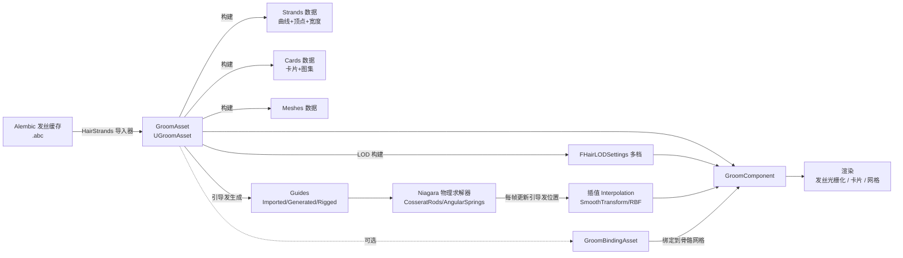
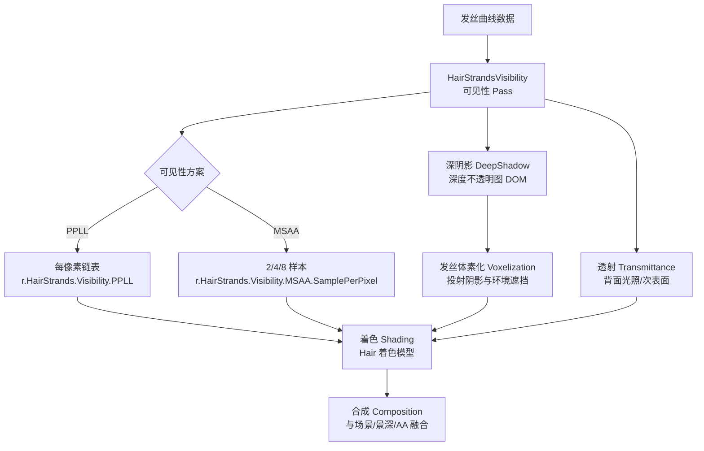
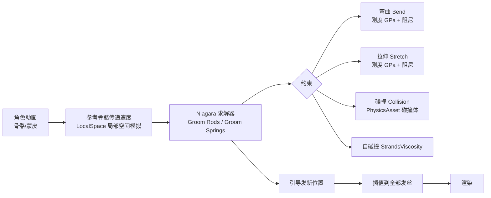

# 06 Groom 毛发系统
> 版本基准：UE 5.8.0（本机 `Engine/Build/Build.version`：CL 55116800，分支 `++UE5+Release-5.8`）。
> 兼容性边界：适用于 UE5.8 编辑器/运行时，UE4.27 与早期 UE5 仅作迁移背景，具体模块以正文为准。
> 官方参考：[Unreal Engine UE5.8 官方文档总页](https://dev.epicgames.com/documentation/en-us/unreal-engine)。
> 最后更新：2026-08-06（本轮元数据维护）。

> 源码依据：UE 5.8（`Engine\Plugins\Runtime\HairStrands\Source\HairStrandsCore\Public\GroomAsset.h`、`GroomBindingAsset.h`、`GroomAssetRendering.h`、`GroomAssetPhysics.h`、`GroomAssetInterpolation.h`；`Engine\Source\Runtime\Renderer\Private\HairStrands\*.cpp`）

## 1. 概述

**Groom** 是 UE 的毛发/羽毛解决方案，负责高质量的发丝（Hair Strands）、卡片（Cards）与网格（Meshes）三种几何表示的导入、模拟、渲染与 LOD 管理。它由 **HairStrands** 插件提供，核心资产类型有：

- **GroomAsset（毛发资产）**：存放发丝几何、引导发、LOD、物理、渲染分组等全部数据（`UGroomAsset`，`GroomAsset.h` 第 468 行附近）；
- **GroomBindingAsset（绑定资产）**：存放发丝与骨骼网格/几何缓存之间的绑定信息（`UGroomBindingAsset`，`GroomBindingAsset.h`），负责"头发跟着角色动"；
- **GroomCache（缓存资产）**：离线烘培的毛发动画序列（`UGroomCache`，`GroomCacheData.h`），可替代实时模拟。

Groom 渲染并不走传统的"三角形光栅化"思路：发丝是**曲线**（Curve），在 GPU 上以**发丝光栅化（Strands Rasterization）**方式逐像素生成片元，再通过**每像素链表（PPLL）或多重采样（MSAA）**解决半透明排序问题；阴影使用**深阴影贴图（Deep Shadow Map，深度不透明图）**表达"头发越密越挡光"；物理模拟基于 **Niagara**（Cosserat 杆 / 角弹簧求解器），只模拟少量**引导发（Guides）**，再插值出全部可见发丝。

UE 5.8 中 Groom 还支持实验性的 **Nanite 虚拟化几何体渲染发丝**（`r.HairStrands.Nanite`，见 `GroomAsset.cpp` 第 124 行注释：*"Experimental: Use Nanite to render groom geometry. Works only with non-simulated grooms and is incompatible with groom binding."*），即用 Nanite 的曲线光栅化管线（`RenderCurveRaster.cpp`）替代传统发丝光栅化。

阅读本文后，你应该能够：

- 说清 Strands / Cards / Meshes 三种表示的差异、适用场景与取舍；
- 理解 GroomAsset / GroomBindingAsset / GroomCache 的分工；
- 理解发丝渲染管线（Visibility → DeepShadow → Transmittance → Composition）与"虚拟化几何体"路径；
- 理解 Groom 物理模拟（Niagara 求解器 + 引导发插值）的工作方式；
- 会用 LOD、流送与 `r.HairStrands.*` 系列命令做质量/性能调优；
- 知道 Groom 的常见坑（闪烁、深阴影、绑定漂移、平台限制）与排查手段。

## 2. 核心概念

### 2.1 三种几何表示

`EGroomGeometryType`（`GroomAssetInterpolation.h`）只有三个值：`Strands`、`Cards`、`Meshes`。同一个 Groom 资产可以按 LOD 分别指定不同表示。

| 表示 | 英文 | 几何形态 | 渲染方式 | 典型用途 | 性能档位 |
| --- | --- | --- | --- | --- | --- |
| 发丝 | Strands | 成千上万条曲线（每根发丝一条曲线，顶点即曲线控制点） | 发丝光栅化（曲线扩展成片元）+ PPLL/MSAA 可见性 | 主角头部特写、影视级发质 | 最贵（GPU 密集、内存大） |
| 卡片 | Cards | 多层透明卡片（每层是一张带发丝纹理的三角面片） | 传统不透明/半透明光栅化 + 深度烘焙 | 中距离头发、刘海等 | 中等 |
| 网格 | Meshes | 实体网格（发块/发片模型） | 常规三角形光栅化 | 远距离、帽子内衬、非发丝造型 | 最便宜 |

### 2.2 资产与组件分工

| 概念 | 类（UE 5.8） | 职责 |
| --- | --- | --- |
| GroomAsset | `UGroomAsset` | 发丝/引导发几何、分组（`HairGroupsRendering` / `HairGroupsPhysics` / `HairGroupsInterpolation` / `HairGroupsLOD` / `HairGroupsCards` / `HairGroupsMeshes` / `HairGroupsMaterials`）、LOD 模式（`LODMode`）、RBF 插值开关（`EnableGlobalInterpolation`）、GroomCache 支持开关（`EnableSimulationCache`） |
| GroomBindingAsset | `UGroomBindingAsset` | 记录发丝与源/目标骨骼网格（`SourceSkeletalMesh` / `TargetSkeletalMesh`）或几何缓存（`SourceGeometryCache` / `TargetGeometryCache`）的绑定；绑定类型 `EGroomBindingType`：`Rigid`（刚性跟随）/ `Skinning`（蒙皮跟随） |
| GroomCache | `UGroomCache` | 预烘培的毛发动画（帧序列），运行时回放替代实时模拟 |
| GroomComponent | `UGroomComponent` | 场景中的放置与驱动单元，挂 GroomAsset + BindingAsset，控制实例化、LOD、模拟 |
| 引导发 | Guides | 少量"骨架"发丝（导入/生成/绑定三种来源，见 `EGroomGuideType`），只模拟它们，其余发丝插值得到 |
| 物理求解器 | `EGroomNiagaraSolvers` | `CosseratRods`（Groom Rods，杆模型）/ `AngularSprings`（Groom Springs，角弹簧模型）/ `CustomSolver`（自定义 Niagara 系统） |

### 2.3 关键枚举与设置项（源码对照）

| 枚举/结构 | 取值（UE 5.8） | 说明 |
| --- | --- | --- |
| `EGroomLODMode` | `Default` / `Manual` / `Auto` | Auto 按屏幕覆盖率自动增减曲线与顶点；Manual 用离散 LOD 档位；Default 跟随项目设置 |
| `FHairLODSettings` | `CurveDecimation`、`VertexDecimation`、`AngularThreshold`、`ScreenSize`、`ThicknessScale`、`bVisible`、`GeometryType`、`BindingType` | 每档 LOD 的曲线/顶点简化比例、启用屏幕尺寸、厚度补偿、几何表示切换 |
| `EGroomInterpolationType` | `None` / `RigidTransform` / `OffsetTransform` / `SmoothTransform`（默认） | 从引导发到可见发丝的插值方式，`GroomAssetPhysics.h` |
| `FHairGeometrySettings` | `HairWidth`、`HairRootScale`、`HairTipScale` | 发丝宽度（厘米）与根部/尖部缩放 |
| `FHairShadowSettings` | `HairShadowDensity`、`HairRaytracingRadiusScale`、`bUseHairRaytracingGeometry`、`bVoxelize` | 阴影密度、光追半径缩放、是否参与光追、是否体素化投射阴影/AO |
| `FHairAdvancedRenderingSettings` | `bUseStableRasterization`（稳定光栅化防闪烁）、`bScatterSceneLighting`（用场景色照亮绒毛） | 高级渲染开关 |
| `EGroomGuideType` | `Imported` / `Generated` / `Rigged` | 引导发来源：导入资产自带 / 从发丝生成（密度 `HairToGuideDensity`）/ 由骨骼网格生成刚性引导发 |

## 3. 原理详解

### 3.1 资产数据流：从导入到渲染



要点：

- 导入时引擎把曲线数据拆成 **Strands / Guides** 两组：Guides 数量远少于 Strands（典型 1:10~1:50）；
- **插值**：每根可见发丝由附近若干根引导发按权重插值而来，运行时只移动引导发，插值在 GPU 上完成；
- **LOD**：`LODMode = Auto` 时按屏幕覆盖率动态降曲线/顶点数，并用 `ThicknessScale` 补偿"发量变少导致的变稀"；
- **绑定**：`GroomBindingAsset` 把发根投影到骨骼网格三角面上并记录（三角形索引、重心坐标、蒙皮权重），角色动画时头发跟随皮肤（Skinning）或附着点（Rigid）。

### 3.2 发丝渲染管线（Strands 光栅化）

发丝不是三角形，渲染分多个 Pass（对应 `Renderer\Private\HairStrands\` 下的文件）：



各阶段说明：

- **Visibility（可见性）**：把每根发丝扩展成屏幕空间片元，写入可见性缓冲。两种方案：**PPLL**（每像素链表，支持任意深度复杂度，贵）与 **MSAA**（每像素 2/4/8 个采样点，`r.HairStrands.Visibility.MSAA.SamplePerPixel`，性价比高，5.8 默认方案（默认 8 采样））；
- **DeepShadow（深阴影）**：对每个光源渲染"深度不透明图"，沿光线方向记录**多个深度层级的密度**，头发多的地方阴影更深——这是传统阴影贴图做不到的（`r.HairStrands.DeepShadow.Resolution` 默认 2048）；
- **Voxelization（体素化）**：把发丝体素化成低分辨率密度场，用于投射阴影、环境遮挡与光追的粗粒度加速（`bVoxelize`，`r.RayTracing.Shadows.EnableHairVoxel`）；
- **Transmittance（透射）**：计算光线穿过发丝的透过率，模拟"逆光下头发透光发亮"；
- **Composition（合成）**：把毛发结果合成进场景颜色、深度与运动矢量，参与 TAA/TSR、景深。

### 3.3 虚拟化几何体（Nanite Strands）路径

UE 5.8 起可用 Nanite 渲染发丝（`r.HairStrands.Nanite`，实验性）：

- 发丝曲线被转换成 Nanite 可处理的**曲线几何体**，由 `RenderCurveRaster.cpp` 的曲线光栅化管线（`AddRenderCurveRasterPipeline`）绘制；
- 走 Nanite 的**虚拟化几何体**体系：按需流送、集群化 LOD、Visibility Buffer，几何内存与三角形预算逻辑与 Nanite 网格一致；
- 限制（源码注释明确）：**只能用于非模拟的 Groom，且与 GroomBindingAsset 不兼容**——即静态摆拍/远处毛发，不能用于带物理模拟或绑定的角色头发；
- 切换：项目需启用 Nanite（DX12/Vulkan + SM6），资产构建时生成 Nanite 数据（`UGroomAsset::HasValidNaniteData()` / `UsesNanite()`），并有 `HasNaniteFallbackMesh()` 提供不支持平台的回退。

### 3.4 物理模拟



关键点（对照 `GroomAssetPhysics.h`）：

- **只模拟引导发**：物理求解的对象是 Guides（几百到几千条），可见发丝靠插值跟随，这是性能关键；
- **求解器**：`CosseratRods`（Groom Rods）基于弹性杆力学，适合长发大摆幅；`AngularSprings`（Groom Springs）基于角弹簧，更快但动态略硬；
- **约束参数**：`BendStiffness` / `StretchStiffness`（单位 GPa）、`BendDamping` / `StretchDamping`、碰撞摩擦（`StaticFriction` / `KineticFriction`，默认 0.1）、自碰撞黏度（`StrandsViscosity`）、碰撞半径（`CollisionRadius`，默认 0.001 cm）；
- **局部空间模拟**：`bLocalSimulation = true` 时在角色局部空间解算，配合 `LinearVelocityScale` / `AngularVelocityScale` 把骨骼速度传入，避免角色快速移动时头发"拖尾漂移"；`TeleportDistance`（默认 50cm）超过阈值自动重置模拟防穿帮；
- **模拟缓存**：`EnableSimulationCache`（UGroomAsset 资产属性，5.8 无同名 CVar）允许运行时挂载 GroomCache 替代实时求解。

### 3.5 LOD 与流送

- **LOD 三要素**：`CurveDecimation`（曲线数）、`VertexDecimation`（每根曲线顶点数）、`ScreenSize`（触发距离），每档可配 `ThicknessScale` 补偿视觉密度；
- **Auto LOD**：`LODMode = Auto` 时按屏幕覆盖率连续简化，`AutoLODBias`（-1~1）整体偏移触发尺寸（`r.HairStrands.AutoLOD.Bias` / `r.HairStrands.AutoLOD.Force`）；
- **几何表示随 LOD 切换**：LOD0 用 Strands，LOD2 切 Cards，LOD3 切 Meshes——这是"高质量 + 低成本"的标配打法；
- **流送**：`r.HairStrands.Streaming` 控制发丝数据按需加载（曲线页），`r.HairStrands.Streaming.Prediction` 预取；内存大头是 Strands 顶点缓冲，Cards/Meshes 表示可大幅降低驻留内存；
- **MinLOD**：`UGroomAsset::MinLOD`（`FPerPlatformInt`）按平台钳制最低 LOD，移动端可直接禁用 Strands。

## 4. 材质 / 配置示例

### 4.1 毛发材质要点

毛发材质使用 **Hair（SubsurfaceProfile 之外的专用）着色模型**，核心输入：

| 输入 | 含义 | 典型值 |
| --- | --- | --- |
| Base Color / Scatter | 发色（漫反射/散射色） | 0.02~0.2（发色很暗） |
| Tangent | 发丝切线（沿发丝方向） | 由引擎自动提供，也可自定义扰动 |
| Backlit | 透光强度（Transmittance 系数） | 0.1~1.0 |
| Specular / Roughness | 高光强度与粗糙度 | Specular 0.1~1.0，Roughness 0.1~0.6 |
| Primary/Secondary Specular | 主瓣/次瓣高光（沿切线偏移的双高光，模拟真实头发的高光带） | 见材质节点 "Hair Secondary Specular" |

常用节点链：

- **切线控制**：`Tangent` 输入接噪声/渐变扰动，可做出"发丝间高光错位"的自然感；
- **AO**：材质里用 `Hair Ambient Occlusion` 或烘焙的 **Follicle Mask** 贴图（发根掩码，`GroomCreateFollicleMaskOptions`）压暗发根；
- **Scatter Scene Lighting**：开启 `bScatterSceneLighting` 后，短绒毛（汗毛/胎毛）会吸收周围皮肤的光，用于角色面部绒毛。

### 4.2 Groom 资产分组配置模板

一个角色 Groom 资产建议按"发片"分组（`HairGroupsInfo` 可见性开关），每组独立设置：

```text
Group 0「主发」：Strands LOD0-1，Auto LOD，物理 Groom Rods，DeepShadow 2048
Group 1「刘海」：Strands LOD0-1，绑定 Skinning，无物理或轻物理
Group 2「发际/绒毛」：Strands + ScatterSceneLighting，宽度 0.01cm 级，无深阴影
Group 3「远景兜底」：LOD2 切 Cards，LOD3 切 Meshes，关闭物理与光追几何
```

### 4.3 常用 `r.HairStrands.*` 命令清单（UE 5.8 源码确认）

| 命令 | 作用 | 备注 |
| --- | --- | --- |
| `r.HairStrands.Nanite` | 用 Nanite 渲染发丝（实验性） | 仅非模拟、无绑定的 Groom；只读 CVar |
| `r.HairStrands.Visibility.MSAA.SamplePerPixel` | 发丝可见性 MSAA 采样数（2/4/8，5.8 默认 8） | 4 是质量/性能平衡点 |
| `r.HairStrands.Visibility.PPLL` | 启用每像素链表方案 | 与 MSAA 二选一 |
| `r.HairStrands.Visibility.Compute.SamplePerPixel` | Compute 路径可见性采样数 | |
| `r.HairStrands.DeepShadow.Resolution` | 深阴影分辨率（默认 2048） | 阴影软/硬与性能 |
| `r.HairStrands.MaxSimulatedLOD` | 允许模拟的最高 LOD | 远处 LOD 停止模拟，省大量 CPU/GPU |
| `r.HairStrands.Streaming` | 发丝数据流送开关 | `stat streaming` 观察 |
| `r.HairStrands.AutoLOD.Bias` / `AutoLOD.Force` | Auto LOD 偏移/强制 | 对应资产 `AutoLODBias` |
| `r.HairStrands.UseCardsInsteadOfStrands` | 全局强制卡片替代发丝 | 低端机应急手段 |
| `r.HairStrands.StrandWidth` | 全局发丝宽度缩放 | 快速调"发量感" |
| `r.HairStrands.VelocityType` | 运动矢量过滤（0 平均/1 最近/2 最大） | 防拖影 |

### 4.4 绑定资产创建流程

1. 导入 `GroomAsset`（Alembic，勾选导入 Guides）；
2. 准备 `SkeletalMesh`（角色模型，发根区域面数不要太少）；
3. 右键 GroomAsset → **Create Binding Asset**：选 `GroomBindingType = Skinning`，指定 `TargetSkeletalMesh`；
4. 把 `GroomBindingAsset` 赋给 `GroomComponent` 的 Binding 槽位；
5. 若角色换装/换体型：`SourceSkeletalMesh`（作绑定用的原模型）与 `TargetSkeletalMesh`（实际驱动模型）分开指定，绑定数据按 LOD 与蒙皮权重烘焙；
6. 发型修正可参考 `RiggedGuideNumCurves` / `RiggedGuideNumPoints`（骨骼引导发）与 RBF 全局插值（`EnableGlobalInterpolation`，`r.HairStrands.RBFLocalSpace`）。

## 5. 最佳实践

### 5.1 资产与制作

- **引导发决定上限**：Guides 数量与分布决定动态质量，先调 Guides 再调插值；`HairToGuideDensity` 从 0.1 起步；
- **宽度用真实值**：`HairWidth` 用厘米级真实发径（0.01~0.06cm），再靠 `HairRootScale`/`HairTipScale` 做渐变；根粗尖细是"自然感"的关键；
- **LOD 三档起步**：LOD0 Strands（近景）、LOD1 Strands 简化 + 降低 MSAA、LOD2 Cards（中远景）、LOD3 Meshes（远景/剪影）；
- **深阴影按需**：只有"被强光照射且有实体感需求"的主发开 DeepShadow；绒毛、远景发组关闭（`HairShadowDensity` 调小）；
- **绑定资产与 Groom 资产同版本管理**：改过骨骼网格（拓扑/权重）后必须重建绑定，否则出现"头发插入头皮"或飘移。

### 5.2 性能预算（PC 参考）

| 项 | 预算建议 |
| --- | --- |
| 可见发丝曲线 | 主角 8~20 万根；NPC 2~5 万根；远景组走 Cards/Meshes |
| 每根曲线顶点 | 8~32（LOD0 取上限，LOD1 减半） |
| Visibility 采样 | MSAA 4（主机/中端 PC），8 仅特写 |
| 模拟引导发 | 500~3000 条，超过 5000 条需评估 |
| 模拟求解器 | 优先 AngularSprings，长发才用 CosseratRods |
| DeepShadow | 仅 1~2 个关键光开启；分辨率 1024~2048 |
| 显存 | Strands 顶点流送池按角色数 x 5~10MB 估算，开 `r.HairStrands.Streaming` |

### 5.3 常见坑位速查

- **头发闪烁/爬动**：`bUseStableRasterization` 未开、MSAA 采样不足、或 LOD 切换过频——开稳定光栅化，AutoLOD 加 Bias；
- **阴影"糊成一团"**：DeepShadow 分辨率低或 `HairShadowDensity` 过高；调 `r.HairStrands.DeepShadow.Resolution`；
- **逆光不透亮**：材质 Backlit 太低或 Transmittance 未启用；毛发材质里接 `Backlit`；
- **移动太快头发漂**：`bLocalSimulation` 关掉或 `LinearVelocityScale` 过低；调 `TeleportDistance`；
- **绑定后头发乱飞**：重建 Binding Asset；确认 `GroomBindingType`（Skinning vs Rigid）；
- **内存爆**：`stat streaming` 看 Strands 页占用，降 LOD 顶点数、开流送、用 Cards 表示；
- **平台不支持**：移动端/低端 DX11 走 Cards/Meshes 兜底，`MinLOD` 按平台钳制。

## 6. 常见问题 FAQ

**Q1：Groom 与骨骼网格（Skeletal Mesh）是什么关系？**
Groom 本身不参与骨骼蒙皮；它通过 GroomBindingAsset 把发根"钉"在骨骼网格表面，再叠加物理模拟的引导发偏移。骨骼网格只是"皮肤载体"。

**Q2：为什么我的头发没有影子/影子太浅？**
检查该组 `FHairShadowSettings`：`bVoxelize` 是否开启、`HairShadowDensity` 是否过小、灯光是否在 DeepShadow 渲染列表（`r.HairStrands.DeepShadow` 相关日志）；毛发阴影也需要灯光 `Cast Volumetric Shadow` 配合体积雾。

**Q3：Nanite Strands 什么时候用？**
静态展示、远景毛发、无模拟无绑定的场景（如雕塑、建筑装饰）——可享受 Nanite 的几何流送与低 Draw Call。带物理或绑定就回到传统发丝光栅化。

**Q4：Cards 和 Meshes 怎么生成？**
编辑器中对 GroomAsset 执行 **Create Cards**（自动铺卡片+烘焙图集，`EHairAtlasTextureType`：Depth/Tangent/Attribute/Coverage/Material）与 **Create Meshes**；卡片密度与层数决定中景质量。

**Q5：如何让头发参与 Lumen / 光追？**
开启 `bUseHairRaytracingGeometry` 后发丝可进入光追场景（`r.RayTracing.Shadows.EnableHairVoxel` 提供体素化加速）；Lumen 对毛发支持有限，间接光常以体素化毛发 + 环境光补偿。

**Q6：GroomCache 和实时模拟怎么选？**
需要完全可控、可反复回放的表现（过场动画）用 GroomCache；需要交互响应（玩家角色）用实时模拟；两者可通过 `EnableSimulationCache` 在运行时切换。

**Q7：头发在裁剪面/景深处闪烁？**
发丝是极薄的几何，与相机裁剪面、DOF 散景交互易闪；保持 `r.HairStrands.VelocityType = 1`（最近速度）并确保毛发深度写入正确，必要时用 `r.HairStrands.Visibility.ResolutionScaleAware` 适配分辨率缩放。

**Q8：Groom 的显存占用怎么看？**
`stat streaming`（看 Strands 页流送）、`stat gpu`（看 HairStrands 各 Pass 耗时）、以及 `r.HairStrands.Dump.GroomAsset`（导出资产诊断信息）。显存大头依次是：Strands 顶点缓冲 > DeepShadow 图集 > Cards 图集 > 体素化缓冲。

**Q9：角色换发型时绑定资产要重建吗？**
只要**几何拓扑或发根位置**变化就需要重建绑定；仅改材质/宽度/颜色不需要。换体型（骨骼网格变化）必须用新 `TargetSkeletalMesh` 重建，并核对 `SourceMeshRequestedLOD` 与 `TargetMeshRequestedMinLOD` 的匹配。

## 7. 关联阅读

- 本目录 `01-渲染管线概览.md`：发丝渲染在延迟/前向管线中的位置；
- 本目录 `04-Nanite与Lumen.md`：虚拟化几何体（Nanite）与全局光照原理，Nanite Strands 依赖同一套体系；
- 本目录 `03-光照与阴影系统.md`：深阴影贴图与体积阴影的配合；
- 本目录 `09-光线追踪与路径追踪.md`：`r.RayTracing.Shadows.EnableHairVoxel`、光追反射中毛发的处理；
- 引擎源码：`Engine\Plugins\Runtime\HairStrands\Source\HairStrandsCore\Public\GroomAsset.h`、`GroomAssetPhysics.h`、`GroomBindingAsset.h`；`Engine\Source\Runtime\Renderer\Private\HairStrands\`（Visibility / DeepShadow / Transmittance / RenderCurveRaster）；
- 官方文档：Hair Rendering and Simulation（Groom）页面，UE 5.8 Release Notes 中 HairStrands 部分（Nanite Strands 实验特性）。

> 版本提示：本文 API 与命令均以本机 UE 5.8 源码为准；引擎版本升级后请重新核对 CVar 与枚举（如 `r.HairStrands.Nanite` 为实验特性，后续版本行为可能变化）。

## 8. 附录

### 8.1 调试视图与统计

| 手段 | 用途 |
| --- | --- |
| `stat gpu`（HairStrands 段） | 各 Pass 耗时：Visibility / DeepShadow / Transmittance / Composition |
| `stat streaming`（HairStrands 段） | 曲线页流送状态与内存 |
| `r.HairStrands.ViewMode` 系列（5.8） | 引导发、插值权重、LOD 档位、集群可视化 |
| `r.HairStrands.ViewMode.ClumpIndex` | 按发簇着色，检查分组归属 |
| `r.HairStrands.Interpolation.Debug` | 插值质量检查（每根可见发丝到引导发的映射） |
| `r.HairStrands.Cluster.Culling`（5.8 无此 CVar） | 集群剔除为固定管线，无控制台开关 |
| `r.HairStrands.Dump.GroomAsset` / `Dump.GroomComponent` | 导出资产/组件诊断信息 |

### 8.2 术语表

| 术语 | 含义 |
| --- | --- |
| Strands | 发丝（曲线几何） |
| Guides | 引导发（物理模拟对象） |
| Cards / Meshes | 卡片（多层透明面片）/ 网格（实体模型）表示 |
| GroomAsset | 毛发资产（几何+分组+物理+LOD） |
| GroomBindingAsset | 绑定资产（发根到骨骼网格/几何缓存） |
| GroomCache | 预烘培毛发动画 |
| Interpolation | 引导发 → 可见发丝插值（SmoothTransform/RBF） |
| Deep Shadow（DOM） | 深度不透明图（多层密度阴影） |
| Transmittance | 透射（逆光透亮） |
| PPLL | 每像素链表可见性方案 |
| Voxelization | 发丝体素化（阴影/AO/光追加速） |
| Nanite Strands | 用 Nanite 虚拟化几何体渲染发丝（实验性） |
| 稳定光栅化 | `bUseStableRasterization` 防闪烁采样 |

### 8.3 一句话总结

```text
Groom = 曲线几何（Strands）+ 引导发模拟（Niagara）+ 插值渲染（PPLL/MSAA + 深阴影 + 透射），
LOD 从 Strands 逐级降为 Cards/Meshes，Nanite Strands 把几何虚拟化带进毛发（实验性）。
```
