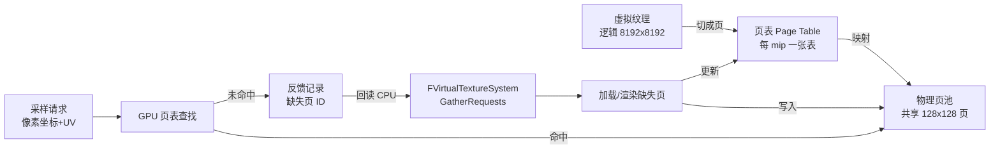
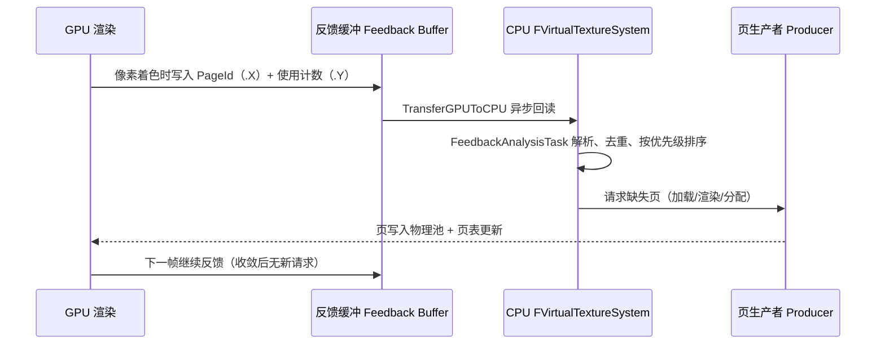
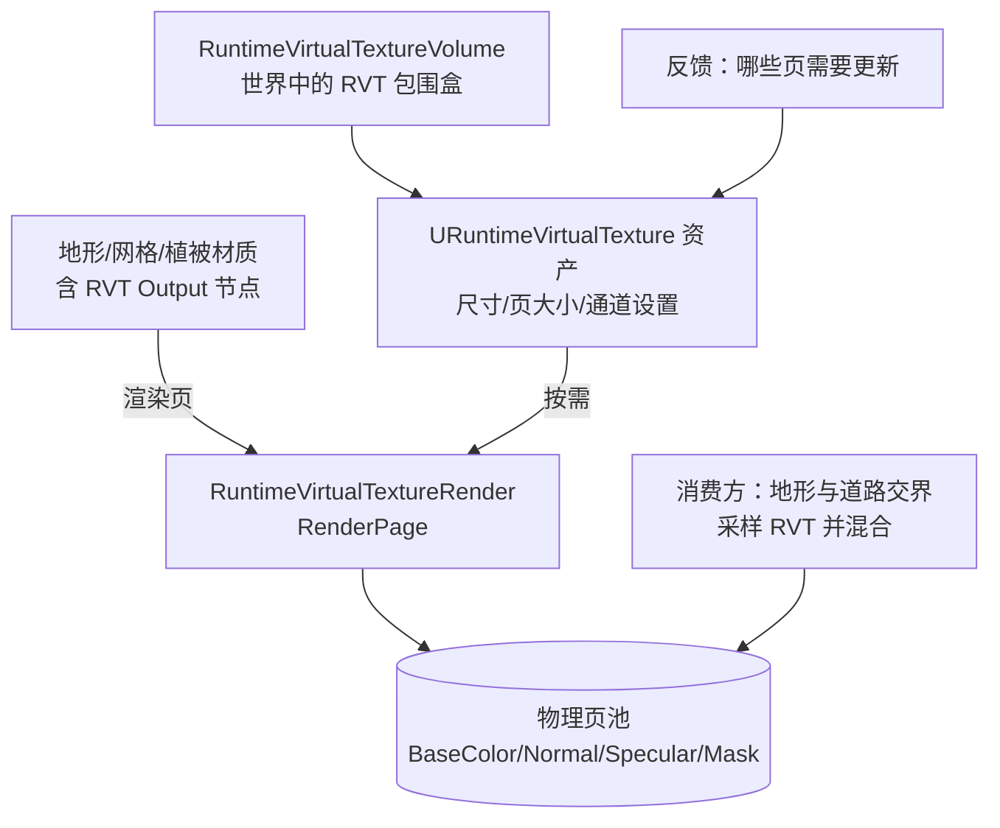
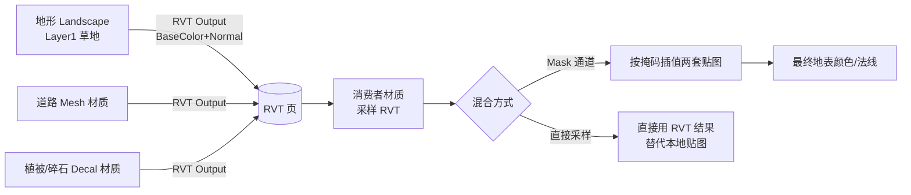
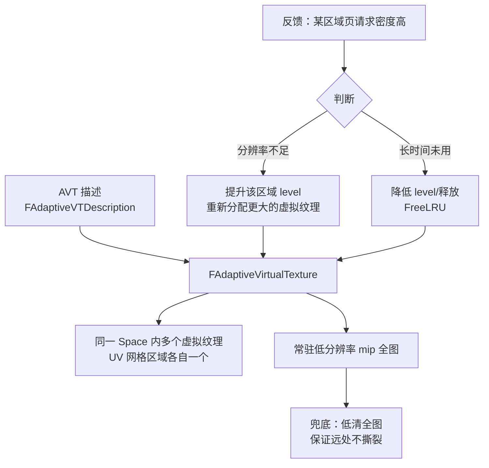

# 07 虚拟纹理与材质混合

> 源码依据：UE 5.8（`Engine\Source\Runtime\Renderer\Private\VT\VirtualTextureSystem.cpp`、`RuntimeVirtualTextureRender.cpp`、`AdaptiveVirtualTexture.cpp`、`VirtualTextureFeedback.cpp`、`TexturePagePool.cpp`、`TexturePageMap.cpp`）

## 1. 概述

**虚拟纹理（Virtual Texture，VT）** 是一种"按需加载、按页缓存"的纹理管理思想：纹理不再整张驻留显存，而是切成等大的 **Page（页）**，只把屏幕上真正需要的页上传到 **物理页池（Physical Page Pool）**，通过 **页表（Page Table）** 把虚拟地址映射到物理位置。

Unreal Engine 中的 VT 家族包括：

- **SVT（Streaming Virtual Texture）**：把已有的超大纹理资产（如 8K/16K 贴图）转成虚拟纹理流送，解决显存与加载压力；
- **RVT（Runtime Virtual Texture）**：**运行时实时渲染生成**的虚拟纹理——把场景中真实几何（地形、网格、植被）的材质结果**现场烘培**到虚拟纹理页里，再供其他表面（如地形与道路交界）采样混合；
- **AVT（Adaptive Virtual Texture）**：RVT 的**自适应分辨率变体**（`AdaptiveVirtualTexture.cpp`）——用反馈信息按区域动态分配分辨率，同一张 RVT 里近处高分辨率、远处低分辨率。

RVT 的核心价值是**材质混合（Material Blending）**：地形、道路、泥地、雪地交界处可以"像 Photoshop 图层一样"自然融合，且融合结果对远处物体（LOD 切换、阴影、Lumen 表面缓存）保持一致，彻底告别"接缝、闪烁、远近不一致"。

虚拟纹理与 Nanite、Virtual Shadow Map（VSM）同属 UE5 的"**虚拟化（Virtualized）**"技术家族：Nanite 虚拟化几何体、VSM 虚拟化阴影页、VT 虚拟化贴图数据——三者共享"按需分配 + 页表映射 + 反馈驱动"的哲学（详见本目录 04 篇）。

阅读本文后，你应该能够：

- 理解 VT 的 Page / PageTable / Physical Pool / Feedback 核心机制；
- 理解 RVT 的"实时烘培 + 材质混合"工作流与适用场景；
- 理解 Adaptive Virtual Texture 的分辨率自适应原理；
- 会配置 RVT 资产、材质输出节点与地形应用；
- 会用 `r.VT.*`、`r.VT.RVT.*`、`r.VT.AVT.*` 系列命令调优；
- 说清 VT 与 Nanite / VSM 的异同与配合方式。

## 2. 核心概念

| 概念 | 英文 | 含义 |
| --- | --- | --- |
| 页 / 图块 | Page / Tile | VT 的基本单位（默认 128x128 或 256x256 像素），纹理被切成等大页 |
| 虚拟纹理空间 | Virtual Texture Space | 一个逻辑上的"无限大"纹理坐标空间，页表定义其映射 |
| 物理页池 | Physical Page Pool / Physical Space | 显存中固定大小的页集合，被所有虚拟纹理共享 |
| 页表 | Page Table（`TexturePageMap.cpp`） | 虚拟页 → 物理页的映射表，GPU 采样时按页表寻址 |
| 反馈 | Feedback（`VirtualTextureFeedback.cpp`） | GPU 在渲染时记录"哪些页被用到了"，回读给 CPU 作为请求依据 |
| 生产者 | Producer（`VirtualTextureProducer.cpp`） | 负责"生产"页内容的源（流送文件、RVT 实时渲染、AVT 分配） |
| 分配虚拟纹理 | Allocated Virtual Texture | 一个具体被使用的虚拟纹理实例（含页表、mip、关联的 producer 与 space） |
| 边界 | Borders（`r.VT.Borders`） | 页边缘多出的采样保护带，防止双线性/三线性过滤在页边界采样到邻居内容 |
| Mip Bias | `r.VT.Residency.*` | 显存吃紧时允许整体降低 mip 的自动手段（Residency 跟踪） |
| 反馈延迟 | `r.vt.FeedbackLatency` | 从"GPU 记录使用"到"CPU 处理请求"的帧延迟 |
| 材质混合 | Material Blending | RVT 输出多个通道（BaseColor/Normal/Roughness/Mask），采样端按权重混合 |

## 3. 原理详解

### 3.1 页表与物理池：VT 的心脏



关键实现（`VirtualTextureSystem.cpp`）：

- **系统单例** `FVirtualTextureSystem`：`Initialize()` 创建物理池与页表，每帧 `BeginUpdate()` → `SubmitRequests()` → `EndUpdate()` 驱动整条流水线；
- **请求合并**：`RequestTiles()` 把屏幕各处的页请求收集进 `UniqueRequestList`，`GatherRequests()` 按优先级合并去重（`r.VT.SortTileRequestsByPriority`）；
- **页表更新**：`SubmitRequests()` / `FinalizeRequests()` 把新页写入物理池并**原子更新页表**（`r.VT.MaskedPageTableUpdates`），避免采样到半成品页；
- **页池扩展**：`GrowPhysicalPools()` 在压力大时自动增大物理池；
- **Residency 跟踪**：`UpdateResidencyTracking()` 监控显存驻留率，配合 `r.VT.Residency.UpperBound/LowerBound/AdjustmentRate/MaxMipMapBias` 自动降 mip 而非爆显存。

### 3.2 反馈回路：谁在看什么页



细节（源码对照）：

- 反馈缓冲是 GPU 上的低分辨率缓冲（默认约 1/16 屏幕分辨率，`r.vt.FeedbackDefaultBufferSize`），每个纹素记录"该区域最需要的页 ID 与计数"；
- `FVirtualTextureFeedback::TransferGPUToCPU()` 把缓冲异步拷回 CPU，**反馈数据格式：`.X = PageId, .Y = PageCount`**；
- CPU 端 `GatherFeedbackRequests()` 合并反馈请求与锁页请求（`GatherLockedTileRequests`，用于固定持续更新的区域），交给 `GatherRequestsTask`（可多线程，`r.VT.AsyncPageRequestTask`）分析；
- `r.vt.FeedbackOverdrawFactor` / `r.vt.FeedbackCompactionFactor` / `r.vt.FeedbackLatency` 控制反馈缓冲的采样密度、压缩与延迟；
- **Playback 模式**（`r.VT.EnablePlayback`）：录制/回放反馈流，用于离线分析"哪些页被请求"。

### 3.3 RVT：运行时实时烘培



要点：

- **谁生产**：RVT 范围内的静态几何（Landscape、Static Mesh、植被）材质里接了 **Runtime Virtual Texture Output** 节点，页被请求时引擎把该区域"重新渲染一遍"进页（`FRuntimeVirtualTextureRender::RenderPage`，`RuntimeVirtualTextureRender.cpp`）；
- **生产什么**：一个 RVT 资产可输出多组通道——BaseColor、Normal、Roughness/Specular/Metallic、Mask（自定义掩码），页大小与通道组在资产上配置；移动端可用 ASTC 压缩（`r.VT.RVT.ASTC` / `r.VT.RVT.ASTC.High`）与直接压缩（`r.VT.RVT.DirectCompress`）；
- **怎么消费**：任何材质都可以采样该 RVT（`RuntimeVirtualTextureSample` 节点），最常见的用法是**地形材质混合**：地形 Layer 0 输出 BaseColor+Normal 到 RVT，道路材质采样 RVT 后按 Mask 混合出"路沿泥渍、车辙"等效果，交界处连续、无接缝；
- **谁更新**：反馈机制发现页失效（物体移动/材质变化）才重渲染，静止场景几乎零开销；`r.VT.ForceContinuousUpdate` 可强制持续更新（调试用）；
- **边界**：页边缘有 `r.VT.Borders` 采样保护带（`RuntimeVirtualTextureRender.cpp` 中 `CVarBorders` / `CVarBordersMip`），过滤时不会漏到邻页。

### 3.4 材质混合：RVT 与 Layer 权重



混合模式：

- **Mask 混合**：RVT 输出一张 Mask（或 Height），消费者按 Mask 在"本地贴图"与"RVT 内容"间插值——经典"路面与草地交界"；
- **完全替代**：整个表面直接用 RVT 采样（地表美术全部进 RVT），材质只剩采样与光照，移动端常用（省贴图采样数）；
- **多 RVT 叠加**：不同区域用不同 RVT（如"战场泥地"与"干净基地"），按权重混合；
- **高度图混合（Height Blend）**：地形材质层之间用 Height 做软混合，RVT 捕获混合结果后，远处 LOD 网格也能得到一致的地表颜色——这是"RVT 解决地形 LOD 闪变"的关键。

### 3.5 Adaptive Virtual Texture（自适应 RVT）



源码注释（`AdaptiveVirtualTexture.h`）原文要点：

> "This allocates multiple virtual textures within the same space: one each for a grid of UV ranges, and an additional persistent one for the low resolution mips. We use the virtual texture feedback to decide when to increase or decrease the resolution of each UV range."

即：AVT 把 RVT 的 UV 域切成网格，**每个格子单独分配分辨率**（近处高、远处低），外加一张**常驻低分辨率全图**兜底；反馈决定每个格子何时升/降级。调优命令（`r.VT.AVT.*`）：

| 命令 | 作用 |
| --- | --- |
| `r.VT.AVT.MaxAllocPerFrame` | 每帧最多新分配数 |
| `r.VT.AVT.MaxFreePerFrame` | 每帧最多释放数 |
| `r.VT.AVT.MaxPageResidency` | 单格最大驻留页数 |
| `r.VT.AVT.AgeToFree` | 多久未使用可释放（LRU） |
| `r.VT.AVT.PoolResidencyToFree` | 物理池压力阈值触发释放 |
| `r.VT.AVT.LevelIncrement` | 升降级步长 |

### 3.6 与 Nanite / VSM 的关系

| 技术 | 虚拟化的对象 | 页表映射 | 反馈驱动 | 关系 |
| --- | --- | --- | --- | --- |
| Nanite | 几何（Cluster/Page） | 几何页表 | 屏幕空间误差（非反馈缓冲） | RVT 可采样 Nanite 渲染结果吗？——RVT 页渲染时 Nanite 网格按常规路径进入页内容 |
| VSM（Virtual Shadow Map） | 阴影贴图页 | 阴影页表 | 灯光视锥 + 反馈 | 与 RVT 独立；但 RVT 捕获的地表 Mask 影响阴影接收 |
| RVT / AVT | 贴图数据页 | 纹理页表 | GPU 反馈缓冲 | 与两者互补：几何/阴影虚拟化 + 纹理虚拟化 |

实践结论：

- **Nanite + RVT**：Nanite 网格（含植被）可以作为 RVT 的生产者被烘培进页，但要注意页渲染开销——把"低变化、大面积"的表面交给 RVT，高动态物体不进 RVT；
- **VSM + RVT**：VSM 提供阴影页，RVT 提供地表材质一致性，二者配合解决"地形阴影与地表颜色在 LOD 切换时一起闪"的问题；
- **共同哲学**：三者都是"物理资源有限、逻辑资源无限、按需分配"——理解 VT 的页表思想有助于理解 Nanite 与 VSM 的内部结构（04 篇有详述）。

## 4. 材质 / 配置示例

### 4.1 RVT 资产配置

创建 **Runtime Virtual Texture** 资产（`URuntimeVirtualTexture`），关键项：

| 配置项 | 推荐值 | 说明 |
| --- | --- | --- |
| Size（虚拟尺寸） | 2048~8192 | 覆盖区域越大，页越粗；按"像素/世界米"反推 |
| Tile Size | 128 或 256 | 页大小，`r.VT.Borders` 保护带随之缩放 |
| Tile Count | 按尺寸自动 | 页数 = Size² / TileSize² |
| Material Type | BaseColor / Normal / RoughnessSpecularMetallic / WorldHeight / Mask 等组合 | 决定每页通道布局（页内存随通道数增长） |
| Compression | ASTC（移动端）/ BC 系列 | `r.VT.RVT.ASTC` 控制 |
| Use Streaming Mips | 建议开 | 远处用低 mip 流送 |

### 4.2 生产者材质：RVT Output 节点

地形/网格材质里添加 **Runtime Virtual Texture Output** 节点并连接到 RVT 资产：

```text
材质（Landscape Layer 混合）：
  BaseColor ──→ RVT Output.BaseColor
  Normal   ──→ RVT Output.Normal
  Roughness──→ RVT Output.RoughnessSpecularMetallic (RGB)
  Mask     ──→ RVT Output.Mask (自定义：湿滑/泥泞/雪覆盖)
```

注意事项：

- 生产材质里**不要放视角相关效果**（视差、Fresnel 驱动的变色、屏幕空间节点）——页是离线视角渲染的，视角效果会"固化"进页导致穿帮；
- 世界高度（WorldHeight）通道常用于雪线/水位混合；
- 页渲染开销 = 页面积内的材质复杂度，生产材质保持轻量（避免巨大纹理采样链）。

### 4.3 消费者材质：采样与混合

```text
道路材质：
  RuntimeVirtualTextureSample(该 RVT)
    ├─ BaseColor ──→ 与本地沥青贴图按 Mask 插值
    ├─ Normal ──→ 与本地法线混合（Lerp）
    ├─ Mask(泥渍) ──→ 控制插值权重
    └─ Roughness ──→ 直接输出（湿路面反光来自 RVT）
```

### 4.4 地形应用与 Volume 放置

1. 场景放 **Runtime Virtual Texture Volume**（`URuntimeVirtualTextureComponent`），拉伸包围盒覆盖地形与道路交界区域；
2. Landscape 材质挂 RVT Output（勾选 Landscape 的 `Use Landscape Material` + RVT 关联）；
3. 道路/贴花材质采样 RVT；
4. 打开 `r.VT.RVT` 相关调试视图确认页覆盖与 mip（`r.VT.Dump` 查看页表统计）；
5. 自适应版本：使用 **Runtime Virtual Texture 资产勾选 Adaptive**（或放置 Adaptive RVT Volume），AVT 自动按区域分配分辨率，适合"巨大地形 + 关键区域特写"。

### 4.5 常用 `r.VT.*` 命令清单（UE 5.8 源码确认）

| 命令 | 作用 |
| --- | --- |
| `r.VT.EnableFeedback` / `r.VT.EnableFeedback.Produce` | 反馈回路总开关 / 是否允许按反馈生产页 |
| `r.vt.FeedbackLatency` / `r.vt.FeedbackDefaultBufferSize` | 反馈延迟 / 反馈缓冲尺寸 |
| `r.vt.FeedbackOverdrawFactor` / `r.vt.FeedbackCompactionFactor` | 反馈采样密度 / 压缩系数 |
| `r.VT.Borders` / `r.VT.Borders.Mip` | 页边界保护带（mip 相关） |
| `r.VT.Residency.UpperBound/LowerBound/AdjustmentRate/MaxMipMapBias` | 显存驻留自动降级策略 |
| `r.VT.SortTileRequestsByPriority` | 页请求按优先级排序 |
| `r.VT.AsyncPageRequestTask` | 异步页请求分析（多线程） |
| `r.VT.RVT.ASTC` / `r.VT.RVT.ASTC.High` | RVT 页 ASTC 压缩（移动端） |
| `r.VT.RVT.DirectCompress` | 直接压缩写入页 |
| `r.VT.RVT.HighQualityPerPixelHeight` | 高质量逐像素高度 |
| `r.VT.AVT.*` | 自适应 RVT 的分配/释放/驻留策略（见 3.5 节表） |
| `r.VT.Flush` / `r.VT.Dump` / `r.VT.ListPhysicalPools` / `r.VT.DumpPoolUsage` / `r.VT.SaveAllocatorImages` | 诊断：清缓存、导出状态、页池使用、分配器图像 |
| `r.VT.Residency.Show` / `r.VT.Residency.Notify` | 驻留率可视化 / 超限通知 |
| `r.VT.EnablePlayback` / `r.VT.PlaybackMipBias` | 反馈录制回放调试 |

## 5. 最佳实践

### 5.1 何时用 RVT

- **强烈建议**：大面积地形 + 道路/地表细节混合、地形 LOD 闪变治理、地表与贴花一致性；
- **不建议**：高动态表面（玩家可破坏、快速变化）、需要屏幕空间效果（视差遮蔽映射、动态水流涟漪）、超大范围全场景（页压力过大，改局部 AVT）；
- **取舍**：RVT 把"每帧多次采样"换成"页渲染一次 + 采样"，静态场景大赚，动态场景可能倒亏。

### 5.2 配置清单

- [ ] RVT 尺寸按"最远可见距离内每平方米像素"反推，避免无脑 8192；
- [ ] 页大小与 `r.VT.Borders` 匹配过滤需求（远景三线性建议开 Borders.Mip）；
- [ ] 生产材质保持轻量、无视角相关节点；
- [ ] 消费材质用 Mask/权重插值，避免 RVT 与本地贴图"硬切"；
- [ ] 地形 Layer 用 Height Blend，让 RVT 捕获的混合结果平滑；
- [ ] 移动端开 ASTC 压缩、限制通道组（BaseColor+Normal+Mask 最常用）；
- [ ] 监控 `r.VT.Residency.Show` 与 `stat`，确认无持续缺页抖动（页面"潮汐"）。

### 5.3 性能预算（PC 参考）

| 项 | 预算建议 |
| --- | --- |
| 物理页池 | 256~512MB 级（随项目贴图量），`r.VT.Residency.*` 兜底 |
| RVT 页渲染 | 每帧新渲染页数尽量 < 几十页；用 `r.VT.RenderCaptureNextPagesDraws` 抓帧分析 |
| 反馈缓冲 | 默认即可，屏幕 4K 时可调大 `r.vt.FeedbackDefaultBufferSize` |
| AVT 格子 | 每格分辨率按距离分 2~4 级，`MaxAllocPerFrame` 限制峰值 |
| 材质采样 | 消费者材质 RVT 采样 1~2 个即可，多 RVT 叠加按权重合并 |

### 5.4 常见坑位速查

- **接缝/采样错误**：Borders 未开或页表更新不原子（`r.VT.MaskedPageTableUpdates` 开启）；
- **远处模糊**：Residency 降 mip 过度——调 `MaxMipMapBias` 与池大小；
- **物体移动导致地表"刷新滞后"**：反馈延迟 `r.vt.FeedbackLatency` 偏高或该物体不该进 RVT；
- **页渲染峰值卡顿**：`r.VT.SortTileRequestsByPriority` 关闭时突发请求多——开排序并限制 `AVT.MaxAllocPerFrame`；
- **显存爆**：物理池无上限增长——用 `r.VT.Residency.LockedUpperBound` 锁上限。

## 6. 常见问题 FAQ

**Q1：RVT 与普通贴图流送（Texture Streaming）有什么区别？**
流送是"整张贴图按 mip 渐进加载"，RVT 是"按页按需加载 + 运行时生成"。RVT 还能把**多个表面合并成一张虚拟纹理**（材质混合），这是流送做不到的。

**Q2：RVT 会降低贴图质量吗？**
页内像素密度由 RVT 尺寸决定，配置合理时与直接贴图无异；远处的低 mip 与 Residency 降级属于预期行为。特写镜头若暴露低清，把该区域 RVT 尺寸加大或用 AVT 提升该格。

**Q3：RVT 为什么能让地形 LOD 不闪？**
地表颜色/法线被烘培进 RVT 页，远近 LOD 网格采样同一份 RVT 数据，因此 LOD 切换不再改变地表观感——"颜色一致性"由页表保证，而非每级 LOD 的贴图。

**Q4：Adaptive RVT 与普通 RVT 怎么选？**
覆盖范围大、局部要求高（如主路沿线特写）用 AVT；范围小且均匀（小镇广场）用普通 RVT 更简单。

**Q5：RVT 支持 Nanite 植被烘培吗？**
支持（Nanite 网格参与页渲染），但植被摇曳/WPO 动画会触发页失效重渲染，注意开销；静态植被收益最大。

**Q6：移动端能用 RVT 吗？**
可以。用 ASTC 压缩（`r.VT.RVT.ASTC`）、精简通道组、限制 RVT 数量；注意部分机型反馈缓冲回读带宽，测试 `r.vt.FeedbackLatency`。

**Q7：`r.VT.Flush` 之后画面为什么闪？**
它清空物理页池与页表，下一帧需要重新加载/渲染所有可见页，属正常现象，仅用于诊断。

## 7. 关联阅读

- 本目录 `01-渲染管线概览.md`：纹理流送与材质采样在管线中的位置；
- 本目录 `04-Nanite与Lumen.md`：虚拟化哲学（Nanite/VSM 页表与反馈）；
- 本目录 `02-材质系统详解.md`：材质混合节点（Lerp/HeightBlend）与 RVT Output 节点的配合；
- 本目录 `03-光照与阴影系统.md`：VSM 与 RVT 联合解决地表阴影闪烁；
- 引擎源码：`Engine\Source\Runtime\Renderer\Private\VT\`（`VirtualTextureSystem.cpp`、`RuntimeVirtualTextureRender.cpp`、`AdaptiveVirtualTexture.cpp`、`VirtualTextureFeedback.cpp`）；
- 官方文档：Virtual Texturing / Runtime Virtual Textures 页面，UE 5.8 Release Notes 中 VT 部分。

> 版本提示：`r.VT.RVT.MipColors` 在 5.7 已重命名为 `r.VT.Borders`（源码中保留 Deprecated 别名），旧文档命令在新版本可能失效，请以本机 `r.VT.Dump` 输出为准。
