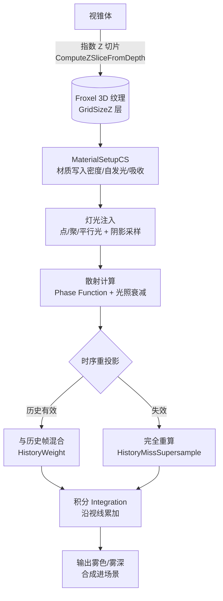
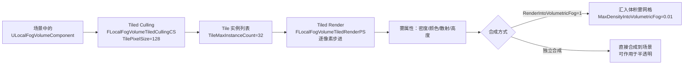

# 08 体积渲染与云
> 版本基准：UE 5.8.0（本机 `Engine/Build/Build.version`：CL 55116800，分支 `++UE5+Release-5.8`）。
> 兼容性边界：适用于 UE5.8 编辑器/运行时，UE4.27 与早期 UE5 仅作迁移背景，具体模块以正文为准。
> 官方参考：[Unreal Engine UE5.8 官方文档总页](https://dev.epicgames.com/documentation/en-us/unreal-engine)。
> 最后更新：2026-08-06（本轮元数据维护）。

> 源码依据：UE 5.8（`Engine\Source\Runtime\Renderer\Private\VolumetricFog.cpp`、`VolumetricCloudRendering.cpp`、`LocalFogVolumeRendering.cpp`、`VolumetricFogShared.h`；`Engine\Source\Runtime\Engine\Classes\Components\VolumetricCloudComponent.h`、`LocalFogVolumeComponent.h`）

## 1. 概述

UE 的"体积渲染"主要包含三块技术：

- **Volumetric Fog（体积雾）**：把指数高度雾（Exponential Height Fog）区域体素化为 **3D 网格（Froxel）**，逐帧在网格里累积光照（光源、阴影、自发光、体积材质），再从相机端沿视线积分出雾色——实现"光柱、体积光、雾中光晕"等效果；
- **Volumetric Cloud（体积云）**：对天空盒区域做**逐像素光线步进（Ray Marching）**，采样云材质（噪声堆叠的密度场），配合云阴影贴图（Cloud Shadow Map）与天空光照（SkyAO）生成写实云层；
- **Local Fog Volume（局部雾体积）**：UE 5.2 起引入的**局部体积雾**，用 Tiled 剔除 + 逐像素光步进渲染球体/盒体内的雾（密度、颜色、散射、高度分布），可叠加在全局雾之上，用于"毒气云、圣光区域、水下光斑"等局部氛围。

三者关系：**全局体积雾**是"大范围、低分辨率网格"方案；**体积云**是"天穹级、逐像素追踪"方案；**局部雾体积**是"小范围、高精度、可编程材质"方案。它们可以同时开启，在帧里按阶段合成（云的 Aerial Perspective 采样体积雾结果，局部雾体积可汇入体积雾网格或单独合成）。

阅读本文后，你应该能够：

- 理解 Froxel 3D 网格、抖动（Jitter）、时序重投影（Temporal Reprojection）机制；
- 理解体积雾的"累积（Inject）→ 散射（Scatter）→ 积分（Integrate）→ 时序滤波"流水线；
- 理解体积云的光线步进、云阴影图、天空环境光（SkyAO）与大气透视；
- 会用 Local Fog Volume 做局部雾效；
- 会配置 ExponetialHeightFog / VolumetricCloud 组件与 `r.VolumetricFog.*` / `r.VolumetricCloud.*` / `r.LocalFogVolume.*` 命令；
- 能给出体积效果的性能预算与调优路线。

## 2. 核心概念

| 概念 | 英文 | 含义 |
| --- | --- | --- |
| 体素网格单元 | Froxel（Frustum + Voxel） | 视锥内按深度指数切分的 3D 网格单元，体积雾的存储单位 |
| 3D 纹理 | 3D Texture | 每个 froxel 对应一个纹素，存密度/散射/吸收等属性 |
| 抖动 | Jitter | 每帧对网格切片/采样位置做亚像素偏移，配合时序累积消除带状伪影 |
| 时序重投影 | Temporal Reprojection | 用历史帧 3D 纹理（按运动矢量/视差重投影）与当前帧加权混合，等效提高分辨率 |
| 散射/吸收 | Scattering / Absorption | 光照与介质的两种交互：散射（改变方向）与吸收（衰减能量），体积渲染用 Beer-Lambert 近似 |
| 累积 | Injection / Accumulation | 把光源、阴影、材质自发光写入 3D 网格的过程（`MaterialSetupCS`、灯光注入） |
| 积分 | Integration | 沿视线方向对 3D 网格做线积分，输出屏幕空间雾色 |
| 光线步进 | Ray Marching | 沿射线以固定/自适应步长采样密度场，累积透射率与辐射度 |
| 云阴影图 | Cloud Shadow Map | 从太阳方向对云层做低分辨率追踪生成的阴影图（`r.VolumetricCloud.ShadowMap`） |
| 天空环境光 | SkyAO | 云层对天空光（环境光）的遮挡，生成云底暗部（`r.VolumetricCloud.SkyAO`） |
| 大气透视 | Aerial Perspective | 距离导致的大气散射衰减（地平线发白），体积雾与云共用 |
| 局部雾体积 | Local Fog Volume | `ULocalFogVolumeComponent`：球体/盒体内的可编程雾（密度、颜色、散射、高度分布） |

## 3. 原理详解

### 3.1 体积雾：3D 网格累积



关键实现（`VolumetricFog.cpp` / `VolumetricFogShared.h`）：

- **网格形状**：视锥内的 froxel 网格，深度方向按**指数分布**（`ComputeZSliceFromDepth`：`Log2(SceneDepth * GridZParams.X + GridZParams.Y) * GridZParams.Z`），近处密、远处疏，匹配透视衰减；
- **网格分辨率**：`r.VolumetricFog.GridPixelSize`（XY 方向像素密度，5.8 默认 16）与 `r.VolumetricFog.GridSizeZ`（深度层数，默认 64）；
- **材质参与**：`FVolumetricFogMaterialSetupCS` 把体积材质（Volumetric 域材质）写入网格——密度、自发光（`r.VolumetricFog.Emissive`）、吸收、散射颜色；
- **灯光注入**：`InjectShadowedLightsSeparately`（阴影光单独注入，质量高）与 `InjectRaytracedLights`（光追灯光注入）；`r.VolumetricFog.InjectRaytracedLights` 开启后光追阴影进入体积雾；
- **抖动**：`r.VolumetricFog.Jitter` 打开时，网格切片位置逐帧抖动（`FrameJitterOffsets` 数组最多 16 组偏移），避免体积雾的"层状带状"伪影；
- **时序重投影**：`r.VolumetricFog.TemporalReprojection` 用上一帧 3D 纹理重投影混合（`HistoryWeight`，`r.VolumetricFog.HistoryWeight`），历史失效区域用 `r.VolumetricFog.HistoryMissSupersampleCount` 超采样补偿；
- **积分**：`SetupVolumetricFogIntegrationParameters` 提供视锥转换参数，最终把 3D 纹理沿视线积分成 2D 雾层，合成到场景（`r.VolumetricFog` 总开关，默认 1）。

### 3.2 体积雾与半透明、材质

- 体积雾只对**不透明与体积材质**正确；半透明物体（玻璃、粒子）默认不参与（`r.VolumetricFog` 对 Translucent 的合成受 `r.VolumetricFog` 相关开关影响），需要额外处理；
- 材质侧：**Volumetric 域材质**的 `Albedo`、`Extinction`、`Emission` 输出进入网格；材质越复杂，`MaterialSetupCS` 越贵；
- `r.VolumetricFog.DepthDistributionScale` 调整深度分布指数；`r.VolumetricFog.ConservativeDepth` 处理深度缓冲边缘。

### 3.3 体积云：逐像素光线步进

```mermaid
flowchart TB
    A[相机射线] --> B{进入云层?}
    B -->|否| Z[天空/大气]
    B -->|是| C[云层包围盒<br/>Layer Bottom/Top]
    C --> D[逐采样点 Ray Marching<br/>ViewRaySampleMaxCount=768]
    D --> E[采样云材质<br/>密度 = f(噪声堆叠, 高度, 风速)]
    E --> F[光照计算<br/>太阳光经云阴影图衰减]
    F --> G[多散射近似<br/>低阶散射 + 环境光]
    G --> H[累积透射率/辐射度<br/>Beer-Lambert]
    H --> I[输出云色+透射]
    I --> J[合成：与天空/Aerial Perspective/雾]
    K[云阴影图 ShadowMap<br/>从太阳方向预追踪] --> F
    L[SkyAO<br/>天空光遮挡] --> G
```

关键实现（`VolumetricCloudRendering.cpp`）：

- **渲染对象**：`UVolumetricCloudComponent` 定义云层底部/顶部高度、行星半径（Planet Radius）、云材质（`Material` 槽，TSoftObjectPtr）与追踪参数；场景代理 `FVolumetricCloudSceneProxy` 持有 `FVolumetricCloudRenderSceneInfo`；
- **逐像素追踪**：主视图每个像素沿视线步进，`r.VolumetricCloud.ViewRaySampleMaxCount`（默认 768）限制最大步数，`r.VolumetricCloud.SampleMinCount`（默认 2）保证最少采样；远处（反射/阴影）追踪另有 `ReflectionRaySampleMaxCount`（80）；
- **云材质**：云材质（Cloud 域）输出 `Cloud Albedo`、`Cloud Extinction`、`Cloud Emissive`、`Ambient Occlusion`、`Material Emissive` 等，密度由美术在材质里堆叠噪声（如 Perlin/Worley 多层）实现；
- **云阴影图**：`r.VolumetricCloud.ShadowMap`（默认 1）从太阳方向预渲染低分辨率云阴影（`MaxResolution` 2048、`RaySampleMaxCount` 128），供地表阴影与云自阴影使用，含时间滤波（`ShadowMap.TemporalFiltering`）防闪烁；
- **SkyAO**：`r.VolumetricCloud.SkyAO` 计算云对天空光的遮挡（`TraceSampleCount` 10），给云底暗部，配合 `Filtering` 空间滤波；
- **光照采样**：`EnableDistantSkyLightSampling`（默认 1）采样天空光，`EnableAtmosphericLightsSampling` 采样大气光，`EnableLocalLightsSampling`（默认 0，昂贵）采样局部灯光，`LocalLights.ShadowSampleCount` 12；
- **空区跳过**：`r.VolumetricCloud.EmptySpaceSkipping`（默认 0，实验）用低分辨率预采样跳过空区域，`VolumeDepth` 40 控制采样深度；
- **与体积雾的关系**：`r.VolumetricCloud.EnableAerialPerspectiveSampling`（默认 1）让云采样体积雾的 Aerial Perspective 结果；`r.VolumetricCloud.ApplyFogLate` 控制雾合成为时点。

### 3.4 Local Fog Volume：局部雾体积



关键实现（`LocalFogVolumeRendering.cpp`）：

- **组件**：`ULocalFogVolumeComponent`（球体/盒体形状）提供 Radial Fog Density、Height Fog Density、Height Falloff、Scattering Distribution（Phase）、雾色、Start Distance、Sorting Order（-127~127，控制多个雾体积叠加顺序）等属性；
- **Tiled 剔除**：`FLocalFogVolumeTiledCullingCS` 按屏幕 Tile（`r.LocalFogVolume.TilePixelSize`，默认 128）剔除可见实例（`TileMaxInstanceCount` 32），可用 HZB 加速（`r.LocalFogVolume.UseHZB`）；
- **逐像素渲染**：`FLocalFogVolumeTiledRenderPS` 对每个像素做光线步进（步长由密度与距离自适应），`r.LocalFogVolume.HalfResolution` 可半分辨率渲染；
- **两种合成**：`r.LocalFogVolume.RenderIntoVolumetricFog`（默认 1）把密度汇入体积雾网格（上限 `MaxDensityIntoVolumetricFog` 0.01，避免挤爆网格），或独立合成（`r.LocalFogVolume.ApplyOnTranslucent` 可作用于半透明）；
- **移动端**：提供 `FMobileLocalFogVolumeTiledRenderPS` 专用着色器路径；
- **排序**：`Sorting Order` 决定雾体积之间的混合顺序，与全局雾（Height Fog）独立。

### 3.5 性能预算

| 效果 | 主要开销 | 预算参考（PC） |
| --- | --- | --- |
| 体积雾 | 3D 网格累积 + 时序滤波，随光源数/材质复杂度增长 | 1~3ms @ 1080p（GridPixelSize 8、GridSizeZ 64） |
| 体积云 | 主视图逐像素步进（768 步上限）+ 云阴影图 + SkyAO | 1~4ms（ViewRaySampleMaxCount 调低到 128~256 可省一半） |
| 局部雾体积 | Tiled 渲染，随屏幕覆盖面积/体积数增长 | 0.2~1ms（HalfResolution 开启后减半） |
| 三者叠加 | 合成阶段多次混合 | 预留 0.5ms |

调优优先级：先降 `r.VolumetricFog.GridPixelSize`（8→4）与 `GridSizeZ`（64→32）；再降 `r.VolumetricCloud.ViewRaySampleMaxCount`（768→256）与阴影图分辨率；最后关 `r.VolumetricFog.InjectRaytracedLights` 等昂贵选项。

## 4. 材质 / 配置示例

### 4.1 体积雾开启（Exponential Height Fog）

在 `ExponentialHeightFogComponent` 上勾选 **Volumetric Fog**：

```text
Exponential Height Fog：
  Volumetric Fog = True
  Scattering Distribution = 0.2~0.9（越大越"追光"）
  Albedo = 灰白（散射色）
  Emissive = 0（自发光雾用体积材质）
  Extinction Scale = 密度倍率
  View Distance = 6000~20000（网格深度范围）
```

材质侧可选 **Volumetric 域材质**挂在雾上（如"雾气中有发光尘埃"）：输出 `Albedo`、`Extinction`、`Emission`，通过 `r.VolumetricFog.Emissive` 启用自发光。

### 4.2 体积云组件配置

```text
VolumetricCloudComponent：
  Layer：Bottom=2000，Top=8000（云层高度范围，单位 cm，可配多层）
  Planet：Radius=6360000（行星半径，与天空球一致）
  Cloud Material：M_Clouds（Cloud 域材质）
  Cloud Tracing：
    Tracing Start/End Max Distance（追踪范围）
    View Ray Step Size / View Ray Step Size Scale（步长与距离缩放）
    Shadow Step Size（云阴影步长）
```

云材质（Cloud 域）常用节点链：

```text
Cloud Sample 密度：
  Worley/Perlin 多层噪声（3~5 层，频率翻倍、幅度减半）
  + 高度渐变（Bottom 附近稀、中部密、顶部压扁）
  + 风场（World Position 偏移 * WindSpeed，`Art Direction` 风速参数）
  → Cloud Albedo / Cloud Extinction
太阳方向 → Cloud Shadowmap Sample（云自阴影）
高度 → Ambient Occlusion（云底暗部）
```

### 4.3 Local Fog Volume 配置

```text
Local Fog Volume Component：
  Shape = Box/Sphere（体积形状）
  Radial Fog Density = 0.1~2.0（径向密度）
  Height Fog Density + Height Falloff（高度分布，制造"贴地雾气"）
  Scattering Distribution = 0.5（Phase 函数各向异性）
  Fog Color / Scattering Color（雾色）
  Start Distance（从体积边界内多少开始生效）
  Sorting Order = -10（多个雾体积的混合顺序）
```

局部雾材质（可选）：`Local Fog Volume` 域材质输出 `Fog Density`、`Fog Albedo`、`Fog Emission`、`Fog Extinction`，可做"毒雾颜色随时间变化"等效果。

### 4.4 常用命令清单（UE 5.8 源码确认）

| 类别 | 命令 | 作用 |
| --- | --- | --- |
| 体积雾 | `r.VolumetricFog` | 总开关 |
| | `r.VolumetricFog.GridPixelSize` / `GridSizeZ` | 网格分辨率（XY/深度层数） |
| | `r.VolumetricFog.TemporalReprojection` / `HistoryWeight` / `HistoryMissSupersampleCount` | 时序累积质量 |
| | `r.VolumetricFog.Jitter` | 切片抖动（消带状伪影） |
| | `r.VolumetricFog.DepthDistributionScale` | 深度指数分布 |
| | `r.VolumetricFog.InjectShadowedLightsSeparately` / `InjectRaytracedLights` | 阴影光注入 / 光追灯光注入 |
| | `r.VolumetricFog.Emissive` / `ConservativeDepth` / `LightSoftFading` | 自发光 / 深度保守 / 灯光软衰减 |
| 体积云 | `r.VolumetricCloud` | 总开关 |
| | `r.VolumetricCloud.ViewRaySampleMaxCount`（768）/ `SampleMinCount`（2） | 主视图追踪步数 |
| | `r.VolumetricCloud.ReflectionRaySampleMaxCount`（80） | 反射中云追踪 |
| | `r.VolumetricCloud.ShadowMap` / `ShadowMap.MaxResolution`（2048）/ `ShadowMap.RaySampleMaxCount`（128） | 云阴影图 |
| | `r.VolumetricCloud.SkyAO` / `SkyAO.TraceSampleCount`（10） | 天空光遮挡 |
| | `r.VolumetricCloud.EnableLocalLightsSampling`（0） | 局部灯光采样（贵） |
| | `r.VolumetricCloud.EmptySpaceSkipping`（0） | 空区跳过（实验） |
| | `r.VolumetricCloud.EnableAerialPerspectiveSampling`（1） | 大气透视采样 |
| 局部雾 | `r.LocalFogVolume` | 总开关 |
| | `r.LocalFogVolume.TilePixelSize`（128）/ `TileMaxInstanceCount`（32） | Tiled 剔除粒度 |
| | `r.LocalFogVolume.HalfResolution`（0） | 半分辨率渲染 |
| | `r.LocalFogVolume.RenderIntoVolumetricFog`（1）/ `MaxDensityIntoVolumetricFog`（0.01） | 汇入体积雾 |
| | `r.LocalFogVolume.ApplyOnTranslucent`（0）/ `UseHZB`（1）/ `GlobalStartDistance`（1000） | 合成/加速/距离裁剪 |

## 5. 最佳实践

### 5.1 体积雾

- **网格分辨率是首要旋钮**：先定 `GridPixelSize` 与 `GridSizeZ`，再调质量选项；主机端 4/32，PC 8/64，影视 16/128；
- **灯光数量控制**：体积雾开销与"进入网格的灯光"数量强相关，关掉不必要灯光的 `Volumetric` 参与（灯光属性里勾选），用 `InjectShadowedLightsSeparately` 只对主光做高质量注入；
- **抖动 + 时序必须成对**：关 Jitter 会出带状伪影，关时序会闪烁；`HistoryMissSupersampleCount` 解决快速移动时的历史失效；
- **自发光雾用体积材质**而非 Emissive 常数，便于做"发光尘埃、光柱心"。

### 5.2 体积云

- **步长先粗后细**：`ViewRayStepSizeScale` 让远距离步长放大；空区用 `EmptySpaceSkipping` 实验选项前先确认版本稳定性；
- **云阴影图分辨率与时间滤波**：地表云影闪烁时调 `ShadowMap.TemporalFiltering` 权重与 `LightRotationCutHistory`（日光旋转时清历史）；
- **多散射近似**：云材质里用 `CloudSample` 的 Multiple Scattering 近似节点（二阶散射），比纯单散射真实得多且便宜；
- **本地光采样默认关闭**：`EnableLocalLightsSampling` 开给"闪电照亮云"等镜头，平时保持 0；
- **云的 LOD 距离**：`ViewDistance`/`Tracing Start/End Max Distance` 限制追踪范围，镜头贴地时云开销可忽略。

### 5.3 局部雾体积

- **小范围、少数量**：单屏同屏 4~8 个以内；用 `Sorting Order` 明确叠加顺序；
- **密度上限**：`MaxDensityIntoVolumetricFog` 保持 0.01 左右，否则体积雾网格被局部雾"撑爆"；
- **半透明作用**：需要雾影响玻璃/水时开 `ApplyOnTranslucent`，但注意排序成本；
- **移动端**：`HalfResolution` + Mobile 着色器路径，实测通过再上线。

### 5.4 落地检查清单

- [ ] 全局雾 + 体积雾开关与场景氛围匹配；
- [ ] 网格分辨率按平台 Scalability 分级（5.8 无 `sg.VolumetricFog` 组；相关 CVar 带 ECVF_Scalability，可在 Scalability ini 配置）；
- [ ] 云材质噪声层数与 `ViewRaySampleMaxCount` 平衡（高分辨率下 768 步可能超预算）；
- [ ] 云阴影图/SkyAO 分辨率与时间滤波配置完成，无闪烁；
- [ ] 局部雾体积数量与排序确认；
- [ ] `stat gpu` 记录 VolumetricFog / VolumetricCloud / LocalFogVolume 三段耗时入档；
- [ ] 雨天/雾天/晴天三套配置做回归对比。

## 6. 常见问题 FAQ

**Q1：体积雾的"一层一层"条纹怎么消除？**
开 `r.VolumetricFog.Jitter`（切片抖动）+ 保证 `TemporalReprojection` 打开；若仍明显，提高 `GridSizeZ` 或降低 `DepthDistributionScale` 让近处更密。

**Q2：体积云在转动视角时闪烁/破碎？**
通常与步长过大或 `SampleMinCount` 太低有关：调小 `ViewRayStepSizeScale`、提高 `SampleMinCount`；云阴影闪烁查 `ShadowMap.TemporalFiltering`。

**Q3：体积雾为什么不照亮半透明物体？**
半透明物体默认不采样体积雾积分结果（合成顺序限制）。需要时在材质里用场景节点采样雾色，或对特定半透明材质开启雾采样支持（与版本实现相关）。

**Q4：Local Fog Volume 和 Height Fog 里的 Fog Volumes（旧版）有什么区别？**
旧版 Fog Volume（ExponentialHeightFog 子级）仅做密度衰减，无材质、无散射；`ULocalFogVolumeComponent` 是独立组件，支持材质、相位函数、排序与 Tiled 渲染，UE 5.2+ 推荐用它。

**Q5：云会挡住光追/Lumen 吗？**
云是"后处理级"天空层：Lumen 的 Sky Light 可把云作为天空光照来源（配合 `r.VolumetricCloud.EnableDistantSkyLightSampling`），云阴影图可投射到地表；光追反射中云的追踪由 `ReflectionRaySampleMaxCount` 控制。

**Q6：移动端能用体积雾/云吗？**
体积雾在部分移动设备可用（低网格分辨率）；体积云不建议默认开启（逐像素追踪开销大），用贴图云或 `VolumetricCloud` 关闭 + 天空盒兜底。

**Q7：体积雾与体积云都开时颜色"发灰"？**
检查 Aerial Perspective 双重叠加：`r.VolumetricCloud.EnableAerialPerspectiveSampling` 与体积雾的 Aerial Perspective 都作用时，需要统一两者的散射颜色/距离参数，避免过度衰减。

## 7. 关联阅读

- 本目录 `03-光照与阴影系统.md`：阴影图与光追阴影进入体积雾的方式（`InjectShadowedLightsSeparately`）；
- 本目录 `05-后处理与画面特效.md`：Aerial Perspective、雾在后期合成中的位置；
- 本目录 `09-光线追踪与路径追踪.md`：Path Tracer 对体积雾/云的参考渲染（`r.PathTracing.EnableReferenceClouds`、`r.PathTracing.CloudMultipleScatterMode`）；
- 本目录 `02-材质系统详解.md`：Volumetric / Cloud / Local Fog Volume 三种材质域的用法；
- 引擎源码：`Engine\Source\Runtime\Renderer\Private\VolumetricFog.cpp`、`VolumetricCloudRendering.cpp`、`LocalFogVolumeRendering.cpp`、`VolumetricFogShared.h`；
- 官方文档：Volumetric Fog / Volumetric Cloud / Local Fog Volume 页面，UE 5.8 Release Notes。

> 版本提示：Local Fog Volume 自 UE 5.2 引入后 API 持续演进；`r.VolumetricCloud.EmptySpaceSkipping` 为实验特性，生产项目请先小范围验证。所有命令与默认值以本机 UE 5.8 源码为准。

## 8. 附录

### 8.1 版本演进简表

| 引擎版本 | Volumetric Fog | Volumetric Cloud | Local Fog Volume |
| --- | --- | --- | --- |
| UE 4.x | 4.19 起支持（Froxel + 时序重投影） | 4.24 起支持（光线步进 + 云阴影图） | 无 |
| UE 5.0 | 保持并优化 | 反射中云追踪、SkyAO 完善 | 无 |
| UE 5.2 | — | — | **引入 Local Fog Volume**（Tiled 渲染 + 材质） |
| UE 5.3+ | 光追灯光注入等增强 | 空区跳过实验、时间滤波优化 | Mobile 路径、HZB 剔除等增强 |
| UE 5.8 | `InjectRaytracedLights`、Rect Light 支持 | `EnableLocalLightsSampling`、`EmptySpaceSkipping` | `TileCullingUseAsync`、半分辨率、排序 |

> 具体支持面以各版本 Release Notes 为准。

### 8.2 术语表

| 术语 | 含义 |
| --- | --- |
| Froxel | 视锥内指数切分的 3D 体素单元（体积雾网格） |
| Injection | 灯光/材质写入 3D 网格（累积） |
| Integration | 沿视线对网格积分出雾色 |
| Jitter | 切片/采样位置逐帧抖动（消带状伪影） |
| Temporal Reprojection | 历史帧重投影混合（时序累积） |
| Ray Marching | 沿射线步进采样密度场 |
| Cloud Shadow Map | 从太阳方向预渲染的云阴影图 |
| SkyAO | 云对天空光的遮挡（云底暗部） |
| Aerial Perspective | 大气透视（距离衰减发白） |
| Phase Function | 散射方向分布函数（各向异性） |
| Local Fog Volume | 局部可编程雾体积组件 |
| Tiled Culling | 屏幕分块剔除（只渲染有雾的块） |

### 8.3 一句话总结

```text
Volumetric Fog = 视锥 3D 网格累积 + 抖动 + 时序重投影，点亮全局雾里的光；
Volumetric Cloud = 天穹级逐像素光线步进 + 云阴影图 + SkyAO，画出一整片天空；
Local Fog Volume = 小块可编程雾，Tiled 剔除 + 逐像素步进，点缀局部氛围。
三者按"全局网格 → 天穹追踪 → 局部体积"分工，可同帧叠加。
```
