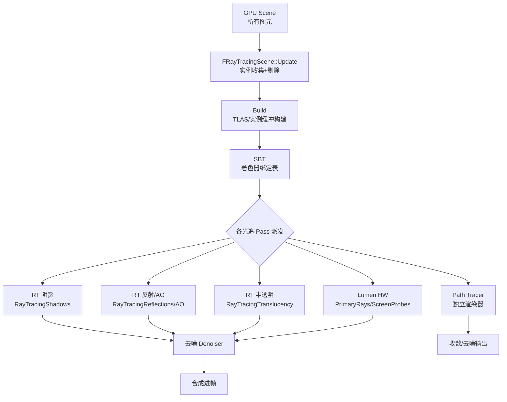
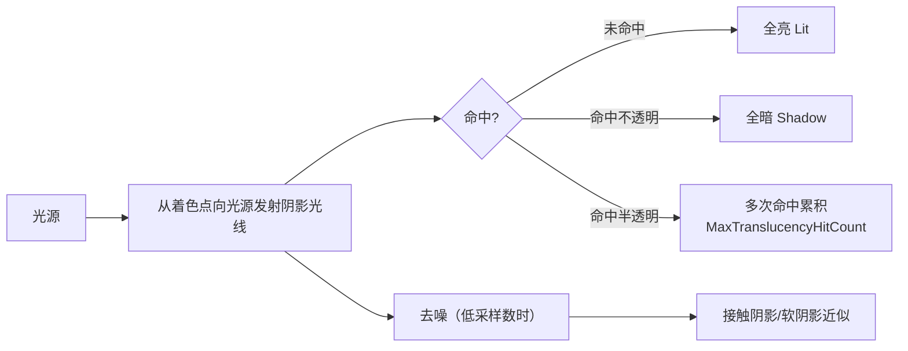
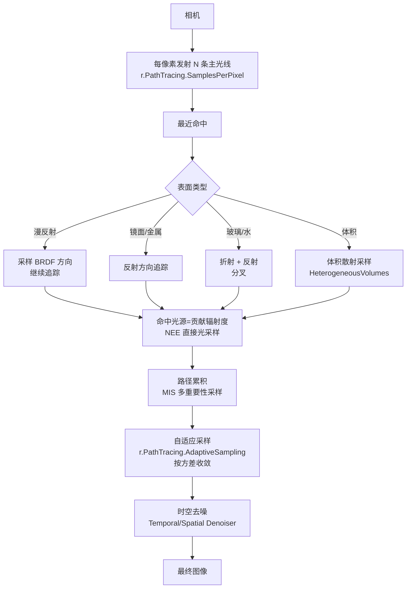
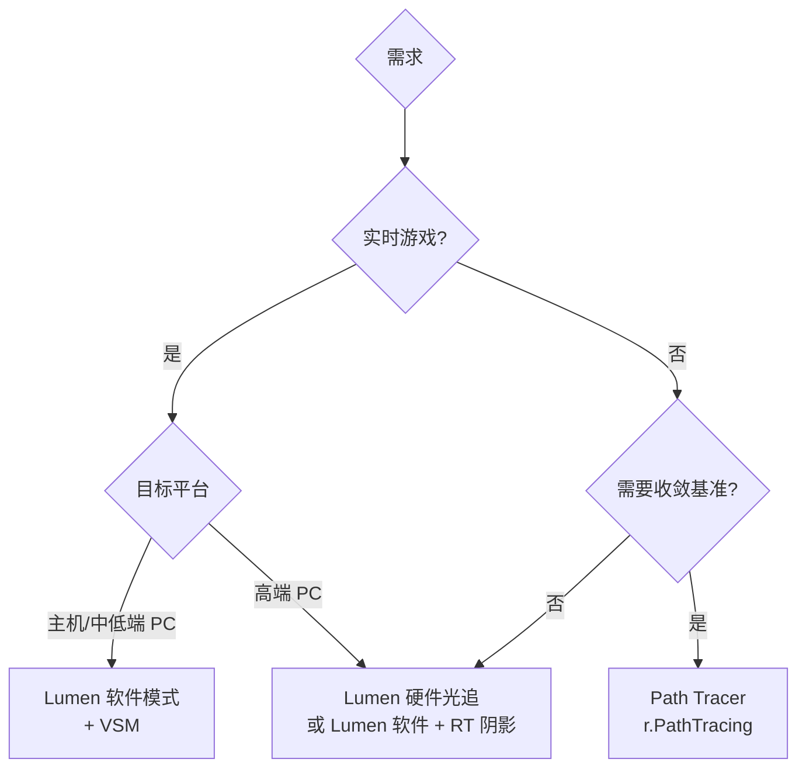

# 09 光线追踪与路径追踪

> 源码依据：UE 5.8（`Engine\Source\Runtime\Renderer\Private\RayTracing\RayTracing.cpp`、`RayTracingShadows.cpp`、`RayTracingPrimaryRays.cpp`、`RayTracingScene.cpp`、`RayTracingTranslucency.cpp`、`RaytracingSkylight.cpp`、`RayTracingAmbientOcclusion.cpp`；`PathTracing.cpp`、`PathTracingSpatialTemporalDenoising.cpp`）

## 1. 概述

UE 的光线追踪分为两大体系：

- **硬件光追（Hardware Ray Tracing）**：基于 DXR（DirectX Raytracing）/ Vulkan Ray Tracing 的实时光追，在延迟渲染管线上叠加光追效果——**光追阴影（RT Shadows）、光追反射（RT Reflections）、光追环境光遮蔽（RT AO）、光追半透明（RT Translucency）**，并作为 **Lumen 的硬件加速模式**（`r.Lumen.HardwareRayTracing`）为全局光照提供精确追踪。它仍然是一帧一帧的实时渲染，靠**去噪器（Denoiser）**压低采样数；
- **路径追踪（Path Tracing）**：`r.PathTracing` 开启后的**逐像素完整路径追踪**渲染器——每条光线在场景中递归弹射（漫反射/镜面/折射/体积），收敛出**参考级（Reference）**画面，用于影视离线渲染、产品可视化、光照基准对比（如验证 Lumen 是否正确）。

UE 5.8 中硬件光追的**场景构建**统一由 `FRayTracingScene`（`RayTracingScene.cpp`）负责：从 GPU Scene 收集实例（Static Mesh / Skeletal Mesh / HISM / Nanite 代理），构建加速结构（TLAS/实例缓冲），生成 Shader Binding Table（SBT），供阴影/反射/AO/半透明/Lumen 各 Pass 派发。

阅读本文后，你应该能够：

- 理解 UE 光追渲染管线（场景构建 → SBT → 各光追 Pass → 去噪）;
- 区分 RT 阴影/反射/AO/半透明的特点、命令与代价；
- 理解 Path Tracer 的路径追踪原理与用途；
- 熟悉 `r.RayTracing.*`、`r.PathTracing.*` 系列命令；
- 能给出"Lumen vs 硬件光追 vs Path Tracer"的选型建议；
- 会做光追性能预算与降级方案。

## 2. 核心概念

| 概念 | 英文 | 含义 |
| --- | --- | --- |
| 加速结构 | TLAS / BLAS | 顶层加速结构（实例级）/ 底层加速结构（几何级），光追求交的 BVH |
| 光线生成着色器 | Ray Generation Shader | 每像素/每光线执行的入口着色器（定义追踪什么） |
| 命中/未命中着色器 | Closest Hit / Any Hit / Miss Shader | 光线命中最近表面/任意表面/未命中时执行的着色器 |
| 着色器绑定表 | SBT（Shader Binding Table） | 把"命中哪个几何"映射到"执行哪个材质着色器"的表 |
| 实例 | Instance | TLAS 中的一个场景对象（带变换、掩码、自定义数据） |
| 光追掩码 | Ray Tracing Mask | 决定光线与哪些实例相交（如阴影光只打不透明） |
| 每像素采样数 | Samples Per Pixel（SPP） | 每像素发射的光线数，越高越干净越贵 |
| 去噪器 | Denoiser | 用时空滤波把低采样数结果"洗"干净（TAA 思路的推广） |
| 路径追踪 | Path Tracing | 递归追踪光线路径直至收敛的离线式渲染器 |
| 弹射次数 | Bounces | 光线在场景中的反射/折射次数上限 |
| 光线载荷 | Ray Tracing Payload | 光线携带的数据（命中距离、材质、辐射度） |

## 3. 原理详解

### 3.1 光追渲染管线：场景构建与派发



关键实现（`RayTracingScene.cpp` / `RayTracing.cpp`）：

- **场景构建**：`FRayTracingScene::Update()` 从 GPUScene 收集实例（`r.RayTracing.Geometry.StaticMeshes` / `SkeletalMeshes` / `HierarchicalInstancedStaticMesh` / `InstancedSkeletalMeshes` / `LandscapeGrass` / `NaniteProxies` 分别控制），`Build()` 生成实例缓冲与加速结构；`r.RayTracing.Scene.BuildMode` / `BatchedBuild` 控制构建调度，`CompactInstances` 压缩实例内存；
- **构建初始化**：`BuildInitializationData(bUseLightingChannels, bForceOpaque, bDisableTriangleCull)`——`r.RayTracing.DebugForceOpaque` 可强制全部不透明（调试）；灯光通道（Lighting Channels）参与实例掩码；
- **动态几何**：骨骼网格等每帧变化的几何走 `r.RayTracing.DynamicInstances` 路径（每帧更新 BLAS），静态几何缓存构建；
- **追踪反馈**：`r.RayTracing.Scene.UseTracingFeedback` 用 GPU 反馈标记"哪些实例被光线命中"，指导动态更新与内存驻留；
- **主光线（Lumen HW）**：`RenderRayTracingPrimaryRaysView`（`RayTracingPrimaryRays.cpp`）把 Lumen 的屏幕探针/反射射线以硬件光追派发，配合 `r.Lumen.HardwareRayTracing` 的 LightingMode（质量档）与 HitLighting（命中点直接光照）选项。

### 3.2 RT 阴影



要点（`RayTracingShadows.cpp` / `LightRendering.cpp`）：

- **开关**：`r.RayTracing.Shadows`，每类光源单独控制（`r.RayTracing.Shadows.Lights.Directional` / `Point` / `Spot` / `Rect`），`r.RayTracing.Shadows.SamplesPerPixel` 默认 -1（5.8，按项目设置；配合去噪通常设 1），`MaxBatchSize` 8；
- **材质参与**：`r.RayTracing.Shadows.EnableMaterials` 让阴影光线执行材质（透明阴影、折射阴影），`EnableTwoSidedGeometry` 双面；毛发阴影用 `EnableHairVoxel` + `r.RayTracing.Shadows.HairOcclusionThreshold`；
- **半透明阴影**：`r.RayTracing.Shadows.Translucency` + `MaxTranslucencyHitCount` 支持"多次穿透玻璃"的有色阴影；
- **LOD 过渡**：`LODTransitionStart/End` 让远处物体在光追阴影与阴影图阴影之间平滑过渡；
- **自相交**：`r.RayTracing.Shadows.AvoidSelfIntersectionTraceDistance`、`r.RayTracing.NormalBias` 消除"阴影表面颗粒噪点"；
- **性价比**：点光源/聚光灯小角度场景 RT 阴影最值（精确接触阴影），平行光大面积场景用 VSM/CSM 更划算。

### 3.3 RT 反射 / AO / 半透明

| 效果 | 文件 | 核心命令 | 原理与特点 |
| --- | --- | --- | --- |
| RT 反射 | LumenReflectionHardwareRayTracing.cpp | `r.Lumen.Reflections.HardwareRayTracing`（5.8；旧 `r.RayTracing.Reflections` 已移除） | 镜面方向发射反射光线，命中真实场景（含屏幕外物体），粗糙度越高采样越贵；可只对粗糙度低于阈值的像素启用 |
| RT AO | `RayTracingAmbientOcclusion.cpp` | `r.RayTracing.AmbientOcclusion`、`SamplesPerPixel`、`EnableMaterials` | 半球内随机方向发射短光线测遮蔽；比 SSAO 更真实（考虑几何遮挡距离），开销随采样数线性增长 |
| RT 半透明 | `RayTracingTranslucency.cpp` | `r.RayTracing.Translucency`、`SamplesPerPixel`、`MaxRoughness`、`Refraction`、`MaxRefractionRays`、`MaxRayDistance`、`Shadows` | 半透明表面（玻璃/水/宝石）做真实折射追踪（可多次折射），`ForceOpaque` 可强制按不透明处理以提速 |
| RT 天空光 | `RaytracingSkylight.cpp` | `r.RayTracing.SkyLight`、`SamplesPerPixel`、`Denoiser`、`ScreenPercentage` | 用光追替换天空光照明的 SH 近似，得到高频环境光照（复杂遮挡下的天空色） |

共通的去噪：这些效果默认 SPP=1，靠 **Denoiser**（时空滤波，按法线/深度/运动矢量分权重）得到干净画面；去噪参数集中在各效果的 `Denoiser` 子命令（如 `r.RayTracing.SkyLight.Denoiser`）。

### 3.4 Path Tracer：完整路径追踪



要点（`PathTracing.cpp`）：

- **开启**：控制台 `show PathTracing`（5.8 运行时开关；`r.PathTracing` 为只读编译支持开关，默认 1），渲染器替换常规管线；
- **采样**：`r.PathTracing.SamplesPerPixel`（后处理体积里也可设）控制每像素光线数，`r.PathTracing.MaxBounces`（默认 -1，由后处理体积驱动，典型 32）控制弹射深度，`r.PathTracing.MaxPathIntensity` 钳制能量防爆炸，`SamplerType`（Sobol 等）与 `FilterWidth` 控制像素滤波；
- **自适应采样**：`r.PathTracing.AdaptiveSampling` + `ErrorThreshold` 让"已收敛区域少采样、噪区多采样"，`Visualize` 可视化采样密度；
- **去噪**：`r.PathTracing.Denoiser`（OIDN 等，`Denoiser.Name`）、`TemporalDenoiser`（alpha、DeltaE 阈值）、`SpatialDenoiser.Type`——用低采样 + 去噪快速出"近收敛"效果；
- **参考级特性**：`EnableReferenceDOF`（真实景深，替代后处理 DOF）、`EnableReferenceAtmosphere` / `EnableReferenceClouds`（大气与云的物理级渲染，`CloudMultipleScatterMode`）、`ApproximateCaustics`（焦散近似）、`MaxSSSBounces`（次表面散射）、`HeterogeneousVolumes.Pipeline`（异构体积）、`MISMode`/`MISCompensation`（多重要性采样）、`LightGridResolution`（灯光网格）、`FogDensityClamp`（雾密度钳制）——这些让 Path Tracer 成为 Lumen/实时管线的"基准答案"；
- **用途**：影视预渲染、产品图、光照验证（同一场景 Path Tracer 与 Lumen 对比截图找差异）。

### 3.5 与 Lumen 的对比与取舍

| 维度 | Lumen（软件） | Lumen（硬件光追模式） | 独立 RT 效果 | Path Tracer |
| --- | --- | --- | --- | --- |
| 原理 | 距离场/屏幕追踪 + 缓存 | Lumen 追踪换成 DXR | 单项效果直接光追 | 完整路径追踪 |
| 全局光照 | 有（探针+缓存） | 有（更高精度） | 无（只做单项） | 有（物理收敛） |
| 反射 | 屏幕+表面缓存 | 硬件追踪更准 | RT 反射可叠加 | 物理精确 |
| 阴影 | VSM 为主 | RT 阴影可替代 | RT 阴影 | 物理精确 |
| 去噪需求 | 时间累积（TAA/TSR） | 时间累积 + 去噪 | 强去噪 | 强去噪 |
| 性能 | 实时（主机可跑） | 中高端 PC/主机 | 单项可控 | 离线级（分钟~小时） |
| 适用 | 游戏默认 GI | 高配游戏模式 | 重点效果增强 | 影视/验证 |



取舍建议：

- **默认组合（推荐）**：Lumen（软件或硬件）+ VSM + 选择性 RT 阴影/反射增强；
- **影视流程**：实时视口用 Lumen 做预演，最终帧用 Path Tracer 出图；
- **不要混用的场景**：Path Tracer 与 Lumen 同时开没有意义（Path Tracer 接管一切）；RT 效果与 Lumen 反射同开会重复计算，按效果图取舍；
- **移动端**：硬件光追与 Path Tracer 均不可用，回退烘焙 + SSR/SSAO。

## 4. 材质 / 配置示例

### 4.1 项目启用硬件光追

```text
项目设置 → Rendering：
  DirectX 12（或 Vulkan）+ Shader Model 6（SM6）
  Support Hardware Ray Tracing = True
  Generate Mesh Distance Fields = True（Lumen 需要）
项目设置 → Platforms：
  确认目标平台 SDK（DXR 需要 Windows 10 1809+ / 对应主机 SDK）
```

验证：控制台输入 `r.RayTracing.ForceAllRayTracingEffects 1` 后看 `stat gpu` 是否出现 RayTracing 段；`r.RayTracing.DebugForceOpaque 1` 可排查材质导致的命中异常。

### 4.2 常用 `r.RayTracing.*` 命令清单（UE 5.8 源码确认）

| 类别 | 命令 | 说明 |
| --- | --- | --- |
| 总控 | `r.RayTracing.ForceAllRayTracingEffects` | 强制所有光追效果开关（覆盖各效果单独开关） |
| 几何 | `r.RayTracing.Geometry.StaticMeshes` / `SkeletalMeshes` / `HierarchicalInstancedStaticMesh` / `InstancedSkeletalMeshes` / `LandscapeGrass` / `NaniteProxies` | 各类几何是否进入光追场景 |
| 场景 | `r.RayTracing.Scene.BuildMode` / `BatchedBuild` / `CompactInstances` / `UseTracingFeedback` / `SerializeOnce` | 场景构建调度与内存 |
| 动态 | `r.RayTracing.DynamicInstances` | 动态几何（骨骼网格）BLAS 更新 |
| 阴影 | `r.RayTracing.Shadows` / `SamplesPerPixel` / `Lights.Directional/Point/Spot/Rect` | 光追阴影总控与分光源 |
| | `r.RayTracing.Shadows.EnableMaterials` / `EnableTwoSidedGeometry` / `AcceptFirstHit` | 阴影光线材质/双面/首命中 |
| | `r.RayTracing.Shadows.Translucency` / `MaxTranslucencyHitCount` | 半透明阴影（多次穿透） |
| | `r.RayTracing.Shadows.EnableHairVoxel` / `HairOcclusionThreshold` | 毛发体素阴影 |
| | `r.RayTracing.Shadows.LODTransitionStart/End` | 与阴影图 LOD 过渡 |
| 反射 | `r.Lumen.Reflections.HardwareRayTracing`（5.8；旧 `r.RayTracing.Reflections` 已移除） | 光追反射 |
| | `r.RayTracing.AmbientOcclusion` / `SamplesPerPixel` / `EnableMaterials` | 光追 AO |
| 半透明 | `r.RayTracing.Translucency` / `SamplesPerPixel` / `MaxRoughness` / `Refraction` / `MaxRefractionRays` / `Shadows` / `MaxRayDistance` / `ForceOpaque` | 光追半透明与折射 |
| 天空光 | `r.RayTracing.SkyLight` / `SamplesPerPixel` / `Denoiser` / `ScreenPercentage` / `MaxRayDistance` | 光追天空光 |
| 数值 | `r.RayTracing.NormalBias` / `r.RayTracing.Shadows.AvoidSelfIntersectionTraceDistance` | 自相交/表面颗粒消除 |
| Lumen | `r.Lumen.HardwareRayTracing` / `LightingMode` / `HitLighting.*` | Lumen 硬件光追模式 |

### 4.3 Path Tracer 常用命令

```text
show PathTracing               # 5.8 开启路径追踪渲染器（r.PathTracing 为只读支持开关）
r.PathTracing.SamplesPerPixel 64 # 每像素光线数（8~128 视用途）
r.PathTracing.MaxBounces 32      # 最大弹射（-1 用后处理体积）
r.PathTracing.AdaptiveSampling 1 # 自适应采样
r.PathTracing.AdaptiveSampling.ErrorThreshold 0.01
r.PathTracing.Denoiser 1         # 启用去噪（配合低采样快速预览）
r.PathTracing.MaxPathIntensity 10000  # 能量钳制
r.PathTracing.EnableReferenceDOF 1    # 真实景深
r.PathTracing.EnableReferenceClouds 1 # 参考级云渲染
r.PathTracing.HeterogeneousVolumes.Pipeline 1 # 异构体积（雾）
r.PathTracing.ProgressDisplay 1  # 收敛进度可视化
r.PathTracing.FrameIndependentTemporalSeed 1  # 每帧独立随机种子（动画去噪时按需）
```

### 4.4 材质兼容性

- **光追阴影/反射**：默认支持所有表面；`r.RayTracing.DebugForceOpaque` 下异常半透明材质需检查 Blend Mode 与 `bRayTracing` 相关材质开关；
- **Path Tracer**：支持 Substrate/传统着色模型、次表面（`MaxSSSBounces`）、发光（`EnableEmissive`）、贴花（`DecalRoughnessCutoff`）、雾与异构体积（`FogDensityClamp` / `HeterogeneousVolumes`）；
- **毛发**：`bUseHairRaytracingGeometry` 让 Groom 进入光追（见 06 篇）；Path Tracer 对毛发曲线支持以版本特性为准。

## 5. 最佳实践

### 5.1 性能预算（PC 参考）

| 效果 | 采样建议 | 预算参考 |
| --- | --- | --- |
| RT 阴影 | SPP 1 + 去噪；仅关键光源 | 0.5~1.5ms（4K 下更高） |
| RT 反射 | SPP 1，粗糙度上限 0.3~0.6，MaxBounces 1~2 | 1~3ms |
| RT AO | SPP 1~4 | 0.5~1ms |
| RT 半透明 | SPP 1~4，折射光线 ≤2 | 0.5~2ms |
| Lumen HW | LightingMode 视平台 | 2~5ms（比软件模式贵但更准） |
| Path Tracer | SPP 8~64 + 去噪（预览），256+（出图） | 分钟级 |

### 5.2 调优路线

1. **先砍几何**：`r.RayTracing.Geometry.*` 逐类关闭，确认哪类实例占开销（`stat` / `ProfileGPU` 看 RayTracingScene 构建时间）；
2. **再砍采样**：各效果 SPP 降到 1，靠去噪撑画质；
3. **然后砍范围**：反射 `MaxRoughness`、半透明 `MaxRayDistance`、阴影 `LODTransition` 都用来"限制光线范围"；
4. **最后砍构建**：`Scene.BuildMode` 用 BatchedBuild，动态实例减少（静态化植被/道具），`CompactInstances` 压内存；
5. **验证**：`r.RayTracing.Scene.UseTracingFeedback` 看命中分布，避免"追踪了没人看的光线"。

### 5.3 选型决策树

- 实时游戏默认：**Lumen（软件）+ VSM**，不上 RT（性价比最高）；
- 高配 PC 增强：Lumen 软件 + **RT 阴影（关键光源）** + RT 反射（可选）；
- 高端主机/PC 画质档：**Lumen 硬件光追**（`r.Lumen.HardwareRayTracing`）；
- 玻璃/水特写：RT 半透明 + 折射（`r.RayTracing.Translucency.Refraction`）；
- 影视/基准：Path Tracer（`r.PathTracing`），与实时档共用场景资产；
- 移动端：全部关闭，烘焙光照 + SSR/SSAO。

### 5.4 落地检查清单

- [ ] 平台支持确认（DX12/Vulkan + SM6 + DXR/RT 硬件）；
- [ ] 几何类别逐类审计（骨骼网格是否必须进光追）；
- [ ] 各效果 SPP/范围按 Scalability 分级；
- [ ] 去噪器参数（时间/空间权重）按 30/60fps 实测；
- [ ] `stat gpu` 中 RayTracing 各段耗时入档；
- [ ] 毛发光追、半透明阴影等特殊效果单独验证；
- [ ] Path Tracer 与 Lumen 对比图入库作为质量基准。

## 6. 常见问题 FAQ

**Q1：为什么 `r.RayTracing.ForceAllRayTracingEffects` 开了画面没变化？**
检查管线：项目未启用 Hardware Ray Tracing、运行在 DX11、显卡不支持 DXR（需 RTX/RDNA2+）、或 `show` 过滤把光追效果隐藏。控制台 `r.RayTracing.DebugForceOpaque 1` + `stat gpu` 逐项确认。

**Q2：RT 阴影有密密麻麻的颗粒噪点？**
典型自相交：调 `r.RayTracing.Shadows.AvoidSelfIntersectionTraceDistance` 与 `r.RayTracing.NormalBias`；或材质法线不连续导致。确认去噪器在工作（SPP 1 + Denoiser）。

**Q3：Lumen 硬件光追比软件模式慢很多，值得吗？**
软件模式在多数场景 90% 视觉相同；硬件模式在"屏幕外细节反射、复杂遮挡 GI"上更准。建议软件模式为主，硬件作为高端画质档。

**Q4：Path Tracer 出图很慢，怎么加速？**
自适应采样 + 去噪预览（SPP 8~32），最终出图再拉高 SPP；关闭 `EnableReferenceClouds`/大气参考渲染（最贵项）；`HeterogeneousVolumes.Pipeline` 只在有雾时开；用 `ProgressDisplay` 观察收敛。

**Q5：RT 半透明折射为什么玻璃后面是黑的？**
`MaxRefractionRays` 不足、`MaxRayDistance` 太小、或折射光线未命中任何物体（Miss 返回黑）。增大范围，确认 `r.RayTracing.Translucency.Refraction` 与 `Shadows` 开启。

**Q6：骨骼网格角色光追开销巨大？**
动态几何每帧重建 BLAS。对策：`r.RayTracing.Geometry.SkeletalMeshes` 对非关键角色关闭、用 `DynamicInstances` 更新策略、角色 MeshToMesh 距离场近似（Lumen 场景），或仅对主角色开 RT。

**Q7：Path Tracer 与 Lumen 结果不一致是引擎 bug 吗？**
先对比光照设置：Lumen 用表面缓存近似（低频），Path Tracer 是物理收敛——差异多来自体积光、多次反弹、焦散与次表面的近似程度，属预期；把差异作为"实时方案的质量边界"记录即可。

## 7. 关联阅读

- 本目录 `04-Nanite与Lumen.md`：Lumen 原理与 `r.Lumen.*` 命令，硬件光追是 Lumen 的可选追踪后端；
- 本目录 `03-光照与阴影系统.md`：VSM/CSM 与 RT 阴影的互补（LOD 过渡）；
- 本目录 `06-Groom毛发系统.md`：毛发光追（`bUseHairRaytracingGeometry`、`r.RayTracing.Shadows.EnableHairVoxel`）；
- 本目录 `08-体积渲染与云.md`：Path Tracer 的参考级体积渲染（`EnableReferenceClouds` 等）；
- 本目录 `05-后处理与画面特效.md`：去噪器与 TAA/TSR 的时间累积关系；
- 引擎源码：`Engine\Source\Runtime\Renderer\Private\RayTracing\`（`RayTracing.cpp`、`RayTracingShadows.cpp`、`RayTracingPrimaryRays.cpp`、`RayTracingScene.cpp`）、`PathTracing.cpp`、`PathTracingSpatialTemporalDenoising.cpp`；
- 官方文档：Ray Tracing / Path Tracing 页面，UE 5.8 Release Notes。

> 版本提示：光追 API（DXR/Vulkan RT）与 UE 实现随版本演进较快，部分实验命令（如 `r.RayTracing.Scene.SerializeOnce`）在不同版本语义可能变化；所有命令与默认值以本机 UE 5.8 源码为准。

## 8. 附录

### 8.1 排查表

| 现象 | 常见原因 | 处理 |
| --- | --- | --- |
| 光追效果整体不生效 | 项目未开 RT、DX11、显卡不支持 | 检查 DX12/Vulkan + SM6 + `r.RayTracing.ForceAllRayTracingEffects 1` |
| 阴影颗粒噪点 | 自相交、NormalBias 过小 | `r.RayTracing.Shadows.AvoidSelfIntersectionTraceDistance`、`r.RayTracing.NormalBias` |
| 反射闪烁 | SPP 低且去噪关闭 | 开去噪、调 `MaxRoughness` 限制范围 |
| 玻璃后发黑 | 折射光线范围不足 | `MaxRefractionRays`、`MaxRayDistance`、`Refraction` 开关 |
| 角色毛发无光追阴影 | 毛发光追未开 | `bUseHairRaytracingGeometry`、`r.RayTracing.Shadows.EnableHairVoxel` |
| 骨骼网格角色开销大 | 每帧重建 BLAS | 关 `Geometry.SkeletalMeshes` 或走 Lumen 距离场 |
| Path Tracer 长时间不收敛 | 弹射/采样不足、能量爆炸 | `MaxBounces`、`SamplesPerPixel`、`MaxPathIntensity`、自适应采样 |
| Lumen 与 Path Tracer 差异大 | 实时近似 vs 物理收敛 | 属预期，记录差异作为质量边界 |

### 8.2 术语表

| 术语 | 含义 |
| --- | --- |
| DXR / Vulkan RT | DirectX 12 / Vulkan 的光追 API |
| TLAS / BLAS | 顶层/底层加速结构（实例级/几何级 BVH） |
| SBT | 着色器绑定表（命中几何 → 材质着色器） |
| RayGen / ClosestHit / AnyHit / Miss | 光线生成 / 最近命中 / 任意命中 / 未命中着色器 |
| SPP | 每像素采样数（光线数） |
| Denoiser | 时空去噪器（低采样画质保障） |
| Bounces | 光线弹射次数上限 |
| Path Tracing | 完整路径追踪（递归收敛渲染） |
| NEE / MIS | 直接光采样（Next Event Estimation）/ 多重要性采样 |
| 自适应采样 | 按方差分配采样密度 |
| HW RT | 硬件光追（RT Core 加速） |

### 8.3 一句话总结

```text
硬件光追 = 实时管线里的"精确单项"（阴影/反射/AO/半透明）+ Lumen 的精确后端；
Path Tracer = 物理收敛的"基准答案"（离线/验证）；
选型：默认 Lumen 软件 + VSM，高配加 RT 阴影/反射，影视与验证走 r.PathTracing。
```
