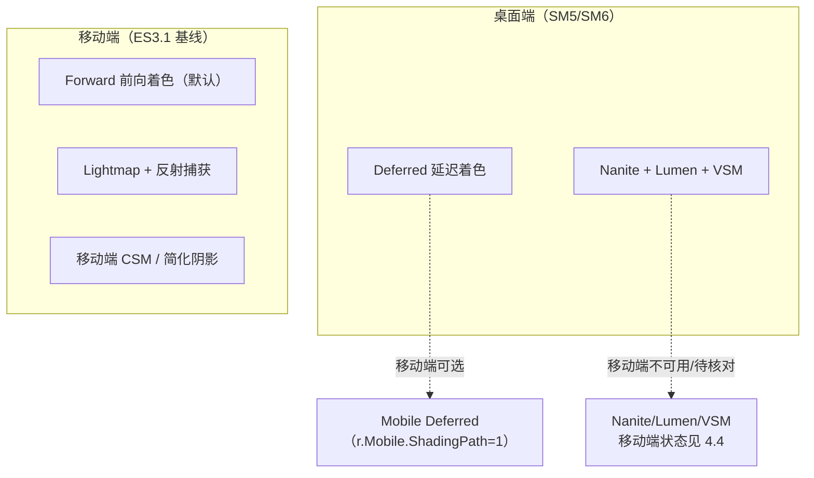
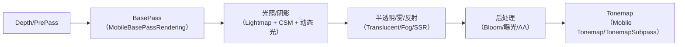
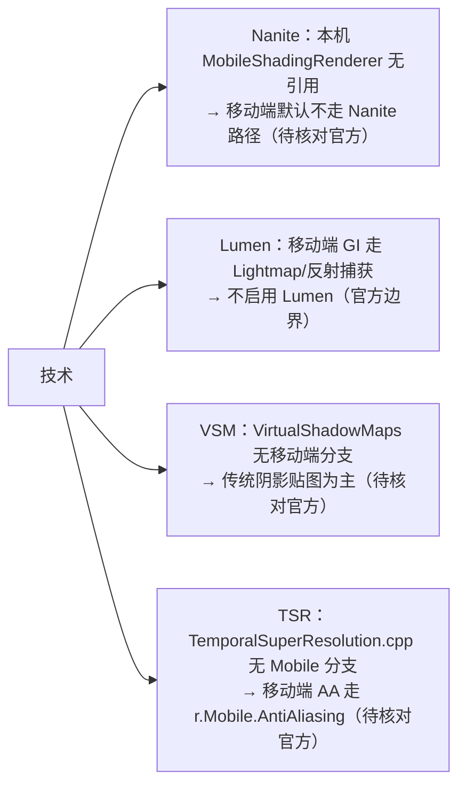
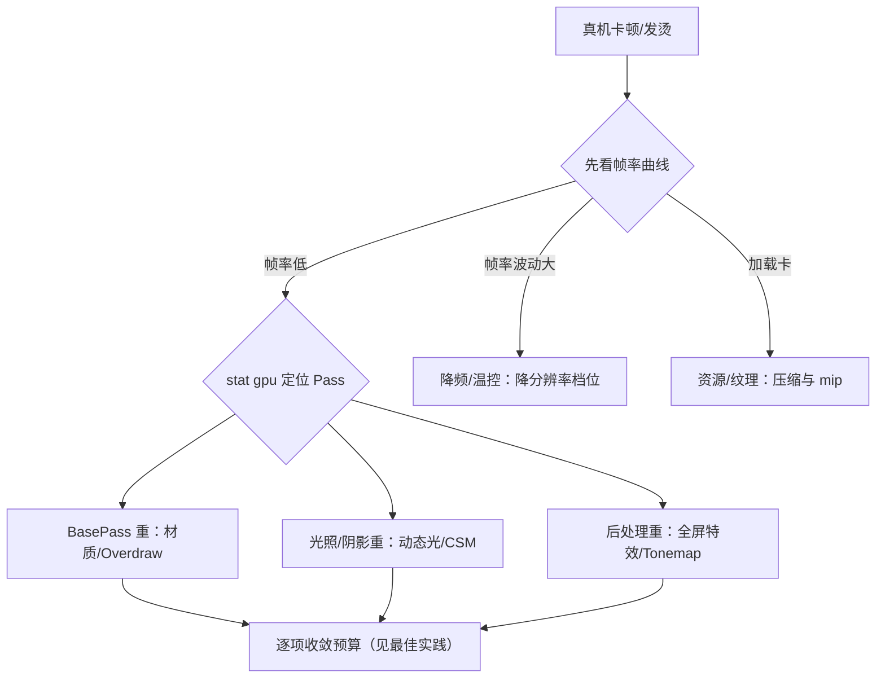

# 10 移动端渲染专项（Mobile Rendering）

> 版本基线：UE5.8.0 / CL55116800 / ++UE5+Release-5.8（本机 `C:\Program Files\Epic Games\UE_5.8\Engine`）。
> 适用范围：Android / iOS 移动端渲染（Mobile Renderer、移动端特性集、后端与性能工程）。
> 事实边界：本文"本机核对"项来自只读检索本机 5.8 源码（`Source\Runtime\Renderer\Private\Mobile*.cpp`、`Source\Runtime\Engine\Classes\Engine\RendererSettings.h`、`Source\Runtime\Engine\Private\SceneUtils.cpp`、`Source\Runtime\RHI\Public\RHIShaderPlatform.h`、`Source\Runtime\Core\Public\PixelFormat.h`、`Config\Android\AndroidScalability.ini` 等）；移动端平台能力（GPU 型号、带宽、发热）以经验与官方文档为边界并标注，无法在本机核对的版本敏感项一律写"待核对"，不虚构类名/函数名/CVar。
> 官方参考：[Mobile Rendering](https://dev.epicgames.com/documentation/en-us/unreal-engine/mobile-rendering-in-unreal-engine)、[Unreal Engine 文档首页](https://dev.epicgames.com/documentation/en-us/unreal-engine)。
> 最后更新：2026-08-07（初稿）。

## 概述

移动端渲染是 UE 渲染体系中的"另一条管线"：桌面端默认的延迟着色、Nanite、Lumen、Virtual Shadow Map 在移动端要么不可用、要么有专门替代方案。UE5 为移动端保留了独立的 **Mobile Renderer（移动渲染器）**，以 **Forward Shading（前向着色）为主**、以 **ES3.1 特性集**为基线，在"画面质量"与"功耗/带宽/发热"之间做系统性取舍。

本机 5.8 的移动渲染器源码（已核对）由一组 `Mobile*` 文件构成（`Source\Runtime\Renderer\Private`）：`MobileShadingRenderer.cpp`（`FMobileSceneRenderer`）、`MobileBasePass.cpp` / `MobileBasePassRendering.cpp`（BasePass 与延迟分支判断 `IsMobileDeferredShadingEnabled`）、`MobileDeferredShadingPass.cpp`（移动端延迟着色 Pass）、`MobileSSR.cpp`（移动端屏幕空间反射）、`MobileFogRendering.cpp`、`MobileTranslucentRendering.cpp`、`MobileDecalRendering.cpp`、`MobileDistortionPass.cpp`、`MobileSeparateTranslucencyPass.cpp`、`MobileReflectionEnvironmentCapture.cpp`、`MobileSingleLayerWaterRendering.cpp`。

一句话定位：**移动端不是"桌面的降级版"，而是一套按移动 GPU 特性（Tile-based、带宽敏感、无 SM6 假设）重新设计的管线**。理解它，才能回答"为什么手机上不能用 Lumen""为什么材质指令数要省""为什么 Overdraw 是头号杀手"。

## 核心概念表

| 概念 | 英文 | 说明（本机 5.8 依据） |
| --- | --- | --- |
| 移动渲染器 | Mobile Renderer | 移动端专用渲染器，`FMobileSceneRenderer`（`MobileShadingRenderer.cpp`） |
| 前向着色 | Forward Shading | 移动端默认着色路径（`r.Mobile.ShadingPath=0`，全设备支持） |
| 移动端延迟着色 | Mobile Deferred | 可选路径（`r.Mobile.ShadingPath=1`，需 HDR + 较新设备，不支持 MSAA） |
| 特性集 | Feature Level | 移动端基线 ES3.1（`ERHIFeatureLevel::ES3_1`），部分后端支持 SM5 |
| 着色平台 | Shader Platform | `SP_VULKAN_ES3_1_ANDROID` / `SP_OPENGL_ES3_1_ANDROID` / `SP_METAL_SM5_IOS` 等（`RHIShaderPlatform.h`） |
| 移动端 HDR | Mobile HDR | `r.MobileHDR`：移动端 HDR 渲染开关，延迟着色强制要求 |
| 反锯齿 | Anti-Aliasing | `r.Mobile.AntiAliasing`：None/FXAA/TAA/MSAA（`RendererSettings.h`） |
| 浮点精度 | Float Precision | `r.Mobile.FloatPrecisionMode`：Half/Full 精度模式 |
| 光照贴图 | Lightmap | 移动端主要 GI 手段（静态光照烘焙），配合移动端反射捕获 |
| 级联阴影 | CSM | 移动端有专门分支与裁剪（`r.Mobile.UseCSMShaderBranch` 等） |
| 纹理压缩 | Texture Compression | ASTC / ETC2（`PixelFormat.h` 的 `PF_ASTC_*`/`PF_ETC2_*`） |
| Tile-based GPU | Tile-Based Rendering | 移动 GPU 按 Tile 渲染，带宽/Overdraw 敏感 |

## 原理详解

### 4.1 移动端渲染管线定位：为什么是 Forward 为主



移动端默认走 **Forward Shading** 的原因：移动 GPU 是 **Tile-based** 架构，延迟着色需要的"多张 GBuffer 写入 + 全屏读写"会放大带宽与发热；前向着色对带宽友好、天然支持 MSAA（硬件抗锯齿）。`r.Mobile.ShadingPath`（`RendererSettings.h` 的 Mobile Shading 设置，需重启编辑器）：

- `Forward = 0`（默认）：全设备支持，强制 MSAA 路径可用；
- `Deferred = 1`：支持 IES 光配置文件、光函数、带光照的延迟贴花，但需要较新设备与 **Mobile HDR**，**不支持 MSAA**（本机 `RendererSettings.h` 工具提示原文口径）。

移动端特性集以 **ES3.1**（`ERHIFeatureLevel::ES3_1`）为基线，着色平台在 `RHIShaderPlatform.h` 中定义（本机已核对）：`SP_METAL_SM5_IOS`（iOS Metal）、`SP_VULKAN_ES3_1_ANDROID` / `SP_OPENGL_ES3_1_ANDROID`（Android）、`SP_VULKAN_SM5_ANDROID`（Android 高端 Vulkan SM5）等；`DataDrivenShaderPlatformInfo.h` 提供按平台的特性开关（如 Android 平台判断）。

### 4.2 移动端帧管线：BasePass → 光照 → 后处理 → Tonemap



移动端帧管线与桌面同构但每段都"轻量化"：

- **BasePass**：`MobileBasePassRendering.cpp` 中按 `IsMobileDeferredShadingEnabled(Platform)` 分流——Forward 下直接输出最终光照结果，Deferred 下输出移动端 GBuffer（默认 128 位/像素，`r.Mobile.ExtendedGBuffer` 可到 160 位/像素以支持更多着色模型与法线编码，本机 `RendererSettings.h` 工具提示原文口径）；
- **光照**：静态光照走 **Lightmap**（光照贴图）+ 移动端反射捕获（`MobileReflectionEnvironmentCapture.cpp`）；动态光有专门的移动端分支与数量控制（见 4.3）；
- **后处理**：移动端执行 Bloom/曝光/Tonemap 等子集，`r.MobileHDR` 控制 HDR 渲染（`BaseEngine.ini` 中以 `+VersionedIntRValues=r.MobileHDR` 登记）；
- **Tonemap**：`r.Mobile.TonemapSubpass` 支持 Vulkan 上的**单 Pass 内联 Tonemap**（`SceneUtils.cpp` 注释口径：截至 UE 5.4 仅 Vulkan 支持内联单 Pass tonemap），减少一次全屏读写。

### 4.3 移动端光照与阴影：数量限制与简化

移动端的光照预算是"**数量限制 + 简化实现**"（本机 CVar 均来自 `RendererSettings.h` 与 `MobileBasePassRendering.cpp` 等，已核对）：

- **静态光照**：Lightmap 是移动端 GI 主力；动态光源数量有明确预算（移动端 Forward 支持的方向光/点光/聚光数量上限以官方文档为准，标注待核对）；`r.Mobile.AllowDistanceFieldShadows` 控制距离场阴影；
- **CSM（级联阴影）**：移动端有专用分支：`r.Mobile.UseCSMShaderBranch`（CSM 着色分支）、`r.Mobile.EnableStaticAndCSMShadowReceivers`（静态与 CSM 阴影接收）、`r.Mobile.EnableMovableLightCSMShaderCulling`（可移动光源 CSM 着色裁剪）、`r.Mobile.Shadow.CSMShaderCullingMethod`；级联数量与分辨率按设备档位收敛（官方文档边界）；
- **动态阴影**：`r.Mobile.EnableMovablePointLightsShadows`、`r.Mobile.EnableMovableSpotlightsShadow`、`r.Mobile.MaxVisibleMovableSpotLightShadows`、`r.Mobile.EnableCapsuleShadows`/`EnableCapsuleDirectShadows` 控制点光/聚光/胶囊阴影；
- **VSM（虚拟阴影贴图）**：本机 5.8 `VirtualShadowMaps` 目录中未检索到移动端专用分支（仅 `bMobileModulatedProjections` 投影相关）——**移动端 VSM 支持状态以官方文档为准（待核对）**，默认方案仍是传统阴影贴图；
- **环境光遮蔽**：`r.Mobile.AmbientOcclusion`、`r.Mobile.DistanceFieldAO`（距离场 AO）按设备能力开关。

### 4.4 移动端与桌面技术的边界（Nanite / Lumen / TSR）



本机 5.8 源码检索结论（如实记录）：

- **Nanite**：`MobileShadingRenderer.cpp` 中无 Nanite 引用；平台级 Nanite 开关由 `DataDrivenShaderPlatformInfo.h` 的 `bSupportsNanite` 标志驱动，移动端是否开放以官方 Release Notes 为准（**待核对**）；
- **Lumen**：移动端全局光照以 Lightmap + 移动端反射捕获实现，不启用 Lumen（桌面特性）；
- **VSM**：移动端默认走传统阴影，VSM 移动端状态待核对官方文档；
- **TSR**：本机 `PostProcess\TemporalSuperResolution.cpp` 无 Mobile 分支，移动端超分/AA 走 `r.Mobile.AntiAliasing` 体系（MSAA/FXAA/TAA），TSR 移动端支持以官方文档为准（**待核对**）。

### 4.5 移动端材质限制：着色模型、指令数与 FP16

移动端材质是"受限材质"（本机 `RendererSettings.h` 已核对相关设置）：

- **着色模型**：移动端以 Default Lit / Unlit 为主，部分着色模型需要移动端延迟着色 + `r.Mobile.ExtendedGBuffer`（160 位/像素）才可用；材质域（如后期处理材质）与桌面相同，但移动端可用特性受特性集限制（官方文档边界）；
- **指令数**：移动端对材质指令数有更严预算（Vertex/Fragment 指令上限以目标版本材质编辑器报告为准，标注待核对），超标会直接拉高 Fragment 成本与带宽；
- **浮点精度**：`r.Mobile.FloatPrecisionMode` 提供 Half/Full 精度模式（本机枚举：`Full_MaterialExpressionOnly`/`Full` 等档位），Half 精度省带宽但可能引入精度伪影，材质表达式可单独要求全精度；
- **带宽敏感**：移动端每个材质读写的背后都是带宽与发热，材质节点数量、纹理采样次数、后处理数量都要纳入预算（见 4.7 与最佳实践）。

### 4.6 渲染后端：Vulkan / Metal / OpenGL ES 与 Tile-based GPU

本机 5.8 RHI 后端（已核对）：`Source\Runtime\VulkanRHI`（Android/桌面 Vulkan）、`Source\Runtime\Apple\MetalRHI`（iOS/tvOS/macOS Metal）、`Source\Runtime\OpenGLDrv`（OpenGL ES 3.1）。选型要点：

- **Android**：首选 **Vulkan**（`SP_VULKAN_ES3_1_ANDROID`），高端设备可走 `SP_VULKAN_SM5_ANDROID`；OpenGL ES 3.1 作为兼容后端（`SP_OPENGL_ES3_1_ANDROID`）；
- **iOS**：**Metal**（`SP_METAL_SM5_IOS`）是唯一后端，支持移动端 SM5 特性；
- **Tile-based GPU 特性**：移动 GPU 按 Tile 分块渲染，片上（On-chip）内存有限——**Overdraw（重复片元）与显存带宽（Bandwidth）是头号性能瓶颈**，其次是发热与降频（Thermal Throttling）。因此移动端优化的核心是"减少无效片元、减少全屏读写、控制带宽"。

### 4.7 移动端性能工程：Draw Call / Overdraw / 纹理压缩 / LOD / 设备分级

- **Draw Call**：移动端 CPU 预算紧张，合并静态网格（ISM/HISM，见 13-02 篇）、减少材质切换、利用 `r.Mobile.MeshSortingMethod` 等排序策略；
- **Overdraw**：半透明、全屏后处理、粒子是重灾区；用 `r.Mobile.AdrenoOcclusionMode`（Adreno 遮挡模式）等平台级遮挡优化，并在真机用 GPU 计数器观测；
- **纹理压缩**：移动端以 **ASTC**（首选，`PF_ASTC_4x4` 等，`PixelFormat.h` 约 50 号起，8.00 bpp）与 **ETC2**（`PF_ETC2_RGB`/`PF_ETC2_RGBA`，约 46/47 号）为主；ASTC 支持性更好（尤其 Mali/Adreno/Apple GPU），ETC2 作为兼容基线；
- **LOD / HLOD**：移动端屏幕小，LOD 切换更激进；大世界用 HLOD 收敛远处资产（见 01-引擎基础 09 篇与 13 章）；
- **设备分级**：`r.MobileContentScaleFactor`（本机 `AndroidWindowUtils.h`/`IOSWindow.cpp` 已核对）按设备缩放渲染分辨率；`AndroidScalability.ini`/`IOSScalability.ini` 提供分档（本机核对：各档位 `r.Mobile.AntiAliasing=0/1/2/2` 等）；配合 Device Profiles 与 Scalability 组按 GPU 档位下发配置。

## 代码 / 示例

### 5.1 移动端渲染配置（`DefaultEngine.ini` 示意）

> 示意：CVar 名均来自本机 5.8 核对（`RendererSettings.h`/`Mobile*.cpp`）；取值与默认值以目标版本与设备档位为准。

```ini
[/Script/Engine.RendererSettings]
; 移动端着色路径：0=Forward（默认，全设备） 1=Deferred（需 HDR+新设备，不支持 MSAA）
r.Mobile.ShadingPath=0
; 移动端反锯齿：0=None 1=FXAA 2=TAA 3=MSAA
r.Mobile.AntiAliasing=3
; 浮点精度模式（Half 为主，关键材质表达式单独全精度）
r.Mobile.FloatPrecisionMode=0
; 移动端 HDR（延迟着色必须开启）
r.MobileHDR=True

[SystemSettings]
; 阴影与光照收敛（按设备档位下发）
r.Mobile.MaxVisibleMovableSpotLightShadows=1
r.Mobile.EnableMovablePointLightsShadows=False
r.Mobile.AllowDistanceFieldShadows=False
```

### 5.2 设备分级（DeviceProfile 示意）

```ini
; 示意：按 GPU 档位（低/中/高）下发不同移动端配置
[DeviceProfileLow]
DeviceType=Android
+CVars=r.MobileContentScaleFactor=0.7
+CVars=r.Mobile.AntiAliasing=0
+CVars=r.Mobile.MaxVisibleMovableSpotLightShadows=0

[DeviceProfileHigh]
DeviceType=Android
+CVars=r.MobileContentScaleFactor=1.0
+CVars=r.Mobile.AntiAliasing=2
```

### 5.3 核对本机移动端实现（验证命令）

```powershell
$UE = 'C:\Program Files\Epic Games\UE_5.8\Engine'
# 移动渲染器文件与 CVar 定义
Get-ChildItem "$UE\Source\Runtime\Renderer\Private" -Filter 'Mobile*' | Select-Object -ExpandProperty Name
rg -n "r.Mobile.ShadingPath|r.Mobile.AntiAliasing|r.Mobile.FloatPrecisionMode" "$UE\Source\Runtime\Engine\Classes\Engine\RendererSettings.h"
# 着色平台枚举
rg -n "SP_VULKAN_ES3_1_ANDROID|SP_METAL_SM5_IOS" "$UE\Source\Runtime\RHI\Public\RHIShaderPlatform.h"
# 移动端纹理格式
rg -n "PF_ASTC_4x4|PF_ETC2_RGB" "$UE\Source\Runtime\Core\Public\PixelFormat.h"
```

### 5.4 真机验证清单

- [ ] 目标 GPU 档位覆盖：Android（Mali/Adreno/Apple 系）与 iOS（新旧两代 A 系）至少各一台低端机；
- [ ] 帧率与温控：30/60 帧目标下运行 30 分钟以上，记录"稳定帧率"与降频时机；
- [ ] 带宽观测：`stat gpu`/`stat unit` + GPU 计数器（Mali Offline Compiler/Adreno Profiler/Xcode GPU Frame Capture）；
- [ ] 分辨率档位：`r.MobileContentScaleFactor` 各档位画质与性能对照；
- [ ] 纹理压缩：确认 ASTC/ETC2 实际生效格式与 mip 完整性；
- [ ] 材质精度：Half/Full 精度切换后的画面伪影清单；
- [ ] 阴影/光照：CSM 级联与动态光数量在低端机的表现；
- [ ] 回归对照：与上一版本同场景数据对比（帧率/温度/内存）。

## 附录：移动端性能排查流程



排查顺序建议：先帧率曲线分"持续低/波动/加载卡"三类，再用 `stat gpu` 与真机 GPU 计数器定位 Pass，最后按预算表逐项收敛；带宽与发热问题优先降 Overdraw、降分辨率、降动态光。

## 预算示例表（按设备档位，示意）

| 预算项 | 低端机 | 中端机 | 高端机 |
| --- | --- | --- | --- |
| 渲染分辨率（`r.MobileContentScaleFactor`） | 0.7 | 0.85 | 1.0 |
| 帧率目标 | 30 | 30 | 60 |
| AA（`r.Mobile.AntiAliasing`） | 0/1 | 1/2 | 2/3 |
| 动态光数量 | 1~2 | 2~4 | 4~8 |
| CSM 级联 | 1 | 2 | 3 |
| Draw Call 预算 | ~200 | ~400 | ~800 |
| 半透明/粒子层 | 严格收敛 | 中等 | 全量 |
| 纹理格式 | ETC2/ASTC 低档 | ASTC | ASTC 高档 |

> 数值为工程示意，不是引擎承诺；每档以真机实测校准。

## 最佳实践

1. **以真机为唯一真相**：编辑器/模拟器跑不出带宽与发热；性能验收必须覆盖目标 GPU 档位真机（Android 覆盖 Mali/Adreno/Apple 系，iOS 覆盖 A 系芯片新旧两代）。
2. **预算表先立后调**：按设备档位定 Draw Call、三角形、Overdraw、带宽与内存预算；用 `stat gpu`/`stat unit` 与 GPU 计数器（如 Mali/Adreno/Apple 工具）观测，超预算项进清单逐项收敛。
3. **Overdraw 是头号敌人**：半透明、粒子、全屏后处理逐个审查；能用"少写"解决的不用"少画"解决（Tile GPU 上片元写入就是带宽）。
4. **光照预算化**：移动端以 Lightmap 为主，动态光数量按档位收敛；阴影只给"主角附近"；CSM 级联数与分辨率按档位下调。
5. **纹理压缩优先 ASTC**：贴图默认 ASTC（兼容性差再退 ETC2）；mip 完整、尺寸贴档位，避免高分辨率贴图浪费带宽。
6. **材质瘦身**：指令数、纹理采样、材质数量都要管；Half 精度为主，个别精度敏感表达式单独全精度；材质实例化减少编译与切换成本。
7. **分辨率与帧率分级**：`r.MobileContentScaleFactor` 按档位缩放渲染分辨率；帧率目标（30/60）与温控策略（降分辨率保帧率）在 DeviceProfile 中预置。
8. **LOD/HLOD 用足**：移动端屏幕小，LOD 切换可更激进；大世界用 HLOD 收敛，配合 13 章与 01-引擎基础 09 篇。
9. **发热与降频预案**：长时间游玩会降频；压力测试（30 分钟+）看"稳定帧率"而非峰值，必要时动态降分辨率/特效档位。
10. **版本敏感项登记**：移动端 Deferred、SSR、VSM/Nanite/TSR 的移动端状态随版本演进，升级引擎后回归本文件的核对清单。

## 常见问题 FAQ

### Q1：移动端为什么不用 Nanite/Lumen？

Nanite/Lumen 面向桌面级 GPU 的虚拟化与全局光照管线，移动端带宽与算力不足以支撑；移动端以 Lightmap + 反射捕获 + 简化阴影替代。特定版本是否开放移动端 Nanite 等能力，以官方 Release Notes 为准（本机 5.8 移动渲染器无 Nanite 引用，标注待核对）。

### Q2：移动端能用延迟着色吗？

UE5.8 提供移动端 Deferred 路径（`r.Mobile.ShadingPath=1`，本机 `MobileDeferredShadingPass.cpp` 已核对），支持 IES/光函数/延迟贴花，但要求 Mobile HDR 与较新设备，且**不支持 MSAA**；默认仍是 Forward。

### Q3：移动端抗锯齿选什么？

`r.Mobile.AntiAliasing`：Forward 下优先 MSAA（硬件抗锯齿，带宽可控）；不支持 MSAA 或 GammaLDR 模式（`SceneUtils.cpp` 口径：非 HDR 且非 MSAA 时 AA 被禁用）时用 TAA/FXAA。按设备档位下发。

### Q4：画面"糊"或"闪"怎么办？

先查渲染分辨率（`r.MobileContentScaleFactor` 是否被调低）与 AA 设置；再查 TAA 抖动/GammaLDR 交互（非 HDR 下 TAA 会被禁用）；最后查 mip 与纹理压缩格式是否匹配设备。

### Q5：手机发烫、掉帧快怎么办？

这是带宽与算力超载的典型信号：降 Overdraw（半透明/后处理/粒子）、降分辨率档位、降阴影与动态光、限制帧率；用真机 GPU 计数器定位"哪个 Pass 吃带宽"。

### Q6：ASTC 和 ETC2 怎么选？

优先 ASTC（压缩率与质量均衡，现代移动 GPU 基本支持）；对老设备或兼容性要求高的渠道用 ETC2 兜底。工程内可按平台设置纹理压缩格式。

### Q7：材质在手机上变丑/变亮是怎么回事？

大概率是移动端材质限制与精度问题：着色模型不支持、指令数被裁剪、Half 精度伪影。在材质编辑器看移动端预览与编译报告，按 `r.Mobile.FloatPrecisionMode` 与 ExtendedGBuffer 配置核对。

### Q8：移动端能用 TSR 超分吗？

本机 5.8 `TemporalSuperResolution.cpp` 无 Mobile 分支，移动端超分/AA 走 `r.Mobile.AntiAliasing` 体系；TSR 移动端支持以官方文档为准（待核对）。

### Q9：为什么模拟器不卡、真机卡？

模拟器用桌面 GPU 渲染，测不出 Tile-based 带宽、发热降频与驱动差异；性能问题必须以真机（目标 GPU 档位）复测，并把"稳定帧率"作为验收指标。

### Q10：移动端 VSM 阴影能用吗？

本机 5.8 VirtualShadowMaps 无移动端专用分支，默认走传统阴影贴图；VSM 移动端状态以官方文档为准（待核对），生产项目先按传统阴影做预算。

### Q11：移动端延迟着色（Deferred）值得开吗？

取决于目标设备与需求：Deferred 支持 IES 光配置文件、光函数与延迟贴花，但要求 Mobile HDR 与较新设备，且不支持 MSAA（本机 `RendererSettings.h` 工具提示口径）。低端机占主流的项目默认保持 Forward。

### Q12：做移动端需要给每台真机单独调参吗？

不需要逐台调：用 Device Profiles + Scalability 分档（低/中/高）按 GPU 档位下发配置，真机验证覆盖每档代表机型即可；`r.MobileContentScaleFactor` 处理"同档位内的分辨率差异"。

## 关联阅读

- [01-渲染管线概览.md](./01-渲染管线概览.md)：桌面渲染管线总览——与移动端管线的差异对照基线。
- [02-材质系统详解.md](./02-材质系统详解.md)：PBR 与材质系统——移动端材质限制的延伸背景。
- [03-光照与阴影系统.md](./03-光照与阴影系统.md)：光照与阴影原理——移动端 Lightmap/CSM 简化方案的基础。
- [04-Nanite与Lumen.md](./04-Nanite与Lumen.md)：桌面端杀手锏——理解"为什么移动端不用"。
- [05-后处理与画面特效.md](./05-后处理与画面特效.md)：后处理原理——移动端子集的取舍依据。
- [04-渲染与加载性能优化](../07-UI与性能优化/04-渲染与加载性能优化.md)：渲染与加载性能优化的通用手段（Draw Call/资源/流送）。
- [10-渲染线程与RHI源码](../12-引擎源码分析/10-渲染线程与RHI源码.md)：渲染线程与 RHI 抽象——移动端后端（Vulkan/Metal/GLES）的源码背景。

## 更新日志

- 2026-08-07：初稿创建。已核对本机 UE5.8 的移动渲染器文件清单、`r.Mobile.*` CVar（`RendererSettings.h`/`Mobile*.cpp`/`SceneUtils.cpp`）、着色平台枚举（`RHIShaderPlatform.h`）、移动端纹理格式（`PixelFormat.h`）与 Android/iOS Scalability 配置；Nanite/Lumen/VSM/TSR 的移动端状态、动态光数量上限与指令数预算标注"待核对/官方边界"。
