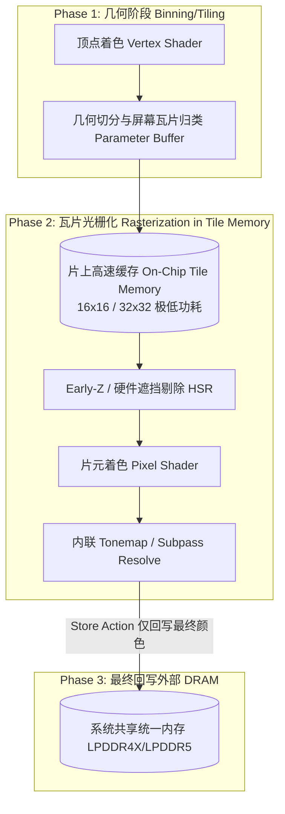

# 10 移动端渲染专项（Mobile Rendering Deep Dive）
> 知识成熟度：L2（已按 UE5.8 移动端渲染管线与 TBDR 硬件特性全面补齐架构对比、ASTC 规范、Subpass 优化、着色器精度与设备分级配置）。

> 版本基准：UE 5.8.0 / CL55116800 / ++UE5+Release-5.8（本机 `Engine/Build/Build.version`）。
> 适用范围：Android / iOS 移动端图形渲染架构师、性能优化工程师与核心技术美术。
> 事实边界：本文代码与控制台变量已核对本机 `C:\Program Files\Epic Games\UE_5.8\Engine`（`Source\Runtime\Renderer\Private\Mobile*`、`Source\Runtime\VulkanRHI`、`Source\Runtime\Apple\MetalRHI`、`Source\Runtime\Engine\Classes\Engine\RendererSettings.h` 等）。
> 官方参考：[Mobile Rendering in Unreal Engine](https://dev.epicgames.com/documentation/en-us/unreal-engine/mobile-rendering-in-unreal-engine)。
> 最后更新：2026-08-20（深化重构：补齐 TBDR 片上内存原理、Mobile Deferred G-Buffer 布局、ASTC 选型矩阵与帧率平滑锁帧）。

---

## 概述

在移动设备（智能手机与平板）上运行大型 3D 游戏，与桌面 PC/主机存在根本性的物理规律差异。移动平台受制于**电池容量、被动散热（无风扇）与严苛的显存总线带宽**：
- **移动 GPU 架构核心**：几乎所有移动 GPU（Qualcomm Adreno、ARM Mali、Apple Silicon、Imagination PowerVR）均采用 **TBDR（Tile-Based Deferred Rendering，分块延迟渲染）** 架构；
- **核心优化哲学**：优化的第一优先级永远是 **DRAM 外部内存带宽（Bandwidth）** 与 **发热功耗（Thermal Throttling）**，而非单纯的峰值算力（TFLOPS）；
- **管线选型抉择**：UE5 提供了优化的 **Mobile Forward**（前向渲染）与实验演进的 **Mobile Deferred**（移动端延迟渲染），两者在 MSAA 抗锯齿、动态光源支持数量与片上 G-Buffer 内存读写上存在明显权衡。

---

## 核心概念表

| 核心术语 | 英文对照 | 硬件/引擎事实与机理 | 工程约束与关键关注点 |
| :--- | :--- | :--- | :--- |
| **分块延迟渲染** | TBDR | 移动 GPU 将屏幕切为 16×16 或 32×32 瓦片，在片上缓存完成着色 | 彻底消除不可见图元的片元着色计算，大幅压降带宽 |
| **片上瓦片缓存** | On-Chip Tile Memory | 移动 GPU 核心附近的高速 SRAM（极小、极快、零外存功耗） | 必须尽量在片上完成颜色合并与 MSAA 解析，禁止频繁回写 |
| **通道加载操作** | `LoadAction::Load` | RenderPass 启动时从外部 DRAM 重新拉取旧像素数据 | 产生高昂总线带宽，必须优化为 `LoadAction::Clear` 或 `DontCare` |
| **通道存储操作** | `StoreAction::Store` | RenderPass 结束时将片上 Tile 数据写入外部系统 DRAM | 仅最终输出 Buffer 允许 Store，中间深度/GBuffer 必须为 `DontCare` |
| **移动端前向着色** | Mobile Forward | 几何体绘制时直接计算光照并输出最终颜色 | 默认着色路径，支持硬件 2x/4x MSAA，极致节省显存 |
| **移动端延迟着色** | Mobile Deferred | 将材质属性写入片上 G-Buffer，由后期光照 Pass 统合求解 | 支持更多动态光源与 DBuffer 贴花，但依赖 Subpass 扩展支持 |
| **内联单通道色调映射**| Tonemap Subpass | 在同一个 Vulkan/Metal RenderPass 内完成色调映射后处理 | 避免单独开一个全屏 Quad Pass 回写，节省 1 次整屏 DRAM 带宽 |
| **自适应纹理压缩** | ASTC | 现代全平台主流块压缩纹理格式（4×4 至 12×12 可变块大小） | 移动端必须 100% 普及 ASTC，杜绝未压缩贴图进入包体 |
| **帧步调平滑** | Frame Pacing | 控制 CPU 提交与 GPU 呈现与屏幕垂直同步（VSync）严格对齐 | 防止偶发性画面撕裂与输入微卡顿，消除空转等待发热 |

---

## 核心硬件原理：TBDR 架构与片上高速缓存

桌面 GPU 通常采用 IMR（Immediate Mode Rendering，立即模式渲染），每个三角形像素化后直接读写庞大的外部显存（VRAM）。而移动 TBDR 将屏幕切分成微小的瓦片（通常为 16×16 或 32×32 像素），渲染分为几何与光栅化两阶段：


```mermaid
flowchart TB
    subgraph Phase1[Phase 1: 几何阶段 Binning/Tiling]
        VS[顶点着色 Vertex Shader] --> Binning[几何切分与屏幕瓦片归类 Parameter Buffer]
    end

    subgraph Phase2[Phase 2: 瓦片光栅化 Rasterization in Tile Memory]
        Binning --> TileMem[(片上高速缓存 On-Chip Tile Memory<br/>16x16 / 32x32 极低功耗)]
        TileMem --> HSR[Early-Z / 硬件遮挡剔除 HSR]
        HSR --> PS[片元着色 Pixel Shader]
        PS --> Subpass[内联 Tonemap / Subpass Resolve]
    end

    subgraph Phase3[Phase 3: 最终回写外部 DRAM]
        Subpass -->|Store Action 仅回写最终颜色| DRAM[(系统共享统一内存 LPDDR4X/LPDDR5)]
    end
```

**TBDR 黄金法则：**
1. **Load/Store Action 成本极高**：在 RenderPass 开始时的 `LoadAction::Load`（从外部 DRAM 将旧数据拉入片上 Tile）和结束时的 `StoreAction::Store`（将 Tile 写回 DRAM）是最大的发热与功耗元凶；
2. **中间 RenderTarget 坚决不写回**：深度缓冲（Depth/Stencil）与 G-Buffer 应该尽量在片上分配、片上消费，并在 Pass 结束时标记为 `StoreAction::DontCare`（丢弃），杜绝无意义带宽往返；
3. **消除全屏透明 Overdraw**：大量重叠的半透明 UI、粒子与全屏水体后处理会迫使 GPU 针对同一 Tile 像素反复执行混合读写，瞬间打破片上缓存能效比。

---

## Mobile Forward vs Mobile Deferred 深度对比

| 架构维度 | Mobile Forward（经典前向） | Mobile Deferred（移动端延迟） | 工程权衡与选型建议 |
| :--- | :--- | :--- | :--- |
| **G-Buffer 开销** | 无 G-Buffer，直接输出最终漫反射与高光颜色 | 依赖 128 位/160 位片上 G-Buffer（`r.Mobile.ExtendedGBuffer`） | Forward 极致省显存，Deferred 支持复杂光影模型 |
| **多动态光源** | 受限于单材质循环，通常限制 1 盏方向光 + 少量点光 | 光源作为独立几何体解算，支持多盏可移动动态光源 | 室内多光源场景选 Deferred，大世界自然风选 Forward |
| **硬件 MSAA 支持** | 原生支持硬件级 2x/4x MSAA（在 Tile 内混合，零带宽） | 不支持硬件 MSAA，只能依赖 FXAA 或 TAA 时序抗锯齿 | 对边缘抗锯齿有极致洁癖（二次元画风）推荐 Forward |
| **Decal / 贴花** | 依赖 Mesh 贴花或深度重投影 | 原生支持 G-Buffer DBuffer 贴花与屏幕空间混合 | 现代复杂场景贴花丰富时 Deferred 优势明显 |
| **最低硬件要求** | OpenGL ES 3.2 / Vulkan 1.1 / Metal | Vulkan 1.2+ / Metal 2+（需支持 Subpass 原生扩展） | 目标设备覆盖低端长尾机型时务必保留 Forward |

---

## 移动端技术边界与桌面特性映射

由于芯片发热与功耗物理墙的存在，桌面端 UE5 特性在移动端有明确的工程边界：

```text
桌面端特性                   移动端生产环境现状（UE5.8）
─────────────────────────────────────────────────────────────────────────────
Nanite 虚拟多边形       ───► 默认关闭（依赖高带宽硬件 64位原子；移动端以 LOD/HLOD 为基石）
Lumen 动态全局光照      ───► 关闭（移动端仍以离线 GPU Lightmass / 预计算光照贴图为主）
Virtual Shadow Map(VSM) ───► 谨慎开启（通常使用 CSM 级联阴影，中低端机型固定 1~2 级）
TSR 时序超分辨率        ───► 移动端开销过大（推荐使用 TAA，或高通 GSR / ARM ASR 超分插件）
HWRT 硬件光线追踪       ───► 仅限旗舰芯片（骁龙 8 Gen 2+/天玑 9200+ 实验性试水，功耗极高）
```

---

## 工业级移动端配置规范（DefaultEngine.ini）

```ini
[/Script/Engine.RendererSettings]
; 0 = Forward（默认推荐，全机型兼容），1 = Mobile Deferred（高端机特性）
r.Mobile.ShadingPath=0

; 抗锯齿选型：0=None, 1=FXAA, 2=TAA, 3=MSAA (Forward 推荐 3, Deferred 推荐 2)
r.Mobile.AntiAliasing=3
r.MSAACount=2

; 浮点精度模式：0=Half（默认 FP16 省带宽），关键着色器局部声明 FullPrecision
r.Mobile.FloatPrecisionMode=0

; 移动端 HDR（开启后支持真实的曝光与辉光，但会增加 RenderTarget 尺寸）
r.MobileHDR=True

; 开启 Vulkan 内联单 Pass Tonemap，消除一次全屏后处理回写带宽
r.Mobile.TonemapSubpass=1

[SystemSettings]
; 阴影数量硬性上限收敛
r.Mobile.MaxVisibleMovableSpotLightShadows=1
r.Mobile.EnableMovablePointLightsShadows=False
r.Mobile.AllowDistanceFieldShadows=False
r.Shadow.CSM.MaxCascades=2
```

---

## 材质与纹理规范：ASTC 压缩矩阵

移动端纹理**必须**全局转为 ASTC（Adaptive Scalable Texture Compression）格式。禁止在运行时传输未压缩的 RGBA8 贴图：

| 贴图类型 | 推荐 ASTC 规格 | 压缩比率 (bpp) | 视觉质量与工程实践准则 |
| :--- | :---: | :---: | :--- |
| **法线贴图 (NormalMap)** | `ASTC 4x4` 或 `ASTC 5x5` | 8.00 / 5.12 bpp | 法线精度敏感，使用低压缩率避免光影接缝与马赛克伪影 |
| **主角色漫反射 (BaseColor)** | `ASTC 6x6` | 3.56 bpp | 视觉细节保留良好，显存占用仅为未压缩的 11% |
| **场景环境/地表大纹理** | `ASTC 8x8` | 2.00 bpp | 远景与大世界地表推荐，大幅压降运行时显存与流送带宽 |
| **遮罩/粗糙度/金属度 (Mask)** | `ASTC 6x6` 或 `ASTC 8x8` | 3.56 / 2.00 bpp | 打包放入 R/G/B 通道（ORM 贴图），单贴图采样替代三次采样 |
| **UI 界面大图/全屏立绘** | `ASTC 4x4` | 8.00 bpp | UI 边缘锐利度要求高，禁止过度压缩造成文字发糊 |

---

## 设备分级与全机型性能预算表（DeviceProfile 体系）

在 `Config/DefaultDeviceProfiles.ini` 中针对 Android / iOS 硬件矩阵构建硬性性能红线：

| 设备分级档位 | 代表芯片平台 | 目标分辨率缩放 | 目标帧率 | 建议最大 DrawCall | 建议最大同屏面数 | 显存控制红线 |
| :--- | :--- | :---: | :---: | :---: | :---: | :---: |
| **Low (千元入门机)** | 骁龙 680 / Helio G85 / Mali-G52 | 0.65 (约 720P) | 30 FPS | < 120 | < 25 万面 | < 650 MB |
| **Mid (主流中端机)** | 骁龙 778G / 天玑 8100 / Mali-G77 | 0.80 (约 864P) | 45 / 60 FPS | < 220 | < 50 万面 | < 1.1 GB |
| **High (旗舰性能机)** | 骁龙 8 Gen 2 / 天玑 9200 / A16 | 1.00 (1080P 原生) | 60 FPS | < 350 | < 90 万面 | < 1.6 GB |
| **Ultra (平板/顶配)** | 骁龙 8 Gen 3 / Apple M2 / M3 | 1.00 (超高清) | 90 / 120 FPS | < 500 | < 150 万面 | < 2.2 GB |

```ini
; 1. 低端千元机档位（配置示例）
[Android_Low DeviceProfile]
DeviceType=Android
BaseProfileName=Android
+CVars=r.MobileContentScaleFactor=0.65
+CVars=r.Mobile.AntiAliasing=1
+CVars=r.ShadowQuality=0
+CVars=r.PostProcessing.DisableShadows=1
+CVars=r.ParticleLODBias=1

; 2. 中端主流机档位
[Android_Mid DeviceProfile]
DeviceType=Android
BaseProfileName=Android
+CVars=r.MobileContentScaleFactor=0.8
+CVars=r.Mobile.AntiAliasing=3
+CVars=r.MSAACount=2
+CVars=r.ShadowQuality=2
+CVars=r.Shadow.CSM.MaxCascades=2

; 3. 高端旗舰档位
[Android_High DeviceProfile]
DeviceType=Android
BaseProfileName=Android
+CVars=r.MobileContentScaleFactor=1.0
+CVars=r.Mobile.AntiAliasing=2
+CVars=r.ShadowQuality=3
+CVars=r.Shadow.CSM.MaxCascades=3
+CVars=r.Mobile.ShadingPath=1
```

---

## 移动端专属性能调优与着色器变体收敛

### 1. 着色器编译变体（Permutations）消减

移动端驱动（尤其是较老的 OpenGL ES 或入门 Vulkan 驱动）在运行期遭遇新 Shader 编译时极易产生几百毫秒甚至数秒的卡顿。
- **关闭无用着色模型**：在 Project Settings 中禁用 `Clear Coat`、`Subsurface Profile`、`Two Sided Foliage` 等移动端不使用的着色模型；
- **材质精度强制收敛**：默认开启 `r.Mobile.FloatPrecisionMode=0`（半精度 FP16），仅在计算 UV 平铺大坐标与世界坐标偏移（WPO）时显式使用 `float`；
- **静态分支与静态开关（Static Switch）控制**：避免材质中组合爆炸式的开关分支，将通用材质沉淀为标准化基础母材质。

### 2. 帧率平滑与热控制（Thermal Frame Pacing）

手机设备受限于均热板导热极限，无法长时间维持高功耗输出：
- **动态锁帧策略**：在普通跑图与待机界面锁 30/45 帧，战斗爆发期动态放开至 60 帧；
- **集成 Android Swappy (Frame Pacing Library)**：利用 Android 官方帧步调库消除呈现（Present）抖动，避免主线程因为等待 VSync 产生丢帧假死；
- **温控回调降级**：监听系统温控事件（如 Android `ThermalStatusListener`），在设备进入 `SEVERE`（严重发热）状态时，主动将 `r.MobileContentScaleFactor` 从 1.0 降低至 0.8 并关闭泛光与环境光遮蔽。

---

## 移动端常见故障排查手册

```text
问题 A：游戏运行 5 分钟后帧率从 60 骤降到 30 甚至 20，机身滚烫
  ├─ 根本原因：严重 Thermal Throttling（热降频）。总带宽超载（DRAM 频繁大容量读写）。
  └─ 排查方案：使用 Snapdragon Profiler 抓取 Memory Read/Write 带宽。
     1. 降低 r.MobileContentScaleFactor；
     2. 检查 UI 是否存在巨大的全屏半透明 Overdraw（开启 Show Quad Overdraw 视图）；
     3. 开启 r.Mobile.TonemapSubpass=1 消除 Tonemap 回写。

问题 B：真机画面出现密集的网格状摩尔纹或黑色块
  ├─ 根本原因：材质中使用了 FP16（Half）精度，且在世界坐标或法线计算中发生了精度截断溢出。
  └─ 解决方案：在材质编辑器中，选中对应计算节点勾选 "Use Full Precision"（强制 FP32 计算）。

问题 C：开启移动端延迟着色后，特定机型崩溃在 vkCreateRenderPass
  ├─ 根本原因：GPU 驱动不支持多个 Subpass Color Attachment 片上常驻。
  └─ 解决方案：检查设备 Vulkan 扩展支持，针对白名单机型下发 Mobile Deferred，其余回退 Forward。

问题 D：半透明粒子特效在角色身后出现怪异切边与黑边
  ├─ 根本原因：移动端开启了深度预通道但未开启 Mobile Separate Translucency，或半透明混合模式设置为 PreMultipliedAlpha 但贴图未做预乘。
  └─ 解决方案：统一粒子材质为 Additive 或 Translucent，并核对 r.Mobile.AllowDepthTexture 选项。
```

---

## 移动端自定义 HLSL 着色器精度规范（代码实战）

在编写自定义 HLSL 节点或 Custom Shading Node 时，必须严格遵循半精度与全精度的分工：

```hlsl
// 移动端高效 HLSL 自定义着色片段 (Custom Node)
// 规范：法线、世界坐标计算使用 float (FP32)，颜色与中间标量使用 half (FP16)

#if PLATFORM_ANDROID || PLATFORM_IOS
    // 1. 视线方向与法线点积：使用 half 足够表达光照强度
    half3 LightDir = normalize((half3)InLightDirection);
    half3 WorldNorm = normalize((half3)InWorldNormal);
    half NdotL = saturate(dot(WorldNorm, LightDir));

    // 2. 边缘光（Rim Light）计算：使用 half
    half3 ViewDir = normalize((half3)InViewDirection);
    half NdotV = saturate(dot(WorldNorm, ViewDir));
    half Rim = pow(1.0h - NdotV, (half)InRimExponent);

    // 3. 最终颜色组合与饱和度调整
    half3 FinalColor = (half3)InBaseColor * NdotL + Rim * (half3)InRimColor;
    return half4(FinalColor, 1.0h);
#else
    // 桌面端保持全精度 FP32
    float3 LightDir = normalize(InLightDirection);
    float3 WorldNorm = normalize(InWorldNormal);
    float NdotL = saturate(dot(WorldNorm, LightDir));
    float3 ViewDir = normalize(InViewDirection);
    float NdotV = saturate(dot(WorldNorm, ViewDir));
    float Rim = pow(1.0f - NdotV, InRimExponent);
    return float4(InBaseColor * NdotL + Rim * InRimColor, 1.0f);
#endif
```

---

## 移动端反射与后处理选型

### 1. 移动端反射方案（Reflection Environment）
- **移动端反射捕获（Mobile Reflection Capture）**：烘焙环境立体图（Cubemap），是移动端性价比最高的局部反射方案；
- **平面反射（Planar Reflection）**：仅在极特殊的高端机镜面/平静水面开启，开销等于场景多画一遍，低端机必须硬性关闭；
- **屏幕空间反射（SSR）**：在移动端 Forward 下不可用，在 Mobile Deferred 下为极高开销特性，非展会级 Demo 严禁开启。

### 2. 移动端轻量后处理管线
- **Bloom（泛光）**：移动端采用低开销的高斯降采样模糊（Fast Gaussian Blur），控制下采样 Passes ≤ 3 级；
- **ToneMapping**：优先开启 `r.Mobile.TonemapSubpass=1` 在片上直接完成 ACES 色调映射，避免二次离屏 RT 申请；
- **Color Grading（LUT 颜色查找表）**：移动端推荐使用 16×16×16 或 32×32×32 的 2D 展开图集 LUT，采样指令极低且色彩风格调校直观。

---

## 常见问题 FAQ

**Q1：移动端是否应该无脑开启 Vulkan？**
对于 Android 10+ 与主流设备，Vulkan 相比 GLES 能够减少 30% 以上的 CPU 驱动开销与多线程渲染卡顿；但长尾低端设备（尤其联发科早期入门芯片）的 Vulkan 驱动存在兼容性 Bug，建议配置以芯片型号为维度的驱动白名单。

**Q2：移动端 MSAA 会导致显存占用暴涨吗？**
在 TBDR 架构下，MSAA 的采样计算与多采样解析（Resolve）完全发生在片上 Tile 缓存中，**不会成倍消耗外部 DRAM 显存**，仅消耗极少量片上缓冲。因此在 Forward 管线下开启 2x MSAA 的性价比极高。

**Q3：移动端如何有效控制 DrawCall 数量？**
移动端推荐 DrawCall 阈值：低端机 < 120，高端机 < 350。核心手段是使用 HISM 实例化合并地表资产、使用 Texture Atlas 打包 UI 与特效贴图、以及严格配置距离剔除（Cull Distance）。

**Q4：为什么移动端烘焙的光照贴图（Lightmap）会有严重的黑斑？**
通常是 UV2（Lightmap UV）存在重叠面、图表边缘 Padding 边距不足导致双线性过滤漏光，或移动端 HDR 压缩格式导致低照度截断。应确保 UV2 自动解开无重叠，Padding ≥ 4 像素。

**Q5：移动端可以用自定义深度（CustomDepth）做描边吗？**
可以，但开销极贵！CustomDepth 会迫使 GPU 额外执行一次深度写入 Pass，并在 DRAM 中常驻全屏深度纹理。在移动端实现角色描边，强烈推荐使用**双 Pass 背面外扩顶点法线法（Inverted Hull Outline）**，其开销仅相当于绘制一个轻量 Mesh。

**Q6：如何排查移动端特定材质编译失败？**
在引擎启动参数中加入 `-FeatureLevelES31` 或在编辑器视口切换为 "Android Vulkan 预览模式"，材质编辑器将直接以目标移动平台交叉编译器编译并报出具体的溢出指令（如超过 Max Texture Samplers 上限 16 个）。

**Q7：移动端粒子特效频繁导致发热掉帧？**
由于移动 GPU 对半透明混合的读-改-写带宽极其敏感，特效设计必须严格遵循：单个粒子屏幕占比严禁铺满全屏、近距离淡出（Camera Distance Fade）、关闭无意义的软粒子（Soft Particles）深度采样。

**Q8：移动端支持可移动点光源产生投影吗？**
支持，但必须严格由 CVar 门控（如 `r.Mobile.EnableMovablePointLightsShadows=1`），由于移动端没有足够显存分配庞大的全景立方体阴影贴图（Cubemap Shadow Map），默认仅限 1 盏最近的点光源投影。

---

## 关联阅读与前后置专题

- [01-渲染管线概览](01-渲染管线概览.md)：桌面延迟渲染与经典管线对比；
- [02-材质系统详解](02-材质系统详解.md)：材质 HLSL 指令数与着色模型（Shading Model）选型；
- [03-光照与阴影系统](03-光照与阴影系统.md)：传统 CSM 级联阴影与距离场阴影机制；
- [07-UI与性能优化/04-渲染与加载性能优化](../../知识/08-工程实践与质量/调试与性能分析/04-渲染与加载性能优化.md)：移动端内存预算与 DrawCall 合批；
- [08-工具链与打包发布/07-Shader编译管线与PSO](../../知识/08-工程实践与质量/构建编译与制品/07-Shader编译管线与PSO.md)：移动端着色器变体收集与 PSO 预热；
- [00-08 计算机体系结构与性能/04-编译器优化与GPU异构](../../知识/01-编程与计算机基础/硬件体系结构与性能/04-编译器优化与GPU异构.md)：现代移动 GPU 架构与片上缓存硬件机理。
