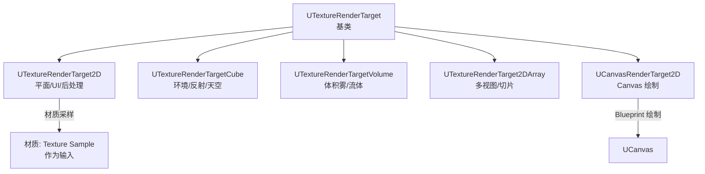
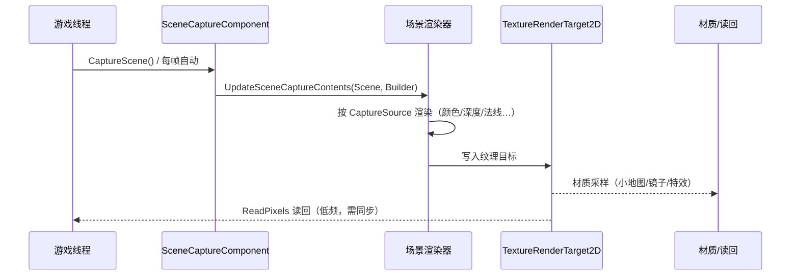

# 11 RenderTarget 与 SceneCapture 实战

> 版本基线：UE5.8.0 / CL55116800 / ++UE5+Release-5.8（本机 `C:\Program Files\Epic Games\UE_5.8\Engine`）。
> 适用范围：客户端渲染功能开发（小地图、镜子/监控屏、动态纹理、画面后处理、抓屏读回等）使用层实战。
> 事实边界：本文"本机核对"项来自只读检索本机 5.8 源码（`Source\Runtime\Engine\Classes\Engine\TextureRenderTarget*.h`、`CanvasRenderTarget2D.h`、`Classes\Components\SceneCaptureComponent*.h`、`Classes\Engine\SceneCapture2D.h`、`Classes\Kismet\KismetRenderingLibrary.h`、`Source\Runtime\RenderCore\Public\RenderCommandFence.h` 等）；无法在本机核对的版本敏感项一律写"待核对"，不虚构类名 / 函数名 / CVar。
> 官方参考：[Render Targets](https://dev.epicgames.com/documentation/en-us/unreal-engine/render-targets-in-unreal-engine)、[Scene Capture](https://dev.epicgames.com/documentation/en-us/unreal-engine/scene-capture-in-unreal-engine)、[Unreal Engine 文档首页](https://dev.epicgames.com/documentation/en-us/unreal-engine)。
> 最后更新：2026-08-07（初稿）。

## 概述

**RenderTarget（渲染目标）**是 UE 中"把渲染结果写到一张可复用的纹理"的核心设施，而 **SceneCapture（场景捕获）**则是"用一台虚拟相机把场景渲染进 RenderTarget"的标准通道。两者组合可以做出小地图、镜子、监控屏、冰冻/残影特效、动态贴图、传送门等大量玩法与表现功能。

本机 5.8 已核对的关键事实：

- 渲染目标类型族：`UTextureRenderTarget2D`（`TextureRenderTarget2D.h` L103）、`UTextureRenderTargetCube`（L21）、`UTextureRenderTargetVolume`（L21）、`UTextureRenderTarget2DArray`（L21），均继承 `UTextureRenderTarget`（L103 基类已核对）；统一提供 `InitAutoFormat` / `UpdateResourceImmediate` 等 API；
- 捕获组件：`USceneCaptureComponent2D`（`SceneCaptureComponent2D.h` L33，`TextureTarget` L80）、`USceneCaptureComponentCube`（`SceneCaptureComponentCube.h` L18）；对应 Actor `USceneCapture2D` / `USceneCaptureCube`（含 `CaptureComponent2D`/`CaptureComponentCube` 子对象，已核对）；
- 绘制通道：`UCanvasRenderTarget2D`（`CanvasRenderTarget2D.h` L27）与蓝图库 `UKismetRenderingLibrary`（`DrawMaterialToRenderTarget` L82、`BeginDrawCanvasToRenderTarget` L224、`EndDrawCanvasToRenderTarget` L230、`ClearRenderTarget2D` L42、`CreateRenderTarget2D` L48 等，全部已核对）。

一句话定位：**RenderTarget 解决"渲染到哪"，SceneCapture 解决"把什么场景渲染进去"，Canvas/材质解决"往里面画什么"**。

## 核心概念表

| 概念 | 英文 | 说明（本机 5.8 依据） | 关键点 |
| --- | --- | --- | --- |
| 渲染目标 2D | TextureRenderTarget2D | 最常用的二维渲染目标 | `UTextureRenderTarget2D`（L103，已核对） |
| 渲染目标立方体 | TextureRenderTargetCube | 六面环境捕获（反射/天空） | `UTextureRenderTargetCube`（L21，已核对） |
| 渲染目标体积 | TextureRenderTargetVolume | 3D 纹理目标（体积效果） | `UTextureRenderTargetVolume`（L21，已核对） |
| 渲染目标数组 | TextureRenderTarget2DArray | 二维纹理数组目标 | `UTextureRenderTarget2DArray`（L21，已核对） |
| Canvas 渲染目标 | CanvasRenderTarget2D | 可被 UCanvas 绘制的 2D 目标 | `UCanvasRenderTarget2D`（L27，已核对） |
| 场景捕获 2D | SceneCapture2D | 用一台相机捕获场景到 2D 目标 | `USceneCaptureComponent2D`（L33，已核对） |
| 场景捕获立方体 | SceneCaptureCube | 六面捕获到立方体目标 | `USceneCaptureComponentCube`（L18，已核对） |
| 捕获源 | CaptureSource | 决定捕获哪个 G-Buffer/颜色 | `ESceneCaptureSource`（使用处 L81/L301 已核对） |
| 纹理目标 | TextureTarget | 捕获结果写入的目标纹理 | `SceneCaptureComponent2D.h` L80（已核对） |
| 逐帧捕获 | Capture Every Frame | 每帧自动捕获开关 | 基类 `bCaptureEveryFrame`（L85，已核对） |
| 移动捕获 | Capture On Movement | 组件移动时才捕获 | 基类 `bCaptureOnMovement`（L89，已核对） |
| 渲染蓝图库 | KismetRenderingLibrary | 蓝图/ C++ 通用渲染工具 | `DrawMaterialToRenderTarget` 等（已核对） |
| 读回 | Readback | GPU 纹理拷回 CPU | `ReadPixels` 等（运行时 API **待核对**） |

## 原理详解

### 1.1 渲染目标类型体系

四类渲染目标统一继承 `UTextureRenderTarget`，核心 API（本机 5.8 已核对）：

| 类型 | 类（头文件行号） | 关键 API |
| --- | --- | --- |
| 2D | `UTextureRenderTarget2D`（L103） | `InitAutoFormat(W,H)`（L186）、`ResizeTarget(W,H)`（L189）、`UpdateResourceImmediate(bClear)`（L244）、`bAutoGenerateMips`（L157） |
| Cube | `UTextureRenderTargetCube`（L21） | `InitAutoFormat(Size)`（L69）、`UpdateResourceImmediate`（L71）、`bAutoGenerateMips`（L54） |
| Volume | `UTextureRenderTargetVolume`（L21） | `InitAutoFormat(X,Y,Z)`（L69）、`UpdateResourceImmediate`（L71） |
| 2DArray | `UTextureRenderTarget2DArray`（L21） | `InitAutoFormat(X,Y,Slices)`（L70）、`UpdateResourceImmediate`（L72） |



图释：四类渲染目标 + Canvas 绘制目标共同组成"可写入、可采样、可读回"的纹理族；材质侧用 Texture Sample（`Texture Object` 参数）消费，是接入现有渲染链路的通用方式。

### 1.2 SceneCapture 捕获链路

`USceneCaptureComponent2D` 挂载 `TextureTarget` 后，每次捕获都会把指定相机视野内的场景渲染进目标纹理：



图释：捕获本质是**一次额外的场景渲染**；`bCaptureEveryFrame`（基类 L85，已核对）控制自动频率，`CaptureScene()` 手动触发（官方注释：开启逐帧捕获时不要再手动调，否则重复渲染——`SceneCaptureComponent2D.h` L295 附近已核对）。`SetCameraView`（L272）/`GetCameraView`（L274，已核对）允许用任意 `FMinimalViewInfo` 驱动相机。

### 1.3 捕获源与裁剪设置

捕获内容由一组基类属性控制（`SceneCaptureComponent.h`，已核对）：

- `CaptureSource`：`TEnumAsByte<enum ESceneCaptureSource>`（L81）；使用处核对到的取值包括 `SCS_SceneColorHDR` / `SCS_SceneColorHDRNoAlpha` / `SCS_SceneColorSceneDepth` / `SCS_SceneDepth` / `SCS_DeviceDepth` / `SCS_Normal` / `SCS_BaseColor` 等（L301-302，已核对；枚举完整定义位置**待核对**）；
- `bCaptureEveryFrame`（L85）与 `bCaptureOnMovement`（L89）：频率控制，移动端/性能敏感场景优先 `bCaptureOnMovement` 或手动捕获；
- `HiddenActors`（L140）/ `HiddenComponents`（L136）：从捕获中排除对象（小地图隐藏玩家角色等）；
- `MaxViewDistanceOverride`（L156）：限制捕获距离，直接降低负载；
- `bUseRayTracingIfEnabled`（L164）：启用光追时是否对捕获使用光追；
- `ShowFlagSettings`：注意 5.5 起公共属性访问已标记弃用（L183，已核对），推荐用 `GetShowFlagSettings()` / `SetShowFlagSettings()`（L193 附近，已核对）——捕获前按需关闭植被/特效等 ShowFlag 可大幅省性能。

`USceneCaptureComponent2D` 特有：正交模式 `TileCount` 分块渲染（`SceneCaptureComponent2D.h` L113-114，已核对，仅正交 + 非 FinalColor 捕获源生效）、`bRenderInMainRenderer`（编辑条件中出现，已核对）等。

### 1.4 Canvas 绘制路径

`UCanvasRenderTarget2D`（`CanvasRenderTarget2D.h` L27，已核对）允许用 UCanvas 绘制 2D 内容：

- 创建：`CreateCanvasRenderTarget2D(WorldContext, Class, Width=1024, Height=1024)`（L57，已核对）；
- 绘制回调：`OnCanvasRenderTargetUpdate` 动态多播委托 `(UCanvas*, int32 Width, int32 Height)`（L15，已核对），在纹理更新时被调用；
- 触发更新：`UpdateResource()`（L44，已核对）/ `FastUpdateResource()`（L87，已核对）；官方注释建议"每帧重绘就每帧调用 UpdateResource"（L22 附近，已核对）；
- 尺寸查询：`GetSize(int32&, int32&)`（L76，已核对）。

蓝图侧的通用绘制入口是 `UKismetRenderingLibrary`（全部 BlueprintCallable，已核对）：

- `DrawMaterialToRenderTarget(World, RT, Material)`（L82）：把材质结果画进 RT；
- `BeginDrawCanvasToRenderTarget(World, RT, Canvas&, Size&, Context&)`（L224）+ `EndDrawCanvasToRenderTarget(World, Context)`（L230）：配对使用，绘制多个图元；
- `ClearRenderTarget2D(World, RT, ClearColor)`（L42）：清屏；
- `CreateRenderTarget2D(World, W, H, Format=RTF_RGBA16f, ...)`（L48）/ `CreateRenderTarget2DArray`（L54）/ `CreateRenderTargetVolume`（L60）：运行时创建 RT。

### 1.5 典型应用场景

| 场景 | 方案 | 要点 |
| --- | --- | --- |
| 小地图 | SceneCapture2D 俯视正交相机 → 低分辨率 RT → 材质采样到 UMG | 分辨率 256-512；关闭 `bCaptureEveryFrame`，按频率手动捕获；`HiddenActors` 隐藏玩家 |
| 镜子 / 监控屏 | 平面反射或 SceneCapture2D 捕获 → 材质作为屏幕 | 注意递归（镜子见镜子）与分辨率预算；静态场景可低频捕获 |
| 后处理 / 特效输入 | SceneCapture 捕获 `SCS_SceneColorHDR` 或深度 → 材质二次处理 | 冰冻/残影：把历史帧留在 RT 中与当前帧混合 |
| 动态纹理（血条贴图/刮痕） | CanvasRenderTarget2D 每帧绘制 | `UpdateResource` 频率控制，避免无意义重绘 |
| 环境反射 | SceneCaptureCube → `UTextureRenderTargetCube` → 反射捕获资产 | 六面渲染成本高，注意更新频率；移动端优先静态烘焙 |
| 深度/法线捕获 | CaptureSource 切换（深度/法线/BaseColor） | 用于描边、传送门、遮挡探测等 G-Buffer 消费 |

### 1.6 性能与分辨率预算

- **一次捕获 = 一次额外场景渲染**：多个 SceneCapture 的成本近似叠加；优先减少捕获数量、降低分辨率、延长更新间隔；
- 分辨率：小地图/监控屏 256-512 起步；全屏后处理类效果用 1/2 或 1/4 分辨率；2 的幂尺寸与 mip 生成（`bAutoGenerateMips`，已核对）对纹理采样更友好；
- 格式：`RTF_RGBA16f`（半浮点，HDR 信息足）vs `RTF_R8G8B8A8`（带宽省一半以上）；仅当需要 HDR/深度时才用高精度格式（`CreateRenderTarget2D` 默认 `RTF_RGBA16f`，已核对）；
- 裁剪：`MaxViewDistanceOverride`、ShowFlags、`HiddenActors` 三件套优先用上；
- 立方体捕获六面代价高，尽量低频或静态；
- 移动端：Tile GPU 上读写 RT 有带宽与内存代价；建议分辨率保守、避免每帧捕获、避免大尺寸浮点 RT；具体平台限制与最佳尺寸以官方文档为准（**待核对**）。

### 1.7 读回与导出

- 运行时读回：`UTextureRenderTarget2D::ReadPixels` 等 API 会把 GPU 纹理拷回 CPU（运行时 API 精确签名**待核对**）；该操作同步阻塞，只能在低频路径（截图、AI 感知、存档预览）使用，并用 `FRenderCommandFence`（`RenderCore\Public\RenderCommandFence.h`，已核对）确保渲染命令完成；
- 编辑器导出：`UKismetRenderingLibrary::ConvertRenderTargetToTexture2DEditorOnly`（L117）/ 2DArray（L124）/ Cube（L131）/ Volume（L138）——EditorOnly 系列（已核对）；`ExportRenderTarget`（L143 附近，HDR/PNG 落盘，已核对）用于导出图片。

### 1.8 编辑器与运行时工作流

- **编辑器资产路径**：内容浏览器 → 右键 → 材质与纹理（Material & Textures）→ Render Target，可创建 2D / Cube / Volume / 2DArray 资产；把 `SceneCapture2D` Actor 拖入场景，自动带 `CaptureComponent2D` 子对象（`SceneCapture2D.h` L23，已核对）与 `TextureTarget` 槽位，直接指定资产即可工作；
- **资产型 vs 运行时创建**：编辑器资产适合固定用途（监控屏、小地图背景、反射捕获），方便美术在内容浏览器预览（双击 RT 预览内容，编辑器 UI 细节**待核对**）；运行时 `CreateRenderTarget2D` 适合动态尺寸、动态实例数量、程序化生成；
- **调试**：把 RT 用材质 `Texture Sample` 输出到调试 UI（或 SceneCapture 的 `TextureTarget` 临时指向调试资产），实时查看捕获结果；检查 `bCaptureEveryFrame` 是否意外开启导致重复渲染；
- **版本注意**：`ConvertRenderTargetToTexture2DEditorOnly` 等转换 API 是 EditorOnly（L117 等，已核对），**不能**在 Shipping 构建调用；运行时导出图片用 `ExportRenderTarget`（L143 附近，已核对，HDR/PNG 视格式而定）；
- **蓝图 vs C++**：`UKismetRenderingLibrary` 全部 BlueprintCallable（已核对），纯蓝图项目可直接使用；C++ 项目建议封装"创建 → 配置 → 更新频率"为一个管理组件，避免节点图散落。

### 1.9 常见错误模式与排查

1. **忘记绑定 TextureTarget**：SceneCapture 没有目标纹理时捕获结果无处可去（表现为黑屏/无更新）；先确认组件 `TextureTarget` 已赋值（`SceneCaptureComponent2D.h` L80，已核对）。
2. **bCaptureEveryFrame 与手动 CaptureScene 混用**：同一帧重复渲染，性能翻倍且结果不确定；官方注释明确二选一（L295 附近，已核对）。
3. **Canvas 绘制不配对**：`BeginDrawCanvasToRenderTarget` 后忘记 `EndDrawCanvasToRenderTarget`，绘制不生效或上下文损坏。
4. **分辨率/格式无节制**：全屏 4K 浮点 RT 每帧捕获是移动端噩梦；先按"用途决定分辨率"定预算。
5. **读回阻塞主线程**：`ReadPixels` 在游戏线程同步等待 GPU；高频调用会掉帧，务必低频化或异步读回（异步 readback 方案**待核对**）。
6. **捕获内容不可控**：没有裁剪 ShowFlags / 距离 / 对象，捕获了场景里所有东西；用 `MaxViewDistanceOverride`（L156，已核对）、`HiddenActors`（L140，已核对）、ShowFlags 三件套。
7. **排查顺序**：先看 RT 是否在更新（调试 UI 采样）→ 再查捕获频率与内容裁剪 → 最后查分辨率/格式/平台差异。

## 代码/示例

> 以下代码为**节选/示意**，演示 API 形态；完整工程请结合官方示例与项目规范。

### 2.1 C++：创建 RT 并配置 SceneCapture（节选）

```cpp
// 创建 2D 渲染目标（示意）
UTextureRenderTarget2D* RT = UKismetRenderingLibrary::CreateRenderTarget2D(
    this, 512, 512, RTF_RGBA16f, FLinearColor::Black, /*bAutoGenerateMipMaps=*/true);

// 配置场景捕获（示意）
USceneCaptureComponent2D* Capture = NewObject<USceneCaptureComponent2D>(Actor);
Capture->TextureTarget = RT;                 // 捕获目标（SceneCaptureComponent2D.h L80，已核对）
Capture->CaptureSource = SCS_SceneColorHDR;  // 捕获源（枚举使用处已核对）
Capture->bCaptureEveryFrame = true;          // 基类属性（L85，已核对）
Capture->HiddenActors.Add(PlayerActor);      // 排除玩家（基类 L140，已核对）
Capture->SetCameraView(MinimalViewInfo);     // 指定相机（L272，已核对）
Actor->AddInstanceComponent(Capture);
```

### 2.2 C++：CanvasRenderTarget2D 绘制（节选）

```cpp
UCanvasRenderTarget2D* CanvasRT = UCanvasRenderTarget2D::CreateCanvasRenderTarget2D(
    this, UCanvasRenderTarget2D::StaticClass(), 512, 512);
CanvasRT->OnCanvasRenderTargetUpdate.AddDynamic(this, &AMyActor::DrawOnCanvas); // L15 委托（已核对）
CanvasRT->UpdateResource();  // 触发重绘（L44，已核对）

void AMyActor::DrawOnCanvas(UCanvas* Canvas, int32 W, int32 H)
{
    // 用 Canvas 绘制图标/文字（示意，节选）
    Canvas->K2_DrawLine(FVector2D(0, 0), FVector2D(W, H), 2.f, FLinearColor::Red);
}
```

### 2.3 蓝图侧：材质后处理到 RT（示意）

1. `Create Render Target 2D`（512×512）→ 保存引用；
2. `Draw Material to Render Target`（RT，材质"RT_Effect"）；
3. 任意材质用 `Texture Sample` 采样该 RT，输出到 UI 或场景材质。

（节点名来自 `UKismetRenderingLibrary` BlueprintCallable 函数，已核对；连线细节按项目需求。）

### 2.4 读回示意（节选，低频路径）

```cpp
// 捕获完成后读回（示意；ReadPixels 精确签名待核对）
TArray<FColor> Pixels;
RT->ReadPixels(Pixels);   // 同步、阻塞，仅截图/存档等低频使用
```

### 2.5 蓝图：小地图组合（示意）

1. 创建 `SceneCapture2D` Actor，勾选正交投影（`bUseOrthographic`），俯视朝向地面；
2. `TextureTarget` 指向 512×512 的 `Render Target 2D` 资产；
3. 关闭 `Capture Every Frame`（`bCaptureEveryFrame=false`，基类 L85 已核对），改为"每 N 帧 / 玩家移动时"手动 `Capture Scene`；
4. `Hidden Actors` 数组加入玩家角色与无关大物件（L140，已核对）；
5. UMG 中 `Image` → 材质（含 `Texture Sample` 采样该 RT）→ 显示小地图。

（节点名来自已核对的组件属性与蓝图库函数；连线细节按项目需求。）

### 2.6 SceneCaptureCube 环境捕获（示意）

```cpp
// 创建立方体渲染目标（示意；API 已核对 L69）
UTextureRenderTargetCube* CubeRT = NewObject<UTextureRenderTargetCube>(this);
CubeRT->InitAutoFormat(256);
CubeRT->UpdateResourceImmediate(true);

// 配置六面捕获组件（类 L18 / TextureTarget L24，已核对）
USceneCaptureComponentCube* CubeCapture = NewObject<USceneCaptureComponentCube>(Actor);
CubeCapture->TextureTarget = CubeRT;
CubeCapture->bCaptureEveryFrame = false;  // 环境捕获低频化
Actor->AddInstanceComponent(CubeCapture);
```

> 提示：六面捕获成本约为六次平面捕获；仅用于环境/反射等低频需求，移动端优先静态烘焙反射。

### 2.7 监控屏 / 镜子低频捕获（示意）

1. 放置 `SceneCapture2D` 于监控摄像头位置，`TextureTarget` 指向 256×256 RT；
2. `Capture Every Frame` 关闭，用定时器 / 事件每 0.1~0.5 秒 `Capture Scene` 一次（场景静止时甚至只捕获一次）；
3. 屏幕材质用 `Texture Sample` 采样该 RT，叠加 UI 边框即可；
4. 镜子场景注意把镜子自身加入 `HiddenActors`（基类 L140，已核对）防止递归，必要时限制 `MaxViewDistanceOverride`（L156，已核对）。

> 要点：低频捕获让监控屏/镜子的成本接近"一次贴图采样"，是性能与效果的最佳平衡点。

## 最佳实践

1. **先定频率再定分辨率**：能 1 帧捕获一次就不要每帧；能 256 就不要 512；两者对性能影响最直接。
2. **捕获前先裁剪**：`MaxViewDistanceOverride` + ShowFlags + `HiddenActors`，把"不需要渲染进 RT 的东西"挡在门外。
3. **区分自动与手动捕获**：`bCaptureEveryFrame` 开启时不要再手动 `CaptureScene()`（官方注释明确会重复渲染，`SceneCaptureComponent2D.h` L295 附近已核对）。
4. **Canvas 绘制要配对**：`BeginDrawCanvasToRenderTarget` 必须配 `EndDrawCanvasToRenderTarget`，否则渲染上下文不完整。
5. **读回低频化**：`ReadPixels` 阻塞主线程，只用于截图/存档/调试；编辑器导出用 EditorOnly 转换 API。
6. **格式按需**：不需要 HDR 就不要用 `RGBA16f`；移动端尤其注意带宽。
7. **镜子/递归场景设上限**：避免"镜子见镜子"无限递归，用渲染深度或距离限制。
8. **移动端验证**：真机确认 RT 尺寸/格式/捕获频率在目标 GPU 上可接受（关联 [10-移动端渲染专项.md](10-移动端渲染专项.md)）。
9. **资源生命周期**：运行时创建的 RT 要妥善持有（UPROPERTY），避免被 GC；编辑器资产型 RT 用引用资产。
10. **用 Profiling 观测**：结合 [../07-UI与性能优化/03-性能分析工具与Profiling.md](../07-UI与性能优化/03-性能分析工具与Profiling.md) 查看捕获 Pass 的开销（GPU 时间线）。

## FAQ

**Q1：SceneCapture 为什么这么贵？**
每次捕获都是一次完整的场景渲染（相当于多渲染一帧的一部分）。成本与分辨率、捕获内容（ShowFlags/距离/对象数）成正比；降本三板斧：降分辨率、降频率、裁剪内容。

**Q2：小地图用正交还是透视相机？**
俯视小地图用正交（`bUseOrthographic`）避免透视畸变；带高度/角度的战术地图可改用透视。分辨率 256-512、关闭逐帧捕获按需手动触发即可。

**Q3：RT 尺寸为什么要 2 的幂？**
非 2 的幂尺寸在部分平台/后端有额外处理与性能损失（mip 生成、纹理采样、平台限制）；惯例用 2 的幂，如 256/512/1024。

**Q4：捕获能看到自己（递归）吗？镜子怎么避免？**
能。镜子捕捉镜子会递归渲染；通过隐藏镜子对象本身（`HiddenActors` 或 ShowFlags）、限制捕获深度/距离、或低频捕获来避免。

**Q5：CanvasRenderTarget2D 怎么每帧重绘？**
绑定 `OnCanvasRenderTargetUpdate` 委托，每帧调用 `UpdateResource()`（`CanvasRenderTarget2D.h` L44，已核对）；官方注释亦推荐此模式（L22 附近，已核对）。不变化时不要每帧重绘。

**Q6：RT 怎么读回 CPU？**
运行时用 `ReadPixels` 类 API（阻塞，低频）；编辑器用 `ConvertRenderTargetToTexture2DEditorOnly` 系列（已核对）或 `ExportRenderTarget`（L143 附近，已核对）导出图片。

**Q7：bCaptureEveryFrame 和手动 CaptureScene 区别？**
前者每帧自动捕获；后者按需手动触发。开启自动后不要再手动调用，否则同一帧重复渲染（官方注释已核对）。

**Q8：Cube 捕获什么时候用？**
需要六面环境信息时（环境反射、天空盒生成、光照探针预览）。代价约为六次平面捕获，务必低频或静态。

**Q9：移动端 RT 要注意什么？**
带宽与内存敏感：小尺寸、低精度格式（R8G8B8A8 优先）、避免每帧捕获与大尺寸浮点 RT；具体平台限制以官方移动端文档为准（**待核对**）。

**Q10：怎么裁剪捕获内容？**
`HiddenActors`/`HiddenComponents`（L136/L140，已核对）、`MaxViewDistanceOverride`（L156，已核对）、ShowFlags（5.5+ 用 `SetShowFlagSettings`，L183-193 已核对）三件套组合使用。

## 关联阅读

- [01-渲染管线概览.md](01-渲染管线概览.md)：渲染管线与线程模型（捕获 Pass 的定位）
- [02-材质系统详解.md](02-材质系统详解.md)：材质采样 RT 的输入方式（Texture Sample / Texture Object）
- [05-后处理与画面特效.md](05-后处理与画面特效.md)：后处理链与 SceneColor 消费（与捕获输入互补）
- [10-移动端渲染专项.md](10-移动端渲染专项.md)：移动端带宽/分辨率预算约束
- [../03-游戏玩法编程/07-相机系统与视口.md](../03-游戏玩法编程/07-相机系统与视口.md)：`FMinimalViewInfo` 与相机视图（`SetCameraView` 的输入来源）
- [../01-引擎基础/11-多线程与任务系统.md](../01-引擎基础/11-多线程与任务系统.md)：读回/等待渲染线程时的多线程注意点

## 更新日志

- 2026-08-07：初稿（按章节完善方案 P1-02 章新增，全部版本敏感事实经本机 UE5.8 只读核对）。
