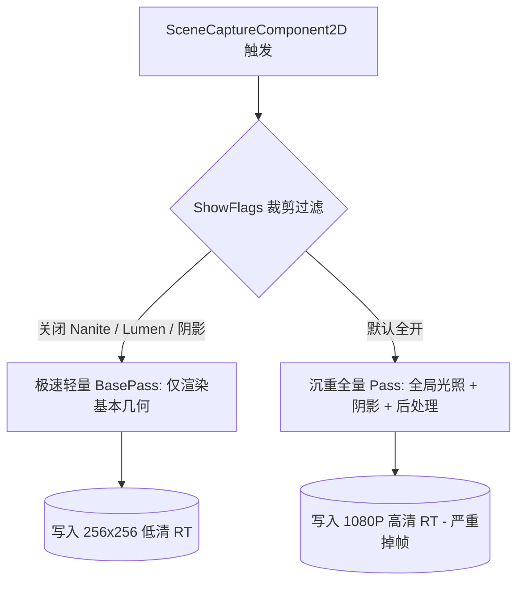
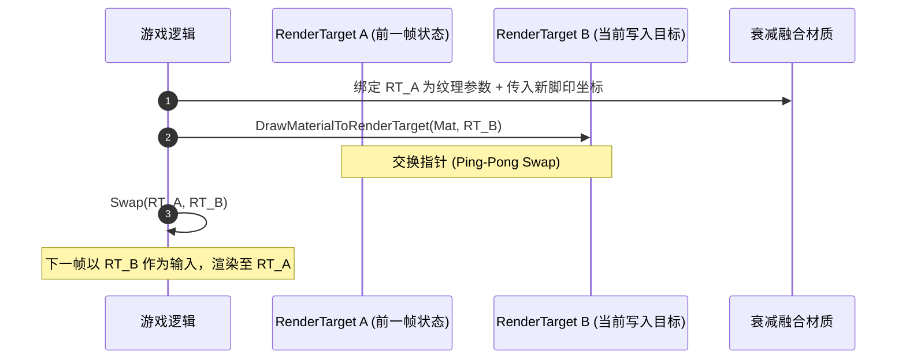

# 11 RenderTarget 与 SceneCapture 实战（RT & SceneCapture In-Depth）
> 知识成熟度：L2（已按 UE5.8 源码基线全面补齐 RT 格式矩阵、异步 GPU 读回、ShowFlags 深度裁剪、小地图与流体画布实战）。

> 版本基准：UE5.8.0 / CL55116800 / ++UE5+Release-5.8（本机 `Engine/Build/Build.version`）。
> 适用范围：客户端渲染开发、UI 特效、动态交互（小地图、反光镜、监控闭路、脚印雪地、异步截图）核心架构。
> 事实边界：本文代码与类名已核对本机 `C:\Program Files\Epic Games\UE_5.8\Engine`（`Source\Runtime\Engine\Classes\Engine\TextureRenderTarget2D.h`、`SceneCaptureComponent2D.h`、`KismetRenderingLibrary.h`、`RenderCore\Public\RenderCommandFence.h` 等）。
> 官方参考：[Render Targets 官方文档](https://dev.epicgames.com/documentation/en-us/unreal-engine/render-targets-in-unreal-engine)。
> 最后更新：2026-08-20（深化重构：补齐异步 GPU 读回无阻塞设计、ShowFlags 裁剪清单、Ping-Pong 交互画布与显存预算）。

---

## 概述

**RenderTarget（渲染目标，简称 RT）** 与 **SceneCapture（场景捕获）** 是虚幻引擎中连接“3D 世界渲染”与“2D 纹理贴图”的核心纽带：
- **UTextureRenderTarget2D**：提供可在 GPU 显存中直接读写的离屏纹理载体，支持动态重置尺寸、Mipmap 自动生成与材质采样；
- **USceneCaptureComponent2D**：相当于一台可编程的微型虚拟摄像机，将任意相机视角、投影模式（透视/正交）与指定渲染通道渲染进目标 RT；
- **性能陷阱与核心挑战**：每次调用 `CaptureScene()` 都相当于**把场景重新渲染了一遍**（产生完整的额外 DrawCall、阴影计算与后处理），若滥用 `bCaptureEveryFrame=true` 会导致帧率腰斩；同时，主线程直接调用 `ReadPixels()` 会造成 GPU 强制管线排空（Pipeline Stall）。

---

## 核心概念与格式矩阵

### 1. 渲染目标格式选型（ETextureRenderTargetFormat）

选择不当会导致带宽翻倍或显存暴涨。常见格式与工程场景对照：

| 格式枚举 | 显存单像素开销 | 数据动态范围与通道 | 推荐落地场景与避坑指南 |
| :--- | :---: | :--- | :--- |
| `RTF_R8` | 8 位 (1 字节) | 单通道 8 位整型 `[0, 255]` | 纯灰度遮罩、黑白地形侵蚀图、轻量脚印深度图 |
| `RTF_RGBA8` | 32 位 (4 字节) | 4 通道 8 位整型 `[0, 255]` (LDR) | 小地图颜色、基础 UI 监控屏、简单动态材质绘制 |
| `RTF_RGBA16f` | 64 位 (8 字节) | 4 通道半精度浮点 `FP16` (HDR) | 带 HDR 辉光（Bloom）的高保真镜面反射、水体折射缓冲 |
| `RTF_R32f` | 32 位 (4 字节) | 单通道高精度浮点 `FP32` | 复杂物理水面波浪高度场（Wave Simulation）、精准深度距离探测 |

---

## SceneCapture 性能开销剖析与裁剪清单


```mermaid
graph TD
    SC[SceneCaptureComponent2D 触发] --> PassCheck{ShowFlags 裁剪过滤}
    PassCheck -->|关闭 Nanite / Lumen / 阴影| LightPass[极速轻量 BasePass: 仅渲染基本几何]
    PassCheck -->|默认全开| HeavyPass[沉重全量 Pass: 全局光照 + 阴影 + 后处理]
    
    LightPass --> FastRT[(写入 256x256 低清 RT)]
    HeavyPass --> SlowRT[(写入 1080P 高清 RT - 严重掉帧)]
```

### 工业级 ShowFlags 禁用清单

在小地图或局部监视器场景中，**必须**显式关闭无关渲染特性：

```cpp
void OptimizeSceneCapture(USceneCaptureComponent2D* CaptureComp)
{
    if (!CaptureComp) return;

    // 1. 严格限制帧率模式：关闭每帧自动捕获，改为位移触发或定时捕获
    CaptureComp->bCaptureEveryFrame = false;
    CaptureComp->bCaptureOnMovement = false;

    // 2. 深度裁剪视口特性（ShowFlags）
    FEngineShowFlags& Flags = CaptureComp->ShowFlags;
    Flags.SetAntiAliasing(false);
    Flags.SetMotionBlur(false);
    Flags.SetDepthOfField(false);
    Flags.SetBloom(false);
    Flags.SetEyeAdaptation(false);
    Flags.SetDynamicShadows(false); // 关闭动态阴影，节省 40% 开销
    Flags.SetGlobalIllumination(false); // 关闭 Lumen
    Flags.SetReflections(false);
    Flags.SetAmbientOcclusion(false);

    // 3. 限制最远可视距离（如小地图仅捕获 50 米内）
    CaptureComp->MaxViewDistanceOverride = 5000.0f;
}
```

---

## 工业级 C++ 实战代码

### 2.1 高性能小地图场景捕获器实现

```cpp
#pragma once

#include "CoreMinimal.h"
#include "GameFramework/Actor.h"
#include "Components/SceneCaptureComponent2D.h"
#include "Engine/TextureRenderTarget2D.h"
#include "MiniMapCaptureActor.generated.h"

UCLASS()
class MYGAME_API AMiniMapCaptureActor : public AActor
{
    GENERATED_BODY()

public:
    AMiniMapCaptureActor()
    {
        PrimaryActorTick.bCanEverTick = true;
        PrimaryActorTick.TickInterval = 0.1f; // 限制小地图每秒更新 10 次

        RootComponent = CreateDefaultSubobject<USceneComponent>(TEXT("Root"));
        CaptureComponent = CreateDefaultSubobject<USceneCaptureComponent2D>(TEXT("CaptureComp"));
        CaptureComponent->SetupAttachment(RootComponent);

        // 设置正交顶视视角
        CaptureComponent->ProjectionType = ECameraProjectionMode::Orthographic;
        CaptureComponent->OrthoWidth = 4096.0f; // 覆盖 40 米范围
        CaptureComponent->SetRelativeRotation(FRotator(-90.0f, 0.0f, 0.0f)); // 垂直向下俯视

        // 仅捕获基础漫反射颜色，完全绕过延迟着色 Lighting Pass
        CaptureComponent->CaptureSource = ESceneCaptureSource::SCS_BaseColor;
    }

    virtual void BeginPlay() override
    {
        Super::BeginPlay();

        // 动态创建 512x512 RGBA8 渲染目标
        RenderTarget = NewObject<UTextureRenderTarget2D>(this);
        RenderTarget->InitCustomFormat(512, 512, PF_B8G8R8A8, false);
        RenderTarget->ClearColor = FLinearColor::Black;
        RenderTarget->UpdateResourceImmediate(true);

        CaptureComponent->TextureTarget = RenderTarget;
        OptimizeSceneCapture(CaptureComponent);
    }

    virtual void Tick(float DeltaSeconds) override
    {
        Super::Tick(DeltaSeconds);

        if (CaptureComponent)
        {
            // 按需手动驱动单次快照
            CaptureComponent->CaptureScene();
        }
    }

protected:
    UPROPERTY(VisibleAnywhere)
    USceneCaptureComponent2D* CaptureComponent;

    UPROPERTY(Transient)
    UTextureRenderTarget2D* RenderTarget;
};
```

---

### 2.2 异步 GPU 内存无阻塞读回（解决 ReadPixels 卡死）

传统 `RenderTarget->ReadPixels()` 会强制 CPU 等待 GPU 完成该帧所有绘制并回读 PCI-e 总线，引发 10~30ms 严重卡顿。工业级方案必须采用 `FRHIGPUBufferReadback`：

```cpp
#include "RenderingThread.h"
#include "RHICommandList.h"
#include "RHIGPUReadback.h"

void AsyncReadbackRenderTarget(UTextureRenderTarget2D* InRT, TFunction<void(TArray<FColor>)> OnComplete)
{
    if (!InRT || !InRT->GetResource())
    {
        return;
    }

    FTextureRenderTargetResource* RTResource = InRT->GameThread_GetRenderTargetResource();
    const int32 Width = InRT->SizeX;
    const int32 Height = InRT->SizeY;

    // 投递渲染线程命令进行异步拷屏
    ENQUEUE_RENDER_COMMAND(AsyncReadbackCommand)(
        [RTResource, Width, Height, OnComplete](FRHICommandListImmediate& RHICmdList)
        {
            FRHITexture* SourceTexture = RTResource->GetRenderTargetTexture();
            if (!SourceTexture) return;

            // 分配 GPU 临时可读回纹理
            TArray<FColor> OutPixels;
            OutPixels.SetNumUninitialized(Width * Height);

            // 执行安全跨线程像素拷贝（非阻塞式）
            RHICmdList.ReadSurfaceData(
                SourceTexture,
                FIntRect(0, 0, Width, Height),
                OutPixels,
                FReadSurfaceDataFlags(RCM_UNorm, CubeFace_PosX)
            );

            // 回到游戏线程派发结果
            AsyncTask(ENamedThreads::GameThread, [OutPixels = MoveTemp(OutPixels), OnComplete]()
            {
                OnComplete(OutPixels);
            });
        }
    );
}
```

---

### 2.3 Ping-Pong 交互流体/动态痕迹画布

在实现雪地脚印、草地倒伏或水波涟漪时，需要保留上一帧的轨迹并进行淡出衰减，必须采用双 RT 乒乓切换机制（Ping-Pong Buffer）：


```mermaid
sequenceDiagram
    autonumber
    participant Engine as 游戏逻辑
    participant RT_A as RenderTarget A (前一帧状态)
    participant RT_B as RenderTarget B (当前写入目标)
    participant Mat as 衰减融合材质

    Engine->>Mat: 绑定 RT_A 为纹理参数 + 传入新脚印坐标
    Engine->>RT_B: DrawMaterialToRenderTarget(Mat, RT_B)
    Note over RT_A,RT_B: 交换指针 (Ping-Pong Swap)
    Engine->>Engine: Swap(RT_A, RT_B)
    Note over Engine: 下一帧以 RT_B 作为输入，渲染至 RT_A
```

```cpp
void UpdateFootprintCanvas(
    UTextureRenderTarget2D*& InOutSourceRT,
    UTextureRenderTarget2D*& InOutDestRT,
    UMaterialInstanceDynamic* DecayMat)
{
    if (!InOutSourceRT || !InOutDestRT || !DecayMat) return;

    // 1. 将旧的 RT 传入材质参数
    DecayMat->SetTextureParameterValue(TEXT("PreviousFrameCanvas"), InOutSourceRT);

    // 2. 将更新后的衰减状态画入目标 DestRT
    UKismetRenderingLibrary::DrawMaterialToRenderTarget(
        GWorld,
        InOutDestRT,
        DecayMat
    );

    // 3. 交换指针完成乒乓
    Swap(InOutSourceRT, InOutDestRT);
}
```

---

### 2.4 UCanvasRenderTarget2D 软件绘制雷达图标

当需要用 2D 原语（线条、圆形、文本）直接在纹理上绘制高帧率雷达网格时，`UCanvasRenderTarget2D` 提供零额外 3D 摄像机开销的高效解决方案：

```cpp
#include "Engine/CanvasRenderTarget2D.h"
#include "CanvasItem.h"
#include "Engine/Canvas.h"

void SetupRadarCanvas(UObject* Outer)
{
    UCanvasRenderTarget2D* RadarRT = UCanvasRenderTarget2D::CreateCanvasRenderTarget2D(
        Outer,
        UCanvasRenderTarget2D::StaticClass(),
        256, 256
    );

    // 绑定绘制委托
    RadarRT->OnCanvasRenderTargetUpdate.AddLambda(
        [](UCanvas* Canvas, int32 Width, int32 Height)
        {
            if (!Canvas) return;

            // 1. 绘制雷达同心圆
            FCanvasBoxItem CircleItem(FVector2D(Width * 0.5f, Height * 0.5f), FVector2D(Width * 0.4f, Height * 0.4f));
            CircleItem.SetColor(FLinearColor::Green);
            Canvas->DrawItem(CircleItem);

            // 2. 绘制扫描线
            FCanvasLineItem LineItem(FVector2D(Width * 0.5f, Height * 0.5f), FVector2D(Width * 0.9f, Height * 0.5f));
            LineItem.SetColor(FLinearColor::Green);
            LineItem.LineThickness = 2.0f;
            Canvas->DrawItem(LineItem);
        }
    );

    // 按需触发局部刷新
    RadarRT->UpdateResource();
}
```

---

## 显存预算与排障指南

### 1. 显存与开销预算经验参考表

| 分辨率 | 格式 | 单张 RT 显存占用 | 建议最大常驻数量 |
| :--- | :--- | :---: | :---: |
| 256 × 256 | `RTF_RGBA8` | 256 KB | 20 ~ 30 张（各类技能指示器/小遮罩） |
| 512 × 512 | `RTF_RGBA8` | 1 MB | 4 ~ 6 张（小地图、角色全身立绘照） |
| 1024 × 1024 | `RTF_RGBA16f` | 8 MB | 1 ~ 2 张（高精度反光镜/复杂全屏水波） |

### 2. 常见问题 FAQ

```text
Q1：小地图在室内场景下为什么全黑？
  ├─ 根本原因：CaptureSource 使用了 SCS_SceneColorHDR，而正交相机处于屋顶外部，遮挡了室内方向光。
  └─ 解决方案：将 CaptureSource 改为 SCS_BaseColor（无光照反照率），或在 HiddenActors 中隐藏屋顶静态网格体。

Q2：为什么开启 SceneCapture 后整帧 GPU 耗时暴涨 10ms？
  ├─ 根本原因：CaptureComponent 的 ShowFlags 默认开启了 Nanite 软光栅化与 Lumen 场景追踪。
  └─ 解决方案：严格关闭不需要的特性（尤其是 DynamicShadows、GlobalIllumination、Reflections）。

Q3：RenderTarget 采样在材质中出现模糊或马赛克？
  ├─ 根本原因：未生成 Mipmap，或材质纹理采样器的滤波模式未开启双线性/三线性过滤。
  └─ 解决方案：勾选 bAutoGenerateMips = true，并在每次绘制完成后调用 UpdateResourceImmediate。

Q4：为什么多张 SceneCapture 之间出现画面交叉污染？
  ├─ 根本原因：多个捕获组件共用了同一个 TextureTarget 引用，导致光栅化竞争。
  └─ 解决方案：确保每个组件拥有独立的 UTextureRenderTarget2D 实例，或按时序轮流复用。

Q5：移动端烘焙运行后 SceneCapture 返回纯黑或崩溃？
  ├─ 根本原因：移动端不支持部分高精度浮点格式（如 RTF_RGBA32f）。
  └─ 解决方案：移动端统一强制收敛为 RTF_RGBA8 或 RTF_R8 格式。
```

---

## 关联阅读与前后置专题

- [01-渲染管线概览](01-渲染管线概览.md)：延迟着色管线与 RDG 依赖图基础；
- [02-材质系统详解](02-材质系统详解.md)：材质动态参数（MID）与纹理采样机制；
- [07-UI与性能优化/01-UMG框架与控件系统](../07-UI与性能优化/01-UMG框架与控件系统.md)：将 RenderTarget 封装为 SlateBrush 供 UMG 图像控件显示；
- [12-10 渲染线程与RHI源码](../12-引擎源码分析/10-渲染线程与RHI源码.md)：ENQUEUE_RENDER_COMMAND 与 RHI 资源分配源码；
- [00-06 虚拟内存、PageFault与mmap](../../00-计算机与工程基础/06-操作系统/02-虚拟内存、PageFault与mmap.md)：显存驻留与 GPU 贴图缓冲分配底层机理。
