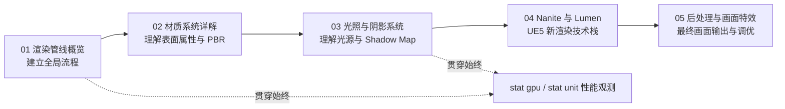
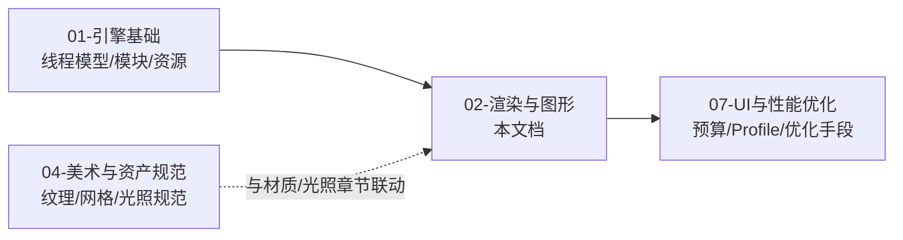

# 02 渲染与图形 — 知识库导航

## 分类简介

本分类收录 **Unreal Engine 5（UE5）渲染与图形**相关的核心知识，面向 UE 客户端（引擎/渲染）方向的开发同学，帮助建立从"画面是怎么画出来的"到"怎么调优画面性能"的完整认知。

渲染与图形是 UE 客户端知识体系中体量最大、术语最多的模块之一。UE5 相比 UE4 引入了大量颠覆性的新技术（Nanite 虚拟化几何体、Lumen 全局光照、Virtual Shadow Map 虚拟阴影贴图等），本分类以 **UE5 默认技术栈**为主线，同时保留经典的延迟着色、材质 PBR、Shadow Map/CSM 等基础原理，做到"新旧贯通、原理与命令并重"。

每篇文章均按统一结构组织：

1. **概述** — 这篇文章讲什么、解决什么问题
2. **核心概念** — 关键术语与对比表格，快速建立概念地图
3. **原理详解** — 深入讲解工作机制，含 Mermaid 流程图
4. **代码 / 蓝图示例** — 材质节点连线思路、控制台命令、ini 配置示例
5. **最佳实践** — 项目落地建议与性能预算
6. **常见问题 FAQ** — 高频踩坑与排查思路
7. **关联阅读** — 本分类内与分类外的延伸阅读

## 文件列表

| 文件 | 主题 | 一句话简介 |
| --- | --- | --- |
| [01-渲染管线概览.md](./01-渲染管线概览.md) | 渲染管线总览 | 从 Game Thread 到 GPU 的完整渲染流程：延迟着色 / 前向着色、G-Buffer、渲染线程架构与性能分析工具 |
| [02-材质系统详解.md](./02-材质系统详解.md) | 材质系统 | 材质编辑器、PBR 原理、材质域与着色模型、Mobile 材质限制与材质性能优化 |
| [03-光照与阴影系统.md](./03-光照与阴影系统.md) | 光照与阴影 | 四种光源、Shadow Map 原理、CSM 级联阴影、距离场阴影、虚拟阴影贴图 VSM 与间接光照 |
| [04-Nanite与Lumen.md](./04-Nanite与Lumen.md) | Nanite 与 Lumen | UE5 两大杀手锏：Nanite 虚拟化几何体（集群 LOD / 软件光栅化）与 Lumen 动态全局光照 / 反射 |
| [05-后处理与画面特效.md](./05-后处理与画面特效.md) | 后处理 | Post Process Volume、Bloom、Tonemapping、自动曝光、DOF、运动模糊、TAA/TSR 与后期材质 |
| [06-Groom毛发系统.md](./06-Groom毛发系统.md) | Groom 毛发 | Strands/Cards/Meshes 三种表示、GroomAsset/Binding、发丝渲染管线与物理模拟 |
| [07-虚拟纹理与材质混合.md](./07-虚拟纹理与材质混合.md) | 虚拟纹理 | RVT Page/Feedback 机制、材质混合工作流、Adaptive Virtual Texture 与虚拟化家族 |
| [08-体积渲染与云.md](./08-体积渲染与云.md) | 体积渲染 | Volumetric Fog（Froxel）、Volumetric Cloud 体积云、Local Fog Volume 与性能预算 |
| [09-光线追踪与路径追踪.md](./09-光线追踪与路径追踪.md) | 光线追踪 | 硬件光追（RT 反射/阴影/AO）、Path Tracer、r.RayTracing.* 命令与 Lumen 选型 |
| [10-移动端渲染专项.md](./10-移动端渲染专项.md) | 移动端渲染 | 移动渲染器/Forward 与移动端 Deferred、光照阴影限制、材质精度、Vulkan/Metal/GLES、ASTC/ETC2、带宽/Overdraw 与设备分级 |
| [11-RenderTarget与SceneCapture实战.md](./11-RenderTarget与SceneCapture实战.md) | RenderTarget/SceneCapture | TextureRenderTarget 体系、CanvasRenderTarget、SceneCapture 相机捕获与纹理目标，小地图/镜面/动态纹理实战 |

## 学习顺序建议

### 主线顺序（推荐按序阅读）

1. **01-渲染管线概览**（必读，约 1~2 天）
   - 建立"一帧画面如何生成"的整体流程图，先记住阶段名字和线程模型。
   - 掌握 `stat gpu`、`stat unit`、`FreezeRendering` 等观测命令，后面每篇都会用到。
2. **02-材质系统详解**（必读，约 2~3 天）
   - 理解 PBR 与材质节点图，这是美术资产与渲染代码的"接口"。
   - 动手在材质编辑器里连一个 PBR 地面材质，对照本文节点思路。
3. **03-光照与阴影系统**（必读，约 2~3 天）
   - 掌握 Shadow Map / CSM 原理，理解为什么"阴影会闪、会裂、会消失"。
   - 区分静态 / 固定 / 动态光源三态，理解烘焙与实时光照的边界。
4. **04-Nanite与Lumen**（进阶必读，约 2~3 天）
   - 理解 UE5 默认技术栈的两大核心，掌握 `r.Nanite.*`、`r.Lumen.*` 系列命令。
   - 与 01、03 联动：Nanite 改变了 BasePass，Lumen 改变了光照与反射 Pass。
5. **05-后处理与画面特效**（收尾，约 1~2 天）
   - 学习画面"最后一道工序"：从 HDR 到最终屏幕输出。
   - 结合 01 的管线图，理解后处理在管线末端的位置与开销。
6. **10-移动端渲染专项**（专题，按需）：做移动端（Android/iOS）的同学必读——移动端不是桌面的降级版，而是一套独立的 Forward 管线，涉及带宽/Overdraw/发热、纹理压缩（ASTC/ETC2）与设备分级。

### 学习方法建议

- **边读边敲**：每篇文章的控制台命令都可在编辑器 PIE（Play In Editor）或独立游戏窗口中执行，建议边读边验证。
- **用 `stat` 系命令做体检**：`stat gpu`（GPU 各 Pass 耗时）、`stat sceneRendering`（DrawCall / 三角形 / 光照信息）、`stat nanite`、`stat lumen`、`stat rhi`（RHI 状态）、`stat unit`（三线程帧耗时）是日常性能分析标配。
- **以 UE5 默认设置为主战场**：UE5 默认开启 Nanite + Lumen + Virtual Shadow Map，先理解默认链路，再研究降级方案（烘焙光照、无 Nanite 等），知识才不会过时。
- **对照官方文档查细节**：本文档给出原理与常用命令，但引擎版本间命令名/默认值可能有差异，遇到"命令不生效"时以当前引擎版本的官方文档与 `help <命令名>` 输出为准。

### 学习顺序速查图

## 阅读约定与术语速查

- **Pass（渲染通道）**：渲染一帧画面被拆成的多个子步骤，如 BasePass、Lighting、ShadowPass、PostProcess。
- **CVar / 控制台变量**：以 `r.` 开头的渲染相关配置项，可在控制台（`~` 键）执行，也可写入 `DefaultEngine.ini` 的 `[SystemSettings]`。
- **ShowFlag**：以 `show` 命令控制的调试开关，如 `show Lighting`、`show PostProcessing`，用于逐层排查画面问题。
- **G-Buffer（几何缓冲）**：延迟着色中保存材质/几何信息的中间 RenderTarget 集合。
- **PBR（Physically Based Rendering，基于物理的渲染）**：以能量守恒与真实光学规律为基础的材质/光照模型。
- **HLOD / LOD**：Level of Detail，按距离/屏幕大小切换的细节层级。
- **SM5 / SM6 / ES3.1**：着色器模型等级，决定可用特性集（如 Nanite 需要 SM6）。

## 延伸资源

- 官方文档：Unreal Engine 5 文档 → Rendering 章节（Graphics / Rendering Overview、Nanite、Lumen、Post Process Effects、Lighting 等）。
- 引擎源码：`Engine/Source/Runtime/Renderer`（渲染器核心）、`Engine/Source/Runtime/Engine/Private/Materials`（材质）、`Engine/Source/Runtime/RHI`（RHI 抽象层）。
- 社区：Unreal Engine 官方论坛 Rendering 板块、Epic 开发者社区（Dev Community）渲染标签。
- 本知识库其他分类：建议同步阅读"01-引擎基础"（线程模型、模块结构）与"07-UI与性能优化"（若有），以补齐渲染之外的上下文。

> 维护说明：本文档按 UE5.x 主线版本撰写；如引擎版本升级导致命令或默认值变化，请在对应文章中补充"版本差异"说明。

## 常见问题（关于本分类）

### Q1：我应该先读哪一篇？

零基础建议严格按 01 → 02 → 03 → 04 → 05 顺序；已有渲染基础的同学可以直接从 04（Nanite/Lumen）开始，遇到基础概念再回查 01~03。

### Q2：这些文档和官方文档是什么关系？

本文档是"中文知识库 + 实践速查"，追求体系化与可操作性；官方文档是权威细节来源。两者配合使用：先读本文建立框架，遇到版本细节差异以官方文档和 `help` 命令输出为准。

### Q3：文档里的控制台命令在打包游戏中能用吗？

默认可以（开发构建），但生产构建可能被裁剪；正式版本建议通过项目设置、Scalability 或蓝图/C++ 执行受控的配置切换。

### Q4：引擎版本不同，命令不生效怎么办？

在编辑器控制台输入 `help <命令名>` 查看是否存在及当前值；部分命令在最新版本被重命名或移除，可在官方文档搜索确认，并在对应文章中补充版本差异说明。

## 与相邻分类的关系

## 阅读反馈

- 发现问题（错别字、命令错误、版本过时）时，请直接修改对应文章并在"版本差异"处注明；
- 新渲染特性（如新的光追方案、移动端新特性）可在对应文章末尾追加小节；
- 每篇文章的结构固定为"概述 → 核心概念 → 原理详解 → 示例 → 最佳实践 → FAQ → 关联阅读"，新增内容请保持该结构，便于检索。
