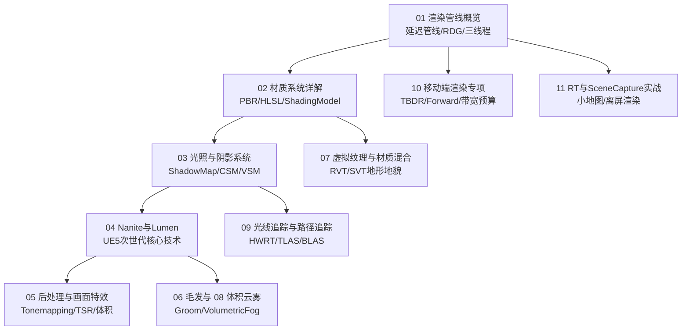

# 02 渲染与图形

> 知识成熟度：L2（子域工程手册，已按 11 篇核心专题与 UE5.8 源码基线全面标准化）。
>
> 领域权威导航：[游戏知识 Domain MOC](../../00_Index/domains/游戏知识.md) ｜ [游戏知识总目录](../README.md)。

---

## 1. 核心定位与设计思想

「02-渲染与图形」是虚幻引擎表现力的核心支柱，涵盖从 GameThread 场景构建、RenderThread 渲染命令生成，到 RHI 提交 GPU 硬件执行的全流程管线。UE5 相比前代引擎进行了一场图形渲染革命：
- **微多边形几何体虚拟化（Nanite）**：基于簇（Cluster）的层次剔除、GPU 驱动驱动的几何管线以及硬件/软件双光栅化混合架构，彻底粉碎了传统离线烘焙多级 LOD 的生产壁垒；
- **全动态全局光照与反射（Lumen）**：结合网格体距离场（Mesh Distance Fields）、表面缓存（Surface Cache）与屏幕空间追踪/硬件光追，实现完全动态的漫反射多次弹射与镜面反射；
- **次时代图形特性与大世界表现**：涵盖虚拟阴影贴图（VSM）、虚拟纹理（SVT/RVT）、物理毛发（Groom Strands）、体积云/体积雾（Volumetric Clouds/Fog）以及移动端（Forward/Deferred）专项优化。

本分类旨在打通底层图形学数学原理、现代 GPU 硬件架构与虚幻引擎渲染代码实现，建立“视觉表现 ↔ 性能预算”的确定性工程思维。

---

## 2. 专题矩阵与知识状态

| 专题文件（Canonical 路径） | 知识类型 | 成熟度 | 核心工程关注点与落地场景 |
| :--- | :---: | :---: | :--- |
| [01-渲染管线概览.md](01-渲染管线概览.md) | Concept | L2 | 延迟渲染管线各阶段（BasePass/Lighting/PostProcess）、RDG 依赖图、渲染线程架构与 stat gpu 分析 |
| [02-材质系统详解.md](02-材质系统详解.md) | Concept | L2 | PBR 物理光照模型、材质域（Material Domain）与混合模式、HLSL 节点翻译、材质实例化与着色模型（Shading Model） |
| [03-光照与阴影系统.md](03-光照与阴影系统.md) | Concept | L2 | 方向光/点光/聚光/矩形光、Shadow Map、级联阴影 CSM、距离场阴影 DFS、虚拟阴影贴图 VSM 原理与性能权衡 |
| [04-Nanite与Lumen.md](04-Nanite与Lumen.md) | Concept | L2 | Nanite 几何体虚拟化集群剔除与软光栅、Lumen 表面缓存（Surface Cache）、屏幕空间光线追踪与动态 GI 调优 |
| [05-后处理与画面特效.md](05-后处理与画面特效.md) | Concept | L2 | PostProcessVolume、色调映射（Tonemapping ACES）、自动曝光、泛光（Bloom）、景深（DOF）、TAA/TSR 超分辨率 |
| [06-Groom毛发系统.md](06-Groom毛发系统.md) | Concept | L2 | Strands/Cards/Meshes 三种几何表示、发丝 RHI 渲染管线、Niagara 物理仿真集成、LOD 切换与显存带宽控制 |
| [07-虚拟纹理与材质混合.md](07-虚拟纹理与材质混合.md) | Concept | L2 | 运行时虚拟纹理（RVT）页面缓存与反馈机制、地形/网格体多层材质混合、流送虚拟纹理（SVT）与显存开销优化 |
| [08-体积渲染与云.md](08-体积渲染与云.md) | Concept | L2 | Volumetric Fog 体素网格（Froxel）、Raymarching 步进采样、体积云多重散射近似与天空大气系统协同 |
| [09-光线追踪与路径追踪.md](09-光线追踪与路径追踪.md) | Concept | L2 | DXR 硬件光追、TLAS/BLAS 加速结构构建、降噪器（Denoiser）、Path Tracer 离线级参考渲染管线 |
| [10-移动端渲染专项.md](10-移动端渲染专项.md) | Concept | L2 | 移动端 Forward/Mobile Deferred、TBDR 架构贴片显存（Tile Memory）、带宽与 Overdraw 压降、ASTC 纹理压缩与设备分级 |
| [11-RenderTarget与SceneCapture实战.md](11-RenderTarget与SceneCapture实战.md) | Concept | L2 | TextureRenderTarget2D 动态绘制、SceneCapture2D 相机捕获、镜面反射/小地图/流体表面交互与显存管理 |

---

## 3. 逻辑学习顺序建议

```mermaid
flowchart TD
    A[01 渲染管线概览<br/>延迟管线/RDG/三线程] --> B[02 材质系统详解<br/>PBR/HLSL/ShadingModel]
    B --> C[03 光照与阴影系统<br/>ShadowMap/CSM/VSM]
    C --> D[04 Nanite与Lumen<br/>UE5次世代核心技术]
    D --> E[05 后处理与画面特效<br/>Tonemapping/TSR/体积]
    B --> F[07 虚拟纹理与材质混合<br/>RVT/SVT地形地貌]
    D --> G[06 毛发与 08 体积云雾<br/>Groom/VolumetricFog]
    C --> H[09 光线追踪与路径追踪<br/>HWRT/TLAS/BLAS]
    A --> I[10 移动端渲染专项<br/>TBDR/Forward/带宽预算]
    A --> J[11 RT与SceneCapture实战<br/>小地图/离屏渲染]
```

1. **第一阶段（渲染底座与光影基础）**：精读 `01-渲染管线概览`、`02-材质系统详解`、`03-光照与阴影系统`，建立帧渲染 Pass 序列、G-Buffer 结构与经典光照阴影的扎实理论。
2. **第二阶段（UE5 次世代双引擎）**：主攻 `04-Nanite与Lumen`，深入理解 GPU-Driven 渲染管线与光线步进表面缓存，配合 `07-虚拟纹理与材质混合` 掌握现代大世界地形渲染。
3. **第三阶段（高级表现与后处理）**：研读 `05-后处理`、`06-Groom毛发`、`08-体积渲染与云` 与 `09-光线追踪`，掌握高拟真影视级画质与物理表现的控制手法。
4. **第四阶段（移动端与定制渲染）**：研读 `10-移动端渲染专项` 与 `11-RenderTarget与SceneCapture实战`，掌握移动设备严苛发热与带宽限制下的极致性能调优。

---

## 4. 游戏与引擎工程落地场景

- **全平台动态画质分级**：依据设备硬件能力，动态切换 Lumen 软件光线追踪、硬件光追与屏幕空间反射（SSR），配合 TSR/DLSS 超分辨率技术稳定帧率；
- **开放世界植被与地形融合**：利用 RVT（运行时虚拟纹理）将 Landscape 地表材质、法线与色彩低开销混合到底层植被与石头交接处，彻底消除硬切边缝并减少 DrawCall；
- **移动端带宽发热压降**：针对移动 GPU（Adreno/Mali）的 TBDR 架构，严格限制 G-Buffer 读写、开启深度预通道（Prepass）、使用 ASTC 6x6 纹理格式，控制 Overdraw 在 2.0 以内。

---

## 5. 跨域技术依赖与前后置导航

- **向下扎根（计算机底座）**：
  - GPU 异构与编译器优化：[00-08 计算机体系结构与性能](../../00-计算机与工程基础/08-计算机体系结构与性能/README.md)
  - 虚拟内存映射与缺页管理：[00-06 操作系统](../../00-计算机与工程基础/06-操作系统/README.md)
- **向上驱动（引擎源码剖析）**：
  - 渲染线程与 RHI 源码：[12-10 渲染线程与RHI源码](../12-引擎源码分析/10-渲染线程与RHI源码.md)
  - Nanite 源码实现：[12-35 Nanite源码](../12-引擎源码分析/35-Nanite源码.md)
  - Lumen 源码实现：[12-30 Lumen与MegaLights源码](../12-引擎源码分析/30-Lumen与MegaLights源码.md)
- **横向协同（粒子与大世界）**：
  - 粒子特效与 GPU 模拟：[11-VFX与Niagara](../11-VFX与Niagara/README.md)
  - 地形与植被渲染：[13-世界构建与过场](../13-世界构建与过场/README.md)
