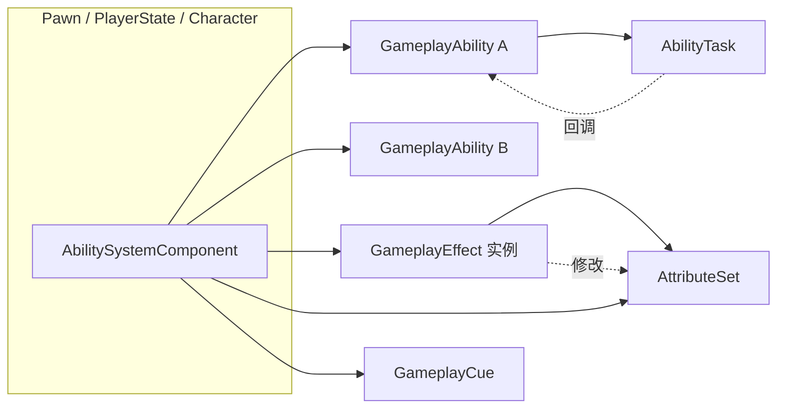
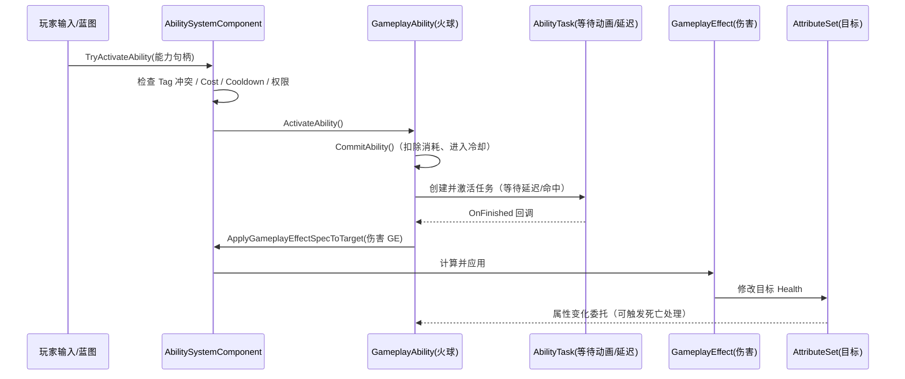
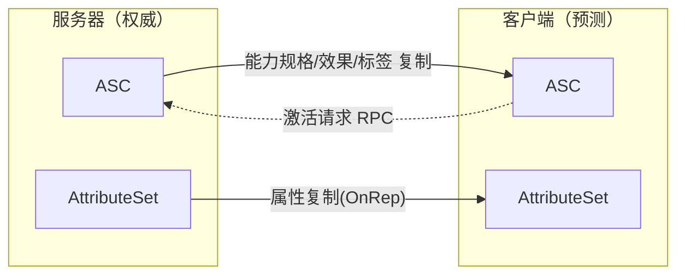

# 01 · Gameplay Ability System（GAS）能力系统

> 面向 UE 5.x 客户端开发。本文系统讲解 GAS 的五大核心：`AbilitySystemComponent`（ASC）、`GameplayAbility`（GA）、`GameplayEffect`（GE）、`AttributeSet`（AS）、`AbilityTask`（AT），并介绍 GameplayCue、网络模型、C++ 示例与最佳实践。

## 一、概述

Gameplay Ability System（GAS）是 Epic 随《Paragon》等项目开源的一套玩法框架，现已内置在 UE 5 中（插件名 `GameplayAbilities`）。它解决的问题非常典型：

- 角色有大量**属性**（生命、蓝量、攻击力、移速…），且会被各种效果（BUFF、DEBUFF、装备、技能）修改；
- 技能有**冷却、消耗、前置条件**，施法过程需要分阶段执行（前摇、命中判定、后摇）；
- 以上行为需要**可配置、可组合、可扩展**，并能正确处理**多人游戏中的客户端预测与服务器授权**。

GAS 用四类对象把这些问题拆解为清晰的分工：

| 对象 | 职责 |
| --- | --- |
| `UAbilitySystemComponent`（ASC） | 中央枢纽：持有能力与效果的"运行时实例"，负责激活能力、应用效果、管理标签 |
| `UGameplayAbility`（GA） | 能力的**定义与执行**：技能逻辑（如"施放火球"） |
| `UGameplayEffect`（GE） | 能力的**结果**：对属性的修改、持续效果、免疫与叠加规则 |
| `UAttributeSet`（AS） | **属性的载体**：一组带复制能力的数值（Health、Mana…） |
| `UAbilityTask`（AT） | 能力的**异步子步骤**：等待时间、等待命中、等待动画通知 |

> GAS 不是必须的：小型项目完全可以用普通组件 + 计时器实现技能。它的价值在于"属性-效果-技能"体系的**规模化**与**网络正确性**。

## 二、核心概念速览

| 概念 | 类 | 作用 | 关键点 |
| --- | --- | --- | --- |
| 能力系统组件 | `UAbilitySystemComponent` | 挂在 Pawn/PlayerState 上的能力中枢 | 每个 ASC 可以挂多个 GA，施加多个 GE，持有标签集合 |
| 能力 | `UGameplayAbility` | 一段可激活的玩法逻辑 | 有 Tag 约束、Cost/Cooldown、实例策略、输入绑定 |
| 效果 | `UGameplayEffect` | 修改属性 / 施加标签 / 触发执行 | 三类时长：Instant / Infinite / HasDuration |
| 属性集 | `UAttributeSet` | 属性数值的声明与复制 | `FGameplayAttributeData` + `ATTRIBUTE_ACCESSORS` |
| 能力任务 | `UAbilityTask` | 能力内的异步等待 | 生命周期由所属 Ability 管理，自动清理 |
| 游戏提示 | `UGameplayCue` | 表现层通知（音效/特效/飘字） | Tag 以 `GameplayCue.` 开头，客户端本地触发 |
| 目标数据 | `FGameplayAbilityTargetDataHandle` | 技能目标信息（位置/对象） | 常配合 `UGameplayAbilityTargetActor` |
| 标签 | `FGameplayTag` | 能力/效果的状态标记 | 是 GAS 内部通信的"语言"（见 03 篇） |

## 三、架构总览



调用链示例（施放"火球术"）：



## 四、原理详解

### 4.1 AbilitySystemComponent（ASC）

ASC 是 GAS 的运行时中枢，通常挂在：

- **PlayerState**（推荐，多人游戏）：角色死亡重生后 ASC 数据不丢失，且随 PlayerState 复制；
- **Character / Pawn**：单机或简单项目；
- 敌人的 ASC 常挂在 Character 上。

ASC 的核心能力：

- **持有能力**：`GiveAbility()` 注册 `UGameplayAbility` 的子类，返回 `FGameplayAbilitySpecHandle`；
- **激活能力**：`TryActivateAbility()`（C++）/ `TryActivateAbilitiesByTag()`（按标签）；
- **应用效果**：`MakeOutgoingGameplayEffectSpec()` 产出 GE 规格（Spec），`ApplyGameplayEffectSpecToSelf() / ToTarget()` 应用；
- **管理标签**：`AddLooseGameplayTag()` / `RemoveLooseGameplayTag()` / `RegisterGameplayTagEvent()`；
- **属性访问**：`GetNumericAttributeBase()` / `SetNumericAttributeBase()`，以及属性变化委托。

一个 Actor 上可以存在多个 ASC（例如同时拥有"本体属性"与"武器属性"两套系统），通过 `FGameplayAbilityActorInfo` 区分。

### 4.2 GameplayAbility（GA）

`UGameplayAbility` 描述"能做什么、怎么施放"。重要配置项：

| 配置 | 说明 |
| --- | --- |
| `AbilityTags` | 本能力自身的标签（如 `Ability.Fire.Spell`） |
| `CancelAbilitiesWithTag` | 激活本能力时取消哪些标签的能力 |
| `BlockAbilitiesWithTag` | 激活本能力时阻止哪些标签的能力 |
| `ActivationOwnedTags` | 激活期间施加给所有者的标签（如 `State.Casting`） |
| `ActivationRequiredTags` | 激活前所有者**必须拥有**的标签 |
| `ActivationBlockedTags` | 激活前所有者**不能拥有**的标签 |
| `CostGameplayEffectClass` | 消耗类 GE（如扣蓝） |
| `CooldownGameplayEffectClass` | 冷却类 GE |
| `InstancingPolicy` | `NonInstanced`（默认，无状态）/ `InstancedPerActor`（按 Actor 实例化）/ `InstancedPerExecution`（每次激活实例化） |
| `NetExecutionPolicy` | `LocalPredicted` / `ServerOnly` / `ServerInitiated` |
| `ReplicationPolicy` | 能力实例是否复制 |

关键虚函数（C++ 覆写点）：

```cpp
// 激活入口：能力被批准激活时调用
virtual void ActivateAbility(
    const FGameplayAbilitySpecHandle Handle,
    const FGameplayAbilityActorInfo* ActorInfo,
    const FGameplayAbilityActivationInfo ActivationInfo,
    const FGameplayEventData* TriggerEventData) override;

// 结束能力（主动结束 / 被打断 / 自然结束）
virtual void EndAbility(
    const FGameplayAbilitySpecHandle Handle,
    const FGameplayAbilityActorInfo* ActorInfo,
    const FGameplayAbilityActivationInfo ActivationInfo,
    bool bReplicateEndAbility,
    bool bWasCancelled) override;

// 提交：同时结算 Cost 与 Cooldown，失败返回 false
virtual bool CommitAbility(
    const FGameplayAbilitySpecHandle Handle,
    const FGameplayAbilityActorInfo* ActorInfo,
    const FGameplayAbilityActivationInfo ActivationInfo);
```

蓝图侧对应 `ActivateAbility` / `EndAbility` / `CommitAbility` 事件，以及大量 `Async` 节点（见 AbilityTask）。

### 4.3 GameplayEffect（GE）

GE 是一份**数据资产**（`UGameplayEffect` 的 CDO），描述"发生了什么变化"。运行时的实际实例是 `FGameplayEffectSpec`。

#### 时长策略（Duration Policy）

| 策略 | 行为 | 典型用途 |
| --- | --- | --- |
| `Instant` | 立即结算一次，不持续 | 单次伤害、治疗、临时消耗 |
| `Infinite` | 永久持续，直到被移除 | BUFF/DEBUFF、光环 |
| `HasDuration` | 持续指定时间后结束 | 减速、持续伤害 |

`HasDuration` 可再配合 **Period**（周期）实现"每 2 秒跳一次伤害"的 DoT。

#### 修饰符（Modifiers）

```cpp
FGameplayModifierInfo
{
    FGameplayAttribute Attribute;      // 目标属性
    EGameplayModOp::Type ModifierOp;   // Additive / Multiplicitive / Division / Override
    FGameplayModifierMagnitude ModifierMagnitude; // 数值来源（常量/曲线/MMC）
    FGameplayTagContainer SourceTags;  // 施法者标签条件
    FGameplayTagContainer TargetTags;  // 目标标签条件
};
```

数值来源有三种：`FScalableFloat`（可被曲线表驱动）、`AttributeBased`（基于某属性计算）、`CustomMagnitude`（MMC，代码计算）。

#### 执行计算（Execution Calculation）

当 GE 逻辑复杂（先算护甲减伤、再算暴击、最后回蓝），用 `UGameplayEffectExecutionCalculation` 子类重写 `Execute_Implementation`，通过捕获（Capture）读取属性，计算后写回。

#### 叠加（Stacking）

`FGameplayEffectStacking` 控制同类 GE 的叠加：`StackByAggregator`（同类聚合叠加）/ `StackBySource`（按施法者分别叠加）、`StackLimitCount`、刷新策略（刷新时长 / 周期 / 过期）。

#### 免疫与移除

- `ApplicationImmunityTags`：拥有某些标签时免疫该 GE；
- `RemoveGameplayEffectsWithTags`：施加时移除带指定标签的其他 GE（如"驱散"）；
- `GrantedTags`：给目标添加标签（如 `State.Stunned`）；
- `GrantedAbilities`：赋予目标新能力（如"拾取后解锁二段跳"）。

### 4.4 AttributeSet（AS）

`UAttributeSet` 子类用 `FGameplayAttributeData` 声明属性，例如：

```cpp
UCLASS()
class UMyAttributeSet : public UAttributeSet
{
    GENERATED_BODY()
public:
    UPROPERTY(BlueprintReadOnly, Category = "Attributes")
    FGameplayAttributeData Health;
    ATTRIBUTE_ACCESSORS(UMyAttributeSet, Health) // 生成 GetHealth/SetHealth/GetHealthAttribute
};
```

要点：

- 属性必须用 `UPROPERTY` 暴露，`FGameplayAttributeData` 内部有 `BaseValue` 与 `CurrentValue`；
- `ATTRIBUTE_ACCESSORS` 宏生成静态 `GetXxxAttribute()`，供 GE 修饰符按名字引用；
- 属性变化监听：`ASC->GetGameplayAttributeValueChangeDelegate(Attribute).AddUObject(...)`；
- 数值校验（如生命不低于 0）在 `PostGameplayEffectExecute()` 中处理；
- 网络复制：`GetLifetimeReplicatedProps` 中 `DOREPLIFETIME_CONDITION_NOTIFY` 复制属性，客户端 `OnRep` 触发委托刷新 UI。

### 4.5 AbilityTask（AT）

能力逻辑往往是异步的：等 0.5 秒前摇、等动画通知、等目标确认。原生 GA 是同步函数，因此 GAS 提供 `UAbilityTask`：

- 工厂函数约定：静态函数 `NewAbilityTask<T>(this)` 创建，`ReadyForActivation()` 激活；
- 生命周期绑定所属 Ability：能力结束时任务自动 `OnDestroy`，避免悬挂回调；
- 常用内置任务：`UAbilityTask_WaitDelay`、`UAbilityTask_WaitAbilityCommit`、`UAbilityTask_WaitGameplayEvent`、`UAbilityTask_WaitTargetData`、`UAbilityTask_MoveToLocation` 等；
- 蓝图侧即 `Async` 节点（如 `Wait Delay`、`Wait Target Data`）。

### 4.6 GameplayCue 与 TargetData

- **GameplayCue**：表现层通知（音效、特效、飘字），Tag 以 `GameplayCue.` 开头（如 `GameplayCue.Fireball.Impact`）。Cue 分为 `GameplayCueNotify_Static`（一次性，无状态）与 `GameplayCueNotify_Actor`（可持续，如地面火圈）。Cue 的 Executed/Added/Removed 按规则自动在客户端广播，是"服务器计算、全端表现"的典型通道。
- **TargetData**：技能目标信息（命中 Actor、位置、方向）用 `FGameplayAbilityTargetDataHandle` 打包，配合 `UGameplayAbilityTargetActor`（如 `AGameplayAbilityTargetActor_SingleLineTrace`）实现瞄准与确认。

### 4.7 网络模型（要点）



- 默认推荐：ASC 挂在 PlayerState 上，`bReplicateInput` 控制输入复制；
- 客户端 `LocalPredicted` 能力：本地立即激活并预测效果，服务器回滚不一致的部分；
- `ServerOnly`：客户端请求，服务器激活；
- 属性复制由 AttributeSet 的 `FGameplayAttributeData` 处理，变化通知自动触发 `OnRep`。

## 五、代码示例

### 5.1 声明 AttributeSet

```cpp
// MyAttributeSet.h
UCLASS()
class MYGAME_API UMyAttributeSet : public UAttributeSet
{
    GENERATED_BODY()
public:
    UPROPERTY(BlueprintReadOnly, Category = "Attributes|Vital")
    FGameplayAttributeData Health;
    ATTRIBUTE_ACCESSORS(UMyAttributeSet, Health)

    UPROPERTY(BlueprintReadOnly, Category = "Attributes|Vital")
    FGameplayAttributeData MaxHealth;
    ATTRIBUTE_ACCESSORS(UMyAttributeSet, MaxHealth)

    UPROPERTY(BlueprintReadOnly, Category = "Attributes|Vital")
    FGameplayAttributeData Mana;
    ATTRIBUTE_ACCESSORS(UMyAttributeSet, Mana)

    virtual void PostGameplayEffectExecute(const FGameplayEffectModCallbackData& Data) override;

    virtual void GetLifetimeReplicatedProps(TArray<FLifetimeProperty>& OutLifetimeProps) const override;
};
```

```cpp
// MyAttributeSet.cpp
void UMyAttributeSet::PostGameplayEffectExecute(const FGameplayEffectModCallbackData& Data)
{
    Super::PostGameplayEffectExecute(Data);

    if (Data.EvaluatedData.Attribute == GetHealthAttribute())
    {
        // 生命不低于 0：触发死亡逻辑
        const float Clamped = FMath::Clamp(GetHealth(), 0.f, GetMaxHealth());
        SetHealth(Clamped);
        if (Clamped <= 0.f)
        {
            // 广播死亡事件（通常通过 GameplayEvent 或委托通知）
        }
    }
}

void UMyAttributeSet::GetLifetimeReplicatedProps(TArray<FLifetimeProperty>& OutLifetimeProps) const
{
    Super::GetLifetimeReplicatedProps(OutLifetimeProps);
    DOREPLIFETIME_CONDITION_NOTIFY(UMyAttributeSet, Health, COND_None, REPNOTIFY_Always);
    DOREPLIFETIME_CONDITION_NOTIFY(UMyAttributeSet, MaxHealth, COND_None, REPNOTIFY_Always);
}
```

### 5.2 自定义 GameplayAbility

```cpp
// MyGameplayAbility.h
UCLASS()
class MYGAME_API UMyGameplayAbility : public UGameplayAbility
{
    GENERATED_BODY()
public:
    UPROPERTY(EditDefaultsOnly, BlueprintReadOnly, Category = "MyAbility")
    TSubclassOf<UGameplayEffect> DamageEffectClass;

    UPROPERTY(EditDefaultsOnly, BlueprintReadOnly, Category = "MyAbility")
    FScalableFloat DamageValue;

    virtual void ActivateAbility(
        const FGameplayAbilitySpecHandle Handle,
        const FGameplayAbilityActorInfo* ActorInfo,
        const FGameplayAbilityActivationInfo ActivationInfo,
        const FGameplayEventData* TriggerEventData) override;
};
```

```cpp
// MyGameplayAbility.cpp
void UMyGameplayAbility::ActivateAbility(
    const FGameplayAbilitySpecHandle Handle,
    const FGameplayAbilityActorInfo* ActorInfo,
    const FGameplayAbilityActivationInfo ActivationInfo,
    const FGameplayEventData* TriggerEventData)
{
    if (!CommitAbility(Handle, ActorInfo, ActivationInfo)) // 结算消耗与冷却
    {
        EndAbility(Handle, ActorInfo, ActivationInfo, true, true);
        return;
    }

    // 1. 生成伤害 GE 规格
    UAbilitySystemComponent* ASC = GetAbilitySystemComponentFromActorInfo();
    if (!ASC)
    {
        EndAbility(Handle, ActorInfo, ActivationInfo, true, true);
        return;
    }

    FGameplayEffectSpecHandle SpecHandle = ASC->MakeOutgoingGameplayEffectSpec(
        DamageEffectClass, GetAbilityLevel());
    if (SpecHandle.IsValid())
    {
        // 2. 向目标应用（目标由 TargetData / 外部传入决定）
        ASC->ApplyGameplayEffectSpecToTarget(SpecHandle, TargetASC);
    }

    // 3. 结束能力（也可以等待动画/延迟任务后再结束）
    EndAbility(Handle, ActorInfo, ActivationInfo, true, false);
}
```

### 5.3 ASC 初始化与效果施加

```cpp
// 在角色 / PlayerState 上初始化（以挂 PlayerState 为例）
void AMyPlayerState::PostInitializeComponents()
{
    Super::PostInitializeComponents();
    AbilitySystemComponent = CreateDefaultSubobject<UAbilitySystemComponent>(TEXT("AbilitySystemComponent"));
    AttributeSet = CreateDefaultSubobject<UMyAttributeSet>(TEXT("AttributeSet"));
}

// 注册能力（可在 PossessedBy / OnRep 中调用）
void AMyCharacter::GiveDefaultAbilities()
{
    if (UAbilitySystemComponent* ASC = GetAbilitySystemComponent())
    {
        for (const TSubclassOf<UGameplayAbility>& AbilityClass : DefaultAbilities)
        {
            if (AbilityClass)
            {
                ASC->GiveAbility(FGameplayAbilitySpec(AbilityClass, 1 /*Level*/, INDEX_NONE /*InputID*/));
            }
        }
    }
}

// 施加一个"扣血"效果（示例）
void AMyCharacter::ApplyDamageToSelf(float Amount)
{
    UAbilitySystemComponent* ASC = GetAbilitySystemComponent();
    if (!ASC || !DamageEffectClass) return;

    FGameplayEffectContextHandle Context = ASC->MakeEffectContext();
    Context.AddInstigator(this, this);

    FGameplayEffectSpecHandle Spec = ASC->MakeOutgoingGameplayEffectSpec(DamageEffectClass, 1.f);
    // 通过 SetByCaller 传参（推荐：数值来源走 DataTable / SetByCaller）
    Spec.Data->SetSetByCallerMagnitude(FGameplayTag::RequestGameplayTag(FName("Data.Damage")), Amount);
    ASC->ApplyGameplayEffectSpecToSelf(Spec);
}
```

> 提示：`SetByCaller` 是 GE 数值的动态传参方式——GE 修饰符的 Magnitude 选择 `SetByCaller`，运行时由代码/蓝图传入具体值，非常适合"同一份伤害 GE 用于不同技能"。

### 5.4 自定义 AbilityTask

```cpp
// MyAbilityTask_WaitConfirm.h
UCLASS()
class MYGAME_API UMyAbilityTask_WaitConfirm : public UAbilityTask
{
    GENERATED_BODY()
public:
    DECLARE_DYNAMIC_MULTICAST_DELEGATE_OneParam(FOnConfirm, const FGameplayAbilityTargetDataHandle&, TargetData);

    UPROPERTY(BlueprintAssignable)
    FOnConfirm OnConfirm;

    // 蓝图友好的工厂函数
    UFUNCTION(BlueprintCallable, Category = "Ability|Tasks", meta = (HidePin = "OwningAbility", DefaultToSelf = "OwningAbility"))
    static UMyAbilityTask_WaitConfirm* WaitConfirm(UGameplayAbility* OwningAbility);

    virtual void Activate() override;
    virtual void OnDestroy(bool bInOwnerFinished) override;
};
```

```cpp
// MyAbilityTask_WaitConfirm.cpp
UMyAbilityTask_WaitConfirm* UMyAbilityTask_WaitConfirm::WaitConfirm(UGameplayAbility* OwningAbility)
{
    UMyAbilityTask_WaitConfirm* Task = NewAbilityTask<UMyAbilityTask_WaitConfirm>(OwningAbility);
    return Task;
}

void UMyAbilityTask_WaitConfirm::Activate()
{
    Super::Activate();
    // 假设：监听某个 GameplayEvent 作为"确认命中"
    if (UAbilitySystemComponent* ASC = Ability->GetAbilitySystemComponentFromActorInfo())
    {
        // 注册监听（省略详细绑定代码）
    }
}

void UMyAbilityTask_WaitConfirm::OnDestroy(bool bInOwnerFinished)
{
    // 解除所有监听，防止悬挂回调
    Super::OnDestroy(bInOwnerFinished);
}
```

在能力中使用：

```cpp
UMyAbilityTask_WaitConfirm* Task = UMyAbilityTask_WaitConfirm::WaitConfirm(this);
Task->OnConfirm.AddDynamic(this, &UMyGameplayAbility::OnConfirmTarget); // 注意：动态委托需 UFUNCTION
Task->ReadyForActivation();
```

### 5.5 蓝图侧操作要点

1. **创建资源**：内容浏览器右键 → Gameplay Ability System 分类下创建 `GameplayAbility`、`GameplayEffect` 蓝图子类；
2. **配置 GE**：在 GE 资产中设置 Duration Policy、Modifiers（选择 Attribute 与操作符）、Stacking、Tags；
3. **配置能力**：设置 AbilityTags / ActivationBlockedTags / Cost / Cooldown，事件图实现 `ActivateAbility` 与 `EndAbility`；
4. **授权**：`GiveAbility` 后可在蓝图中用 `TryActivate Abilities By Tag` 激活；
5. **UI 刷新**：绑定 `Get Gameplay Attribute Value Change Delegate`（属性变化委托）节点，或使用 `Async Task` 类节点监听。

## 六、最佳实践

1. **数值不硬编码**：GE 的数值走 `FScalableFloat` 曲线、DataTable 或 `SetByCaller`；属性和技能配置全部资产化。
2. **状态用 Tag，数值用 Attribute**：能否移动/是否无敌是"状态"，用 Tag 表达；移动速度本身是"数值"，用 Attribute 表达。
3. **能力职责单一**：一个能力只做一件事；需要组合时用 `GrantedAbilities`、`GameplayEvent` 联动，而不是把逻辑塞进一个超长 ActivateAbility。
4. **合理选择实例策略**：无状态能力用 `NonInstanced` 省内存；需要每帧状态（如蓄力）用 `InstancedPerExecution` 或 `InstancedPerActor`。
5. **Cue 与逻辑分离**：表现一律走 GameplayCue，逻辑层只关心 Tag 与 Attribute，方便换皮与性能裁剪。
6. **监听生命周期**：AbilityTask 记得在 `OnDestroy` 解绑；AttributeSet 的委托在销毁 ASC 前移除。
7. **网络先行**：多人项目一开始就按"服务器权威 + 客户端预测"设计；`LocalPredicted` 需要仔细处理回滚，宁可用 `ServerOnly` 起步。
8. **善用调试**：控制台 `AbilitySystem.Debug.Ability` / `GameplayTags.Debug`，或 `showdebug abilitysystem` 查看运行时状态。

## 七、常见问题 FAQ

**Q1：能力无法激活，`CanActivateAbility` 一直失败？**
依次检查：ASC 是否存在（GiveAbility 前）；AbilityTags 与激活标签是否冲突（`ActivationBlockedTags` / `BlockAbilitiesWithTag` / `CancelAbilitiesWithTag`）；Cost / Cooldown GE 是否满足；`NetExecutionPolicy` 与当前机器角色（客户端能否预测）；实例策略与输入绑定（InputID 是否有效）。

**Q2：GE 施加了但属性没变？**
检查：GE 的 Modifier 是否指向正确的 Attribute（AttributeSet 是否已挂到 ASC）；Duration 策略（Instant 直接结算，Infinite/HasDuration 需等待）；SourceTags / TargetTags 条件；是否被免疫标签拦截；数值为 0 或叠加达到上限。

**Q3：客户端看不到属性变化？**
AttributeSet 是否在 `GetLifetimeReplicatedProps` 中复制；是否使用了 `DOREPLIFETIME_CONDITION_NOTIFY`；UI 是否绑定了 `OnRep` 后的委托（建议在 `OnRep` 中广播 UI 刷新委托）。

**Q4：CommitAbility 失败是什么意思？**
Cost 不足（蓝不够）或 Cooldown 未结束。可在 `CommitAbility` 前用 `CheckCost` / `CheckCooldown` 预判，或监听 `OnCooldownReady` 事件。

**Q5：动态委托绑定 `AddDynamic` 报错？**
回调函数必须是 `UFUNCTION()`；若在 C++ 类中声明回调，记得加 `UFUNCTION()` 宏。C++ 内部通信优先用普通多播委托（`AddUObject` / `AddLambda`）。

**Q6：能力结束后任务回调仍被调用（崩溃/悬垂）？**
任务应在 `EndAbility` 时自动销毁；自定义任务必须在 `OnDestroy` 中解绑所有监听；不要持有 `Ability` 裸指针跨帧使用，必要时用弱引用。

**Q7：GAS 与普通技能系统如何选择？**
项目需要复杂属性/效果/状态交互、多人预测、或大量技能时用 GAS；简单的单体技能、无网络需求时可用普通组件实现，避免引入框架复杂度。

## 八、关联阅读

- [03-GameplayTag与数据资产](03-GameplayTag与数据资产.md)：GAS 依赖 GameplayTag 作为状态语言，先掌握标签层次与查询。
- [04-委托事件与对象通信](04-委托事件与对象通信.md)：GAS 中大量使用委托（属性变化、能力结束、任务回调）。
- [05-蓝图与C++协作](05-蓝图与C++协作.md)：GAS 资产的配置与蓝图覆写依赖 UFUNCTION / UPROPERTY 反射机制。
- [06-网络同步](../06-网络同步/README.md)：GAS 网络授权、RPC 与属性复制细节。
- [04-动画系统](../04-动画系统/README.md)：Ability 常通过 AnimNotify / GameplayEvent 与动画蓝图联动。
