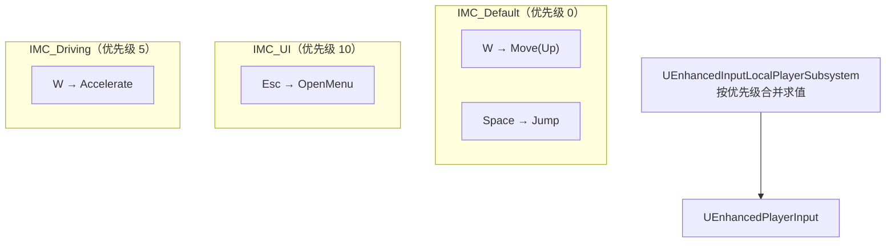
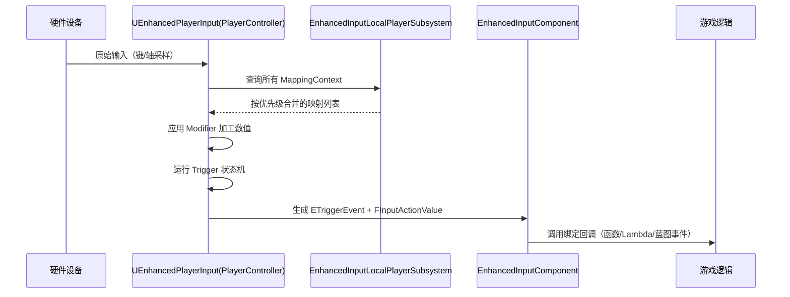

# 02 · Enhanced Input 增强输入

> 版本基准：UE 5.8.0（本机 `Engine/Build/Build.version`：CL 55116800，分支 `++UE5+Release-5.8`）。
> 源码依据：`C:\Program Files\Epic Games\UE_5.8\Engine\Plugins\EnhancedInput\Source\EnhancedInput`；以本机 5.8 源码为准。
> 适用范围：Enhanced Input 插件、运行时客户端输入与编辑器配置；本文是概念/使用层说明。
> 兼容性边界：旧输入系统和 UE 4.27 仅作为迁移对照，不作为当前基准。
> 最后更新：2026-08-05（统一 UE5.8 版本基线）。

## 一、概述

UE4 时代的输入系统由 **Project Settings → Input** 中的 Axis Mappings / Action Mappings 定义，再在 Pawn / PlayerController 里用 `BindAxis` / `BindAction` 绑定。它的问题：

- 按键与逻辑在项目设置里静态绑定，**运行时动态改键**非常别扭；
- 一个按键一个函数，**无法表达"按住 1 秒触发"、"双击"、"连按"** 这类复杂手势；
- 手柄摇杆的**死区、曲线、轴向转换**需要在业务代码里手工处理；
- 输入设备（键盘/手柄）之间的切换与优先级管理薄弱。

Enhanced Input（增强输入）插件从 UE 5.0 引入，UE 5.1 起新项目默认启用。它把输入拆成三层可复用资产：

1. **InputAction（输入动作）**：抽象的"语义"——例如"移动"、"跳跃"、"开火"，不关心具体按键；
2. **InputMappingContext（输入映射上下文）**：把"具体按键/摇杆"映射到"InputAction"，并携带修饰器与触发条件，支持优先级与上下文切换（如 UI 模式/驾驶模式）；
3. **Trigger（触发条件）与 Modifier（修饰器）**：定义"怎么才算触发"以及"原始输入如何加工"。


## 二、核心概念速览

| 概念 | 类 | 作用 | 关键点 |
| --- | --- | --- | --- |
| 输入动作 | `UInputAction` | 语义化输入（Move / Jump / Fire） | 有值类型、消耗规则、暂停行为 |
| 映射上下文 | `UInputMappingContext` | 按键 → 动作 的映射集合 | 有优先级，可动态增删 |
| 输入组件 | `UEnhancedInputComponent` | 绑定动作回调、按事件分发 | 替代旧 `UInputComponent` 的 BindAction |
| 玩家输入子系统 | `UEnhancedInputLocalPlayerSubsystem` | 管理所有 MappingContext 的叠加 | `AddMappingContext` / `RemoveMappingContext` |
| 触发条件 | `UInputTrigger` 子类 | 决定何时/如何触发 | Down / Pressed / Hold / Tap / Pulsed / Chorded 等 |
| 修饰器 | `UInputModifier` 子类 | 加工原始输入值 | Negate / Swizzle / DeadZone / Scale / 曲线等 |
| 触发事件 | `ETriggerEvent` | 回调的事件阶段 | Started / Triggered / Completed / Canceled / Ongoing |
| 输入值 | `FInputActionValue` | 动作携带的数据 | 支持 1D / 2D / 3D 轴值与 bool |
| 玩家可映射配置 | `UPlayerMappableInputConfig` | 面向玩家改键的配置集合 | 配合 `UEnhancedInputUserSettings` 持久化 |

## 三、原理详解

### 3.1 InputAction：语义的载体

`UInputAction` 是一个数据资产，核心属性：

| 属性 | 说明 |
| --- | --- |
| `ValueType` | `Digital`（bool）/ `Axis1D` / `Axis2D` / `Axis3D`，决定回调收到的 `FInputActionValue` 形态 |
| `bConsumeInput` | 触发后是否"吃掉"本次输入，阻止传递给低优先级上下文 |
| `bTriggerWhenPaused` | 游戏暂停时是否仍然触发 |
| `bReserveAllMappings` | 预保留全部映射槽（性能优化） |
| `Triggers` / `Modifiers` | 作用于该动作的**全局**触发条件与修饰器（会被映射级配置叠加） |

> 经验：一个动作只做一件事。"移动"（2D 轴）与"跳跃"（Digital）分开；不要把"交互"和"拾取"塞进同一个动作。

### 3.2 InputMappingContext：映射的容器

一个 IMC 包含若干 `FEnhancedActionKeyMapping`（动作 + 按键 + 局部修饰器/触发器 + 玩家可映射选项）。多个 IMC 可以**同时叠加**：



- 优先级（Priority）**数值越大越优先**；
- 高优先级上下文中同按键同动作的映射会"遮蔽"低优先级；
- `bConsumeInput` 为 true 的动作触发后，低优先级上下文收不到同一输入；
- 上下文可以随时 `AddMappingContext` / `RemoveMappingContext`，实现"普通模式 ↔ UI 模式 ↔ 驾驶模式"切换。

### 3.3 Trigger：触发条件

| 触发器 | 行为 | 适用场景 |
| --- | --- | --- |
| `Down` | 按下即触发（持续） | 移动轴、按住加速 |
| `Pressed` | 按下瞬间触发一次 | 跳跃、攻击（单击） |
| `Released` | 松开瞬间触发一次 | 松手施放（如蓄力释放） |
| `Hold` | 按住达到 `HoldTimeThreshold` 后触发 | 长按技能 |
| `Tap` | 快速按下并松开（`TapReleaseTimeThreshold` 内）触发 | 轻点交互 |
| `Pulsed` | 按 `PulseInterval` 周期性触发 | 自动连发 |
| `ChordedAction` | 需要与另一个动作同时按住（组合键） | Ctrl+攻击、Shift+翻滚 |
| `DoublePress`（UE 5.2+） | 双击触发 | 双击闪避 |

触发判定是"修饰器加工后的值"上的状态机：`Started → Triggered → Completed`，若被更高优先级动作抢占则走 `Canceled`。

### 3.4 Modifier：修饰器

修饰器按映射中的顺序**依次应用**，加工 `FInputActionValue`：

| 修饰器 | 作用 | 示例 |
| --- | --- | --- |
| `Negate` | 取反（可指定轴） | W 为 +Y 时，S 映射用 Negate |
| `Swizzle` | 交换轴 | 手柄 Y 轴 → 2D 动作的 X 轴 |
| `Scale` | 乘以系数 | 灵敏度 0.5 倍 |
| `DeadZone` | 死区：低于阈值归零，可带曲线过渡 | 手柄摇杆防漂移 |
| `Smooth` | 低通滤波，平滑输入 | 相机平滑 |
| `Response Curve`（指数/用户曲线） | 输入响应曲线 | 摇杆非线性加速 |
| `ToWorldSpace` | 把输入转换到世界空间 | 相对相机方向的移动 |
| `FOV`（部分版本） | 根据输入调整视野 | 跑动时 FOV 扩展 |

> 默认模板中 WASD 的"W"映射通常带 `Swizzle(InputAxisY → OutputAxis2D)` + 方向修正，"S"还叠加 `Negate`——理解这一点对排查"为什么方向反了"很重要。

### 3.5 ETriggerEvent：回调的事件阶段

绑定回调时可以指定监听哪个事件阶段：

| 事件 | 含义 |
| --- | --- |
| `None` | 无 |
| `Started` | 触发条件首次满足（按下/进入触发态） |
| `Triggered` | 触发条件保持满足（每帧 / 持续） |
| `Completed` | 触发条件结束（松开/完成） |
| `Canceled` | 被更高优先级输入打断 |
| `Ongoing` | 未触发但有活动（用于蓄力进度） |

同一个回调函数绑定到不同阶段即可实现"按下开始、松开结束"的完整手势，无需自己维护状态变量。

### 3.6 底层处理流程



关键类：`UEnhancedPlayerInput`（处理原始输入、执行映射求值）挂载在 `APlayerController` 上；`UEnhancedInputComponent` 负责把动作事件分发给回调。游戏暂停、`SetInputMode` 等仍沿用旧的 PlayerController 输入模式规则。

## 四、与旧输入系统对比

| 维度 | 旧输入系统 | Enhanced Input |
| --- | --- | --- |
| 映射定义 | Project Settings 全局 Axis/Action Mappings | 资产（IMC），可运行时增删 |
| 绑定方式 | `BindAxis` / `BindAction`（函数名匹配） | `BindAction(Action, ETriggerEvent, ...)` |
| 动作语义 | 按键名即语义（`MoveForward`） | Action 资产即语义，键位解耦 |
| 复杂手势 | 需要手工计时/状态机 | 内置 Trigger（Hold/Tap/Pulsed/Chorded） |
| 摇杆加工 | 业务代码手工处理死区 | Modifier 管线（DeadZone/曲线/轴向） |
| 改键支持 | 几乎不支持 | PlayerMappable + UserSettings 持久化 |
| 调试 | 控制台日志 | `showdebug enhancedinput` 可视化 |
| 兼容性 | UE5 仍可用（兼容层） | 新项目默认 |

**迁移要点**：

- 旧 `BindAxis("MoveForward", ...)` → 创建 `IA_Move`（Axis1D/2D）+ IMC 映射 → `BindAction(IA_Move, ETriggerEvent::Triggered, ...)`；
- 旧 `BindAction("Jump", IE_Pressed, ...)` → `IA_Jump`（Digital）+ `BindAction(IA_Jump, ETriggerEvent::Started, ...)`；
- Pawn 的 `SetupPlayerInputComponent` 中把 `PlayerInputComponent` 转型为 `UEnhancedInputComponent` 再绑定；
- 旧系统的 Axis Mappings 仍可读，但新代码不要再新增。

## 五、代码示例

### 5.1 编辑器创建资产（推荐流程）

1. 内容浏览器右键 → **Input → Input Action**，创建 `IA_Move`（Value Type = Axis2D）、`IA_Jump`（Digital）、`IA_Look`（Axis2D）；
2. 右键 → **Input → Input Mapping Context**，创建 `IMC_Default`；
3. 打开 IMC，`+` 添加映射：选择 Action、按键（W/A/S/D、Space、鼠标 XY），必要时添加 Modifier（如 W 映射的 Swizzle/Negate）；
4. 在 PlayerController 的 BeginPlay（或 Pawn Possessed）中 `AddMappingContext`。

### 5.2 C++ 绑定输入

```cpp
// MyCharacter.h
UCLASS()
class MYGAME_API AMyCharacter : public ACharacter
{
    GENERATED_BODY()
public:
    virtual void SetupPlayerInputComponent(UInputComponent* PlayerInputComponent) override;

    UPROPERTY(EditDefaultsOnly, BlueprintReadOnly, Category = "Input")
    UInputMappingContext* DefaultMappingContext;

    UPROPERTY(EditDefaultsOnly, BlueprintReadOnly, Category = "Input")
    UInputAction* MoveAction;

    UPROPERTY(EditDefaultsOnly, BlueprintReadOnly, Category = "Input")
    UInputAction* JumpAction;

    UPROPERTY(EditDefaultsOnly, BlueprintReadOnly, Category = "Input")
    UInputAction* LookAction;

private:
    void Move(const FInputActionValue& Value);
    void Look(const FInputActionValue& Value);
};
```

```cpp
// MyCharacter.cpp
#include "EnhancedInputComponent.h"
#include "EnhancedInputSubsystems.h"
#include "InputAction.h"
#include "InputMappingContext.h"

void AMyCharacter::SetupPlayerInputComponent(UInputComponent* PlayerInputComponent)
{
    Super::SetupPlayerInputComponent(PlayerInputComponent);

    UEnhancedInputComponent* EIC = Cast<UEnhancedInputComponent>(PlayerInputComponent);
    if (!EIC) return;

    EIC->BindAction(MoveAction, ETriggerEvent::Triggered, this, &AMyCharacter::Move);
    EIC->BindAction(LookAction, ETriggerEvent::Triggered, this, &AMyCharacter::Look);
    EIC->BindAction(JumpAction, ETriggerEvent::Started, this, &AMyCharacter::Jump);
    EIC->BindAction(JumpAction, ETriggerEvent::Completed, this, &AMyCharacter::StopJumping);
}

// 在 PossessedBy / BeginPlay 中注册上下文
void AMyCharacter::PossessedBy(AController* NewController)
{
    Super::PossessedBy(NewController);
    AddMappingContext(DefaultMappingContext, 0);
}

void AMyCharacter::AddMappingContext(UInputMappingContext* Context, int32 Priority)
{
    if (const APlayerController* PC = Cast<APlayerController>(GetController()))
    {
        if (UEnhancedInputLocalPlayerSubsystem* Subsystem =
            ULocalPlayer::GetSubsystem<UEnhancedInputLocalPlayerSubsystem>(PC->GetLocalPlayer()))
        {
            Subsystem->AddMappingContext(Context, Priority);
        }
    }
}

void AMyCharacter::Move(const FInputActionValue& Value)
{
    const FVector2D Input = Value.Get<FVector2D>();
    AddMovementInput(GetActorForwardVector(), Input.Y);
    AddMovementInput(GetActorRightVector(), Input.X);
}

void AMyCharacter::Look(const FInputActionValue& Value)
{
    const FVector2D LookInput = Value.Get<FVector2D>();
    AddControllerYawInput(LookInput.X);
    AddControllerPitchInput(LookInput.Y);
}
```

> `FInputActionValue::Get<FVector2D>()` / `GetAxis1D()` 按动作的 ValueType 取数；Digital 动作可用 `Get<bool>()`。

### 5.3 运行时切换上下文（UI / 驾驶模式）

```cpp
// 进入 UI 模式：叠加高优先级上下文，屏蔽移动
Subsystem->AddMappingContext(IMC_UI, 10);

// 退出 UI 模式
Subsystem->RemoveMappingContext(IMC_UI);

// 一键清空（场景切换时）
Subsystem->ClearAllMappingContexts();
```

### 5.4 自定义 Trigger / Modifier

```cpp
// 自定义触发器：按下后 0.3 秒内松开则触发（类 Tap 的变体）
UCLASS()
class UMyInputTrigger_QuickRelease : public UInputTrigger
{
    GENERATED_BODY()
public:
    virtual ETriggerState UpdateState_Implementation(
        const UEnhancedPlayerInput* PlayerInput,
        FInputActionValue ModifiedValue,
        float DeltaTime) override;

    UPROPERTY(EditAnywhere, Category = "Trigger")
    float ReleaseWindow = 0.3f;
};
```

```cpp
ETriggerState UMyInputTrigger_QuickRelease::UpdateState_Implementation(
    const UEnhancedPlayerInput* PlayerInput,
    FInputActionValue ModifiedValue,
    float DeltaTime)
{
    // 实现要点：记录按下时间，检测"按下→快速松开"，
    // 满足条件返回 ETriggerState::Triggered，否则 None / Ongoing
    return ETriggerState::None;
}
```

自定义类创建后在 IMC 映射的 Triggers 下拉中即可选用（需 `BlueprintType` / 编辑器可见）。

### 5.5 键位重绑（玩家自定义按键）

```cpp
// UE 5.3+：UEnhancedInputUserSettings 持久化玩家改键
if (UEnhancedInputUserSettings* Settings = UEnhancedInputUserSettings::GetOrCreateSettings())
{
    // 把 FKey 映射到某个 PlayerMappable 映射
    Settings->MapPlayerMappableKey(/* FPlayerMappableKeySlot */ Slot, NewKey);
    Settings->ApplySettings();
}
```

对应资产侧：把 IMC 中的映射标记为 **Player Mappable**（设置 PlayerMappableOptions 的名称与元数据），再组合进 `UPlayerMappableInputConfig`，UI 中即可枚举并改写。

### 5.6 蓝图侧操作要点

1. 角色蓝图事件图：`EnhancedInputAction IA_Move` 事件节点（需在组件上启用 Enhanced Input）；
2. 或使用 `Bind Action to Input Action`（`UEnhancedInputComponent` 节点）+ `ETriggerEvent` 枚举选择阶段；
3. PlayerController / GameInstance 中 `Get Local Player Subsystem → Enhanced Input Local Player Subsystem → Add Mapping Context`，输入优先级参数；
4. 调试：运行中控制台输入 `showdebug enhancedinput`，可查看每个 Action 的当前状态与数值。

## 六、最佳实践

1. **动作语义化**：先定义游戏语义（Move / Jump / Interact），再谈按键；换键位只改 IMC。
2. **上下文分层**：默认 IMC 优先级 0；UI 模式 10；驾驶/特殊模式 5 或更高。进入菜单时叠加 UI IMC 并依赖 `bConsumeInput` 屏蔽游戏输入。
3. **修饰器复用**：死区、曲线做成 IMC 内的映射级配置，不要在业务回调里手写。
4. **区分 Started / Triggered**：单击动作绑 `Started`，轴动作绑 `Triggered`，松手逻辑绑 `Completed`。
5. **手柄优先考虑**：动作值类型用 Axis2D 而非两个 Axis1D，天然支持摇杆向量；死区用 `DeadZone` 修饰器。
6. **性能**：IMC 数量与映射条目保持精简；`bReserveAllMappings` 用于高频动作；避免每帧动态增删上下文。
7. **网络注意**：输入回调发生在客户端，逻辑结果通过 RPC 同步（见 GAS 与网络篇）。
8. **版本兼容**：`DoublePress`、`UEnhancedInputUserSettings` 等为 UE 5.2+ / 5.3+ 特性，跨版本时确认 API。

## 七、常见问题 FAQ

**Q1：绑定了但收不到输入？**
依次检查：IMC 是否已 `AddMappingContext`（PlayerController 的 LocalPlayer 子系统）；动作资产是否被赋值（C++ 引用是否在蓝图中指定）；`ETriggerEvent` 阶段是否匹配（轴动作绑 `Triggered`，单击绑 `Started`）；`bConsumeInput` 是否被高优先级上下文吃掉；`SetInputMode` 是否为 UI Only；`bTriggerWhenPaused`。

**Q2：方向反了 / 轴错位？**
检查 IMC 中该按键映射的 Modifier：W 通常需要 `Swizzle`（把 Y 轴放到 2D 输出的正确位置），S 再加 `Negate`；手柄右摇杆 XY 与鼠标 XY 的符号约定不同。

**Q3：旧项目如何迁移？**
保留旧 Axis/Action Mappings 兼容，新建 IMC 后逐步替换 `BindAxis`/`BindAction` 调用；`EnhancedInputComponent` 可以整体替换 `InputComponent`（`DefaultInputComponentClass` 配置或转型使用）。

**Q4：想让按住与松开走不同逻辑？**
同一 Action 绑两个回调：`Started`（开始）与 `Completed`（结束）；蓄力进度用 `Ongoing` 阶段读取 `FInputActionValue`。

**Q5：如何实现组合键？**
用 `ChordedAction` 触发器：主动作映射 + Chord 动作（如 Ctrl 映射为 `IA_ModifierCtrl`），或直接在 IMC 里为动作添加"要求其他动作处于活动状态"的触发器。

**Q6：玩家改键后重启丢失？**
UE 5.3+ 使用 `UEnhancedInputUserSettings` 持久化；旧版本需自行序列化改键结果（保存 `FEnhancedActionKeyMapping` 的键位集合到 SaveGame）。

## 八、关联阅读

- [01-GameplayAbilitySystem能力系统](01-GameplayAbilitySystem能力系统.md)：输入触发技能常通过 `TryActivateAbilitiesByTag` 或 GameplayEvent 转发。
- [03-GameplayTag与数据资产](03-GameplayTag与数据资产.md)：PlayerMappable 配置与按键方案常以 Tag/DataAsset 组织。
- [04-委托事件与对象通信](04-委托事件与对象通信.md)：输入回调内部多使用委托向其他系统派发。
- [05-蓝图与C++协作](05-蓝图与C++协作.md)：`UInputAction` 等资产通过 UPROPERTY 注入 C++ 类。
- [06-网络同步](../06-网络同步/README.md)：客户端输入如何通过 RPC 影响服务器角色。
