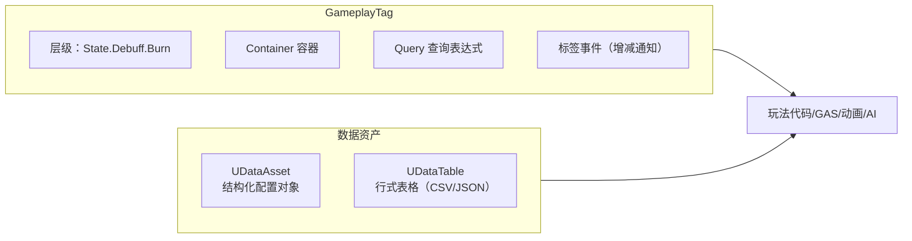

# 03 · GameplayTag 与数据资产（DataAsset / DataTable）

> 版本基准：UE 5.8.0（本机 `Engine/Build/Build.version`：CL 55116800，分支 `++UE5+Release-5.8`）。
> 源码依据：`C:\Program Files\Epic Games\UE_5.8\Engine\Source\Runtime\GameplayTags`；数据资产部分另参考 `CoreUObject`/`Engine` 运行时模块。
> 适用范围：GameplayTags、DataAsset/DataTable 的运行时使用与编辑器配置；本文是概念/使用层说明。
> 兼容性边界：UE 4.27/早期 UE5 仅作为迁移对照，不作为当前基准。
> 最后更新：2026-08-05（统一 UE5.8 版本基线）。

## 一、概述

玩法逻辑中最常见的两类"配置需求"：

1. **运行时状态与语义标记**：角色是否无敌？这个技能属于哪个流派？这个伤害是不是"火焰"？——用 **GameplayTag** 表达。它是一个带层级、可组合、可查询的轻量标记系统，是 GAS、动画、AI、UI 之间通用的"语言"。
2. **数值与结构化配置**：武器伤害表、关卡怪物配置、技能等级成长曲线——用 **DataAsset / DataTable** 表达。它们把数据从代码中剥离，让策划在编辑器里直接编辑，且天然支持软引用与资源管理。



## 二、核心概念速览

| 概念 | 类型 | 作用 | 关键点 |
| --- | --- | --- | --- |
| `FGameplayTag` | 结构体 | 单个标签（句柄式，底层为 FName + 缓存索引） | 语义：`Parent.Child.Grandchild` |
| `FGameplayTagContainer` | 结构体 | 标签集合，支持包含关系运算 | `HasTag` / `HasAll` / `HasAny` / 过滤 |
| `FGameplayTagQuery` | 结构体 | 复合查询表达式（与/或/非） | 可资产化保存 |
| `UGameplayTagsManager` | 单例 | 标签注册表与解析 | `RequestGameplayTag(FName)` |
| 原生标签 | 宏 | C++ 静态声明标签 | `UE_DECLARE/UE_DEFINE_GAMEPLAY_TAG` |
| 标签源文件 | ini | 声明标签列表 | `DefaultGameplayTags.ini` |
| 标签重定向 | ini | 标签改名兼容 | `GameplayTagRedirectors.ini` |
| `UDataAsset` | 类 | 编辑器中可创建的数据对象 | 继承后加 UPROPERTY 字段 |
| `UPrimaryDataAsset` | 类 | 带 AssetManager 主资产 ID 的 DataAsset | `GetPrimaryAssetId()` |
| `UDataTable` | 类 | 行式表格 | 行结构体继承 `FTableRowBase` |
| `FDataTableRowHandle` | 结构体 | 表 + 行名的引用 | 编辑器友好的下拉选择 |

## 三、原理详解（GameplayTag）

### 3.1 标签的层次结构

GameplayTag 用点号分隔表达层级：

```
Gameplay.Damage.Fire
Gameplay.Damage.Ice
Gameplay.Damage.Physical
State.Debuff.Burn
State.Debuff.Stun
Ability.Sprint
```

关键规则：

- **父标签隐含子标签**：拥有 `Gameplay.Damage.Fire` 即隐含拥有 `Gameplay.Damage` 与 `Gameplay`；
- 查询时可用 `bExactMatch` 控制是否只匹配精确标签；
- 标签在启动时注册进 `UGameplayTagsManager`，运行时通过 `RequestGameplayTag(FName)` 获取句柄，**不要**在运行时频繁创建新标签；
- 标签可被标记为"受限标签"（Restricted），限制其被使用的位置。

### 3.2 标签的定义方式

**方式一：ini 文件**（`Config/DefaultGameplayTags.ini`）

```ini
[/Script/GameplayTags.GameplayTagsSettings]
+GameplayTagList=(Tag="Gameplay.Damage.Fire",DevComment="火焰伤害")
+GameplayTagList=(Tag="State.Debuff.Burn",DevComment="燃烧状态")
```

**方式二：原生标签（C++，UE 5.x 推荐）**

```cpp
// MyGameplayTags.h
#pragma once
#include "NativeGameplayTags.h"

UE_DECLARE_GAMEPLAY_TAG_EXTERN(TAG_Gameplay_Damage_Fire);
UE_DECLARE_GAMEPLAY_TAG_EXTERN(TAG_State_Debuff_Burn);
```

```cpp
// MyGameplayTags.cpp
#include "MyGameplayTags.h"

UE_DEFINE_GAMEPLAY_TAG(TAG_Gameplay_Damage_Fire, "Gameplay.Damage.Fire");
UE_DEFINE_GAMEPLAY_TAG(TAG_State_Debuff_Burn, "State.Debuff.Burn");
```

原生标签在模块加载时自动注册，IDE 中可全局搜索，且与 ini 标签完全等价。

### 3.3 GameplayTagContainer 容器

容器是标签的**运行时集合**，典型操作：

```cpp
FGameplayTagContainer Tags;
Tags.AddTag(TAG_Gameplay_Damage_Fire);
Tags.AddTag(TAG_State_Debuff_Burn);

// 包含关系（非精确：父标签也算）
bool bHasFire = Tags.HasTag(TAG_Gameplay_Damage_Fire);          // true
bool bHasDamage = Tags.HasTag(FGameplayTag::RequestGameplayTag("Gameplay.Damage")); // true（隐含父标签）
bool bHasAll = Tags.HasAllExact(Tags2);                          // 精确包含全部
bool bHasAny = Tags.HasAny(FireOrIceContainer);                  // 至少包含其一

Tags.Filter(FilterContainer);        // 仅保留 FilterContainer 中的标签（含父级语义）
Tags.AppendTags(Other);              // 合并
Tags.RemoveTag(TAG_State_Debuff_Burn);
```

> GAS 中"能力能否激活"、"GE 是否免疫"的判断几乎全部基于 Container 运算，这是 Tag 最重要的用法。

### 3.4 GameplayTagQuery 查询

当条件复杂（如"拥有 A 或 B，且不拥有 C"）时用查询表达式：

```cpp
// 静态构造（C++）
FGameplayTagQuery Query = FGameplayTagQuery::MakeQuery_MatchAnyTags(RequiredAny);
FGameplayTagQuery QueryAll = FGameplayTagQuery::MakeQuery_MatchAllTags(RequiredAll);
FGameplayTagQuery QueryNone = FGameplayTagQuery::MakeQuery_MatchNoTags(Forbidden);

bool bMatch = Query.Matches(Container);            // 匹配
bool bMatchExact = Query.Matches(Container, true); // 精确匹配
```

蓝图侧 `Make Gameplay Tag Query` 节点可交互式拼装查询；查询还可作为 UPROPERTY 资产字段保存。

### 3.5 标签事件（增减通知）

监听某个标签的增减（GAS 中由 `FGameplayTagCountContainer` 维护计数）：

```cpp
// 通过 ASC 监听（GAS 环境）
AbilitySystemComponent->RegisterGameplayTagEvent(
    TAG_State_Debuff_Burn,
    EGameplayTagEventType::AnyCountChange
).AddUObject(this, &UMyComponent::OnBurnTagChanged);

// 通用标签计数（非 GAS 也可用）
FGameplayTagCountContainer TagCounts;
TagCounts.UpdateTagCount(TAG_State_Debuff_Burn, 1);
TagCounts.OnTagAdded.AddUObject(...);
TagCounts.OnTagRemoved.AddUObject(...);
```

### 3.6 标签重定向与改名

改名后旧标签会失效，用 `Config/GameplayTagRedirectors.ini` 兼容：

```ini
[/Script/GameplayTags.GameplayTagsSettings]
+GameplayTagRedirects=(OldTagName="State.Burn",NewTagName="State.Debuff.Burn")
```

## 四、原理详解（DataAsset / DataTable）

### 4.1 UDataAsset

`UDataAsset` 是"编辑器里可创建、可编辑字段的普通 UObject 资产"。用法：

```cpp
// 武器配置
UCLASS(BlueprintType)
class MYGAME_API UWeaponDataAsset : public UDataAsset
{
    GENERATED_BODY()
public:
    UPROPERTY(EditAnywhere, BlueprintReadOnly, Category = "Weapon")
    FName WeaponName;

    UPROPERTY(EditAnywhere, BlueprintReadOnly, Category = "Weapon")
    float BaseDamage = 10.f;

    UPROPERTY(EditAnywhere, BlueprintReadOnly, Category = "Weapon")
    TSubclassOf<UGameplayEffect> DamageEffectClass;

    UPROPERTY(EditAnywhere, BlueprintReadOnly, Category = "Weapon")
    TObjectPtr<USkeletalMesh> Mesh;
};
```

在内容浏览器：右键 → Miscellaneous → **Data Asset** → 选择 `UWeaponDataAsset`，即可创建并编辑实例。

### 4.2 UPrimaryDataAsset 与 AssetManager

`UPrimaryDataAsset` 在 DataAsset 基础上增加主资产 ID，可被 AssetManager 统一管理与异步加载：

```cpp
UCLASS(BlueprintType)
class MYGAME_API UHeroDataAsset : public UPrimaryDataAsset
{
    GENERATED_BODY()
public:
    UPROPERTY(EditAnywhere, BlueprintReadOnly, Category = "Hero")
    FGameplayTag HeroTag;

    UPROPERTY(EditAnywhere, BlueprintReadOnly, Category = "Hero")
    TArray<TSubclassOf<UGameplayAbility>> DefaultAbilities;

    virtual FPrimaryAssetId GetPrimaryAssetId() const override
    {
        return FPrimaryAssetId(TEXT("HeroData"), GetFName());
    }
};
```

```cpp
// 异步加载示例（AssetManager）
FPrimaryAssetId Id(TEXT("HeroData"), TEXT("Hero_Archer"));
UAssetManager::Get().LoadPrimaryAsset(Id, {}, FStreamableDelegate::CreateLambda([]()
{
    if (UHeroDataAsset* Hero = Cast<UHeroDataAsset>(
        UAssetManager::Get().GetPrimaryAssetObject(Id)))
    {
        // 使用配置
    }
}));
```

### 4.3 UDataTable

`UDataTable` 是"行式表格"，行结构体必须继承 `FTableRowBase`：

```cpp
// 怪物表行结构
USTRUCT(BlueprintType)
struct FMonsterRow : public FTableRowBase
{
    GENERATED_BODY()

    UPROPERTY(EditAnywhere, BlueprintReadOnly)
    FText DisplayName;

    UPROPERTY(EditAnywhere, BlueprintReadOnly, meta = (ClampMin = "0"))
    float MaxHealth = 100.f;

    UPROPERTY(EditAnywhere, BlueprintReadOnly)
    float MoveSpeed = 300.f;

    UPROPERTY(EditAnywhere, BlueprintReadOnly)
    TObjectPtr<UBehaviorTree> BehaviorTree;
};
```

创建与导入：

1. 内容浏览器右键 → **Miscellaneous → Data Table** → 选择行结构体 `FMonsterRow`；
2. 右键 → **Reimport** 支持从 **CSV / JSON** 导入（CSV 第一列必须为 `Name`，其余列与 UPROPERTY 字段名一致）；
3. 编辑器中直接增删行，RowName 唯一标识一行。

运行时查询：

```cpp
// C++
if (UDataTable* Table = MonsterTable.LoadSynchronous())
{
    const FMonsterRow* Row = Table->FindRow<FMonsterRow>(
        TEXT("Goblin"), TEXT("LookupMonster"));
    if (Row)
    {
        const float HP = Row->MaxHealth;
    }
}

// 蓝图
// Get Data Table Row 节点（UDataTableFunctionLibrary），或直接解引用 FDataTableRowHandle
```

**FDataTableRowHandle**（表 + 行名的组合引用）特别适合作为 UPROPERTY 字段暴露给策划，在编辑器里以下拉方式选择行，避免硬编码 RowName 字符串。

## 五、代码示例

### 5.1 定义并使用原生标签

```cpp
// 见上文 MyGameplayTags.h/.cpp；使用处：
const FGameplayTag FireTag = TAG_Gameplay_Damage_Fire;
const FGameplayTagContainer FireAndIce(FireTag, IceTag);

if (VictimASC->HasMatchingGameplayTag(FireTag))
{
    // 目标正着火：伤害加成
}
```

### 5.2 标签驱动的能力系统联动

```cpp
// 用标签判断"能否施放"
bool UMyGameplayAbility::CanActivateAbility(...) const
{
    // 拥有 State.Dead 则不可施放
    if (ActorInfo->AbilitySystemComponent->HasMatchingGameplayTag(TAG_State_Dead))
    {
        return false;
    }
    return Super::CanActivateAbility(Handle, ActorInfo, ActivationInfo);
}
```

### 5.3 DataTable 批量生成角色

```cpp
void UMyGameInstance::SpawnMonsterByRowName(const FDataTableRowHandle& Handle)
{
    if (!Handle.DataTable) return;
    const FMonsterRow* Row = Handle.DataTable->FindRow<FMonsterRow>(
        Handle.RowName, TEXT("SpawnMonster"));
    if (!Row) return;

    // 根据配置生成角色（示例略去 Spawn 细节）
    AMyMonster* Monster = ...;
    Monster->InitFromConfig(*Row);
}
```

### 5.4 蓝图侧操作要点

- 标签：Project Settings → **Gameplay Tags** 页签可查看/新增；蓝图节点 `Make Literal Gameplay Tag` / `Has Tag` / `Make Gameplay Tag Query`；
- DataAsset：创建后在任何 UPROPERTY 引用处选择；蓝图里 `Get` 引用即可读字段；
- DataTable：`Get Data Table Row` 节点；`FDataTableRowHandle` 字段直接在细节面板选行；
- 动态标签：`Gameplay Tags → Request Gameplay Tag` 节点（尽量少用，优先静态定义）。

## 六、最佳实践

1. **标签命名统一前缀**：按领域分顶层（`Gameplay.` / `State.` / `Ability.` / `UI.` / `Input.`），层级 2~4 层为宜；
2. **集中管理**：标签要么集中在 ini，要么集中在原生标签模块；禁止在业务代码里随手 `FGameplayTag::RequestGameplayTag` 造新标签；
3. **永远用对象不用字符串**：比较用 `FGameplayTag` 句柄（底层索引缓存），避免字符串比较与 FName 解析开销；
4. **状态用 Tag、数值用 Attribute**：避免用 bool 数组表达状态，Tag 容器天然支持组合与查询；
5. **DataAsset 用于"结构化单对象配置"，DataTable 用于"批量同构数据"**；需要异步加载/资产管理用 `UPrimaryDataAsset`；
6. **RowHandle 优于裸 RowName**：字段类型用 `FDataTableRowHandle`，策划改表不炸代码；
7. **CSV 编码**：中文 CSV 导入注意 UTF-8（带 BOM 亦可），列名与字段名严格一致；
8. **不要运行时改 DataAsset 实例**：资产是共享引用（CDO 语义），运行时改动影响所有引用方；需要可变数据请复制到运行对象。

## 七、常见问题 FAQ

**Q1：蓝图/运行时找不到我的标签？**
ini 标签需重启编辑器生效；原生标签需确认宏所在模块已编译并链接；检查标签名拼写（大小写敏感）。

**Q2：`RequestGameplayTag` 返回空？**
标签未注册或拼写错误。`bErrorIfNotFound` 传 true 时会在日志给出明确报错；不要在生产代码里用它动态造标签。

**Q3：标签改名后旧存档/配置失效？**
使用 `GameplayTagRedirectors.ini` 配置重定向；命名确定后尽量少改。

**Q4：DataTable 导入 CSV 失败？**
检查：第一列是否叫 `Name`；列名是否与 UPROPERTY 字段名一致；文件编码（推荐 UTF-8）；行结构体是否继承 `FTableRowBase`；是否有非蓝图兼容类型字段。

**Q5：DataAsset 修改后游戏里没变化？**
确认引用的是同一资产（检查硬引用/软引用路径）；运行时修改实例不会持久化到资产；热重载后需重新加载资产。

**Q6：如何在运行时把 Tag 集合复制给 GAS？**
`ASC->SetTagMapCount(Tag, Count)` / `UpdateTagMap`，或通过 GE 的 `GrantedTags` 在效果生效时自动添加。

## 八、关联阅读

- [01-GameplayAbilitySystem能力系统](01-GameplayAbilitySystem能力系统.md)：GAS 的激活条件、GE 免疫、状态表达全部依赖 GameplayTag。
- [02-EnhancedInput增强输入](02-EnhancedInput增强输入.md)：按键方案可用 Tag 组织（`Input.Action.Move`）。
- [04-委托事件与对象通信](04-委托事件与对象通信.md)：标签变化通过委托/回调通知 UI 与逻辑层。
- [05-蓝图与C++协作](05-蓝图与C++协作.md)：DataAsset / 行结构体暴露给蓝图的 UPROPERTY / USTRUCT 写法。
- [08-工具链与打包发布](../08-工具链与打包发布/README.md)：资产打包与热更新对 DataAsset 的影响。
