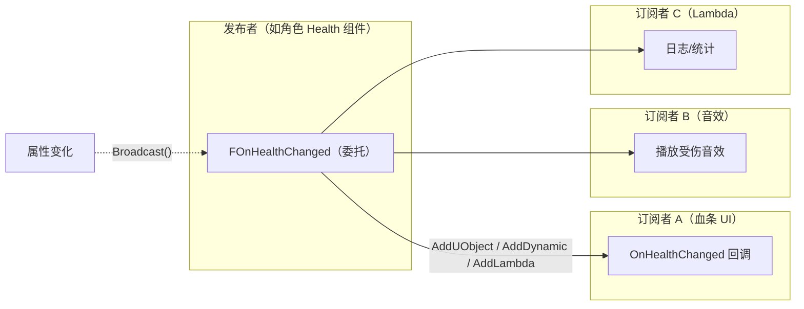
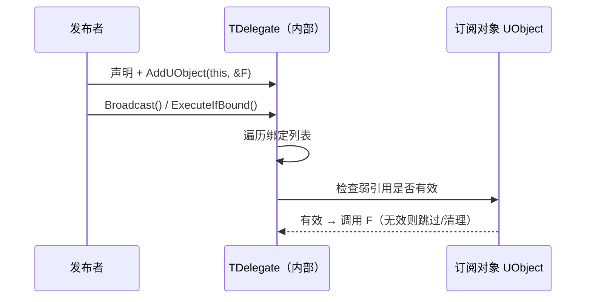

# 04 · 委托、事件与对象通信

> 面向 UE 5.x 客户端开发。本文系统讲解 UE 的委托体系：单播委托（Delegate）、多播委托（Multicast）、动态委托（Dynamic，蓝图可绑定）、事件（Event）、Lambda 绑定，以及生命周期安全与最佳实践。

## 一、概述

游戏对象之间需要通信：血条要监听生命变化、技能要监听按键、AI 要监听玩家进入范围。最直接的方式是"A 持有 B 的引用并调用 B 的函数"，但会导致**强耦合**：B 改了接口，A 就要改。

委托（Delegate）是"回调函数的安全包装"：

- **发布者**声明委托，并决定何时"广播"；
- **订阅者**把自己（或自己的函数 / Lambda）绑定到委托上；
- 广播时所有订阅者被依次调用，发布者**不需要知道订阅者是谁**。



UE 的委托体系有四种主要形态，理解它们的区别是本节核心。

## 二、核心概念速览

| 形态 | 声明宏 | 特性 | 典型用途 |
| --- | --- | --- | --- |
| 单播委托 | `DECLARE_DELEGATE[_NParams]` | 只能绑定一个回调，`Execute` 调用 | 一次性回调（如异步加载完成） |
| 多播委托 | `DECLARE_MULTICAST_DELEGATE[_NParams]` | 可绑定多个回调，`Broadcast` 全调用 | 事件广播（属性变化、死亡） |
| 动态委托 | `DECLARE_DYNAMIC[_MULTICAST]_DELEGATE` | 基于 `UFUNCTION` 反射，可序列化、蓝图可绑定 | 蓝图 Assign / C++ 广播 |
| 事件 | `DECLARE_EVENT` | 多播的封装：外部可绑定、**不可广播** | 类对外暴露"只读"事件接口 |
| 原生委托 | `TDelegate` / `TScriptDelegate` | 底层实现（模板 + 函数指针 + 弱引用检查） | 理解原理即可 |

参数数量支持：`_OneParam` 到 `_NineParams`；动态委托的参数必须是蓝图兼容类型（UObject*、原生类型、FName、FString、结构体等）。

## 三、原理详解

### 3.1 委托的本质

`TDelegate<FOnXxx>` 内部保存：

- 一个**函数对象**（成员函数指针 + 对象指针 / 静态函数指针 / Lambda）；
- 对象指针默认以**弱引用**持有（`TWeakObjectPtr`），调用时检查对象是否有效，避免悬垂调用崩溃；
- 动态委托则包装一个 `UFunction` 名（字符串），通过反射查找并调用，因此**必须指向 `UFUNCTION`**。

调用路径：



### 3.2 声明语法

```cpp
// 无参
DECLARE_DELEGATE(FMyDelegate);

// 带参数（值/const 引用）
DECLARE_DELEGATE_OneParam(FMyIntDelegate, int32, Value);
DECLARE_DELEGATE_TwoParams(FMyTwoDelegate, AActor*, Actor, float, Amount);

// 多播
DECLARE_MULTICAST_DELEGATE_OneParam(FOnHealthChanged, float, NewHealth);

// 动态（蓝图可绑定）
DECLARE_DYNAMIC_MULTICAST_DELEGATE_OneParam(FOnHealthChangedDyn, float, NewHealth);
DECLARE_DYNAMIC_DELEGATE(FOnTaskFinishedDyn);

// 事件（封装多播）
DECLARE_EVENT(AMyActor, FOnDied);
```

> 宏里的参数名（如 `Value`）在动态委托中会成为蓝图节点的引脚名，命名要清晰。

### 3.3 单播委托：Bind / Execute

```cpp
DECLARE_DELEGATE_OneParam(FOnLoadFinished, bool, bSuccess);

FOnLoadFinished OnLoadFinished;

// 绑定：普通成员函数
OnLoadFinished.BindUObject(this, &AMyActor::HandleLoad);

// 绑定：静态函数
OnLoadFinished.BindStatic(&UMyLibrary::StaticHandle);

// 绑定：Lambda
OnLoadFinished.BindLambda([this](bool bOK)
{
    UE_LOG(LogTemp, Log, TEXT("Load result: %d"), bOK);
});

// 触发
if (OnLoadFinished.IsBound())
{
    OnLoadFinished.Execute(true);   // 或 ExecuteIfBound(true)
}

// 解绑
OnLoadFinished.Unbind();
```

要点：

- `Execute`：直接调用（未绑定会断言，除非先 `IsBound`）；
- `ExecuteIfBound`：未绑定则静默跳过，最常用；
- `BindUObject`：弱引用保护，对象销毁后调用自动跳过（多播中无效绑定会被清理）；
- `BindRaw`：绑定**非 UObject** 裸指针（无自动保护，需自行保证生命周期）；
- `BindSP`：绑定共享指针（`TSharedPtr`）对象的成员函数；
- `BindWeakLambda`：Lambda 持有弱引用，对象销毁后不调用。

### 3.4 多播委托：Add / Broadcast

```cpp
// 声明（头文件，类内）
DECLARE_MULTICAST_DELEGATE_OneParam(FOnHealthChanged, float, NewHealth);

// 类内成员
FOnHealthChanged OnHealthChanged;

// 订阅
OnHealthChanged.AddUObject(HealthBarWidget, &UMyWidget::OnHealthChanged);
OnHealthChanged.AddUObject(SoundComp, &UMySoundComp::OnDamage);
OnHealthChanged.AddLambda([](float H) { /* 统计 */ });

// 广播：依次调用所有订阅者
OnHealthChanged.Broadcast(NewHealthValue);

// 取消订阅
OnHealthChanged.RemoveAll(HealthBarWidget); // 移除该对象的所有绑定
OnHealthChanged.Clear();                    // 清空全部
```

多播委托**没有返回值**（Broadcast 无返回值）；参数建议用 `const 引用` 传结构体避免拷贝。

### 3.5 动态委托：蓝图可绑定

动态多播委托最常见的用法：C++ 声明 `UPROPERTY(BlueprintAssignable)`，蓝图里直接绑定事件，C++ 里广播。

```cpp
// MyActor.h
DECLARE_DYNAMIC_MULTICAST_DELEGATE_TwoParams(FOnDamagedDyn, AActor*, DamagedActor, float, Damage);

UCLASS()
class MYGAME_API AMyActor : public AActor
{
    GENERATED_BODY()
public:
    // 蓝图细节面板可绑定（Assign），事件图可用 Event 节点
    UPROPERTY(BlueprintAssignable, Category = "Events")
    FOnDamagedDyn OnDamaged;

    UFUNCTION(BlueprintCallable, Category = "Damage")
    void ApplyDamage(float Damage);
};
```

```cpp
// MyActor.cpp
void AMyActor::ApplyDamage(float Damage)
{
    // ...扣血逻辑...
    OnDamaged.Broadcast(this, Damage); // 通知所有蓝图/ C++ 订阅者
}
```

蓝图侧：选中 Actor 后，在细节面板或事件图表中 `Assign OnDamaged`，或直接拖出 `OnDamaged` 事件节点。

C++ 侧绑定动态委托：

```cpp
OnDamaged.AddDynamic(this, &AMyActor::HandleDamaged);
// 回调必须是 UFUNCTION：
// UFUNCTION()
// void HandleDamaged(AActor* DamagedActor, float Damage);
```

动态单播委托（`DECLARE_DYNAMIC_DELEGATE`）则常用于"蓝图函数作为参数传入 C++ 函数"（如异步任务回调）。

### 3.6 事件（Event）：只读多播

`DECLARE_EVENT` 生成一个类：外部只能 `Add`（订阅），**不能 Broadcast**（广播权保留在声明类内部）——这是与多播委托的关键区别。

```cpp
// MyActor.h
DECLARE_EVENT(AMyActor, FOnDied);

UCLASS()
class MYGAME_API AMyActor : public AActor
{
    GENERATED_BODY()
public:
    // 只读接口：外部订阅
    FOnDied& OnDiedEvent() { return OnDied; }

private:
    // 私有成员：只有本类能 Broadcast
    FOnDied OnDied;

    void Die(); // 内部调用 OnDied.Broadcast();
};
```

```cpp
// 外部订阅
OtherActor->OnDiedEvent().AddUObject(this, &AMyOther::HandleDied);

// 只有 AMyActor 内部可以：
void AMyActor::Die()
{
    OnDied.Broadcast();
}
```

事件模式保证了"广播入口不可被外部滥用"，适合类对外暴露稳定事件接口。

### 3.7 Lambda 与捕获

```cpp
// 捕获 this 与局部变量
int32 ComboCount = 3;
OnKilled.AddLambda([this, ComboCount](AActor* Victim)
{
    // 注意：捕获的 this 可能已销毁！优先 BindWeakLambda 或捕获弱引用
    UE_LOG(LogTemp, Log, TEXT("Combo %d"), ComboCount);
});

// 弱引用安全的 Lambda
OnKilled.AddWeakLambda(this, [this](AActor* Victim)
{
    if (IsValid(this)) { /* 安全使用 */ }
});
```

> Lambda 捕获 `this` 时若对象可能先销毁，用 `AddWeakLambda`（多播）/ `BindWeakLambda`（单播）；临时一次性回调可用 `BindLambda`，但务必保证生命周期。

### 3.8 生命周期与线程

- 多播委托在对象销毁时不会自动解绑（除非绑定时是 UObject 弱引用），`RemoveAll(this)` 是标准清理姿势；
- 组件/Widget 的 `BeginDestroy` / `EndPlay` 中解绑外部委托；
- 默认委托**不是线程安全的**；跨线程通知请用 `FRunnable` + 队列或 `AsyncTask` 分发；
- 动态委托可被序列化（如保存到存档的延迟回调），但绑定目标必须是持久对象。

## 四、代码示例

### 4.1 健康组件（多播 + 事件混合）

```cpp
// HealthComponent.h
DECLARE_MULTICAST_DELEGATE_TwoParams(FOnHealthChanged, float, OldHealth, float, NewHealth);
DECLARE_EVENT(UMyHealthComponent, FOnDied);

UCLASS(ClassGroup = (Custom), meta = (BlueprintSpawnableComponent))
class MYGAME_API UMyHealthComponent : public UActorComponent
{
    GENERATED_BODY()
public:
    FOnHealthChanged OnHealthChanged;
    FOnDied& OnDiedEvent() { return OnDiedEventInternal; }

    UFUNCTION(BlueprintCallable, Category = "Health")
    void TakeDamage(float Amount);

private:
    float Health = 100.f;
    FOnDied OnDiedEventInternal;
};
```

```cpp
// HealthComponent.cpp
void UMyHealthComponent::TakeDamage(float Amount)
{
    const float Old = Health;
    Health = FMath::Max(0.f, Health - Amount);
    OnHealthChanged.Broadcast(Old, Health);
    if (Health <= 0.f)
    {
        OnDiedEventInternal.Broadcast();
    }
}
```

```cpp
// 订阅方示例：UI 血条
HealthComp->OnHealthChanged.AddUObject(this, &UMyHealthBarWidget::OnHealthChanged);
HealthComp->OnDiedEvent().AddUObject(this, &UMyHealthBarWidget::OnDied);

void UMyHealthBarWidget::OnHealthChanged(float Old, float New)
{
    ProgressBar->SetPercent(New / MaxHealth);
}
```

### 4.2 动态多播 + 蓝图（推荐模板）

```cpp
// 头文件
DECLARE_DYNAMIC_MULTICAST_DELEGATE_OneParam(FOnCooldownReady, float, TotalTime);

UPROPERTY(BlueprintAssignable, Category = "Ability")
FOnCooldownReady OnCooldownReady;

// 冷却结束（任意处）：
OnCooldownReady.Broadcast(CooldownDuration);
```

### 4.3 单播 + Lambda（异步回调）

```cpp
DECLARE_DELEGATE_OneParam(FOnQueryResult, const TArray<FItemData>&, Items);

void UMyInventory::QueryItems(FOnQueryResult Callback)
{
    // 模拟异步查询
    TArray<FItemData> Result = /* ... */;
    if (Callback.IsBound())
    {
        Callback.Execute(Result);
    }
}

// 调用处
Inventory->QueryItems(FOnQueryResult::CreateLambda([](const TArray<FItemData>& Items)
{
    // 处理结果
}));
```

### 4.4 蓝图侧操作要点

1. **监听 C++ 动态委托**：在蓝图事件图中使用 `Assign`（细节面板）或直接搜索委托名的事件节点；
2. **自定义事件（蓝图原生）**：Event Dispatcher 是蓝图侧的"委托"，`Bind Event to ...` 节点绑定，`Call` 节点广播；
3. **动态委托作为函数参数**：C++ 函数带动态委托参数时，蓝图节点会生成 `Event` 引脚，直接连事件图；
4. **避免每帧广播**：UI 刷新类广播应合并（如 Tick 聚合后广播一次），或由属性变化触发。

## 五、最佳实践

1. **选型顺序**：C++ 内部通信用普通多播（快、无反射开销）；需要蓝图绑定用动态多播；对外只读接口用事件；一次性回调用单播。
2. **解绑成对**：绑定与解绑出现在同一生命周期（`BeginPlay` 绑 / `EndPlay` 解，`OnRegister` 绑 / `OnUnregister` 解）。
3. **弱引用优先**：跨对象订阅默认用 `AddUObject`（弱引用安全）；裸指针用 `BindRaw` 时必须手动管理。
4. **参数传值/const 引用**：结构体参数用 `const FStruct&`，避免广播时拷贝开销；多播参数避免可变引用。
5. **广播顺序不依赖**：多播按绑定顺序调用，业务逻辑不要依赖特定顺序；需要顺序保证时用显式接口调用。
6. **命名规范**：委托类型 `FOnXxxChanged`，事件访问器 `OnXxxEvent()`，动态委托 `FOnXxxDyn`（可选后缀）。
7. **不要跨线程直接 Broadcast**：必要时用 `AsyncTask(ENamedThreads::GameThread, ...)` 投递到游戏线程。
8. **性能**：广播本身很快，但订阅者多且每帧广播时要评估开销；用标签/脏标记合并刷新。

## 六、常见问题 FAQ

**Q1：`AddDynamic` 报"does not have a UFUNCTION"?**
回调必须是 `UFUNCTION()` 成员函数，且签名与动态委托完全一致（包括参数类型）；不能绑定 Lambda / 普通函数。

**Q2：广播后回调没执行？**
检查：是否 `IsBound` / 绑定列表是否为空；对象是否已被 GC（弱引用跳过）；绑定与广播是否在同一个委托实例（委托是值类型，复制会失去绑定——类成员请用引用或指针传递）；动态委托参数类型是否不匹配。

**Q3：事件（DECLARE_EVENT）外部能 Broadcast 吗？**
不能——`Broadcast` 只在声明类内部可用；若把事件成员设为 public 则外部也可调用（但破坏封装），标准做法是私有成员 + `OnXxxEvent()` 访问器。

**Q4：对象销毁后委托还调用（崩溃）？**
`AddUObject`/`AddWeakLambda` 有弱引用保护；`BindRaw`/`BindLambda`（捕获裸 this）没有。清理习惯：销毁前 `RemoveAll(this)` 或 `Unbind()`。

**Q5：蓝图 Event Dispatcher 与 C++ 动态委托的区别？**
Event Dispatcher 是蓝图资产/蓝图类的本地机制；C++ 动态委托（`BlueprintAssignable`）可以在 C++ 中定义、蓝图中绑定，跨语言通信更自然，推荐在 C++ 基类中预定义事件。

**Q6：委托参数能传指针/引用吗？**
原生委托可以；**动态委托**只支持蓝图兼容类型（UObject*、原生值类型、FName/FString/FText、USTRUCT(BlueprintType) 结构体），不支持裸指针与引用。

## 七、关联阅读

- [01-GameplayAbilitySystem能力系统](01-GameplayAbilitySystem能力系统.md)：GAS 的属性变化委托、能力结束委托、AbilityTask 回调。
- [03-GameplayTag与数据资产](03-GameplayTag与数据资产.md)：标签增减事件（`OnTagAdded` / `OnTagRemoved`）即委托应用。
- [05-蓝图与C++协作](05-蓝图与C++协作.md)：`BlueprintAssignable` 与动态委托是蓝图/C++ 协作的关键桥梁。
- [07-UI与性能优化](../07-UI与性能优化/README.md)：UI 通过委托刷新数据的模式与性能注意点。
- [06-网络同步](../06-网络同步/README.md)：RPC 与委托的分工——跨机器用 RPC，同机器解耦用委托。
