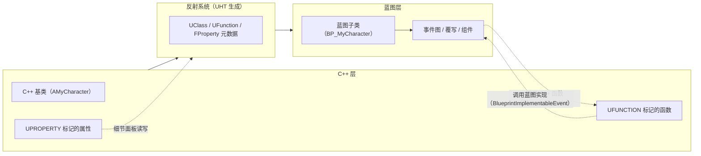
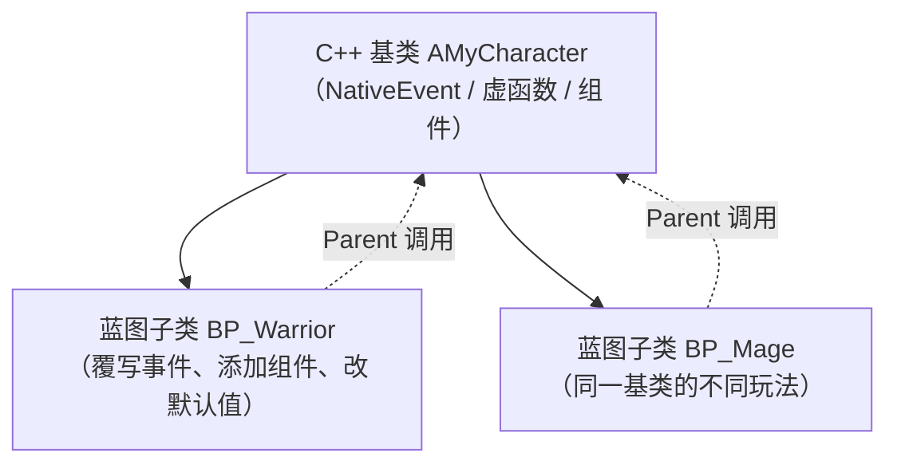

# 05 · 蓝图与 C++ 协作

> 版本基准：UE 5.8.0（本机 `Engine/Build/Build.version`：CL 55116800，分支 `++UE5+Release-5.8`）。
> 源码依据：`C:\Program Files\Epic Games\UE_5.8\Engine\Source\Runtime\CoreUObject`、`Engine\Source\Runtime\Engine`；以本机 5.8 源码为准。
> 适用范围：UHT 反射标记、蓝图节点/事件暴露和运行时 C++/蓝图协作；本文不是 UHT 源码剖析。
> 兼容性边界：UE 4.27/早期 UE5 仅作为迁移对照，不作为当前基准。
> 最后更新：2026-08-05（统一 UE5.8 版本基线）。

## 一、概述

UE 的双栈开发模型：

- **C++**：性能关键路径、复杂算法、引擎集成、网络与数据层——追求健壮与可控；
- **蓝图**：玩法编排、事件流、UI 交互、数值调参——追求迭代速度与设计友好。

两者通过 **UHT（Unreal Header Tool）生成的反射数据**互操作：`UFUNCTION` / `UPROPERTY` / `UCLASS` / `USTRUCT` / `UENUM` 宏把成员注册进运行时类型系统，编辑器据此生成蓝图节点、细节面板与事件接口。



## 二、核心概念速览

| 机制 | 关键字 | 方向 | 说明 |
| --- | --- | --- | --- |
| 蓝图实现事件 | `UFUNCTION(BlueprintImplementableEvent)` | C++ 调用 → 蓝图实现 | C++ 只声明（无实现），蓝图"Implement" |
| 蓝图原生事件 | `UFUNCTION(BlueprintNativeEvent)` | C++ 默认实现 + 蓝图可覆写 | C++ 实现 `FuncName_Implementation` |
| 蓝图可调用 | `UFUNCTION(BlueprintCallable)` | 蓝图调用 → C++ 执行 | 蓝图节点直接调用 C++ 函数 |
| 纯函数 | `UFUNCTION(BlueprintPure)` | 蓝图调用 → C++ 计算 | 无执行引脚，适合 Getter/计算 |
| 属性暴露 | `UPROPERTY(BlueprintReadWrite / EditAnywhere ...)` | 双向 | 细节面板编辑 + 蓝图读写 |
| 委托绑定 | `UPROPERTY(BlueprintAssignable)` | 蓝图绑定 → C++ 广播 | 见委托篇 |
| 接口 | `UINTERFACE` + `UFUNCTION` | 双向 | 多态调用，蓝图可实现 |
| 类暴露 | `UCLASS(Blueprintable / BlueprintType)` | 双向 | 允许蓝图继承/作为变量类型 |
| 结构体/枚举 | `USTRUCT(BlueprintType)` / `UENUM(BlueprintType)` | 双向 | 蓝图变量与节点引脚 |

## 三、原理详解

### 3.1 UFunction 与说明符

`UFUNCTION` 把函数注册为反射函数，编辑器才能为其生成蓝图节点。常用说明符：

| 说明符 | 作用 |
| --- | --- |
| `BlueprintCallable` | 蓝图可调用；可加 `BlueprintPure` 变为无副作用计算 |
| `BlueprintImplementableEvent` | C++ 无实现，蓝图实现 |
| `BlueprintNativeEvent` | C++ 提供默认实现（`_Implementation`），蓝图可覆写 |
| `BlueprintAuthorityOnly` | 仅服务器调用（蓝图节点限制） |
| `BlueprintCosmetic` | 仅客户端/表现层调用 |
| `BlueprintGetter` / `BlueprintSetter` | 自定义属性访问器（配合 UPROPERTY） |
| `CallInEditor` | 编辑器细节面板按钮 |
| `meta=(DisplayName, Category, Tooltip, DefaultToSelf, AdvancedDisplay, AutoCreateRefTerm, ExpandEnumAsExecs)` | 节点显示与参数行为 |

函数参数要求：参数类型必须蓝图兼容（原生类型、FName/FString/FText、`UObject*`、`USTRUCT(BlueprintType)`）；结构体建议 `const FStruct&`；输出参数用引用 `FStruct& Out` 并自动生成输出引脚。

### 3.2 BlueprintImplementableEvent：C++ 触发、蓝图实现

模式：C++ 负责"何时调用"（时机、条件），蓝图负责"做什么"（表现与玩法细节）。

```cpp
// MyCharacter.h
UCLASS()
class MYGAME_API AMyCharacter : public ACharacter
{
    GENERATED_BODY()
public:
    // C++ 只声明，不实现；蓝图里 Implement 该事件
    UFUNCTION(BlueprintImplementableEvent, Category = "Combat")
    void OnDamaged(float Damage, AActor* Instigator);

    // C++ 在受伤时调用
    void ReceiveDamage(float Damage, AActor* Instigator);
};
```

```cpp
// MyCharacter.cpp
void AMyCharacter::ReceiveDamage(float Damage, AActor* Instigator)
{
    Health -= Damage;
    OnDamaged(Damage, Instigator); // 直接以普通函数方式调用
}
```

蓝图侧：在蓝图事件图中右键 → 搜索 `OnDamaged` → 添加 **Event OnDamaged** 节点，即可编写受伤表现（飘字、闪红、音效）。C++ 中调用时若无蓝图覆写则**静默跳过**。

### 3.3 BlueprintNativeEvent：C++ 默认实现 + 蓝图覆写

适合"C++ 提供默认行为，蓝图按需覆写"的场景（如不同怪物死亡表现）。

```cpp
// 头文件
UFUNCTION(BlueprintNativeEvent, Category = "Combat")
void OnDeath();

// 源文件：默认实现函数名固定为 OnDeath_Implementation
void AMyCharacter::OnDeath_Implementation()
{
    // 默认：播放死亡动画、禁用输入
    PlayAnimMontage(DeathMontage);
    DisableInput(nullptr);
}
```

蓝图侧：事件图中 **Override → OnDeath** 创建覆写节点；若需要继续执行 C++ 默认逻辑，在覆写内调用 **Parent: OnDeath** 节点（即 `Super::`）。

> 注意：`BlueprintNativeEvent` 的 C++ 实现函数名必须是 `函数名_Implementation`，且函数不能是静态函数。

### 3.4 BlueprintCallable / BlueprintPure：蓝图调用 C++

```cpp
// 可调用（有执行引脚）
UFUNCTION(BlueprintCallable, Category = "Inventory")
bool AddItem(FName ItemId, int32 Count);

// 纯函数（无执行引脚，适合查询）
UFUNCTION(BlueprintPure, Category = "Inventory")
int32 GetItemCount(FName ItemId) const;
```

蓝图节点行为：

- `BlueprintCallable`：生成"函数调用"节点，有执行输入/输出引脚，可修改状态；
- `BlueprintPure`：生成"纯函数"节点（连线直接输出值），可挂在表达式中间，`const` 函数更符合语义；
- 若函数带 `UObject*` 参数，可用 `meta=(DefaultToSelf = "参数名")` 让蓝图节点默认连入 Self。

### 3.5 UPROPERTY：属性暴露

```cpp
UCLASS()
class MYGAME_API AMyCharacter : public ACharacter
{
    GENERATED_BODY()
public:
    // 细节面板可编辑 + 蓝图可读写（实例）
    UPROPERTY(EditAnywhere, BlueprintReadWrite, Category = "Combat")
    float BaseDamage = 20.f;

    // 仅类默认值可编辑（蓝图子类默认值面板），运行不可改
    UPROPERTY(EditDefaultsOnly, BlueprintReadOnly, Category = "Combat")
    TSubclassOf<UGameplayEffect> HitEffectClass;

    // 只读：运行时可见（如调试信息）
    UPROPERTY(VisibleAnywhere, BlueprintReadOnly, Category = "Combat")
    int32 KillCount = 0;

    // 私有属性暴露给蓝图（配合 meta）
    UPROPERTY(EditAnywhere, BlueprintReadWrite, Category = "Combat",
        meta = (AllowPrivateAccess = "true"))
    float MoveSpeedScale = 1.f;
};
```

常用说明符组合：

| 说明符 | 含义 |
| --- | --- |
| `EditAnywhere` | 实例与类默认值都可编辑 |
| `EditDefaultsOnly` | 仅类默认值（蓝图默认值面板）可编辑 |
| `EditInstanceOnly` | 仅关卡中实例可编辑 |
| `VisibleAnywhere` / `VisibleDefaultsOnly` | 可见不可编辑 |
| `BlueprintReadWrite` / `BlueprintReadOnly` | 蓝图读写权限 |
| `BlueprintGetter` / `BlueprintSetter` | 自定义 getter/setter 函数 |
| `meta=(Category, ClampMin, ClampMax, Tooltip, AllowPrivateAccess)` | 面板分组与约束 |

### 3.6 类、结构体、枚举暴露

```cpp
// 类：允许蓝图继承 / 作为变量类型
UCLASS(Blueprintable, BlueprintType)
class MYGAME_API UMyItemDefinition : public UObject { ... };

// 结构体
USTRUCT(BlueprintType)
struct FItemInfo
{
    GENERATED_BODY()

    UPROPERTY(EditAnywhere, BlueprintReadWrite)
    FName ItemId;

    UPROPERTY(EditAnywhere, BlueprintReadWrite)
    int32 MaxStack = 99;
};

// 枚举
UENUM(BlueprintType)
enum class EItemRarity : uint8
{
    Common,
    Rare,
    Epic
};

// 位掩码枚举（蓝图支持 Bitmask 引脚）
UENUM(BlueprintType, meta = (Bitflags))
enum class EItemFlags : uint8
{
    None = 0,
    CanDrop = 1,
    CanTrade = 2
};
ENUM_CLASS_FLAGS(EItemFlags);
```

### 3.7 继承与覆写



规则要点：

- 蓝图只能继承 **Blueprintable** 的 C++ 类；`BlueprintNativeEvent` / `BlueprintImplementableEvent` 是蓝图的主要覆写点；
- C++ 的**普通虚函数不能被蓝图覆写**（蓝图无法覆写 `virtual` 函数），需要"蓝图可覆写"请用上述事件机制；
- 蓝图子类可以：覆写事件、添加组件、修改类默认值（属性值、材质、网格体）、调用 `Parent`；
- C++ 构造的组件（`CreateDefaultSubobject`）在蓝图子类中可见并可改属性；
- `BlueprintImplementableEvent` 在 C++ 中调用是"直接函数调用"，无蓝图实现时零开销跳过。

### 3.8 C++ 调用蓝图定义的函数

蓝图子类中**新定义**的函数（非继承自 C++ 声明）无法被 C++ 直接静态调用。三种解决方案：

1. **接口**（推荐）：C++ 定义接口，蓝图实现，C++ 通过接口调用；
2. **C++ 预声明事件**：在基类声明 `BlueprintImplementableEvent`，蓝图实现，C++ 调用基类函数；
3. **低层反射调用**：`ProcessEvent` / `CallFunctionByNameWithArguments`（不推荐，无编译期检查）。

```cpp
// 接口定义
UINTERFACE(Blueprintable, BlueprintType)
class UMyInteractable : public UInterface
{
    GENERATED_BODY()
};

class IMyInteractable
{
    GENERATED_BODY()
public:
    UFUNCTION(BlueprintNativeEvent, BlueprintCallable, Category = "Interaction")
    void Interact(APawn* Interactor);
};

// C++ 调用（对象可以是 C++ 或蓝图实现者）
if (IMyInteractable* Interactable = Cast<IMyInteractable>(Target))
{
    IMyInteractable::Execute_Interact(Target, this);
}
```

蓝图侧：类设置 → **Interfaces → Add → MyInteractable**，实现 `Interact` 事件。

## 四、代码示例

### 4.1 典型协作模板：C++ 逻辑 + 蓝图表现

```cpp
// 头文件
UCLASS()
class MYGAME_API AMyCharacter : public ACharacter
{
    GENERATED_BODY()
public:
    // —— 蓝图可调用（C++ 服务）——
    UFUNCTION(BlueprintCallable, Category = "Combat")
    void ApplyDamage(float Amount);

    // —— 蓝图实现（表现层）——
    UFUNCTION(BlueprintImplementableEvent, Category = "Combat")
    void OnHitReact(FVector HitDirection);

    UFUNCTION(BlueprintImplementableEvent, Category = "Combat")
    void OnDeath();

    // —— 蓝图可覆写（带 C++ 默认实现）——
    UFUNCTION(BlueprintNativeEvent, Category = "Combat")
    float ComputeFinalDamage(float Base);

    // —— 属性 ——
    UPROPERTY(EditAnywhere, BlueprintReadWrite, Category = "Combat")
    float MaxHealth = 100.f;

    UPROPERTY(VisibleAnywhere, BlueprintReadOnly, Category = "Combat")
    float CurrentHealth = 100.f;
};
```

```cpp
// 源文件
void AMyCharacter::ApplyDamage(float Amount)
{
    const float Final = ComputeFinalDamage(Amount); // 蓝图可覆写
    CurrentHealth = FMath::Max(0.f, CurrentHealth - Final);

    OnHitReact(GetVelocity().GetSafeNormal() * -1.f); // 蓝图实现：受击表现

    if (CurrentHealth <= 0.f)
    {
        OnDeath(); // 蓝图实现：死亡表现
    }
}

float AMyCharacter::ComputeFinalDamage_Implementation(float Base)
{
    return Base * DamageReduction; // 默认实现
}
```

### 4.2 Getter / Setter 暴露

```cpp
// 私有属性 + 自定义访问器
UPROPERTY(EditAnywhere, BlueprintReadOnly, Category = "Stats",
    meta = (AllowPrivateAccess = "true"))
float Stamina = 100.f;

UFUNCTION(BlueprintGetter, Category = "Stats")
float GetStamina() const { return Stamina; }

UFUNCTION(BlueprintSetter, Category = "Stats")
void SetStamina(float NewValue)
{
    Stamina = FMath::Clamp(NewValue, 0.f, 100.f);
}
```

### 4.3 蓝图侧操作步骤速查

1. **覆写事件**：蓝图事件图空白处右键 → `Override` 菜单（或类默认值 → Overrides）；
2. **调用 C++ 函数**：右键搜索函数名（带 `BlueprintCallable` 的才会出现）；
3. **Implement 事件**：右键 → `Add Event → OnXxx`（`BlueprintImplementableEvent` 自动出现在该列表）；
4. **Parent 调用**：覆写节点内右键 → `Add call to parent function`；
5. **修改默认值**：蓝图类默认值面板，按 Category 分组编辑 UPROPERTY；
6. **接口**：Class Settings → Interfaces → Add。

## 五、最佳实践

1. **分工原则**：C++ 管"逻辑正确性"（数值、状态、网络），蓝图管"表现与编排"（时序、反馈、UI）；不要让蓝图承载重逻辑（热更新/性能/调试都吃亏）。
2. **事件即契约**：用 `BlueprintImplementableEvent` 把"扩展点"显式声明在基类，蓝图作者一看就知道哪里可以覆写。
3. **默认实现兜底**：`BlueprintNativeEvent` 的 C++ 默认实现保证"蓝图什么都不写也能跑"。
4. **纯函数语义**：查询类函数加 `BlueprintPure` 与 `const`，让蓝图连线更简洁。
5. **属性暴露最小化**：只暴露需要暴露的属性；`EditDefaultsOnly + BlueprintReadOnly` 是配置类字段的默认首选。
6. **避免在 Tick 中跨蓝图调用**：高频调用尽量下沉到 C++；蓝图事件每帧广播是大坑。
7. **结构体/枚举尽量 BlueprintType**：让参数、变量、引脚都有类型信息，减少裸 FName 字符串。
8. **命名与分类**：`Category` 统一（如 `Combat` / `Movement` / `UI`），蓝图面板里才不混乱。
9. **接口优先于多态覆写**：跨类协作（交互、可拾取、可对话）用接口，避免强制继承同一基类。
10. **版本管理**：C++ 签名变更会影响已实现该事件的蓝图（通常表现为编译/加载警告），发布前做一次蓝图编译检查。

## 六、常见问题 FAQ

**Q1：蓝图里找不到我的函数/属性？**
检查：是否加了 `UFUNCTION` / `UPROPERTY` 宏；是否在 `UCLASS()`（而非普通类）中；说明符是否包含 `BlueprintCallable` / `BlueprintReadWrite`；C++ 是否已编译成功（热重载失败会导致反射信息缺失）；`Category` 是否被折叠。

**Q2：`BlueprintNativeEvent` 编译报错？**
必须提供 `函数名_Implementation` 的 C++ 实现；函数不能为 static；声明与实现签名必须一致。

**Q3：蓝图覆写后想调用 C++ 默认实现？**
在覆写节点中右键 → `Add call to parent function`（即调用 `_Implementation`）。

**Q4：C++ 里怎么调用蓝图自定义函数？**
蓝图自定义函数对 C++ 不可见；用接口（推荐）、基类预声明事件，或（不推荐）`ProcessEvent`。反过来，C++ 函数只要 `BlueprintCallable` 蓝图就能调用。

**Q5：属性在细节面板里不能编辑？**
确认说明符包含 `EditAnywhere` / `EditDefaultsOnly` 之一；`Visible*` 系列只读；检查 `Category` 是否与其他冲突；结构体成员需要结构体本身 `BlueprintType`（部分场景）。

**Q6：蓝图子类无法选择/无法继承我的 C++ 类？**
类需 `UCLASS(Blueprintable)`；Actor 类在"基于该类创建蓝图"时可见；若类不是 `BlueprintType` 也不能作为蓝图变量类型。

**Q7：改 C++ 后蓝图报"函数签名不匹配"？**
删除蓝图中的旧覆写节点后重新实现；或确认参数类型变化是否已传播（关闭并重开编辑器/重编译蓝图）。

**Q8：热重载（Live Coding）后蓝图状态异常？**
Live Coding 后建议执行一次 `Compile Blueprints`；反射结构大改时重启编辑器更稳妥。

## 七、关联阅读

- [04-委托事件与对象通信](04-委托事件与对象通信.md)：`BlueprintAssignable` 动态委托是蓝图监听 C++ 事件的主要通道。
- [01-GameplayAbilitySystem能力系统](01-GameplayAbilitySystem能力系统.md)：GAS 资产大量依赖蓝图子类与 `BlueprintNativeEvent` 覆写。
- [03-GameplayTag与数据资产](03-GameplayTag与数据资产.md)：DataAsset / 行结构体通过 UPROPERTY / USTRUCT 暴露给蓝图。
- [01-引擎基础](../01-引擎基础/README.md)：UObject 反射系统的底层机制（UHT、UClass、FProperty）。
- [08-工具链与打包发布](../08-工具链与打包发布/README.md)：C++ 构建、Live Coding 与蓝图热更新。
