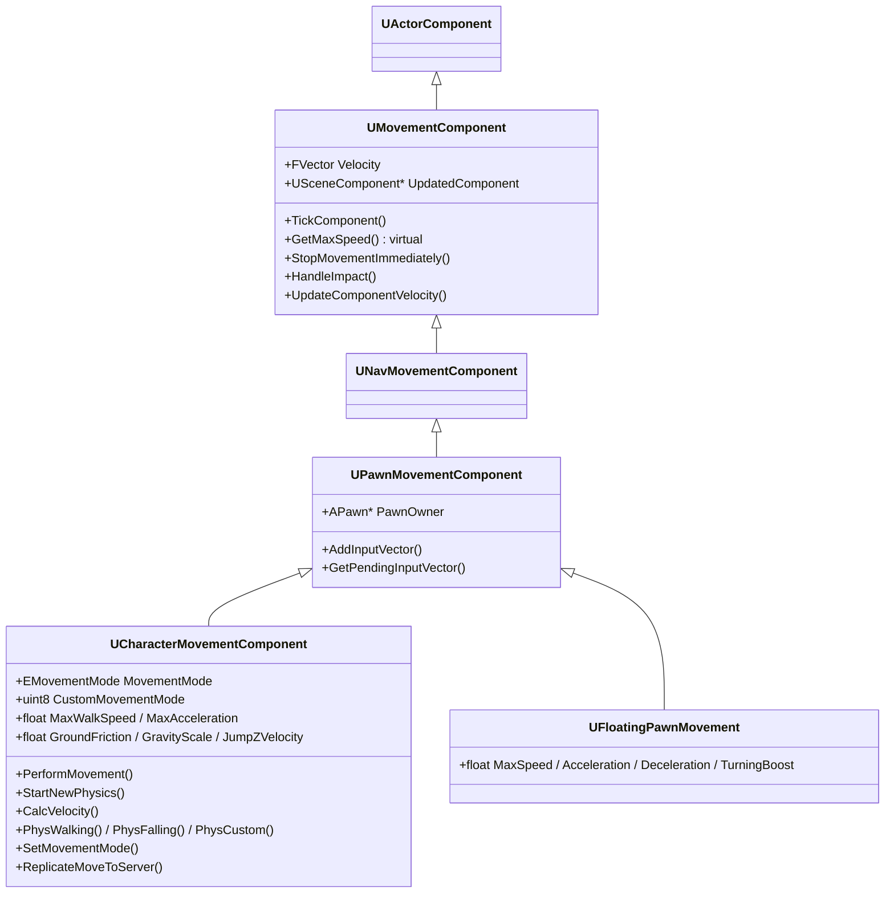
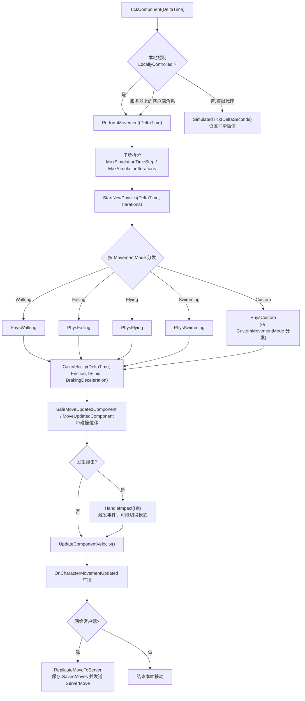
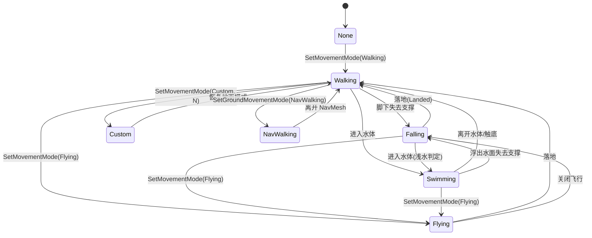
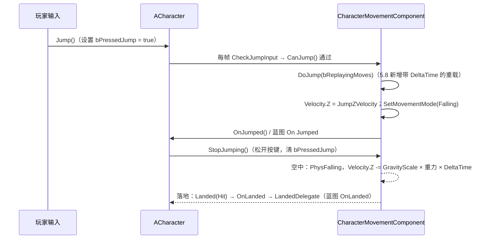
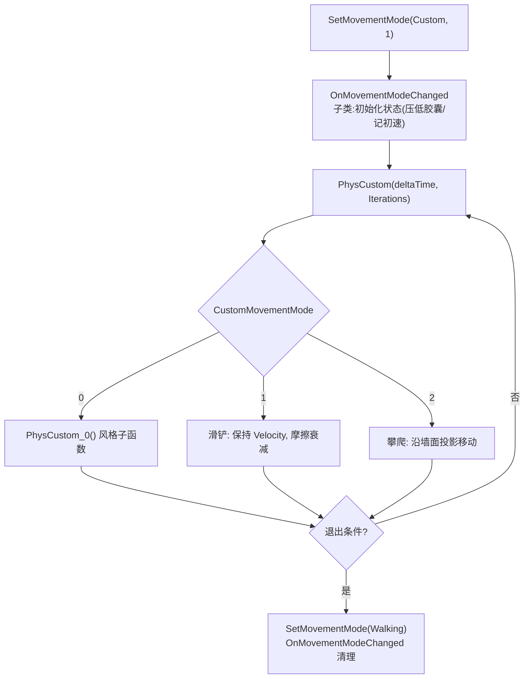
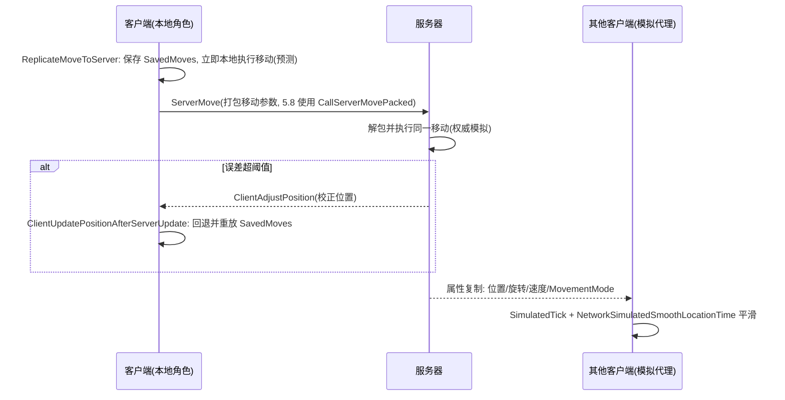

# 06 · 角色移动系统（UCharacterMovementComponent）

> 面向 UE 5.x 客户端开发（API 已对照 UE 5.8 引擎源码核对，涉及版本差异处单独标注）。本文详解角色移动的核心组件 `UCharacterMovementComponent`（下文简称 CMC）：移动模式（Walking / Falling / Flying / Swimming / Custom）、速度与加速度/减速度/摩擦模型、跳跃与重力、Custom 移动模式的扩展方式、CMC 子类化与蓝图覆写，以及移动在多人网络下的视角（客户端预测 / 服务器校正），并交叉指向「06-网络同步 · 03-客户端预测与延迟补偿」。

## 一、概述

在 UE 中，"角色（Character）"并不是一个会自己动起来的 Actor：真正负责移动的是挂载在它身上的 **移动组件（Movement Component）**。`ACharacter` 在构造函数中默认创建了一个 `UCharacterMovementComponent`（属性名 `CharacterMovement`），并配套创建了碰撞用的 `UCapsuleComponent`（`CapsuleComponent`）与表现用的 `USkeletalMeshComponent`（`Mesh`）。三者协同：

- **CapsuleComponent**：提供胶囊体碰撞，是移动组件"推着走"的那个碰撞体（CMC 中的 `UpdatedComponent`）；
- **CharacterMovementComponent**：每帧计算速度、处理碰撞、响应输入加速度、切换移动模式、处理网络移动复制的核心；
- **Mesh**：只负责渲染与动画表现，移动组件不会直接驱动骨骼，动画蓝图通过速度/加速度状态驱动动画。

CMC 把"移动"抽象成一套**速度（Velocity）+ 移动模式（MovementMode）**的状态机：输入产生加速度 → 加速度按当前模式与摩擦/制动模型修正为速度 → 速度驱动 `UpdatedComponent` 做带碰撞的移动（swept move）→ 撞击/落地/离开地面等事件改变移动模式，进入下一轮循环。

之所以需要这么一套复杂体系，而不是像 `UFloatingPawnMovement` 那样"直接给速度"：

1. **角色移动要"感觉对"**：加速、减速、空气控制、坡度、台阶、摩擦这些手感参数必须可调、可分模式；
2. **要处理大量物理交互**：地面判定、斜坡滑动、墙体阻挡、落水判定、与移动平台（base）的相对运动；
3. **要能扩展**：冲刺、滑铲、爬墙、游泳、飞行等玩法都是基于移动模式或 `Custom` 模式扩展出来的；
4. **要在网络下保持一致**：同一套移动逻辑需要在服务器与客户端上运行并互相校验（客户端预测 + 服务器校正）。

因此，学习 CMC 的关键不是记住每个参数，而是理解：**输入 → 加速度 → 速度 → 位移 → 碰撞 → 模式切换**这条主链，以及每个环节上"哪些参数生效、哪些虚函数可覆写、哪些事件可监听"。

> 提示：`UFloatingPawnMovement`（`FloatingPawnMovement.h`）是 `UPawnMovementComponent` 的极简实现，只有 `MaxSpeed / Acceleration / Deceleration / TurningBoost` 四个核心参数，不做重力、摩擦与碰撞解析，适合非角色类 Pawn（如无人机、幽灵相机载体）的简单飞行移动；它也是理解 CMC "多做了什么"的最佳对照物。

## 二、核心概念速览

| 概念 | 类 / 类型 | 作用 | 关键点 |
| --- | --- | --- | --- |
| 移动模式 | `EMovementMode`（EngineTypes.h） | 定义角色当前处于哪种运动状态 | `MOVE_None / Walking / NavWalking / Falling / Swimming / Flying / Custom` |
| 自定义子模式 | `uint8 CustomMovementMode` | 在 `MOVE_Custom` 下细分玩法状态 | 0~255，由 `SetMovementMode(MOVE_Custom, N)` 指定 |
| 移动组件 | `UCharacterMovementComponent` | 每帧计算速度、执行带碰撞位移、维护模式 | 继承自 `UPawnMovementComponent`，同时实现 `IRVOAvoidanceInterface` 与 `INetworkPredictionInterface` |
| 角色 | `ACharacter` | 移动组件的宿主 | `GetCharacterMovement<T>()` 获取；`CapsuleComponent / Mesh` 为默认子对象 |
| 速度 | `FVector Velocity`（基类 `UMovementComponent`） | 当前线速度，位移的直接来源 | 每帧由 `CalcVelocity` 修正，网络校正也作用于它 |
| 加速度 | `FVector Acceleration` | 本帧输入产生的加速度向量 | 由 Pawn 的输入逻辑（`AddMovementInput`）产生，按 `MaxAcceleration` 截断 |
| 最大速度 | `MaxWalkSpeed / MaxWalkSpeedCrouched / MaxFlySpeed / MaxSwimSpeed` | 各模式下的速度上限 | 统一由虚函数 `GetMaxSpeed()` 查询，子类可覆写做动态限速 |
| 加速度上限 | `MaxAcceleration` | 加速度向量长度上限 | 默认 2048，决定"起步/变向"手感 |
| 地面摩擦 | `GroundFriction` | 行走时速度与地面的摩擦系数 | 与 `MaxAcceleration` 共同决定巡航手感 |
| 制动减速度 | `BrakingDecelerationWalking / Falling / Swimming / Flying` | 无输入时速度衰减速率 | 行走默认 2048；下落默认 0（空中几乎没有制动） |
| 分离制动 | `bUseSeparateBrakingFriction / BrakingFriction / BrakingFrictionFactor` | 是否用独立的制动摩擦 | 关闭时制动使用 `GroundFriction × BrakingFrictionFactor` |
| 重力 | `GravityScale` | 重力缩放系数（1 = 正常） | 实际重力还受 PhysicsVolume 影响，CMC 不做真实物理积分 |
| 跳跃初速 | `JumpZVelocity` | 跳跃时赋予的 Z 轴初速度 | 与重力共同决定跳跃高度 |
| 空气控制 | `AirControl / AirControlBoostMultiplier / AirControlBoostVelocityThreshold` | 空中转向/加速的控制力 | 默认 0.05，低空低速时有 boost |
| 转身 | `RotationRate / bOrientRotationToMovement / bUseControllerDesiredRotation` | 角色朝向的旋转策略 | 与 Pawn 的 `bUseControllerRotationYaw` 配合使用 |
| 状态查询 | `IsWalking / IsFalling / IsSwimming / IsFlying / IsMovingOnGround / IsCrouching / IsCustomMovementMode` | 蓝图/C++ 查询当前模式 | 注意 `IsWalking() == IsMovingOnGround()` |
| 模式切换 | `SetMovementMode / OnMovementModeChanged` | 切换模式并触发回调 | C++ 覆写点；蓝图用 `K2_OnMovementModeChanged` 事件 |
| 落地事件 | `Landed / OnLanded / LandedDelegate`（`FLandedSignature`） | 落地通知 | 蓝图 `OnLanded` 事件节点 |
| 移动更新事件 | `OnCharacterMovementUpdated`（`FCharacterMovementUpdatedSignature`） | 每次移动更新后广播 | 参数：DeltaSeconds / OldLocation / OldVelocity |
| 网络移动 | `ReplicateMoveToServer / ServerMove / ClientAdjustPosition / ClientUpdatePositionAfterServerUpdate` | 客户端预测与服务器校正 | 详见「06-网络同步 · 03-客户端预测与延迟补偿」 |
| 简易移动 | `UFloatingPawnMovement` | 无重力/无碰撞解析的简单飞行 | 只有 MaxSpeed / Acceleration / Deceleration / TurningBoost |

## 三、原理详解

### 3.1 类层次与职责划分



职责要点：

- `UMovementComponent`（MovementComponent.h）定义了移动组件的抽象：持有 `Velocity` 与 `UpdatedComponent`（被移动的 SceneComponent），提供 `TickComponent`、`GetMaxSpeed()`、`StopMovementImmediately()`、`HandleImpact()`、`UpdateComponentVelocity()` 等基础接口。`UpdatedComponent` 默认取拥有者 Actor 的根组件，可通过 `SetUpdatedComponent()` 指定其他组件。
- `UPawnMovementComponent` 增加了 `PawnOwner` 与输入向量（`AddInputVector` / `ConsumeInputVector`）机制，把"玩家输入 → 移动意图"引入移动组件。
- `UCharacterMovementComponent` 是完整的角色移动实现：模式状态机、分物理函数、摩擦/制动模型、跳跃、Crouch、RootMotion 支持、网络移动复制（实现 `INetworkPredictionInterface`）与避障（`IRVOAvoidanceInterface`）。
- `UFloatingPawnMovement` 是"够用即可"的轻量实现，直接 `Velocity += InputVector * Acceleration`，不处理地面与碰撞解析。

> 源码位置（UE 5.8）：`Runtime/Engine/Classes/GameFramework/CharacterMovementComponent.h`、`Character.h`、`MovementComponent.h`、`FloatingPawnMovement.h`；`EMovementMode` 定义于 `Runtime/Engine/Classes/Engine/EngineTypes.h`。

### 3.2 一帧移动的完整流程



关键理解：

1. **子步（Sub-step）**：CMC 会把一帧的 `DeltaTime` 拆成不超过 `MaxSimulationTimeStep`（常见默认 0.05s）的小步、最多 `MaxSimulationIterations`（常见默认 8）次迭代执行物理，避免高速运动穿模、保证低帧率下的稳定性。
2. **物理函数（Phys\*）**：每种移动模式对应一个 `PhysXxx(deltaTime, Iterations)` 虚函数（`PhysWalking / PhysFalling / PhysFlying / PhysSwimming / PhysCustom`），它们是"该模式下怎么算速度、怎么移动"的实现体。
3. **CalcVelocity**：所有模式的公共速度求解器——输入加速度、摩擦、制动减速度在这里被整合成最终 `Velocity`，子类覆写它即可"从根上"改变手感。
4. **位移与事件**：`SafeMoveUpdatedComponent` 完成带扫掠的碰撞移动；撞击走 `HandleImpact`；移动完成后广播 `OnCharacterMovementUpdated`，本地网络客户端还会把本次移动打包发给服务器。

> 蓝图侧：这些流程不需要自己实现。需要感知时优先监听 `OnCharacterMovementUpdated`（C++ 绑定或蓝图 `On Character Movement Updated` 事件）、`OnMovementModeChanged`（`K2_OnMovementModeChanged`）与 `OnLanded`，而不是在 Tick 里反复查询。

### 3.3 移动模式状态机



移动模式由 `EMovementMode` 表示，UE 5.8 的取值（`EngineTypes.h`）：

| 模式 | 说明 | 典型触发 |
| --- | --- | --- |
| `MOVE_None` | 不做任何移动 | 被禁用、死亡冻结 |
| `MOVE_Walking` | 地面行走（含斜坡、台阶、下坡） | 默认地面模式 |
| `MOVE_NavWalking` | NavMesh 行走（AI 寻路专用） | `SetGroundMovementMode(MOVE_NavWalking)` |
| `MOVE_Falling` | 自由落体 | 走出平台、跳跃后 |
| `MOVE_Swimming` | 游泳（浮力模型） | 进入 PhysicsVolume 水体 |
| `MOVE_Flying` | 飞行（无视重力，按输入直驱） | 飞行坐骑、幽灵相机 |
| `MOVE_Custom` | 自定义模式 | 配合 `CustomMovementMode` 扩展 |

与模式相关的关键状态：

- `DefaultLandMovementMode`：离开水体/落下后恢复的地面模式（Walking 或 NavWalking）；
- `DefaultWaterMovementMode`：进入水体后的模式（默认 Swimming）；
- `GroundMovementMode`：当前"地面模式"，由 `SetGroundMovementMode()` 修改，`GetGroundMovementMode()` 查询；
- `SetMovementMode(EMovementMode NewMovementMode, uint8 NewCustomMode = 0)`：切换模式，内部调用 `OnMovementModeChanged(PrevMode, PrevCustomMode)` 虚函数；
- 模式切换时 `ACharacter::OnMovementModeChanged` 也会触发（虚函数），同时广播 `MovementModeChangedDelegate`（蓝图事件 `On Movement Mode Changed`，参数 `PrevMovementMode / NewMovementMode / PrevCustomMode / NewCustomMode`）。

### 3.4 速度、加速度、摩擦与制动

CMC 的速度模型可以用一句话概括：**加速度来自输入，速度由加速度积分而来，摩擦与制动决定速度如何衰减，最大速度限制速度上限**。

#### 输入如何变成加速度

1. 玩家输入（Enhanced Input 的 `Move` 动作）调用 `AddMovementInput(WorldDirection, ScaleValue)`，把"移动意图"叠加到 Pawn 的输入向量上；
2. CMC 在 `PerformMovement` 前把输入向量转换为 `Acceleration`（`GetAcceleration()`，Z 分量按模式剔除），长度超过 `MaxAcceleration` 则截断；
3. `CalcVelocity(DeltaTime, Friction, bFluid, BrakingDeceleration)` 用这个加速度更新 `Velocity`。


#### 摩擦（Friction）与制动（Braking）的区别

| 参数 | 生效时机 | 作用 | 默认值（行走） |
| --- | --- | --- | --- |
| `MaxAcceleration` | 有输入时 | 加速度上限，决定起步响应 | 2048 |
| `GroundFriction` | 有输入且在地面 | 与 `MaxAcceleration` 一起决定巡航速度下的"抓地感" | 8 |
| `BrakingDecelerationWalking` | 无输入时 | 速度按该减速度线性衰减 | 2048 |
| `BrakingDecelerationFalling` | 空中无输入 | 空中几乎无制动 | 0 |
| `BrakingDecelerationFlying / Swimming` | 对应模式无输入 | 飞行/游泳的制动 | 0 |
| `BrakingFrictionFactor` | 使用分离制动时 | 制动摩擦 = `GroundFriction × Factor` | 2 |

要点：

- **摩擦只在地面且正在加速时显著**。`GroundFriction` 参与"速度逼近最大速度"的过程：`Friction` 越大，越难超过最大速度，松手后越"抓地"；
- **制动（Braking）在无输入时生效**。`CalcVelocity` 中若本帧没有输入或速度已超限，会调用 `ApplyVelocityBraking(DeltaTime, Friction, BrakingDeceleration)` 让速度衰减；
- `bUseSeparateBrakingFriction = true` 时，制动摩擦使用独立值 `BrakingFriction`；否则使用 `GroundFriction × BrakingFrictionFactor`；
- 手感调优的经典顺序：先定 `MaxWalkSpeed`，再调 `MaxAcceleration`（起步快慢），再调 `BrakingDecelerationWalking`（松手滑行距离），最后微调 `GroundFriction`（高速下转向稳定性）。

#### 空中控制（AirControl）

`AirControl`（默认 0.05）是空中输入加速度的缩放系数——空中变向能力远弱于地面。配合：

- `AirControlBoostMultiplier`（默认 2）：当水平速度低于 `AirControlBoostVelocityThreshold`（默认 25）时，把 `AirControl` 乘以该倍率，让"刚起跳/快落地"时保留一点修正能力（如起跳瞬间的转向）；
- `ShouldLimitAirControl()` / `GetAirControl()` 虚函数：子类可进一步定制空中控制策略。

### 3.5 跳跃与重力

跳跃不是一个独立模式，而是"从地面切换到 Falling 并赋予向上的初速度"：



关键参数与接口：

| 参数 / 接口 | 说明 |
| --- | --- |
| `JumpZVelocity` | 起跳瞬间 Z 轴初速度（默认 420），配合 `GravityScale` 决定跳高 |
| `GravityScale` | 重力缩放（默认 1），叠加 PhysicsVolume 的重力系数 |
| `bPressedJump` | Character 上的跳跃请求标志，`Jump()` 置位、`StopJumping()` 清除 |
| `JumpMaxHoldTime` / `JumpMaxCount` | 5.x 起支持"按住跳得更高/二段跳"：按住期间持续供力、可多次跳跃 |
| `DoJump(bool bReplayingMoves)` / `DoJump(bool, float DeltaTime)` | 实际施加跳跃速度的虚函数（**5.8 新增带 DeltaTime 的重载**），子类可覆写 |
| `CanJump() / CanJumpInternal()` | 跳跃可行性检查，`CanJumpInternal` 为 `BlueprintNativeEvent`，蓝图可覆写 |
| `Landed(Hit)` / `OnLanded(Hit)` | C++ 虚函数与蓝图事件，落地通知，参数为 `FHitResult` |
| `LandedDelegate`（`FLandedSignature`） | C++ 可绑定的落地多播委托 |
| `LaunchCharacter(Velocity, bXYOverride, bZOverride)` | 通用"弹射"接口（击飞、跳板），蓝图同名节点 |

细节：

- 跳跃高度估算：`h = JumpZVelocity² / (2 × GravityScale × 重力加速度)`，重力加速度按 PhysicsVolume 的 `GravityZ`（默认约 -980）计算；
- 5.8 新增 `bDontFallBelowJumpZVelocityDuringJump`：跳跃按住期间速度不会低于 `JumpZVelocity` 的调优值，用来避免"按跳后立刻被压回"的负面手感；
- `ShouldNotifyLanded()` 决定是否触发落地通知（网络回放移动时会被抑制，避免重复触发）；
- 落地后模式由 `PhysFalling` 自动切回 `DefaultLandMovementMode`（Walking / NavWalking）。

### 3.6 Custom 移动模式：扩展玩法状态的官方入口

当内置五种模式不够用时，用 `MOVE_Custom` + `CustomMovementMode`（0~255 子模式编号）扩展，典型场景：滑铲、攀爬/壁走、悬挂、载具上的特殊姿态、QTE 强制移动等。

```cpp
// 切换进入自定义模式
CharacterMovement->SetMovementMode(MOVE_Custom, 1); // 1 = 滑铲

// 退出自定义模式，回到地面行走
CharacterMovement->SetMovementMode(MOVE_Walking);
```

需要在 CMC 子类中处理两件事：

1. **`PhysCustom(deltaTime, Iterations)`**：`MOVE_Custom` 的物理入口。在子类里按 `CustomMovementMode` 分发到各自的实现函数（例如 `PhysSlide()` / `PhysClimb()`），在其中手动修改 `Velocity` 并调用 `SafeMoveUpdatedComponent` 完成位移；
2. **`OnMovementModeChanged(PreviousMovementMode, PreviousCustomMode)`**：模式进出时做初始化/清理（如进入滑铲时压低胶囊体、退出时恢复）。



> 注意：`PhysCustom` 的默认实现是引擎内部按 `CustomMovementMode` 调度的；**自定义逻辑必须写在 CMC 子类里**（见 3.7），蓝图无法直接写 Phys\* 物理函数。

### 3.7 CMC 子类化与蓝图覆写

#### C++ 子类化

```cpp
// 头文件
UCLASS()
class UMyCharacterMovementComponent : public UCharacterMovementComponent
{
    GENERATED_BODY()
public:
    virtual float GetMaxSpeed() const override;
    virtual void PhysCustom(float deltaTime, int32 Iterations) override;
    virtual void OnMovementModeChanged(EMovementMode PreviousMovementMode, uint8 PreviousCustomMode) override;
    virtual bool DoJump(bool bReplayingMoves) override;
};
```

常用覆写点（均已在 UE 5.8 头文件中核对）：

| 虚函数 | 覆写用途 |
| --- | --- |
| `GetMaxSpeed()` | 动态限速：疾跑、受伤减速、水上/水下区分速度 |
| `GetMaxAcceleration()` / `GetMaxBrakingDeceleration()` | 动态手感：不同状态下的加速度/制动 |
| `CalcVelocity(DeltaTime, Friction, bFluid, BrakingDeceleration)` | 完全自定义速度求解（高级） |
| `PhysCustom(deltaTime, Iterations)` | Custom 模式的物理实现 |
| `OnMovementModeChanged(PrevMode, PrevCustomMode)` | 模式进出钩子（状态初始化/清理） |
| `DoJump(bool bReplayingMoves)` | 自定义跳跃逻辑 |
| `PerformMovement(DeltaTime)` | 整条移动管线的入口（极少用，谨慎） |
| `TickComponent(...)` | 每帧最早介入点（注意网络同步与子步顺序） |

#### 让 Character 使用自定义组件

```cpp
// AMyCharacter 构造函数中替换默认移动组件
AMyCharacter::AMyCharacter(const FObjectInitializer& ObjectInitializer)
    : Super(ObjectInitializer.SetDefaultSubobjectClass<UMyCharacterMovementComponent>(ACharacter::CharacterMovementComponentName))
{
}
```

#### 蓝图覆写

- **纯参数调整**：选中角色蓝图中的 `CharacterMovement` 组件，直接修改 `Max Walk Speed / Max Acceleration / Ground Friction / Jump Z Velocity / Air Control` 等属性；也可用 `SetMovementMode`、`SetMaxWalkSpeed`、`AddImpulse`、`Launch Character` 等蓝图节点在运行时改；
- **事件驱动**：`Character` 蓝图事件图表中有 `On Landed`、`On Movement Mode Changed`、`On Jumped`、`On Start Crouch / On End Crouch`、`On Character Movement Updated` 等事件节点，是纯蓝图项目感知移动状态的正确入口；
- **蓝图子类化 CMC**：也可以创建 `CharacterMovementComponent` 的蓝图子类并覆写其 `BlueprintImplementableEvent`（如 `K2_OnMovementModeChanged`），但**复杂的 Phys\* 逻辑必须留在 C++**。

> 与 `ACharacter` 相关的组件钩子：`GetCharacterMovement<T>()` 泛型访问、`GetMesh()`、`GetCapsuleComponent()`；`Character.h` 中还声明了 `FCharacterMovementUpdatedSignature`（DeltaSeconds / OldLocation / OldVelocity）、`FMovementModeChangedSignature`、`FLandedSignature` 三个多播委托，可在 C++ 中直接 `.AddDynamic` / `.AddUObject` 绑定。

### 3.8 移动的网络视角（指向 06-网络同步）

角色移动是 UE 网络同步中最复杂也最成熟的部分，**核心思想：服务器权威 + 客户端预测 + 差值校正**。



要点（详细原理见 [06-网络同步 · 03-客户端预测与延迟补偿](../06-网络同步/03-客户端预测与延迟补偿.md)）：

- **`ReplicateMoveToServer(DeltaTime, NewAcceleration)`**：本地客户端每帧把移动请求发给服务器，同时本地立即执行（预测），从而消除网络往返延迟带来的"肉感"；
- **`SavedMoves`**：客户端保存最近未确认的移动记录，收到校正后回退重放；
- **`ServerMove` 系列**：5.8 中旧 `CallServerMove` 已标记弃用，改为打包位流 RPC `CallServerMovePacked` → `ServerMovePacked`，减少带宽与垃圾回收压力；
- **`ClientAdjustPosition`**：服务器发现客户端位置偏差超过阈值时下发校正；`ClientUpdatePositionAfterServerUpdate()` 负责回退与重放；
- **模拟代理（Simulated Proxy）**：其他客户端的角色不跑预测，由 `SimulatedTick` 按复制的 Transform 插值，`NetworkSimulatedSmoothLocationTime / NetworkSimulatedSmoothRotationTime` 控制平滑时间（监听服务器另有 `ListenServerNetworkSimulatedSmooth*` 版本）；
- **模式与状态同步**：`MovementMode / CustomMovementMode` 随移动包/属性复制；自定义模式要保证服务器与客户端走同一套 `PhysCustom` 逻辑，否则会出现"服务器在跑、客户端在飘"的错位；
- **5.8 注意**：基于 `UPrimitiveComponent` 的旧接口已弃用——`GetMovementBase()` 改用 `GetMovementBaseObject()` / `GetMovementBaseInterfaceData()`，`GetLastServerMovementBase()` 改用 `GetLastServerMovementBaseInterfaceData()`（见头文件中的 `UE_DEPRECATED(5.8, ...)` 标记）。

## 四、代码示例

### 4.1 在 Character 中配置 CMC 参数（C++）

```cpp
// AMyCharacter.cpp
#include "GameFramework/CharacterMovementComponent.h"

AMyCharacter::AMyCharacter()
{
    // 构造阶段直接访问默认创建的 CMC（泛型版本可拿到子类指针）
    UCharacterMovementComponent* MoveComp = GetCharacterMovement();
    MoveComp->MaxWalkSpeed = 600.f;
    MoveComp->MaxWalkSpeedCrouched = 200.f;
    MoveComp->MaxAcceleration = 2048.f;
    MoveComp->GroundFriction = 8.f;
    MoveComp->BrakingDecelerationWalking = 2048.f;
    MoveComp->JumpZVelocity = 420.f;
    MoveComp->GravityScale = 1.f;
    MoveComp->AirControl = 0.05f;
    MoveComp->RotationRate = FRotator(0.f, 540.f, 0.f);
    MoveComp->bOrientRotationToMovement = true; // 朝向跟随移动方向
}
```

### 4.2 疾跑：覆写 GetMaxSpeed（C++）

```cpp
// UMyCharacterMovementComponent.cpp
float UMyCharacterMovementComponent::GetMaxSpeed() const
{
    float BaseSpeed = Super::GetMaxSpeed(); // 内部按模式返回 MaxWalkSpeed / MaxFlySpeed ...

    if (bSprinting && IsMovingOnGround())
    {
        return BaseSpeed * 1.6f; // 疾跑提速
    }
    if (bCrouchedSpeed && IsCrouching())
    {
        return MaxWalkSpeedCrouched;
    }
    return BaseSpeed;
}
```

在角色中通过输入切换 `bSprinting`：

```cpp
// 蓝图里直接改 CharacterMovement 组件的 Max Walk Speed 属性即可
void AMyCharacter::OnSprint(const FInputActionValue& Value)
{
    if (UMyCharacterMovementComponent* MC = GetCharacterMovement<UMyCharacterMovementComponent>())
    {
        MC->bSprinting = Value.Get<bool>();
    }
}
```

> 说明：用 `GetMaxSpeed()` 动态限速比"每帧 SetMaxWalkSpeed"更干净——它在所有模式分支统一生效，且不产生属性复制抖动。

### 4.3 Custom 模式：滑铲示例（C++）

```cpp
// 头文件中声明
enum ECustomMoveMode : uint8
{
    ECustom_None = 0,
    ECustom_Slide = 1,
};

UCLASS()
class UMyCharacterMovementComponent : public UCharacterMovementComponent
{
    GENERATED_BODY()
public:
    void StartSlide();   // 进入滑铲
    void EndSlide();     // 退出滑铲
protected:
    virtual void PhysCustom(float deltaTime, int32 Iterations) override;
    virtual void OnMovementModeChanged(EMovementMode PreviousMovementMode, uint8 PreviousCustomMode) override;

    UPROPERTY(EditDefaultsOnly, Category = "Slide")
    float SlideFriction = 1.5f;
    UPROPERTY(EditDefaultsOnly, Category = "Slide")
    float SlideMinSpeed = 150.f;
};

// 实现
void UMyCharacterMovementComponent::StartSlide()
{
    SetMovementMode(MOVE_Custom, ECustom_Slide);
}

void UMyCharacterMovementComponent::EndSlide()
{
    if (MovementMode == MOVE_Custom && CustomMovementMode == ECustom_Slide)
    {
        SetMovementMode(DefaultLandMovementMode); // 回到 Walking / NavWalking
    }
}

void UMyCharacterMovementComponent::PhysCustom(float deltaTime, int32 Iterations)
{
    Super::PhysCustom(deltaTime, Iterations);

    if (CustomMovementMode != ECustom_Slide)
    {
        return; // 其余子模式走默认分发
    }

    // 保持水平速度并缓慢衰减（滑铲本体）
    Velocity.Z = 0.f;
    const float Speed = Velocity.Size2D();
    if (Speed > SlideMinSpeed)
    {
        FVector Dir2D = Velocity.GetSafeNormal2D();
        Velocity = Dir2D * FMath::Max(Speed - SlideFriction * deltaTime, SlideMinSpeed);
        // 带碰撞地移动
        FVector Delta = Velocity * deltaTime;
        if (!SafeMoveUpdatedComponent(Delta, UpdatedComponent->GetComponentQuat(), true, HitResult))
        {
            // 撞墙提前结束滑铲
            EndSlide();
            return;
        }
    }
    else
    {
        EndSlide();
    }
    UpdateComponentVelocity(); // 记得同步 ComponentVelocity
}

void UMyCharacterMovementComponent::OnMovementModeChanged(EMovementMode PreviousMovementMode, uint8 PreviousCustomMode)
{
    Super::OnMovementModeChanged(PreviousMovementMode, PreviousCustomMode);

    if (CustomMovementMode == ECustom_Slide)
    {
        // 进入滑铲：压低胶囊体（示例，需配合 ACharacter::Crouch 更稳妥）
    }
    else if (PreviousCustomMode == ECustom_Slide)
    {
        // 退出滑铲：恢复胶囊体高度
    }
}
```

> 说明：判断自定义子模式直接比较 `MovementMode == MOVE_Custom && CustomMovementMode == N` 即可；示例中的 `HitResult`、`SafeMoveUpdatedComponent` 为 CMC 保护成员，子类可直接使用。

### 4.4 跳跃与落地事件（C++ + 蓝图）

```cpp
// AMyCharacter.cpp —— 构造函数中绑定落地委托
AMyCharacter::AMyCharacter()
{
    // 方式一：C++ 绑定 LandedDelegate（FLandedSignature）
    // LandedDelegate.AddDynamic(this, &AMyCharacter::HandleLanded);
}

void AMyCharacter::HandleLanded(const FHitResult& Hit)
{
    // 落地表现：落地音效、尘土 VFX、硬直
}

// 覆写跳跃（可选）
void AMyCharacter::Landed(const FHitResult& Hit)
{
    Super::Landed(Hit);
    // 自定义落地逻辑（C++ 虚函数优先于委托）
}
```

蓝图操作（与 C++ 等价）：

1. 在角色蓝图事件图表中添加 **On Landed** 事件（对应 `Landed(Hit)` → `OnLanded` → `LandedDelegate` 链路），从 `Hit` 引脚取法线/速度做落地表现；
2. 添加 **On Movement Mode Changed** 事件，判断 `New Movement Mode == Falling` 播放起跳动画、`== Walking` 播放落地动画；
3. 添加 **On Character Movement Updated** 事件，用 `Old Location` 与当前位置差计算实际位移（比用速度更稳）；
4. 跳跃输入绑定 `Jump` / `Stop Jumping` 节点（或 C++ 调用 `ACharacter::Jump() / StopJumping()`）。

### 4.5 简易飞行 Pawn：UFloatingPawnMovement（对照）

```cpp
// 头文件
UCLASS()
class AMyDronePawn : public APawn
{
    GENERATED_BODY()
public:
    AMyDronePawn();
    virtual void SetupPlayerInputComponent(UInputComponent* InputComponent) override;
    void Move(const FInputActionValue& Value);

    UPROPERTY(VisibleAnywhere)
    class UFloatingPawnMovement* FloatingMovement;
};

// 实现
AMyDronePawn::AMyDronePawn()
{
    FloatingMovement = CreateDefaultSubobject<UFloatingPawnMovement>(TEXT("FloatingMovement"));
    FloatingMovement->MaxSpeed = 800.f;
    FloatingMovement->Acceleration = 2000.f;
    FloatingMovement->Deceleration = 4000.f;
    FloatingMovement->TurningBoost = 8.f;
}

void AMyDronePawn::Move(const FInputActionValue& Value)
{
    const FVector Input = Value.Get<FVector>();
    AddMovementInput(GetActorForwardVector(), Input.X);
    AddMovementInput(GetActorRightVector(), Input.Y);
    AddMovementInput(GetActorUpVector(), Input.Z);
}
```

`UFloatingPawnMovement` 的实现极其直白：`Velocity += 输入加速度 × DeltaTime`，无输入时按 `Deceleration` 衰减，然后 `MoveUpdatedComponent` 直接位移（不做扫掠碰撞解析）。适合"不需要地面/重力/碰撞语义"的飞行物。

## 五、最佳实践

1. **参数配置走组件属性，不写死在代码里**：`MaxWalkSpeed / AirControl / JumpZVelocity` 等优先在角色蓝图/数据资产中配置，C++ 只提供"行为"，便于策划调参。
2. **区分"状态"与"模式"**：疾跑/受伤减速这类纯数值变化用 `GetMaxSpeed()` 覆写或动态调参；滑铲/攀爬这类"运动学变化"才用 `MOVE_Custom`。不要为每个 Buff 都开一个模式。
3. **监听事件，别轮询**：落地、模式切换、移动更新都有现成事件/委托（`OnLanded`、`K2_OnMovementModeChanged`、`OnCharacterMovementUpdated`），避免在 `Tick` 里频繁查询状态。
4. **网络下保持逻辑一致**：`PhysCustom` 等物理逻辑必须在服务器与客户端用同一份代码（不能只写在客户端蓝图里）；自定义模式的进入/退出要同步（`MovementMode` 会复制，但子模式状态变量需要自行复制或随移动包传递）。
5. **Crouch 用内置接口**：`ACharacter::Crouch() / UnCrouch()` 会同时处理胶囊体缩放与 `OnStartCrouch / OnEndCrouch` 事件，比手动改 Capsule 半高安全得多。
6. **小心修改 `TickComponent` / `PerformMovement`**：移动管线内部有子步、预测与回放机制，随意打乱顺序会破坏网络一致性；95% 的需求用 Phys\*/CalcVelocity/GetMaxSpeed 级别的覆写即可。
7. **调试手段**：控制台 `p.VisualizeMovement`（若可用）与 `DisplayDebug`（角色调试显示）可查看移动模式/速度；`GetLastUpdateLocation() / GetLastUpdateVelocity()`（BlueprintCallable）适合做表现层预测。
8. **5.8 迁移注意**：编译期处理弃用接口——`GetMovementBase()` → `GetMovementBaseObject()`，`CallServerMove` → `CallServerMovePacked`（网络定制时），`GetLastServerMovementBase()` → `GetLastServerMovementBaseInterfaceData()`。

## 六、常见问题 FAQ

**Q1：角色不走，但输入绑定正常？**
检查三点：① 移动输入是否调用了 `AddMovementInput`（而不是直接改 `Velocity`）；② `MovementMode` 是否为 `MOVE_None`（被禁用/冻结）；③ `MaxWalkSpeed` 与 `MaxAcceleration` 是否被误设为 0，或 `GetMaxSpeed()` 覆写是否返回了 0。

**Q2：跳跃高度和预期不符？**
跳高由 `JumpZVelocity` 与 `GravityScale`（叠加 PhysicsVolume 重力）共同决定：`h ≈ JumpZVelocity² / (2 × g × GravityScale)`。调高 `JumpZVelocity` 或调低 `GravityScale` 都会变高；注意 `JumpMaxHoldTime > 0` 时按住跳跃会持续供力，手感完全不同。

**Q3：空中转向"像纸片"，怎么增强？**
调大 `AirControl`（0.05 → 0.3 等），或调大 `AirControlBoostMultiplier` 与 `AirControlBoostVelocityThreshold` 让低速时更跟手；动作游戏还可以覆写 `GetAirControl()` 按剩余滞空时间加权。

**Q4：进入 Custom 模式后角色完全不动？**
`MOVE_Custom` 模式下引擎不会自动调用 `PhysWalking` 等实现——位移必须由你的 `PhysCustom` 代码自己算（见 4.3）。这是最典型的 Custom 模式"失灵"原因。

**Q5：蓝图里能写自定义移动逻辑吗？**
纯蓝图只能做参数调整与事件响应；`PhysCustom` / `CalcVelocity` 等物理虚函数无法在蓝图覆写。若团队纯蓝图，可用"事件驱动 + `SetMovementMode`/`LaunchCharacter`/`AddImpulse` 组合"模拟，但复杂玩法（爬墙、悬挂）建议引入 C++。

**Q6：MOVE_NavWalking 和 MOVE_Walking 有什么区别？**
`NavWalking` 把角色"钉"在 NavMesh 上移动，适合 AI 寻路（避免走位漂移出导航面）；玩家角色通常用 `Walking`。切换用 `SetGroundMovementMode()`（只接受这两个值之一）。

**Q7：角色移动在联机时"服务器瞬移、客户端漂移"？**
先确认：① 服务器与客户端跑的是同一份移动组件代码（尤其自定义模式）；② 修改移动参数的时机在服务器上执行（客户端预测只预测输入，不预测参数变更）；③ `MovementMode` 变化是否通过复制/移动包同步。详见网络章节与「06-网络同步」分类。

**Q8：怎么实现"按住跳得更高"或二段跳？**
按住更高：`JumpMaxHoldTime > 0`（跳跃期间持续施加 `JumpZVelocity` 量级的力）；二段跳：`JumpMaxCount > 1`，配合 `CanJumpInternal()`（BlueprintNativeEvent）在蓝图里按 `JumpCurrentCount` 放行。

**Q9：角色和移动平台一起移动为什么会抖动？**
确认基座（base）处理：角色站在移动平台上时 `Velocity` 会叠加基座速度（`GetMovementBase()` 相关逻辑）；平台移动过快、子步不足时会出现拉扯，可调大 `MaxSimulationIterations` 或让平台用 `MoveUpdatedComponent` 规范驱动。

**Q10：为什么推荐用 `OnCharacterMovementUpdated` 而不是 Tick 里读 `Velocity`？**
该事件在每次移动更新（含网络回放、子步结束后）统一广播，参数带 `OldLocation / OldVelocity`；在 Tick 里读 `Velocity` 会读到"上帧残留值"且无法区分预测/回放阶段，做表现层（拖尾、脚步特效）容易出错。

## 七、关联阅读

- [02-EnhancedInput增强输入](./02-EnhancedInput增强输入.md)：`AddMovementInput` 的输入来源（Move 动作 → 移动意图）。
- [04-委托事件与对象通信](./04-委托事件与对象通信.md)：`LandedDelegate` / `OnCharacterMovementUpdated` / `MovementModeChangedDelegate` 的绑定与生命周期。
- [05-蓝图与C++协作](./05-蓝图与C++协作.md)：`BlueprintNativeEvent`（`CanJumpInternal`）、`BlueprintImplementableEvent`（`K2_OnMovementModeChanged`）的协作模式。
- [01-GameplayAbilitySystem能力系统](./01-GameplayAbilitySystem能力系统.md)：GAS 中的移动类 Ability 通常通过 `LaunchCharacter` / 动态限速 / `RootMotionSource` 影响移动。
- [06-网络同步 · 03-客户端预测与延迟补偿](../06-网络同步/03-客户端预测与延迟补偿.md)：本文 3.8 节的完整展开——SavedMoves、ServerMove、ClientAdjustPosition 的原理与调参。
- [04-动画系统](../04-动画系统/README.md)：动画蓝图依据 `Velocity`/`IsFalling`/`IsMovingOnGround` 驱动移动动画与 RootMotion。
- [05-场景组件与变换体系](../01-引擎基础/05-场景组件与变换体系.md)：`UpdatedComponent`、`SafeMoveUpdatedComponent` 背后的 SceneComponent 变换与碰撞基础。
- [09-物理系统](../09-物理系统/README.md)：PhysicsVolume 重力/浮力对 `GravityScale` 与 Swimming 模式的影响。
