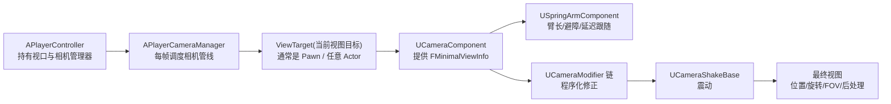
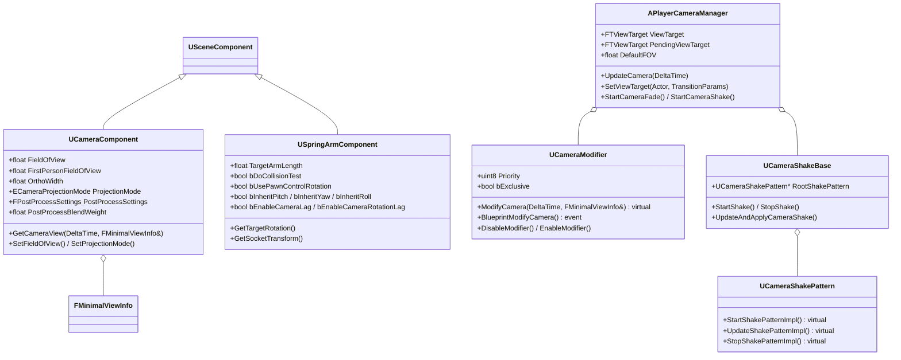
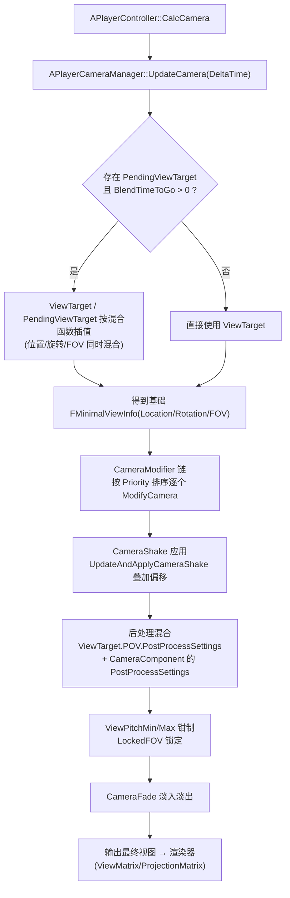
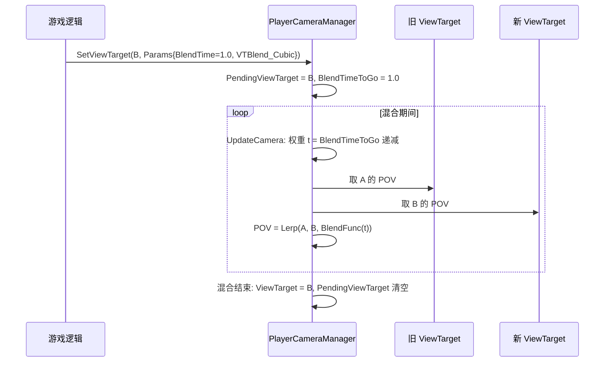
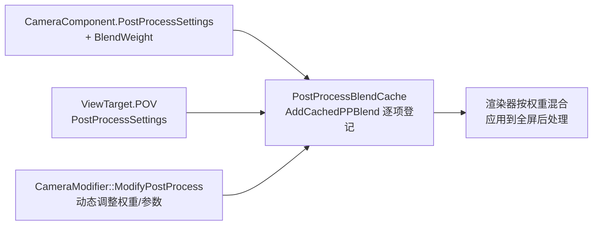
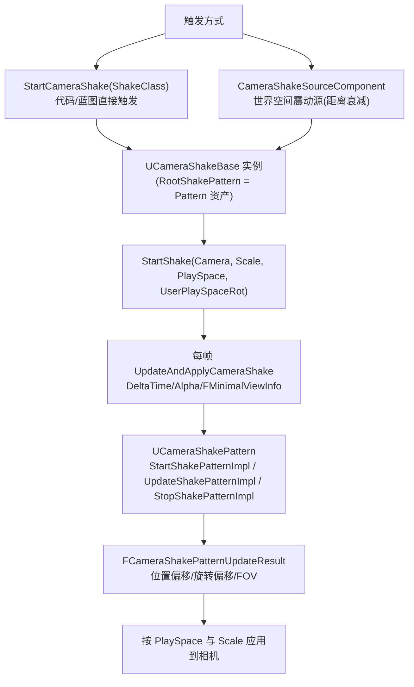
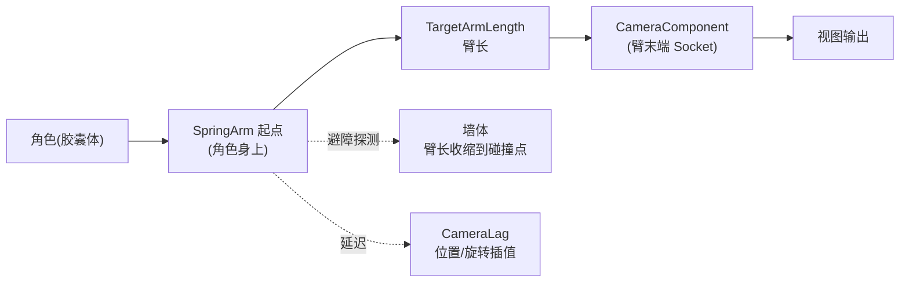
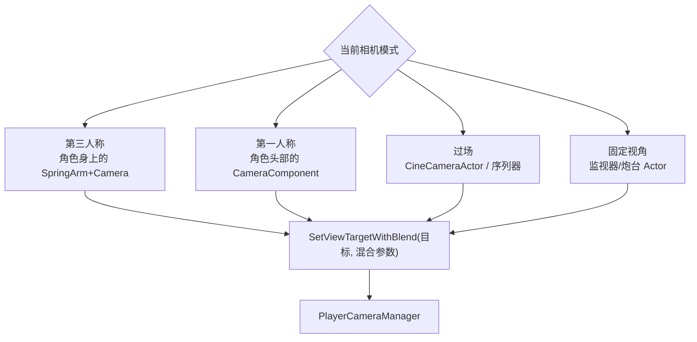

# 07 · 相机系统与视口
> 版本基准：UE 5.8.0（本机 `Engine/Build/Build.version`：CL 55116800，分支 `++UE5+Release-5.8`）。
> 兼容性边界：适用于 UE5.8 编辑器/运行时，UE4.27 与早期 UE5 仅作迁移背景，具体模块以正文为准。
> 官方参考：[Unreal Engine UE5.8 官方文档总页](https://dev.epicgames.com/documentation/en-us/unreal-engine)。
> 最后更新：2026-08-06（本轮元数据维护）。

> 面向 UE 5.x 客户端开发（API 已对照 UE 5.8 引擎源码核对，涉及版本差异处单独标注）。本文讲解 UE 相机体系的完整链路：`UCameraComponent`（相机组件）、`APlayerCameraManager`（玩家相机管理器，5.8 位于 `Classes/Camera/PlayerCameraManager.h`）、ViewTarget 与切换混合、FOV/后处理混合、`UCameraModifier`（相机修正器）、`UCameraShakeBase`（相机震动，5.8 的 Pattern 架构）以及 `USpringArmComponent`（相机臂），并给出多相机切换与第一/第三人称切换的完整示例。

## 一、概述

UE 的"相机"不是一个独立存在的实体，而是一条**按帧求值的视图计算管线**。玩家看到的内容由"谁在哪个位置、以什么朝向、用什么投影参数去看"决定，这条管线的末端会产出渲染用的视图信息（位置、旋转、FOV、投影模式、后处理参数），交给渲染器生成最终的画面。

相机体系分三层理解：

1. **视口与控制器层**：`ULocalPlayer` / `APlayerController` 拥有视口（Viewport），并持有唯一的 `APlayerCameraManager`（下文简称 PCM）。PCM 是相机管线的"调度中心"，默认由 `APlayerController` 在 `SpawnPlayerCameraManager` 时创建（可在游戏模式/控制器里替换成子类）。
2. **视图目标层**：PCM 每一帧围绕"当前在看谁（ViewTarget）"工作——ViewTarget 通常是 Pawn（`GetViewTargetPawn()`），也可以是任意 Actor（过场镜头、塔防炮台、监视器）。ViewTarget 提供 `FMinimalViewInfo`（位置/旋转/FOV/投影模式/后处理）作为相机基础视图。
3. **组件层**：ViewTarget 的视图信息通常由挂在它身上的 `UCameraComponent` 提供（`GetCameraView`），而 `UCameraComponent` 往往挂在 `USpringArmComponent`（相机臂）末端，相机臂负责"跟随 + 避障 + 延迟"。

在基础视图之上，PCM 还会叠加两条后处理链：**CameraModifier 链**（程序化修正：震屏、透视、死亡视角、瞄准偏移）与**CameraShake 系统**（震动），最后统一做 **FOV/后处理混合**，得到本帧最终视图。



> 核心源码（UE 5.8）：`Runtime/Engine/Classes/Camera/CameraComponent.h`、`PlayerCameraManager.h`、`CameraModifier.h`、`CameraShakeBase.h`、`Runtime/Engine/Classes/GameFramework/SpringArmComponent.h`；`FMinimalViewInfo` 定义于 `Runtime/Engine/Classes/Camera/CameraTypes.h`。

## 二、核心概念速览

| 概念 | 类 / 类型 | 作用 | 关键点 |
| --- | --- | --- | --- |
| 相机组件 | `UCameraComponent` | 提供视图参数（FOV/投影/后处理） | 继承 `USceneComponent`；`GetCameraView(DeltaTime, FMinimalViewInfo&)` 输出视图 |
| 相机臂 | `USpringArmComponent` | 相机跟随载体：臂长、避障、延迟 | `TargetArmLength`、`bDoCollisionTest`、`bEnableCameraLag` |
| 玩家相机管理器 | `APlayerCameraManager` | 相机管线调度中心，每 Pawn/控制器一个 | `UpdateCamera` → `DoUpdateCamera`；`SetViewTarget` 切换目标 |
| 视图目标 | `FTViewTarget` | 当前相机绑定的 Actor | 持有 `Target`（Actor）与 `POV`（`FMinimalViewInfo`） |
| 待切换目标 | `PendingViewTarget` | 切换过渡中的目标 | 与 `ViewTarget` 按 `BlendTimeToGo` 混合 |
| 切换参数 | `FViewTargetTransitionParams` | 定义混合时长/函数/锁定 | `BlendTime`、`BlendFunction`（默认 `VTBlend_Cubic`）、`bLockOutgoing` |
| 视图信息 | `FMinimalViewInfo`（CameraTypes.h） | 相机一帧的完整视图数据 | `Location / Rotation / FOV / DesiredFOV / OrthoWidth / ProjectionMode / PostProcessSettings / PostProcessBlendWeight / bConstrainAspectRatio` |
| 投影模式 | `ECameraProjectionMode` | 透视 / 正交 | `Perspective` / `Orthographic` |
| 相机修正器 | `UCameraModifier` | 对视图做程序化修正 | `Priority`（0 最高，255 最低）、`bExclusive`；5.8 主虚函数签名改为 `ModifyCamera(float, FMinimalViewInfo&)` |
| 相机震动 | `UCameraShakeBase` + `UCameraShakePattern` | 震动/受击反馈 | 5.8：`StartShake / UpdateAndApplyCameraShake / StopShake`；Pattern 资产（PerlinNoise / WaveOscillator） |
| 震动源 | `UCameraShakeSourceComponent` / `ACameraShakeSourceActor` | 以世界位置触发震动 | 支持距离衰减（Attenuation） |
| 相机样式 | `FName CameraStyle` | 引擎内置调试相机预设 | `Default / ThirdPerson / FirstPerson / FreeCam` 等 |
| 角度钳制 | `ViewPitchMin / ViewPitchMax / ViewYawMin / ViewYawMax` | 限制视角俯仰/偏航范围 | 防止镜头穿过地板/头顶 |
| 默认 FOV | `DefaultFOV / LockedFOV` | 相机基准视野角 | `LockedFOV > 0` 时锁定 FOV |

## 三、原理详解

### 3.1 相机体系的类层次



### 3.2 每帧相机更新链路



关键实现点（对照 5.8 `PlayerCameraManager.h`）：

- `UpdateCamera(float DeltaTime)` 是每帧入口（由 `APlayerController::CalcCamera` 调用），内部走 `DoUpdateCamera(DeltaTime)`；
- 视图目标的 POV 来自 `ViewTarget.POV`，而它通常由目标 Actor 上的 `UCameraComponent::GetCameraView(DeltaTime, DesiredView)` 填充（PCM 调用目标的 `CalcCamera` 接口，Actor 默认实现转发给相机组件）；
- 混合期间 `BlendTimeToGo` 递减，`BlendParams.BlendFunction`（`VTBlend_Linear / Cubic / EaseIn / EaseOut / EaseInOut / PreBlended`）决定权重曲线，位置、旋转、FOV 都按同一权重插值；
- 修正器链与震屏按"相对偏移"叠加在基础视图上，最后做角度钳制与 FOV 锁定；
- 引擎还支持 `BlueprintUpdateCamera(CameraTarget, NewCameraLocation, NewCameraRotation, NewCameraFOV)` 蓝图事件，纯蓝图项目可以在这里完全接管相机（返回 false 表示使用默认）。

### 3.3 ViewTarget：切换相机与混合



`FTViewTarget` 是视图目标的运行时包装：持有 `Target`（`AActor*`）与 `POV`（`FMinimalViewInfo`），并提供 `CheckViewTarget` 校验有效性。`FViewTargetTransitionParams`（5.8 字段）：

| 字段 | 说明 | 默认 |
| --- | --- | --- |
| `BlendTime` | 混合时长（秒），0 为瞬切 | 0 |
| `BlendFunction` | 混合曲线函数 | `VTBlend_Cubic` |
| `BlendExp` | `EaseIn / EaseOut / EaseInOut` 的指数 | 1.0 |
| `bLockOutgoing` | 混合期间旧目标 POV 是否"冻结"（不再跟随旧目标更新） | false |

> 5.8 注：旧版有 `bLockIncoming`，当前版本仅保留 `bLockOutgoing`（见头文件 `FViewTargetTransitionParams` 定义）。

切换 API（均在 5.8 头文件核对）：

- `SetViewTarget(AActor* NewViewTarget, FViewTargetTransitionParams TransitionParams = FViewTargetTransitionParams())`：蓝图节点 **Set View Target** / **Set View Target With Blend**；
- `GetViewTarget()` / `GetViewTargetPawn()`：查询当前目标；
- `CameraStyle`：`SetCameraStyle(FName)`，`FreeCam / FreeCam_Default` 等调试样式可快速查看周围环境。

### 3.4 FOV 与后处理混合

#### FOV

`UCameraComponent::FieldOfView`（默认 90，单位度）定义透视投影的视野角；`OrthoWidth` 定义正交投影（`ProjectionMode = Orthographic`）的可见宽度。FOV 参与两层混合：

1. **ViewTarget 混合**：切换相机时新旧目标的 FOV 与位置/旋转一起按混合权重插值（`FMinimalViewInfo::FOV` 与 `DesiredFOV` 的差值过渡）；
2. **运行时 FOV 动画**：瞄准缩放、冲刺 FOV 拉伸等效果，通常由 `CameraModifier` 或代码直接改 `CameraComponent->SetFieldOfView()` 实现，配合 `FInterpTo` 做平滑。

`FMinimalViewInfo` 中同时存在 `FOV` 与 `DesiredFOV`：前者是当前实际值，后者是目标值，供平滑逻辑使用。PCM 的 `DefaultFOV` 是"无相机组件/未指定时"的兜底值；`LockedFOV > 0` 时强制锁定（用于过场、驾驶等需要固定视野的场景）。

> 5.8 新增：`UCameraComponent` 提供 `FirstPersonFieldOfView` 与 `bEnableFirstPersonFieldOfView`，用于第一人称内容（配合 FOV 轴约束）独立控制近景 FOV，`FMinimalViewInfo` 也相应增加 `FirstPersonFOV` 字段。

#### 后处理混合

后处理（Post Process）不是"相机专属"，但相机是它的重要来源之一。`UCameraComponent` 暴露了完整的 `PostProcessSettings`（泛光、色调映射、景深、颜色分级等）与 `PostProcessBlendWeight`（0~1，权重为 0 时不生效）。PCM 在每帧把：

- 当前 ViewTarget 的 POV 后处理，
- 各 CameraComponent 贡献的后处理，
- CameraModifier / CameraShake 可能追加的后处理，

统一收集到 `PostProcessBlendCache`（`AddCachedPPBlend(PPSettings, BlendWeight, BlendOrder)`，`VTBlendOrder_Base / VTBlendOrder_Override` 控制覆盖顺序），再由场景渲染器按权重混合。这就是"镜头带滤镜"（死亡黑白、喝醉模糊、安全区色调）的实现基础。



### 3.5 CameraModifier：程序化相机修正

`UCameraModifier` 是一张"修正器链表"，挂在 PCM 上，按 `Priority`（0 最高、255 最低）排序依次作用于相机视图。典型用途：受击镜头偏移、瞄准镜透视、死亡镜头、动态 FOV 呼吸。

5.8 的 `CameraModifier.h` 要点：

| 成员 | 说明 |
| --- | --- |
| `virtual bool ModifyCamera(float DeltaTime, struct FMinimalViewInfo& InOutPOV)` | **5.8 主修正入口**：直接读写 `FMinimalViewInfo`（位置/旋转/FOV 一把梭）；返回 true 会中断后续修正器链 |
| `virtual void ModifyCamera(DeltaTime, ViewLocation, ViewRotation, FOV, ...)`（protected） | 旧签名版本，5.8 保留为保护成员，新代码优先用 `FMinimalViewInfo` 版本 |
| `BlueprintModifyCamera(DeltaTime, ViewLocation, ViewRotation, FOV, NewViewLocation, NewViewRotation, NewFOV)` | 蓝图实现事件（`BlueprintImplementableEvent`），修正量会按 Alpha 缩放 |
| `BlueprintModifyPostProcess(DeltaTime, PostProcessBlendWeight, PostProcessSettings)` | 蓝图实现事件：动态改后处理 |
| `virtual void ModifyPostProcess(DeltaTime, BlendWeight, PostProcessSettings)` | C++ 后处理修正入口 |
| `virtual bool ProcessViewRotation(ViewTarget, DeltaTime, OutViewRotation, OutDeltaRot)` | 在旋转被应用前介入（鼠标视角修正） |
| `Priority / bExclusive` | 排序与"独占"（启用时跳过其他修正器） |
| `DisableModifier(bImmediate) / EnableModifier()` | 启用/禁用，支持淡出（非立即时按 `UpdateAlpha` 过渡） |


### 3.6 CameraShake：5.8 的 Pattern 架构

UE 5.1 起相机震动从"单个 LegacyCameraShake 类"重构为 **`UCameraShakeBase` + `UCameraShakePattern`** 的组合模型（旧 `LegacyCameraShake` 仍可用但已标记弃用）。



核心 API（5.8 `CameraShakeBase.h` 核对）：

| API | 说明 |
| --- | --- |
| `APlayerCameraManager::StartCameraShake(TSubclassOf<UCameraShakeBase>, Scale=1, PlaySpace, UserPlaySpaceRot)` | 启动震动，返回实例 |
| `StartCameraShakeFromSource(Class, SourceComponent, ...)` | 从震动源组件启动（带距离衰减） |
| `StopCameraShake(Instance, bImmediately)` / `StopAllInstancesOfCameraShake(Class, bImmediately)` / `StopAllCameraShakes(bImmediately)` | 停止震动 |
| `UCameraShakeBase::StartShake / StopShake / UpdateAndApplyCameraShake(DeltaTime, Alpha, FMinimalViewInfo&) / IsFinished()` | 震动实例生命周期 |
| `UCameraShakeBase::RootShakePattern` | 实例持有的 Pattern（`EditAnywhere, Instanced`，可在资产里配置） |
| `UCameraShakePattern`（`UCLASS(Abstract, EditInlineNew)`） | 模式基类，覆写 `StartShakePatternImpl / UpdateShakePatternImpl / StopShakePatternImpl` 自定义震动 |
| `FCameraShakeDuration` | 时长类型：`Fixed`（固定）/ `Infinite`（无限）/ `Custom`（由逻辑决定） |
| `ECameraShakePlaySpace` | `CameraLocal`（相机局部）/ `World`（世界）/ `UserDefined`（自定义矩阵） |
| `ShakeScale / DynamicScale` | 静态/动态缩放，最终总缩放 = 两者乘积 |

引擎自带 Pattern 资产（编辑器里创建 `Camera Shake Pattern` 资产选择）：`UPerlinNoiseCameraShakePattern`（柏林噪声抖动）与 `UWaveOscillatorCameraShakePattern`（正弦波摆动），绝大多数震动需求用它们配置即可，无需写 C++。

### 3.7 SpringArmComponent：相机臂

第三人称相机的"标准答案"：角色身上挂 `USpringArmComponent`，相机组件挂在臂末端（`TargetArmLength` 为臂长）。相机臂负责三件事：

1. **跟随与旋转**：臂随角色移动；`bUsePawnControlRotation = true` 时臂的旋转跟随 Controller（鼠标视角），`bInheritPitch / bInheritYaw / bInheritRoll` 决定臂继承哪些旋转分量（`GetTargetRotation()` 计算目标旋转）；
2. **碰撞避障**：`bDoCollisionTest = true` 时按 `ProbeChannel`（默认 `ECC_Camera`）与 `ProbeSize` 做探测，臂长自动缩短避免相机穿墙（`GetSocketTransform` 返回避障后的臂末端变换）；
3. **延迟（Lag）**：`bEnableCameraLag` + `CameraLagSpeed`（位置跟随延迟）、`bEnableCameraRotationLag` + `CameraRotationLagSpeed`（旋转延迟）、`CameraLagMaxDistance`（延迟距离上限），做出"镜头慢半拍"的动感；`bDrawDebugLagMarkers` 可绘制调试标记。



典型组合（C++/蓝图一致）：

| 组件 | 关键设置 | 效果 |
| --- | --- | --- |
| SpringArm | `bUsePawnControlRotation = true` | 鼠标控制镜头环绕 |
| SpringArm | `bDoCollisionTest = true` | 贴墙时镜头自动拉近 |
| SpringArm | `bEnableCameraLag = true, CameraLagSpeed ≈ 8` | 角色急停时镜头惯性 |
| CameraComponent | `bUsePawnControlRotation = false` | 相机自身不再叠加控制旋转（已由臂完成） |

> 注意：`bUsePawnControlRotation` 在 SpringArm 与 CameraComponent 上都存在，职责不同——臂上表示"臂跟随控制旋转"，相机上表示"相机自身跟随控制旋转"。两者都开会造成旋转叠加，通常只用臂上的。

### 3.8 多相机切换与第一/第三人称

多相机 = 多个"相机提供者"（CameraComponent 或实现了 `CalcCamera` 的 Actor）+ 运行时切换 ViewTarget。常见架构：



切换时通过 `FViewTargetTransitionParams` 控制过渡手感：瞬切（`BlendTime = 0`）、平滑过渡（1~2 秒 `VTBlend_Cubic`）、锁定旧目标（`bLockOutgoing = true`，适合"镜头从旧位置慢慢拉开"的效果）。

## 四、代码示例

### 4.1 第三人称角色：SpringArm + CameraComponent（C++）

```cpp
// AMyCharacter.h
UCLASS()
class AMyCharacter : public ACharacter
{
    GENERATED_BODY()
public:
    AMyCharacter();

    UPROPERTY(VisibleAnywhere, BlueprintReadOnly, Category = "Camera")
    class USpringArmComponent* CameraBoom;

    UPROPERTY(VisibleAnywhere, BlueprintReadOnly, Category = "Camera")
    class UCameraComponent* FollowCamera;
};

// AMyCharacter.cpp
#include "GameFramework/SpringArmComponent.h"
#include "Camera/CameraComponent.h"

AMyCharacter::AMyCharacter()
{
    // 相机臂：挂在胶囊体上，臂长 400
    CameraBoom = CreateDefaultSubobject<USpringArmComponent>(TEXT("CameraBoom"));
    CameraBoom->SetupAttachment(GetCapsuleComponent());
    CameraBoom->TargetArmLength = 400.f;
    CameraBoom->bUsePawnControlRotation = true;   // 镜头跟随鼠标（Controller 旋转）
    CameraBoom->bDoCollisionTest = true;          // 防穿墙
    CameraBoom->bEnableCameraLag = true;          // 位置延迟
    CameraBoom->CameraLagSpeed = 8.f;
    CameraBoom->bEnableCameraRotationLag = true;  // 旋转延迟
    CameraBoom->CameraRotationLagSpeed = 12.f;

    // 相机：挂在臂末端，不再叠加控制旋转
    FollowCamera = CreateDefaultSubobject<UCameraComponent>(TEXT("FollowCamera"));
    FollowCamera->SetupAttachment(CameraBoom, USpringArmComponent::SocketName);
    FollowCamera->bUsePawnControlRotation = false;
    FollowCamera->FieldOfView = 90.f;
}
```

> `USpringArmComponent::SocketName`（默认 `"SpringEndpoint"`）是臂末端的 Socket，相机挂在它上面才能享受臂的避障与延迟。

### 4.2 ViewTarget 切换（C++ + 蓝图）

```cpp
// AMyGamePlayerController.cpp —— 切换相机目标
#include "Camera/PlayerCameraManager.h"

void AMyGamePlayerController::SwitchToTurret(AActor* TurretActor)
{
    if (!PlayerCameraManager || !TurretActor)
    {
        return;
    }

    FViewTargetTransitionParams Params;
    Params.BlendTime = 1.2f;
    Params.BlendFunction = VTBlend_Cubic;   // 缓入缓出
    Params.bLockOutgoing = false;

    PlayerCameraManager->SetViewTarget(TurretActor, Params);
}

void AMyGamePlayerController::SwitchBackToPawn()
{
    if (APawn* P = GetPawn())
    {
        PlayerCameraManager->SetViewTarget(P); // 默认参数 = 瞬切
    }
}
```

蓝图等价节点：`Set View Target With Blend`（目标 / 混合时间 / 混合函数 / 混合指数 / 锁定传出）与 `Set View Target`。注意**相机目标与"控制目标"是两回事**：`SetViewTarget` 只改镜头，不改变输入控制的对象；想让输入也跟随（如驾驶载具），还要 `Possess` / `UnPossess` 或切换 `Pawn`。

### 4.3 自定义 CameraModifier（5.8 新签名）

```cpp
// UDeathCameraModifier.h
UCLASS()
class UDeathCameraModifier : public UCameraModifier
{
    GENERATED_BODY()
public:
    UDeathCameraModifier();

    UPROPERTY(EditAnywhere, Category = "Death")
    float FallSpeed = 60.f;      // 每秒下沉速度

    UPROPERTY(EditAnywhere, Category = "Death")
    float TargetRoll = 45.f;     // 目标翻滚角

protected:
    // 5.8 主覆写点：直接操作 FMinimalViewInfo
    virtual bool ModifyCamera(float DeltaTime, struct FMinimalViewInfo& InOutPOV) override;
};

// UDeathCameraModifier.cpp
bool UDeathCameraModifier::ModifyCamera(float DeltaTime, struct FMinimalViewInfo& InOutPOV)
{
    // 让镜头缓慢下沉并翻滚（死亡演出）
    InOutPOV.Location -= FVector(0.f, 0.f, FallSpeed * DeltaTime);
    InOutPOV.Rotation.Roll = FMath::FInterpConstantTo(
        InOutPOV.Rotation.Roll, TargetRoll, DeltaTime, 20.f);
    return false; // 不中断后续修正器
}
```

挂载与卸载：

```cpp
// 在 PlayerController / GameMode 中
void AMyGamePlayerController::BeginPlay()
{
    Super::BeginPlay();
    if (PlayerCameraManager)
    {
        // 创建并挂到修正器链（默认 Priority 按创建顺序）
        UDeathCameraModifier* Mod = NewObject<UDeathCameraModifier>(this);
        PlayerCameraManager->AddCameraModifierToList(Mod);
    }
}
```

> 蓝图侧：创建 `CameraModifier` 蓝图子类，覆写 **Modify Camera** 事件（`BlueprintModifyCamera`，5.8 中已带 `FMinimalViewInfo` 语义的输入输出引脚：View Location / View Rotation / FOV 及 New 版本输出），或在 **Modify Post Process** 事件里改滤镜。

### 4.4 相机震动：蓝图优先，C++ 兜底

#### 蓝图方案（最常用）

1. 内容浏览器右键 → **Blueprint Class → 父类选 CameraShakeBase**，命名为 `BP_HitShake`；
2. 打开资产，在 **Camera Shake Pattern** 属性中选择/创建 `WaveOscillator` 或 `Perlin Noise` Pattern，调节频率与振幅（Rotation / Location 各轴）；
3. 触发处调用 **Start Camera Shake** 节点：`Shake Class = BP_HitShake`、`Scale = 1`、`Play Space = Camera Local`；
4. 停止用 **Stop All Instances of Camera Shake** / **Stop Camera Shake**（传入实例）。

#### C++ 方案：自定义 Pattern

```cpp
// UMyNoiseShakePattern.h —— 5.8 Pattern 子类
UCLASS()
class UMyNoiseShakePattern : public UCameraShakePattern
{
    GENERATED_BODY()
public:
    UPROPERTY(EditAnywhere, Category = "Shake")
    float Amplitude = 5.f;

    UPROPERTY(EditAnywhere, Category = "Shake")
    float Frequency = 20.f;

    UPROPERTY(EditAnywhere, Category = "Shake")
    float Duration = 0.4f;

protected:
    virtual void GetShakePatternInfoImpl(FCameraShakeInfo& OutInfo) const override;
    virtual void UpdateShakePatternImpl(const FCameraShakePatternUpdateParams& Params, FCameraShakePatternUpdateResult& OutResult) override;

private:
    float Elapsed = 0.f;
};

// UMyNoiseShakePattern.cpp
void UMyNoiseShakePattern::GetShakePatternInfoImpl(FCameraShakeInfo& OutInfo) const
{
    OutInfo.Duration = FCameraShakeDuration::Custom(Duration);
}

void UMyNoiseShakePattern::UpdateShakePatternImpl(
    const FCameraShakePatternUpdateParams& Params,
    FCameraShakePatternUpdateResult& OutResult)
{
    Elapsed += Params.DeltaTime;
    const float T = Elapsed;
    if (T >= Duration)
    {
        return; // 时长由 FCameraShakeState 统一管理结束
    }

    // 简单随机抖动（生产环境建议用 Perlin 噪声或正弦叠加）
    const float A = Amplitude * FMath::Sin(T * Frequency);
    OutResult.LocationOffset = FVector(
        A * FMath::FRandRange(-1.f, 1.f),
        A * FMath::FRandRange(-1.f, 1.f),
        A * FMath::FRandRange(-1.f, 1.f));
    OutResult.RotationOffset = FRotator(
        A * 0.1f * FMath::FRandRange(-1.f, 1.f),
        A * 0.1f * FMath::FRandRange(-1.f, 1.f),
        0.f);
}
```

触发：

```cpp
// UMyHitShake.h —— 持有自定义 Pattern 的震屏类（可选，更常见是资产里直接配内置 Pattern）
UCLASS()
class UMyHitShake : public UCameraShakeBase
{
    GENERATED_BODY()
public:
    UMyHitShake()
    {
        SetRootShakePattern(NewObject<UMyNoiseShakePattern>(this));
    }
};

// 任意逻辑中
if (APlayerCameraManager* PCM = GetWorld()->GetFirstPlayerController()->PlayerCameraManager)
{
    PCM->StartCameraShake(UMyHitShake::StaticClass(), 1.f);
}
```

> 说明：更常见的做法是创建一个 `UCameraShakeBase` 子类并在构造函数里 `SetRootShakePattern(NewObject<UMyNoiseShakePattern>(this))`，或直接在资产里配置内置 Pattern；引擎内置 `UPerlinNoiseCameraShakePattern / UWaveOscillatorCameraShakePattern` 已覆盖大多数需求。

### 4.5 FOV 与后处理（瞄准缩放 + 受击滤镜）

```cpp
// 瞄准缩放：在角色或 PlayerController 中
void AMyCharacter::StartAim()
{
    // 直接改相机组件 FOV（配合插值更平滑）
    FollowCamera->SetFieldOfView(60.f);
}

void AMyCharacter::EndAim()
{
    FollowCamera->SetFieldOfView(90.f);
}

// 受击滤镜：修改后处理混合权重（红色调）
void AMyCharacter::ApplyHitPostProcess()
{
    FollowCamera->PostProcessSettings.ColorGain = FLinearColor(1.6f, 0.6f, 0.6f);
    FollowCamera->PostProcessBlendWeight = 1.f;   // 1 = 完全生效
}
```

> 进阶：需要"镜头移动时后处理渐变"请走 CameraModifier 的 `ModifyPostProcess` / `BlueprintModifyPostProcess`（每帧可改权重与参数）；`UCameraComponent::AddOrUpdateBlendable` 可注册任意 Blendable（材质实例等）到相机后处理。

### 4.6 蓝图常用操作清单

| 需求 | 蓝图节点 / 设置 |
| --- | --- |
| 第一/第三人称切换 | 两个 CameraComponent 用 `Set Active` 切换；或切换 ViewTarget 到"头部相机 Actor" |
| 镜头淡入淡出 | `PlayerCameraManager` 的 `Start Camera Fade`（From/To Alpha、时长、颜色） |
| 限制视角 | 组件细节面板 `View Pitch Min/Max`（PCM 属性）或自定义 `ProcessViewRotation` 修正器 |
| 视角抖动 | `Start Camera Shake`（见 4.4） |
| 贴墙自动拉近 | SpringArm `bDoCollisionTest = true` + `ProbeSize` 调小 |
| 正交/透视切换 | `CameraComponent` 的 `Projection Mode` 设为 `Orthographic`，调 `Ortho Width` |

## 五、最佳实践

1. **默认第三人称用 SpringArm + CameraComponent，不要手动每帧 SetLocation**：臂内置了避障、延迟与旋转继承，手写极易出现穿墙与抖动。
2. **一个"相机状态"对应一个提供者，切换用 ViewTarget**：把"第三人称/第一人称/过场/驾驶"建模为不同相机 Actor/组件，用 `SetViewTarget` 切换，比在 Tick 里写一堆 if 干净得多。
3. **程序化修正优先用 CameraModifier，震动用 CameraShake**：两者都按帧叠加且可组合、可插拔；不要在相机组件上直接累积偏移（会造成"镜头越飘越远"且无法优雅恢复）。
4. **震屏是纯表现，不要复制到网络**：CameraShake 在本地客户端执行即可（`BlueprintCosmetic` 语义），触发信号（如受击事件）才需要同步；多人游戏中把震动参数放在本地预测/表现层。
5. **注意相机与 Pawn 旋转的职责分离**：鼠标视角由 Controller 的 `ControlRotation` 持有，SpringArm 的 `bUsePawnControlRotation` 负责消费它；角色模型朝向由 CMC 的 `bOrientRotationToMovement` / `bUseControllerDesiredRotation` 负责——不要把相机逻辑写进角色移动组件。
6. **性能**：避免大量 `UCameraShakeBase` 同时播放（尽量用 `StartCameraShakeFromSource` 的距离衰减）；后处理混合项（`AddCachedPPBlend` 数量）不要无限增长；相机臂探测每帧执行，`ProbeSize` 过大或碰撞通道过宽会增加开销。
7. **正交相机**：`OrthoWidth` 控制可见范围，`bConstrainAspectRatio` 控制是否按宽高比裁切（黑边）；2D/俯视游戏常配合 `AspectRatioAxisConstraint` 使用。
8. **过场**：优先用 Sequencer（`ACineCameraActor` + 镜头轨），它通过 `SetViewTarget` 与相机混合与运行时相机无缝衔接；手动切换相机时保留过渡参数，避免硬切。
9. **调试**：`ShowDebug Camera`（或相机相关 debug 显示）可查看当前 ViewTarget 与 POV；`CameraStyle` 切到 `FreeCam` 快速检查场景；SpringArm 打开 `bDrawDebugLagMarkers` 排查延迟异常。

## 六、常见问题 FAQ

**Q1：相机穿墙/卡进物体里？**
第三人称优先确认 SpringArm 的 `bDoCollisionTest = true` 且 `ProbeChannel` 为 `ECC_Camera`（默认）；若相机是独立 Actor（非臂挂载），需要自己实现射线避障或改用臂结构。Mesh 阻挡相机时，把 Mesh 的碰撞响应里 `Camera` 通道设为 `Ignore`（或 `Block` 并按需求处理）。

**Q2：鼠标移动时相机不动或旋转"叠转"？**
检查旋转链路：`bUsePawnControlRotation` 应只在 SpringArm 上开启（CameraComponent 上关闭）；Pawn 的 `bUseControllerRotationYaw` 只影响角色模型朝向，不影响相机；确认 `APlayerController::bEnableClickEvents` 之外的输入没有抢占鼠标（`SetInputMode` 为 UI 模式时视角会冻结）。

**Q3：SetViewTarget 后镜头瞬间切换，没有过渡？**
默认 `FViewTargetTransitionParams::BlendTime = 0`（瞬切）。需要过渡请用 `SetViewTargetWithBlend` / 传入 `BlendTime > 0` 的参数，并选择 `BlendFunction`；混合期间 `GetViewTarget()` 仍返回旧目标，直到混合结束才切换（注意 `bLockOutgoing` 会冻结旧目标 POV）。

**Q4：CameraShake 在 5.1+ 里怎么用旧教程的 LegacyCameraShake？**
`LegacyCameraShake` 仍可用但已弃用，新项目请用 `UCameraShakeBase` 资产 + Pattern（PerlinNoise / WaveOscillator），配置方式见 4.4；C++ 自定义则继承 `UCameraShakePattern` 覆写 `*Impl` 系列虚函数。

**Q5：震动没生效 / 幅度不对？**
检查：① `StartCameraShake` 的 `Scale` 与资产里 Pattern 的振幅（两者相乘）；② `PlaySpace`（`CameraLocal` 时偏移按相机局部轴）；③ 是否被更高优先级 CameraModifier 的 `bExclusive` 中断；④ 该 PlayerController 的 `PlayerCameraManager` 是否被替换成不含震屏的基类。

**Q6：FOV 修改后镜头"跳变"？**
直接 `SetFieldOfView` 是瞬变，观感生硬。用 `FInterpTo`（C++）或 `Lerp`/`Timeline`（蓝图）把 FOV 平滑过渡到目标值；`FMinimalViewInfo` 的 `DesiredFOV` 也是为此设计的。

**Q7：第一人称时武器/手部穿模？**
5.8 可使用相机组件的 `FirstPersonFieldOfView` + 第一人称标签（`IsFirstPerson`）分离近景渲染；或把武器 Mesh 放到单独的第一人称 CameraComponent 子层级，主相机 `PostProcessSettings` 单独调。可配合 [02-渲染与图形](../02-渲染与图形/README.md) 的 Depth of Field 设置。

**Q8：多相机切换时后处理"打架"？**
后处理按 `VTBlendOrder_Base / Override` 与权重混合，多个相机各自带滤镜时注意 `PostProcessBlendWeight` 与混合顺序；想彻底接管请用 CameraModifier 的 `ModifyPostProcess` 统一管理。

**Q9：相机跟随角色急停时抖动？**
多为相机臂延迟参数与 CMC 子步的叠加：调大 `CameraLagSpeed`（更快到达）、或调大 `CameraLagMaxDistance` 上限；角色侧检查 `MaxSimulationIterations` 是否过小导致位置抖动被镜头放大。

**Q10：Spectator/死亡后相机在哪？**
默认死亡后控制器可能失去 Pawn，相机仍指向最后 ViewTarget。常见做法：生成一个 `SpectatorPawn`（`SpectatorPawnClass`）并 `SetViewTarget` 到它，或使用 `CameraStyle = "FreeCam"` 让玩家自由观察。

## 七、关联阅读

- [06-角色移动系统UCharacterMovement](./06-角色移动系统UCharacterMovement.md)：`bUsePawnControlRotation` / `bOrientRotationToMovement` 与相机臂旋转的协作，以及 `ControlRotation` 的来源。
- [02-EnhancedInput增强输入](./02-EnhancedInput增强输入.md)：鼠标 Look 动作如何写入 Controller 旋转，进而驱动 SpringArm。
- [05-场景组件与变换体系](../01-引擎基础/05-场景组件与变换体系.md)：`USceneComponent` 附加（Attach）、Socket 与 `GetSocketTransform` 基础。
- [02-渲染与图形](../02-渲染与图形/README.md)：`FMinimalViewInfo` 如何转化为渲染器的 View/Projection 矩阵，后处理混合的渲染侧实现。
- [05-后处理与画面特效](../02-渲染与图形/05-后处理与画面特效.md)：相机后处理参数（泛光/色调/景深）与 Blendable 的细节。
- [04-动画系统](../04-动画系统/README.md)：动画蒙太奇通知触发 CameraShake / CameraModifier 的常见联动。
- [03-GameplayTag与数据资产](./03-GameplayTag与数据资产.md)：用 Tag 标记相机状态（瞄准/驾驶/过场）驱动修正器与 FOV 逻辑。
- [06-网络同步](../06-网络同步/README.md)：震屏/相机表现只在本机执行，注意与复制数据（受击事件）的边界。
