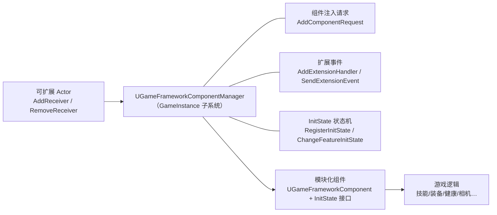
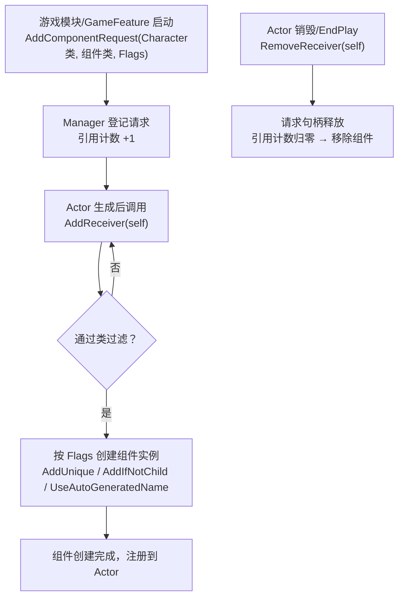
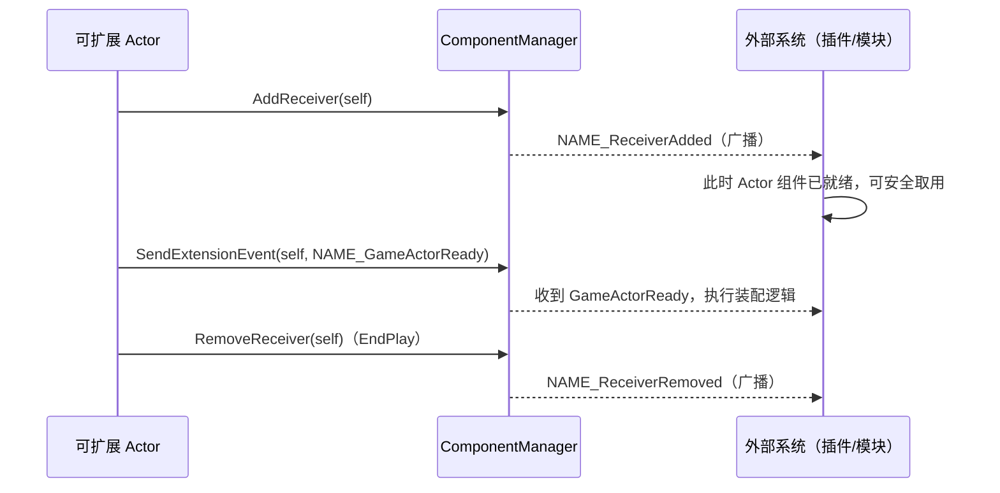
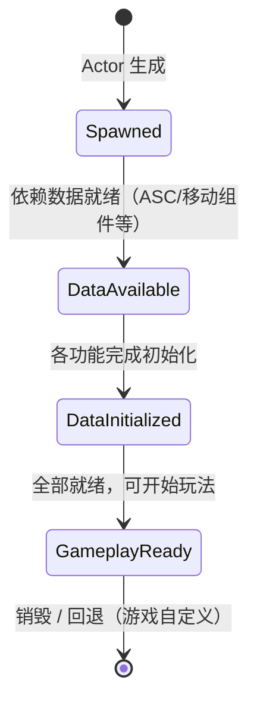
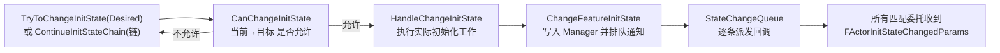

# 08 · Modular Gameplay 模块化玩法

> 面向 UE 5.x 客户端开发。本文讲解 Modular Gameplay 插件三件套：`UGameFrameworkComponentManager`（组件注册/扩展事件）、`IGameFrameworkInitStateInterface`（InitState 初始化状态机）与 `UGameFrameworkComponent`（模块化组件基类），以及它们在 Lyra 中的实践模式。
>
> 源码位置（UE 5.8 本机验证）：`Engine\Plugins\Runtime\ModularGameplay\Source\ModularGameplay\Public\Components\GameFrameworkComponentManager.h`、`GameFrameworkInitStateInterface.h`、`GameFrameworkComponent.h`、`GameFrameworkComponentDelegates.h`（注意 5.8 起头文件位于 `Public/Components/` 子目录）。

## 一、概述

传统 UE 项目中，一个"角色"由 Pawn + 一大坨组件 + 蓝图逻辑构成。当游戏越来越大（多模式玩法、DLC、多个 GameMode），会出现三个痛点：

1. **装配死板**：组件在蓝图里手动挂，不同玩法模式想给同一类 Actor 挂不同组件，只能复制蓝图；
2. **初始化顺序靠猜**：Health 组件要用 AbilitySystem 组件、Equipment 要用 Camera……"谁先初始化"完全靠 Tick 顺序或人工约定；
3. **GameFeature 难以插入**：DLC 想给现有角色"追加能力"，没有标准入口。

Modular Gameplay（模块化玩法）插件正是为了解决这些问题而设计，它提供三个互相配合的机制：

- **组件注入（Component Request）**：声明"凡是 `UMyCharacter` 就自动挂 `UMyWeaponComponent`"，Actor 只需调用一次 `AddReceiver` 表态，剩下的由管理器代劳；
- **扩展事件（Extension Event）**：以 FName 命名的广播事件（如 `NAME_GameActorReady`），让外部系统在角色"就绪"的精确时刻介入；
- **初始化状态机（InitState）**：用 GameplayTag 表达功能状态（`Spawned → DataAvailable → DataInitialized → GameplayReady`），所有组件都围绕状态链协同推进，天然解决初始化顺序问题。

三者都由 `UGameFrameworkComponentManager`（一个 `UGameInstanceSubsystem`）统一管理：**注册请求、登记接收者、派发事件、维护状态**。



## 二、核心概念速览

| 概念 | 类 / 类型 | 作用 | 关键点 |
| --- | --- | --- | --- |
| 组件管理器 | `UGameFrameworkComponentManager` | 组件注入、扩展事件、InitState 的统一中枢 | 继承 `UGameInstanceSubsystem`，每个 GameInstance 一个 |
| 组件请求 | `AddComponentRequest(...)` → `TSharedPtr<FComponentRequestHandle>` | 声明"某类 Actor 自动获得某组件" | 引用计数，句柄销毁即撤销请求 |
| 请求句柄 | `FComponentRequestHandle` | 持有请求/事件注册的生命周期 | `IsValid()` 判断管理器是否还在 |
| 接收者 | `AddReceiver` / `RemoveReceiver` | Actor 主动"表态"接受组件注入 | 蓝图可调用，游戏世界限定可选 |
| 扩展事件 | `AddExtensionHandler` / `SendExtensionEvent` | 按 FName 事件名广播/监听 | 内置 `NAME_ReceiverAdded` 等 5 个，游戏可自定义 |
| InitState 状态机 | `RegisterInitState` / `ChangeFeatureInitState` | 用 GameplayTag 表达功能初始化阶段 | 全局状态顺序表，`IsInitStateAfterOrEqual` 判定 |
| 状态接口 | `IGameFrameworkInitStateInterface` | 组件/角色实现该接口参与状态机 | `RegisterInitStateFeature` / `BindOnActorInitStateChanged` |
| 状态参数 | `FActorInitStateChangedParams` | 状态变化回调的参数包 | OwningActor / FeatureName / Implementer / FeatureState |
| 状态委托 | `FActorInitStateChangedDelegate` / `FActorInitStateChangedBPDelegate` | 原生与蓝图两套回调 | 蓝图版本是动态单播委托 |
| 组件基类 | `UGameFrameworkComponent` | 所有模块化组件的基类 | 提供 `GetGameInstance`、`HasAuthority`、`GetWorldTimerManager` |
| 框架组件 | `UPawnComponent` / `UControllerComponent` / `UPlayerStateComponent` / `UGameStateComponent` | 面向不同 Actor 的现成基类 | 均实现 InitState 接口，开箱即用 |
| 组件迭代器 | `TComponentIterator<T>` | 遍历已注册的某类组件 | 自动跳过未注册/无效组件 |

## 三、原理详解

### 3.1 组件注入：声明式装配

管理器内部维护两张核心表：

- `RequestTrackingMap`：`(ReceiverClass, ComponentClass) → 引用计数`。多个系统对同一组合发起请求时只挂一个组件，全部句柄释放才移除；
- `ReceiverClassToComponentClassMap`：接收者类 → 应注入的组件类集合（含 `EGameFrameworkAddComponentFlags` 规则）。

注入流程：



要点：

- **Actor 必须主动 opt-in**：只有调用过 `AddReceiver` 的 Actor 才会收到注入；请求发出时已在内存中的接收者会**立即**获得组件，之后新生成的接收者也会自动获得；
- **Flags 控制去重**：`AddUnique`（类精确去重）、`AddIfNotChild`（允许子类组件共存）、`UseAutoGeneratedName`（避免同名组件被复用）；
- 请求是**引用计数**的：`FComponentRequestHandle` 析构时向管理器注销，组件随之销毁。

### 3.2 扩展事件：可插入的时机钩子

扩展事件让"监听某类 Actor 的某个生命周期节点"变得标准化。管理器用 `ReceiverClassToEventMap` 保存"接收者类 → 事件名 → 委托"，且故意用 `TMap<FDelegateHandle, TSharedRef<...>>` 模拟保序的多播（fake multicast），保证**注册顺序即调用顺序**。



内置事件名（`UGameFrameworkComponentManager` 静态成员）：

| 事件名 | 触发时机 |
| --- | --- |
| `NAME_ReceiverAdded` | Actor 调用 `AddReceiver` 且组件注入完成后 |
| `NAME_ReceiverRemoved` | Actor 调用 `RemoveReceiver`（通常来自 EndPlay） |
| `NAME_ExtensionAdded` | 新的扩展 handler 注册时 |
| `NAME_ExtensionRemoved` | handler 随句柄释放被移除时 |
| `NAME_GameActorReady` | **游戏自定义发送**：Actor 主体初始化完成、可供扩展的信号（约定俗成，所有可扩展游戏都应发送） |

### 3.3 InitState：初始化状态机

状态机用 **GameplayTag 表达状态**，全局维护一张有序状态表 `InitStateOrder`：



状态推进的核心调用链：



设计细节（源码可证）：

- **回调不重入**：状态变更先写入 `StateChangeQueue`，由 `ProcessFeatureStateChange` 逐条派发，避免"A 的处理器里又改状态"造成递归；
- **委托防悬垂**：注册的委托一律以 `TSharedRef<FActorFeatureRegisteredDelegate>` 保存，带 `bRemoved` 标记，执行期被移除也不会踩空指针；
- **可筛选**：委托注册时可指定 `FeatureName`（只监听某功能）与 `RequiredInitState`（只在该状态**之后**才触发），`bCallImmediately` 决定"已经达到目标状态时是否注册即回调"；
- **类级监听**：`RegisterAndCallForClassInitState` 面向"某类 Actor 的所有实例"，用于模块尚未拿到具体实例的场景；
- **查询 API**：`GetInitStateForFeature` / `HasFeatureReachedInitState` / `HaveAllFeaturesReachedInitState` / `GetImplementerForFeature` 供外部只读查询。

### 3.4 模块化 Actor 的标准流程

一个完整的模块化 Actor 生命周期：

1. **生成**：Actor 生成，`OnRegister` 中各组件调用 `RegisterInitStateFeature()` 登记自己的 Feature，并 `BindOnActorInitStateChanged` 监听依赖；
2. **入队**：`BeginPlay` 调用 `AddReceiver`（或静态版 `AddGameFrameworkComponentReceiver`），管理器按请求注入组件并广播 `NAME_ReceiverAdded`；
3. **推进**：某个组件发现自己依赖就绪（`OnActorInitStateChanged` 回调里判断），调用 `CheckDefaultInitialization` → `ContinueInitStateChain` 推进一步；
4. **就绪**：全部 Feature 到达 `GameplayReady`，此时发送 `NAME_GameActorReady` 供外部系统装配；
5. **清理**：`EndPlay` 调用 `RemoveReceiver` 移除注入组件、`UnregisterInitStateFeature()` 注销状态；管理器 `RemoveActorFeatureData` 清空数据。

## 四、Lyra 实践参考

Lyra 是 Epic 官方的示例项目，Modular Gameplay 插件就是为它孵化的。以下是公开代码中可观察到的核心模式（本机未附带 Lyra 源码，以下为模式总结）：

1. **状态 Tag 命名空间**：Lyra 使用 `Lyra.InitState.Spawned`、`Lyra.InitState.DataAvailable`、`Lyra.InitState.DataInitialized`、`Lyra.InitState.GameplayReady`（另有 `Lyra.InitState.Death` 等游戏自定义状态），并在游戏启动时通过 `UGameFrameworkComponentManager::RegisterInitState` 注册顺序；
2. **组件即 Feature**：`ULyraHealthComponent`、`ULyraEquipmentComponent`、`ULyraInventoryComponent` 等都继承自 `UGameFrameworkComponent` 并实现 `IGameFrameworkInitStateInterface`，各自声明 `GetFeatureName`（如 `"Health"`）；
3. **装配组件**：`ULyraPawnExtensionComponent`（Pawn 扩展组件）承担"总装配"职责：注册 InitState、监听其他 Feature、最后把状态推到 `GameplayReady` 并广播 `NAME_GameActorReady`；
4. **依赖门控**：每个组件在 `CanChangeInitState` 里检查自己的前置条件（例如 Health 需要 AbilitySystemComponent 存在、Equipment 需要 Avatar 有效），条件不满足就停在当前状态等待；
5. **GameFeature 挂载**：Lyra 的 GameFeature 插件在 `StartGameplayFeature` 时批量 `AddComponentRequest` + `AddExtensionHandler` + `RegisterInitState`，从而让 DLC 能向基础角色"追加"整套玩法组件。

> 经验：把 Lyra 的四段状态链当作默认模板，不要轻易加链节；链越长，`CanChangeInitState` 的组合爆炸越严重。

## 五、C++ / 蓝图示例

### 5.1 注册状态链（游戏启动时）

```cpp
// UMyGameInstance.h
UCLASS()
class UMyGameInstance : public UGameInstance
{
    GENERATED_BODY()
public:
    virtual void Init() override;
};

// UMyGameInstance.cpp
#include "Components/GameFrameworkComponentManager.h"
#include "MyGameplayTags.h"

void UMyGameInstance::Init()
{
    Super::Init();

    if (UGameFrameworkComponentManager* Manager = GetSubsystem<UGameFrameworkComponentManager>(this))
    {
        // 注册全局状态顺序：Spawned → DataAvailable → DataInitialized → GameplayReady
        Manager->RegisterInitState(MyGameplayTags::InitState_Spawned,        /*bAddBefore=*/false, FGameplayTag());
        Manager->RegisterInitState(MyGameplayTags::InitState_DataAvailable,  false, MyGameplayTags::InitState_Spawned);
        Manager->RegisterInitState(MyGameplayTags::InitState_DataInitialized, false, MyGameplayTags::InitState_DataAvailable);
        Manager->RegisterInitState(MyGameplayTags::InitState_GameplayReady,  false, MyGameplayTags::InitState_DataInitialized);
    }
}
```

### 5.2 自定义模块化组件（实现 InitState 接口）

```cpp
// UMyHealthComponent.h
UCLASS()
class UMyHealthComponent : public UGameFrameworkComponent, public IGameFrameworkInitStateInterface
{
    GENERATED_BODY()
public:
    // UGameFrameworkComponent
    virtual void OnRegister() override;
    virtual void OnUnregister() override;

    // IGameFrameworkInitStateInterface
    virtual FName GetFeatureName() const override { return FName(TEXT("Health")); }
    virtual bool CanChangeInitState(UGameFrameworkComponentManager* Manager,
        FGameplayTag CurrentState, FGameplayTag DesiredState) const override;
    virtual void HandleChangeInitState(UGameFrameworkComponentManager* Manager,
        FGameplayTag CurrentState, FGameplayTag DesiredState) override;
    virtual void OnActorInitStateChanged(const FActorInitStateChangedParams& Params) override;
    virtual void CheckDefaultInitialization() override;
};
```

```cpp
// UMyHealthComponent.cpp
#include "Components/GameFrameworkComponentManager.h"
#include "MyGameplayTags.h"

void UMyHealthComponent::OnRegister()
{
    Super::OnRegister();

    // 1. 向管理器登记自己的 Feature
    RegisterInitStateFeature();

    // 2. 监听所有 Feature 到达 DataAvailable，依赖就绪后推进自己
    BindOnActorInitStateChanged(NAME_None, MyGameplayTags::InitState_DataAvailable, /*bCallIfReached=*/true);
}

void UMyHealthComponent::OnUnregister()
{
    UnregisterInitStateFeature();
    Super::OnUnregister();
}

bool UMyHealthComponent::CanChangeInitState(UGameFrameworkComponentManager* Manager,
    FGameplayTag CurrentState, FGameplayTag DesiredState) const
{
    if (!Manager) { return false; }

    if (DesiredState.MatchesTagExact(MyGameplayTags::InitState_DataAvailable))
    {
        // 依赖：角色必须已经拥有能力系统组件
        return GetOwner()->FindComponentByClass<UMyAbilitySystemComponent>() != nullptr;
    }
    if (DesiredState.MatchesTagExact(MyGameplayTags::InitState_GameplayReady))
    {
        // 依赖：装备系统先就绪
        return Manager->HasFeatureReachedInitState(GetOwner(), FName(TEXT("Equipment")),
            MyGameplayTags::InitState_DataInitialized);
    }
    return true;
}

void UMyHealthComponent::HandleChangeInitState(UGameFrameworkComponentManager* Manager,
    FGameplayTag CurrentState, FGameplayTag DesiredState)
{
    // 在这里执行真正的初始化（缓存指针、绑定委托、准备数据）
    if (DesiredState.MatchesTagExact(MyGameplayTags::InitState_GameplayReady))
    {
        // 初始化血量、绑定伤害事件……
    }
}

void UMyHealthComponent::OnActorInitStateChanged(const FActorInitStateChangedParams& Params)
{
    // 依赖的状态变了（例如 AbilitySystem 到了 DataAvailable），尝试继续推进自己
    if (Params.FeatureState == MyGameplayTags::InitState_DataAvailable)
    {
        CheckDefaultInitialization();
    }
}

void UMyHealthComponent::CheckDefaultInitialization()
{
    // 沿默认链推进，直到 CanChangeInitState 不允许为止
    ContinueInitStateChain({
        MyGameplayTags::InitState_Spawned,
        MyGameplayTags::InitState_DataAvailable,
        MyGameplayTags::InitState_DataInitialized,
        MyGameplayTags::InitState_GameplayReady
    });
}
```

### 5.3 组件注入请求

```cpp
// 在 GameFeature / 游戏模块启动时
UGameFrameworkComponentManager* Manager = UGameFrameworkComponentManager::GetForActor(SomeActor);
if (!Manager) { return; }

// 持有句柄，防止请求被回收（成员变量 TSharedPtr<FComponentRequestHandle>）
MyRequestHandle = Manager->AddComponentRequest(
    TSoftClassPtr<AActor>(AMyCharacter::StaticClass()),   // 接收者类（也可传蓝图类路径）
    UMyWeaponComponent::StaticClass(),                    // 要注入的组件
    EGameFrameworkAddComponentFlags::AddUnique);          // 同类型只挂一个

// 释放句柄 = 撤销请求（析构自动完成）
MyRequestHandle.Reset();
```

### 5.4 扩展事件（监听角色就绪）

```cpp
// 注册监听：所有 UMyCharacter 的扩展事件
ExtensionHandle = Manager->AddExtensionHandler(
    TSoftClassPtr<AActor>(AMyCharacter::StaticClass()),
    FGameFrameworkComponentManager::FExtensionHandlerDelegate::CreateUObject(this, &UMySystem::HandleExtensionEvent));

void UMySystem::HandleExtensionEvent(AActor* Actor, FName EventName)
{
    if (EventName == UGameFrameworkComponentManager::NAME_GameActorReady)
    {
        // 角色全部初始化完成，开始装配（例如授予技能、设置 HUD）
    }
}

// Actor 侧发送事件（通常在全部 Feature 到达 GameplayReady 后）
UGameFrameworkComponentManager::SendGameFrameworkComponentExtensionEvent(
    this, UGameFrameworkComponentManager::NAME_GameActorReady);
```

### 5.5 蓝图侧要点

1. **接收者**：角色蓝图 `BeginPlay` 里调用 `Add Game Framework Component Receiver (Self)`，`EndPlay` 调用移除版（`UGameFrameworkComponentManager` 静态蓝图函数）；
2. **事件**：`Send Extension Event (Self, EventName)` 发送自定义事件；外部系统用 C++ `AddExtensionHandler` 监听（蓝图侧没有对称的注册 API，这是设计取舍）；
3. **状态监听**：`Register And Call For Actor Init State` 节点（参数：Actor / FeatureName / RequiredState / 动态委托 / bCallImmediately），回调里拿到 `FActorInitStateChangedParams`；
4. **组件内查询**：继承自 C++ 组件的蓝图子类可直接调用 `Get Init State`、`Has Reached Init State`、`Register And Call For Init State Change`（接口的 UFUNCTION 已暴露给蓝图）。

> 注意：`IGameFrameworkInitStateInterface` 标记了 `NotBlueprintable`——**不能在纯蓝图里实现该接口**，必须从 C++ 组件继承。

## 六、最佳实践

1. **Actor 主动表态**：只有真正需要被扩展的 Actor 调用 `AddReceiver`；不要给所有 Actor 无差别注入，否则管理器表膨胀且难排查。
2. **状态链保持精简**：默认四段（Spawned / DataAvailable / DataInitialized / GameplayReady）够用；额外的游戏状态（如 `Death`）作为**分支**注册，不要拉长主链。
3. **依赖只写在 CanChangeInitState**：不要用 Tick 轮询依赖，把前置条件集中到 `CanChangeInitState`，状态机天然会"停在原地等"。
4. **Handle 一定要持有**：`AddComponentRequest` / `AddExtensionHandler` 返回的 `TSharedPtr<FComponentRequestHandle>` 必须存成员变量，否则立即析构、请求立刻失效。
5. **GameActorReady 是契约**：可扩展游戏约定在"主体初始化完成"时发送 `NAME_GameActorReady`；插件只依赖这个事件，不要直接依赖某个具体组件。
6. **网络角色同样适用**：`HasAuthority()` 只在服务器返回 true，客户端组件推进状态时注意只有 Authority 能改状态；查询 API（`HasFeatureReachedInitState`）在两端都可以安全调用。
7. **与 GameFeature 配合**：`AddComponentRequest` 尽量在 GameFeature 的 `StartGameplayFeature` 中调用、句柄存进 Feature 对象，随 Feature 卸载自动清理。
8. **调试**：非 Shipping 构建可用 `UGameFrameworkComponentManager::DumpGameFrameworkComponentManagers()` 输出全部请求/接收者/状态，排查"为什么组件没挂上"。

## 七、常见问题 FAQ

**Q1：组件注入没生效？**
依次检查：接收者类路径是否与 Actor 实际类匹配（注意蓝图子类不算匹配父类请求的接收者，除非请求写在父类上）；Actor 是否调用了 `AddReceiver`（这是 opt-in 设计）；请求句柄是否还活着（局部变量会立即析构）；游戏世界过滤 `bAddOnlyInGameWorlds` 是否误伤（编辑器 PIE 里默认只处理游戏世界）。

**Q2：`AddUnique` 和 `AddIfNotChild` 有什么区别？**
`AddUnique` 要求 Actor 上不存在**同类**组件才注入；`AddIfNotChild` 允许存在父类组件，只要没有**该组件的子类实例**就注入。前者适合"每角色最多一个"，后者适合"基础组件 + 特殊化组件"叠加。

**Q3：状态一直卡在 DataAvailable 不动？**
典型原因：某个依赖组件根本没注册（`GetFeatureName` 返回 `NAME_None` 会导致匹配混乱）；`CanChangeInitState` 里检查的组件还没创建（检查时机早于组件注入）；委托注册时 `RequiredInitState` 过滤条件写错（状态必须"相等或更晚"才回调）；`BindOnActorInitStateChanged` 在 `RegisterInitStateFeature` 之前调用。

**Q4：可以回退状态吗（GameplayReady → DataAvailable）？**
可以，`ChangeFeatureInitState` 本身不阻止回退，但 `CanChangeInitState` 应当拒绝非法回退（参考示例里对 `CurrentState` 的校验）。Lyra 的 `Death` 状态就是"前进后不再回退"的典型。

**Q5：蓝图里能实现 InitState 接口吗？**
不能直接实现（接口 `NotBlueprintable`）。变通方案：写一个 C++ 组件实现接口并暴露蓝图函数，蓝图子类重写 `CheckDefaultInitialization` / `CanChangeInitState` 的蓝图事件版本（C++ 里声明 `BlueprintNativeEvent`）。

**Q6：和 GameInstance 生命周期怎么配合？**
管理器是 `UGameInstanceSubsystem`，随 GameInstance 创建/销毁。状态链注册放在 GameInstance `Init` 或 GameFeature 启动阶段都行；**不要在静态初始化期**调用（模块可能尚未加载）。

## 八、关联阅读

- [01-GameplayAbilitySystem能力系统](01-GameplayAbilitySystem能力系统.md)：InitState 的 `DataAvailable` 门控常检查 ASC 是否就绪，两者是 Lyra 中的黄金搭档。
- [02-EnhancedInput增强输入](02-EnhancedInput增强输入.md)：输入上下文也常由模块化组件在 `GameplayReady` 阶段装配。
- [03-GameplayTag与数据资产](03-GameplayTag与数据资产.md)：InitState 状态本身是 GameplayTag，需要先在 Tag 配置/代码中定义。
- [04-委托事件与对象通信](04-委托事件与对象通信.md)：扩展事件机制与委托绑定/解绑模式同源。
- [05-蓝图与C++协作](05-蓝图与C++协作.md)：`FActorInitStateChangedBPDelegate` 是把 C++ 状态机暴露给蓝图的标准样例。
- [09-GameplayTask任务框架](09-GameplayTask任务框架.md)：组件在 `HandleChangeInitState` 中常启动 GameplayTask 执行持续逻辑。
