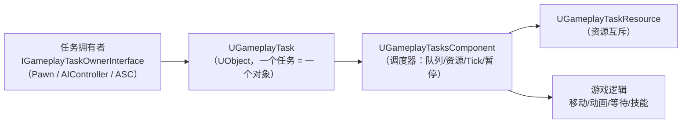
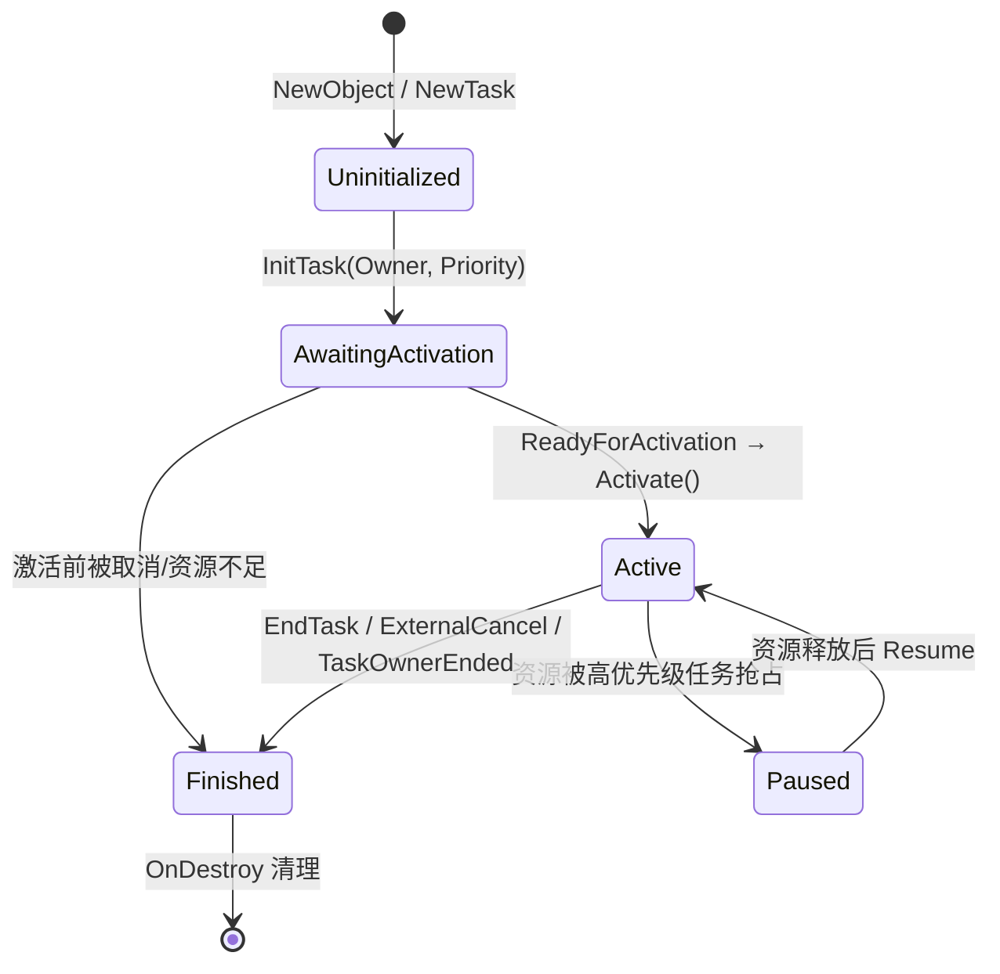
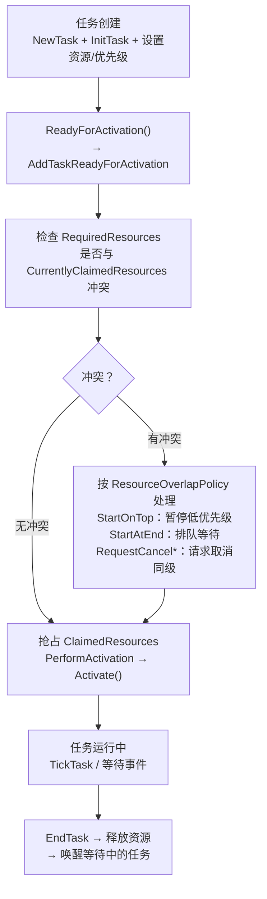
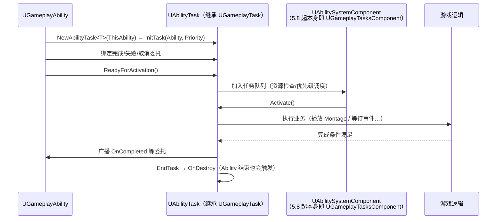

# 09 · GameplayTask 任务框架

> 面向 UE 5.x 客户端开发。本文讲解引擎级任务框架：`UGameplayTask` / `UGameplayTasksComponent` 的对象模型与调度机制、任务生命周期（`ReadyForActivation → Activate → OnDestroy`）、`IGameplayTaskOwnerInterface` 拥有者协议、Tick 与外部取消，以及它和 GAS `UAbilityTask` 的关系、蓝图 Task 的写法。
>
> 源码位置（UE 5.8 本机验证）：`Engine\Source\Runtime\GameplayTasks\Classes\GameplayTask.h`、`GameplayTasksComponent.h`、`GameplayTaskOwnerInterface.h`、`GameplayTaskResource.h`；GAS 侧 `Engine\Plugins\Runtime\GameplayAbilities\Source\GameplayAbilities\Public\Abilities\Tasks\AbilityTask.h`。

## 一、概述

游戏里大量逻辑是"**持续一段时间、可以被打断、需要与其他逻辑互斥**"的：角色冲撞、蓄力施法、播放动画后结算、等待某个事件、把目标拽过来……如果全写在 Pawn 的 Tick 里，状态变量会爆炸；如果用蓝图 Timeline + 分支，逻辑会散成意大利面。

GameplayTask 把这类逻辑封装成**一个 UObject 任务对象**，并交给 `UGameplayTasksComponent` 统一调度：

- **生命周期可控**：创建 → 激活 → 运行 → 结束/取消，每个阶段都有虚函数钩子；
- **优先级与资源互斥**：任务可以声明"占用"哪些资源（如移动、动画），高优先级任务抢占时低优先级自动暂停；
- **Tick 按需**：只有声明需要 Tick 的任务才会被逐帧调用 `TickTask`；
- **统一取消路径**：任务拥有者销毁、外部显式取消、资源被抢占，都有明确的结束入口；
- **与 GAS 深度集成**：`UAbilityTask` 就是 `UGameplayTask` 的子类，AbilityTask 全部跑在同一套调度器上。



典型应用：AI 的 `MoveTo`、GAS 的 `PlayMontageAndWait` / `WaitGameplayEvent` / `ApplyRootMotion*`、自定义的"冲刺""抓取""蓄力"逻辑。

> 与 `BlueprintAsyncActionBase`（AsyncAction）的区别：AsyncAction 只是"蓝图异步节点"的基类，没有调度器、没有资源互斥、没有外部取消协议；GameplayTask 是完整任务框架，AsyncAction 常用于不需要互斥的一次性异步调用。

## 二、核心概念速览

| 概念 | 类 / 类型 | 作用 | 关键点 |
| --- | --- | --- | --- |
| 任务本体 | `UGameplayTask` | 一段可调度的游戏逻辑 | 抽象类，`UObject` 实现，可蓝图子类化 |
| 任务组件 | `UGameplayTasksComponent` | 调度器：优先级队列、资源、Tick、暂停恢复 | `ActorComponent`，持有任务的所有权 |
| 任务拥有者 | `IGameplayTaskOwnerInterface` | 创建任务的实体协议 | 提供组件/owner/avatar/默认优先级与激活通知 |
| 任务资源 | `UGameplayTaskResource` + `FGameplayResourceSet` | 资源互斥的位标记集合 | 最多 16 种资源位 |
| 任务状态 | `EGameplayTaskState` | Uninitialized / AwaitingActivation / Paused / Active / Finished | `GetState()` / `IsActive()` 等查询 |
| 重叠策略 | `ETaskResourceOverlapPolicy` | 同优先级任务资源冲突时的处理 | StartOnTop / StartAtEnd / RequestCancelAndStartOnTop / RequestCancelAndStartAtEnd |
| 运行结果 | `EGameplayTaskRunResult` | `RunGameplayTask` 的返回值 | Error / Failed / Success_Paused / Success_Active / Success_Finished |
| GAS 任务 | `UAbilityTask` | 技能侧任务基类 | 继承 `UGameplayTask`，随 Ability 生命周期 |
| 蓝图任务 | `UGameplayTask` 蓝图子类 | 蓝图侧自定义任务 | `ExposedAsyncProxy=AsyncTask`，配合 "Run Gameplay Task" 节点 |

## 三、原理详解

### 3.1 任务生命周期状态机



各阶段对应的方法（源码 `GameplayTask.h`）：

| 阶段 | 方法 | 说明 |
| --- | --- | --- |
| 创建 | `NewTask<T>(Owner, InstanceName)` | 模板工厂：`NewObject` + 设置 InstanceName + `InitTask` |
| 初始化 | `InitTask(Owner, Priority)` | 绑定拥有者（不激活）；手动建任务用 `NewTaskUninitialized` |
| 就绪 | `ReadyForActivation()` | 蓝图可调用，把任务交给 TasksComponent 排队 |
| 激活 | `Activate()`（virtual） | 真正开始执行，默认空实现；通常在这里启动 Tick/子任务 |
| 运行 | `TickTask(DeltaTime)` | 仅当 `bTickingTask` 为 true 时被组件逐帧调用 |
| 结束 | `EndTask()` | 任务自己结束；**必须在广播完成委托之前调用** |
| 清理 | `OnDestroy(bOwnerFinished)` | 释放资源、解绑回调；最后必须调用 `Super::OnDestroy` |

> 源码特别警告：`EndTask` 之前必须先结束"完成/失败"委托的发送，否则接收方以为任务已完成，任务却还处于 Active 状态。

### 3.2 调度：优先级队列与资源互斥

`UGameplayTasksComponent` 内部维护 `TaskPriorityQueue`（按优先级排序的待运行任务）、`TickingTasks`（需要 Tick 的任务）与 `KnownTasks`（全部已知任务，供 GC 引用）。任务激活流程：



关键 API（`UGameplayTasksComponent`）：

- `AddTaskReadyForActivation(Task)`：处理激活/排队决策；
- `RunGameplayTask(Owner, Task, Priority, ExtraRequired, ExtraClaimed)` → `EGameplayTaskRunResult`（蓝图版 `K2_RunGameplayTask`，显示名 **"Run Gameplay Task"**）；
- `EndAllResourceConsumingTasksOwnedBy(Owner)` / `FindResourceConsumingTaskByName(Name)` / `HasActiveTasks(Class)`；
- `OnClaimedResourcesChange`（动态多播委托）：资源占用变化通知，可用于 HUD 或动画状态同步。

资源声明示例：任务需要"独占移动"就 `AddClaimedResource<UGameplayTask_MovementResource>()`；需要"移动空闲才能跑"就 `AddRequiredResource<UGameplayTask_MovementResource>()`。

### 3.3 Tick 与暂停/恢复

- 任务构造时置 `bTickingTask = true`，组件 `TickComponent` 会对 `TickingTasks` 逐个调用 `TickTask(DeltaTime)`；不需要 Tick 的任务零开销；
- `Pause()` / `Resume()` 是 **protected** 虚函数，只能由组件调度机制触发（`PauseInTaskQueue` / `ActivateInTaskQueue`），任务自己不能随意暂停；
- 暂停条件：更高优先级的任务抢占了本任务声明的资源。`IsPausable()` 返回 false 的任务（如不可打断动画）被抢占时会直接失败结束。

### 3.4 外部取消与结束路径

任务有四种"非正常结束"入口：

1. **`ExternalCancel()`**：外部（如另一段逻辑）要求取消，默认实现直接结束任务；可重写做"优雅取消"（回放动画、归还资源）；
2. **`ExternalConfirm(bool bEndTask)`**：外部确认，`bEndTask` 为 true 时顺带结束（如确认目标有效后继续/终止）；
3. **`TaskOwnerEnded()`**：任务拥有者销毁（Pawn 死亡、Ability 结束）时由拥有者调用，强制结束全部任务；
4. **`MarkOwnerFinished()`**：拥有者通知"我不会再给你发取消通知了"，任务自行负责收尾（避免悬垂回调）。

所有路径最终都收敛到 `OnDestroy(bool bInOwnerFinished)`：

```cpp
void UMyTask::OnDestroy(bool bInOwnerFinished)
{
    // 1. 解绑所有委托、释放资源
    if (SomeDelegate.IsBound()) { SomeDelegate.Unbind(); }
    // 2. 最后调用基类（内部会标记 PendingKill，影响蓝图内部机制）
    Super::OnDestroy(bInOwnerFinished);
}
```

### 3.5 模拟任务与网络

部分任务需要在**模拟客户端**上运行（典型：根运动、移动类任务）。机制：

- `bSimulatedTask`：标记该任务可在模拟端运行；
- `SimulatedTasks` 数组是 `Transient, ReplicatedUsing = OnRep_SimulatedTasks`，由服务器复制给模拟客户端；
- 模拟任务**不广播结束委托**（`IsSupportedForNetworking` 返回 `bSimulatedTask`），避免两端重复结算。

### 3.6 与 GAS AbilityTask 的关系



要点：

- **`UAbilityTask` 直接继承 `UGameplayTask`**（源码 `AbilityTask.h`：`class UAbilityTask : public UGameplayTask`），工厂是 `NewAbilityTask<T>(ThisAbility, InstanceName)`，内部 `InitTask(*ThisAbility, ThisAbility->GetGameplayTaskDefaultPriority())`；
- **UE 5.8 中 `UAbilitySystemComponent` 本身就是 `UGameplayTasksComponent` 的子类**（源码 `AbilitySystemComponent.h`：`class UAbilitySystemComponent : public UGameplayTasksComponent, ...`），所以 AbilityTask 天然跑在 ASC 的调度器上，无需额外挂组件；
- 任务生命周期绑定 Ability：`UGameplayAbility::EndAbility` → `OnGameplayAbilityEnded` 会结束该技能派生的所有任务；
- 引擎内置 AbilityTask 覆盖绝大多数需求：`UAbilityTask_PlayMontageAndWait`、`UAbilityTask_WaitGameplayEvent`、`UAbilityTask_WaitGameplayTag`、`UAbilityTask_WaitDelay`、`UAbilityTask_MoveToLocation`、`UAbilityTask_ApplyRootMotion*`（根运动全家桶）、`UAbilityTask_WaitTargetData` 等，**自定义任务前先查内置清单**。

## 四、C++ / 蓝图示例

### 4.1 自定义 C++ 任务：冲刺（带资源、Tick、取消）

```cpp
// UMyDashTask.h
UCLASS()
class UMyDashTask : public UGameplayTask
{
    GENERATED_BODY()
public:
    // 工厂：创建并初始化
    UFUNCTION(BlueprintCallable, Category = "My|Tasks", meta = (BlueprintInternalUseOnly = "true"))
    static UMyDashTask* CreateDashTask(TScriptInterface<IGameplayTaskOwnerInterface> TaskOwner,
        float InDistance, float InDuration);

    virtual void Activate() override;
    virtual void TickTask(float DeltaTime) override;
    virtual void ExternalCancel() override;
    virtual void OnDestroy(bool bInOwnerFinished) override;

    DECLARE_DYNAMIC_MULTICAST_DELEGATE(FOnDashFinish);
    UPROPERTY(BlueprintAssignable)
    FOnDashFinish OnCompleted;
    UPROPERTY(BlueprintAssignable)
    FOnDashFinish OnCancelled;

protected:
    float Distance = 0.f;
    float Duration = 0.2f;
    float Elapsed = 0.f;
    FVector StartLocation;
    FVector TargetLocation;
};
```

```cpp
// UMyDashTask.cpp
#include "GameplayTasksComponent.h"

UMyDashTask* UMyDashTask::CreateDashTask(TScriptInterface<IGameplayTaskOwnerInterface> TaskOwner,
    float InDistance, float InDuration)
{
    UMyDashTask* Task = NewTask<UMyDashTask>(TaskOwner);
    if (Task)
    {
        Task->Distance = InDistance;
        Task->Duration = FMath::Max(0.01f, InDuration);
        Task->bTickingTask = true;              // 需要 Tick
        Task->AddClaimedResource<UGameplayTask_MovementResource>(); // 声明占用移动资源
    }
    return Task;
}

void UMyDashTask::Activate()
{
    Super::Activate();
    if (AActor* Avatar = GetAvatarActor())
    {
        StartLocation = Avatar->GetActorLocation();
        TargetLocation = StartLocation + Avatar->GetActorForwardVector() * Distance;
    }
    else
    {
        EndTask(); // 无 Avatar，直接失败收场
    }
}

void UMyDashTask::TickTask(float DeltaTime)
{
    Super::TickTask(DeltaTime);
    Elapsed += DeltaTime;
    const float Alpha = FMath::Clamp(Elapsed / Duration, 0.f, 1.f);

    if (AActor* Avatar = GetAvatarActor())
    {
        Avatar->SetActorLocation(FMath::Lerp(StartLocation, TargetLocation, Alpha));
    }

    if (Alpha >= 1.f)
    {
        // 先广播完成，再 EndTask（顺序不能反！）
        OnCompleted.Broadcast();
        EndTask();
    }
}

void UMyDashTask::ExternalCancel()
{
    Super::ExternalCancel();
    OnCancelled.Broadcast();
    EndTask();
}

void UMyDashTask::OnDestroy(bool bInOwnerFinished)
{
    // 清理（例如重置移动状态）
    Super::OnDestroy(bInOwnerFinished);
}
```

### 4.2 在角色中运行任务

`AActor` / `APawn` / `ACharacter` 等本身不实现 `IGameplayTaskOwnerInterface`，但引擎提供转换：`UGameplayTask::ConvertToTaskOwner(AActor&)`（实际是取 Actor 身上的 `UGameplayTasksComponent`）。推荐直接在 Pawn 上挂一个 `UGameplayTasksComponent` 并转发接口：

```cpp
// AMyCharacter.h
UCLASS()
class AMyCharacter : public ACharacter, public IGameplayTaskOwnerInterface
{
    GENERATED_BODY()
public:
    // IGameplayTaskOwnerInterface
    virtual UGameplayTasksComponent* GetGameplayTasksComponent(const UGameplayTask& Task) const override;
    virtual AActor* GetGameplayTaskOwner(const UGameplayTask* Task) const override { return const_cast<AMyCharacter*>(this); }
    virtual AActor* GetGameplayTaskAvatar(const UGameplayTask* Task) const override { return const_cast<AMyCharacter*>(this); }

protected:
    UPROPERTY()
    TObjectPtr<UGameplayTasksComponent> TasksComponent;
};

// AMyCharacter.cpp
void AMyCharacter::BeginPlay()
{
    Super::BeginPlay();
    TasksComponent = NewObject<UGameplayTasksComponent>(this, TEXT("TasksComponent"));
    TasksComponent->RegisterComponent();

    // 运行冲刺任务（蓝图里等价于 "Run Gameplay Task" 节点）
    if (UMyDashTask* Dash = UMyDashTask::CreateDashTask(this, 500.f, 0.25f))
    {
        Dash->OnCompleted.AddDynamic(this, &AMyCharacter::OnDashFinished);
        Dash->ReadyForActivation();
    }
}

UGameplayTasksComponent* AMyCharacter::GetGameplayTasksComponent(const UGameplayTask& Task) const
{
    return TasksComponent;
}
```

### 4.3 蓝图 Task

`UGameplayTask` 的 UCLASS 声明为 `BlueprintType, meta = (ExposedAsyncProxy = AsyncTask)`，意味着：

1. **创建蓝图子类**：内容浏览器右键 → Blueprint Class → 父类选 `GameplayTask`（C++ 侧需为子类加 `Blueprintable` 标记或直接继承）；
2. **定义工厂**：蓝图里用静态函数（或 C++ `BlueprintCallable` 工厂）创建任务实例，节点输出引脚会自动以"AsyncTask 代理"形式暴露；
3. **覆写 Activate**：蓝图事件 `Activate` 里开始逻辑；需要逐帧逻辑时在 C++ 基类开启 `bTickingTask` 并暴露 `TickTask` 蓝图事件；
4. **结束**：调用 `End Task` 节点，或用 `External Cancel` 路径；
5. **调用**：在 Pawn/控制器蓝图里用 **Run Gameplay Task** 节点（`K2_RunGameplayTask`）运行，或直接用自定义工厂节点 + `Ready for Activation`。

> 常见误区：蓝图里"等待 X 秒后做什么"优先用 Delay / AsyncAction，只有需要**优先级、资源互斥、被外部取消、与 GAS 联动**时才值得建 GameplayTask。

### 4.4 自定义 AbilityTask 骨架

```cpp
// UMyAbilityTask_WaitOverTime.h —— 等待一定时间（示意）
UCLASS()
class UMyAbilityTask_WaitOverTime : public UAbilityTask
{
    GENERATED_BODY()
public:
    UFUNCTION(BlueprintCallable, Category = "Ability|Tasks",
        meta = (HidePin = "OwningAbility", DefaultToSelf = "OwningAbility", BlueprintInternalUseOnly = "true"))
    static UMyAbilityTask_WaitOverTime* WaitOverTime(UGameplayAbility* OwningAbility, float InDuration);

    virtual void Activate() override;
    virtual void TickTask(float DeltaTime) override;

    UPROPERTY(BlueprintAssignable)
    FGenericGameplayTaskDelegate OnFinished;

protected:
    float Duration = 0.f;
    float Elapsed = 0.f;
};

// .cpp
UMyAbilityTask_WaitOverTime* UMyAbilityTask_WaitOverTime::WaitOverTime(UGameplayAbility* OwningAbility, float InDuration)
{
    UMyAbilityTask_WaitOverTime* Task = NewAbilityTask<UMyAbilityTask_WaitOverTime>(OwningAbility);
    Task->Duration = InDuration;
    Task->bTickingTask = true;
    return Task;
}

void UMyAbilityTask_WaitOverTime::Activate()
{
    Super::Activate();
    if (Duration <= 0.f) { OnFinished.Broadcast(); EndTask(); }
}

void UMyAbilityTask_WaitOverTime::TickTask(float DeltaTime)
{
    Super::TickTask(DeltaTime);
    Elapsed += DeltaTime;
    if (Elapsed >= Duration)
    {
        OnFinished.Broadcast();
        EndTask();
    }
}
```

### 4.5 常用内置任务速览

| 模块 | 任务 | 用途 |
| --- | --- | --- |
| AIModule | `UGameplayTask_MoveTo` | AI 移动到目标（带资源占用，可与技能移动互斥） |
| GAS | `UAbilityTask_PlayMontageAndWait` | 播放蒙太奇并等待结束/被打断 |
| GAS | `UAbilityTask_WaitGameplayEvent` | 等待 GameplayEvent（配合 `SendGameplayEventToActor`） |
| GAS | `UAbilityTask_WaitDelay` | 延迟（技能内替代 Delay 节点） |
| GAS | `UAbilityTask_ApplyRootMotionMoveToActorForce` | 根运动冲向目标（模拟端同步） |
| GAS | `UAbilityTask_WaitTargetData` | 等待瞄准/目标选择数据 |
| GAS | `UAbilityTask_WaitInputPress` / `WaitInputRelease` | 等待玩家按键（技能内部输入） |

## 五、最佳实践

1. **优先用内置任务**：GAS 全家桶 + AI MoveTo 覆盖 90% 场景；自定义任务前先翻 `Abilities/Tasks/` 目录。
2. **资源声明要克制**：只有真正互斥的逻辑才声明资源（移动、动画、输入等）；资源位只有 16 个，别为琐碎逻辑占用。
3. **EndTask 前先广播**：所有"完成/失败"委托必须在 `EndTask()` 之前发送，接收方才能安全假设任务已结束。
4. **OnDestroy 必须解绑**：重写 `OnDestroy` 时第一件事解绑委托/释放资源，最后 `Super::OnDestroy`；否则任务被 GC 后回调可能踩悬垂指针。
5. **取消路径统一**：游戏逻辑外部取消一律走 `ExternalCancel()`，不要在外部直接调 `EndTask()`——前者给任务优雅收尾的机会。
6. **Tick 任务要少**：`bTickingTask` 是逐帧开销，能用事件驱动（等待委托/事件）就不用 Tick；需要 Tick 时注意 `DeltaTime` 上限与暂停处理。
7. **网络注意**：普通任务只在拥有者机器运行；需要模拟端同步的任务设 `bSimulatedTask`（参考根运动任务），不要自己手写复制。
8. **调试**：`WITH_GAMEPLAYTASK_DEBUG` 下 `GetDebugString()` / `GetTaskStateName()` 配合 Visual Logger 输出；运行时 `ShowDebug` 相关命令可观察任务队列。

## 六、常见问题 FAQ

**Q1：任务创建后没运行？**
检查是否调用了 `ReadyForActivation()`（只 `NewTask` 不会进队列）；拥有者是否返回了有效的 `UGameplayTasksComponent`（`GetGameplayTasksComponent` 返回 null 会静默失败）；`RequiredResources` 是否一直被别的任务占用（此时处于 `AwaitingActivation`，可用 `GetState()` 确认）。

**Q2：`Run Gameplay Task` 返回 `Success_Paused` 什么意思？**
任务已成功注册进队列，但当前有更高优先级任务占用资源，它处于 Paused 等待；高优先级任务结束后会自动恢复（`StartOnTop` 策略下被暂停的任务）。

**Q3：任务被"抢"了怎么通知玩家？**
重写 `Pause()` / `Resume()`（protected）做视觉反馈（如打断动画）；或监听组件 `OnClaimedResourcesChange`。被抢占不等于结束，任务可能稍后恢复。

**Q4：Ability 结束时任务会自动结束吗？**
会。`UGameplayAbility::EndAbility` 会结束所有由该 Ability 派生的任务（走 `TaskOwnerEnded` 路径）；但**模拟端/异步回调里手动启动的任务**不在此列，需要自己管理生命周期。

**Q5：蓝图里能用 TickTask 吗？**
能，但需要 C++ 基类把 `bTickingTask` 置位并把 `TickTask` 暴露为 `BlueprintImplementableEvent`；纯蓝图任务默认没有 Tick，可用 Delay 循环模拟（不推荐）。

**Q6：任务和 Latent Action / AsyncAction 有什么区别？**
Latent Action（如 `Delay`、`PlayMontage` 的蓝图节点）是一次性协程，无调度；AsyncAction 是"蓝图异步节点基类"；GameplayTask 是**带优先级/资源/取消协议的完整任务框架**，也是 GAS 的官方任务载体。需要互斥与打断选 GameplayTask，其余选 AsyncAction 更轻。

**Q7：`NewTaskUninitialized` 什么时候用？**
当你想手动配置 `Priority`、`ResourceOverlapPolicy` 等默认由 `InitTask` 填充的字段时：`NewTaskUninitialized<T>()` 创建后手动 `InitTask`。

## 七、关联阅读

- [01-GameplayAbilitySystem能力系统](01-GameplayAbilitySystem能力系统.md)：AbilityTask 是 GameplayTask 在 GAS 中的落地形态，技能内的等待/移动/根运动全部走任务框架。
- [08-ModularGameplay模块化玩法](08-ModularGameplay模块化玩法.md)：模块化组件常在 `HandleChangeInitState` 阶段启动任务，二者结合可做"组件自驱动"玩法。
- [06-角色移动系统UCharacterMovement](06-角色移动系统UCharacterMovement.md)：移动类任务（根运动）最终作用于 CharacterMovementComponent，理解移动模式有助于设计任务资源。
- [04-委托事件与对象通信](04-委托事件与对象通信.md)：任务完成/取消广播使用动态多播委托，绑定/解绑模式一致。
- [05-蓝图与C++协作](05-蓝图与C++协作.md)：`ExposedAsyncProxy` / `BlueprintInternalUseOnly` 工厂节点是把 C++ 任务暴露给蓝图的固定套路。
