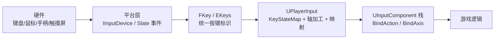
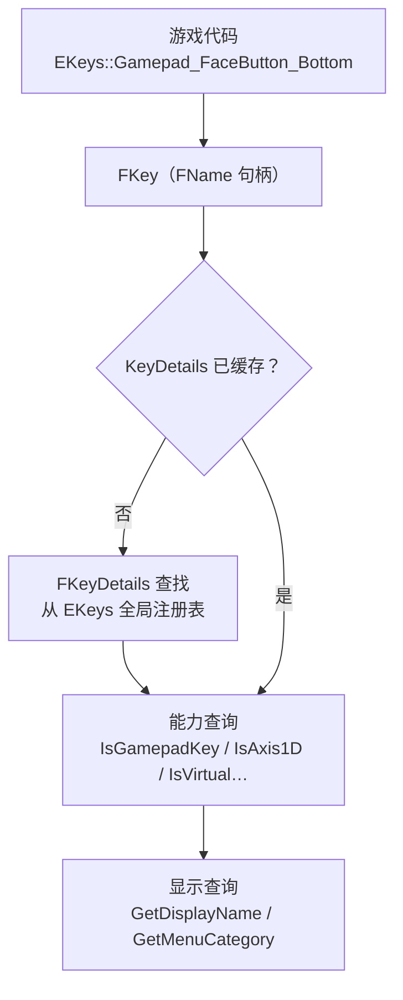
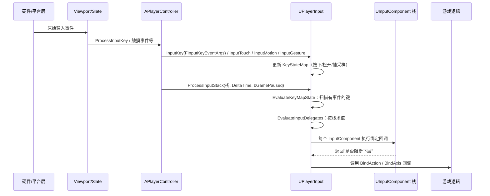
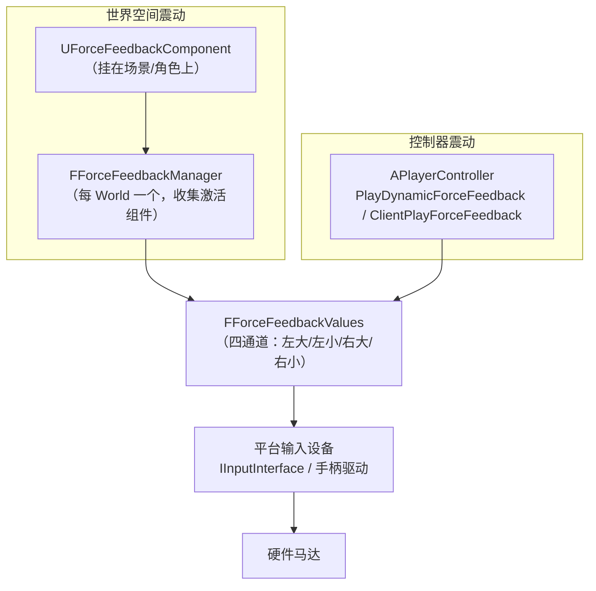
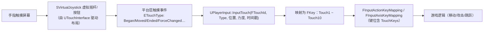

# 10 · 输入设备抽象与手柄触控
> 版本基准：UE 5.8.0（本机 `Engine/Build/Build.version`：CL 55116800，分支 `++UE5+Release-5.8`）。
> 兼容性边界：适用于 UE5.8 编辑器/运行时，UE4.27 与早期 UE5 仅作迁移背景，具体模块以正文为准。
> 官方参考：[Unreal Engine UE5.8 官方文档总页](https://dev.epicgames.com/documentation/en-us/unreal-engine)。
> 最后更新：2026-08-06（本轮元数据维护）。

> 面向 UE 5.x 客户端开发。本文讲解输入设备抽象层：`FKey` / `EKeys` 按键体系、`UPlayerInput` 处理栈（KeyStateMap、轴加工、绑定分发）、手柄与力反馈（`UForceFeedbackComponent` / `FForceFeedbackEffect` / `PlayDynamicForceFeedback`）、移动端触控（`UTouchInterface` / 触摸事件）、`UInputSettings` 全局配置，以及它们与 Enhanced Input 的协作关系。
>
> 源码位置（UE 5.8 本机验证）：`Engine\Source\Runtime\InputCore\Classes\InputCoreTypes.h`；`Engine\Source\Runtime\Engine\Classes\GameFramework\PlayerInput.h`、`InputSettings.h`、`TouchInterface.h`、`ForceFeedbackEffect.h`、`Components\ForceFeedbackComponent.h`、`Engine\LocalPlayer.h`。

## 一、概述

UE 的输入系统是一条**多层抽象链**：平台硬件 → 平台输入设备插件（`IInputDevice`）→ 统一的按键标识（`FKey`）→ `UPlayerInput` 状态与加工 → `UInputComponent` 绑定分发 → 游戏逻辑。理解每一层，才能回答"手柄震动为什么不响""手机虚拟摇杆怎么配置""触摸事件在哪拿"这类问题。



本篇文章聚焦**设备与按键抽象**本身（而不是具体映射方案）：`FKey` 怎么表示一个按键、`UPlayerInput` 怎么处理一帧输入、手柄力反馈和触控走什么路径、全局配置在哪里，以及它们与 Enhanced Input（见 02 篇）如何共存。

> 一句话结论：**`FKey` 是两代输入系统共同的"货币"**——旧系统用它做 Axis/Action Mappings，Enhanced Input 的 `FEnhancedActionKeyMapping` 也用它；力反馈、触控、设备 ID 这些能力则在两代系统之下共享。

## 二、核心概念速览

| 概念 | 类 / 类型 | 作用 | 关键点 |
| --- | --- | --- | --- |
| 键标识 | `FKey` | 一个按键/轴/触摸点的统一标识 | 本质是 FName + 惰性 `FKeyDetails` 元数据 |
| 键注册表 | `EKeys` | 全部内置键的静态注册表与常量 | `EKeys::Gamepad_LeftX` 等，可运行时 `AddKey` 扩展 |
| 键详情 | `FKeyDetails` | 键的类型标记（手柄/触摸/轴/虚拟键…） | 轴类型、配对轴、虚拟键值、菜单分类 |
| 输入事件参数 | `FInputKeyEventArgs` | 一次按键事件的完整参数包 | Key / Event / InputDevice / Delta / 时间戳（5.6+） |
| 玩家输入 | `UPlayerInput` | 每玩家输入处理器 | 维护 `KeyStateMap`、执行轴加工、驱动绑定分发 |
| 输入组件 | `UInputComponent` | 绑定的容器，按栈优先级求值 | `PushInputComponent` 压栈，可阻断下层 |
| 轴属性 | `FInputAxisProperties` | 轴的加工参数 | DeadZone / Sensitivity / Exponent / bInvert |
| 键映射 | `FInputActionKeyMapping` / `FInputAxisKeyMapping` | 旧输入系统的映射条目 | Project Settings 或运行时增删 |
| 力反馈组件 | `UForceFeedbackComponent` | 世界空间中放置的震动源 | 衰减、循环、强度乘子，挂 SceneComponent |
| 震动效果 | `UForceFeedbackEffect` | 四通道震动曲线资产 | LeftLarge / LeftSmall / RightLarge / RightSmall |
| 触控界面 | `UTouchInterface` | 移动端虚拟摇杆/按钮布局资产 | `FTouchInputControl` 列表 + 透明度/重置策略 |
| 输入设置 | `UInputSettings` | 全局输入配置（config=Input） | 默认类、鼠标捕获、触控选项、设备映射 |
| 本地玩家 | `ULocalPlayer` | 一位本地玩家（控制器 ID / 平台用户） | 视口、`GetSubsystem<...>`、平台用户 ID |
| 设备标识 | `FInputDeviceId` / `FTouchId` | 多输入设备识别 | 触摸事件 5.8 起用 `FTouchId`（设备+手指索引） |

## 三、原理详解

### 3.1 FKey 与 EKeys：按键是怎么被表示的

`FKey` 是一个 `USTRUCT`（`InputCoreTypes.h`），对外是一个轻量句柄，内部只有两个成员：

- `FName KeyName`：键的名字（如 `"Gamepad_LeftStick_Up"`），**FKey 的比较、哈希都基于它**；
- `mutable TSharedPtr<FKeyDetails> KeyDetails`：惰性加载的元数据（首次使用时查全局注册表填充）。

`EKeys` 是一个全静态注册表：所有内置键（鼠标、键盘、手柄、触摸、XR、手势、虚拟键）都是它的静态 `FKey` 常量，并注册对应的 `FKeyDetails`。



`FKeyDetails` 的标记体系（`EKeyFlags`）决定了键的"性格"：

| 标记 | 含义 | 典型键 |
| --- | --- | --- |
| `GamepadKey` | 手柄键 | `Gamepad_FaceButton_Bottom` |
| `Touch` | 触摸键 | `Touch1` ~ `Touch10`（`EKeys::TouchKeys[11]`，含光标槽） |
| `MouseButton` | 鼠标按键 | `LeftMouseButton` |
| `ModifierKey` | 修饰键 | `LeftShift` / `LeftControl` / `LeftAlt` / `LeftCommand` |
| `Axis1D` / `Axis2D` / `Axis3D` | 一维/二维/三维轴 | `MouseX` / `Gamepad_Left2D` / `Tilt` |
| `ButtonAxis` | 模拟按钮的轴（按键式摇杆方向） | `Gamepad_LeftStick_Up` 等 |
| `Virtual` | 抽象键，实际值随平台变化 | `Virtual_Gamepad_Accept` / `Virtual_Gamepad_Back`（5.7 起替代旧的 `Virtual_Accept` / `Virtual_Back`） |
| `Gesture` | 手势键 | `Gesture_Pinch` / `Gesture_Flick` / `Gesture_Rotate` / `Gesture_Pan` / `Gesture_Tap` / `Gesture_LongPress` |
| `Deprecated` | 已废弃键 | 旧平台键 |

其他要点：

- **配对轴**：`EPairedAxis`（X/Y）+ `GetPairedAxisKey()` 让 `Gamepad_LeftStick_Up` 之类按键式轴能关联到 `Gamepad_LeftY` 的模拟值；
- **虚拟键**：`GetVirtualKey()` 返回运行时实际键（如某平台 Accept 是 A 键、另一平台是 X 键），UI 层用它显示"正确的按键提示"；
- **运行时扩展**：`EKeys::AddKey(FKeyDetails)` / `AddPairedKey` / `AddVirtualKey` / `RemoveKeysWithCategory` 支持游戏注册自定义设备键（配合 `FInputDeviceScope`）；
- **查询**：`EKeys::GetAllKeys(TArray<FKey>&)` 枚举全部键；`EKeys::GetKeyDetails(Key)` 取元数据；`EKeys::ConsoleForGamepadLabels` 控制手柄标签按 Xbox/PS 风格显示。

### 3.2 UPlayerInput 处理栈：一帧输入怎么走

`UPlayerInput`（`UCLASS(config=Input, transient)`）是 **PlayerController 的输入处理器**，网络游戏里**只存在于客户端**。每帧流程：



关键点（源码 `PlayerInput.h`）：

- `InputKey(const FInputKeyEventArgs&)`：入口（5.6 起统一用 `FInputKeyEventArgs`，携带 Key / Event / `FInputDeviceId` / Delta / DeltaTime / NumSamples / `bIsGamepadOverride`；旧的 `FInputKeyParams` 已废弃）；
- `InputTouch`：5.8 起改用 **`FTouchId`**（`FInputDeviceId` + `ETouchIndex` 手指索引）重载，旧签名已标记废弃；
- `InputMotion` / `InputGesture`：惯性传感器与手势输入（捏合/轻扫等）；
- `ProcessInputStack(const TArray<UInputComponent*>&, DeltaTime, bGamePaused)`：**核心分发函数**，子类可覆写；内部先 `EvaluateKeyMapState`（把 KeyStateMap 变化整理成事件对），再 `EvaluateInputDelegates` 逐组件求值；
- `EvaluateInputComponentDelegates` 返回 **true 表示阻断**：该组件吃掉输入后，栈中更低优先级的组件不再求值（被阻断的组件会收到 `EvaluateBlockedInputComponent` 通知，便于重置状态）；
- `DiscardPlayerInput()`：丢弃本帧全部输入（切场景/死亡回放时用）。

`UInputComponent` 的栈式优先级：`PlayerController::PushInputComponent` 把组件压入栈，**栈顶最先求值**；`FInputKeyBinding`（按键）、`FInputActionBinding`（动作名，可带 `FInputChord` 组合键）、`FInputAxisBinding` / `FInputAxisKeyBinding` / `FInputVectorAxisBinding`（轴）、`FInputTouchBinding`（触摸）都在组件里登记。

### 3.3 轴加工：死区 → 灵敏度 → 指数 → 取反

旧输入系统里，每个轴的原始值经过 `FInputAxisProperties` 加工（`FInputAxisProperties` 默认 DeadZone=0.2 / Sensitivity=1.0 / Exponent=1.0 / bInvert=false）：

```
原始采样值
   → 死区裁剪（|v| < DeadZone 归零）
   → × Sensitivity（灵敏度）
   → 指数曲线（Exponent，模拟摇杆非线性）
   → bInvert 取反（Y 轴反转等）
   → 累加进 FKeyState.Value
```

相关 API：`GetAxisProperties(Key)` / `SetAxisProperties(Key, Props)`、`GetInvertAxisKey(Key)` / `InvertAxisKey(Key)`（按键）、`GetInvertAxis(Name)` / `InvertAxis(Name)`（按轴名，作用于该轴全部映射）、`SetMouseSensitivity(X, Y)` / `GetMouseSensitivityX/Y`。`SmoothMouse` 负责把高频鼠标采样按帧平滑。

`FKeyState` 是键的逐帧状态（存在于 `KeyStateMap`，按 FKey 索引）：包含原始值 `RawValue`、加工值 `Value`、按下时长 `TimeDown`、按下标志等。`UPlayerInput` 提供查询：`IsPressed` / `WasJustPressed` / `WasJustReleased` / `GetTimeDown` / `GetKeyValue` / `GetRawKeyValue` / `IsAltPressed` / `IsCtrlPressed` / `IsShiftPressed` / `IsCmdPressed`。

### 3.4 手柄与力反馈

手柄键族：`Gamepad_Left2D`（`Gamepad_LeftX` / `Gamepad_LeftY`）、`Gamepad_Right2D`、`Gamepad_LeftTriggerAxis` / `Gamepad_RightTriggerAxis`、`Gamepad_FaceButton_*`（Bottom/Right/Left/Top）、`Gamepad_LeftShoulder` / `Gamepad_RightShoulder`、`Gamepad_LeftTrigger` / `Gamepad_RightTrigger`、`Gamepad_DPad_*`、`Gamepad_Special_Left` / `Gamepad_Special_Right`、`Gamepad_LeftStick_Up/Down/Left/Right`（按键式轴）等。

力反馈（震动）有三条路径：



1. **组件方式（推荐，可衰减）**：`UForceFeedbackComponent : USceneComponent` 放在世界/角色上，`Play()` / `Stop()` 控制播放；属性 `ForceFeedbackEffect`（震动资产）、`bLooping`、`bIgnoreTimeDilation`、`IntensityMultiplier`、`bOverrideAttenuation` + `AttenuationSettings` / `AttenuationOverrides`（距离衰减）、`OnForceFeedbackFinished` 完成回调；`SetForceFeedbackEffect` / `SetIntensityMultiplier` / `AdjustAttenuation` 运行时修改；
2. **控制器动态震动**：`APlayerController::PlayDynamicForceFeedback(Intensity, Duration, bAffectsLeftLarge, bAffectsLeftSmall, bAffectsRightLarge, bAffectsRightSmall, Action)`，适合受击/命中反馈；`ClientPlayForceFeedback(Effect, Params)` 是服务器 → 客户端的 RPC 版；
3. **底层**：`FForceFeedbackManager`（每 World 单例）收集激活的 `UForceFeedbackComponent`，每帧把各通道强度合入 `FForceFeedbackValues`，PC 的 `ProcessForceFeedbackAndHaptics` → `UpdateForceFeedback(IInputInterface, ControllerId)` 最终写入平台设备（`FPlatformUserId` 定位到具体手柄）。

> 注意：UE 5 起力反馈按**平台用户（PlatformUser）**分发，多手柄/分屏时每个 `ULocalPlayer` 有独立 `FPlatformUserId`，震动只会打到对应玩家的手柄。

### 3.5 触控：TouchInterface 与触摸事件

移动端触控体系：



关键资产与 API：

- **`UTouchInterface`**（资产）：`TArray<FTouchInputControl> Controls` 定义虚拟控件布局；`FTouchInputControl` 含 `MainInputKey` / `AltInputKey`（摇杆水平/垂直轴或按钮键）、贴图（Image1 拇指 / Image2 背景）、Center / VisualSize / ThumbSize / InputScale、`bTreatAsButton` 等；还有激活/非激活透明度、重置时间等表现属性；`Activate(TSharedPtr<SVirtualJoystick>)` 挂到 Slate；
- **默认触控界面**：`UInputSettings::DefaultTouchInterface`（`FSoftObjectPath`，指到 `UTouchInterface` 资产）；`bAlwaysShowTouchInterface` 强制显示、`bShowConsoleOnFourFingerTap`（四指呼出控制台）、`bEnableGestureRecognizer`（手势识别）；
- **`bUseMouseForTouch`**：PC 上用鼠标模拟触摸（移动端调试利器）；
- **触摸键**：`EKeys::TouchKeys[NUM_TOUCH_KEYS]`（Touch1~Touch10 + 光标槽），触摸事件被映射成这些 FKey，从而复用 Action/Axis 映射体系；`ETouchIndex` 与 `FTouchId`（5.8）标识"第几根手指/哪个触屏设备"；
- **蓝图**：Pawn/PC 用 `FInputTouchBinding` 或 Enhanced Input 的 Touch 支持（`UInputTrigger` 层面）处理；UMG 有独立触摸事件（不与游戏输入冲突）。

### 3.6 UInputSettings：全局输入配置

`UInputSettings`（`UCLASS(config=Input, defaultconfig)`）是输入侧最重要的全局设置，常用项：

| 配置 | 说明 |
| --- | --- |
| `DefaultPlayerInputClass` | 默认 `UPlayerInput` 类（Enhanced Input 换 `UEnhancedPlayerInput` 就改这里） |
| `DefaultInputComponentClass` | 默认 `UInputComponent` 类（Enhanced Input 换 `UEnhancedInputComponent`） |
| `ActionMappings` / `AxisMappings` | 旧输入系统的全局映射（编辑器 Project Settings → Input 编辑的就是它们） |
| `DefaultViewportMouseCaptureMode` / `DefaultViewportMouseLockMode` | 鼠标捕获/锁定默认策略（`EMouseCaptureMode` / `EMouseLockMode`） |
| `bCaptureMouseOnLaunch` | 启动即捕获鼠标 |
| `bUseMouseForTouch` | 鼠标模拟触摸 |
| `bEnableLegacyInputScales` | 启用旧版输入缩放兼容 |
| `DefaultTouchInterface` | 默认触控界面资产 |
| `ConsoleKeys` | 打开控制台的按键 |

设备映射（Device Mapping，面向硬件抽象）：`FHardwareDeviceIdentifier`（InputClassName + HardwareDeviceIdentifier + 主类型 + 能力标记）标识一类硬件；`EHardwareDevicePrimaryType`（KeyboardAndMouse / Gamepad / Touch / RacingWheel / FlightStick…）与 `EHardwareDeviceSupportedFeatures`（Gamepad / Touch / ForceFeedback / TriggerHaptics / AudioBasedVibrations…）描述设备能力；`FHardwareDeviceIdentifier::DefaultGamepad` / `DefaultKeyboardAndMouse` / `DefaultMobileTouch` 是内置默认标识；平台级配置在 `UInputPlatformSettings`（`UPlatformSettings` 子类），控制台变量 `input.DeviceMappingPolicy` 控制映射策略。

### 3.7 与 Enhanced Input 的关系

| 维度 | 旧系统（PlayerInput） | Enhanced Input | 共享底座 |
| --- | --- | --- | --- |
| 键标识 | `FKey` / `EKeys` | `FKey` / `EKeys` | **同一套** |
| 输入处理器 | `UPlayerInput` | `UEnhancedPlayerInput`（子类，经 `DefaultPlayerInputClass` 替换） | FKeyState / 设备事件 |
| 绑定组件 | `UInputComponent` | `UEnhancedInputComponent`（子类） | 栈式求值 |
| 映射 | Project Settings 的 Action/Axis Mappings | IMC 资产 | 都落到 FKey |
| 设备识别 | `FInputDeviceId` / `FPlatformUserId` | 相同 | 相同 |
| 力反馈 | PC / ForceFeedbackComponent | 不改变，仍走 PC 与组件 | 相同 |
| 触控 | TouchInterface + TouchKeys | 可用 IMC 映射 Touch 键 | 相同 |

结论：**Enhanced Input 是"映射与手势"层的升级，不是"设备抽象"层的重写**。`FKey`、设备 ID、力反馈、触控管线全部共用；迁移 Enhanced Input 时 `DefaultPlayerInputClass` / `DefaultInputComponentClass` 两行配置即可切换处理器。

## 四、C++ / 蓝图示例

### 4.1 查询按键状态（旧系统兼容查询）

```cpp
// 在 Pawn 或 PC 中
if (const UPlayerInput* PI = PlayerController->PlayerInput)
{
    const bool bJumpHeld    = PI->IsPressed(EKeys::SpaceBar);
    const bool bJumpPressed = PI->WasJustPressed(EKeys::SpaceBar);   // 本帧按下
    const bool bJumpReleased= PI->WasJustReleased(EKeys::SpaceBar);  // 本帧松开
    const float HoldTime    = PI->GetTimeDown(EKeys::SpaceBar);      // 已按住时长
    const float Axis        = PI->GetKeyValue(EKeys::Gamepad_LeftTriggerAxis);
}
```

### 4.2 轴加工与反转

```cpp
// 给右摇杆 X 轴配置死区与灵敏度
FInputAxisProperties Props;
if (PlayerInput->GetAxisProperties(EKeys::Gamepad_RightX, Props))
{
    Props.DeadZone = 0.15f;
    Props.Sensitivity = 1.5f;
    Props.Exponent = 2.f;   // 非线性曲线
    PlayerInput->SetAxisProperties(EKeys::Gamepad_RightX, Props);
}

// 反转 Y 轴（按键 / 按轴名）
PlayerInput->InvertAxisKey(EKeys::Gamepad_RightY);
PlayerInput->InvertAxis(TEXT("LookUp"));  // 作用于所有绑定 LookUp 的键

// 鼠标灵敏度
PlayerInput->SetMouseSensitivity(0.5f, 0.5f);
```

### 4.3 力反馈：组件方式

```cpp
// 给角色挂一个震动组件（也可直接 AddComponent）
UForceFeedbackComponent* FF = NewObject<UForceFeedbackComponent>(this);
FF->bAutoActivate = false;
FF->SetupAttachment(GetRootComponent());
FF->RegisterComponent();

// 使用震动资产（UForceFeedbackEffect，四通道曲线）
FF->SetForceFeedbackEffect(MyRumbleEffect);   // 资产在内容浏览器创建
FF->SetIntensityMultiplier(1.0f);
FF->bLooping = false;
FF->bIgnoreTimeDilation = true;               // 慢动作时震动不跟着变慢
FF->OnForceFeedbackFinished.AddDynamic(this, &AMyCharacter::OnRumbleFinished);
FF->Play();

// 停止
FF->Stop();

// 或者：控制器动态震动（受击反馈，不依赖资产）
PlayerController->PlayDynamicForceFeedback(
    0.6f,               // Intensity
    0.25f,              // Duration（秒）
    true, true, true, true,   // 四个通道是否受影响
    EDynamicForceFeedbackAction::Start);
```

### 4.4 服务器通知客户端震动

```cpp
// 服务器：命中伤害时通知客户端播放
ClientPlayForceFeedback(HitRumbleEffect, /*Params=*/FForceFeedbackParameters(/*bLooping=*/false,
    /*bIgnoreTimeDilation=*/true, /*bPlayWhilePaused=*/false, /*Tag=*/NAME_None));
```

### 4.5 触控与移动端

**资产侧（编辑器）**：

1. 创建 `TouchInterface` 资产 → 添加控件：虚拟摇杆（MainInputKey = `Gamepad_Left2D` 或自定义轴键、AltInputKey 对应垂直轴）与虚拟按钮（如 `Touch1` 键或直接映射到动作键）；
2. Project Settings → Input → 把 `DefaultTouchInterface` 指向该资产；
3. 勾选 `Always Show Touch Interface`（或运行时 `Activate` 显示）；
4. PC 调试勾选 `Use Mouse for Touch`。

**运行时（C++ 侧可编程）**：

```cpp
// 自定义触摸处理：监听 FInputTouchBinding（在 InputComponent 上）
InputComponent->BindTouch(IE_Pressed, this, &AMyCharacter::OnTouchPressed);

void AMyCharacter::OnTouchPressed(ETouchIndex::Type FingerIndex, FVector Location)
{
    // FingerIndex 对应 Touch1~Touch10；Location 为视口空间坐标
}

// 蓝图侧：Input Touch 事件（InputComponent 的 Touch 事件节点）同样可用。
```

> 现代移动项目推荐把触摸控件映射到 **Enhanced Input**（IMC 里把 `Touch1` 等 FKey 映射给 InputAction），让手势/死区/连点统一走 Trigger/Modifier 管线。

### 4.6 输入模式与鼠标捕获

```cpp
// 游戏模式：捕获鼠标并锁定（FPS 默认）
PlayerController->SetInputMode(FInputModeGameOnly());

// UI 模式：不捕获鼠标
PlayerController->SetInputMode(FInputModeUIOnly());

// 全局默认策略在 UInputSettings：
// DefaultViewportMouseCaptureMode = CaptureDuringMouseDown / CapturePermanently / NoCapture ...
// DefaultViewportMouseLockMode    = DoNotLock / LockOnCapture / LockAlways ...
```

### 4.7 蓝图侧要点

1. **旧系统**：Project Settings → Input 增删 Axis/Action Mappings；蓝图 `InputAction` / `InputAxis` 事件（旧）或 `Bind Action to Key`；
2. **查询**：蓝图节点 `Is Input Key Down`、`Was Input Key Just Pressed`、`Get Input Key Time Down`、`Get Input Axis Key Value`（`UPlayerInput` 函数已暴露）；
3. **力反馈**：`Play Force Feedback`（组件上）、PC 的 `Play Dynamic Force Feedback` 节点；
4. **触控**：PC/Pawn 的 Touch 事件节点；UMG 的 `OnTouch` 系列事件；
5. **调试**：控制台 `ShowDebug Input` 显示每键状态与时间；`ShowDebug` 大类里也有力反馈信息。

## 五、最佳实践

1. **新项目直接上 Enhanced Input**：本文的设备抽象（FKey/力反馈/触控）照常使用，映射层用 IMC；旧系统只保留给兼容需求。
2. **键名即契约**：`FKey` 比较走 FName，跨模块传递键位时保持大小写一致；自定义键用 `EKeys::AddKey` 注册并在启动时完成，避免运行时查找失败。
3. **力反馈三选一**：世界空间震动用 `UForceFeedbackComponent`（自动衰减）；瞬时反馈用 `PlayDynamicForceFeedback`；服务器驱动用 `ClientPlayForceFeedback`。别混用导致双倍强度。
4. **震动强度控制**：提供全局强度乘子（`PC->ForceFeedbackScale` 或组件 `IntensityMultiplier`），菜单里给玩家"震动开关/强度"选项。
5. **多手柄注意 PlatformUser**：分屏/多手柄时用 `ULocalPlayer::GetPlatformUserId()` 与 `FInputDeviceId` 区分设备，力反馈与键位绑定都按玩家隔离。
6. **移动端性能**：TouchInterface 控件数保持精简；虚拟摇杆用 `InputScale` 与死区（Axis Properties）防漂移；`bShowConsoleOnFourFingerTap` 仅开发构建开启。
7. **轴加工统一配置**：死区/灵敏度/曲线写进 `FInputAxisProperties` 或 Enhanced Input 的 Modifier，不要在业务回调里手写。
8. **鼠标模式显式化**：每个 UI 界面进出都显式 `SetInputMode` + 设置捕获/锁定，不要依赖上一次状态残留。

## 六、常见问题 FAQ

**Q1：手柄没反应？**
先查设备是否被识别：控制台 `ShowDebug Input` 看键是否产生事件；检查映射用的键名（`Gamepad_*` 家族）是否与输入设备输出一致；Enhanced Input 项目检查 IMC 是否已添加、是否被更高优先级上下文屏蔽；Windows 上检查 XInput/GameInput 插件启用状态。

**Q2：震动不响？**
按链路排查：组件 `Play()` 是否调用、`bLooping` 与 `IntensityMultiplier` 是否正常、`AttenuationSettings` 是否把距离衰减成 0、PC 的 `ForceFeedbackScale` 是否为 0、`ULocalPlayer` 的 `FPlatformUserId` 是否对应物理手柄、平台驱动是否支持 ForceFeedback（`EHardwareDeviceSupportedFeatures` 检查）。

**Q3：触摸事件收不到？**
检查 `DefaultTouchInterface` 是否配置且 `bAlwaysShowTouchInterface`（移动端）；PC 模拟触摸需 `bUseMouseForTouch`；触摸映射的键（`Touch1` 等）是否在映射表里；5.8 起 `InputTouch` 使用 `FTouchId` 重载，旧签名已废弃，自定义子类注意覆写正确版本。

**Q4：`WasJustPressed` 与 `IsPressed` 有什么区别？**
`WasJustPressed` 只在"本帧从松开变按下"那一帧为 true（边缘触发）；`IsPressed` 是持续按住都为 true（电平触发）。连点检测用前者，按住加速用后者。

**Q5：旧映射与 Enhanced Input 能共存吗？**
能。`UEnhancedPlayerInput` / `UEnhancedInputComponent` 是子类替换，旧 Action/Axis 映射在兼容层仍可工作；但同一键尽量只在一套系统里绑定，避免双重触发。迁移时逐动作替换并删除旧映射。

**Q6：摇杆漂移怎么办？**
提高该轴 `FInputAxisProperties::DeadZone`（旧系统）或使用 `DeadZone` Modifier（Enhanced Input）；`Smooth` Modifier 可进一步抑制抖动；硬件层面支持校准的（如 Switch Pro）建议开放校准 UI。

**Q7：虚拟键（Virtual_Gamepad_Accept）怎么用？**
UI 提示用 `EKeys::Virtual_Gamepad_Accept.GetVirtualKey()` 拿当前平台实际键（5.7 起旧 `Virtual_Accept` 已废弃）；游戏逻辑绑定建议直接绑具体键族（FaceButton_Bottom 等），虚拟键用于"平台一致的确定/返回"语义。

## 七、关联阅读

- [02-EnhancedInput增强输入](02-EnhancedInput增强输入.md)：映射与手势层的现代方案；本文的设备抽象（FKey/力反馈/触控）是它的底座。
- [07-相机系统与视口](07-相机系统与视口.md)：鼠标捕获/锁定与 `ULocalPlayer::GetViewportClient`、`CalcSceneView` 的视口体系紧密相关。
- [04-委托事件与对象通信](04-委托事件与对象通信.md)：`OnForceFeedbackFinished` 等输入侧动态委托的绑定模式。
- [01-GameplayAbilitySystem能力系统](01-GameplayAbilitySystem能力系统.md)：技能内部等待按键输入用 `UAbilityTask_WaitInputPress` 等任务（见 09 篇）。
- [09-GameplayTask任务框架](09-GameplayTask任务框架.md)：输入触发的持续玩法逻辑（蓄力/引导）适合用 GameplayTask 承载。
