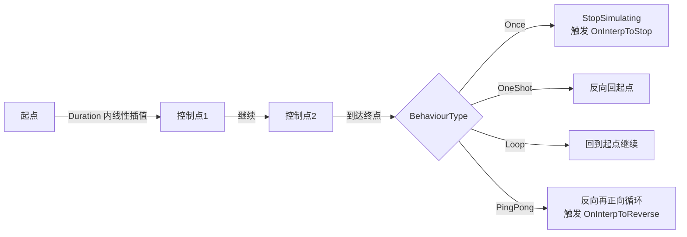
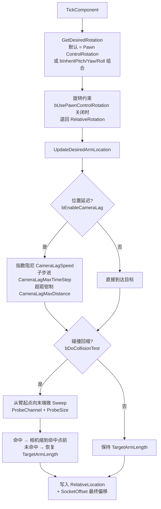

# 11 常用移动与辅助组件

> 适用版本：UE 5.8（以本机 `C:\Program Files\Epic Games\UE_5.8\Engine` 安装源码为基准，逐行核对）。API 路径基于 `Engine/Source/Runtime/Engine/Classes` 与 `Engine/Plugins/Runtime/CableComponent`。

## 一、概述

除了 `UCharacterMovementComponent`（角色移动，见本分类 06 篇），引擎还内置了一批"小而专"的移动/辅助组件，覆盖弹道、旋转、路径插值、相机臂、绳索等高频需求：

| 组件 | 一句话定位 | 典型用途 |
| --- | --- | --- |
| `UProjectileMovementComponent` | 无物理刚体的**运动学弹道**（抛物线/追踪/反弹） | 子弹、火球、投掷物 |
| `URotatingMovementComponent` | 让附属 Actor/组件按角速度旋转 | 旋转门、风扇、装饰物 |
| `UInterpToMovementComponent` | 沿控制点路径**匀速插值**移动（去/回/往返） | 巡逻浮台、电梯、平台谜题 |
| `USpringArmComponent` | 第三人称**相机臂**：长度、碰撞回缩、延迟跟随手柄 | 第三人称相机、炮塔瞄准臂 |
| `UCableComponent` | 用 **Verlet 积分**模拟绳索/线缆 | 绳索桥、钩爪线、电线 |

它们的共同特征：**不依赖 Chaos 物理模拟**（纯运动学、确定性、可预测），开销极低，适合大量放置。理解它们的内部 Tick 逻辑，能帮你判断"该用哪个、参数怎么调、什么时候要自己写"。

> 5.8 注意：`UInterpToMovementComponent` 位于 `Engine\Classes\Components\InterpToMovementComponent.h`（Components 目录），与 `UProjectileMovementComponent`/`URotatingMovementComponent`（GameFramework 目录）不同——老教程里它在 `GameFramework` 下，头文件包含路径以 5.8 为准。

## 二、核心概念

| 概念 | 组件 | 说明 |
| --- | --- | --- |
| `UpdatedComponent` | 全部 | `UMovementComponent` 移动的目标场景组件（通常是被驱动的根组件） |
| `InitialSpeed` / `MaxSpeed` | Projectile | 初始速度（>0 时把 Velocity 当方向）；速度上限 |
| `bShouldBounce` | Projectile | 开启反弹；关闭则首次命中即停 |
| `Bounciness` / `Friction` | Projectile | 反弹恢复系数（法向）与切向摩擦 |
| `bIsHomingProjectile` | Projectile | 追踪模式：朝 `HomingTargetComponent` 加速 |
| `MaxSimulationTimeStep` / `MaxSimulationIterations` | Projectile / InterpTo | 子步进上限：把一帧拆成多步，防止高速穿透 |
| `RotationRate` / `PivotTranslation` | Rotating | 角速度（deg/s）与旋转枢轴偏移 |
| `ControlPoints` / `Duration` | InterpTo | 路径点（可相对）与单程时长 |
| `BehaviourType` | InterpTo | `EInterpToBehaviourType`：Once/OneShot/Loop/ PingPong |
| `TargetArmLength` | SpringArm | 相机臂长度 |
| `bDoCollisionTest` / `ProbeChannel` / `ProbeSize` | SpringArm | 碰撞回缩：沿臂做球体探测，防止相机穿墙 |
| `CameraLagSpeed` / `CameraRotationLagSpeed` | SpringArm | 位置/旋转延迟（阻尼）速度 |
| `bUsePawnControlRotation` / `bInheritPitch/Yaw/Roll` | SpringArm | 臂旋转的来源与继承规则 |
| `CableLength` / `NumSegments` | Cable | 绳索长度与模拟分段数 |
| `SubstepTime` / `SolverIterations` | Cable | Verlet 积分子步长与迭代次数 |
| `AttachEndTo` / `EndLocation` | Cable | 绳索末端锚点（组件引用 + 插槽名/相对位置） |

## 三、原理详解（Mermaid）

### 3/1 UProjectileMovementComponent：弹道模拟

```mermaid
flowchart TD
    A["TickComponent(DeltaTime)"] --> B{HasStoppedSimulation?}
    B -- 是 --> Z[return]
    B -- 否 --> C[ShouldUseSubStepping?<br/>按 MaxSimulationTimeStep 拆子步]
    C --> D[循环: GetSimulationTimeStep<br/>RemainingTime/Iterations]
    D --> E[ComputeVelocity<br/>Velocity += 重力 * ProjectileGravityScale<br/>+ Homing 加速度(若有目标)]
    E --> F[ComputeMoveDelta<br/>MoveDelta = Velocity * TimeSlice]
    F --> G{MoveUpdatedComponent<br/>Sweep 移动}
    G -- 无碰撞 --> H[提交位置与旋转<br/>bRotationFollowsVelocity 时朝向速度]
    G -- 碰撞 --> I[HandleImpact(Hit)]
    I --> J{bShouldBounce?}
    J -- 否 --> K[StopSimulating<br/>触发 OnProjectileStop]
    J -- 是 --> L[按 Bounciness/Friction 反射速度<br/>速度低于阈值 → StopSimulating]
    L --> M[触发 OnProjectileBounce<br/>可在此改写速度实现跳弹]
    K --> Z
    M --> D
    H --> D
```

关键 API（`ProjectileMovementComponent.h` 已验证）：

```cpp
DECLARE_DYNAMIC_MULTICAST_DELEGATE_TwoParams(FOnProjectileBounceDelegate, const FHitResult&, ImpactResult, const FVector&, ImpactVelocity);
DECLARE_DYNAMIC_MULTICAST_DELEGATE_OneParam(FOnProjectileStopDelegate, const FHitResult&, ImpactResult);

UPROPERTY(EditAnywhere, BlueprintReadWrite, Category=Projectile) float InitialSpeed;
UPROPERTY(EditAnywhere, BlueprintReadWrite, Category=Projectile) float MaxSpeed;
UPROPERTY(EditAnywhere, BlueprintReadWrite, Category=Projectile) uint8 bRotationFollowsVelocity:1;
UPROPERTY(EditAnywhere, BlueprintReadWrite, Category=Projectile) uint8 bShouldBounce:1;
UPROPERTY(EditAnywhere, BlueprintReadWrite, Category=Projectile) float Bounciness;   // 法向恢复系数
UPROPERTY(EditAnywhere, BlueprintReadWrite, Category=Projectile) float Friction;    // 切向保留比例
UPROPERTY(EditAnywhere, BlueprintReadWrite, Category=Projectile) float BounceVelocityStopSimulatingThreshold;
UPROPERTY(EditAnywhere, BlueprintReadWrite, Category=Projectile) float ProjectileGravityScale;
UPROPERTY(EditAnywhere, BlueprintReadWrite, Category=Projectile) float HomingAccelerationMagnitude;
UPROPERTY(EditAnywhere, BlueprintReadWrite, Category=Projectile) TWeakObjectPtr<USceneComponent> HomingTargetComponent;
UPROPERTY(EditAnywhere, BlueprintReadWrite, Category=ProjectileSimulation) float MaxSimulationTimeStep;
UPROPERTY(EditAnywhere, BlueprintReadWrite, Category=ProjectileSimulation) int32 MaxSimulationIterations;

UFUNCTION(BlueprintCallable) void SetVelocityInLocalSpace(FVector NewVelocity); // 局部空间初速
UFUNCTION(BlueprintCallable) void StopSimulating(const FHitResult& HitResult);
```

要点：

- **速度合成**：`ComputeVelocity` 每步先加 `重力加速度 * ProjectileGravityScale`，追踪模式下再朝 `HomingTargetComponent` 位置施加 `HomingAccelerationMagnitude` 加速度；
- **子步进**：`MaxSimulationTimeStep`（默认 1/60）与 `MaxSimulationIterations`（默认 4）决定一帧最多拆几步。高速弹体（如狙击枪子弹）必须缩小步长，否则 Sweep 仍可能漏检薄墙；
- **反弹物理**：`HandleImpact` 在 5.8 默认返回 `EHandleHitWallResult::Deflect` 以支持多次反弹与滑行；`Bounciness` 管法向、`Friction` 管切向，`bBounceAngleAffectsFriction` 可让擦地角度影响摩擦；
- **网络**：组件自带插值支持——`SetInterpolatedComponent` + `MoveInterpolationTarget` 用于客户端平滑服务器位置的弹体（`bInterpMovement`/`bInterpRotation`）；
- **停止判定**：`IsVelocityUnderSimulationThreshold()`（`Velocity/SizeSquared() < FMath::Square(BounceVelocityStopSimulatingThreshold)`）为真时停止并广播 `OnProjectileStop`。

### 3/2 URotatingMovementComponent：恒定旋转

`RotatingMovementComponent.h` 只有三个核心参数：

```cpp
UPROPERTY(EditAnywhere, BlueprintReadWrite, Category=RotatingMovement) FRotator RotationRate; // deg/s，如 (0, 90, 0)
UPROPERTY(EditAnywhere, BlueprintReadWrite, Category=RotatingMovement) FVector PivotTranslation; // 枢轴偏移（相对 UpdatedComponent）
UPROPERTY(EditAnywhere, BlueprintReadWrite, Category=RotatingMovement) uint32 bRotationInLocalSpace:1; // 本地空间旋转
```

每帧 Tick：`RotationRate * DeltaTime` 加到 `UpdatedComponent` 的相对旋转上。`PivotTranslation` 允许绕"偏移后的枢轴"旋转（如旋转门绕侧边铰链）。

### 3/3 UInterpToMovementComponent：控制点路径

`InterpToMovementComponent.h` 核心结构：

```cpp
enum class EInterpToBehaviourType : uint8
{
	Once,       // 只走一次，到达终点停止
	OneShot,    // 走一次后反向回到起点（相当于"往返一次"）
	Loop,       // 循环
	PingPong,   // 往返循环
};

USTRUCT()
struct FInterpControlPoint
{
	UPROPERTY(EditAnywhere, Category=InterpToMovement) FVector Position;  // 路径点位置
	UPROPERTY(EditAnywhere, Category=InterpToMovement) bool bIsRelative; // 相对起点还是世界坐标
};

UPROPERTY(EditAnywhere, BlueprintReadWrite, Category=InterpToMovement) float Duration;   // 单程秒数
UPROPERTY(EditAnywhere, BlueprintReadWrite, Category=InterpToMovement) EInterpToBehaviourType BehaviourType;
UPROPERTY(EditAnywhere, BlueprintReadWrite, Category=InterpToMovement) TArray<FInterpControlPoint> ControlPoints;
UPROPERTY(EditAnywhere, BlueprintReadWrite, Category=InterpToMovement) uint32 bPauseOnImpact:1;
UPROPERTY(EditAnywhere, BlueprintReadWrite, Category=InterpToMovement) ETeleportType TeleportType = ETeleportType::None;
```

事件委托：`OnInterpToReverse`、`OnInterpToStop`、`OnWaitBeginDelegate`（等待/暂停时）、`OnResetDelegate`。5.8 同样提供 `MaxSimulationTimeStep` / `MaxSimulationIterations` 子步进，以及 `AddControlPointPosition(Pos, bIsRelative)` 动态加点。



### 3/4 USpringArmComponent：相机臂

`SpringArmComponent.h` 关键成员：

```cpp
UPROPERTY(EditAnywhere, BlueprintReadWrite, Category=Camera) float TargetArmLength;   // 臂长
UPROPERTY(EditAnywhere, BlueprintReadWrite, Category=Camera) FVector SocketOffset;    // 末端偏移（相对臂末端）
UPROPERTY(EditAnywhere, BlueprintReadWrite, Category=Camera) FVector TargetOffset;    // 目标偏移（相对臂起点）
UPROPERTY(EditAnywhere, BlueprintReadWrite, Category=CameraCollision) float ProbeSize;
UPROPERTY(EditAnywhere, BlueprintReadWrite, Category=CameraCollision) TEnumAsByte<ECollisionChannel> ProbeChannel;
UPROPERTY(EditAnywhere, BlueprintReadWrite, Category=CameraCollision) uint32 bDoCollisionTest:1; // 碰撞回缩开关
UPROPERTY(EditAnywhere, BlueprintReadWrite, Category=Camera) uint32 bUsePawnControlRotation:1;
UPROPERTY(EditAnywhere, BlueprintReadWrite, Category=Camera) uint32 bInheritPitch:1;
UPROPERTY(EditAnywhere, BlueprintReadWrite, Category=Camera) uint32 bInheritYaw:1;
UPROPERTY(EditAnywhere, BlueprintReadWrite, Category=Camera) uint32 bInheritRoll:1;
UPROPERTY(EditAnywhere, BlueprintReadWrite, Category=Lag) uint32 bEnableCameraLag:1;         // 位置延迟
UPROPERTY(EditAnywhere, BlueprintReadWrite, Category=Lag) uint32 bEnableCameraRotationLag:1; // 旋转延迟
UPROPERTY(EditAnywhere, BlueprintReadWrite, Category=Lag) float CameraLagSpeed;
UPROPERTY(EditAnywhere, BlueprintReadWrite, Category=Lag) float CameraRotationLagSpeed;
UPROPERTY(EditAnywhere, BlueprintReadWrite, Category=Lag) uint32 bUseCameraLagSubstepping:1;
UPROPERTY(EditAnywhere, BlueprintReadWrite, Category=Lag) float CameraLagMaxTimeStep;
UPROPERTY(EditAnywhere, BlueprintReadWrite, Category=Lag) float CameraLagMaxDistance;

virtual FRotator GetDesiredRotation() const;                                        // 期望旋转（约束前）
virtual void UpdateDesiredArmLocation(bool bDoTrace, bool bDoLocationLag, bool bDoRotationLag, float DeltaTime);
```



要点：

- **碰撞回缩**：`bDoCollisionTest` 开启后每帧做一次球体 Sweep，命中就把相机拉到最近合法位置，墙移开后平滑恢复（有独立恢复逻辑，不会瞬间弹跳）；
- **延迟（Lag）**：`CameraLagSpeed` 越低越"飘"；建议开启 `bUseCameraLagSubstepping` 处理低帧率时的抖动；
- **旋转来源**：`bUsePawnControlRotation` 让臂直接采用 Pawn 的 ControlRotation；更常见的做法是关闭它、`bInheritPitch/Yaw` 全开，把臂挂在 Pawn 下由 `APlayerController` 控制旋转；
- `GetDesiredRotation` 是虚函数——需要自定义旋转来源（如跟随目标锁定）时重写它。

### 3/5 UCableComponent：Verlet 绳索

`CableComponent.h`（`Plugins/Runtime/CableComponent`）关键成员：

```cpp
UPROPERTY(EditAnywhere, Category=Cable) FComponentReference AttachEndTo; // 末端锚定组件
UPROPERTY(EditAnywhere, Category=Cable) FName AttachEndToSocketName;     // 锚点插槽名
UPROPERTY(EditAnywhere, Category=Cable) FVector EndLocation;             // 末端位置（相对锚点或自身）
UPROPERTY(EditAnywhere, Category=Cable) float CableLength;
UPROPERTY(EditAnywhere, Category=Cable) int32 NumSegments;
UPROPERTY(EditAnywhere, Category=Cable) float SubstepTime;               // 每个物理子步时长
UPROPERTY(EditAnywhere, Category=Cable) int32 SolverIterations;          // 约束求解迭代
UPROPERTY(EditAnywhere, Category=Cable) bool bEnableStiffness;
UPROPERTY(EditAnywhere, Category=Cable) bool bUseSubstepping;
UPROPERTY(EditAnywhere, Category=Cable) float CableGravityScale;
UPROPERTY(EditAnywhere, Category=Cable) float CableWidth;

void VerletIntegrate(float InSubstepTime, const FVector& Gravity); // Verlet 积分
void PerformSubstep(float InSubstepTime, const FVector& Gravity);  // 约束求解
void SetAttachEndToComponent(USceneComponent* Component, FName SocketName = NAME_None);
```

原理：把绳索离散成 `NumSegments` 段（`NumSegments+1` 个质点），每帧按 `SubstepTime` 拆子步，做 **Verlet 积分**（位置更新 = 旧位置 + 速度外推），随后迭代 `SolverIterations` 次"距离约束"（保持每段长度 = CableLength / NumSegments），起点固定在组件原点、终点固定在 `AttachEndTo`。表现层用 `UCableComponent` 派生自 `UMeshComponent`，用线段（line）渲染，`CableWidth` 控制线宽。

## 四、示例

### 4/1 追踪火球（Projectile）

```cpp
// 生成时设置（C++，示意）
UProjectileMovementComponent* Move = NewObject<UProjectileMovementComponent>(Fireball);
Move->InitialSpeed = 1200/f;
Move->MaxSpeed = 2500/f;
Move->ProjectileGravityScale = 0/2f;
Move->bRotationFollowsVelocity = true;
Move->bShouldBounce = false;
Move->MaxSimulationTimeStep = 1/f / 120/f; // 高速弹体：更小的子步长
Move->RegisterComponent();

// 追踪：命中前把目标组件塞给 HomingTargetComponent
Move->bIsHomingProjectile = true;
Move->HomingAccelerationMagnitude = 3000/f;
Move->HomingTargetComponent = Target->GetRootComponent();
```

```cpp
// 反弹 + 跳弹事件（蓝图同样可用）
Move->bShouldBounce = true;
Move->Bounciness = 0/7f;
Move->Friction = 0/3f;
Move->OnProjectileBounce/AddDynamic(this, &AFireball::OnBounced);

void AFireball::OnBounced(const FHitResult& ImpactResult, const FVector& ImpactVelocity)
{
	// 命中后把速度方向改为随机偏移，实现"弹跳炸弹"
	ProjectileMovement->Velocity = ImpactVelocity/RotateAngleAxis(FMath::FRandRange(-15/f, 15/f), FVector::UpVector);
}
```

### 4/2 升降平台（InterpTo）

```cpp
UInterpToMovementComponent* PlatformMove = ///;
PlatformMove->Duration = 2/f;
PlatformMove->BehaviourType = EInterpToBehaviourType::PingPong;
PlatformMove->bPauseOnImpact = true; // 有人站在上面被卡住时暂停
PlatformMove->AddControlPointPosition(FVector(0, 0, 400), /*bIsRelative=*/true);
```

### 4/3 第三人称相机臂（常用组合）

```cpp
USpringArmComponent* Arm = ///;
Arm->TargetArmLength = 400/f;
Arm->bUsePawnControlRotation = false;   // 由 PlayerController 控制旋转
Arm->bInheritPitch = true;
Arm->bInheritYaw = true;
Arm->bInheritRoll = false;
Arm->bDoCollisionTest = true;
Arm->ProbeSize = 12/f;
Arm->ProbeChannel = ECC_Camera;
Arm->bEnableCameraLag = true;
Arm->CameraLagSpeed = 8/f;
Arm->bUseCameraLagSubstepping = true;
Arm->CameraLagMaxTimeStep = 1/f / 60/f;
```

## 五、最佳实践

1/ **优先组件，其次自写**：以上组件覆盖 90% 的弹道/平台/相机需求；自写移动前先确认子步进、网络插值、物理交互这些"坑"你是否都考虑到了。
2/ **高速弹体必配子步进**：`MaxSimulationTimeStep` 与 `MaxSimulationIterations` 的乘积要覆盖最低帧率（如 `1/120 * 8 = 66ms` 一帧）；子弹速度超过 3000 且要打薄墙时，考虑改用射线检测 + 组件表现（hit-scan）。
3/ **反弹参数的物理直觉**：`Bounciness` 是法向恢复系数（0=不弹，1=完全弹性）；`Friction` 影响切向速度保留比例；想要"地板反弹 + 墙边摩擦"分开调，用 `bBounceAngleAffectsFriction`。
4/ **追踪弹别每帧查目标**：`HomingTargetComponent` 在生成/命中前设置一次；目标销毁时弱引用自动失效，记得在 `OnProjectileStop` 里做兜底。
5/ **相机臂的 Lag 与子步进成对使用**：只开 `bEnableCameraLag` 不开子步进，低帧率下会看到抖动的"阶梯感"；`CameraLagMaxDistance` 防镜头被甩飞。
6/ **InterpTo 的 `bPauseOnImpact`**：平台顶到天花板/被 NPC 挡住时，`true` 会暂停并等障碍消失，`false` 则按行为类型直接掉头/停止——按玩法选，别默认。
7/ **Cable 组件的性能**：`NumSegments` 与 `SolverIterations` 直接乘出开销，绳索数量多时调低；`bUseSubstepping=false` 可省一半子步。
8/ **网络环境**：这些组件默认不在服务器上"权威模拟 + 复制"的配置里；多人项目请明确 `bReplicates` 与插值策略（Projectile 用 `MoveInterpolationTarget`，其余考虑 `AActor` 级复制）。

## 六、FAQ

**Q1：ProjectileMovementComponent 是物理模拟吗？**
不是。它是运动学组件：直接改 `UpdatedComponent` 的变换（Sweep 移动），不经过 Chaos 刚体求解。想要物理反弹/风场/被推动交互，用 `UStaticMeshComponent` + `SimulatePhysics` 或 `UChaosMovementComponent`。

**Q2：为什么我的子弹穿墙？**
单帧位移超过墙体厚度时 Sweep 也可能漏检。降低 `MaxSimulationTimeStep`（子步更细）或提高 `MaxSimulationIterations`；还是不行就换 hit-scan（射线）方案。

**Q3：`bShouldBounce=false` 时命中会发生什么？**
首次命中即 `HandleImpact` → `StopSimulating`：触发 `OnProjectileStop`、停止 Tick、清除 `UpdatedComponent` 引用。注意命中 Actor 的伤害逻辑应写在碰撞回调（`OnComponentHit`）或 `OnProjectileBounce/Stop` 里。

**Q4：InterpTo 的 OneShot 和 Once 有什么区别？**
`Once`：走完就停在终点；`OneShot`：走完**自动反向回起点**再停（"去一次再回来"）。`Loop` 到终点后直接回起点继续；`PingPong` 往返循环并在掉头时触发 `OnInterpToReverse`。

**Q5：SpringArm 的碰撞回缩为什么有时候相机"卡"在墙里？**
回缩只沿臂方向做一次探测；斜墙、薄墙或 `ProbeSize` 过小都会导致残留。调大 `ProbeSize`、用 `ECC_Camera` 专用碰撞通道、必要时打开 `bDrawDebugLagMarkers` 观察探测结果。

**Q6：Cable 组件能和物理交互吗（被手抓住）？**
默认不支持外部碰撞（`bCollide` 相关支持有限）。需求复杂时改用 Chaos 布料或第三方绳索插件；`UCableComponent` 适合纯视觉/简单垂坠场景。

**Q7：RotatingMovementComponent 能转出"变速"效果吗？**
它只有恒定 `RotationRate`。需要加速/减速/缓动时，在 Tick 里手动改 `RotationRate`，或直接用 `FInterpTo`/Timeline 驱动自身旋转。

**Q8：这些组件在服务器/客户端谁执行？**
默认所有端各自 Tick（无权威）。多人弹道通常：服务器模拟 + 广播（`AActor` 复制或 `MoveInterpolationTarget`），客户端预测可选。平台类则常见"服务器权威 + `bReplicateMovement`"。

## 七、关联阅读

- [06-角色移动系统UCharacterMovement](06-角色移动系统UCharacterMovement.md)（复杂角色移动的完整方案，与本文轻量组件互补）
- [07-相机系统与视口](07-相机系统与视口.md)（SpringArm + CameraComponent 组合的完整相机体系）
- [01-引擎基础/02-Actor与Component生命周期](../01-引擎基础/02-Actor与Component生命周期.md)（组件的 Register/Init/Tick 时机）
- [09-物理系统/01-Chaos物理引擎概览](../09-物理系统/01-Chaos物理引擎概览.md)（需要真物理时如何迁移）
- [06-网络同步/02-RPC与属性同步](../06-网络同步/02-RPC与属性同步.md)（移动组件的网络权威与插值）
