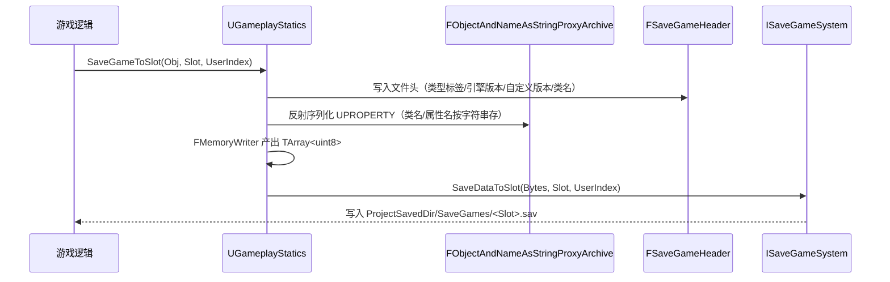
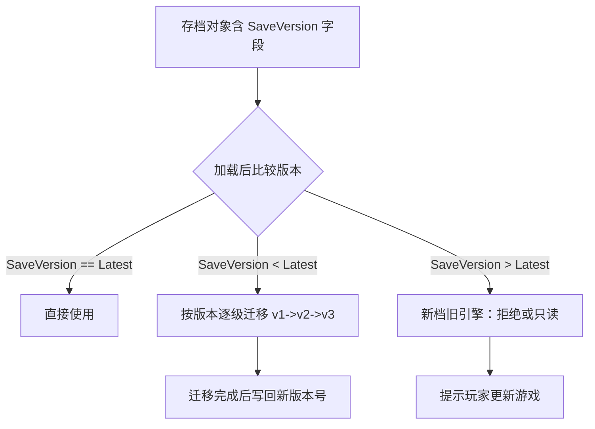
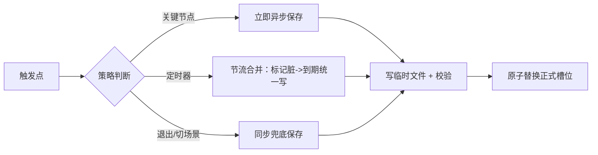

# 12 SaveGame 存档系统与序列化

| 项目 | 内容 |
|---|---|
| 版本基线 | UE 5.8.0（CL 55116800 / `++UE5+Release-5.8`） |
| 适用范围 | 客户端存档读写、槽位管理、序列化原理、版本迁移、与 GameInstance/关卡配合 |
| 事实边界 | 全部 API 均经本机引擎源码只读核对（`Engine\Source\Runtime\Engine\Classes\GameFramework\SaveGame.h`、`Private\GameplayStatics.cpp`、`Public\SaveGameSystem.h`）；标注「待核对」的条目未在本机验证 |
| 官方参考 | https://dev.epicgames.com/documentation/en-us/unreal-engine |
| 最后更新 | 2026-08-07 |

## 概述

SaveGame（存档）系统是 UE 为客户端持久化进度提供的官方方案：以 `USaveGame` 为纯数据容器，借助 UObject 反射序列化（Reflection Serialization）把属性写成二进制，再通过平台相关的 `ISaveGameSystem`（存档系统接口）落到磁盘或平台云存储。它**不负责**游戏逻辑、不直接保存 Actor/World，只负责"数据 ↔ 字节流 ↔ 槽位文件"三段。

本机核对的口径（UE 5.8）：`USaveGame` 定义在 `Engine\Source\Runtime\Engine\Classes\GameFramework\SaveGame.h`，入口 API 集中在 `UGameplayStatics`（`Kismet\GameplayStatics.h`），底层文件系统由 `SaveGameSystem.h` 中的 `ISaveGameSystem` / `FGenericSaveGameSystem` / `FBaseAsyncSaveGameSystem` 实现。

## 核心概念表

| 概念 | 英文 | 说明（本机 5.8 核对） |
|---|---|---|
| 存档对象 | `USaveGame` | 纯数据容器，继承 `UObject`（SaveGame.h:23），自身不实现 IO |
| 每玩家存档 | `ULocalPlayerSaveGame` | 5.x 新增的每 LocalPlayer 存档助手，封装槽名/用户/版本/回调（SaveGame.h:47） |
| 同步保存 | `UGameplayStatics::SaveGameToSlot` | 阻塞写槽，返回 bool（GameplayStatics.h:1167） |
| 异步保存 | `UGameplayStatics::AsyncSaveGameToSlot` | 非阻塞，完成回调 `FAsyncSaveGameToSlotDelegate`（:1155） |
| 同步读取 | `UGameplayStatics::LoadGameFromSlot` | 阻塞读槽，返回 `USaveGame*`（:1211） |
| 异步读取 | `UGameplayStatics::AsyncLoadGameFromSlot` | 完成回调 `FAsyncLoadGameFromSlotDelegate`（:1202） |
| 存在性查询 | `DoesSaveGameExist` | 槽位是否存在（:1175） |
| 删除槽位 | `DeleteGameInSlot` | 删除存档文件（:1231） |
| 原始字节 | `SaveDataToSlot` / `LoadDataFromSlot` | 直接读写 `TArray<uint8>`，绕过对象序列化（:1143/:1191） |
| 文件头 | `FSaveGameHeader` | 引擎级存档头：类型标签/版本/引擎版本/自定义版本/类名（GameplayStatics.cpp:117） |
| 存档系统 | `ISaveGameSystem` | 平台存储抽象：SaveGame/LoadGame/DeleteGame/GetSaveGameNames（SaveGameSystem.h:19） |
| 通用实现 | `FGenericSaveGameSystem` | 写 `ProjectSavedDir/SaveGames/<槽名>.sav`（SaveGameSystem.h:140/171） |
| 蓝图异步节点 | `UAsyncActionHandleSaveGame` | AsyncSaveGameToSlot / AsyncLoadGameFromSlot + Completed 委托（AsyncActionHandleSaveGame.h） |

## 原理详解

### 1. 存档整体链路（时序）

一次同步存档的完整调用链（源码证据见 GameplayStatics.cpp）：



图释：一次同步存档从游戏逻辑到磁盘的完整调用链；`FObjectAndNameAsStringProxyArchive` 负责把 UPROPERTY 反射序列化进 `FMemoryWriter`，`FSaveGameHeader` 先写引擎级头，最后由 `ISaveGameSystem` 平台实现落盘。

关键实现点（GameplayStatics.cpp）：`SaveGameToSlot`（:2428）→ `FMemoryWriter MemoryWriter(OutSaveData, true)` + `FObjectAndNameAsStringProxyArchive Ar(MemoryWriter, false)`（:2375-2381）把对象序列化进字节数组，再调用 `SaveDataToSlot`（:2390）。读取反向：`LoadGameFromSlot`（:2536）→ `LoadDataFromSlot`（:2491）→ `FMemoryReader` + `FObjectAndNameAsStringProxyArchive`（:2467-2484）反序列化出对象。

> 术语对照：`FObjectAndNameAsStringProxyArchive`（对象与名称按字符串代理归档器）会把 **类名与属性名以字符串形式写入**，而不是压缩引用——这让属性重命名/类重命名后的兼容读取成为可能，代价是存档体积略大。

### 2. 序列化细节：文件头与代理归档器

`FSaveGameHeader`（GameplayStatics.cpp:117-130）是引擎级存档头，字段如下（本机核对）：

| 字段 | 含义 |
|---|---|
| `FileTypeTag` | 文件类型标签（`UE_SAVEGAME_FILE_TYPE_TAG`），用于快速识别是否为存档文件 |
| `SaveGameFileVersion` | 引擎存档格式版本（`FSaveGameFileVersion::LatestVersion`） |
| `PackageFileUEVersion` | 打包文件 UE 版本（`GPackageFileUEVersion`） |
| `SavedEngineVersion` | 保存时引擎版本（`FEngineVersion::Current()`） |
| `CustomVersionFormat` / `CustomVersions` | 自定义版本序列化格式与容器（`FCurrentCustomVersions::GetAll()`） |
| `SaveGameClassName` | 存档对象类路径名，加载时据此 `NewObject` |

源码注释明确提示（GameplayStatics.cpp 头部注释）：**这是引擎级版本，对游戏自身的版本变更"无用"（not useful for game-specific version changes）**；游戏级版本需要自己写进存档对象（如 `ULocalPlayerSaveGame` 的 SavedDataVersion 机制，或自建 `SaveVersion` 字段）。

### 3. 槽位与用户索引

- **槽名（SlotName）**：只决定文件名。`FGenericSaveGameSystem`（SaveGameSystem.h:110）的路径规则（:171）：`FString::Printf(TEXT("%sSaveGames/%s.sav"), *FPaths::ProjectSavedDir(), Name)`；目录常量（:140）：`FPaths::ProjectSavedDir() / TEXT("SaveGames/")`。即 PC 上存档默认在 `<项目>\Saved\SaveGames\<槽名>.sav`。
- **用户索引（UserIndex）**：平台用户标识，某些平台忽略。5.x 起通过 `FPlatformMisc::GetPlatformUserForUserIndex` / `GetUserIndexForPlatformUser` 与平台用户（`FPlatformUserId`）互转（SaveGameSystem.cpp:22/223/236），实现按玩家隔离存档。
- **存在性语义**：`DoesSaveGameExist` 只回答"文件在不在"；删除失败与文件不存在要用它区分（GameplayStatics.h:1226-1228 注释）。
- 平台可替换 `ISaveGameSystem` 实现（如主机平台有专用实现），游戏代码无需感知。

### 4. 异步读写与蓝图节点

- 原生异步：`UGameplayStatics::AsyncSaveGameToSlot`（GameplayStatics.h:1155）与 `AsyncLoadGameFromSlot`（:1202），回调签名：`FAsyncSaveGameToSlotDelegate(SlotName, UserIndex, bool bSuccess)`、`FAsyncLoadGameFromSlotDelegate(SlotName, UserIndex, USaveGame*)`（:44-47）。
- 蓝图节点：`UAsyncActionHandleSaveGame`（`Classes\GameFramework\AsyncActionHandleSaveGame.h`）提供 `AsyncSaveGameToSlot` / `AsyncLoadGameFromSlot` 蓝图异步节点，`Completed` 动态多播委托 `FOnAsyncHandleSaveGame(USaveGame*, bool bSuccess)`；它继承 `UBlueprintAsyncActionBase`，可被游戏子类化。
- **重要约束**（头文件注释原文）：*"Keep in mind that some platforms may not support trying to load and save at the same time"* —— 部分平台不支持同时读和写，游戏侧应把存档操作排队/互斥。

### 5. ULocalPlayerSaveGame：每玩家存档助手

5.x 引入的 `ULocalPlayerSaveGame`（SaveGame.h:47）为"每玩家一份存档"提供官方骨架（本机核对方法清单）：

| 方法 | 作用 |
|---|---|
| `SetLocalPlayer` / `GetLocalPlayer` | 绑定/获取 `ULocalPlayer`（:103/:106） |
| `SetSaveSlotName` / `GetSaveSlotName` | 槽名读写（:118/:121） |
| `SaveGameToSlotForLocalPlayer` / `AsyncSaveGameToSlotForLocalPlayer` | 面向已绑定玩家的一键保存（:88/:95） |
| `GetSavedDataVersion` / `GetLatestDataVersion` / `GetInvalidDataVersion` | 数据版本三元组：当前存档版本/最新版本/无效版本（:125/:133/:129） |
| `WasLoaded` / `IsSaveInProgress` / `WasLastSaveSuccessful` / `WasSaveRequested` | 保存状态查询（:137/:141/:145/:149） |
| `InitializeSaveGame` | 初始化（含 `bWasLoaded` 标志，:153） |
| `ResetToDefault` / `HandlePreSave` / `HandlePostSave` / `ProcessSaveComplete` | 生命周期钩子（:157/:171/:178/:186） |

用法示意：子类化它并填 `UPROPERTY` 数据字段，配合 `InitializeSaveGame(LocalPlayer, SlotName, bWasLoaded)` 与版本三元组实现"游戏级版本迁移"（引擎头注释推荐的做法）。

### 6. 数据结构设计与版本迁移

由于 `FSaveGameHeader` 只管引擎级版本，**游戏级兼容必须自建**：



图释：加载后按版本号三分支处理；迁移必须逐级进行并最终写回最新版本号。

设计要点：
- 存档对象内放 `int32 SaveVersion`，每次破坏性变更 +1；迁移函数做成链式（v1→v2、v2→v3），不跳跃。
- 存**数据**而非对象：避免在存档里保存 `UObject` 引用（路径/索引会失效），改用 `FSoftObjectPath`（软对象路径）或自建 ID，加载后查表解析。
- 存档中的 USTRUCT 用 `UPROPERTY` 标注即可被反射序列化；数组/映射（`TArray`/`TMap`/`TSet`）均支持，但结构变更（字段删除/改名）需版本兜底。
- 自定义版本可用引擎的 Custom Versions（`FCustomVersionContainer`）做引擎级配套，但游戏简单场景用自建版本号更直观。

### 7. 与 GameInstance / 关卡 / Subsystem 配合

- **跨关卡持有**：存档对象建议由 `UGameInstance`（或其子类）持有，关卡切换（Level Streaming / Seamless Travel）不销毁，加载存档后统一把数据分发给各系统（玩家状态、背包、任务）。
- **关卡数据配合**：需要保存的关卡状态（可破坏物、开关、NPC 位置）先收敛为"可序列化快照"（USTRUCT 列表），再写进存档对象；不要直接尝试序列化 Actor。
- **Subsystem 分工**：`UGameInstanceSubsystem` 适合做"存档管理器"（保存/加载编排、自动存档节流）；`UWorldSubsystem` 适合做关卡内"存档应用器"（进关卡后把快照落回场景）。存档管理器持 `ULocalPlayerSaveGame`，按玩家索引路由。
- 关联阅读：World/Subsystem 体系见 `../01-引擎基础/07-World关卡与Subsystem体系.md`；字符串类型选型见 `../01-引擎基础/10-FName与FText底层.md`。

### 8. 平台差异与云存档

| 平台 | 存档位置/行为（本机口径或待核对） |
|---|---|
| PC（Windows/Linux/Mac） | `FGenericSaveGameSystem`：`ProjectSavedDir/SaveGames/<槽名>.sav`（本机核对 SaveGameSystem.h:140/171） |
| iOS | 平台实现存在（`Engine\Source\Runtime\IOS\IOSPlatformFeatures\Private\IOSSaveGameSystem.cpp`，本机核对文件存在），位置由平台实现决定 |
| 主机（Xbox/PS/Switch） | 使用平台专用 `ISaveGameSystem` 实现，通常映射到平台存储 API；具体路径「待核对」 |
| 云存档 | 引擎不内置；可选 EOS Player Data Storage、平台云同步等，属「方案示意」 |

> 「待核对」项：各主机平台存档接口细节、云存档服务选型与配额、平台对存档大小/数量限制，均需按目标平台 SDK 文档核实。

### 9. 可序列化类型边界

`USaveGame` 能存什么，取决于 UObject 反射序列化（Reflection Serialization）对类型的支持。常规口径（引擎反射能力，非 5.8 特例）：

| 类型 | 可存档 | 说明 |
|---|---|---|
| 基本类型（bool/int/float/double） | ✅ | 直接 UPROPERTY |
| `FString` / `FName` / `FText` | ✅ | FText 带本地化键，见 10-FName 篇 |
| 枚举 / 结构体 USTRUCT | ✅ | 结构体内部同样按 UPROPERTY 递归 |
| `TArray` / `TMap` / `TSet` | ✅ | 元素须可序列化；TMap 键建议用 FName/基本类型 |
| `FSoftObjectPath` / `FSoftClassPath` | ✅ | 推荐：存档里存软引用，加载后异步解析 |
| `TObjectPtr`（资产/对象强引用） | ⚠️ | 可存但会拖带对象图与加载依赖，一般不用于存档 |
| `AActor*` / `UActorComponent*` | ❌ | 跨存档无效；快照化后再存 |
| Lambda / 函数指针 | ❌ | 不可序列化 |

> 结论：存档字段设计以"值类型 + 软引用 + USTRUCT 快照"为原则，与 `12` 篇"数据而非对象"一致。

### 10. 保存时机与自动存档策略



图释：不同触发点走不同保存路径，落盘统一走"临时文件 + 校验 + 原子替换"，降低写坏档概率（方案示意）。

- **触发点分类**：关键节点（章节完成/检查点）、自动存档（定时 + 脏标记合并）、退出/切后台兜底（可同步）。
- **防写坏档**：先写 `<槽名>.tmp`，校验通过后原子改名覆盖；保留上一份 `backup` 槽用于崩溃恢复（方案示意，引擎不内置）。
- **启动恢复**：进游戏时先 `DoesSaveGameExist` 探测，损坏/缺失时回退备份或新档。
- **性能**：自动存档节流（如 60s 内最多 1 次），异步为主；存档数据量过大时压缩（方案示意，如 zlib 自编码字节再 `SaveDataToSlot`）。

### 11. 排障速查

| 症状 | 排查方向 |
|---|---|
| 读档返回 nullptr | 槽名/UserIndex 不一致；文件损坏；类路径变更（SaveGameClassName 找不到） |
| 旧档读出新字段为默认值 | 未做版本迁移；新字段无默认初始化 |
| 存档文件找不到 | 平台实现差异（主机/云）；`ProjectSavedDir` 在不同打包配置下的差异 |
| 异步保存无回调 | 游戏退出过早；同时读写被平台拒绝（见第 4 节约束） |
| 存档过大/卡顿 | 存了对象图/大数组未压缩；改为快照 + 增量字段 |

## 代码与示例

以下为 C++ 节选（示意结构，非完整工程代码）。

**存档对象（含游戏级版本号）：**

```cpp
// MySaveGame.h（节选）
UCLASS()
class UMySaveGame : public USaveGame
{
    GENERATED_BODY()
public:
    // 游戏级存档版本，破坏性变更时递增并补充迁移逻辑
    UPROPERTY()
    int32 SaveVersion = 3;

    UPROPERTY()
    FString PlayerName;

    UPROPERTY()
    TArray<FItemSaveData> Inventory; // FItemSaveData 为 USTRUCT，仅存数据
};
```

**同步保存/读取：**

```cpp
// MySaveManager.cpp（节选，示意）
bool UMySaveManager::SaveNow(UMySaveGame* Save, const FString& Slot, int32 UserIndex)
{
    return UGameplayStatics::SaveGameToSlot(Save, Slot, UserIndex);
}

UMySaveGame* UMySaveManager::LoadWithMigration(const FString& Slot, int32 UserIndex)
{
    UMySaveGame* Save = Cast<UMySaveGame>(UGameplayStatics::LoadGameFromSlot(Slot, UserIndex));
    if (!Save) { return nullptr; }
    while (Save->SaveVersion < UMySaveGame::LatestVersion) // 链式迁移
    {
        if (Save->SaveVersion == 1) { MigrateV1ToV2(Save); }
        else if (Save->SaveVersion == 2) { MigrateV2ToV3(Save); }
        Save->SaveVersion++;
    }
    return Save;
}
```

**异步保存（原生回调）：**

```cpp
// 节选：发起异步存档
UGameplayStatics::AsyncSaveGameToSlot(
    SaveObject, Slot, UserIndex,
    FAsyncSaveGameToSlotDelegate::CreateUObject(this, &UMySaveManager::OnAsyncSaveDone));

void UMySaveManager::OnAsyncSaveDone(const FString& Slot, int32 UserIndex, bool bSuccess)
{
    // bSuccess 为 false 时记录日志并按策略重试
}
```

**版本迁移函数示例（链式）：**

```cpp
// 节选：v1->v2 迁移：把旧字段改名为新字段并补默认值
void UMySaveManager::MigrateV1ToV2(UMySaveGame* Save)
{
    if (Save->OldPlayerName_Legacy.IsEmpty()) { return; } // 旧字段
    Save->PlayerName = Save->OldPlayerName_Legacy;        // 映射到新字段
    Save->OldPlayerName_Legacy.Empty();                   // 清理，避免重复迁移
    Save->Inventory.Shrink();                             // 示例：补结构修正
}
```

**蓝图节点用法示意**：`Async Save Game to Slot`（`UAsyncActionHandleSaveGame`）→ 成功/失败引脚连 `Completed` 事件（SaveGame, bSuccess）。

**蓝图流程示意**：触发 → `Create Save Game Object`（蓝图节点，创建 `UMySaveGame`）→ 填数据 → `Async Save Game to Slot`；读档反向：`Async Load Game from Slot` → 成功后 `Cast` 到目标类。

## 最佳实践

1. **优先异步**：存档涉及磁盘 IO，不要在游戏线程主循环里频繁同步写；自动存档用异步 + 节流（如每 60s 或关键节点）。
2. **读写互斥**：遵守"部分平台不支持同时读写"约束，用队列/状态机串行化存档操作（头文件注释依据）。
3. **数据而非对象**：存档里只放 USTRUCT/基本类型/FSoftObjectPath；不保存 Actor/组件/资源硬引用。
4. **版本号前置**：`SaveVersion` 必须是最早序列化的字段之一；迁移链式、单向、幂等。
5. **防损坏**：引擎无内置校验；「方案示意」——写临时文件 + 完成后原子改名、自算 CRC 存元数据、保留上一档备份。
6. **槽位元数据**：槽列表用 `GetSaveGameNames`（`ISaveGameSystem`）或自维护索引，附带时间戳/截图/摘要，避免全量加载判断。
7. **每玩家隔离**：多人同机场景用 `ULocalPlayerSaveGame` + 玩家索引，避免串档。
8. **云存档提示**：接入平台云同步时，注意"本地最近写入"与"云端版本"冲突策略（保留双版本或时间戳合并，方案示意）。

## FAQ

1. **Q：`USaveGame` 为什么能自动序列化？** A：它继承 `UObject`，引擎通过反射（`FObjectAndNameAsStringProxyArchive` + UPROPERTY）在保存/加载时自动读写标注的属性，无需手写序列化函数。
2. **Q：存档文件在哪里？** A：PC 通用实现为 `<项目>\Saved\SaveGames\<槽名>.sav`（本机核对 SaveGameSystem.h:171）；主机/云平台由平台 `ISaveGameSystem` 决定（待核对）。
3. **Q：`UserIndex` 是什么？** A：平台用户索引，用于多用户/多账号隔离；5.x 经 `FPlatformMisc::GetPlatformUserForUserIndex` 转为 `FPlatformUserId`（SaveGameSystem.cpp:22）；部分平台忽略。
4. **Q：存档损坏（读取失败）会怎样？** A：`LoadGameFromSlot` 返回 nullptr / 异步回调 bSuccess=false；需要回退策略（重试、加载备份、重置档），引擎不提供自动修复。
5. **Q：能直接保存 Actor/关卡状态吗？** A：不能直接保存 Actor 引用；应把需要保存的状态收敛为 USTRUCT 快照，加载后重建/应用（见"与 GameInstance/关卡配合"节）。
6. **Q：游戏更新后旧存档怎么办？** A：自建 `SaveVersion` + 链式迁移；引擎级 `FSaveGameHeader` 只管引擎版本，游戏版本必须自己管（GameplayStatics.cpp 注释）。
7. **Q：同步与异步可以混用吗？** A：可以但建议统一；混用时注意同时读写约束与回调线程（异步完成回调回到游戏线程，但不应依赖其顺序）。
8. **Q：存档能加密吗？** A：引擎默认明文；可用 `SaveDataToSlot` 自行加密字节再写入（方案示意），注意平台合规与性能。
9. **Q：存档里放 `FText` 安全吗？** A：`FText` 可序列化，但涉及本地化键；纯展示文本建议存 key 或 `FString`，详见 `../01-引擎基础/10-FName与FText底层.md`。
10. **Q：GAS 角色属性要存档吗？** A：可存 AttributeSet 快照（数值/标签），加载后应用；注意与网络权威（服务器）配合，详见 `01-GameplayAbilitySystem能力系统.md`。
11. **Q：云存档与本地存档冲突怎么办？** A：引擎不内置云存档；接入平台云同步时需自定冲突策略（方案示意）：时间戳合并、保留双版本供选择，或"本地优先 + 云端备份"。
12. **Q：多存档槽位怎么管理？** A：槽名即文件名（PC 口径）；槽列表可用 `GetSaveGameNames`（`ISaveGameSystem`）枚举，或自建"槽位索引存档"记录各槽元数据（时间戳/截图/摘要）。

## 关联阅读

- [01-GameplayAbilitySystem能力系统.md](01-GameplayAbilitySystem能力系统.md)（GAS 状态与存档配合）
- [05-蓝图与C++协作.md](05-蓝图与C++协作.md)（反射/UPROPERTY 序列化基础）
- [../01-引擎基础/10-FName与FText底层.md](../01-引擎基础/10-FName与FText底层.md)（字符串类型选型）
- [../01-引擎基础/07-World关卡与Subsystem体系.md](../01-引擎基础/07-World关卡与Subsystem体系.md)（GameInstance/Subsystem 持有与分发）
- [13-背包与装备系统.md](13-背包与装备系统.md)（存档数据的典型消费方）

## 更新日志

- 2026-08-07：初稿；本机 UE5.8（CL 55116800）核对 USaveGame/ULocalPlayerSaveGame/GameplayStatics 存档 API/FSaveGameHeader/FGenericSaveGameSystem 路径规则。
