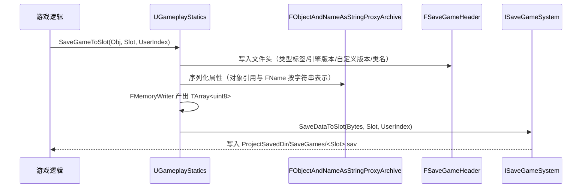
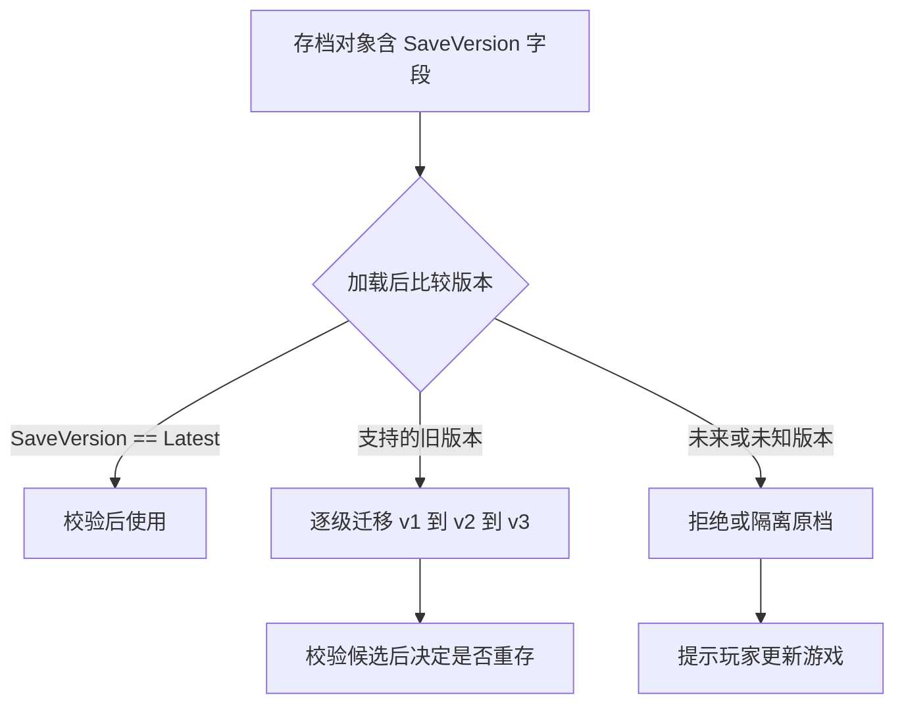
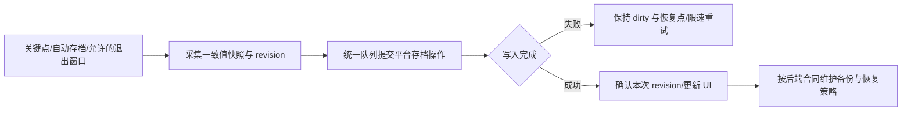

# 12 SaveGame 存档系统与序列化
> 知识成熟度：L2（本轮审计修订时补标）。

| 项目 | 内容 |
|---|---|
| 版本基线 | UE 5.8.0（CL 55116800 / `++UE5+Release-5.8`） |
| 适用范围 | 客户端存档读写、槽位管理、序列化原理、版本迁移、与 GameInstance/关卡配合 |
| 事实边界 | 保留 2026-08-07 原文记录的本机源码核对与行号，作为历史线索；本次 2026-09-30 增补仅核阅 Epic 官方文档并作静态推演，未重新读取 UE 本机源码、编译示例或运行存读档测试。历史行号与目标项目版本仍需复核 |
| 官方参考 | https://dev.epicgames.com/documentation/en-us/unreal-engine |
| 最后更新 | 2026-09-30（官方文档核阅与语义修订） |

## 概述

SaveGame（存档）系统是 UE 为客户端持久化进度提供的官方方案：以 `USaveGame` 为纯数据容器，借助 UObject 反射序列化（Reflection Serialization）把属性写成二进制，再通过平台相关的 `ISaveGameSystem`（存档系统接口）写入平台存档槽位。平台云同步或额外云存储接入是另一层能力，不能仅凭保存成功推断云端已同步。它**不负责**游戏逻辑、不直接保存 Actor/World，只负责"数据 ↔ 字节流 ↔ 槽位文件"三段。

历史本机核对记录的口径（UE 5.8，本次未复验）：`USaveGame` 定义在 `Engine\Source\Runtime\Engine\Classes\GameFramework\SaveGame.h`，入口 API 集中在 `UGameplayStatics`（`Kismet\GameplayStatics.h`），底层文件系统由 `SaveGameSystem.h` 中的 `ISaveGameSystem` / `FGenericSaveGameSystem` / `FBaseAsyncSaveGameSystem` 实现。

## 核心概念表

| 概念 | 英文 | 说明（原文 5.8 核对记录；本次补充另注明） |
|---|---|---|
| 存档对象 | `USaveGame` | 纯数据容器，继承 `UObject`（SaveGame.h:23），自身不实现 IO |
| 每玩家存档 | `ULocalPlayerSaveGame` | 5.x 新增的每 LocalPlayer 存档助手，封装槽名/用户/版本/回调（SaveGame.h:47） |
| 同步保存 | `UGameplayStatics::SaveGameToSlot` | 阻塞写槽，返回 bool（GameplayStatics.h:1167） |
| 异步保存 | `UGameplayStatics::AsyncSaveGameToSlot` | 写盘异步，游戏线程序列化，完成回调 `FAsyncSaveGameToSlotDelegate`（:1155） |
| 同步读取 | `UGameplayStatics::LoadGameFromSlot` | 阻塞读槽，返回 `USaveGame*`（:1211） |
| 异步读取 | `UGameplayStatics::AsyncLoadGameFromSlot` | 完成回调 `FAsyncLoadGameFromSlotDelegate`（:1202） |
| 存在性查询 | `DoesSaveGameExist` | 槽位是否存在（:1175） |
| 删除槽位 | `DeleteGameInSlot` | 删除存档文件（:1231） |
| 原始字节 | `SaveDataToSlot` / `LoadDataFromSlot` | 直接读写 `TArray<uint8>`，绕过对象序列化（:1143/:1191） |
| 文件头 | `FSaveGameHeader` | 引擎级存档头：类型标签/版本/引擎版本/自定义版本/类名（GameplayStatics.cpp:117） |
| 存档系统 | `ISaveGameSystem` | 平台存储抽象：SaveGame/LoadGame/DeleteGame/GetSaveGameNames（SaveGameSystem.h:19） |
| 通用实现 | `FGenericSaveGameSystem` | 写 `ProjectSavedDir/SaveGames/<槽名>.sav`（SaveGameSystem.h:140/171） |
| 蓝图异步节点 | `UAsyncActionHandleSaveGame` | AsyncSaveGameToSlot / AsyncLoadGameFromSlot + Completed 委托（AsyncActionHandleSaveGame.h） |

## 原理详解

### 1. 存档整体链路（时序）

一次同步存档的调用链（原文源码记录见 GameplayStatics.cpp；图中路径仅代表通用平台实现）：


```mermaid
sequenceDiagram
    participant G as 游戏逻辑
    participant S as UGameplayStatics
    participant A as FObjectAndNameAsStringProxyArchive
    participant H as FSaveGameHeader
    participant I as ISaveGameSystem
    G->>S: SaveGameToSlot(Obj, Slot, UserIndex)
    S->>H: 写入文件头（类型标签/引擎版本/自定义版本/类名）
    S->>A: 序列化属性（对象引用与 FName 按字符串表示）
    S->>S: FMemoryWriter 产出 TArray<uint8>
    S->>I: SaveDataToSlot(Bytes, Slot, UserIndex)
    I-->>G: 写入 ProjectSavedDir/SaveGames/<Slot>.sav
```

图释：一次同步存档从游戏逻辑到磁盘的完整调用链；`FObjectAndNameAsStringProxyArchive` 负责把 UPROPERTY 反射序列化进 `FMemoryWriter`，`FSaveGameHeader` 先写引擎级头，最后由 `ISaveGameSystem` 平台实现落盘。

关键实现点（GameplayStatics.cpp）：`SaveGameToSlot`（:2428）→ `FMemoryWriter MemoryWriter(OutSaveData, true)` + `FObjectAndNameAsStringProxyArchive Ar(MemoryWriter, false)`（:2375-2381）把对象序列化进字节数组，再调用 `SaveDataToSlot`（:2390）。读取反向：`LoadGameFromSlot`（:2536）→ `LoadDataFromSlot`（:2491）→ `FMemoryReader` + `FObjectAndNameAsStringProxyArchive`（:2467-2484）反序列化出对象。

> 术语纠正：代理归档器处理的是 **UObject 引用与 FName 的字符串表示**；它不是对象图快照器，也不会因为名称可读就自动识别重命名。属性/类改名仍需明确映射或保留旧字段，且必须用历史存档测试。参见 [代理归档器 API](https://dev.epicgames.com/documentation/en-us/unreal-engine/API/Runtime/CoreUObject/FObjectAndNameAsStringProxyArchi-) 与 [Core Redirects](https://dev.epicgames.com/documentation/en-us/unreal-engine/core-redirects-in-unreal-engine)。

### 2. 序列化细节：文件头与代理归档器

`FSaveGameHeader`（GameplayStatics.cpp:117-130）是引擎级存档头，字段如下（原文历史核对记录）：

| 字段 | 含义 |
|---|---|
| `FileTypeTag` | 文件类型标签（`UE_SAVEGAME_FILE_TYPE_TAG`），用于快速识别是否为存档文件 |
| `SaveGameFileVersion` | 引擎存档格式版本（`FSaveGameFileVersion::LatestVersion`） |
| `PackageFileUEVersion` | 打包文件 UE 版本（`GPackageFileUEVersion`） |
| `SavedEngineVersion` | 保存时引擎版本（`FEngineVersion::Current()`） |
| `CustomVersionFormat` / `CustomVersions` | 自定义版本序列化格式与容器（`FCurrentCustomVersions::GetAll()`） |
| `SaveGameClassName` | 存档对象类路径名，加载时据此 `NewObject` |

原文源码记录中的注释强调：引擎自身的存档格式版本不能表达游戏业务的 schema 演进。游戏仍须主动维护版本协议，例如 `ULocalPlayerSaveGame` 的 SavedDataVersion、自建 `SaveVersion`，或在自定义序列化中使用项目自己的 Custom Version；头里有 CustomVersions 容器不等于已经写好了业务迁移。

### 2.1 `SaveGame` 标记与 Archive 开关不是同一件事

**默认 `SaveGameToSlot` 写入所有非 `Transient` 属性，不检查 `SaveGame` 属性标记。** 因而在 `USaveGame` 子类中，普通 `UPROPERTY()` 也能保存；给某个字段去掉 `SaveGame` 不能据此认定它已排除。这里讨论标准属性序列化；重写 `Serialize`、`SkipSerialization`、原生自定义结构序列化等仍有各自规则。[官方 SaveGameToSlot 合同](https://dev.epicgames.com/documentation/en-us/unreal-engine/API/Runtime/Engine/UGameplayStatics/SaveGameToSlot)

| 层次/开关 | 负责什么 | 不能推出什么 |
|---|---|---|
| `UPROPERTY(SaveGame)` | 为属性标上可供存档过滤器选择的标记 | 不自动改变默认槽位 API 的筛选方式；与复制标记无关 |
| `Ar.ArIsSaveGame = true` | 自建归档器经标准反射路径时启用对应的 SaveGame 属性过滤语义 | 不保证手写 `Serialize` 服从过滤，也不负责生成 Actor |
| `FMemoryWriter(Bytes, true)` 的第二参数 | 持久化归档语义，关联对 `Transient` 数据的处理 | 不是 `ArIsSaveGame`，更不是“异步写盘” |
| `Ar.ArNoDelta = true` | 禁用属性差量序列化，用于明确快照默认值策略 | 不会深拷贝引用对象、补迁移或提供事务 |
| 代理归档器的 `bInLoadIfFindFails` | 读对象引用时找不到对象可尝试加载 | 不是 SaveGame 字段开关，也不等于自动创建运行时实例 |

开关职责见 [FArchiveState](https://dev.epicgames.com/documentation/en-us/unreal-engine/API/Runtime/Core/FArchiveState)、[属性说明符](https://dev.epicgames.com/documentation/en-us/unreal-engine/unreal-engine-uproperties) 和上述代理 API。不要把 `Transient` 与 `DuplicateTransient`（复制时重置）混用。

```cpp
// 概念对照：以下字段放在同一 USaveGame 子类，按默认槽位 API 保存。
UPROPERTY() int32 Chapter = 1;          // 会参与默认属性保存
UPROPERTY(SaveGame) int32 Coins = 0;    // 也会参与，并非因为默认 API 检查此标记
UPROPERTY(Transient) float UIProgress = 0.0f; // 不应持久化的运行时缓存
int32 NativeOnly = 0;                  // 不在反射中；默认属性序列化不会发现它
```

自定义 Actor 字段快照可以采用以下归档器片段，但它只产出某个**已存在对象**的数据；对象登记、重建、引用修复仍由游戏代码负责。读写要使用匹配的开关与格式，嵌套 USTRUCT 的外层及需保存的成员也要按过滤策略标记，不能只标根字段就假定所有子字段写入。

```cpp
// 包含 Serialization/MemoryWriter.h、Serialization/ObjectAndNameAsStringProxyArchive.h
TArray<uint8> Bytes;
FMemoryWriter Writer(Bytes, /*bIsPersistent=*/true);
FObjectAndNameAsStringProxyArchive Ar(Writer, /*bInLoadIfFindFails=*/false);
Ar.ArIsSaveGame = true;
Ar.ArNoDelta = true; // 本方案选择完整值快照；不是所有存档方案的必选项
ExistingObject->Serialize(Ar); // 游戏线程，已验证对象有效；示意片段
if (Ar.IsError()) { /* 丢弃本次候选数据，不覆盖好档 */ }
```

### 3. 槽位与用户索引

- **槽名（SlotName）**：逻辑槽位标识；在通用实现中映射为文件名。`FGenericSaveGameSystem`（SaveGameSystem.h:110）的路径规则（:171）：`FString::Printf(TEXT("%sSaveGames/%s.sav"), *FPaths::ProjectSavedDir(), Name)`；目录常量（:140）：`FPaths::ProjectSavedDir() / TEXT("SaveGames/")`。开发平台通常为 `<项目>\Saved\SaveGames\<槽名>.sav`；打包后的 `ProjectSavedDir` 与平台沙箱需实测，业务层不要硬编码绝对路径。
- **用户索引（UserIndex）**：平台用户标识，某些平台忽略。5.x 起通过 `FPlatformMisc::GetPlatformUserForUserIndex` / `GetUserIndexForPlatformUser` 与平台用户（`FPlatformUserId`）互转（SaveGameSystem.cpp:22/223/236），可用于平台用户路由；不能假定所有平台都按该整数隔离。
- **存在性语义**：`DoesSaveGameExist` 只回答槽位是否存在，不证明字节完整、类可加载或 schema 可迁移；查询与后续读写之间也没有事务保证。失败时分开记录不存在、读取失败、类型不匹配、版本不支持和数据校验失败。
- 平台可替换 `ISaveGameSystem` 实现（如主机平台有专用实现）；游戏仍需遵守各平台用户身份、配额与读写并发限制。槽名由应用生成并限制字符，不能直接拼接任意外部输入为路径。

### 4. 异步读写与蓝图节点

- 原生异步：`UGameplayStatics::AsyncSaveGameToSlot`（GameplayStatics.h:1155）与 `AsyncLoadGameFromSlot`（:1202），回调签名：`FAsyncSaveGameToSlotDelegate(SlotName, UserIndex, bool bSuccess)`、`FAsyncLoadGameFromSlotDelegate(SlotName, UserIndex, USaveGame*)`（:44-47）。
- 蓝图节点：`UAsyncActionHandleSaveGame`（`Classes\GameFramework\AsyncActionHandleSaveGame.h`）提供 `AsyncSaveGameToSlot` / `AsyncLoadGameFromSlot` 蓝图异步节点，`Completed` 动态多播委托 `FOnAsyncHandleSaveGame(USaveGame*, bool bSuccess)`；它继承 `UBlueprintAsyncActionBase`，可被游戏子类化。
- **重要约束**（头文件注释原文）：*"Keep in mind that some platforms may not support trying to load and save at the same time"* —— 部分平台不支持同时读和写，游戏侧应把存档操作排队/互斥。

### 4.1 异步的是哪一段：快照、队列与过期结果

官方合同明确：保存时，**序列化在游戏线程，平台写入在工作线程，完成回调回到游戏线程**；读取时，平台读在工作线程，创建对象与反序列化在游戏线程。异步 IO 不会消除采集巨大数组、序列化、反序列化或将结果应用到世界的卡顿。[异步保存 API](https://dev.epicgames.com/documentation/en-us/unreal-engine/API/Runtime/Engine/UGameplayStatics/AsyncSaveGameToSlot)、[异步读取 API](https://dev.epicgames.com/documentation/en-us/unreal-engine/API/Runtime/Engine/UGameplayStatics/AsyncLoadGameFromSlot)

以下为工程设计，不是 API 自动保证：

1. 在游戏线程于一个明确逻辑边界采集值数据；跨多帧采集要固定逻辑 revision 或另做一致性屏障，防止“扣钱后的钱包 + 购买前的背包”混成一档。
2. 每个请求持有独立候选快照与 `SnapshotRevision`。异步写的是本次序列化所得字节，之后修改活对象不会追进已经生成的字节；不能在回调中把“当前活对象”当成本次已保存内容。
3. 队列统一编排读、写、删除；至少同一用户/槽位串行，平台有更严格限制时整个后端串行。自动存档可以合并为最新待保存 revision；玩家手动命名快照不要未经设计就合并掉。
4. `RequestId` 区分请求，`SessionEpoch` 区分换账号/重新开局，`WorldEpoch` 区分读档目标世界。旧回调可完成旧请求的队列收尾，但不得更新新会话 UI 或将旧结果套到新世界。
5. 保存失败保持 dirty，并受控重试；成功只推进该快照对应的已保存 revision。若请求时 revision=10，回调时活状态已到 12，成功后仍然 dirty。不能直接 `bDirty=false`。延迟重试也要校验代际与 revision，优先重新采集最新快照或丢弃已过期重试，避免新档成功后又重试旧快照造成回滚。
6. 代际 token 只阻止旧结果被**应用**，不能撤回已经发出的磁盘写入。切账号或复用槽名时要排空/隔离旧写请求，不能先放行新写再指望忽略旧回调防止回滚。

回调委托可能按值复制到工作线程，payload 必须可安全复制；不要捕获栈引用、裸 World/Actor 指针并假定仍活着。绑定 `UObject` 的委托与会话 token 解决不同问题：前者辅助处理接收者生命期，后者判断结果是否仍属于当前任务。管理器保存待用快照时以 GC 可追踪的 `UPROPERTY` 引用持有；跨地图持有管理器不意味着它缓存的关卡 Actor 永远有效。

### 5. ULocalPlayerSaveGame：每玩家存档助手

5.x 引入的 `ULocalPlayerSaveGame`（SaveGame.h:47）为"每玩家一份存档"提供官方骨架（原文历史核对方法清单）：

| 方法 | 作用 |
|---|---|
| `SetLocalPlayer` / `GetLocalPlayer` | 绑定/获取 `ULocalPlayer`（:103/:106） |
| `SetSaveSlotName` / `GetSaveSlotName` | 槽名读写（:118/:121） |
| `SaveGameToSlotForLocalPlayer` / `AsyncSaveGameToSlotForLocalPlayer` | 面向已绑定玩家的一键保存（:88/:95） |
| `GetSavedDataVersion` / `GetLatestDataVersion` / `GetInvalidDataVersion` | 数据版本三元组：当前存档版本/最新版本/无效版本（:125/:133/:129） |
| `WasLoaded` / `IsSaveInProgress` / `WasLastSaveSuccessful` / `WasSaveRequested` | 保存状态查询（:137/:141/:145/:149） |
| `InitializeSaveGame` | 初始化（含 `bWasLoaded` 标志，:153） |
| `ResetToDefault` / `HandlePreSave` / `HandlePostSave` / `ProcessSaveComplete` | 生命周期钩子（:157/:171/:178/:186） |

用法示意：子类化它并填 `UPROPERTY` 数据字段，配合 `InitializeSaveGame(LocalPlayer, SlotName, bWasLoaded)` 与版本三元组实现"游戏级版本迁移"（引擎头注释推荐的做法）。

### 6. 数据结构设计与版本迁移

引擎存档头不能替你定义游戏业务协议，**游戏级兼容必须自建**：


```mermaid
flowchart TD
    A[存档对象含 SaveVersion 字段] --> B{加载后比较版本}
    B -->|SaveVersion == Latest| C[校验后使用]
    B -->|支持的旧版本| D[逐级迁移 v1 到 v2 到 v3]
    B -->|未来或未知版本| E[拒绝或隔离原档]
    D --> F[校验候选后决定是否重存]
    E --> G[提示玩家更新游戏]
```

图释：加载对象后先判断支持区间；在候选数据上逐级迁移、校验，成功才标成当前版本。是否写回磁盘是后续独立步骤；拒绝未来版本时不得自动覆盖原档。

设计要点：
- 存档对象内放 `int32 SaveVersion`，语义/格式发生不兼容变化时递增；迁移函数做成显式链式（v1→v2、v2→v3），每一步成功才提升版本，未知分支立即失败。引擎可解析二进制不等于业务状态合法。
- 存**数据**与稳定身份：资产定义可用软引用或项目定义 ID；运行时实例必须用稳定实例 ID + 值快照。软引用不是运行时对象持久化的通用替代品（见 6.2）。
- 存档中的 USTRUCT 用 `UPROPERTY` 标注即可被反射序列化；数组/映射（`TArray`/`TMap`/`TSet`）均支持，但结构变更（字段删除/改名）需版本兜底。
- 项目也可注册自己的 Custom Version GUID，并在自定义 `Serialize` 中查询归档版本；它不是仅供引擎使用。版本号要随实际字节格式保存/恢复，不能只存在注册表；已能正常加载对象后的轻量迁移，用业务 `SaveVersion` 更直观。

### 6.1 缺字段、默认值和改名：能读不代表迁对

通用反射加载可为新增字段保留默认值、忽略已删除字段，但类型变更、单位变更、枚举含义变化仍须迁移。[UObject 序列化说明](https://dev.epicgames.com/documentation/en-us/unreal-engine/unreal-object-handling-in-unreal-engine)

- **缺字段不等于写过最新 schema**：若新加 `SaveVersion` 并默认设为 `LatestVersion`，没有该字段的历史档可能保留这个新默认值，从而跳过迁移。使用“未知/无版本”哨兵，再为**明确创建的新档**显式设最新版本；旧无版本格式只能在有历史证据时映射为已知版本。
- **默认值是兼容协议的一部分**：例如旧档没有“耐久百分比”，新 CDO 默认 0 会使全部旧物品损坏。对应迁移应明确赋 100，而不是依赖将来会变化的构造默认值。
- **保留旧名称与类型**：迁移要读 `OldPlayerName`，就要保留旧档实际写出的该属性名/类型；随手改为 `OldPlayerName_Legacy` 并不会读到旧值。Core Redirects 可提供名称映射机制，但具体 SaveGame 路径、归档开关与打包结果要用真实旧档验证。
- **不要把 `SaveVersion` 放在源码第一行当二进制协议**：属性声明顺序不是手写文件头合同。若必须在创建 UObject/解析属性前拒绝未来格式，应使用自己的外层 envelope（magic、format version、长度等）或版本感知读取器；只在 `LoadGameFromSlot` 后检查字段无法保护此前的解析。
- **迁移不触发玩法副作用**：先离线转换候选数据并检查数量上限、ID 唯一性、引用闭合和数值范围，再一次性应用。不要在迁移过程中调用“奖励物品”或完成任务事件，否则重试可能重复发奖。失败保留原文件；成功重存也保留恢复点。

### 6.2 对象身份：资产、关卡实例与生成实例

默认代理归档保存对象**引用的表示**，不会沿着某个 `UObject*` 自动保存并重建整个引用对象图。硬引用在通常资产加载中的依赖语义，不能直接外推为 SaveGame 深层持久化语义。软引用记录资产路径并支持按需加载，但不包含该对象的运行中变化。[对象指针说明](https://dev.epicgames.com/documentation/en-us/unreal-engine/object-pointers-in-unreal-engine)、[资产引用](https://dev.epicgames.com/documentation/en-us/unreal-engine/referencing-assets-in-unreal-engine)

| 要表达的身份 | 推荐记录 | 读档动作 |
|---|---|---|
| “铁剑是哪种定义” | 资产软路径或受控 `ItemDefinitionId` | 解析定义，检查是否已打包、DLC 是否存在、旧 ID 是否迁移 |
| “这一把铁剑是哪一个实例” | 首次创建时分配并持续保存的 `FGuid` + 数量/词条/耐久 | 按同一 ID 重建，不能每次读档生成新 ID |
| “地图上的这个箱子” | 地图/世界身份 + 项目持久化的稳定实例 ID + 状态 | 先匹配已加载对象；流送单元尚未加载则等待，不因暂时找不到就乱生成 |
| “玩家后来生成的建筑” | 稳定 ID + 受控生成类型 ID/类软引用 + Transform + 状态 | 经白名单校验后生成、登记 ID，再修复关系 |
| “背包槽指向哪个实例” | 已持久化实例 ID | 第二阶段查 ID→对象表；缺失、重复、循环关系按策略处理 |

建议恢复分两阶段：先创建/查找全部允许恢复的实例并登记 ID，再应用值数据和对象间引用，最后通知玩法系统恢复完成。对被摧毁的关卡对象保存 tombstone（删除标记），否则重开地图的初始对象可能复活。不要用指针地址、数组下标或运行时自动生成的 Actor 名作为跨进程身份；UUID 也必须在正确生命周期内稳定分配并检查重复，不能只是每次保存时 `NewGuid()`。

### 7. 与 GameInstance / 关卡 / Subsystem 配合

- **跨关卡持有**：存档对象建议由 `UGameInstance` 或对应 Subsystem 以 GC 可追踪引用持有，在同一个 GameInstance 生命周期内可跨关卡保留，加载存档后统一把数据分发给各系统（玩家状态、背包、任务）。
- **关卡数据配合**：需要保存的关卡状态（可破坏物、开关、NPC 位置）先收敛为"可序列化快照"（USTRUCT 列表），再写进存档对象；自建归档器序列化 Actor 字段也不等于完整世界恢复。
- **Subsystem 分工**：`UGameInstanceSubsystem` 适合做"存档管理器"（保存/加载编排、自动存档节流）；`UWorldSubsystem` 适合做关卡内"存档应用器"（进关卡后把快照落回场景）。存档管理器持 `ULocalPlayerSaveGame`，按玩家索引路由。
- 关联阅读：World/Subsystem 体系见 `../01-引擎基础/07-World关卡与Subsystem体系.md`；字符串类型选型见 `../01-引擎基础/10-FName与FString底层.md`。

### 8. 平台差异与云存档

| 平台 | 存档位置/行为（历史本机口径或待核对） |
|---|---|
| PC（Windows/Linux/Mac） | `FGenericSaveGameSystem`：`ProjectSavedDir/SaveGames/<槽名>.sav`（本机核对 SaveGameSystem.h:140/171） |
| iOS | 平台实现存在（`Engine\Source\Runtime\IOS\IOSPlatformFeatures\Private\IOSSaveGameSystem.cpp`，本机核对文件存在），位置由平台实现决定 |
| 主机（Xbox/PS/Switch） | 使用平台专用 `ISaveGameSystem` 实现，通常映射到平台存储 API；具体路径「待核对」 |
| 云存档 | `USaveGame` 槽位 API 不自动提供跨设备冲突解决；可另接云存储或平台云同步，服务配额、认证与冲突语义需查对应 SDK，属「方案示意」 |

> 「待核对」项：各主机平台存档接口细节、云存档服务选型与配额、平台对存档大小/数量限制，均需按目标平台 SDK 文档核实。

### 9. 可序列化类型边界

`USaveGame` 能存什么，取决于 UObject 反射序列化（Reflection Serialization）对类型的支持。常规口径（引擎反射能力，非 5.8 特例）：

| 类型 | 可存档 | 说明 |
|---|---|---|
| 基本类型（bool/int/float/double） | ✅ | 直接 UPROPERTY |
| `FString` / `FName` / `FText` | ✅ | FText 带本地化键，见 10-FName 篇 |
| 枚举 / 结构体 USTRUCT | ✅ | 结构体内部同样按 UPROPERTY 递归 |
| `TArray` / `TMap` / `TSet` | ✅ | 元素须可序列化；TMap 键建议用 FName/基本类型 |
| `FSoftObjectPath` / `FSoftClassPath` | ✅ | 推荐：存档里存软引用，加载后异步解析 |
| `TObjectPtr` / 反射可见的 `UObject*` | ⚠️ | 引用可被序列化，不等于对象内容深存储；需对象仍可被正确解析 |
| `AActor*` / `UActorComponent*` | ⚠️ | 引用表示可写，不保证跨会话有效，也不会自动重建 Actor/组件；采用稳定 ID + 快照 |
| Lambda / 函数指针 | ❌ | 不可序列化 |

> 结论：区分“可编码”“可解析”“业务上有效”三层。字段以值类型、资产引用、稳定实例 ID 和 USTRUCT 快照为主；标准属性序列化不支持的原生成员须显式写读。

### 10. 保存时机与自动存档策略


```mermaid
flowchart LR
    A[关键点/自动存档/允许的退出窗口] --> B[采集一致值快照与 revision]
    B --> C[统一队列提交平台存档操作]
    C --> D{写入完成}
    D -->|失败| E[保持 dirty 与恢复点/限速重试]
    D -->|成功| F[确认本次 revision/更新 UI]
    F --> G[按后端合同维护备份与恢复策略]
```

图释：这是游戏侧编排方案；平台保存成功不自动等于多槽事务、断电持久性或云端同步成功。

- **触发时机**：关键节点显式请求；自动存档用脏 revision + 节流合并（60s 只是项目例子，需按可丢失进度和 IO 预算调节）。不要把仅在退出/切后台时保存当唯一保障，系统杀进程可能不给足时间。
- **同步兜底有前提**：先协调在途异步请求，并确认该平台生命周期窗口允许阻塞；禁止“异步没回完就再同步写同槽”作为通用补救。
- **防写坏档**：只有掌控底层文件系统且核实平台 API 合同后，才能实现临时文件、必要的持久化屏障、校验、原子替换。`SaveGameToSlot(Slot + ".tmp")` 只是另一个逻辑槽位，默认 API 不提供通用 rename/commit 事务。备选为两份独立有效记录 + 单调 generation，启动时校验后选最新有效记录；仍须测试后端写入与崩溃语义。
- **启动恢复**：存在性只是前置提示，之后依次做读取/解码、schema 支持检查、业务验证，再选择主档/备份/新档。未来版本不可当损坏直接覆盖；损坏档保留诊断副本并防止自动存档污染恢复点。
- **校验不等于防作弊**：CRC/hash 可发现意外损坏，不能证明客户端提交的数据可信。自定义压缩、加密需配套受限长度检查和解码错误处理；压缩前先量出采集、序列化、IO、应用各阶段耗时，异步读写不转移全部 CPU 成本。

### 11. 排障速查

| 症状 | 排查方向 |
|---|---|
| 读档返回 nullptr | 槽名/UserIndex 不一致；文件损坏；类路径变更（SaveGameClassName 找不到） |
| 旧档读出新字段为默认值 | 可能是正常缺字段行为；检查迁移是否显式赋业务默认值，版本字段是否错误默认为最新 |
| 存档文件找不到 | 平台实现差异（主机/云）；`ProjectSavedDir` 在不同打包配置下的差异 |
| 异步保存无可见结果 | 退出过早、委托接收者失效、会话 token 拒绝应用；另查平台并发限制，不能仅凭此症状断言平台吞回调 |
| 存档过大/卡顿 | 快照/大数组规模、游戏线程序列化、自定义嵌入对象数据、同步资产解析；分阶段计时，避免误认默认指针序列化会深存对象图 |

### 12. 本地持久化、联网权威与交易边界

UE 联网模型通常由服务器维护权威状态，客户端副本负责交互与表现。[官方 Networking Overview](https://dev.epicgames.com/documentation/unreal-engine/networking-overview-for-unreal-engine)

据此进行存储设计时，应区分四种“成功”（以下为工程推论）：

| 成功层次 | 已建立的事实 | 尚未建立的事实 |
|---|---|---|
| 序列化成功 | 得到了本次快照字节 | 还没确认平台写入 |
| 槽位写入成功 | 平台 API 报告这次写入成功 | 不自动保证其他槽同步成功、异常断电后仍可读或云同步完成 |
| 云端上传成功 | 指定云对象已按服务合同接受 | 不保证跨设备无冲突，也不保证其中的游戏数值真实 |
| 服务器业务提交成功 | 权威服务按业务规则接受并持久化结果 | 若客户端未收到响应，仍须查询/幂等重试，不能直接重复发奖 |

- 单机进度、画质偏好、按键配置适合本地持久化。联机货币、交易、排名和稀有物品归属不能以客户端上传的一份 `.sav` 为权威；服务器应验证操作意图并保存计算后的结果。Listen Server 的网络权威也不等于受运营方信任的后端。
- “扣款存档 A 成功，再新增物品存档 B 失败”会永久丢物品；反向顺序可形成复制漏洞。一次业务操作的关联状态应在同一受保护提交单元中写入，或由后端事务/日志与恢复协议保证一致性。串行队列只解决时序，不自动提供跨文件事务。
- 后端请求使用操作 ID 去重、版本检查防止过期覆盖；这是应用协议，`SaveGameToSlot` 不提供 exactly-once 业务语义。校验和、客户端内置加密密钥或云存档并不会把不可信客户端变成可信账本。
- 跨设备不能只比较本地墙上时钟决定胜者：系统时间可能回拨，两设备可能从同一祖先各自推进。记录 profile、schema、revision/共同祖先并采用服务冲突策略；无安全自动合并规则时保留双版本，尤其不要把两份背包“相加”。

## 代码与示例

以下示例使用 C++11 已有的构造与控制流写法，面向熟悉 C++11 的读者；**不意味着 UE 5.8 工程可用 C++11 编译器构建**。UE 宏、头文件、UHT 生成代码与工程模块配置依赖目标引擎。示例仅静态审阅，未在 UE 中编译或执行。

**存档结构与明确的新档初始化：**

```cpp
// MySaveGame.h（节选，需 CoreMinimal.h、GameFramework/SaveGame.h，
// 最后 include 本文件的 MySaveGame.generated.h；省略模块导出宏）
USTRUCT()
struct FItemSaveData
{
    GENERATED_BODY()
    UPROPERTY() FName DefinitionId;
    UPROPERTY() int32 Count = 0;
    UPROPERTY() int32 ConditionPercent = 100; // v3 新增
};

UCLASS()
class UMySaveGame : public USaveGame
{
    GENERATED_BODY()
public:
    enum { OldestSupported = 1, LatestVersion = 3 };

    UPROPERTY() int32 SaveVersion = 0; // 未知哨兵；不能默认宣称历史档是 v3
    UPROPERTY() FString OldPlayerName; // 必须与 v1 原始属性名和类型一致
    UPROPERTY() FString PlayerName;    // v2 新字段
    UPROPERTY() FName Difficulty;      // v2 新字段
    UPROPERTY() TArray<FItemSaveData> Inventory;
};

UMySaveGame* CreateNewProfile()
{
    UMySaveGame* Save = Cast<UMySaveGame>(
        UGameplayStatics::CreateSaveGameObject(UMySaveGame::StaticClass()));
    if (!Save) { return nullptr; }
    Save->Difficulty = FName(TEXT("Normal"));
    Save->SaveVersion = UMySaveGame::LatestVersion; // 仅明确的新档路径赋值
    return Save; // 调用方若长期持有，须使用 GC 可追踪引用
}
```

**候选对象上逐级迁移，未知版本失败而非盲增版本：**

```cpp
// MySaveManager.cpp（节选）；上限是本示例业务约束，不是引擎限制。
bool ValidateCurrent(const UMySaveGame& Save)
{
    if (Save.SaveVersion != UMySaveGame::LatestVersion) { return false; }
    if (Save.Difficulty != FName(TEXT("Normal")) &&
        Save.Difficulty != FName(TEXT("Hard"))) { return false; }
    if (Save.Inventory.Num() > 10000) { return false; }
    for (const FItemSaveData& Item : Save.Inventory)
    {
        if (Item.DefinitionId.IsNone() || Item.Count <= 0 || Item.Count > 9999 ||
            Item.ConditionPercent < 0 || Item.ConditionPercent > 100)
        { return false; }
    }
    return true;
}

bool TryMigrateToCurrent(UMySaveGame& Candidate)
{
    if (Candidate.SaveVersion < UMySaveGame::OldestSupported ||
        Candidate.SaveVersion > UMySaveGame::LatestVersion)
    { return false; } // 0/未来版本均拒绝；不能自动重置并覆盖

    while (Candidate.SaveVersion < UMySaveGame::LatestVersion)
    {
        switch (Candidate.SaveVersion)
        {
        case 1:
            Candidate.PlayerName = Candidate.OldPlayerName; // 空名称也保留旧语义
            Candidate.Difficulty = FName(TEXT("Normal"));
            Candidate.SaveVersion = 2;
            break;
        case 2:
            for (FItemSaveData& Item : Candidate.Inventory)
            { Item.ConditionPercent = 100; } // 明确的 v2->v3 业务默认值
            Candidate.SaveVersion = 3;
            break;
        default:
            return false; // 添加新版本时遗漏迁移，立即失败而非假装成功
        }
    }
    return ValidateCurrent(Candidate);
}

UMySaveGame* LoadWithMigration(const FString& Slot, int32 UserIndex)
{
    UMySaveGame* Candidate = Cast<UMySaveGame>(
        UGameplayStatics::LoadGameFromSlot(Slot, UserIndex));
    if (!Candidate || !TryMigrateToCurrent(*Candidate)) { return nullptr; }
    return Candidate; // 仅得到可应用的候选；此处没有覆盖原文件或发放奖励
}

bool SaveNow(UMySaveGame* Save, const FString& Slot, int32 UserIndex)
{
    return Save && ValidateCurrent(*Save) &&
        UGameplayStatics::SaveGameToSlot(Save, Slot, UserIndex);
}
```

示例聚焦迁移分支：生产实现还需独立错误分类、源 schema 约束、定义表查验、对象 ID 唯一性与故障日志。`ValidateCurrent` 在加载**之后**运行，不能限制解码阶段已发生的内存分配；外部/不可信字节要在读取器中限制文件长度、容器长度与解压上限，不应仅凭后验校验宣称解析安全。若后续迁移可能失败，应丢弃该候选并保留原文件，不能把部分迁移对象发布到游戏状态。

**异步保存（原生回调）：**

```cpp
// 节选：发起异步存档
UGameplayStatics::AsyncSaveGameToSlot(
    SaveObject, Slot, UserIndex,
    FAsyncSaveGameToSlotDelegate::CreateUObject(this, &UMySaveManager::OnAsyncSaveDone));

void UMySaveManager::OnAsyncSaveDone(const FString& Slot, int32 UserIndex, bool bSuccess)
{
    // bSuccess 为 false 时记录日志并按策略重试
}
```

**异步完成状态的 C++11 风格伪代码（应用层状态机，不是 UE API）：**

```cpp
// 前提：同一后端队列最多一个在途操作；revision 与 epoch 由游戏线程维护。
// 每个请求记录 Slot/User/RequestId/Epoch/SnapshotRevision，不能只记录 bSaving。
void OnSaveComplete(Request Done, bool Success) // 按值持有纯数据，避免 Finish 后引用失效
{
    if (!Queue.Finish(Done.RequestId)) { return; } // 校验并释放对应在途项，重复回调不再处理
    if (Done.Epoch == CurrentEpoch)
    {
        if (Success)
        {
            PersistedRevision = Done.SnapshotRevision;
            Dirty = (CurrentRevision != PersistedRevision);
        }
        else
        {
            Dirty = true;
            ScheduleBoundedRetry(); // 重试时采最新快照并验 epoch；次数/退避由产品定义
        }
    }
    Queue.StartNext(); // 新会话复用槽名也必须等待旧写真正结束
}
```

这是单 profile、单串行队列模型；多槽/多用户要按对应 key 保存 revision 状态。过期读回调还须核验目标世界代际，再把候选提交给 World 应用器。失败时不能推进 `PersistedRevision`，回调成功也不表示仍在内存中的更新已经保存。

**蓝图节点用法示意**：`Async Save Game to Slot`（`UAsyncActionHandleSaveGame`）在 `Completed` 执行输出后读取 `Save Game` 和布尔 `Success`，再分支处理成功/失败；不要把立即返回的 `Out` 当保存成功。参见 [官方蓝图节点](https://dev.epicgames.com/documentation/unreal-engine/BlueprintAPI/SaveGame/AsyncSaveGametoSlot)。

**蓝图流程示意**：触发 → `Create Save Game Object`（蓝图节点，创建 `UMySaveGame`）→ 新档初始化（显式设当前 schema）→ 填数据 → `Async Save Game to Slot`；读档反向：`Async Load Game from Slot` → 成功后 `Cast` 到目标类。

## 最佳实践

1. **优先异步**：存档涉及磁盘 IO，不要在游戏线程主循环里频繁同步写；自动存档用异步 + 节流（如每 60s 或关键节点）。
2. **读写互斥**：遵守"部分平台不支持同时读写"约束，用队列/状态机串行化存档操作（头文件注释依据）。
3. **值与身份分离**：以 USTRUCT/基本类型、资产引用和稳定实例 ID 描述状态；不靠 Actor 指针自动恢复世界。
4. **版本协议显式**：区分引擎格式、游戏 schema 与快照 revision；不依赖属性声明顺序。迁移链式、验证后应用、重复执行不产生重复奖励，未来版本保留原档并拒绝覆盖。
5. **恢复协议**：默认槽位 API 不承诺通用原子替换、跨槽事务或自动备份。结合目标后端合同保留好档、校验候选并测试中断点；CRC 只用于损坏检测。
6. **槽位元数据**：槽列表用 `GetSaveGameNames`（`ISaveGameSystem`）或自维护索引，附带时间戳/截图/摘要，避免全量加载判断。
7. **每玩家隔离**：使用 `ULocalPlayerSaveGame` 路由，并验证平台是否采纳 UserIndex；必要时将 profile 身份纳入逻辑槽键，切账号还需隔离在途操作。
8. **云存档提示**：为冲突保留双版本及版本关系；时间戳仅作辅助，不把最后写入者胜出误当业务一致性。

## FAQ

1. **Q：`USaveGame` 为什么能自动序列化？** A：它继承 `UObject`，默认反射路径读写非 Transient 属性；`SaveGameToSlot` 不检查 SaveGame 标记。未反射的原生成员和自定义二进制格式须另行处理。
2. **Q：存档文件在哪里？** A：PC 通用实现为 `<项目>\Saved\SaveGames\<槽名>.sav`（本机核对 SaveGameSystem.h:171）；主机/云平台由平台 `ISaveGameSystem` 决定（待核对）。
3. **Q：`UserIndex` 是什么？** A：平台用户索引，用于多用户/多账号隔离；5.x 经 `FPlatformMisc::GetPlatformUserForUserIndex` 转为 `FPlatformUserId`（SaveGameSystem.cpp:22）；部分平台忽略。
4. **Q：存档损坏（读取失败）会怎样？** A：同步/原生异步加载可得到 nullptr；蓝图异步节点还给出 Success。能返回对象也需业务验证；按错误分类回退备份或提示，不能把未来版本档当损坏自动重置。
5. **Q：能直接保存 Actor/关卡状态吗？** A：写入 Actor 引用不等于持久化 Actor 内容；稳定实例 ID + 值快照负责身份和状态，恢复器负责匹配、生成、关系修复与时机。
6. **Q：游戏更新后旧存档怎么办？** A：业务版本与逐级迁移由项目维护，新增默认值、重命名、单位和 ID 变更都要验证；文件头能表达引擎/自定义版本信息，但不会替项目执行迁移。
7. **Q：同步与异步可以混用吗？** A：可以但建议统一；混用时注意同时读写约束与回调线程（异步完成回调回到游戏线程，但不应依赖其顺序）。
8. **Q：存档能加密吗？** A：默认 SaveGame 数据是二进制，不应把“未由游戏加密”叫作明文文本；平台是否另有保护需查合同。可以设计自定义加密字节封装，但客户端可解密不意味着数据可作为服务器权威。
9. **Q：存档里放 `FText` 安全吗？** A：`FText` 可序列化，但涉及本地化键；纯展示文本建议存 key 或 `FString`，详见 `../01-引擎基础/10-FName与FString底层.md`。
10. **Q：GAS 角色属性要存档吗？** A：可存 AttributeSet 快照（数值/标签），加载后应用；注意与网络权威（服务器）配合，详见 `01-GameplayAbilitySystem能力系统.md`。
11. **Q：云存档与本地存档冲突怎么办？** A：槽位 API 本身不定义跨设备合并策略；依据服务合同和共同祖先/revision 判断冲突，无法安全合并时保留两份供恢复，不能仅凭本地时钟覆盖或合并经济状态。
12. **Q：多存档槽位怎么管理？** A：槽名是逻辑标识（通用 PC 实现映射为文件名）；槽列表可用 `GetSaveGameNames`（`ISaveGameSystem`）枚举，或自建"槽位索引存档"记录各槽元数据（时间戳/截图/摘要）。

## 练习与验收：预测结果后再跑真实项目

以下是**待执行的实验设计**，不是本次已通过的 UE 测试。为每项保留旧二进制样本、schema、引擎版本、构建配置和结果；最好用两个独立进程验证，避免同进程已有对象把无效引用“救活”。

| 实验 | 操作/故障注入 | 应验证的不变量 |
|---|---|---|
| 默认标记对照 | 同一 SaveGame 写普通 UPROPERTY、SaveGame、Transient、无反射四字段；另测自建 `ArIsSaveGame` 路径 | 默认槽位与自建过滤路径结果不同；未反射原生成员不自动写入 |
| 默认值与迁移 | 留存 v1/v2 档；v3 更改构造默认；再放入缺版本/未来版本档 | v1/v2 得到迁移规定值，未知/未来格式拒绝且原文件不变 |
| 改名与类型变化 | 删除旧字段后尝试读取，再恢复旧名字或接入映射；测试打包版本 | 不能把默认值误判成成功迁移；需要的旧数据确实可达 |
| 身份恢复 | 两个同定义物品实例互相引用，另含被毁箱子和未加载流送单元 | ID 不串、无重复生成；tombstone 生效；缺失目标不崩溃 |
| 异步 dirty | revision=10 提交，写入期间变为 12；随后触发失败重试 | 10 成功后仍 dirty；只有 12 成功才清理；失败不推进已保存 revision |
| 过期完成 | 在途写时切账号/重开世界，同槽再排新请求；旧读随后返回 | 旧结果不应用新世界，旧写真正结束前不放行会冲突的新写 |
| 中断恢复 | 对受控存档副本截断/损坏字节，在各提交阶段中断；测多槽一成功一失败 | 不覆盖最后好档；不存在虚假的跨槽原子性；退出前未完成不报“全部已保存” |
| 权威边界 | 离线改余额、重放同操作 ID，模拟服务提交成功但响应丢失 | 客户端存档不直接改权威余额；合法请求重试不重复扣款/发奖 |

练习问题：为什么“用异步 API + CRC + SaveGame 标记”仍可能同时产生游戏线程卡顿、旧档默认值错误与重复奖励？答案分别落在执行线程、schema 协议和业务事务三个层次，不能用一个序列化开关解决。

## 本次官方来源与验证边界

核阅日期：2026-09-30。以下是真实官方文档链接；用于核对 API 合同，不能代替目标构建、历史二进制存档或平台故障测试。

- [SaveGameToSlot](https://dev.epicgames.com/documentation/en-us/unreal-engine/API/Runtime/Engine/UGameplayStatics/SaveGameToSlot)：默认非 Transient 属性口径
- [AsyncSaveGameToSlot](https://dev.epicgames.com/documentation/en-us/unreal-engine/API/Runtime/Engine/UGameplayStatics/AsyncSaveGameToSlot) / [AsyncLoadGameFromSlot](https://dev.epicgames.com/documentation/en-us/unreal-engine/API/Runtime/Engine/UGameplayStatics/AsyncLoadGameFromSlot)：线程与回调合同
- [FArchiveState](https://dev.epicgames.com/documentation/en-us/unreal-engine/API/Runtime/Core/FArchiveState) / [字符串代理归档器](https://dev.epicgames.com/documentation/en-us/unreal-engine/API/Runtime/CoreUObject/FObjectAndNameAsStringProxyArchi-)：归档开关、对象引用与名称表示
- [UProperties](https://dev.epicgames.com/documentation/en-us/unreal-engine/unreal-engine-uproperties) / [Unreal Object Handling](https://dev.epicgames.com/documentation/en-us/unreal-engine/unreal-object-handling-in-unreal-engine)：属性标记、默认值与反射序列化
- [Core Redirects](https://dev.epicgames.com/documentation/en-us/unreal-engine/core-redirects-in-unreal-engine)：名称迁移机制，具体存档读取路径仍需实测
- [Object Pointers](https://dev.epicgames.com/documentation/en-us/unreal-engine/object-pointers-in-unreal-engine) / [Referencing Assets](https://dev.epicgames.com/documentation/en-us/unreal-engine/referencing-assets-in-unreal-engine)：引用与资产加载边界
- [Saving and Loading Your Game](https://dev.epicgames.com/documentation/unreal-engine/saving-and-loading-your-game-in-unreal-engine?lang=en-US)：对象/字节/槽位分层、开发平台路径
- [Networking Overview](https://dev.epicgames.com/documentation/unreal-engine/networking-overview-for-unreal-engine)：服务器权威模型

新增队列、迁移、双记录恢复与事务讨论是基于以上合同的工程设计推演；代码、平台原子性、断电恢复、云冲突和 C++/UHT 构建均未在本次运行验证。原 `maturity: L2` 与 `verified: []` 保持不变。

## 关联阅读

- [01-GameplayAbilitySystem能力系统.md](01-GameplayAbilitySystem能力系统.md)（GAS 状态与存档配合）
- [05-蓝图与C++协作.md](05-蓝图与C++协作.md)（反射/UPROPERTY 序列化基础）
- [../01-引擎基础/10-FName与FString底层.md](../01-引擎基础/10-FName与FString底层.md)（字符串类型选型）
- [../01-引擎基础/07-World关卡与Subsystem体系.md](../01-引擎基础/07-World关卡与Subsystem体系.md)（GameInstance/Subsystem 持有与分发）
- [13-背包与装备系统.md](13-背包与装备系统.md)（存档数据的典型消费方）

## 更新日志

- 2026-08-07：初稿；本机 UE5.8（CL 55116800）核对 USaveGame/ULocalPlayerSaveGame/GameplayStatics 存档 API/FSaveGameHeader/FGenericSaveGameSystem 路径规则。
- 2026-09-30：核阅官方 API 与文档，纠正默认 SaveGame 属性筛选、引用深存储、名称兼容与原子替换表述；补充 Archive 开关、身份模型、默认值/迁移示例、异步 revision/代际队列、权威与事务边界及待执行实验。未重新核对本机 UE 源码，未编译/运行示例。
