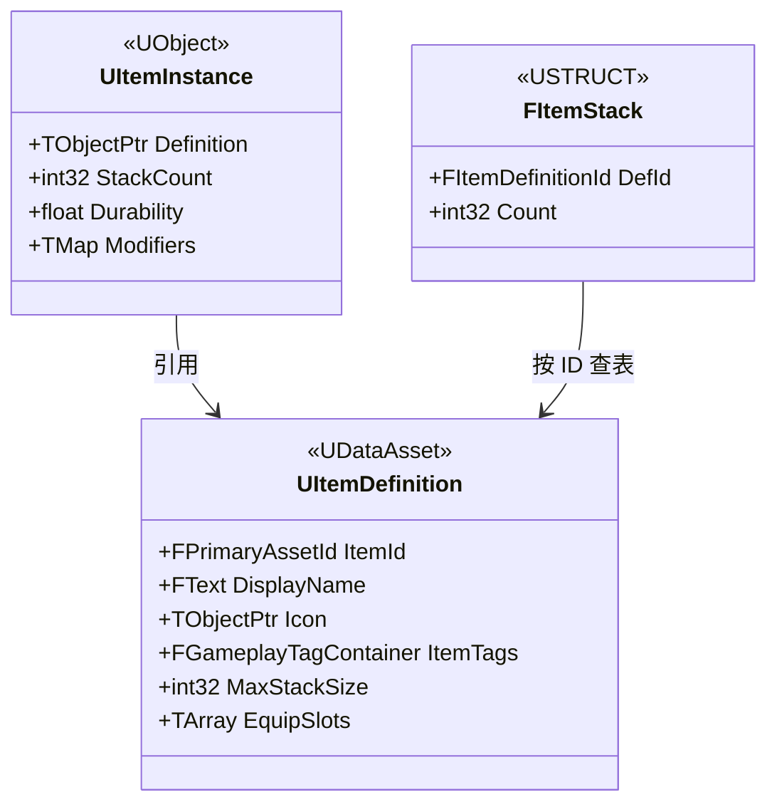
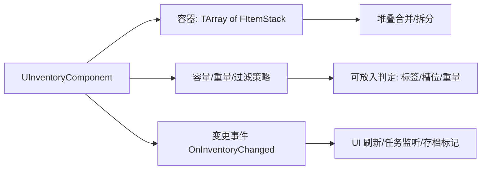
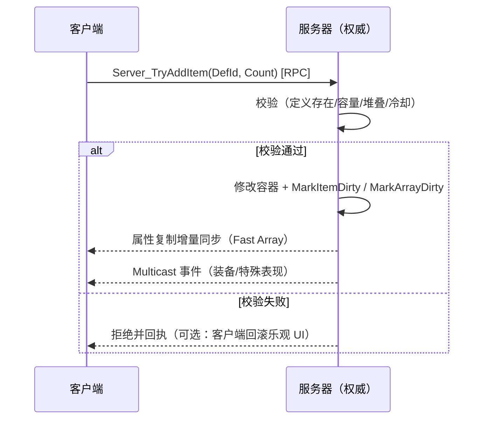

# 13 背包与装备系统

| 项目 | 内容 |
|---|---|
| 版本基线 | UE 5.8.0（CL 55116800 / `++UE5+Release-5.8`） |
| 适用范围 | 物品定义/实例建模、背包容器、装备槽、网络同步、UI 绑定、存档衔接 |
| 事实边界 | 引擎侧符号经本机核对（`Engine\Source\Runtime\Engine\Classes` 无内置 Inventory 类；`Net\Core\Classes\Net\Serialization\FastArraySerializer.h`、`UMG\Public\Components\ListView.h`）；Lyra 相关细节为社区/示例整理，标注「待核对」 |
| 官方参考 | https://dev.epicgames.com/documentation/en-us/unreal-engine |
| 最后更新 | 2026-08-07 |

## 概述

背包/物品/装备（Inventory/Item/Equipment）是 RPG、射击、生存类玩法的高频系统。UE **引擎没有内置的背包组件**（本机核对：`Engine\Source\Runtime\Engine\Classes` 下无任何 `*Inventory*` 类；Lyra 是官方示例工程而非引擎插件），需要自研或采用社区方案。自研的核心是三个分离：

1. **定义与实例分离**（Definition vs Instance）：资产化静态数据，运行时只持有轻量实例；
2. **容器与逻辑分离**：背包只是"数据容器 + 变更事件"，规则（能否放入/堆叠/装备）由外部策略校验；
3. **表现与数据分离**：UI 通过事件/绑定刷新，网络只同步数据。

它与 GAS（属性/效果）、SaveGame（持久化）、网络复制（权威与同步）三个系统深度协作，本篇按"建模 → 容器 → 装备 → 网络 → UI → 存档 → 参考 → 反模式"组织。

## 核心概念表

| 概念 | 英文 | 说明 |
|---|---|---|
| 物品定义 | Item Definition | `UDataAsset` 子类，静态数据：ID/名称/图标/类型标签/最大堆叠/可装备槽位 |
| 物品实例 | Item Instance | `UObject` 子类，运行时状态：所属定义、数量、耐久、词条 |
| 背包组件 | Inventory Component | `UActorComponent`，持有容器并对外提供增删改查与事件 |
| 容器 | Container | 槽位集合（`TArray<FItemStack>`），可带容量/重量/过滤约束 |
| 槽位 | Slot | 容器内一格；固定格/网格背包/无限列表三种模型 |
| 堆叠 | Stack | 同类物品合并存放，受 `MaxStackSize` 限制，可拆分/合并 |
| 装备槽 | Equip Slot | 角色身上固定槽位（武器/护甲/饰品），绑定挂接点与属性效果 |
| 快速数组复制 | Fast Array（`FFastArraySerializer`） | 增量复制数组的官方机制：`MarkItemDirty`/`MarkArrayDirty` + 增删改回调（本机核对：5.8 位于 `Net\Core\Classes\Net\Serialization\FastArraySerializer.h`） |
| 列表 UI | `UListView` + `IUserObjectListEntry` | 物品列表展示的标准 UMG 组合（本机核对 ListView.h:38/41） |
| 存档快照 | Item Save Data | USTRUCT 快照：定义软路径/数量/槽位/耐久，用于 SaveGame 持久化 |

## 原理详解

### 1. 定义与实例分离（建模）



图释：定义（静态资产）与实例（运行时状态）分离；容器内只存轻量 `FItemStack`（ID + 数量），实例按需创建。

- **定义（Definition）**：所有玩家共享的只读资产，用 `UDataAsset` 或 `UDataAsset` 子类承载；变更定义 = 全服生效。建议用 `FPrimaryAssetId`/自定义 ID 做稳定标识，避免用对象路径做业务键（重命名即破坏存档与网络引用）。
- **实例（Instance）**：每份具体物品的运行时状态（耐久、词条、强化等级）。实例不必常驻：大量堆叠物品可用"栈内聚合数据"（`FItemStack` + 每栈一个实例）减少对象数。
- **归属**：`UItemInstance` 一般由 `UInventoryComponent`（或 ItemManager Subsystem）拥有；销毁时统一回收，避免泄漏。
- 类型标签用 GameplayTag（详见 `03-GameplayTag与数据资产.md`），规则（过滤/合成/任务）全部基于标签判断，避免字符串/枚举硬编码。

### 2. InventoryComponent 设计（容器/槽位/堆叠）



图释：组件 = 数据容器 + 约束策略 + 变更事件三件套；UI、任务、存档都只监听事件，不轮询。

- **三种槽位模型**：固定格（每格一栈）、网格背包（格子 + 物品占用多格，实现复杂度高）、无限列表（只按容量/重量限制）。多数项目用"固定格 + 容量/重量"即可。
- **堆叠**：`MaxStackSize` 在定义上配置；放入时先尝试合并到未满栈，再开新栈；拆分/合并操作全部收敛到服务端函数，避免两端算法分叉。
- **变更事件**：`DECLARE_MULTICAST_DELEGATE` 或动态委托广播 `OnInventoryChanged(容器, 变更类型, 槽位, 物品)`；单次批量变更只广播一次（合并脏标记），防止 UI 抖动（委托基础见 `04-委托事件与对象通信.md`）。
- **过滤策略**：`CanAddItem(定义/实例, 槽位)` 由策略对象（或组件虚函数）实现，服务器与客户端必须同一份逻辑（或至少服务器严格校验）。

### 3. 装备槽与属性挂接

- **槽位定义**：`TArray<FName>`/`TArray<FGameplayTag>` 表示可用装备槽；装备时校验"物品支持的槽位 ∩ 角色空闲槽位"。
- **装备流程**：卸下/穿上都是"容器转移 + 挂接点更新（SkeletalMesh 插槽）+ 属性/能力变更"三件事，建议由装备管理器统一编排（服务器权威）。
- **与 GAS 衔接（推荐模式）**：装备生效 = 授予 `UGameplayAbility` / 应用持久 `UGameplayEffect`（改 `AttributeSet` 数值）；卸下 = 移除。**引用效果/能力 ID 而不是直接改数值**，这样可被驱散/禁用/存档统一管理。GAS 模型见 `01-GameplayAbilitySystem能力系统.md`。
- **表现层**：装备 Actor（武器 Mesh）仅作表现，由装备槽状态驱动生成/销毁；不要把装备逻辑塞进 Actor 生命周期。

### 4. 网络同步要点



图释：一切修改走服务器 RPC，服务器校验后修改容器，复制系统把增量结果推给所有客户端。

- **服务器权威**：客户端只发"意图"（`Server_TryAddItem`/`Server_Equip`），服务器校验后改数据；客户端不做本地修改，仅可做短暂乐观 UI（置灰/转圈），失败回滚。
- **复制策略选型**：
  - 物品少、槽位固定：`UPROPERTY(Replicated)` 整个 `TArray<FItemStack>` + `OnRep` 全量刷新，简单够用；
  - 物品多、变更频繁：**Fast Array**（`FFastArraySerializer`）增量复制——本机核对 5.8 中该机制位于 `Engine\Source\Runtime\Net\Core\Classes\Net\Serialization\FastArraySerializer.h`（已从 Engine 模块移入 Net\Core），核心约定：元素须实现 `PreReplicatedRemove`/`PostReplicatedAdd`/`PostReplicatedChange` 等回调；修改后必须调用 `MarkItemDirty`（改单项）或 `MarkArrayDirty`（增删），并依赖 `ReplicationID`/`ReplicationKey` 做增量。详见 `../06-网络同步/02-RPC与属性同步.md`。
- **Iris 提示**：若启用 Iris 复制，Fast Array 语义仍可用（`FFastArraySerializer` 是序列化层机制），但通道与调试方式变化，见 `06-网络同步/07-Iris复制使用与迁移.md`（若已存在；否则以 06 章 Iris 篇为准）。
- **预测**：背包类操作不建议做完整客户端预测（回滚复杂、收益低）；"服务器确认 + 乐观反馈"足够。

### 5. UI 绑定

- 列表展示用 `UListView`（本机核对：`UListView : UListViewBase, ITypedUMGListView<UObject*>`，ListView.h:41），条目 Widget 必须实现 `IUserObjectListEntry` 接口（ListView.h:38 注释原文）。
- 数据流：`UInventoryComponent` 变更事件 → 更新 `UListView::SetListItems` 的源数组 → `IUserObjectListEntry` 的 `OnListItemObjectSet` 刷新单条；数量/耐久变化走单条更新，**禁止整表重建**。
- 拖拽/悬停：`UDragDropOperation` + ListView 拖拽事件，拖拽只携带"容器 + 槽位 + 物品 ID"，落下时发 RPC，成功才真正移动。
- 多人在线时 UI 永远读"复制后的权威数据"，不做本地预测值渲染（除非有乐观层）。

### 6. 持久化（与 SaveGame 衔接）

- 背包存档 = **USTRUCT 快照数组**：`FItemSaveData { FSoftObjectPath DefinitionPath; int32 Count; int32 SlotIndex; float Durability; TMap<FGameplayTag,float> Modifiers; }`。
- 加载流程：读档 → 校验定义存在（软路径解析，缺失则丢弃或替换默认物品）→ 重建 `FItemStack`/`UItemInstance`。
- **不要直接序列化 `UItemInstance`**：对象图序列化脆弱、版本迁移麻烦；快照 + 重建才是可迁移方案（与 `12-SaveGame存档系统与序列化.md` 的"数据而非对象"一致）。
- 装备状态、快捷栏也存进同一份快照（槽位索引 + 物品 ID），加载后统一应用。

### 7. Lyra Inventory 参考

Lyra（官方示例工程，非引擎内置）的背包设计是业界常见参考（以下为社区整理口径，**细节待核对**）：

- `UInventoryComponent`：以能力（GameplayAbility）授权增删查改，而非直接暴露函数——把"能做什么"交给 GAS；
- `FInventoryList`：基于 `FFastArraySerializer` 的增量复制列表，条目为物品实例指针；
- `UInventoryItemDefinition`（数据）+ `UInventoryItemInstance`（实例）：定义/实例分离的官方范例；
- 装备系统（Equipment）与背包解耦：装备只消费"物品实例 + 槽位"，通过 GAS 效果挂属性。

> 本机未安装 Lyra 源码，「待核对」项：Lyra 具体类名/接口签名以官方 GitHub 仓库（`EpicGames/UnrealEngine` 示例）为准。

### 8. 常见反模式

| 反模式 | 问题 | 正确做法 |
|---|---|---|
| 定义与实例混在一个类 | 资产被运行时数据污染、存档/网络同步困难 | 定义/实例分离 |
| 容器里存 `AActor*` | 复制/存档/重连全崩 | 存 ID/定义引用 + 轻量数据 |
| 客户端直接改容器 | 作弊、不同步 | 服务器权威 + RPC |
| 服务器不校验数量/堆叠 | 复制刷物品漏洞 | 所有修改入口统一校验 |
| 存档直接存 UObject 实例 | 版本迁移噩梦 | USTRUCT 快照 + 重建 |
| UI 每次刷新重建列表 | 卡顿、焦点丢失 | 事件驱动单条更新 |
| 装备属性硬编码改 AttributeSet | 无法驱散/存档/扩展 | 走 GAS 效果/能力 |

### 9. 物品 ID 与资产管理（AssetManager 衔接）

- **ID 即契约**：物品定义用稳定 ID（`FName`/`FPrimaryAssetId`）而非对象路径做业务键；ID 一经发布不重用、不重命名（重命名走迁移映射表）。
- **批量加载**：物品定义数量大时用 `UAssetManager`（Primary Asset）统一注册与异步加载：`LoadPrimaryAssets` + 回调，避免散落硬引用把整个目录打进包。
- **软引用为主**：背包数据结构里存 `FSoftObjectPath`，UI/规则需要时才解析；定义表（ID → 路径映射）可打进 DataTable 随包加载。
- **数据资产组织**：`UDataAsset` 子类 + 目录约定（`Content/Items/<类型>/`），用 Asset Manager 的 Primary Asset Type 归类，详见 `03-GameplayTag与数据资产.md`。

### 10. 合成/拆解与物品消耗

- **合成（Crafting）**：配方 = "输入（物品+数量）→ 输出（物品+数量）+ 前置条件（等级/任务/标签）"；服务器执行：校验输入、扣除、产出，全部走同一套容器 API，保证可回滚（部分成功语义：合成失败退还材料）。
- **拆解（Salvage）**：反向配方，产出物列表由定义配置；同样服务器校验后执行。
- **消耗（Consume）**：使用物品 = 服务器校验（数量/冷却/位置）→ 扣除 1 单位 → 触发效果（GAS Ability/GE）→ 广播事件；客户端只发"使用意图"。
- **任务联动**：任务系统监听 `OnInventoryChanged`/消耗事件统计进度（如"收集 10 个 X"），不要在 UI 层统计。

## 代码与示例

以下为 C++ 节选（示意结构，非完整工程代码；`FFastArraySerializer` 用法以本机 Net\Core 头文件注释为准）。

**物品定义与实例：**

```cpp
// ItemDefinition.h（节选，示意）
UCLASS(BlueprintType)
class UItemDefinition : public UDataAsset
{
    GENERATED_BODY()
public:
    UPROPERTY(EditDefaultsOnly) FName ItemId;          // 稳定业务 ID
    UPROPERTY(EditDefaultsOnly) FText DisplayName;
    UPROPERTY(EditDefaultsOnly) FGameplayTagContainer ItemTags;
    UPROPERTY(EditDefaultsOnly) int32 MaxStackSize = 99;
    UPROPERTY(EditDefaultsOnly) TArray<FName> EquipSlots;
};

// ItemInstance.h（节选，示意）
UCLASS(BlueprintType)
class UItemInstance : public UObject
{
    GENERATED_BODY()
public:
    UPROPERTY() TObjectPtr<UItemDefinition> Definition;
    UPROPERTY() int32 StackCount = 1;
    UPROPERTY() float Durability = 100.f;
};
```

**Fast Array 容器（增量复制）：**

```cpp
// InventoryList.h（节选，示意；参照 FastArraySerializer.h 约定）
USTRUCT()
struct FItemStackEntry : public FFastArraySerializerItem
{
    GENERATED_BODY()
    UPROPERTY() FName ItemId;
    UPROPERTY() int32 Count = 0;
    void PreReplicatedRemove(const struct FInventoryList& InList);
    void PostReplicatedAdd(const struct FInventoryList& InList);
    void PostReplicatedChange(const struct FInventoryList& InList);
};

USTRUCT()
struct FInventoryList : public FFastArraySerializer
{
    GENERATED_BODY()
    UPROPERTY() TArray<FItemStackEntry> Items;
    void AddItem(FName ItemId, int32 Count);   // 内部调用 MarkItemDirty / MarkArrayDirty
};
```

**服务器权威入口：**

```cpp
// InventoryComponent.cpp（节选，示意）
void UInventoryComponent::Server_TryAddItem_Implementation(FName ItemId, int32 Count)
{
    const UItemDefinition* Def = LookupDefinition(ItemId);
    if (!Def || Count <= 0 || !CanAdd(Def, Count)) { return; } // 服务器校验
    Inventory.AddItem(ItemId, Count);                          // 修改 + 标记脏
    OnInventoryChanged.Broadcast();
}
```

**存档快照：**

```cpp
// ItemSaveData.h（节选，示意）
USTRUCT()
struct FItemSaveData
{
    GENERATED_BODY()
    UPROPERTY() FSoftObjectPath DefinitionPath; // 软路径，加载后解析
    UPROPERTY() int32 Count = 0;
    UPROPERTY() int32 SlotIndex = -1;
    UPROPERTY() float Durability = 100.f;
};
```

**装备流程（服务器权威，示意）：**

```cpp
// InventoryComponent.cpp（节选，示意）
void UInventoryComponent::Server_EquipItem_Implementation(int32 SlotIndex, FName EquipSlot)
{
    FItemStackEntry* Entry = Inventory.GetEntry(SlotIndex);
    if (!Entry || !CanEquip(Entry->ItemId, EquipSlot)) { return; } // 校验定义与槽位
    // 1) 从背包移除 2) 挂到装备槽 3) 通过 GAS 应用效果/授予能力
    Inventory.RemoveAt(SlotIndex);                 // 内部 MarkArrayDirty
    Equipment.Equip(Entry->ItemId, EquipSlot);     // 触发 EquipmentChanged
    GrantEquipmentEffects(Entry->ItemId, EquipSlot); // GE/Ability 按 ID 应用
    OnInventoryChanged.Broadcast();
}
```

> 说明：装备/卸下/替换全部服务器执行；表现层（武器 Mesh）监听 `EquipmentChanged` 事件生成或销毁，不参与逻辑。

## 最佳实践
1. **定义/实例/容器三层分离**，规则全部走策略函数，服务器与客户端共用同一套校验（至少服务器严格）。
2. **一切修改走服务器**：RPC 入口收敛（Add/Remove/Split/Stack/Move/Equip），服务器校验后修改。
3. **增量复制用 Fast Array**：物品多、变更频繁时使用 `FFastArraySerializer`（本机 5.8 位于 Net\Core），遵守 `MarkItemDirty`/`MarkArrayDirty` 约定。
4. **事件驱动 UI**：单次变更单次广播，ListView 单条刷新，禁止轮询与整表重建。
5. **存档用快照**：`FItemSaveData` + 软路径 + 版本号，加载后重建实例（详见 `12-SaveGame存档系统与序列化.md`）。
6. **装备与 GAS 解耦**：装备效果通过 GameplayEffect/Ability 的 ID 挂接，不直接改数值。
7. **ID 即契约**：物品 ID 稳定、唯一、不重用；重命名定义用迁移而不是改 ID。
8. **性能预算**：容器上限（如 256 栈）、批量变更合并、`UItemInstance` 按需创建并池化。

## FAQ

1. **Q：UE 有现成的背包插件吗？** A：引擎无内置（本机核对 Engine\Source\Runtime\Engine\Classes 无 `*Inventory*` 类）；官方参考是 Lyra 示例工程（外部项目，待核对），市场/社区有成熟插件但需评估授权与架构匹配。
2. **Q：物品用 `UObject` 实例还是 USTRUCT？** A：定义用 `UDataAsset`；容器内推荐 USTRUCT 栈（`FItemStack`）；需要复杂运行时状态时给每栈配 `UItemInstance`（UObject），网络同步的是栈数据而非对象图。
3. **Q：背包怎么网络同步？** A：服务器权威 + RPC 改 + 属性复制；条目多且频繁用 `FFastArraySerializer`（本机 5.8：`Net\Core\Classes\Net\Serialization\FastArraySerializer.h`），元素回调 + `MarkItemDirty`/`MarkArrayDirty`。
4. **Q：堆叠怎么处理？** A：`MaxStackSize` 在定义配置；放入先合并未满栈再开新栈；拆分/合并/排序全部服务器执行并广播单次事件。
5. **Q：背包怎么存档？** A：转成 `FItemSaveData` USTRUCT 快照（软路径/数量/槽位/耐久）写进 SaveGame；加载后解析软路径并重建，带版本迁移。
6. **Q：装备怎么加属性？** A：装备时授予 Ability/应用持久 GameplayEffect（改 AttributeSet），卸下时移除；引用效果 ID 而非直接改数值（详见 `01-GameplayAbilitySystem能力系统.md`）。
7. **Q：UI 怎么刷新才不卡？** A：监听 `OnInventoryChanged` 事件，`UListView` 单条更新（`IUserObjectListEntry`），不要整表 `SetListItems` 重建。
8. **Q：怎么防复制刷物品？** A：所有修改入口服务器校验（定义存在/数量合法/容量/堆叠/冷却/权限），客户端请求仅作意图；必要时加服务端日志与频率限制。
9. **Q：物品很多时性能怎么办？** A：限制容器上限、用 Fast Array 增量复制、`UItemInstance` 池化、UI 虚拟化（ListView 自带），批量变更合并广播。
10. **Q：掉落物与背包怎么衔接？** A：掉落物用轻量"拾取物"（定义 ID + 数量，`UObject` 或 Actor 表现），拾取时发 RPC 走同一套服务器校验入口，避免绕路。
11. **Q：物品定义很多时怎么加载？** A：用 `UAssetManager` 按 Primary Asset Type 统一注册与异步加载，背包内只存软引用；避免全量硬引用（详见第 9 节与 `03-GameplayTag与数据资产.md`）。

## 关联阅读

- [01-GameplayAbilitySystem能力系统.md](01-GameplayAbilitySystem能力系统.md)（装备属性/效果挂接）
- [03-GameplayTag与数据资产.md](03-GameplayTag与数据资产.md)（物品类型标签与数据资产组织）
- [04-委托事件与对象通信.md](04-委托事件与对象通信.md)（背包变更事件设计）
- [../06-网络同步/02-RPC与属性同步.md](../06-网络同步/02-RPC与属性同步.md)（RPC 与 Fast Array 复制）
- [12-SaveGame存档系统与序列化.md](12-SaveGame存档系统与序列化.md)（背包存档快照与版本迁移）

## 更新日志

- 2026-08-07：初稿；本机 UE5.8（CL 55116800）核对：Engine Runtime Classes 无内置 Inventory 类、FastArraySerializer 位于 Net\Core、UListView/IUserObjectListEntry 位于 UMG。
