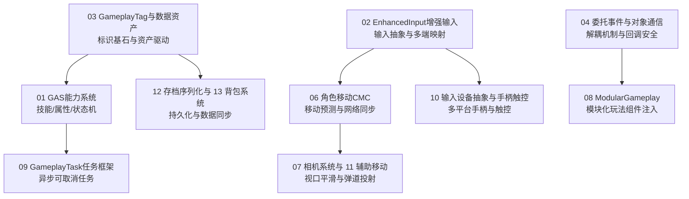

# 03 游戏玩法编程

> 知识成熟度：L2（子域工程手册，已按 13 篇核心专题与 UE5.8 源码基线全面标准化）。
>
> 领域权威导航：[游戏知识 Domain MOC](../../00_Index/domains/游戏知识.md) ｜ [游戏知识总目录](../README.md)。

---

## 1. 核心定位与设计思想

「03-游戏玩法编程」是虚幻引擎商业项目交付的核心生产力子域。它承接底层对象生命周期，负责将复杂的游戏规则、操作交互与角色状态抽象为结构清晰、高可维护、低耦合的代码体系：
- **数据驱动与能力框架（GAS）**：通过 GameplayAbilitySystem 提供工业级的技能施放、Buff 叠加驱动（GameplayEffect）、数值属性管理（AttributeSet）与预测打断管线；
- **现代输入与设备抽象**：以 Enhanced Input（增强输入）为基石，通过 InputMappingContext、Modifiers 与 Triggers 完美应对多端输入设备（键鼠/手柄/触控）与按键重映射需求；
- **模块化玩法与组件解耦**：采用 ModularGameplay 插件化理念，使用 GameFrameworkComponentManager 动态注入组件，彻底告别臃肿单一的超级大 Actor（God Class）；
- **确定性移动与物理同步**：以 UCharacterMovementComponent（CMC）为核心，提供具备客户端自主预测、服务器校验回滚与时间戳插值的网络化移动基石。

本分类致力于建立从业务需求推导至底层机制的严谨思维，杜绝硬编码与网状耦合，打造稳固的商业级 Gameplay 架构。

---

## 2. 专题矩阵与知识状态

| 专题文件（Canonical 路径） | 知识类型 | 成熟度 | 核心工程关注点与落地场景 |
| :--- | :---: | :---: | :--- |
| [01-GameplayAbilitySystem能力系统.md](../../知识/05-Gameplay与交互系统/技能战斗与属性结算/01-GameplayAbilitySystem能力系统.md) | Concept | L2 | GAS 核心架构：AbilitySystemComponent、GameplayAbility、GameplayEffect 执行与堆叠、AttributeSet 属性计算与网络复制 |
| [02-EnhancedInput增强输入.md](../../知识/05-Gameplay与交互系统/输入移动与交互/02-EnhancedInput增强输入.md) | Concept | L2 | Enhanced Input 增强输入系统：InputAction、InputMappingContext 优先级切换、Modifiers 轴缩放与 Triggers 触发器判定 |
| [03-GameplayTag与数据资产.md](../../知识/05-Gameplay与交互系统/玩法架构与任务协作/03-GameplayTag与数据资产.md) | Concept | L2 | GameplayTag 层次标签管理器、快速哈希位匹配、PrimaryDataAsset 资产注册与异步加载选型 |
| [04-委托事件与对象通信.md](../../知识/03-引擎架构与资源系统/模块化框架与对象通信/04-委托事件与对象通信.md) | Concept | L2 | 单播/多播/动态多播委托底座原理、线程安全分发、Event 与弱指针安全绑定、模块间松耦合通信 |
| [05-蓝图与C++协作.md](../../知识/05-Gameplay与交互系统/玩法架构与任务协作/05-蓝图与C%2B%2B协作.md) | Concept | L2 | BlueprintNativeEvent / BlueprintImplementableEvent 虚派发、性能热点 C++ 下沉、结构体与内存共享规范 |
| [06-角色移动系统UCharacterMovement.md](../../知识/05-Gameplay与交互系统/输入移动与交互/06-角色移动系统UCharacterMovement.md) | Concept | L2 | CharacterMovementComponent 移动模式、客户端预测（SavedMove）、服务端矫正（ServerMove）与时间戳网络回溯 |
| [07-相机系统与视口.md](../../知识/05-Gameplay与交互系统/输入移动与交互/07-相机系统与视口.md) | Concept | L2 | CameraComponent 与 SpringArmComponent 弹簧臂碰撞探测、PlayerCameraManager 视口控制与相机震动效果 |
| [08-ModularGameplay模块化玩法.md](../../知识/05-Gameplay与交互系统/玩法架构与任务协作/08-ModularGameplay模块化玩法.md) | Concept | L2 | ModularGameplay 插件模式、GameFrameworkComponentManager 动态组件注入、多系统解耦与跨模块装配 |
| [09-GameplayTask任务框架.md](../../知识/05-Gameplay与交互系统/玩法架构与任务协作/09-GameplayTask任务框架.md) | Concept | L2 | GameplayTasks 异步任务生命周期管理、可取消/可确认执行状态机、与 AI 行为树和 GAS 协同调度 |
| [10-输入设备抽象与手柄触控.md](../../知识/05-Gameplay与交互系统/输入移动与交互/10-输入设备抽象与手柄触控.md) | Concept | L2 | 虚拟摇杆触控层、多平台手柄震动与自适应扳机、输入设备热插拔感知与死区（DeadZone）滤波 |
| [11-常用移动与辅助组件.md](../../知识/05-Gameplay与交互系统/输入移动与交互/11-常用移动与辅助组件.md) | Concept | L2 | ProjectileMovementComponent 弹道抛物线、RotatingMovementComponent 旋转与 InterpToMovement 插值平滑组件 |
| [12-SaveGame存档系统与序列化.md](../../知识/05-Gameplay与交互系统/背包装备与存档/12-SaveGame存档系统与序列化.md) | Concept | L2 | USaveGame 序列化存档、FArchive 二进制序列化、版本号向后兼容性处理与异步写盘安全防损坏 |
| [13-背包与装备系统.md](../../知识/05-Gameplay与交互系统/背包装备与存档/13-背包与装备系统.md) | Concept | L2 | 客户端数据驱动背包体系、格子空间/重量限制、装备槽位属性增益、与服务端状态同步契约对齐 |

---

## 3. 逻辑学习顺序建议

1. **第一阶段（通信机制与输入解耦）**：精读 `04-委托事件与对象通信` 与 `02-EnhancedInput增强输入`，建立现代 UE5 标签驱动和输入解耦思维。
2. **第二阶段（能力框架与移动中枢）**：主攻 `01-GameplayAbilitySystem能力系统` 与 `06-角色移动系统UCharacterMovement`，掌握大型动作与联机游戏的核心运行管线。
3. **第三阶段（架构解耦与任务编排）**：研读 `03-GameplayTag`、`08-ModularGameplay` 与 `09-GameplayTask`，掌握企业级模块解耦与异步任务状态机设计。
4. **第四阶段（外围系统与持久化）**：研读 `07-相机系统`、`10-输入设备抽象`、`12-SaveGame存档` 与 `13-背包与装备系统`，完成游戏全功能闭环。

---

## 4. 游戏与引擎工程落地场景

- **高频技能与状态打断**：使用 GameplayTag 标签查询阻断机制（Block/Cancel Tags），实现施法前摇打断、硬直霸体免疫与状态互斥，逻辑全数据驱动配置；
- **移动丢包与回滚抖动优化**：精调 CharacterMovementComponent 的网络带宽压缩参数、客户端预测时间上限（MaxPredictionError）与回滚阈值，在 150ms 弱网环境下保持丝滑手感；
- **跨平台多端输入无缝切换**：配置不同的 InputMappingContext，在检测到玩家触摸屏幕或插入 Xbox 手柄时毫秒级切换键位提示与灵敏度曲线。

---

## 5. 跨域技术依赖与前后置导航

- **向下扎根（引擎基础）**：
  - 对象模型与生命周期：[01-引擎基础](../01-引擎基础/README.md)
  - C++ 核心与值语义：[00-01 C++核心](../../00-计算机与工程基础/01-C++核心/README.md)
- **向上驱动（引擎源码与实战）**：
  - GAS 源码解析：[12-05 GAS能力系统源码](../../知识/05-Gameplay与交互系统/技能战斗与属性结算/05-GAS能力系统源码.md) ｜ [12-51 Lyra-GAS扩展源码](../../知识/05-Gameplay与交互系统/技能战斗与属性结算/51-Lyra-GAS扩展与能力费用源码.md)
  - 增强输入源码：[12-25 EnhancedInput源码](../../知识/05-Gameplay与交互系统/输入移动与交互/25-EnhancedInput与GameplayTags源码.md)
  - 模块化 Pawn 初始化：[12-41 Lyra-Pawn初始化源码](../../知识/03-引擎架构与资源系统/模块化框架与对象通信/41-Lyra-Pawn初始化与模块化组件源码.md)
- **横向协同（服务端与实战）**：
  - 服务端战斗结算与验证：[游戏服务端 03-业务系统设计](../../知识/05-Gameplay与交互系统/技能战斗与属性结算/08-技能与战斗框架.md)
  - 完整技能释放链路：[系统实战 03-技能释放完整链路](../../知识/05-Gameplay与交互系统/技能战斗与属性结算/03-技能释放完整链路.md)

## 6. 存档学习的完成标准

[12 SaveGame 存档系统与序列化](../../知识/05-Gameplay与交互系统/背包装备与存档/12-SaveGame存档系统与序列化.md)补充了属性过滤、实体身份、schema 迁移、异步快照与写入排序的边界。阅读时区分三个问题：什么会被序列化、哪个版本的数据被持久化、哪些数据只能由服务器裁决。能解释这些问题后，再将存档接入背包、关卡和 Subsystem；后续练习沿[跨域主题递进路线](../../00_Index/axes/跨域主题.md#知识面持续深化路线)进行，不复制一份服务器事务原理。
