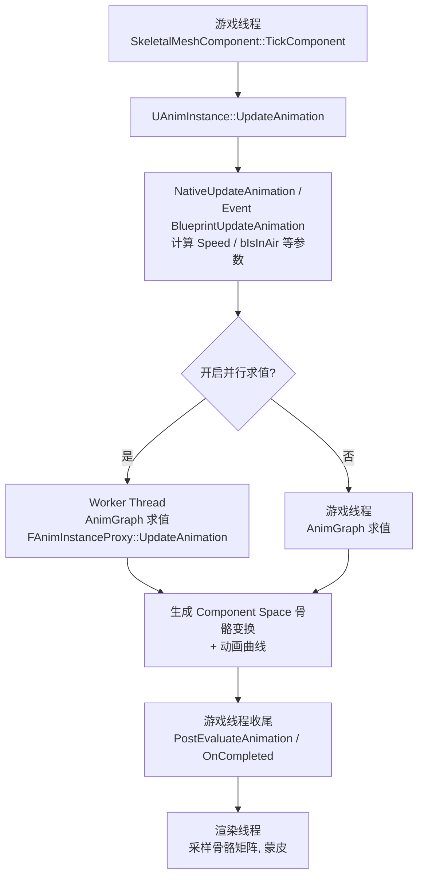
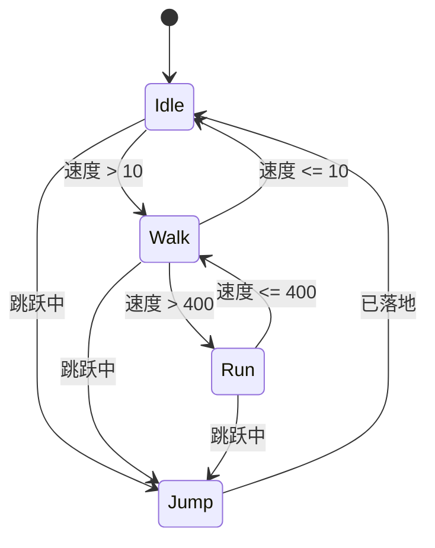

# 01-动画蓝图与状态机

> 版本基准：UE 5.8.0（本机 `Engine/Build/Build.version`：CL 55116800，分支 `++UE5+Release-5.8`）。
> 源码依据：`C:\Program Files\Epic Games\UE_5.8\Engine\Source\Runtime\Engine\Private\Animation`；以本机 5.8 源码为准。
> 兼容性边界：UE 4.27 仅作为动画蓝图迁移对照，当前求值与线程边界以 UE5.8 为准。
> 最后更新：2026-08-05（统一 UE5.8 版本基线）。
> 官方参考：[Unreal Engine UE5.8 官方文档总页](https://dev.epicgames.com/documentation/en-us/unreal-engine)。

## 概述

**动画蓝图（Animation Blueprint，AnimBlueprint）** 是 UE 中最核心的动画逻辑资产。它的职责是：读取角色当前的游戏状态（速度、朝向、是否在空中、是否在攻击），把这些状态转换为**骨骼姿态**（Pose），并最终驱动 SkeletalMeshComponent 完成渲染。

动画蓝图解决的问题是"**动画数据与游戏逻辑之间的翻译**"：

- 动画序列（Animation Sequence）只存"一段姿势随时间变化的数据"，它不知道角色在走路还是跑步；
- 游戏逻辑只知道"速度是 500，朝向偏右 30 度"，它不关心用哪段动画表现；
- 动画蓝图负责把"游戏状态"翻译成"播放哪段动画、以多大权重混合、怎么过渡"。

一张动画蓝图由三部分组成：

| 组成部分 | 作用 |
| --- | --- |
| 父类（AnimInstance） | 动画蓝图的运行时对象类型，负责生命周期与数据存储 |
| EventGraph（事件图） | 游戏线程上运行的逻辑：更新参数、接收事件、调用函数 |
| AnimGraph（动画图） | 每帧求值姿态的"数据流图"：播放、混合、IK、后处理 |

本文先讲清动画蓝图的整体结构与更新流程，再深入状态机（State Machine）与各类混合（Blend）节点，最后给出代码/蓝图示例与最佳实践。

## 核心概念

| 概念 | 英文 | 说明 | 关键点 |
| --- | --- | --- | --- |
| 动画蓝图 | Animation Blueprint | 继承自 AnimInstance 的蓝图资产，包含 EventGraph 与 AnimGraph | 一个角色一般一个 AnimBP |
| 动画实例 | AnimInstance | AnimBP 的运行时实例，挂在 SkeletalMeshComponent 上 | 每个 Mesh 组件一份实例 |
| 事件图 | EventGraph | 游戏线程执行的逻辑图 | 每帧更新参数、处理事件 |
| 动画图 | AnimGraph | 纯数据流图，输出最终 Pose | 并行求值，禁止副作用 |
| 状态机 | Anim State Machine | AnimGraph 内的高级节点，用状态+转换组织动画 | 状态内可嵌套任意节点树 |
| 状态 | AnimState | 状态机中的一个节点，内部是一棵动画节点树 | 同一时刻只有一个活动状态 |
| 转换 | Transition | 状态之间的边，含转换规则与混合时间 | 规则为真时开始过渡 |
| 混合节点 | Blend Node | 按权重/参数把多个姿势混合的节点 | Blend by Bool/Enum/Int/Float 等 |
| 插槽节点 | Slot | 留给蒙太奇等外部动画的占位节点 | 权重由蒙太奇混合控制 |
| 同步组 | Sync Group | 让多段动画按节奏点对齐播放的机制 | 用 Sync Marker 对齐脚步 |
| 链接动画图 | Linked Anim Graph | 把一段 AnimGraph 封装成可复用资产 | UE5 特性，支持覆盖与接口 |
| 子动画实例 | Sub Anim Instance | 按部位拆分 AnimInstance 逻辑 | UE5.2+ 特性 |

## 原理详解

### 动画蓝图的组成与编译

创建动画蓝图时，需要选择一个 Skeleton 作为父骨架，并选择一个父类（默认 `AnimInstance`，也可以是自定义的 C++ 子类）。动画蓝图资产本身不直接包含动画数据，它包含：

1. **变量与属性**：如 `Speed`、`bIsInAir`、`AimYaw`，是 EventGraph 与 AnimGraph 之间传递数据的唯一通道；
2. **EventGraph**：一个标准蓝图事件图，主要事件有 `Event BlueprintInitializeAnimation`（初始化）、`Event BlueprintUpdateAnimation`（每帧更新）、`Event BlueprintBeginPlay`，以及蒙太奇通知事件等；
3. **AnimGraph**：从"输出姿势（Output Pose）"节点反向展开的一棵节点树，每个节点输入姿势、输出姿势；
4. **Anim Class 设置**：LOD 阈值、可选的 Cached Poses、同步组定义等。

编译时，UE 会把 AnimGraph 展开为 `FAnimInstanceProxy` 上的求值结构（`FAnimNode_*` 链），运行时每个 SkeletalMeshComponent 实例化一份 AnimInstance。

### 动画更新流程

动画蓝图的每帧更新分为两个阶段：**游戏线程更新**与**并行求值**。



要点：

- `UpdateAnimation` 每 Tick 调用一次（也可手动 `TickAnimation` / `UpdateAnimation` 驱动）；
- EventGraph 中的 `BlueprintUpdateAnimation` 在**游戏线程**执行，可以放心访问 Pawn、Component、物理等游戏状态；
- AnimGraph 的求值在 **Worker Thread 并行执行**（UE 的并行动画求值，Parallel Animation Evaluation），因此 AnimGraph 中不允许修改 AnimInstance 变量、不允许调用有副作用的游戏接口；
- 求值完成后，动画曲线（Animation Curves）、蒙太奇权重等数据会合并回游戏线程，供 `GetCurveValue` 等查询；
- 渲染线程按插值后的骨骼矩阵进行蒙皮（Skinning）。

### EventGraph 与 AnimGraph 的分工

| 维度 | EventGraph | AnimGraph |
| --- | --- | --- |
| 执行线程 | 游戏线程 | Worker Thread（并行） |
| 频率 | 每帧一次（也可手动触发） | 每帧一次求值 |
| 可访问内容 | 游戏世界：Pawn、组件、碰撞 | 仅 AnimInstance 变量与动画相关节点 |
| 允许副作用 | 允许 | 不允许 |
| 输出 | 更新变量 | 输出最终 Pose |
| 典型内容 | 计算速度/朝向、监听事件 | 播放序列、状态机、混合、IK |

一个常见错误是把"查询游戏状态"写在 AnimGraph 里（比如用 Get World Location），这在并行求值下是不安全且非法的。正确做法：EventGraph 中计算好，存入变量，AnimGraph 只读取变量。

### 动画状态机工作原理

状态机是 AnimGraph 中的一个高级节点（AnimStateMachineNode）。它由**状态（State）**、**转换（Transition）**和**转换规则（Transition Rule）**组成：



#### 状态（State）

每个状态内部是一棵完整的动画节点树（播放序列、混合、甚至嵌套状态机）。状态机每帧只"激活"一个状态，该状态的输出即状态机的输出。状态内可以设置：

- **动画节点**：如 Sequence Player、Blend Space Player；
- **状态内混合**：状态内部的混合逻辑；
- **进入/退出状态时的行为**：通过状态机里的通知（Notify）或 Transition 的 Notify 触发事件。

#### 转换（Transition）

转换连接两个状态，包含：

- **转换规则（Transition Rule）**：一个返回 bool 的蓝图图表，通常读取 AnimInstance 变量（如 `Speed > 400`）；规则每帧评估；
- **混合时间（Blend Time）**：过渡持续时长，常见 0.1 ~ 0.3 秒；
- **自动基于播放器规则（Automatic Rule Based on Sequence Player in State）**：若开启，转换规则可自动用"当前动画播放进度/是否播完"作为条件，适合动画驱动转换（如播完收招动画后自动回 Idle）；
- **同步组（Sync Group）**：过渡双方属于同一同步组时，可开启"同步过渡"，让两段动画的脚步节奏对齐。

#### 转换的求值细节

1. 每帧，状态机对**所有出边**按优先级（Transition 列表顺序）评估转换规则；
2. 若多条规则同时为真，按优先级取第一条；
3. 转换不是瞬时的：在混合时间内，状态机输出 = 旧状态姿势与新状态姿势的 Crossfade（交叉淡化）；
4. 过渡期间新的规则仍然生效，可以打断当前过渡（Transition 打断行为可配置）；
5. 状态机支持嵌套：状态里可以再放一个状态机节点，用于"子状态机"组织复杂行为。

#### 状态机的输入输出

状态机节点本身没有"输出参数"，它只有输出姿势。所有驱动条件都通过 **AnimInstance 变量**传入（`Speed`、`bIsInAir` 等），因此"EventGraph 算参数 → 状态机看参数 → 决定状态"是标准范式。

### 混合节点（Blend Nodes）

状态机负责"选动画"，混合节点负责"按权重混合动画"。常用混合节点：

| 节点 | 用途 | 说明 |
| --- | --- | --- |
| Blend Poses by Bool | 二选一 | 如是否持枪 |
| Blend Poses by Enum | 多选一 | 如职业/姿态枚举 |
| Blend Poses by Int | 整数索引选择 | 如随机出招索引 |
| Blend Poses by Float | 一维参数混合 | 如按速度在 Idle/Walk/Run 间连续混合 |
| Blend Space Player | 1D/2D 混合空间播放 | 详见 02 篇 |
| Layered Blend per Bone | 按骨骼分层混合 | 如只混合上半身，保持下半身走路 |
| Blend by Speed | 按速度曲线混合 | 便捷的按速度混合节点 |
| Inertialization | 惯性化过渡 | UE5 特性，消除过渡跳变 |

权重分配的方式：

- **手动权重**：直接连一个浮点变量；
- **参数曲线**：用 Blend by Float 的"混合曲线（Blend Profile）"定义权重随参数变化的曲线；
- **骨骼掩码（Bone Mask）**：Layered Blend per Bone 通过骨骼掩码资产（Bone Mask）限定参与混合的骨骼。

#### 惯性化（Inertialization）

UE5 引入的过渡方式：不直接 Crossfade 两个姿势，而是把旧姿势的"速度"（姿态变化率）作为惯性延续到新姿势，再逐步衰减，从而消除快速切换时的抖动与"飘移"。适合高冲击切换（受击、开火状态切换），开销比 Crossfade 高，需按需使用。

### Slot 插槽节点

**Slot 节点**是 AnimGraph 中的占位节点（默认名为 `DefaultSlot`），它本身不播放动画，而是接收"外部注入"的动画——主要是**动画蒙太奇**（详见 02 篇）与**链接动画图**。

原理：

- 蒙太奇播放时，其动画被"塞进"指定名称的 Slot；
- Slot 节点的输出 = 蒙太奇姿势 × 蒙太奇权重 + 基础姿势 ×（1 - 权重）；
- 权重由蒙太奇的 Blend In / Blend Out 控制，所以 Slot 天然支持平滑进出；
- 多个 Slot 配合 Layered Blend per Bone，可以实现"上半身出招、下半身继续走路"的分层表现。

### 同步组（Sync Groups）

问题场景：从"走"切到"跑"时，两段动画的脚步相位不同，会出现"脚滑"或"瞬移"。同步组解决这个问题：

1. 在动画序列中放置**同步标记（Sync Marker）**（如标记左脚落地、右脚落地）；
2. 在 AnimBP 中创建同步组（Sync Group），把参与同步的状态/动画指定到同一组；
3. 过渡时状态机使用同步组对齐：新动画从与旧动画最近的标记点开始播放；
4. 同步组还支持"按节奏点混合（Blend with Markers）"，让过渡期间的步伐完全对齐。

同步组对"循环移动动画之间的转换"几乎是必备的，是消除脚滑的关键手段之一。

### 高级主题：Linked Anim Graph 与 Sub Anim Instance

#### Linked Anim Graph（UE5）

把一段常用 AnimGraph（如"基础移动姿势图"）保存为独立资产，供多个 AnimBP 链接复用：

- **默认模式**：复用整张图，子 AnimBP 只提供变量；
- **覆盖模式**：指定节点可被子 AnimBP 覆盖（如不同职业覆盖"攻击姿势"子图）；
- **接口（Anim Graph Interface）**：通过接口定义输入输出，实现"行为注入"。

适合项目需要"多角色共用一套动画逻辑，但个别部位表现不同"的场景。

#### Sub Anim Instance（UE5.2+）

把 AnimInstance 拆分为"根实例 + 子实例"：每个子实例管理一部分骨骼（如头部、手臂），通过 `Create Sub Anim Instance` 动态创建。好处是逻辑组件化、便于复用；代价是调试复杂度上升。

### LOD 与性能考虑

- **骨骼 LOD**：Skeleton 资产中定义 LOD 骨骼集，低 LOD 直接剔除骨骼与对应动画节点；
- **AnimBP LOD 阈值**：在动画蓝图 Class Settings 中可设置按 LOD 降级（如关闭部分后处理节点）；
- **VisibilityBasedAnimTickOption**：角色离屏时可降低动画更新频率或停止更新（注意与"模拟代理"配合）；
- **并行求值**：默认开启，不要在 AnimGraph 里做昂贵计算（每个节点每帧都要跑）；
- **骨骼过滤**：SkeletalMeshComponent 的 `bUseRefPoseOnInitAnim`、`BoneFilter` 等按需裁剪骨骼计算。

## 代码/蓝图示例

### 示例一：C++ 创建 AnimInstance 子类

```cpp
// MyAnimInstance.h
#pragma once

#include "Animation/AnimInstance.h"
#include "MyAnimInstance.generated.h"

UCLASS()
class MYGAME_API UMyAnimInstance : public UAnimInstance
{
    GENERATED_BODY()

public:
    /** 当前移动速度（cm/s，水平方向） */
    UPROPERTY(BlueprintReadOnly, Category = "Movement")
    float Speed = 0.f;

    /** 是否在空中 */
    UPROPERTY(BlueprintReadOnly, Category = "Movement")
    bool bIsInAir = false;

    /** 是否正在瞄准 */
    UPROPERTY(BlueprintReadOnly, Category = "Aim")
    bool bIsAiming = false;

protected:
    virtual void NativeUpdateAnimation(float DeltaSeconds) override;
};
```

```cpp
// MyAnimInstance.cpp
#include "MyAnimInstance.h"
#include "GameFramework/Pawn.h"
#include "GameFramework/Character.h"
#include "GameFramework/CharacterMovementComponent.h"

void UMyAnimInstance::NativeUpdateAnimation(float DeltaSeconds)
{
    Super::NativeUpdateAnimation(DeltaSeconds);

    const APawn* Pawn = TryGetPawnOwner();
    if (!Pawn)
    {
        Speed = 0.f;
        bIsInAir = false;
        return;
    }

    const FVector Velocity = Pawn->GetVelocity();
    Speed = Velocity.Size2D();  // 水平速度

    if (const ACharacter* Character = Cast<ACharacter>(Pawn))
    {
        const UCharacterMovementComponent* MoveComp = Character->GetCharacterMovement();
        bIsInAir = MoveComp && !MoveComp->IsMovingOnGround();
    }
}
```

然后在动画蓝图 Class Settings 中把父类设为 `UMyAnimInstance`，即可在 AnimGraph 中直接读取 `Speed`、`bIsInAir`。

### 示例二：搭建一个基础移动状态机（蓝图步骤）

1. 新建动画蓝图（选择目标 Skeleton）；
2. 在 AnimGraph 中拖入 **State Machine** 节点，命名为 `Locomotion`；
3. 双击进入状态机编辑器；
4. 新建状态：`Idle`、`Walk`、`Run`、`Jump`（右键 → Add State）；
5. 双击 `Idle` 状态，在状态内部添加 **Sequence Player**，选择待机动画，勾选 Loop；
6. 同样为 `Walk`、`Run` 配置动画序列（注意勾选循环）；
7. `Jump` 状态使用"单次播放"动画（不循环），并设置 `bAutomaticRuleBasedOnSequencePlayerInState` 相关转换（或直接依赖落地参数）；
8. 回到状态机，添加转换：`Idle → Walk`（规则：`Speed > 10`，Blend Time 0.2）、`Walk → Idle`（`Speed <= 10`）、`Walk → Run`（`Speed > 400`）、`Run → Walk`（`Speed <= 400`）、`Any → Jump`（`bIsInAir == true`）、`Jump → Idle`（`bIsInAir == false`）；
9. 选中涉及脚步对齐的转换（Walk↔Run），把两个状态内的动画加入同一**同步组**并启用同步过渡；
10. 编译并运行，用 `~` 控制台输入 `a.animnode.` 相关命令或 AnimDebugger 查看状态。

### 示例三：转换规则图表写法

转换规则是一个独立蓝图图表（Transition Rule），典型写法：

```text
[Transition: Idle -> Walk]
  Blend Time: 0.2
  Rule:
    Return Value = (Speed > 10.0)
```

复杂规则可以组合：

```text
[Transition: Walk -> Run]
  Rule:
    Return Value = (Speed > 400.0) && !bIsInAir && bHasStamina
```

注意：转换规则每帧评估，不要在里面写昂贵逻辑；规则读取的变量必须在 EventGraph 中维护好。

### 示例四：调试与诊断

- **AnimDebugger（UE5）**：运行游戏后，选中角色，在视口按 `(` 或通过菜单打开动画调试器，可单帧查看状态机当前状态、转换、混合权重、骨骼变换；
- **控制台命令**：5.8 无 `a.animnode.ShowDebug` / `ShowDebugAnimation`；骨骼调试用编辑器 AnimDebugger 或 `ShowDebug`，节点级 CVar 如 `a.animnode.IKRig.Enable`；
- **蓝图调试**：在 AnimBP 中打断点（EventGraph 部分），AnimGraph 不支持逐节点断点，但支持在节点上观察输入输出值；
- **曲线检查**：用 `GetCurveValue("CurveName")` 打印动画曲线，排查"动画到底有没有在播"。

### 示例五：按参数切换动画蓝图（运行时换 AnimBP）

```cpp
// 运行时切换整张动画蓝图
USkeletalMeshComponent* Mesh = Character->GetMesh();
Mesh->SetAnimInstanceClass(UMyWeaponAnimInstance::StaticClass());
// 或通过 AnimInstanceClass 属性指定默认类
Mesh->AnimClass = UMyWeaponAnimInstance::StaticClass();
```

切换后旧的 AnimInstance 会被销毁重建，注意保存需要延续的状态。

## 最佳实践

1. **参数统一命名规范**：`Speed`、`Direction`、`bIsInAir`、`AimYaw` 等建立项目级命名约定，避免各角色 AnimBP 各自为政；
2. **计算放 EventGraph / NativeUpdateAnimation，读取放 AnimGraph**：AnimGraph 保持"纯函数"风格；
3. **优先用状态机组织逻辑**，不要用一长串 Blend 节点模拟状态；状态机可读性、可调试性远好于手写混合网；
4. **状态机保持扁平**：过深的嵌套状态机难以维护；用子状态机只封装"确实独立"的行为（如"持枪姿态内部再分站立/蹲伏"）；
5. **移动动画务必用同步组 + Sync Marker**，这是脚滑问题的第一解药；
6. **过渡时间按需设置**：走路↔跑步 0.2s 左右，受击等硬切可以 0.05s 甚至用惯性化；
7. **不要每帧在 AnimBP 中做昂贵运算**（射线、查找、字符串操作），缓存到变量或移到外部系统；
8. **警惕并行求值陷阱**：不要在 AnimGraph 中修改变量、调用含副作用函数；否则会出现随机性 bug 与性能回退（引擎会强制回退串行求值）；
9. **为低 LOD 提供简化 AnimBP**：或使用 AnimBP 的 LOD 阈值关闭次要节点；
10. **离屏角色**：设置合理的 VisibilityBasedAnimTickOption，但注意网络模拟代理的需求；
11. **蒙太奇与状态机解耦**：一次性动作交给 Slot + 蒙太奇（见 02 篇），状态机只负责循环与姿态逻辑；
12. **善用 AnimDebugger 与 Anim Insights**：性能问题先用 Anim Insights 定位节点开销，再优化；
13. **网络下注意更新源**：模拟代理的动画由服务器位置推算，本地参数（如瞄准）不要在服务器 AnimBP 里计算；
14. **可复用图用 Linked Anim Graph**：同一套移动逻辑多角色共用时，优先链接图而不是复制粘贴；
15. **保持变量数量克制**：AnimInstance 变量过多会增大同步与调试成本，能用曲线表达的就用曲线。

## 常见问题 FAQ

### Q1：AnimGraph 里能调用游戏逻辑（如射线检测）吗？

不能。AnimGraph 在 Worker Thread 并行求值，禁止访问游戏世界与副作用操作。需要的结果先在 EventGraph 或 C++ 的 `NativeUpdateAnimation` 里算好，存成变量再给 AnimGraph 读。

### Q2：状态机该转换却不转换，或转换很生硬？

依次检查：① 转换规则引用的变量是否真的被更新（在 EventGraph 打印确认）；② 规则条件是否成立（如 `Speed > 400` 而实际速度只有 399）；③ 是否同时多条规则为真导致走了优先级错误的那条；④ 混合时间是否过短/过长；⑤ 是否误把"自动规则"开着导致规则被忽略。

### Q3：NativeUpdateAnimation 里 TryGetPawnOwner 返回空？

动画实例初始化时机早于 Pawn 绑定，或 Mesh 未附加到 Pawn。判空返回即可；也可以在 `BlueprintInitializeAnimation` 里延迟一帧再取。角色出生瞬间尤其常见。

### Q4：报错 "AnimInstance variable modified during parallel evaluation"？

AnimGraph 或并行求值期间修改了 AnimInstance 变量。把修改移到 EventGraph / NativeUpdateAnimation；若必须从动画侧回写，使用 `GetPostUpdateAnimation` 之类的事件或延迟到下一帧游戏线程处理。

### Q5：状态机状态很多，性能差怎么办？

状态机每帧只评估"活动状态的出边"，节点树也只求值活动分支（未激活状态不参与求值）。真正的开销在节点本身（如 IK、物理）。优先检查活动状态内节点开销；用 Anim Insights 定位。

### Q6：走路切跑步时脚滑？

90% 是同步组问题：确认两段动画有对齐的 Sync Marker、属于同一同步组、转换开启了同步过渡。另外检查动画本身脚步节奏是否一致（美术侧问题）。

### Q7：角色离屏/远距离后动画停住？

检查 SkeletalMeshComponent 的 `VisibilityBasedAnimTickOption` 设置；若为 AlwaysTickPoseAndRefreshBones 则始终更新，若为 OnlyTickPoseWhenRendered 则离屏不更新。网络模拟代理角色需要按需求调整。

### Q8：模拟代理（Simulated Proxy）动画不对？

模拟代理没有本地输入，其动画由服务器同步的速度/位置推算。检查：① 服务器是否在更新 AnimBP 参数（Server 端也要 Tick 动画）；② 是否把"本地专属"参数（如瞄准角度）用在了模拟代理上；③ 抖动与网络同步相关，见 06 篇。

### Q9：多个角色共用 AnimBP，个别角色要特殊表现怎么办？

用 Linked Anim Graph 覆盖，或 Sub Anim Instance（UE5.2+）拆分部位逻辑；避免为每个角色复制整张 AnimBP 再改，维护成本极高。

### Q10：怎么看到底当前播放的是哪段动画？

AnimDebugger 中查看活动状态与节点；也可以在 `BlueprintUpdateAnimation` 里输出当前状态名（C++ 侧可遍历 `GetStateMachineInstance()` 查询）；或在 AnimBP 中加一个"当前状态"调试变量方便日志与断点。

## 关联阅读

- [02-动画蒙太奇与混合空间](02-动画蒙太奇与混合空间.md)：Slot 节点的真正消费者——蒙太奇如何叠加到状态机之上；Blend Space 如何替代"手动 Blend by Float"。
- [03-IK与程序化动画](03-IK与程序化动画.md)：AnimGraph 后处理阶段的 IK 与 Control Rig，与状态机共同构成完整姿态流水线。
- [07-UI与性能优化](../07-UI与性能优化/README.md)：动画求值开销、LOD、并行求值与性能剖析。
- [06-网络同步](../06-网络同步/README.md)：动画参数与动画蓝图的网络更新策略。
