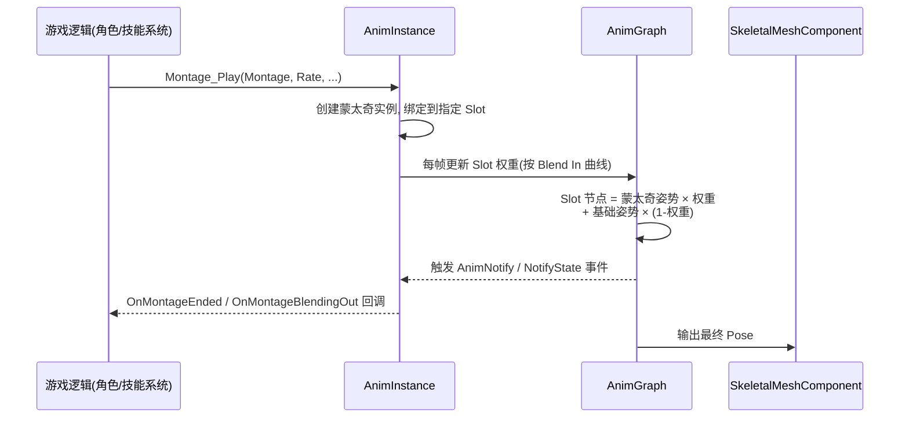
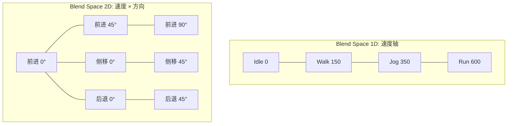
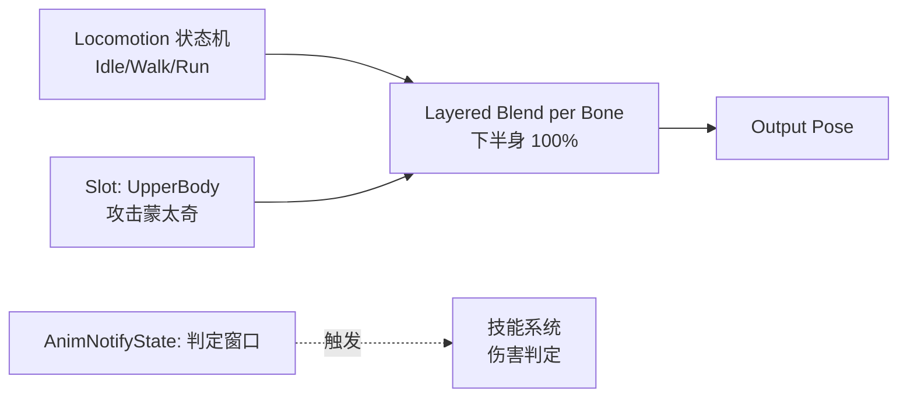

# 02-动画蒙太奇与混合空间

> 适用版本：UE 4.27 ~ UE 5.x（涉及 UE5 特性会单独标注）

## 概述

角色动画的需求可以分成两大类：

1. **一次性动作**：攻击、受击、施法、处决、翻越、开箱子——有明确的开始与结束，播放过程中要触发事件（判定、音效、镜头）；
2. **连续姿态**：走路、跑步、转身、瞄准——没有固定结束，随输入参数（速度、方向）连续变化。

UE 用两套工具分别解决：

| 需求 | 工具 |
| --- | --- |
| 一次性动作 + 事件 | **动画蒙太奇（Animation Montage）** |
| 连续参数化姿态 | **混合空间（Blend Space）** |

动画蒙太奇本质是"一条带事件、带分段、可跳转的动画时间轴"，通过 **Slot 插槽**叠加在动画蓝图之上，与状态机互不干扰；混合空间本质是"一组采样动画 + 参数插值"，通过 **Blend Space Player 节点**接入 AnimGraph。两者是动画蓝图（01 篇）最重要的两个"内容来源"。

## 核心概念

| 概念 | 英文 | 说明 | 关键点 |
| --- | --- | --- | --- |
| 动画蒙太奇 | Animation Montage | 由动画序列片段按时间轴组合、可播放可跳转的资产 | 带 Section / Slot / 通知 |
| 段落 | Section | 蒙太奇时间轴上的命名区间 | 可跳转、可循环、可设置下一个段落 |
| 插槽 | Slot | 蒙太奇注入 AnimGraph 的挂载点 | 必须与 AnimGraph 中 Slot 节点同名 |
| 淡入淡出 | Blend In / Blend Out | 蒙太奇进出插槽的权重过渡 | 时长与曲线可分别设置 |
| 动画通知 | AnimNotify | 时间轴上的单点事件 | 播放到该时间点触发一次 |
| 通知状态 | AnimNotifyState | 时间轴上的区间事件 | Begin / Tick / End 三个阶段 |
| 通知链 | Notify Chain | 按固定间隔自动触发的通知序列 | 用于连招节奏、动画事件编排 |
| 混合空间 | Blend Space | 一组采样动画按参数插值的资产 | 1D 单参数、2D 双参数 |
| 采样点 | Sample | 混合空间中的一段动画及其参数坐标 | 参数落在网格上 |
| 混合参数 | Blend Parameter | 驱动混合空间求值的输入值 | 通常来自移动速度/方向 |
| 瞄准偏移 | Aim Offset | 按视角朝向混合的混合空间 | 上半身瞄准姿态 |

## 原理详解

### 动画蒙太奇

#### 蒙太奇的资产结构

蒙太奇是一份"编排数据"，它不复制动画本身，而是引用若干动画序列并按时间轴排布：

```mermaid
flowchart TD
    M[AnimMontage 资产] --> S1[Section A<br/>动画序列 1 + 通知]
    M --> S2[Section B<br/>动画序列 2 + 通知]
    M --> S3[Section C<br/>动画序列 3 + 通知]
    M --> SL[Slot 名称<br/>如 DefaultSlot]
    M --> N[AnimNotify / AnimNotifyState 轨道]
    M --> G[Group / 同步组]
    S2 --> S3
    S1 --> S2
    S3 --> S1: 循环设置
```

关键字段：

- **Slot**：播放时注入的插槽名（默认 `DefaultSlot`），必须与 AnimGraph 中的 Slot 节点一致；
- **Section**：时间轴的命名分段，默认按顺序播放，也可任意跳转；
- **Blend In / Blend Out**：进入/退出插槽的权重过渡时长与曲线；
- **通知轨道**：挂载 AnimNotify / AnimNotifyState，触发玩法事件；
- **Group**：蒙太奇所属组，用于多角色同步播放（如处决演出双方）；
- **Root Motion 设置**：是否提取位移（详见 03 篇）。

#### 播放机制

蒙太奇的播放路径：



要点：

- `Montage_Play` 返回蒙太奇总时长（可指定 `EMontagePlayReturnType`）；
- 蒙太奇实例挂在 AnimInstance 上，通过 `GetCurrentActiveMontage` 查询；
- 蒙太奇**不打断状态机**：它只是给 Slot 喂姿势，状态机继续输出基础姿势（如 Idle/Walk）；
- 播放结束后蒙太奇实例自动回收，并触发 `OnMontageEnded` 委托。

#### Section 与跳转

- `Montage_JumpToSection("SectionName")`：立即跳到指定段落（可设置跳转后的混合时间）；
- `Montage_SetNextSection(Current, Next)`：当前段播完后自动进入下一段——这是**连招链**的标准实现方式；
- `Montage_GetCurrentSection`：查询当前段落名；
- 段落循环：把段落内动画设为循环播放（bLoop）可实现"持续施法/蓄力"效果，配合 `Montage_Stop` 中断。

#### Blend In / Blend Out 与 Slot 权重

Slot 节点的实际输出公式：

```text
SlotPose = MontagePose * SlotWeight + BasePose * (1 - SlotWeight)
```

- `SlotWeight` 由蒙太奇的 Blend In 曲线从 0 升到 1、Blend Out 从 1 降到 0；
- 多个蒙太奇同时播放时，Slot 权重是"叠加"的（后播的蒙太奇权重更高，具体由 `Montage_Play` 的 `bStopAllMontages` 等参数决定）；
- 查询权重：`GetSlotWeight("DefaultSlot")`。

#### 蒙太奇组与同步

把多个角色要"同步演出"的蒙太奇放入同一 Group，播放时同一组内的蒙太奇会按比例对齐节奏（类似 Sync Group），常用于：舞蹈、双人处决、团队庆祝动作。

#### 蒙太奇中的曲线与 Root Motion

- 蒙太奇可以携带动画曲线（如自定义 `AttackStrength` 曲线），供游戏逻辑读取；
- 蒙太奇的 Root Motion 配置（`bEnableRootMotion` 等）决定播放时角色是否被动画带动位移，详见 03 篇。

### AnimNotify 与 AnimNotifyState

#### 三类通知

| 类型 | 触发方式 | 典型用途 |
| --- | --- | --- |
| AnimNotify | 播放到时间点触发一次 | 音效、特效、脚步声、事件广播 |
| AnimNotifyState | 进入区间触发 Begin，离开触发 End，期间每帧 Tick | 攻击判定窗口、霸体状态、镜头切换 |
| Notify Chain | 按设定间隔连续触发多个通知 | 连招节奏、动画事件序列 |

#### 事件分发机制

通知在**游戏线程**分发（动画求值完成后合并回游戏线程再派发）：

- AnimInstance 蓝图：自动生成 `AnimNotify_<名称>` 事件；
- AnimInstance C++：重写 `AnimNotify_<名称>()` 函数，或监听 `OnNotifyBegin` / `OnNotifyEnd` 委托；
- 蒙太奇专属：`OnMontageNotify` 委托携带 `FName NotifyName`；
- NotifyState 三阶段回调：`NotifyBegin` / `NotifyTick` / `NotifyEnd`，均带 `MeshComp`、`Animation`、`DeltaSeconds` 等参数。

#### 触发细节

- 通知挂在**动画序列**上还是**蒙太奇轨道**上：序列通知随动画播放触发；蒙太奇通知在蒙太奇时间轴上触发（即使动画被 Section 跳转也按蒙太奇时间轴计算）；
- 通知触发位置受"触发时间（Trigger Time）"影响，默认在时间点，也可偏移；
- 通知不会在动画被跳过时丢失：UE 会在求值时检测"跨越了通知点"并补触发（受 `bTriggerOnSkip` 等设置影响）。

### 插槽动画（Slot）

Slot 是"蒙太奇与 AnimGraph 之间的接口"（01 篇已介绍节点本身），这里补充工程视角：

- **命名约定**：蒙太奇的 Slot 名必须与 AnimGraph 的 Slot 节点名完全一致（区分大小写）；
- **多 Slot 分层**：常见布局为 `FullBody`（全身）、`UpperBody`（上半身）、`LowerBody`（下半身）三个 Slot，分别配合不同的骨骼掩码；
- **骨骼掩码**：Slot 节点下游接 Layered Blend per Bone，用骨骼掩码限定"上半身混合、下半身保留移动姿态"；
- **Slot 与蒙太奇是一对多**：一个 Slot 可以先后/同时接收多个蒙太奇，权重叠加；
- **空 Slot**：没有蒙太奇播放时，Slot 节点直接透传基础姿势，零开销。

### 混合空间（Blend Space）

#### 1D 与 2D

- **Blend Space 1D**：一条参数轴（如速度 0~800），轴上放置采样动画（Idle、Walk、Jog、Run），参数落在两点之间时按距离线性插值；
- **Blend Space 2D**：两条参数轴（如速度 + 方向），平面上放置采样动画，参数落在三角形内时按**重心坐标**插值。



#### 求值算法

- **1D**：对参数值做分段线性插值，相邻两个采样点权重 = 参数到对方点的距离比例；
- **2D**：把参数点所在三角形（Delaunay 三角剖分）的三个顶点作为插值源，权重 = 重心坐标；
- 采样点之外的区域：按最近边界点"钳制"（Clamp）或外推；
- 每个采样动画内部还可以带**时间偏移**（Sample Rate / 相位），美术侧保证各采样动画脚步节奏一致，混合才不会脚滑。

#### 参数化混合

混合空间本身不产生参数，参数来自 AnimInstance 变量：

```text
Event BlueprintUpdateAnimation:
    Speed = 水平速度
    Direction = 速度方向与角色朝向的夹角（-180° ~ 180°）
```

AnimGraph 中 `Blend Space Player` 节点把 `Speed`、`Direction` 连到参数引脚即可。运行时**直接改 AnimInstance 变量**即实时改变混合结果，无需任何额外调用。

#### Aim Offset

Aim Offset 本质是"以视角朝向为参数"的混合空间（通常 2D：Yaw × Pitch），采样的是上半身/头部瞄准动画。要点：

- 只混合上半身骨骼（配合骨骼掩码），下半身继续走路；
- 参数来自控制器的旋转与 Pawn 朝向的差；
- 在动画蓝图中用 `Aim Offset` 节点（带 LookAt 计算）或手写参数传入 Blend Space Player。

#### 采样动画的数据要求

- 各采样动画循环播放且**节奏一致**（步频、相位对齐，否则混合时脚滑）；
- 姿势差异不能过大（Idle 到 Run 可以，Idle 到"翻滚"不合适——翻滚用状态机/蒙太奇）；
- 位移类动画建议勾选"原地循环"（Root Motion 关掉，靠移动组件位移）。

### 蒙太奇 × 混合空间 × 状态机的协同

一个典型的"移动中攻击"链路：



设计模式总结：

- **状态机**负责"底层姿态"（移动、空中、倒地）；
- **蒙太奇**负责"叠加动作"（攻击、受击、技能），通过 Slot 注入，不动状态机；
- **混合空间**负责"参数化姿态"（移动、瞄准），通常作为状态机内部状态的内容；
- 三者通过 **AnimInstance 变量**与**通知事件**解耦。

### UE5 新特性：Motion Matching 与 AnimNext

- UE5.4 起提供实验性 **Motion Matching**（姿势数据库 + 特征搜索），UE5.5+ 演进为 **AnimNext**；
- Motion Matching 本质是"更大规模的自动混合空间"：不手动放采样点，而是用一段段动作片段构建姿势库，每帧按特征（速度、方向、相位、上一步姿态）搜索最匹配片段；
- 蒙太奇在 AnimNext 中仍然存在，负责"必须精确控制"的动作（受击、处决、演出）；
- 对大多数项目，状态机 + 混合空间 + 蒙太奇仍是推荐基线；Motion Matching 适合"动作数量巨大、手工编排成本过高"的 3A 向项目。

## 代码/蓝图示例

### 示例一：C++ 播放蒙太奇

```cpp
// 在角色或技能组件中
UAnimInstance* Anim = GetMesh()->GetAnimInstance();
if (Anim && AttackMontage)
{
    // 播放，返回蒙太奇总时长（秒）
    const float Duration = Anim->Montage_Play(AttackMontage, 1.0f);

    // 立即跳到指定段落（如连招第二段）
    Anim->Montage_JumpToSection(FName("Combo2"), AttackMontage);

    // 设置下一段落：当前段播完后自动进入 Combo2（连招链核心）
    Anim->Montage_SetNextSection(FName("Combo1"), FName("Combo2"), AttackMontage);
}

// 停止播放（带淡出）
Anim->Montage_Stop(0.2f, AttackMontage);
```

常用查询接口：

```cpp
Anim->Montage_GetCurrentSection();          // 当前段落名
Anim->GetCurrentActiveMontage();            // 当前激活的蒙太奇
Anim->Montage_IsPlaying(AttackMontage);     // 是否正在播放
float W = Anim->GetSlotWeight(FName("DefaultSlot")); // 插槽权重
```

### 示例二：蓝图播放与事件监听

- 播放：`Montage Play` 节点（输入蒙太奇、播放速率、起始 Section 等）；
- 跳转：`Montage Jump to Section`、`Montage Set Next Section`、`Montage Stop`、`Montage Get Current Section`；
- 事件绑定：在 AnimInstance 的 EventGraph 中用 `Assign OnMontageEnded` / `Assign OnMontageBlendingOut` / `Assign OnMontageStarted` 委托节点绑定回调；
- 播放完毕后推荐用 `OnMontageBlendingOut`（淡出开始）而不是 `OnMontageEnded`（完全结束）做"收尾逻辑"，响应更及时。

### 示例三：AnimNotifyState 实现攻击判定窗口（C++）

```cpp
// AnimNotifyState_AttackWindow.h
#pragma once

#include "Animation/AnimNotifies/AnimNotifyState.h"
#include "AnimNotifyState_AttackWindow.generated.h"

UCLASS(meta = (DisplayName = "Attack Hit Window"))
class MYGAME_API UAnimNotifyState_AttackWindow : public UAnimNotifyState
{
    GENERATED_BODY()

public:
    /** 判定半径 */
    UPROPERTY(EditAnywhere, Category = "Attack")
    float Radius = 100.f;

    virtual void NotifyBegin(USkeletalMeshComponent* MeshComp, UAnimSequenceBase* Animation,
        float TotalDuration, const FAnimNotifyEventReference& EventReference) override;
    virtual void NotifyTick(USkeletalMeshComponent* MeshComp, UAnimSequenceBase* Animation,
        float FrameDeltaTime, const FAnimNotifyEventReference& EventReference) override;
    virtual void NotifyEnd(USkeletalMeshComponent* MeshComp, UAnimSequenceBase* Animation,
        const FAnimNotifyEventReference& EventReference) override;
};
```

```cpp
// AnimNotifyState_AttackWindow.cpp
void UAnimNotifyState_AttackWindow::NotifyBegin(USkeletalMeshComponent* MeshComp,
    UAnimSequenceBase* Animation, float TotalDuration, const FAnimNotifyEventReference& EventReference)
{
    Super::NotifyBegin(MeshComp, Animation, TotalDuration, EventReference);
    // 通知技能组件开启攻击判定（激活碰撞盒 / 注册可命中列表）
    if (AActor* Owner = MeshComp->GetOwner())
    {
        Owner->OnAttackWindowBegin(Radius); // 项目自定义接口
    }
}

void UAnimNotifyState_AttackWindow::NotifyTick(USkeletalMeshComponent* MeshComp,
    UAnimSequenceBase* Animation, float FrameDeltaTime, const FAnimNotifyEventReference& EventReference)
{
    Super::NotifyTick(MeshComp, Animation, FrameDeltaTime, EventReference);
    // 每帧做一次球形检测（如果判定要求持续检测）
}

void UAnimNotifyState_AttackWindow::NotifyEnd(USkeletalMeshComponent* MeshComp,
    UAnimSequenceBase* Animation, const FAnimNotifyEventReference& EventReference)
{
    Super::NotifyEnd(MeshComp, Animation, EventReference);
    // 关闭攻击判定
    if (AActor* Owner = MeshComp->GetOwner())
    {
        Owner->OnAttackWindowEnd();
    }
}
```

> 注：UE5 的 Notify 回调签名带 `const FAnimNotifyEventReference&` 参数；UE 4.26 及更早版本无此参数，移植时注意。

### 示例四：在 AnimInstance 中接收通知（C++）

```cpp
// 以"AnimNotify_" + 通知名命名的成员函数会被引擎自动调用
void UMyAnimInstance::AnimNotify_FootStep(const FAnimNotifyEventReference& EventReference)
{
    // 播放脚步音效 / 生成脚印特效
}

// 蓝图侧等价：AnimBP 中会自动出现 AnimNotify_FootStep 事件
```

### 示例五：创建并使用混合空间（步骤）

1. 内容浏览器右键 → 动画（Animation）→ 混合空间（Blend Space 1D / Blend Space 2D），选择目标 Skeleton；
2. 打开资产，设置坐标轴：水平轴命名 `Speed`，范围 0 ~ 600，网格 4 格；2D 再加垂直轴 `Direction`，范围 -180 ~ 180；
3. 把采样动画拖到网格节点上（或右键添加采样）；
4. 打开动画蓝图 AnimGraph，添加 `Blend Space Player` 节点，指定该资产；
5. 把 `Speed`、`Direction` 变量连到节点参数引脚，连到输出姿势；
6. 运行游戏，用 AnimDebugger 查看当前参数值与各采样动画的混合权重。

### 示例六：2D 速度-方向混合设计参考

| 采样点（方向°, 速度） | 动画 | 说明 |
| --- | --- | --- |
| (0, 150) | Fwd_Walk | 前进走 |
| (0, 450) | Fwd_Run | 前进跑 |
| (90, 150) | StrafeR_Walk | 右侧平移走 |
| (180, 150) | Back_Walk | 后退走 |
| (-90, 150) | StrafeL_Walk | 左侧平移走 |
| (45, 450) | FwdR45_Run | 右前 45° 跑 |

要点：

- 方向角按"角色朝向为 0°，逆时针为正"的惯例归一化到 [-180, 180]；
- 速度分段要覆盖实际移动区间，中间留足够采样点避免插值"糊"；
- 每个方向象限的动画脚步节奏必须一致，否则混合时会脚滑。

### 示例七：运行时更新混合参数

混合空间没有"Set 参数"接口——参数就是 AnimInstance 变量，直接赋值即可：

```cpp
// NativeUpdateAnimation 中
const FVector Velocity = Pawn->GetVelocity();
Speed = Velocity.Size2D();

// 方向：速度方向相对角色朝向的夹角
const FVector ActorForward = Pawn->GetActorForwardVector();
const FVector VelDir = Velocity.GetSafeNormal2D();
Direction = FMath::RadiansToDegrees(FMath::Atan2(
    FVector::CrossProduct(ActorForward, VelDir).Z,
    FVector::DotProduct(ActorForward, VelDir)));
```

## 最佳实践

1. **一次性动作一律用蒙太奇**，不要塞进状态机当状态——状态机负责连续姿态，蒙太奇负责离散动作，混用会导致状态爆炸；
2. **Slot 命名项目级统一**：`FullBody` / `UpperBody` / `LowerBody`，并在蒙太奇资产与 AnimGraph 节点间保持一致；
3. **Section 命名规范**：如 `Combo1`、`Combo2`、`Recovery`，连招用 `SetNextSection` 实现而不是"播完再播下一个"；
4. **判定/伤害逻辑放技能系统**，通知只负责"触发信号"，不要在通知里写重逻辑；
5. **窗口型效果用 AnimNotifyState**（Begin/End），点事件用 AnimNotify；
6. **收尾逻辑绑定 OnMontageBlendingOut**，比 OnMontageEnded 更早、更稳；
7. **蒙太奇 Blend Out 时间与下一动作衔接**：受击后摇可以长，普通攻击收招要短，避免"动作之间粘滞"；
8. **混合空间采样动画必须节奏对齐**：步频、相位一致是脚滑问题的根源，优先检查这个；
9. **2D 混合空间的方向参数要归一化**（-180~180），并处理"从 179° 到 -179° 的绕圈"问题（见 FAQ）；
10. **Aim Offset 只混合上半身骨骼**，用骨骼掩码隔离下半身；
11. **参数计算放 EventGraph / NativeUpdateAnimation**，每帧更新一次；不要在 AnimGraph 里重复计算；
12. **蒙太奇复用**：同一骨架的角色可共用蒙太奇；跨骨架需要重定向（IK Retarget）或制作多套；
13. **控制同时播放的蒙太奇数量**：每多一个蒙太奇实例就多一份采样与混合开销，同一 Slot 通常只允许一个活跃蒙太奇；
14. **多人演出用蒙太奇 Group 同步**：处决、舞蹈等需要多角色节奏对齐的场景，用 Group 而不是手动对齐；
15. **网络注意**：蒙太奇播放要复制（Replicated），通知在客户端各自触发，判定以服务器为准（详见 06 篇）。

## 常见问题 FAQ

### Q1：蒙太奇播完后角色回不到原来的移动状态？

检查：① 状态机是否一直在输出基础姿势（Slot 只是叠加层，如果基础姿势本身被切走，问题在状态机）；② 蒙太奇是否循环或停在最后一段没有 Blend Out（检查 `bEnableAutoBlendOut`）；③ 是否在 `OnMontageEnded` 里做了多余的状态切换。

### Q2：AnimNotify 不触发？

依次排查：① 通知是否挂在了正确的轨道（序列通知 vs 蒙太奇通知）；② 通知名是否与 AnimBP 中的事件名一致（`AnimNotify_` 前缀）；③ 动画是否真的播到了那个时间点（被 Section 跳转跳过时，蒙太奇轨道通知仍会触发，序列通知可能被跳过）；④ C++ 签名是否与引擎版本匹配（UE5 带 `FAnimNotifyEventReference` 参数）。

### Q3：播放蒙太奇时角色瞬移/位移异常？

多数是 Root Motion 问题：蒙太奇勾选了提取 Root Motion 而移动组件没有消费，或反之。检查蒙太奇资产的 `bEnableRootMotion`、动画序列的 `bForceRootLock`，以及移动组件的 `bApplyRootMotion` 相关设置（详见 03 篇 Root Motion 章节）。

### Q4：混合空间参数跳变导致动画乱跳？

参数本身突变（如速度从 600 瞬间变 0）会让混合权重突变。解决：① 在 NativeUpdateAnimation 中对参数做平滑（指数平滑或 `FInterpTo`）；② 混合空间节点上开启平滑（Blend Time）；③ 确认参数更新频率一致（不要某帧不更新）。

### Q5：2D 混合空间方向从 179° 跳到 -179° 时动画绕一大圈？

这是方向角"环绕"问题。解决：计算方向差时做角度归一化（`FRotator::NormalizeAxis` / 蓝图 `Normalize Axis`），或维护一个连续的角度值（累积角度而不是每帧重新计算夹角），避免跨越 ±180° 边界。

### Q6：连招按快了断连 / 连不上？

连招依赖 `Montage_SetNextSection` 在"上一段还在播"时提前设置；如果按太快（上一段还没到允许衔接点）或太慢（已经 Blend Out），都会断。做法：① 在允许衔接的动画区间放 AnimNotify，通知里调用 SetNextSection；② 或在输入系统做窗口判定（按帧记录输入缓冲，收到通知时消费）。

### Q7：多人联机时蒙太奇不同步？

蒙太奇播放必须在服务器执行并复制（`bReplicates` 的组件/角色调用 `Montage_Play` 且该函数本身是 `BlueprintCallable` 的 RPC 组合），客户端不要各自本地播放不同步的蒙太奇。对演出型蒙太奇，还要考虑用 Group 对齐与"跳过非关键段"（同步组 Sync Group 对齐设置）。详见 06 篇。

### Q8：混合空间里走路和跑步过渡时脚滑？

两个原因：① 采样动画步频不一致（美术修动画）；② 过渡瞬间速度参数变化过快导致权重剧烈变化（加参数平滑）。另外走路/跑步切换也可以交给状态机 + 同步组（见 01 篇），混合空间只负责"同一姿态内的连续变化"。

### Q9：蒙太奇里的动画播放速度与角色实际移动速度不匹配？

蒙太奇中的位移动画有两种做法：① 关闭 Root Motion，位移交给移动组件，动画只管"摆腿"，此时用混合空间更合适；② 开启 Root Motion，动画自带位移，此时要保证动画位移速度与玩法速度一致（美术按规格制作）。混合使用会导致"飘"。

### Q10：多个蒙太奇同时播放，权重乱了？

同一 Slot 同一时刻应只有一个"主导"蒙太奇：播放新蒙太奇前先 `Montage_Stop` 旧的（或用 `bStopAllMontages`），或让新蒙太奇更高权重（默认新播放的蒙太奇权重更高）。不同 Slot（FullBody / UpperBody）之间互不干扰，但要注意骨骼掩码是否重叠。

## 关联阅读

- [01-动画蓝图与状态机](01-动画蓝图与状态机.md)：Slot 节点、同步组、AnimGraph 更新流程——蒙太奇与混合空间都运行在这套框架上。
- [03-IK与程序化动画](03-IK与程序化动画.md)：蒙太奇 Root Motion 提取、Foot IK 与混合空间/蒙太奇的配合。
- [06-网络同步](../06-网络同步/README.md)：蒙太奇播放复制、动画曲线同步。
- [07-UI与性能优化](../07-UI与性能优化/README.md)：蒙太奇与混合空间的求值开销。
