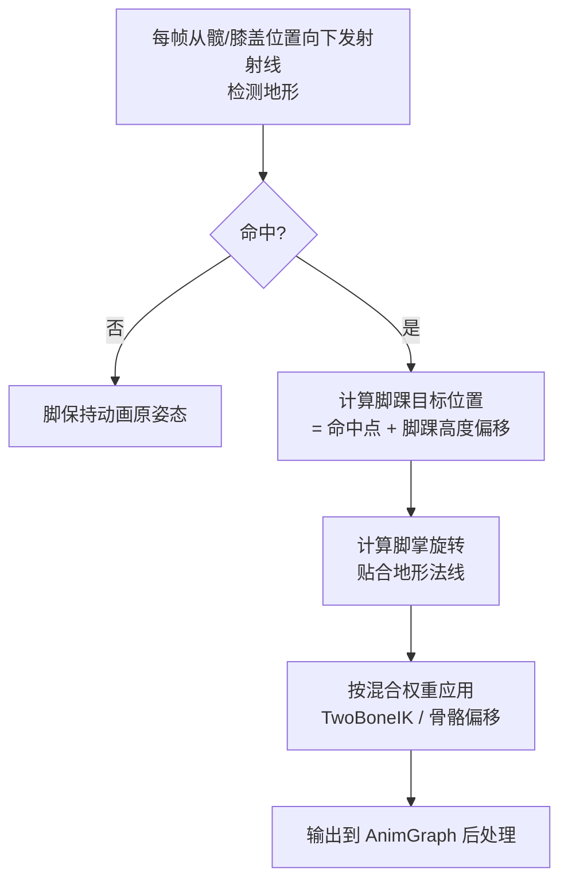
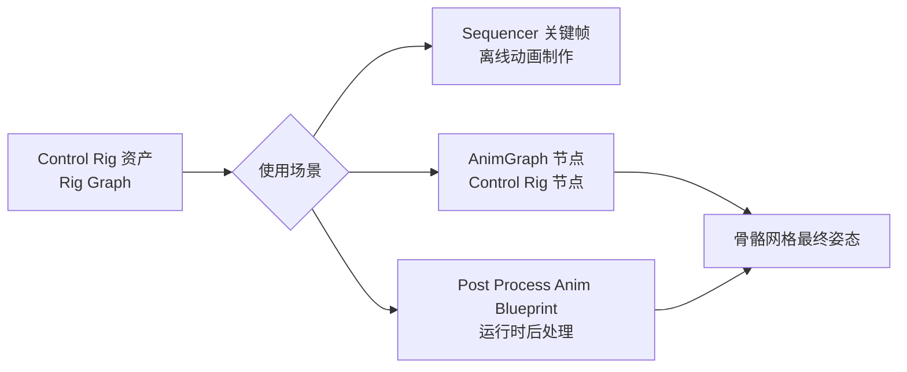
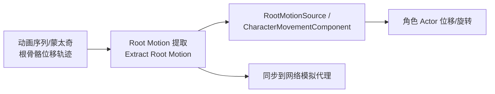

# 03-IK与程序化动画

> 版本基准：UE 5.8.0（本机 `Engine/Build/Build.version`：CL 55116800，分支 `++UE5+Release-5.8`）。
> 源码依据：`C:\Program Files\Epic Games\UE_5.8\Engine\Plugins\Animation\ControlRig`、`Engine\Source\Runtime\Engine\Private\Animation`。
> 适用范围：IK、Control Rig、程序化动画与 Root Motion 的使用层说明。
> 兼容性边界：UE 4.27 仅作为历史兼容性与迁移对照，当前 API 以 UE 5.8 为准。
> 最后更新：2026-08-05（统一 UE5.8 版本基线）。
> 官方参考：[Unreal Engine UE5.8 官方文档总页](https://dev.epicgames.com/documentation/en-us/unreal-engine)。

## 概述

关键帧动画是"录好的剧本"：美术把每个时刻的姿势写死，引擎照本宣科。但真实世界不按剧本走：

- 角色站在斜坡上，预制的"平地站立"动画会让脚悬空或陷进地面；
- 角色伸手去抓栏杆，栏杆高度千变万化，美术不可能为每种高度做一段动画；
- 尾巴、头发、披风需要随风/惯性摆动，关键帧做不自然；
- 翻越、被击飞等动作需要角色位移与动画精确对应。

这些问题的答案分别是 **IK（逆向运动学）**、**Control Rig（UE5 程序化绑定）**、**程序化动画 / 动画驱动**与 **Root Motion**。本文依次讲解它们的原理、UE 中的实现方式与最佳实践。

## 核心概念

| 概念 | 英文 | 说明 | 关键点 |
| --- | --- | --- | --- |
| 正向运动学 | FK | 由关节旋转推出末端位置 | 关键帧动画的本质 |
| 逆向运动学 | IK | 由末端目标位置反推关节旋转 | 手/脚贴合环境 |
| 双骨 IK | TwoBoneIK | 三关节链（如大臂-小臂-手）的解析求解 | 开销小、稳定 |
| 前向后向迭代 | FABRIK | 迭代式 IK：前向调整+后向调整直至收敛 | 适合多骨链条 |
| 极向量 | Pole Vector | 控制中间关节朝向的辅助点 | 防止肘/膝反关节 |
| 脚部 IK | Foot IK | 让脚贴合地面（位置+旋转） | 射线检测 + 混合 |
| 控制绑定 | Control Rig | UE5 的骨骼程序化控制框架 | Rig Graph 蓝图化 |
| 绑定图 | Rig Graph | Control Rig 内的节点图 | 求解顺序从上到下 |
| 全身 IK | Full Body IK | 全身多链同时求解（含质心控制） | UE5.3+ |
| 程序化动画 | Procedural Animation | 用算法/物理生成姿态而非关键帧 | 弹簧、噪波、规则 |
| 动画物理 | AnimDynamics | 骨骼链的轻量物理模拟 | 尾巴、头发、披风 |
| 根骨骼运动 | Root Motion | 由动画数据驱动角色位移/旋转 | 提取模式 |
| 运动匹配 | Motion Matching | 从姿势库中按特征搜索最佳片段 | UE5.4+ 实验特性 |
| 动画驱动 | Animation Driven | 以动画数据（曲线/姿势）驱动玩法或物理 | 曲线读取、物理混合 |

## 原理详解

### 正向运动学（FK）与逆向运动学（IK）

| 维度 | FK | IK |
| --- | --- | --- |
| 输入 | 各关节旋转 | 末端目标位置/旋转 |
| 输出 | 末端位置 | 各关节旋转 |
| 确定性 | 唯一解 | 可能多解/无解 |
| 用途 | 关键帧动画、蒙皮 | 手抓握、脚落地、链条跟随 |

UE 中的动画系统默认是 FK 的：动画曲线给出每个骨骼的旋转，逐级相乘得到末端位置。IK 则是反过来：先定末端（比如手要碰到某个点），再反推中间关节怎么转。

### TwoBoneIK：解析求解

TwoBoneIK 处理"三关节链"：根骨骼 → 中间骨骼 → 末端骨骼（如 大臂 → 小臂 → 手）。它的求解是**解析的**（直接算，不迭代），因此又快又稳：

1. 已知链长 L1（根→中）、L2（中→末端）与目标点位置；
2. 用**余弦定理**计算中间关节需要弯曲的角度：

```text
cos(θ) = (L1² + D² - L2²) / (2 * L1 * D)
其中 D = 根关节到目标点的距离
θ 即中间关节的弯曲角（受关节旋转限制轴约束）
```

3. 末端骨骼旋转对齐到目标方向；
4. 用 **极向量（Pole Vector）** 或 **关节目标（Joint Target）** 决定整条链的"朝向面"——否则肘/膝可能朝错误方向弯曲（反关节）。

UE 中对应节点：`Two Bone IK`（AnimGraph 蓝图节点）、Control Rig 中的 `Two Bone IK` 求解器。参数：IK 骨骼（末端）、效应器（Effector）位置/旋转、极向量。

适用场景：手臂抓握、腿脚落地、持枪手部修正——**链短、要求实时稳定的场合**。

### FABRIK：迭代求解

FABRIK（Forward And Backward Reaching Inverse Kinematics）适合**长链条**（尾巴、触手、绳索、脊椎）：

算法核心（每轮迭代两个阶段）：

```text
输入: 根位置 R, 末端目标 T, 每节链长 L[i], 最大迭代次数 N

for iter = 1..N:
    # 阶段一：前向调整（从末端向根）
    末端 = T
    从末端沿链向根逐个调整，使每节距离等于 L[i]
    # 阶段二：后向调整（从根向末端）
    根 = R
    从根沿链向末端逐个调整，使每节距离等于 L[i]
    若 |当前末端 - T| < 阈值: 提前收敛
```

特点：

- 对骨长与关节限制的处理比解析法灵活（可附加关节旋转限制）；
- 收敛速度与迭代次数成正比，迭代太少会"够不到"，太多浪费性能（一般 5~20 次足够）；
- 不会出现解析法的"奇异点"问题，但对**极向量控制**的支持较弱（需额外约束）。

UE 中对应节点：`FABRIK`（AnimGraph 蓝图节点）、Control Rig 中的 FABRIK 求解器。适用场景：尾巴、触手、绳索、脊椎弯曲。

### Foot IK（脚部落地）

#### 问题

角色在斜坡、台阶、起伏地形上行走时，预制的循环动画假设地面是平的：脚会悬空（下坡）或陷进地面（上坡），严重破坏沉浸感。

#### 标准实现流程



细节要点：

- **射线起点**：通常从 Capsule（胶囊体）底部或膝盖骨骼向下发射，距离限制在脚踝到地面的合理范围（如 50~120cm），避免远处悬崖把腿拉断；
- **偏移上限**：位置偏移与旋转都要做 Clamp（如位置 ±30cm、旋转 ±45°），防止 IK 把骨骼拉出合理范围；
- **混合**：脚部 IK 权重随移动速度变化（静止时 100%，快跑时降低），并做平滑过渡，否则快速奔跑时脚部会抖动；
- **斜坡 vs 台阶**：纯射线对台阶会产生"脚瞬间跳变"，高级做法是**预测式步态（Foot Placement Prediction）**：提前采样前方地形，在摆腿相（Swing Phase）就把脚落点规划好；
- **两条腿的优先级**：同时处理双脚时，注意重心约束——两脚都被强行贴合会导致骨盆下沉，通常对骨盆做平均补偿。

### Control Rig（UE5）

#### 是什么

Control Rig 是 UE5 的骨骼程序化控制框架：用 **Rig Graph**（节点图，类似蓝图）直接操作骨骼层级，创建"控制柄（Control）"、FK/IK 链、程序化求解器，并可在**动画蓝图后处理**、**Sequencer**、**运行时**三个层面使用。

#### 接入方式



- **Sequencer**：动画师直接在时间轴上打关键帧控制 Control/骨骼，程序化求解器自动完成中间姿态（如 IK 手跟随标记物）；
- **AnimGraph**：作为普通动画节点接入求值链，输入姿势 → Control Rig 求解 → 输出姿势；
- **Post Process Anim Blueprint**：作为"最后一公里"后处理，把 IK、程序化修正叠加在一切动画之上（Foot IK 常用此方式）。

#### Rig Graph 关键概念

- **层级（Rig Hierarchy）**：骨骼（Bone）、控制柄（Control）、空间（Space）、IK 目标等元素组成层级，是求解的基础数据结构；
- **空间（Space）**：每个元素有父空间（本地/父级/世界），求解时自动换算，实现"控制柄跟随世界位置但相对父级旋转"等需求；
- **求解顺序**：Rig Graph 从上到下执行，前面节点输出成为后面节点的输入；常见的"FK → IK → 程序化修正"顺序就是靠图结构保证的；
- **求解器（Solver）**：FK Chain、Two Bone IK、FABRIK、CCD、Full Body IK（UE5.3+）、Spring（弹簧）、Physics（物理）等；
- **运行时开销**：Rig Graph 是蓝图虚拟机求值，比原生 AnimGraph 节点慢，复杂 Rig 要注意性能（尤其移动端）。

#### Full Body IK（UE5.3+）

全身 IK 求解器：把全身姿态看作多个链（腿链、脊柱链、手臂链）的联合优化，支持质心（Center of Mass）控制、脚部接触约束、手部目标等。适合"全身贴合环境"（攀爬、蹲在岩石上），但参数多、调参复杂、开销高，按需使用。

### 程序化动画（Procedural Animation）

#### 概念与分类

程序化动画指**用算法实时生成姿态**，而非播放录制数据。常见三类：

| 类别 | 手段 | 例子 |
| --- | --- | --- |
| 数学函数 | 正弦、噪波（Perlin/Simplex）、贝塞尔 | 呼吸起伏、待机微动、触角摆动 |
| 物理模拟 | 弹簧-阻尼、AnimDynamics、布料 | 尾巴惯性、头发、披风 |
| 规则/约束 | 面向目标、距离约束、IK 求解 | 眼球追踪、手跟随、避障 |

#### 弹簧控制器（Spring Controller）

程序化动画的"瑞士军刀"：给目标位置/旋转加一个"质量-弹簧-阻尼"模型，输出会**平滑追赶**目标并带有自然过冲。用途：

- 尾巴/头发：目标 = FK 动画姿势，输出 = 带惯性延迟的姿势；
- 武器/道具：跟随手部运动时带延迟感；
- 抖动修正：把高频噪声平滑掉。

参数只有三个：刚度（Stiffness）、阻尼（Damping）、质量（Mass），调参直觉：刚度大跟得快、阻尼大不弹跳。

#### 程序化尾巴示例思路

1. 建立 FK 链（3~6 节骨骼）；
2. 每节加 Spring 控制器，目标跟随上一节的输出；
3. 根部由动画驱动（或由移动速度驱动摆动幅度）；
4. 末端可加噪声（Simplex Noise）模拟微风。

优点：无限变化、响应环境（跑动时甩动幅度自动变大）；缺点：难以精确复现特定姿势、需要大量调参。

### 动画驱动（Animation-Driven）

"动画驱动"指**以动画数据作为输入驱动其他系统**，常见两种：

#### 曲线驱动玩法

动画曲线（Animation Curve）是动画时间轴上的标量/向量曲线，可被游戏逻辑读取：

```cpp
// 读取名为 "FootstepStrength" 的曲线值（0~1）
const float Strength = AnimInstance->GetCurveValue(FName("FootstepStrength"));
```

典型用法：伤害随"挥砍曲线"变化、脚步声随"落地曲线"触发、镜头震动幅度随曲线调制。

#### 动画驱动物理

让物理模拟"以动画为参考"而不是完全自由：

- **Physics Asset 的 Animation Driven 模式**：物理体不主动模拟，而是跟踪动画骨骼变换（做插值/限位），适合"布料式披风跟随手部动作"；
- **AnimDynamics**：AnimGraph 节点，对骨骼链做轻量物理模拟（关节约束 + 弹簧），比 Chaos Cloth 便宜，适合尾巴、头发、配饰；
- **物理动画混合（Physical Animation Blend）**：角色 ragdoll 与动画之间按权重混合，用于"被击飞 → 落地 → 站起来"的过渡（`GetPhysicalAnimationComponent` / `SetBlendWeight`）；
- **布料（Chaos Cloth / 旧版 APEX Cloth）**：真正的高质量布料模拟，头发/裙子/披风首选，开销最高。

### Root Motion（根骨骼运动）

#### 什么是 Root Motion

普通移动：角色的位移由移动组件（速度、加速度）决定，动画只负责"摆姿势"；Root Motion 则相反：**位移和旋转由动画数据提供**——根骨骼（Root Bone，通常是骨盆或脚底）在动画里的运动被提取出来，驱动角色实际移动。



#### 提取模式

| 模式 | 行为 | 适用 |
| --- | --- | --- |
| LeaveRootMotionInPlace | 根骨骼位移被"扣下"，角色不动，动画原地播放 | 测试、位移由代码控制的场合 |
| IgnoreRootMotion | 完全忽略动画位移 | 移动组件全权负责位移 |
| RootMotionFromEverything | 所有动画（含普通循环）都提取 Root Motion | 需要动画精确驱动一切位移时 |
| RootMotionFromMontagesOnly | 只有蒙太奇提取 Root Motion | **最常用**：日常移动用移动组件，攀爬/处决/技能用动画驱动 |

#### 使用要点

- 蒙太奇资产上勾选 Root Motion 相关选项（`bEnableRootMotion` / 提取方式），动画序列的根骨骼必须有实际位移轨迹（美术制作规范）；
- 播放带 Root Motion 的蒙太奇时，`CharacterMovementComponent` 会创建 `RootMotionSource`（如 `FRootMotionSource_MoveToForce`）接管移动，期间移动输入被忽略；
- 网络下：Root Motion 位移由服务器权威计算，模拟代理通过复制的位置插值跟随；注意蒙太奇在客户端也要播放（否则本地表现与服务器位移脱节）；
- Root Motion 与物理碰撞：位移是"瞬移式"推进，撞墙会被移动组件阻挡，但动画本身不会因此停止——需要自己处理"卡住"逻辑（如检测位移被阻挡后取消蒙太奇）。

### Motion Matching 简述（UE5）

- **思想**：不手动画状态机，而是维护一个**姿势库**（大量动作片段 + 特征标注），每帧根据当前特征（速度、方向、相位、上一步骨骼位置）在库中搜索最匹配的片段并切换到它；
- **特征（Pose Features）**：骨骼位置/速度/朝向的高维向量，用距离度量做近邻搜索；
- **UE5 现状**：UE5.4 提供实验性 Motion Matching；UE5.5+ 以 **AnimNext** 框架承载（姿势资产 + 运行时图），仍处于演进中；
- **取舍**：表现自然度与开发效率高（少画状态机），但内存与搜索开销大、可预测性差（难以精确指定"下一招必须出 X"），与蒙太奇/状态机是互补关系。

## 代码/蓝图示例

### 示例一：蓝图配置 Two Bone IK 节点

在 AnimGraph 中（放在状态机输出之后、Output Pose 之前）：

1. 添加 `Two Bone IK` 节点，输入连接状态机输出姿势；
2. 属性设置：
   - **IK Bones**：`Foot_L`（末端骨骼，引擎自动推导中间骨骼与根骨骼：`Foot_L` → `Knee_L` → `Thigh_L`）；
   - **Effector**：提供目标位置（`Effector Location`）与目标旋转（`Effector Rotation`）；
   - **Pole Vector**：`Pole_L`（膝盖后方的一个辅助点/骨骼），控制膝盖朝向；
   - **Alpha**：混合权重（0~1），建议用变量控制（如 FootIKAlpha）。
3. 两个脚各接一个 Two Bone IK 节点，再连到 Output Pose。

要点：Effector 位置由 Foot IK 射线检测算出（见示例三），Pole Vector 一般取"膝盖骨骼沿角色朝向后方偏移一段距离"的位置。

### 示例二：蓝图配置 FABRIK 节点

1. 添加 `FABRIK` 节点；
2. 设置 **Effector**（链条末端目标，如尾巴尖）、**Root Bone**（链条根部）、**Chain**（链长，几节骨骼）；
3. 调 **Iterations**（迭代次数，默认 10，链条长/精度要求高时增加，注意性能）；
4. **Precision**：收敛阈值，达到后提前结束迭代；
5. Alpha 控制混合权重。

适用：尾巴、触手、绳索。若需要"保持原动画大致形状"，可在 FABRIK 前后叠加姿势缓存混合（Cached Pose）。

### 示例三：Foot IK 完整实现（蓝图步骤）

推荐放在 **Post Process Anim Blueprint**（或 AnimGraph 后处理段）：

1. 在角色蓝图/动画蓝图初始化时，把射线起点设为"髋部骨骼的世界位置"（或胶囊体底部）；
2. 每帧（`Event BlueprintUpdateAnimation`）：
   - 对左脚：从 `Thigh_L` 世界位置向下发射 `Line Trace By Channel`（通道选 WorldStatic / 地形），Trace 距离 = 脚踝到地面的预估高度 + 50cm；
   - 命中：`Hit Location` 作为脚踝目标位置（加上脚踝到脚底的高度偏移），`Hit Normal` 作为脚掌旋转参考；
   - 未命中：沿用动画原位置（或向原位置回退）；
3. 对命中结果做 Clamp（位置偏移 ±30cm、俯仰/翻滚旋转 ±45°）并做平滑（`FInterp` / 指数平滑）；
4. 把结果赋给 AnimInstance 变量（`FootL_Offset`、`FootL_Rotation`）；
5. AnimGraph 中 Two Bone IK 节点的 Effector 使用这些变量；
6. **骨盆补偿**：两脚偏移的平均值反向作用到骨盆骨骼（防止下蹲/拉伸感）；
7. 权重控制：静止时 1.0，跑动时降到 0.3 左右，用速度参数驱动并平滑。

进阶（预测式步态）：在"摆腿相"提前 0.1~0.2 秒采样前方地形，把目标落点预置，解决台阶"跳变"问题。

### 示例四：Control Rig 使用步骤（程序化尾巴）

1. 内容浏览器右键 → 动画 → Control Rig，选择目标 Skeleton，打开 Rig Graph；
2. 在 **Rig Hierarchy** 中把尾巴骨骼链（`Tail_1` ~ `Tail_5`）添加为可操作骨骼；
3. 为每节骨骼创建 **Control**（控制柄）或直接对骨骼加 FK 链求解器（FK Chain 节点：起始骨骼 + 数量）；
4. 每个 FK 节点后接 **Spring**（弹簧）节点：目标 = FK 输出，输出 = 带惯性的结果；
5. 根节点（`Tail_1`）的摆动幅度用蓝图变量/曲线驱动（或读取移动速度）；
6. 末端加 `Noise`（噪波）节点模拟微风；
7. 保存后，在角色 AnimGraph 添加 **Control Rig** 节点引用该资产（或设为 Post Process Anim Blueprint）；
8. 运行调试：Rig Graph 支持逐节点查看输出、画 Control 手柄。

### 示例五：C++ 读取动画曲线

```cpp
// AnimInstance 子类中
void UMyAnimInstance::NativeUpdateAnimation(float DeltaSeconds)
{
    Super::NativeUpdateAnimation(DeltaSeconds);

    // 读取动画曲线（不存在时返回 0）
    const float AttackPower = GetCurveValue(FName("AttackPower"));
    // 判断曲线是否存在
    if (HasCurveValue(FName("AttackPower")))
    {
        // ...
    }
}
```

### 示例六：C++ 获取 Root Motion 信息

```cpp
// 查询当前是否正在消费 Root Motion 的蒙太奇
if (UAnimMontage* Montage = GetCurrentActiveMontage())
{
    // 蒙太奇是否提取 Root Motion
    const bool bExtract = Montage->bEnableRootMotion;
}

// 获取根骨骼在 Component Space 的当前变换（用于自绘调试）
const FTransform RootTransform = GetOwningComponent()->GetBoneTransform(
    GetOwningComponent()->GetBoneIndex(FName("root")));
```

### 示例七：AnimDynamics 配置（披风/尾巴）

1. 在 AnimGraph 中添加 `Anim Dynamics` 节点；
2. 指定起始骨骼与链长（如 `Cape_1`，链长 6）；
3. 设置 **Linear/Angular Limits**（约束类型：Free / Limited / Locked）与弹簧常数、阻尼；
4. 开启 `bUsePlanarLimit` 可加平面约束（防止穿模）；
5. 用 Alpha 控制与动画的混合程度（完全跟随动画 vs 完全物理）。

注意：AnimDynamics 在 CPU 上模拟，链越长、约束越多开销越大；移动端限制链长与数量。

## 最佳实践

1. **先确认"真的需要 IK 吗"**：平地关卡、无抓取需求的角色，Foot IK 与手部 IK 是纯开销；先用最简单的"骨骼偏移"验证表现，不够再加 IK 链；
2. **短链用 TwoBoneIK，长链用 FABRIK**：三关节链解析解又快又稳；超过三节（尾巴、触手）用 FABRIK/CCD；
3. **极向量/关节目标必须提供**：不设极向量，TwoBoneIK 会在关节朝向上自由选择，导致肘/膝反关节，随机性极强；
4. **Foot IK 三条铁律**：射线距离 Clamp（防悬崖拉腿）、偏移旋转 Clamp（防姿态崩坏）、权重随速度衰减（防跑动抖动）；
5. **骨盆补偿**：双脚都做 Foot IK 时，用双脚偏移均值反向修正骨盆/髋部，避免角色"下沉"或"拉伸"；
6. **IK 尽量放后处理**：Foot IK、手部修正放 Post Process Anim Blueprint 或 AnimGraph 末端，避免与状态机/蒙太奇内部节点耦合；
7. **Control Rig 注意运行时开销**：Rig Graph 是 VM 求值，复杂图在移动端可能成为瓶颈；Sequencer 用 Control Rig 没成本顾虑，运行时接入要谨慎；
8. **弹簧调参从"低刚度 + 高阻尼"起步**：先求稳再求"活"，过冲过大（阻尼太小）会让尾巴/头发看起来像橡皮筋；
9. **AnimDynamics 链长克制**：链越长收敛越差、开销越大；简单披风 4~6 节足够；高质量布料需求走 Chaos Cloth；
10. **Root Motion 默认 `RootMotionFromMontagesOnly`**：日常移动交给移动组件，只有攀爬/处决/技能/过场用动画驱动位移，两类系统各司其职；
11. **Root Motion 需要美术规范**：根骨骼必须有可控的位移轨迹，动画必须"位移与脚步一致"，否则会出现"滑步位移"；
12. **网络下 Root Motion 以服务器为准**：服务器消费 Root Motion 位移并复制位置，客户端播放同一蒙太奇保证表现一致；位移被阻挡要主动检测并取消（防"穿墙动画"）；
13. **曲线驱动玩法要文档化**：每条动画曲线（名称、含义、取值范围、消费方）登记在案，否则美术与程序互相猜；
14. **Motion Matching 先做原型验证**：评估姿势库内存、搜索耗时、与现有蒙太奇/状态机的衔接，再决定是否全面引入；
15. **调试可视化**：IK 目标点、射线、极向量用 `Draw Debug` 画出来调参，比肉眼猜快一个量级。

## 常见问题 FAQ

### Q1：TwoBoneIK 之后膝盖/肘部反关节？

几乎都是极向量（Pole Vector）缺失或方向错误。检查：① 是否设置了极向量；② 极向量位置是否在链的"预期弯曲侧"（膝盖朝前、肘部朝后）；③ 目标点与根骨骼距离超过链总长时（目标太远），任何 IK 都会把链拉直并可能翻转——先 Clamp 目标距离。

### Q2：FABRIK 链够不到目标？

① 迭代次数太少（加到 20 以上试）；② 链条骨长之和小于目标距离（物理上够不到，只能拉直）；③ 关节旋转限制（Rotation Limit）过紧导致收敛被卡——放宽限制或增加迭代；④ 确认 Root Bone 与 Effector 配置正确（选错骨骼会整条链错位）。

### Q3：Foot IK 让脚抖得像抽搐？

典型原因：① 射线命中点在帧间剧烈变化（台阶边缘、小物体）——加历史平滑（指数平滑/时间插值）与命中"迟滞"；② 权重随速度变化太快——权重平滑；③ 射线从膝盖发出导致摆动腿时距离突变——改用髋部发射并限制距离；④ 双脚同时强约束导致骨盆竞争——加骨盆补偿与权重上限。

### Q4：斜坡上脚还是陷地/悬空？

检查射线是否用了"世界静态碰撞"且地形有碰撞体；检查偏移是否被 Clamp 得太小（斜坡大时所需偏移大）；检查脚掌旋转是否真正应用（只做了位置没做旋转，脚会"平着陷进去"）。另外斜坡角度超过约 45° 时应限制 IK 强度，交给动画本身表现。

### Q5：Control Rig 与蒙太奇/骨骼掩码同时用时姿态冲突？

Control Rig 后处理会作用在**最终姿势**上，蒙太奇、骨骼掩码都在它之前——所以顺序应该是"蒙太奇/Slot → 分层混合 → Control Rig 修正"。若 Control Rig 修正了不该动的骨骼（如手臂被蒙太奇控制），在 Rig 内按骨骼/标签过滤，或把 Control Rig 节点放在 AnimGraph 中更靠前的位置。

### Q6：Control Rig 运行时性能差？

先定位：Anim Insights 里看 Rig 节点耗时。常见优化：① 降低求解频率（隔帧求解并插值）；② 精简 Rig Graph（减少节点与求解器数量）；③ 低 LOD 时切换到简化 Rig 或不启用；④ 避免在 Rig 里做循环与字符串操作。移动端尤其注意。

### Q7：Root Motion 位移不对或网络下角色"飘"？

本地：检查提取模式（是否 `IgnoreRootMotion` 误开）、蒙太奇是否真的勾选了提取、根骨骼轨迹是否存在。网络：服务器与客户端必须播放同一蒙太奇；模拟代理跟随复制位置，若客户端本地也消费了 Root Motion 会造成"双重位移"——确认只有服务器（或拥有者）消费。

### Q8：Root Motion 蒙太奇撞墙后角色卡住？

移动组件会阻挡 Root Motion 推进，但动画照播。处理：检测"期望位移 vs 实际位移"差值，超过阈值说明被阻挡，调用 `Montage_Stop` 并切换到失败动画/状态（如攀爬失败落地）。也可用 `bAllowPhysicsFallDuringMontage` 等选项让角色在蒙太奇中正常受重力。

### Q9：AnimDynamics/物理混合表现生硬或穿模？

生硬：约束过紧或弹簧刚度过高，降低刚度/增加阻尼；穿模：加平面约束（Planar Limit）或增大碰撞体；混合权重跳变：对权重做平滑。物理动画混合（Ragdoll→动画）记得用"匹配时间"（匹配时间点）让过渡在姿态接近时发生。

### Q10：程序化尾巴在低帧率下抖动/失真？

物理与弹簧模拟对帧率敏感：用固定时间步长（`FMath::FixedTurn` / 引擎的固定步长物理）计算，或用 `DeltaSeconds` 做正确的时间缩放；低帧率下减小弹簧刚度或增加阻尼；必要时降采样（每 2 帧算一次，插值输出）。

## 关联阅读

- [01-动画蓝图与状态机](01-动画蓝图与状态机.md)：IK 与 Control Rig 都作为 AnimGraph 节点/后处理存在，先理解动画图更新流程与并行求值约束。
- [02-动画蒙太奇与混合空间](02-动画蒙太奇与混合空间.md)：蒙太奇的 Root Motion 配置、混合空间与 Foot IK 的配合。
- [06-网络同步](../06-网络同步/README.md)：Root Motion 复制、动画曲线同步。
- [07-UI与性能优化](../07-UI与性能优化/README.md)：IK/Control Rig/AnimDynamics 的性能剖析与 LOD 策略。
