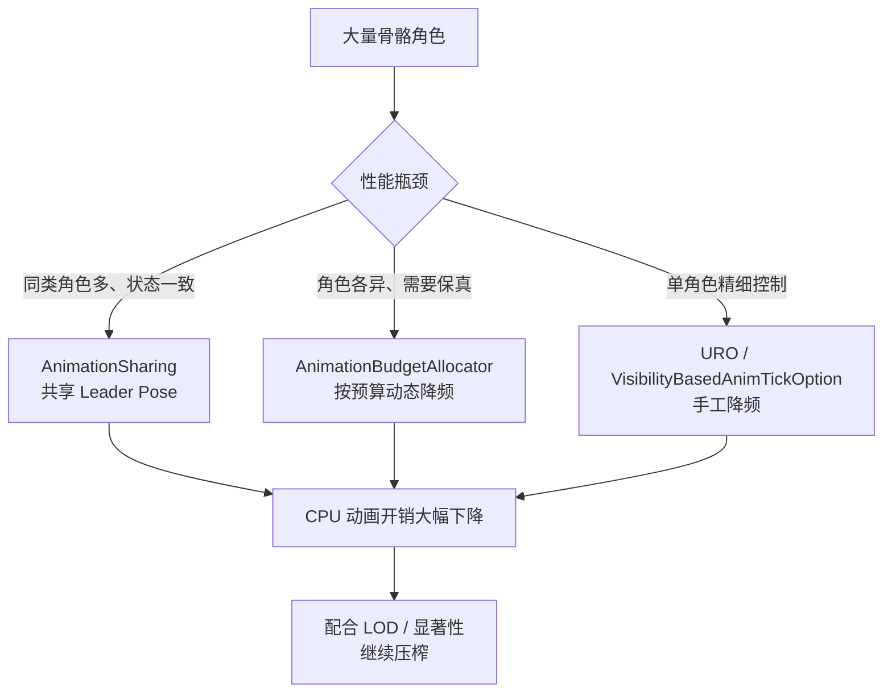
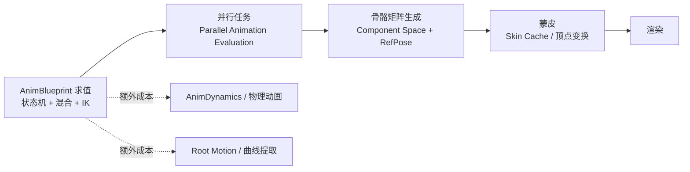
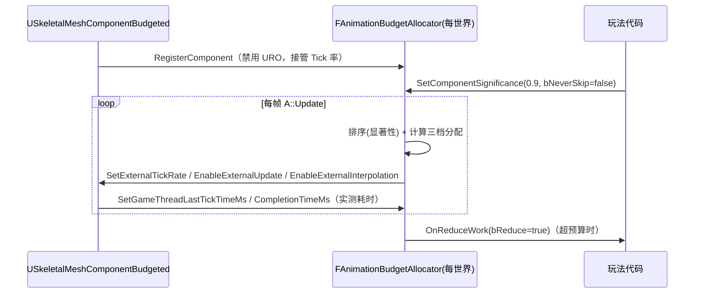
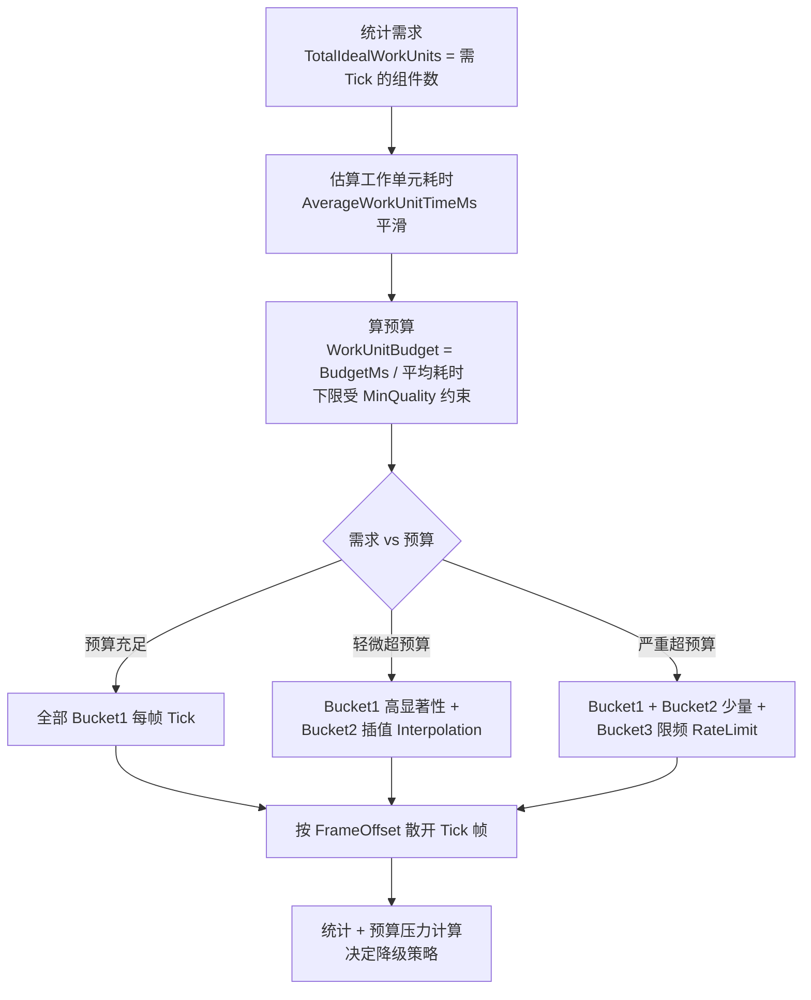
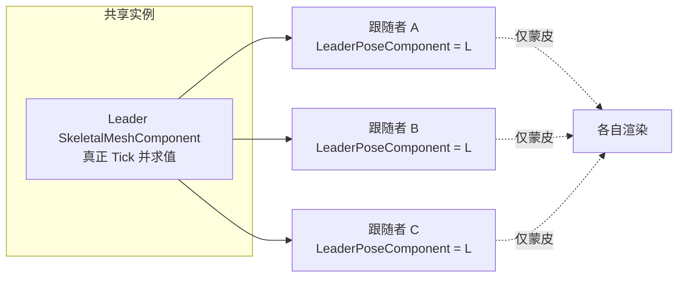

# 04 · 动画性能与预算分配

> 适用版本：UE 5.x（关键 API 已对照本机 UE 5.8 源码验证：`Engine/Plugins/Runtime/AnimationBudgetAllocator/Source/AnimationBudgetAllocator/Public/` 与 `Engine/Plugins/Developer/AnimationSharing/Source/AnimationSharing/Public/`）

## 1. 概述

大规模战斗场景里，几百个角色同时播放骨骼动画，是 CPU 上最容易被忽视的开销大户之一：每个骨骼网格体每帧都要走"动画求值 → 混合 → 骨骼矩阵更新 → 蒙皮"整条流水线。逐角色优化收效甚微，**预算分配（Budgeting）** 才是规模化方案——先定一个"动画总预算"，再按显著性把预算分给最值得的角色。



本文重点讲解 **AnimationBudgetAllocator（动画预算分配器，ABA）**：它的预算算法、工作分配方式、`USkeletalMeshComponentBudgeted` 组件、`a.Budget.*` 参数调优与降级策略；随后简述 **AnimationSharing（动画共享）**——让同类型角色共享同一份动画求值结果。二者解决的是不同场景的问题：ABA 保每个角色"各自的动画"，AnimationSharing 让一堆角色"用同一份动画"。

---

## 2. 核心概念（表格）

| 概念 | 英文 | 说明 | 关键点 |
| --- | --- | --- | --- |
| 动画预算 | Animation Budget | 每帧分配给骨骼动画的总耗时上限（毫秒） | 默认 `a.Budget.BudgetMs` = 1.0 |
| 预算分配器 | AnimationBudgetAllocator | 按预算动态调节每个组件 Tick 频率的系统 | 每世界一个实例 |
| 预算组件 | USkeletalMeshComponentBudgeted | 受预算器管理的骨骼网格组件 | 蓝图可直接放置 |
| 工作单元 | Work Unit | 一次完整动画求值（≈一个组件的单次 Tick） | 用耗时估算数量 |
| 平均工作单元耗时 | AverageWorkUnitTimeMs | 平滑后的单次求值平均耗时 | 决定能跑多少个组件 |
| 显著性 | Significance | 组件的重要性（0~1），决定分配优先级 | 可自动按距离计算 |
| 总是 Tick | Always Tick | 高显著性组件每帧完整求值 | 第一档（Bucket 1） |
| 插值 | Interpolation | 低频求值 + 帧间姿态插值补足表现 | 第二档（Bucket 2） |
| 限频 | Rate Limiting | 按 TickRate 跳帧，跳过帧复用旧姿态 | 第三档（Bucket 3） |
| 预算压力 | Budget Pressure | 需求/预算比值，>1 即超预算 | 触发降级策略 |
| 降级工作 | Reduced Work | 通过委托通知组件减少单次求值成本 | 如关 IK、降 LOD 动画 |
| 离屏管理 | Offscreen | 屏幕外组件大幅降频/暂停 | MaxTickedOffsreen=4 |
| 更新率优化 | URO | 引擎自带 Update Rate Optimizations | 注册 ABA 后自动禁用 |
| 动画共享 | AnimationSharing | 同类角色共享同一骨骼网格组件求值 | Leader Pose Component |
| 主导姿势组件 | Leader Pose Component | 共享求值的"主人"组件 | 跟随者只做蒙皮 |
| 按需状态 | On-Demand State | 需要时才播放的一次性动画（如攻击） | 共享实例池 |
| 状态处理器 | StateProcessor | 决定每个 Actor 当前处于哪个动画状态 | 蓝图可继承 |
| 可扩展性设置 | FAnimationSharingScalability | 按平台控制共享实例数/混合数 | PerPlatform |

---

## 3. 原理详解

### 3.1 骨骼动画的成本构成

一个骨骼角色每帧的动画流水线：



成本决定因素（由高到低）：

| 因素 | 影响 | 优化方向 |
| --- | --- | --- |
| 骨骼数量与 LOD | 每根骨骼都要变换矩阵 | 动画 LOD、骨骼过滤 |
| 状态机/混合节点复杂度 | 节点越多求值越贵 | 简化 AnimGraph、用 State Machine 缓存 |
| 并行求值是否启用 | 串行会卡 Game 线程 | 保持 `a.ParallelAnimEvaluation` 开启（5.8，前缀为 `a.`） |
| IK / 物理动画 | TwoBoneIK、AnimDynamics 逐骨骼计算 | 按距离/显著性开关 |
| 蒙皮顶点数 | 顶点变换与带宽 | 网格 LOD、Skin Cache |
| 组件数量 | 每个组件独立走一遍流水线 | ABA / AnimationSharing / URO |

### 3.2 三种降载手段的定位

| 手段 | 思路 | 优点 | 缺点 |
| --- | --- | --- | --- |
| URO（Update Rate Optimizations） | 组件按"最近渲染时间"自动跳帧 | 引擎内置、零接入成本 | 策略固定、不可控、无全局预算 |
| AnimationBudgetAllocator | 全局预算 + 显著性动态分配 Tick | 精准控预算、可编程降级 | 需要接入预算组件、参数需调优 |
| AnimationSharing | 同类角色共享一份求值结果 | 成本与角色数几乎无关 | 姿态一致、无法个性化、配置复杂 |

三者不互斥：**ABA 管"谁 Tick、多久 Tick 一次"**，**AnimationSharing 管"让多个角色只算一份"**，URO 在未接入 ABA 的组件上仍可兜底。

### 3.3 AnimationBudgetAllocator 架构与组件注册

ABA 是一个插件模块（`AnimationBudgetAllocator`），对外接口是 `IAnimationBudgetAllocator`（源码 `IAnimationBudgetAllocator.h`），按世界获取单例：

```cpp
static ANIMATIONBUDGETALLOCATOR_API IAnimationBudgetAllocator* Get(UWorld* InWorld);
```

核心接口（全部纯虚）：

| 接口 | 作用 |
| --- | --- |
| `RegisterComponent(USkeletalMeshComponentBudgeted*)` | 注册组件进入预算管理 |
| `UnregisterComponent(...)` / `UnregisterAllComponents()` | 注销，恢复默认 Tick |
| `UpdateComponentTickPrerequsites(...)` | 更新组件 Tick 前置条件（如角色根组件） |
| `SetComponentSignificance(Comp, Significance, bNeverSkip, bTickEvenIfNotRendered, bAllowReducedWork, bForceInterpolate)` | 设置显著性及行为标志 |
| `SetComponentTickEnabled(...)` / `IsComponentTickEnabled(...)` | 开关单个组件的 Tick |
| `SetIsRunningReducedWork(...)` | 告知预算器组件已进入降级状态 |
| `SetGameThreadLastTickTimeMs / SetGameThreadLastCompletionTimeMs` | 上报每次求值实测耗时 |
| `Update(float DeltaSeconds)` | 每帧执行预算分配（引擎自动调用） |
| `SetEnabled / GetEnabled` | 总开关 |
| `SetParameters(const FAnimationBudgetAllocatorParameters&)` | 运行时整体替换参数 |
| `ForceNextTickThisFrame(...)` | 强制某组件本帧 Tick（如攻击瞬间） |
| `AddExternalAnimationTimeSpentThisFrame(float)` | 把外部动画耗时计入预算（如手动 Tick 的动画） |

注册后组件行为变化（源码 `RegisterComponent` 明确实现）：

```cpp
// FAnimationBudgetAllocator::RegisterComponent（UE 5.8 源码摘录）
InComponent->bEnableUpdateRateOptimizations = false;   // 1. 禁用 URO（避免双重跳帧）
InComponent->EnableExternalTickRateControl(true);      // 2. 接管外部 Tick 率控制
// 3. 并行动画任务改由预算器调度（EnableExternalUpdate / EnableExternalInterpolation 等）
```

注销时反向恢复：`bEnableUpdateRateOptimizations = true`、`EnableExternalTickRateControl(false)`、重新启用 Tick。

`USkeletalMeshComponentBudgeted`（源码 `SkeletalMeshComponentBudgeted.h`）是 `USkeletalMeshComponent` 的子类，三个公开配置属性：

| 属性（UPROPERTY） | 默认 | 说明 |
| --- | --- | --- |
| `bAutoRegisterWithBudgetAllocator` | false | 是否在注册时自动加入预算器（蓝图可改，`BlueprintSetter`） |
| `bAutoCalculateSignificance` | false | 是否自动按距离计算显著性（用 `OnCalculateSignificance` 静态委托） |
| `bShouldUseActorRenderedFlag` | false | 可见性判断用所属 Actor 的渲染状态而非组件自身 |

组件侧还暴露：`SetComponentSignificance(...)`（与预算器同名方法）、`OnReduceWork()` 委托（`FOnReduceWork`，两个参数：组件指针 + 是否降级）、静态 `OnCalculateSignificance()` 委托（`FOnCalculateSignificance`，返回 float 显著性）。



### 3.4 预算算法：工作单元与三档分配

算法核心在 `FAnimationBudgetAllocator::CalculateWorkDistributionAndQueue`（源码 `AnimationBudgetAllocator.cpp`），分四步：



#### 第一步：估算工作单元

每个组件每次求值后上报 `GameThreadLastTickTimeMs`（求值耗时）与 `GameThreadLastCompletionTimeMs`（并行任务完成耗时），预算器维护平滑平均值：

```text
AverageTickTimeMs = TotalEstimatedTickTimeMs / NumWorkUnitsForAverage
AverageWorkUnitTimeMs = FInterpTo(AverageWorkUnitTimeMs, AverageTickTimeMs, DeltaSeconds, WorkUnitSmoothingSpeed)
```

`WorkUnitSmoothingSpeed`（默认 5.0）控制收敛速度；新组件首次使用 `InitialEstimatedWorkUnitTimeMs`（默认 0.08ms）作为估算。

#### 第二步：计算可用工作单元数

```text
AvailableBudget    = BudgetInMs - ExternalAnimationTimeSpent          // 减去外部动画耗时
WorkUnitBudget     = max(AvailableBudget / AverageWorkUnitTimeMs,
                         TotalIdealWorkUnits * MinQuality)            // 下限保质量
WorkUnitsExcess    = max(0, TotalIdealWorkUnits - WorkUnitBudget)     // 超预算幅度
```

`MinQuality`（默认 0）是质量下限：非 0 时允许**超预算**以保证最低帧率表现。

#### 第三步：三档分配（按显著性从高到低）

```text
Bucket1（总是 Tick）：
    WorkUnitsToRunInFull = clamp(WorkUnitBudget - WorkUnitsExcess * AlwaysTickFalloffAggression,
                                 NumComponentsToNotSkip, TotalIdealWorkUnits)
    TickRate = 1，不插值

Bucket2（插值）：
    WorkUnitsToInterpolate = min(max(剩余预算 - WorkUnitsExcess * InterpolationFalloffAggression,
                                     min(MaxInterpolatedComponents, 不可限频数)),
                                 剩余需求)
    DesiredTickRate 按 Alpha 在 2 ~ InterpolationMaxRate(6) 之间线性插值

Bucket3（限频）：
    剩余组件按 Alpha 在 2 ~ MaxThrottleRate 之间分配 TickRate
    MaxThrottleRate = min(ceil(max(1, 剩余需求/剩余预算) * 2), MaxTickRate(10))
```

三档的 Aggression 参数（`AlwaysTickFalloffAggression`=0.8、`InterpolationFalloffAggression`=0.4）控制超预算时各档收缩速度：**先砍限频、再砍插值、最后砍总是 Tick 的**。

#### 第四步：散开 Tick 与插值补偿

```cpp
// 源码 QueueForTick：用帧号 + 组件偏移取模，让各组件 Tick 帧均匀散开
bool bTickThisFrame = (((GFrameCounter + ComponentData.FrameOffset) % ComponentData.TickRate) == 0);
```

- 插值组件：`EnableExternalInterpolation(TickRate > 1 && bInterpolate)`，跳过帧之间用 `SetExternalInterpolationAlpha` 逐步逼近最新姿态（Alpha = `clamp(1 / 剩余跳帧数)`），`InterpolationTickMultiplier`（默认 0.75）估算插值 Tick 的折算成本；
- 外部 DeltaTime：跳过帧的 `AccumulatedDeltaTime` 会累加并乘以 `CustomTimeDilation` 后通过 `SetExternalDeltaTime` 注入，保证动画时间连续（Root Motion 消耗也基于它）；
- **前置条件（Prerequisite）**：角色 Mesh 与其 Root 组件（如 CharacterMovement 的根）Tick 率取两者最小值，避免"身体先走、动画后追"的脱节。

### 3.5 降级策略（Reduced Work）与离屏管理

当预算压力（`BudgetPressure = TotalIdeal / WorkUnitBudget`，经 `BudgetPressureSmoothingSpeed` 平滑）持续偏高时，预算器通过 `OnReduceWork` 委托通知组件"请降低单次求值成本"：

| 参数 | 默认 | 行为 |
| --- | --- | --- |
| `BudgetFactorBeforeReducedWork` | 1.5 | 压力 > 1.5 才开始降级（迟滞起点） |
| `BudgetFactorBeforeReducedWorkEpsilon` | 0.25 | 压力 < 1.25 才解除降级（迟滞窗口，防抖动） |
| `BudgetFactorBeforeAggressiveReducedWork` | 2.0 | 压力 > 2.0 加速切换（每帧可切更多组件） |
| `ReducedWorkThrottleMinInFrames` / `MaxInFrames` | 2 / 20 | 状态切换节流帧数（越紧张切换越快） |
| `ReducedWorkThrottleMaxPerFrame` | 4 | 每帧最多切换降级状态的组件数 |
| `BudgetPressureBeforeEmergencyReducedWork` | 2.5 | 压力 > 2.5 触发"紧急降级"（除 AlwaysTick 外全部降级） |
| `a.Budget.EmergencyReduceWorkDisabled` | 0 | 置 1 可关闭紧急降级 |

**降级后做什么由项目决定**：常见做法是切换更便宜的动画、关闭 AnimDynamics/IK、降低动画 LOD。引擎只负责"通知"（`OnReduceWork().Execute(Component, true)`），不替你做具体降级。

**离屏管理**：屏幕外组件（`NonRenderedComponentData`，按显著性排序）默认只保留 `MaxTickedOffsreenComponents`（默认 4）个继续 Tick，其余暂停；`bTickEvenIfNotRendered` 可豁免；`a.Budget.ComponentsWithZeroSigAreNonRendered` 把零显著性组件视为离屏处理；`a.Budget.MaintainReduceWorkWhenOffScreen`（默认 0）决定离屏组件在预算宽裕时是否保留降级状态。

### 3.6 参数调优：CVar 总表

所有参数都可通过 `a.Budget.*` 控制台变量（全部 `ECVF_Scalability`，可进 Scalability ini）或 `FAnimationBudgetAllocatorParameters`（BlueprintType 结构体，可用 `SetParameters` 运行时设置）修改：

| CVar | 默认 | 范围 | 说明 |
| --- | --- | --- | --- |
| `a.Budget.Enabled` | 0 | 0/1 | 总开关（应在无运行中骨骼网格时切换） |
| `a.Budget.BudgetMs` | 1.0 | >0.1 | 动画总预算（毫秒） |
| `a.Budget.MinQuality` | 0.0 | [0,1] | 最低质量比例，非 0 允许超预算 |
| `a.Budget.MaxTickRate` | 10 | >=1 | 单个组件最大跳帧（最低 1/10 帧率） |
| `a.Budget.WorkUnitSmoothingSpeed` | 5.0 | >0.1 | 平均工作单元耗时收敛速度 |
| `a.Budget.AlwaysTickFalloffAggression` | 0.8 | [0.1,0.9] | 超预算时"总是 Tick"档收缩力度 |
| `a.Budget.InterpolationFalloffAggression` | 0.4 | [0.1,0.9] | 超预算时"插值"档收缩力度 |
| `a.Budget.InterpolationMaxRate` | 6 | >1 | 插值组件的最大跳帧 |
| `a.Budget.MaxInterpolatedComponents` | 16 | >=0 | 最多同时插值组件数 |
| `a.Budget.InterpolationTickMultiplier` | 0.75 | [0.1,0.9] | 插值 Tick 相对完整 Tick 的折算系数 |
| `a.Budget.InitialEstimatedWorkUnitTime` | 0.08 | >0 | 新组件的初始估算耗时（ms） |
| `a.Budget.MaxTickedOffsreen` | 4 | >=1 | 离屏仍 Tick 的组件数上限 |
| `a.Budget.StateChangeThrottleInFrames` | 30 | [1,128] | Tick 档位切换节流帧数 |
| `a.Budget.BudgetFactorBeforeReducedWork` | 1.5 | >1 | 开始降级的压力阈值 |
| `a.Budget.BudgetFactorBeforeReducedWorkEpsilon` | 0.25 | >0 | 解除降级的迟滞窗口 |
| `a.Budget.BudgetPressureSmoothingSpeed` | 3.0 | >0 | 预算压力平滑速度 |
| `a.Budget.ReducedWorkThrottleMinInFrames` | 2 | [1,255] | 降级切换最小节流帧数 |
| `a.Budget.ReducedWorkThrottleMaxInFrames` | 20 | [1,255] | 降级切换最大节流帧数 |
| `a.Budget.BudgetFactorBeforeAggressiveReducedWork` | 2.0 | >1 | 激进降级阈值 |
| `a.Budget.ReducedWorkThrottleMaxPerFrame` | 4 | [1,255] | 每帧最多切换降级组件数 |
| `a.Budget.BudgetPressureBeforeEmergencyReducedWork` | 2.5 | >0 | 紧急降级阈值 |
| `a.Budget.AutoCalculatedSignificanceMaxDistance` | 30000 | >1 | 自动显著性归零距离（cm） |
| `a.Budget.MaintainReduceWorkWhenOffScreen` | 0 | 0/1 | 离屏保留降级状态 |
| `a.Budget.ComponentsWithZeroSigAreNonRendered` | 0 | 0/1 | 零显著性视为离屏 |
| `a.Budget.ForceTickWhenComponentExitsOffScreen` | 0 | 0/1 | 离屏转屏上时强制补一帧 |

调试用 CVar：`a.Budget.Debug.Enabled`（可视化）、`a.Budget.Debug.DisableGraph`、`a.Budget.Debug.VerboseActive`、`a.Budget.Debug.Verbose.ShowNames/ShowActorNames/ShowNonTicking/ShowOnCanvas`、`a.Budget.Debug.ShowAddresses`；强制状态 CVar（非 Shipping/Test）：`a.Budget.Debug.Force` + `Force.ExcludeAlwaysTicked` + `Force.Rate`（默认 4）+ `Force.Interp` + `Force.Reduced`。

### 3.7 调试与统计

- `a.Budget.Debug.Enabled 1`：屏幕上叠加每个组件的 Tick 状态（绿色 = Tick、橙色 = 插值、红色 = 停更/离屏），并显示预算压力曲线图；
- `stat AnimationBudgetAllocator` 组：`NumTickedComponents`、`NumRegisteredComponents`、`Demand`、`Budget`、`AlwaysTick`、`Interpolated`、`Throttled`、`AverageWorkUnitTime`、`SmoothedBudgetPressure` 等；
- CSV 统计（`AnimationBudget` 组）：`NumTicked`、`AnimQuality`（= 实际 Tick 数/需求数）、`AverageTickRate`、`NumAlwaysTicked`、`NumInterpolated`、`NumThrottled`——跑性能测试时直接对比质量曲线。

### 3.8 AnimationSharing 简述

AnimationSharing 插件（`AnimationSharing`，5.8 中位于 `Plugins/Developer/`）解决"一百个同类型小怪用同一套动画"的场景：**一份动画求值，多个组件共享结果**。



核心对象（源码 `AnimationSharingManager.h` / `AnimationSharingSetup.h` / `AnimationSharingTypes.h`）：

| 对象 | 职责 |
| --- | --- |
| `UAnimationSharingSetup` | 配置资产：`SkeletonSetups`（每个骨骼一套）+ `ScalabilitySettings` |
| `FPerSkeletonAnimationSharingSetup` | 骨骼级配置：Skeleton、SkeletalMesh、混合/叠加 AnimBP、StateProcessorClass、`AnimationStates` |
| `FAnimationStateEntry` | 单个状态：`State`（枚举值）、`AnimationSetups`、`bOnDemand`（按需）、`BlendTime`、`MaximumNumberOfConcurrentInstances`、`WiggleTimePercentage`、`bAdditive` |
| `UAnimationSharingStateProcessor` | 决定"每个 Actor 处于哪个状态"（蓝图实现 `ProcessActorState` / `GetAnimationStateEnum`） |
| `UAnimationSharingManager` | 每世界管理器：创建、注册 Actor、Tick 全部共享实例 |
| `UAnimSharingInstance` | 每个骨骼一套运行数据：`PerStateData`、`BlendInstances`、`OnDemandInstances`、`AdditiveInstances` |
| `FAnimationSharingScalability` | 平台可扩展性：`UseBlendTransitions`、`MaximumNumberConcurrentBlends`、`BlendSignificanceValue`、`TickSignificanceValue`、`RequireCurvesDuringBlends` |

工作方式：

1. 美术/TA 配置 `UAnimationSharingSetup` 资产（每个骨架：状态枚举、每个状态的动画序列与实例数）；
2. 游戏启动时 `UAnimationSharingManager::CreateAnimationSharingManager(WorldContext, Setup)` 创建管理器（仅一次）；
3. 角色生成后 `RegisterActorWithSkeleton(Pawn, Skeleton)`（蓝图节点 **Register Actor**）注册；
4. 管理器每帧 `TickActorStates` 通过 StateProcessor 判定状态，把 Actor 挂到对应状态的共享组件（`SetLeaderComponentForActor` / `SetupFollowerComponent`）上，共享组件只有**需要时**才 Tick（`FollowerTickRequiredFrameBits` 按帧位图标记）；
5. 一次性动画（攻击、处决）走 `FOnDemandInstance` 池：并发数受 `MaximumNumberOfConcurrentInstances` 限制，满了就用 `WiggleTimePercentage` 内的旧实例顶替；状态切换走 `FBlendInstance`（`FTransitionBlendInstance` 混合实例）；叠加动画（受击闪红等）走 `FAdditiveInstance`（5.8 中旧签名 `SetupAdditiveInstance` 已弃用，改用传 `USkeletalMeshComponent*` 的新签名）。

**代价**：所有跟随者的姿态完全一致（同状态同动画同相位，除非配置多实例随机化 `NumRandomizedInstances` 错开相位）；跟随者不能用个性化 AnimBP；材质参数缓存（`bEnableMaterialParameterCaching`）需按需开启。适合低优先级的杂兵、鸟群、鱼群；主角、Boss、关键 NPC 不适合。

---

## 4. C++ / 蓝图示例

### 4.1 蓝图：使用 SkeletalMeshComponentBudgeted

1. 在角色蓝图（或 C++ 组件列表）中添加 **Skeletal Mesh Component (Budgeted)**（类名 `SkeletalMeshComponentBudgeted`，蓝图可生成组件）；
2. 组件细节面板 **Budgeting** 分类下：
   - **Auto Register With Budget Allocator** = true（自动加入预算器）；
   - **Auto Calculate Significance** = true（按距离自动计算显著性）；
   - **Should Use Actor Rendered Flag** = false（保持组件自身可见性判断）；
3. 骨骼网格体赋值照常（Mesh / AnimClass 不变）；
4. 运行时执行 `a.Budget.Enabled 1` 开启预算器。

> 注意：项目默认 `a.Budget.Enabled=0`，只放置 Budgeted 组件不会生效；也建议在 `DefaultEngine.ini` 的 `[ScalabilitySettings]` 或启动参数中按平台预设。

### 4.2 C++：显著性驱动 + 降级回调

```cpp
// MyCharacter.h
#include "Components/SkeletalMeshComponentBudgeted.h"

UPROPERTY(VisibleAnywhere, BlueprintReadOnly, Category = "Animation")
TObjectPtr<USkeletalMeshComponentBudgeted> BudgetedMesh;

// 降级回调：收到 true 时降低单次求值成本
void OnReduceWork(USkeletalMeshComponentBudgeted* Component, bool bReduce);
void UpdateSignificance(float NewSignificance);
```

```cpp
// MyCharacter.cpp
AMyCharacter::AMyCharacter(const FObjectInitializer& OI)
    : Super(OI)
{
    BudgetedMesh = CreateDefaultSubobject<USkeletalMeshComponentBudgeted>(TEXT("BudgetedMesh"));
    BudgetedMesh->SetupAttachment(GetRootComponent());
    BudgetedMesh->SetAutoRegisterWithBudgetAllocator(true); // 自动注册
}

void AMyCharacter::BeginPlay()
{
    Super::BeginPlay();

    // 绑定降级委托：预算压力大时，关闭 AnimDynamics 等高成本特性
    BudgetedMesh->OnReduceWork().BindUObject(this, &AMyCharacter::OnReduceWork);
}

void AMyCharacter::OnReduceWork(USkeletalMeshComponentBudgeted* Component, bool bReduce)
{
    if (bReduce)
    {
        Component->SetAnimDynamicsEnabled(false);   // 关闭动画物理
        Component->SetAnimationLOD(1);              // 切动画 LOD（示意）
        Component->bUseRefPoseOnInitAnim = true;    // 必要时用参考姿势（示意）
    }
    else
    {
        Component->SetAnimDynamicsEnabled(true);
        Component->SetAnimationLOD(0);
    }
}

void AMyCharacter::UpdateSignificance(float NewSignificance)
{
    // 玩法侧自定义显著性（0=最不重要，1=最重要）
    BudgetedMesh->SetComponentSignificance(
        NewSignificance,
        /*bNeverSkip=*/ NewSignificance > 0.95f,       // 主角永远每帧 Tick
        /*bTickEvenIfNotRendered=*/ false,
        /*bAllowReducedWork=*/ NewSignificance < 0.5f, // 低显著性允许降级
        /*bForceInterpolate=*/ false);
}
```

### 4.3 C++：直接使用 IAnimationBudgetAllocator

```cpp
#include "IAnimationBudgetAllocator.h"

void AMyActor::RegisterToBudget(UWorld* World)
{
    if (IAnimationBudgetAllocator* ABA = IAnimationBudgetAllocator::Get(World))
    {
        ABA->RegisterComponent(BudgetedMesh);
        ABA->SetComponentSignificance(BudgetedMesh, 0.8f);
        ABA->UpdateComponentTickPrerequsites(BudgetedMesh);
    }
}

void AMyActor::ForceTickNow()
{
    if (IAnimationBudgetAllocator* ABA = IAnimationBudgetAllocator::Get(GetWorld()))
    {
        ABA->ForceNextTickThisFrame(BudgetedMesh);   // 关键帧（出招）强制求值
    }
}

void AMyGameMode::ApplyBudgetProfile(float BudgetMs)
{
    if (IAnimationBudgetAllocator* ABA = IAnimationBudgetAllocator::Get(GetWorld()))
    {
        FAnimationBudgetAllocatorParameters Params;
        Params.BudgetInMs = BudgetMs;
        Params.MinQuality = 0.5f;        // 允许轻微超预算保质量
        Params.MaxTickRate = 8;
        ABA->SetParameters(Params);
    }
}
```

### 4.4 参数配置：ini / 控制台 / 运行时

```ini
; DefaultScalability.ini（示例：中端移动设备档）
[AnimationBudgetAllocator @ 2]
a.Budget.Enabled=1
a.Budget.BudgetMs=0.6
a.Budget.MinQuality=0.4
a.Budget.MaxTickRate=6
a.Budget.MaxTickedOffsreen=2
a.Budget.AlwaysTickFalloffAggression=0.7
```

运行时验证：

```text
a.Budget.Enabled 1
a.Budget.BudgetMs 1.0
a.Budget.Debug.Enabled 1
a.Budget.Debug.VerboseActive 1
stat AnimationBudgetAllocator
```

### 4.5 AnimationSharing 配置与注册

**配置流程（编辑器）**：

1. 创建 `AnimationSharingSetup` 资产；
2. SkeletonSetups 添加一项：选 Skeleton / SkeletalMesh / 混合与叠加 AnimBP / StateProcessorClass（新建 `AnimationSharingStateProcessor` 蓝图，实现 `ProcessActorState` 与 `GetAnimationStateEnum`）；
3. AnimationStates 按状态枚举添加：如 Idle（AnimationSetups 填序列 + `NumRandomizedInstances`）、Move（同左）、Attack（勾 `bOnDemand` + `MaximumNumberOfConcurrentInstances`）；
4. ScalabilitySettings 按平台调 `MaximumNumberConcurrentBlends` 与 `TickSignificanceValue`。

**运行时（蓝图）**：关卡蓝图或 GameMode 中：

```text
Create Animation Sharing Manager (WorldContext, Setup)  → 返回 bool
每个角色生成时：Register Actor (Actor, SharingSkeleton)
```

**C++ 等价**：

```cpp
#include "AnimationSharingManager.h"

if (UAnimationSharingManager::AnimationSharingEnabled())
{
    UAnimationSharingManager* Manager = UAnimationSharingManager::GetAnimationSharingManager(World);
    if (Manager)
    {
        Manager->RegisterActorWithSkeleton(Pawn, Pawn->GetMesh()->GetSkeleton(), FUpdateActorHandle());
    }
}
```

---

## 5. 最佳实践

### 5.1 预算数值建议（经验值）

| 平台 | BudgetMs | MinQuality | MaxTickRate | 说明 |
| --- | --- | --- | --- | --- |
| PC 高端 | 1.5~2.0 | 0.6 | 10 | 保质量优先 |
| PC 中端 | 1.0~1.5 | 0.4 | 8 | 均衡 |
| 移动端旗舰 | 0.8~1.0 | 0.3 | 6 | 控温控电 |
| 移动端中端 | 0.4~0.6 | 0.2 | 4 | 保帧率优先 |

启动流程：先用 `InitialEstimatedWorkUnitTime` 默认值跑通，观察 `AverageWorkUnitTimeMs` 稳定值后按需回调 `BudgetMs`；用 `a.Budget.Debug.Enabled` 观察三档分布是否合理。

### 5.2 显著性设计

- 主角 / 镜头近处 / 战斗焦点：`Significance=1` + `bNeverSkip=true`（永远每帧）；
- 远景与离屏：显著性按距离衰减（自动模式映射区间 `1 → 0`，归零距离 `AutoCalculatedSignificanceMaxDistance` 默认 30000cm）；
- 玩法侧事件（受击、施法、被观察）应临时提升显著性并 `ForceNextTickThisFrame`；
- 用 `OnCalculateSignificance` 静态委托接管自动计算（如叠加"是否在屏幕中心"等因素）时，务必保证返回 0~1。

### 5.3 降级策略落地

- `OnReduceWork` 回调里只做**可逆、快速**的切换：关 AnimDynamics、关 Foot IK、切动画 LOD、禁用物理动画混合；不要做重资产加载；
- 回调可能很频繁，内部加节流或直接依赖引擎的 `ReducedWorkThrottle*` 参数；
- 紧急降级（压力 > 2.5）会跳过大部分组件，因此降级动作必须"零成本可恢复"；
- 移动端建议 `a.Budget.MaintainReduceWorkWhenOffScreen=1`，避免离屏组件反复横跳。

### 5.4 ABA 与 URO / AnimationSharing 的配合

- 注册进 ABA 的组件会自动禁用 URO，**不要**再手工开 URO（双重跳帧会叠加劣化）；
- 大规模杂兵优先 AnimationSharing（省的是"求值次数"），关键角色用 ABA（保的是"个体动画正确性"）；
- 混合方案（Fortnite 风格）：共享状态（Idle/Move）+ 按需动作（Attack），再叠加 ABA 控制共享组件的 Tick 率；
- 角色网格体 LOD 与动画 LOD 分开管理：ABA 负责"多久求值一次"，LOD 负责"每次求值多贵"。

### 5.5 验收清单

1. `stat AnimationBudgetAllocator` 的 `AnimQuality` 在压测场景保持目标值（如 ≥0.85）；
2. 最大同屏角色场景帧率达标，且 `AnimationBudgetAllocator` 组耗时 ≤ 预算 10%；
3. 插值组件在慢动作/截图下无明显抖骨（调低 `InterpolationMaxRate` 或提高该组件显著性）；
4. Root Motion 角色（攻击、翻越）行为正确（外部 DeltaTime 已注入，必要时 `ForceNextTickThisFrame`）；
5. 切后台/进出场景无"全体动画冻结后猛跳"现象（`ForceTickWhenComponentExitsOffScreen` 或显著性回调兜底）；
6. 各平台用 Scalability 配置分别压测，避免一套参数通吃。

---

## 6. 常见问题 FAQ

### Q1：放置了 Budgeted 组件但没有任何效果？

**原因**：`a.Budget.Enabled` 默认为 0，且组件 `bAutoRegisterWithBudgetAllocator` 默认为 false。**解决**：控制台 `a.Budget.Enabled 1`（建议在无运行中网格体时切换，或写入 Scalability ini），组件勾选自动注册。

### Q2：动画抖动 / 位移不跟手？

**原因**：组件被分到限频/插值档，更新率低于帧率。**解决**：该角色显著性调高（或 `bNeverSkip`）；Root Motion 角色需要外部 DeltaTime 正确注入（预算器已处理，但若你手动 Tick 动画需用 `AddExternalAnimationTimeSpentThisFrame` 上报）；必要时 `ForceNextTickThisFrame`。

### Q3：插值档表现差，能否不用插值？

**可以**：把 `a.Budget.InterpolationFalloffAggression` 调低、`MaxInterpolatedComponents` 调小，让更多组件直接进限频档（TickRate=2 的限频比插值更省且无插值误差）；代价是低帧率更新更明显。

### Q4：BudgetMs 设了但实际超预算？

**原因**：`MinQuality > 0` 允许超预算；或单组件成本超过预算（一个 100 骨骼满 LOD 角色可能 1~2ms）；或 `MaxTickRate` 限制导致无法继续降频。**解决**：先看 `stat AnimationBudgetAllocator` 的 `AverageWorkUnitTime`，若单组件本身太贵，先做 LOD/骨骼过滤，再调预算。

### Q5：ABA 与 URO 冲突吗？

**不冲突但会重复**：注册后 URO 自动禁用；若组件未注册（普通 SkeletalMeshComponent），URO 照常工作。切勿对 Budgeted 组件手动开 URO。

### Q6：离屏角色动画"卡住"，转回屏幕时猛跳？

**原因**：离屏组件停更，回到屏幕时补帧。**解决**：`a.Budget.ForceTickWhenComponentExitsOffScreen 1`（离屏→屏上强制补一帧）；或对重要角色设 `bTickEvenIfNotRendered`；要求不高的场景接受跳变。

### Q7：AnimationSharing 的角色无法个性化？

**是的，这是设计取舍**：跟随者共享同一份姿态。需要个性（不同 AnimBP、不同动画）的角色不要注册共享；"随机化"只能通过 `NumRandomizedInstances` 错开相位实现有限差异。

### Q8：AnimationSharing 的 On-Demand 动画不够用？

`MaximumNumberOfConcurrentInstances` 决定同时播放的按需实例数，满了之后新请求会用 `WiggleTimePercentage` 窗口内的旧实例"顶替"，表现是攻击动作被复用/截断。**解决**：按同屏峰值调大实例数（内存换表现），或用 ABA 管理这些高价值角色。

### Q9：怎么验证预算分配是否合理？

`a.Budget.Debug.Enabled 1` 看屏幕叠加（绿=每帧、黄=插值、红=限频/离屏）；`stat AnimationBudgetAllocator` 看各档数量；CSV 统计 `AnimQuality` 看质量趋势；压测时对比不同 `BudgetMs` 下的质量曲线。

---

## 7. 关联阅读

- 本知识库：`04-动画系统/01-动画蓝图与状态机.md`（动画求值流水线的前置知识）
- 本知识库：`04-动画系统/03-IK与程序化动画.md`（降级策略常涉及 IK / 物理动画开关）
- 本知识库：`07-UI与性能优化/03-性能分析工具与Profiling.md`（stat / Insights 分析动画开销）
- 本知识库：`05-AI系统/04-Mass实体框架与群集模拟.md`（大规模实体动画的替代思路）
- [UE 官方文档：动画性能（Animation Performance）](https://dev.epicgames.com/documentation/zh-cn/unreal-engine/animation-performance-in-unreal-engine)
- [UE 官方文档：Animation Budget Allocator](https://dev.epicgames.com/documentation/en-us/unreal-engine/animation-budget-allocator-in-unreal-engine)
- [UE 官方文档：Animation Sharing](https://dev.epicgames.com/documentation/en-us/unreal-engine/animation-sharing-in-unreal-engine)


