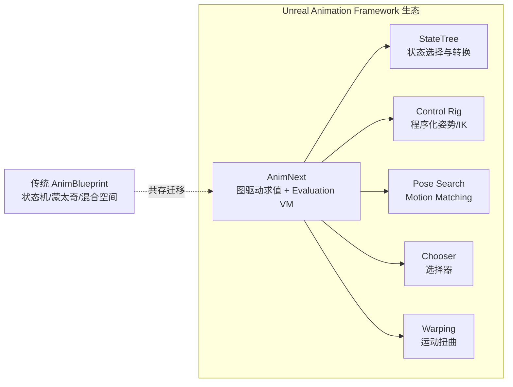
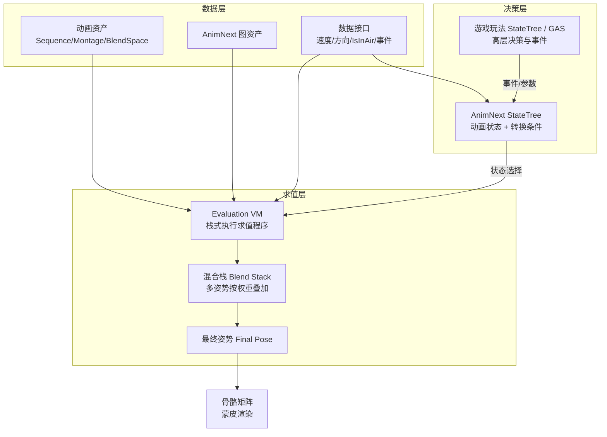
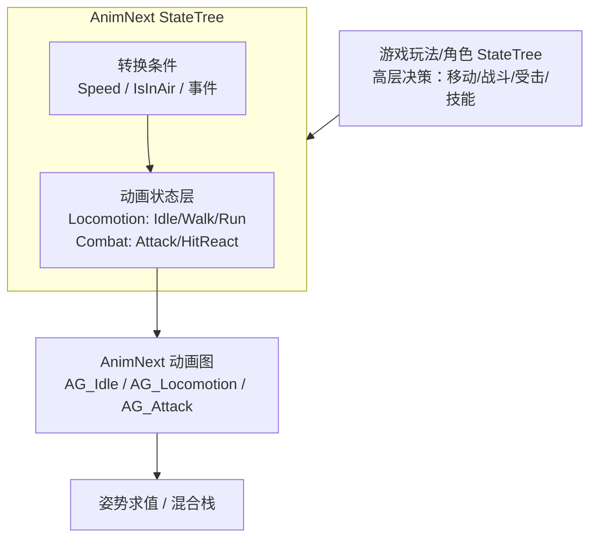
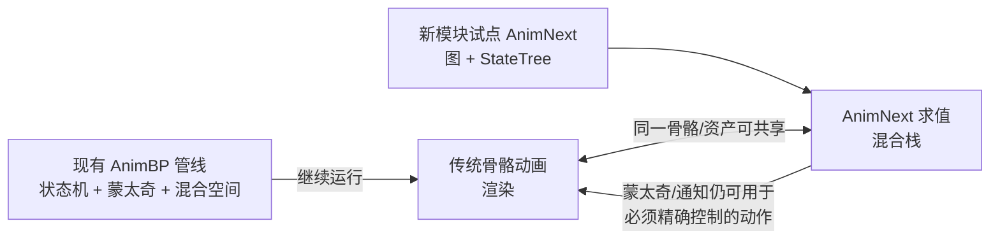

# 05 AnimNext 动画框架（新一代动画系统）

> 版本基准：UE 5.8.0（本机 `Engine/Build/Build.version`：CL 55116800，分支 `++UE5+Release-5.8`）。
> 源码依据/本机核对：本机 `C:\Program Files\Epic Games\UE_5.8\Engine` 中**没有独立 AnimNext.uplugin**，但 AnimNext 生态以 **UAF 插件**（`Plugins\Experimental\UAF\UAF\UAF.uplugin`，FriendlyName "Unreal Animation Framework (UAF)"）形式提供，其运行时头文件仍以 `AnimNext*` 命名（`AnimNextRigVMAsset.h`、`AnimNextComponent.h`、`AnimNextFunctionHandle.h` 等），并有 `MoverAnimNext` 等集成插件；本文类名/API 以官方文档与上述本机头文件为准并标注出处，**凡无法在本机源码核对的具体符号一律标注"待核对"**，不虚构类名/函数名/CVar。
> 兼容性边界：AnimNext 自 UE5.4 实验性引入、UE5.5 起作为实验性框架随引擎演进，5.6 起官方文档将其归入 Unreal Animation Framework（UAF）生态；属**持续演进特性**，文中接口与工作流可能在后续版本变更，工程落地前必须核对目标版本。
> 最后更新：2026-08-07（初稿）。
> 官方参考：[Unreal Animation Framework（UAF）与 AnimNext 文档](https://dev.epicgames.com/documentation/en-us/unreal-engine)、[AnimNext API（UE5.5/5.6）](https://dev.epicgames.com/documentation/unreal-engine/API/PluginIndex/AnimNext)、[StateTree 总览（UE5.8）](https://dev.epicgames.com/documentation/unreal-engine/overview-of-state-tree-in-unreal-engine)。

## 概述

**AnimNext** 是虚幻引擎官方推出的**新一代动画框架**（实验性）。它的目标不是修修补补 AnimBlueprint，而是重新设计"动画逻辑的组织与求值方式"：用**功能数据流（Functional Data Flow）**、**图驱动求值（Graph-Driven Evaluation）**、**Trait（特质）**、**数据接口（Data Interface）**与**求值虚拟机（Evaluation VM）**取代"传统 AnimBlueprint + 每帧事件图（EventGraph）"的既有模型。

官方对 AnimNext 的定位（UE5.5 文档口径）：

- 它是 UE5.5 的实验性**下一代动画框架**，不再单纯依赖传统 Animation Blueprint；
- 它把"动画决策（选哪段动画、怎么混合）"与"动画数据（姿势、曲线、参数）"解耦；
- 求值由 **Evaluation VM** 执行，VM 上运行的是**动画求值程序（Evaluation Program）**，而不是每帧解释执行蓝图层逻辑。

AnimNext 与 AnimBlueprint 的核心差异可以概括为三句话：

| 对比维度 | AnimBlueprint（传统） | AnimNext（新一代） |
| --- | --- | --- |
| 组织模型 | 蓝图资产：EventGraph（逻辑）+ AnimGraph（姿态） | 图资产 + Trait + 数据接口，逻辑与数据分离 |
| 求值方式 | 蓝图 VM 每帧执行事件图 | 栈式 Evaluation VM 执行求值程序 |
| 决策方式 | 状态机/蓝图逻辑内联在图里 | 可与 StateTree 结合，状态选择与姿态求值分层 |
| 复用粒度 | 节点树/子图复制，复用成本高 | Trait/图资产按行为组织，可复用性强（官方设计目标） |
| 状态 | 稳定、文档全、工具链成熟 | 实验性、持续演进、接口可能变更 |

值得强调的是，AnimNext 不是孤立的新插件：官方文档把 AnimNext 及其后续演进统一纳入 **Unreal Animation Framework（UAF）**——一个更大的动画生态，包含 UAF Anim Graph、Chooser、Pose Search、StateTree、Control Rig、Warping 等系统（[UAF 文档](https://dev.epicgames.com/documentation/unreal-engine/API/PluginIndex/AnimNext)）。理解 AnimNext 时需要把它放在 UAF 生态里看，而不是当作又一个"动画蓝图替代品"。



**本文立场**：本机 5.8 已核对 UAF 插件形态（见下节），但 AnimNext 的编辑器工作流、求值程序细节仍以官方文档为准并标注出处；凡依赖目标版本插件源码才能确认的细节（具体节点名、CVar、编辑器入口）一律标注"待核对"，并在工程落地前到目标版本的官方文档/插件源码中复核。

### 本机 UE5.8 核对：UAF 插件（AnimNext 的 5.8 载体）

本机 5.8 已核对（只读检索 `C:\Program Files\Epic Games\UE_5.8\Engine\Plugins\Experimental\UAF`）：

| 核对项 | 本机 5.8 结果 |
| --- | --- |
| 插件 | `Plugins\Experimental\UAF\UAF\UAF.uplugin`，FriendlyName "Unreal Animation Framework (UAF)"，Category Animation，`IsExperimentalVersion: true`、`EnabledByDefault: false` |
| 运行时模块 | `UAF`（Runtime，LoadingPhase PreDefault），另有 `UAFEditor`/`UAFUncookedOnly`/`UAFTestData` |
| 生态子插件 | `UAFAnimGraph`、`UAFAnimNode`、`UAFChooser`、`UAFControlRig`、`UAFLayering`、`UAFMass`、`UAFMirroring`、`UAFPoseSearch`、`UAFSharedAssets`、`UAFStateTree`、`UAFWarping`（`Plugins\Experimental\UAF\` 下） |
| 关键头文件（仍用 AnimNext 命名） | `UAF\Source\UAF\Public\AnimNextRigVMAsset.h`（`UUAFRigVMAsset : URigVMHost`）、`AnimNextFunctionHandle.h`、`AnimNextFunctionReference.h`、`AnimNextPoolHandle.h`、`Component\AnimNextComponent.h`（`UUAFComponent`）、`LODPose.h`、`ReferencePose.h`、`TransformArray.h`、`DataRegistry.h`、`UAFAssetInstance.h` 等 |
| 依赖 | RigVM、HierarchyTable、HierarchyTableAnimation、GameplayInsights、PropertyBindingUtils、Workspace、PythonScriptPlugin 等（`UAF.uplugin` 声明） |
| 集成示例 | `Plugins\Experimental\MoverAnimNext`（"Mover UAF"，为 Mover 增加 UAF 支持，依赖 Mover 与 UAF） |

结论：**本机 5.8 的"AnimNext 生态"以 UAF 插件提供**；启用路径是在工程中开启 UAF（实验性）及其所需子插件，而不是寻找名为 AnimNext 的插件。下文的框架认知与官方文档口径保持不变，具体节点/API 以目标版本 UAF 插件源码与官方文档为准。

## 核心概念

| 概念 | 英文 | 说明 | 关键点 |
| --- | --- | --- | --- |
| AnimNext 图 | AnimNext Graph | AnimNext 的动画逻辑资产：数据流图，输入状态/参数，输出最终姿势 | 与 AnimBlueprint 的 AnimGraph 地位类似，但求值模型不同 |
| 功能数据流 | Functional Data Flow | 官方对 AnimNext 组织方式的描述：数据沿图流动，节点无每帧事件脚本 | 强调"声明式求值"而非"命令式事件" |
| 特质 | Trait | 定义并扩展动画节点行为的可组合单元，支持 Base/Additive 等模式（官方 ETraitMode 文档） | 类比"可插拔的节点行为修饰器" |
| 数据接口 | Data Interface | 动画图访问外部数据（速度、朝向、角色状态）的统一通道 | 与 StateTree 上下文数据/属性绑定配合 |
| 求值虚拟机 | Evaluation VM（`FEvaluationVM`，官方 5.5 API） | 栈式虚拟机，执行动画求值程序（Evaluation Program） | 求值任务包括：序列播放、混合、加法应用、参考姿势、变换操作（官方 Evaluation VM Tasks） |
| 动画模块资产 | AnimNextModule（官方 Python API：模块根资产，由组件实例化） | 组织"一组动画行为"的资产形态 | 命名/工作流在不同版本有演进，待核对 |
| 动画组件 | AnimNextComponent（官方 Python API：用于运行 AnimNext 模块的组件） | 挂到 Actor 上驱动 AnimNext 求值的运行时组件 | 与 SkeletalMeshComponent 的关系待核对 |
| 混合栈 | Blend Stack | 多个动画图/姿势按权重叠加求值的栈 | AnimNextStateTree 的 graph-instance 任务会把图"推入混合栈" |
| AnimNext 状态树 | AnimNextStateTree（`UAnimNextStateTree`、`UStateTreeAnimNextSchema`，官方 5.6 API） | 让 StateTree 驱动 AnimNext 动画图的官方实验性插件 | 属于 UAF State Tree 区域，schema 与普通 StateTree 不同 |
| 动画状态 | Animation States | 由 StateTree 组织的动画状态层级（Idle/Walk/Run/Attack…） | 状态内挂 AnimNext 图实例任务 |
| UAF | Unreal Animation Framework | AnimNext 演进后的更大动画框架生态 | 含 UAF Anim Graph、Chooser、Pose Search、StateTree、Control Rig、Warping |

## 原理详解

### 一、整体求值流水线

AnimNext 把"角色动画"拆成三个职责清晰的层：

1. **数据层**：动画资产（Sequence/Montage/Blend Space 等既有资产仍可被引用）、AnimNext 图资产、数据接口（暴露速度/方向/是否空中/攻击状态等变量）、参数与输入输出；
2. **决策层**：StateTree（或传统逻辑）负责"当前该播放什么状态"——选择状态、响应事件、执行转换；
3. **求值层**：AnimNext Graph 把决策结果转成姿势，Evaluation VM 逐节点求值，结果进入混合栈，最终输出最终姿势（Final Pose）给 SkeletalMeshComponent。



**图释**：数据层是"原料"，决策层是"指挥"，求值层是"加工"。与传统 AnimBlueprint 最大的不同在于：传统方案里状态机的"转换判断"和"混合计算"都混在蓝图 VM 的每帧执行里；AnimNext 方案把决策交给 StateTree，把求值交给 Evaluation VM，两件事解耦、各自可复用。

### 二、求值模型：Evaluation VM 与 Trait

官方文档（UE5.5 AnimNext API）给出了两个关键机制：

- **Evaluation VM（`FEvaluationVM`）**：一个**基于栈的虚拟机**，执行动画求值程序。它把"播放哪段动画、怎么混合、怎么叠加"编译成可高效执行的程序，而不是像蓝图那样每帧解释执行事件图。
- **Evaluation VM Tasks**：VM 上的原子求值任务，官方文档列出的包括：**动画序列播放（Sequence Playback）、混合（Blending）、加法应用（Additive Application）、参考姿势（Reference Pose）、变换操作（Transform Operations）**。
- **Trait（特质）**：定义并扩展动画节点行为的最小单元，官方文档明确支持 **Base 模式与 Additive 模式**（`ETraitMode`）。Trait 让"混合方式""循环策略"这类行为可以被声明式组合，而不是写死在节点实现里。

```
求值程序（示意，非真实字节码）
  [0] Push Reference Pose          -- 参考姿势
  [1] Play Sequence(Idle_Rifle)    -- 序列播放
  [2] Play Sequence(Walk_Rifle)    -- 序列播放
  [3] Blend(0.4, 权重由速度参数决定) -- 混合
  [4] Apply Additive(HitReact)     -- 加法应用（受击叠加）
  [5] Transform 操作               -- 偏移/扭曲
  [6] Pop → 输出到混合栈
```

> 上述求值程序结构为**示意**，用于表达"VM 任务线性执行"的模型；真实程序由引擎编译生成，具体指令集待核对目标版本插件源码。

### 三、与 StateTree 的协同：AnimNextStateTree

UE5.5 起 AnimNext 逐步与 StateTree 打通；官方在 UE5.6 文档中提供 **AnimNextStateTree** 实验性插件（属于 UAF State Tree 区域），暴露了 `UAnimNextStateTree`、`UStateTreeAnimNextSchema`、AnimNext StateTree 任务与求值器（Evaluator）、基于 RigVM 的条件与任务，以及一个**图实例任务（Graph-Instance Task）**——把选中的 AnimNext 动画图推入混合栈。

官方推荐的典型架构：



**图释**：游戏玩法 StateTree（或 GAS）负责"角色现在要干什么"（大决策）；AnimNext StateTree 负责"动画层面该处于哪个状态"（小决策）；真正算出姿势的是 AnimNext 动画图；三者通过数据接口/上下文数据共享变量（Speed、Direction、IsInAir、IsAttacking、HitReactType 等），转换条件绑定这些值。

一个典型的动画状态转换规则（官方示例风格）：

```text
Idle → Walk     当 Speed > 5
Walk → Run      当 Speed > 200
Run → Walk      当 Speed <= 200
Any → HitReact  收到受击事件
HitReact → Idle 动画播放完成
```

官方明确提示的边界（UE5.6 文档）：

- `AnimNextStateTree` 属实验性，API 与编辑器工作流可能随版本变化；
- 普通 `StateTreeComponentSchema` 资产不能直接当作 AnimNext StateTree 使用，**schema 与资产类型必须匹配**；
- 尽量把动画求值逻辑放在 AnimNext 图里；StateTree 只负责状态选择、转换、事件与任务生命周期。

### 四、调度与性能特性

官方对 AnimNext 的性能定位（5.5 发布说明与框架文档）：

- **数据导向设计**：以数据流描述动画逻辑，减少"每帧跑蓝图事件图"的解释开销；
- **Evaluation VM**：求值程序编译执行，比蓝图 VM 更贴近运行时；
- **Motion Matching 原生支持**：UE5.5 发布说明明确 AnimNext 获得**初始 Motion Matching 支持**（与 Pose Search 配合），这是传统 AnimBP 难以做到的"搜索式动画"能力；
- **可组合复用**：Trait 与图资产按行为拆分（AG_Idle、AG_Locomotion…），避免"一张巨型状态机"的维护负担。

> 注意：**"性能一定更好"需要实测**。官方设计目标是减少解释开销、提升并行/复用能力，但实际收益取决于图复杂度、VM 编译质量与目标平台；且 AnimNext 处于实验期，未见官方性能基准承诺。任何性能结论都应通过 Anim Insights / Unreal Insights 在目标平台实测后写入本项目结论（本机未含插件，暂无实测数据）。

## 代码与示例

### 一、启用插件（示意）

AnimNext 是插件化功能。目标版本若包含插件，可在编辑器的 **Plugins 面板**搜索 AnimNext（及 AnimNextStateTree、StateTree）启用，或在 `.uproject` 中声明（**节选/示意，插件名以目标版本实际为准，待核对**）：

```json
{
  "FileVersion": 3,
  "Plugins": [
    { "Name": "AnimNext", "Enabled": true },
    { "Name": "AnimNextStateTree", "Enabled": true },
    { "Name": "StateTree", "Enabled": true }
  ]
}
```

> 本机 UE5.8 安装中以上插件均不存在（已核对），启用入口与插件名以目标工程/版本为准。

### 二、资产创建流程（编辑器操作，方案示意）

1. 为每个可复用动画行为创建 **AnimNext 动画图**资产：如 `AG_Idle`、`AG_Locomotion`、`AG_Attack`、`AG_HitReact`；
2. 创建 **AnimNext StateTree** 资产（使用 AnimNext StateTree schema，而非普通 StateTree schema）；
3. 在 StateTree 中组织动画状态：Locomotion（Idle/Walk/Run）、Combat（Attack/HitReact）等；
4. 为状态添加**图实例任务（Graph-Instance Task）**，把对应 AnimNext 图推入混合栈；
5. 通过 **数据接口**或 StateTree 上下文数据暴露变量（Speed、Direction、IsInAir、IsAttacking、HitReactType）；
6. 把转换条件绑定到这些变量，完成状态流转。

### 三、运行时组件（C++，待核对）

官方 5.5 Python API 文档提到：`AnimNextModule` 是"由实例化组件表示的根资产"，`AnimNextComponent` 是"用于运行 AnimNext 模块的组件"。据此，运行时形态大致为：**Actor 上挂 AnimNextComponent → 指定 AnimNextModule 资产 → 组件驱动求值并输出姿势**。以下为**示意代码，类名/接口以目标版本官方 API 为准（待核对）**：

```cpp
// 示意：把 AnimNext 模块挂到角色上（伪代码，非真实 API）
// UAnimNextComponent* AnimNextComp = NewObject<UAnimNextComponent>(Character);
// AnimNextComp->SetModule(MyAnimNextModuleAsset);  // 模块资产
// AnimNextComp->SetDataInterface(LocomotionData);  // 注入数据接口
// AnimNextComp->RegisterComponent();
```

### 四、与既有动画管线的共存（方案示意）



**图释**：AnimNext 并不要求推倒重来。动画**资产层**（Sequence、Montage、Blend Space）仍然存在并可被 AnimNext 引用；蒙太奇在 AnimNext 时代依然负责"必须精确控制"的动作（受击、处决、演出，仓库 02 篇已有此口径）；迁移期可以"AnimBP 管旧模块、AnimNext 管新模块"双轨并存。

## 最佳实践

### 一、何时选 AnimNext vs AnimBlueprint

| 场景 | 推荐 | 理由 |
| --- | --- | --- |
| 稳定在研项目、动画逻辑已跑通 | AnimBlueprint | 成熟稳定、团队熟悉、风险最低 |
| 新项目/新模块，愿意接受实验特性 | AnimNext（先试点） | 数据导向、可复用、为下一代表现铺路 |
| 需要 Motion Matching / 搜索式动画 | AnimNext + Pose Search | 官方 5.5 起 AnimNext 原生支持 Motion Matching |
| 大规模开放世界 NPC 动画复用 | AnimNext 图资产按行为拆分 | 避免巨型状态机，资产可组合 |
| 必须精确控制的一次性动作 | 仍用 Montage（Slot 机制） | 蒙太奇在 AnimNext 生态中继续存在 |
| 程序化姿势/IK | Control Rig | 与 AnimNext 互补而非替代 |

### 二、落地清单（建议）

1. **先确认版本**：目标 UE 版本是否包含 AnimNext 插件（本机 5.8 未包含）；不含则需确认发行渠道/插件来源或推迟引入；
2. **小步试点**：选 1 个角色、1 个行为（如移动循环）在实验分支搭建，验证图资产 + StateTree 工作流；
3. **双轨并存**：AnimBP 兜底，新模块用 AnimNext，避免大爆炸式迁移；
4. **数据接口先行**：把角色状态（速度/方向/空中/攻击）收敛为数据接口，AnimBP 与 AnimNext 都能消费；
5. **性能实测**：用 Anim Insights / Unreal Insights 对比 AnimBP 与 AnimNext 的求值耗时与内存，用数据决策；
6. **团队技能**：AnimNext 工作流更接近"图 + 数据接口 + StateTree"，TA/程序需要新技能栈，提前培训；
7. **版本锁定**：实验特性接口可能变更，锁定引擎版本并记录变更日志，避免无声升级。

### 三、架构分工建议

- 高层决策（移动/战斗/技能）：Gameplay StateTree 或 GAS；
- 动画状态选择与转换：AnimNext StateTree；
- 姿势求值与混合：AnimNext Graph + Evaluation VM；
- 程序化姿势修正（IK、手脚适配）：Control Rig；
- 搜索式动画：Pose Search / Motion Matching（AnimNext 支持）。

## 常见问题 FAQ

### Q1：AnimNext 能完全替代 AnimBlueprint 吗？

不能，至少现阶段不能。AnimNext 是**实验性**框架，官方口径是"新一代动画框架"，但仍处于持续演进中；AnimBlueprint 成熟稳定、文档与生态完整。合理策略是双轨并存、新模块试点，而不是全量替换。

### Q2：我在本机 UE5.8 里找不到 AnimNext 插件，为什么？

本机核对结论：`C:\Program Files\Epic Games\UE_5.8\Engine` 中没有独立 `AnimNext.uplugin`，但 AnimNext 生态以 **UAF 插件**提供（`Plugins\Experimental\UAF\UAF\UAF.uplugin`，FriendlyName "Unreal Animation Framework (UAF)"，实验性、默认关闭；详见"本机 UE5.8 核对"一节）。官方文档记载 UE5.5 时期插件名为 AnimNext；5.8 形态为 UAF + 子插件（UAFAnimGraph/UAFStateTree/UAFPoseSearch 等）。若在插件面板找不到 UAF，请确认引擎发行版包含 Experimental 插件并在工程中显式启用（**以目标版本安装为准**）。

### Q3：AnimNext 和 Control Rig 是什么关系？

两者层级不同、互补：Control Rig 负责**程序化生成/修正姿势**（IK、程序化尾巴、手脚适配）；AnimNext 负责**动画状态组织与求值编排**（选哪段动画、怎么混合）。两者同属 UAF 生态，官方在架构上把 Control Rig 与 Warping 等都列为 AnimNext 可协同的系统，可在同一角色上共存。

### Q4：用 AnimNext 必须用 StateTree 吗？

不必须。AnimNext 本身是图驱动求值框架，可以独立组织动画逻辑；AnimNextStateTree 是官方提供的"用 StateTree 驱动动画状态"的实验性插件。若团队已有成熟的 AnimBP 状态机逻辑且暂时不想引入 StateTree，可以先只用 AnimNext 图资产承载混合与求值（具体能力边界待核对）。

### Q5：蒙太奇、混合空间、动画状态机这些现有资产还能用吗？

能。动画资产层（Sequence、Montage、Blend Space）仍然存在，可被 AnimNext 引用（官方 Evaluation VM Tasks 中即包含序列播放与混合任务）；蒙太奇仍负责必须精确控制的动作（受击、处决、演出）。传统状态机与 AnimNext 动画状态是两种组织方式，迁移期可并存。

### Q6：AnimNext 性能一定比 AnimBlueprint 好吗？

官方设计目标是**数据导向 + Evaluation VM**，减少蓝图解释开销，且原生支持 Motion Matching；但"一定更好"不成立——实际收益取决于图复杂度、VM 编译质量与平台。任何性能结论都必须用 Anim Insights / Unreal Insights 在目标平台实测，本机未含插件，暂无实测数据。

### Q7：AnimNext 对网络同步/动画复制有什么影响？

动画复制机制（Animation Replication / AnimInstance 同步通道）面向的是"骨骼姿势与动画状态在服务器/客户端间同步"这一层，AnimNext 改变的是**本地求值方式**。理论上 AnimNext 输出仍是最终姿势，网络同步思路可沿用，但 AnimNext 专属状态（如 StateTree 动画状态、数据接口变量）如何参与复制**待核对**——引入前必须设计好"服务器权威动画状态 + 客户端预测"的同步方案（可参考仓库 06-网络同步 的动画复制内容）。

### Q8：对美术/TA 的工作流有什么影响？

影响较大：AnimNext 工作流更接近"图资产 + 数据接口 + StateTree"，TA 需要掌握"按行为拆分图资产、暴露数据接口、用 StateTree 组织状态"的新范式，而不是"在 AnimBP 里连状态机"。建议提前做小规模培训与试点，沉淀团队自己的最佳实践。

### Q9：我们团队现在该迁移吗？

分情况：现有项目动画已稳定 → **不急于迁移**，观察 AnimNext 走向；新项目/新模块 → 可以试点（需确认目标版本包含插件）；对 Motion Matching、大规模 NPC 动画复用有刚需 → 值得优先评估 AnimNext。总体原则：**用数据决策，不追新**。

### Q10：AnimNext 和 Motion Matching / Pose Search 是什么关系？

UE5.5 发布说明明确 AnimNext 获得**初始 Motion Matching 支持**；Pose Search（姿势搜索）是 UAF 生态的一员，提供姿势数据库与特征搜索能力。通俗地说：AnimNext 是"骨架/容器"，Pose Search 是"检索器"，两者配合实现搜索式动画；传统 AnimBP 上做 Motion Matching 是实验性方案，AnimNext 上属于官方规划路径。

## 关联阅读

- [01-动画蓝图与状态机](01-动画蓝图与状态机.md)：AnimNext 要替代的"传统方案"——AnimBlueprint 架构、状态机与混合节点，是理解差异对比的必备前置。
- [02-动画蒙太奇与混合空间](02-动画蒙太奇与混合空间.md)：蒙太奇/混合空间在 AnimNext 时代仍负责精确控制动作与参数化移动混合。
- [03-IK与程序化动画](03-IK与程序化动画.md)：Control Rig 与程序化动画，与 AnimNext 互补；03 篇已给出"UE5.5+ 以 AnimNext 承载 Motion Matching"的口径。
- [04-动画性能与预算分配](04-动画性能与预算分配.md)：动画成本构成与预算治理，AnimNext 的求值开销最终也要纳入这套预算体系。
- [05-StateTree状态树](../05-AI系统/05-StateTree状态树.md)：AnimNextStateTree 的底层框架——StateTree 的状态/转换/属性绑定模型。
- [11-动画系统求值源码剖析](../12-引擎源码分析/11-动画系统求值源码.md)：传统动画求值链路的源码级剖析，可与 AnimNext Evaluation VM 求值模型对照。
- [18-RigVM与ControlRig源码剖析](../12-引擎源码分析/18-RigVM与ControlRig源码.md)：RigVM 执行模型——AnimNextStateTree 的 RigVM 条件/任务与 Control Rig 都基于 RigVM 体系。

## 更新日志

- 2026-08-07：初稿创建。本机 UE5.8（CL 55116800）核对：无独立 AnimNext 插件，AnimNext 生态以 UAF 插件（`Plugins\Experimental\UAF`）提供，运行时头文件仍以 AnimNext 命名（`AnimNextRigVMAsset.h`/`AnimNextComponent.h` 等，`UUAFRigVMAsset`/`UUAFComponent`）；编辑器工作流与求值程序细节以官方文档为准并标注"待核对"。
