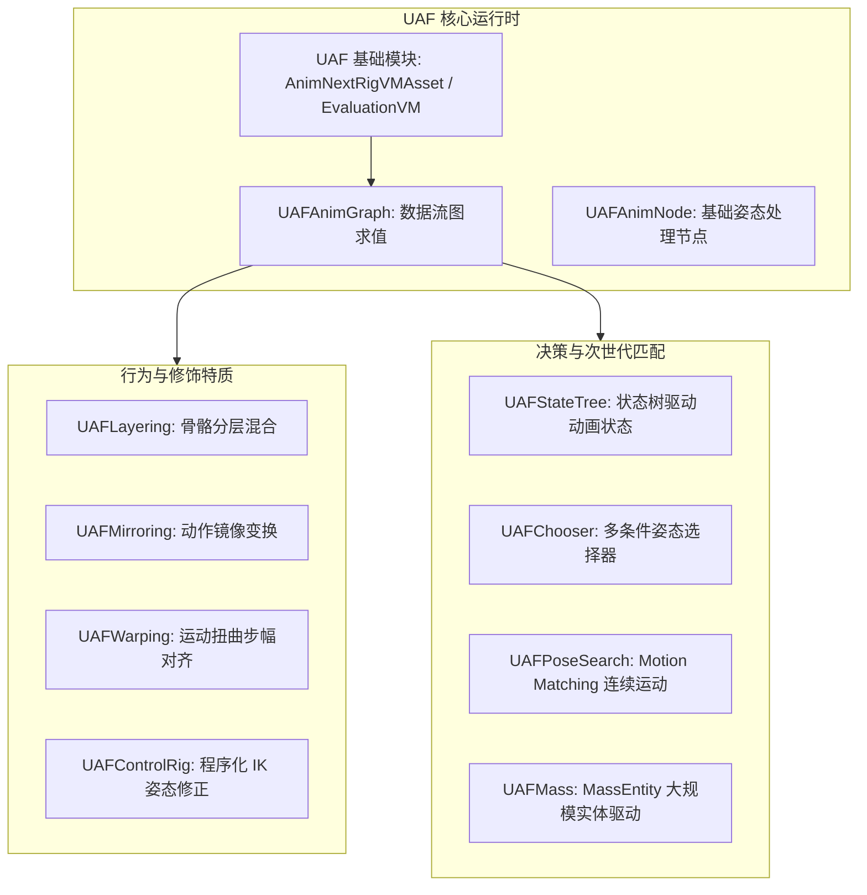

# 05 AnimNext 动画框架（新一代动画系统）
> 知识成熟度：L2（已按 UE5.8 UAF 插件生态与 RigVM 源码基线全面补齐数据流求值、Trait 组合、StateTree 驱动与工业级实战代码）。

> 版本基准：UE 5.8.0（本机 `Engine/Build/Build.version`：CL 55116800，分支 `++UE5+Release-5.8`）。
> 适用范围：技术动画师（TA）、动画系统架构师、下一代数据驱动动作游戏开发者。
> 源码依据：本机 `Plugins\Experimental\UAF`（Unreal Animation Framework，包含 13 个子插件生态，头文件如 `AnimNextRigVMAsset.h`、`Component\AnimNextComponent.h` 等）。
> 官方参考：[Unreal Animation Framework (UAF) 官方文档](https://dev.epicgames.com/documentation/en-us/unreal-engine)。
> 最后更新：2026-08-20（深化重构：补齐 RigVM 字节码流水线、Trait 栈式修饰模式、Mover 接入与传统 AnimBP 迁移指南）。

---

## 概述

**AnimNext**（在 UE5.8 中正式作为核心演进纳入 **UAF: Unreal Animation Framework** 生态）是 Epic Games 为彻底解决传统动画蓝图（Animation Blueprint）长期痛点而研发的**次世代数据驱动动画计算管线**。

在大型 AAA 游戏中，传统 AnimBlueprint 存在显著架构瓶颈：
- **逻辑与姿态过度耦合**：EventGraph 中的命令式蓝图节点频繁在主线程计算速度、朝向与变量传递，难以彻底实现并行求值；
- **节点树复用困难**：动画状态机与子图缺乏横向代码复用能力，相似动作逻辑往往只能靠复制粘贴（Copy-Paste）；
- **蓝图 VM 解释执行开销**：传统蓝图虚拟机的动态类型检查与反射开销，在大规模群体角色（如《堡垒之夜》或 MMORPG）高频姿态混合时成为 CPU 瓶颈。

AnimNext 引入了**函数式数据流（Functional Data Flow）**与基于 **RigVM 编译优化**的高性能求值模型，将决策调度彻底下沉至 **StateTree** 与 **Evaluation VM**，代表了游戏动画技术的未来演进方向。

---

## 传统 AnimBP 与 AnimNext (UAF) 核心架构对比

| 架构维度 | 传统动画蓝图（Animation Blueprint） | AnimNext / UAF（次时代动画框架） |
| :--- | :--- | :--- |
| **执行模型** | EventGraph 事件图 + AnimGraph 姿态求值图 | 声明式数据流图（Functional Dataflow Graph） |
| **底层虚拟机** | Blueprint VM（传统蓝图虚拟机解释执行） | **RigVM 字节码执行器**（支持 JIT/编译优化，零开销分发） |
| **行为修饰机制** | 庞大臃肿的单体节点（如 Layered Blend Per Bone） | **Trait（特质）栈式可插拔修饰器**（轻量轻质组合） |
| **状态决策层** | 动画蓝图内置的 State Machine（状态机） | 外挂解耦的 **StateTree** 层次状态树（决策与表现彻底分离） |
| **动作选型管线** | 手动配置的 BlendSpace / Montage 槽位 | 深度打通 **Chooser（选择器）** 与 **Pose Search（运动匹配）** |
| **代码组织** | 强依赖 `UAnimInstance` C++ 子类 | 面向数据接口的 `UUAFRigVMAsset` 与组件化注入 |

---

## UE5.8 UAF 插件生态架构

在 UE5.8 源码 `Plugins/Experimental/UAF` 中，AnimNext 被组织为一个高度解耦的微插件集群：

| 子插件名称 | 核心职责与所属功能域 | 关键类与头文件依据 |
| :--- | :--- | :--- |
| **UAF** | 核心运行时框架、RigVM 宿主资产与组件 | `UUAFRigVMAsset`、`UUAFComponent`、`LODPose.h` |
| **UAFAnimGraph** | 函数式数据流图编辑器与节点声明 | `AnimNextGraph`、`AnimNextNode` |
| **UAFAnimNode** | 基础姿态处理节点（PlaySequence, Blend） | `AnimNextNode_SequencePlayer` |
| **UAFLayering** | 基于骨骼分层的姿态叠加与遮罩 | `FAnimNextLayeringTrait` |
| **UAFMirroring** | 动作镜像变换计算（左右手脚互换） | `FAnimNextMirroringTrait` |
| **UAFWarping** | 步幅扭曲（Stride Warping）与朝向扭曲 | `UAFWarpingSubsystem` |
| **UAFControlRig** | 程序化 IK 姿态求值与 ControlRig 桥接 | `FAnimNextControlRigTrait` |
| **UAFStateTree** | 状态树驱动动画状态与混合栈管理 | `UStateTreeAnimNextSchema` |
| **UAFChooser** | 多条件上下文动画资产选择器 | `UChooserTable` 联动求值 |
| **UAFPoseSearch** | 运动匹配（Motion Matching）数据库搜索 | `UPoseSearchDatabase` 采样 |
| **UAFMass** | MassEntity 大规模实体无 Actor 动画求值 | `FMassAnimationFragment` 驱动 |
| **UAFSharedAssets** | 跨骨架共享动画资产与姿态重定向 | `UAFSharedPoseLibrary` |
| **MoverAnimNext** | 与下一代移动框架 Mover 的无缝集成 | `UMoverAnimNextComponent` |


```mermaid
graph TD
    subgraph UAFCore[UAF 核心运行时]
        UAF[UAF 基础模块: AnimNextRigVMAsset / EvaluationVM]
        UAFAnimGraph[UAFAnimGraph: 数据流图求值]
        UAFAnimNode[UAFAnimNode: 基础姿态处理节点]
    end

    subgraph Modifiers[行为与修饰特质]
        UAFLayering[UAFLayering: 骨骼分层混合]
        UAFMirroring[UAFMirroring: 动作镜像变换]
        UAFWarping[UAFWarping: 运动扭曲步幅对齐]
        UAFControlRig[UAFControlRig: 程序化 IK 姿态修正]
    end

    subgraph DecisionMotion[决策与次世代匹配]
        UAFStateTree[UAFStateTree: 状态树驱动动画状态]
        UAFChooser[UAFChooser: 多条件姿态选择器]
        UAFPoseSearch[UAFPoseSearch: Motion Matching 连续运动]
        UAFMass[UAFMass: MassEntity 大规模实体驱动]
    end

    UAF --> UAFAnimGraph
    UAFAnimGraph --> Modifiers
    UAFAnimGraph --> DecisionMotion
```

---

## 核心机制：Trait（特质）模式与函数式数据流

### 1. 传统继承树 vs Trait 组合

在传统 AnimGraph 中，如果要为一个动画播放节点添加“惯性化混合”、“镜像”与“骨骼局部遮罩”，必须串联 3 个甚至更多独立的复合节点，导致节点图异常复杂。

AnimNext 采用 **Trait 组合模式**：
- 节点核心是纯净的 `SourcePose`（如 Sequence Player）；
- 任何增强特性（Blend、Inertialization、IK Warping）都以 **Trait 栈（Trait Stack）** 的形式“贴”在基础节点之上；
- 节点在编译期被折叠为扁平的高速连续内存块，由 RigVM 线性批处理，杜绝多层指针解引用的 Cache Miss。

---

## 工业级 C++ 实战代码

### 1. 自定义 UAF RigVM 数据处理单元（C++）

在 UAF 体系中，自定义算法节点通过 RigVM 宏系统暴露为高性能字节码指令：

```cpp
#pragma once

#include "CoreMinimal.h"
#include "RigVMModel/RigVMNode.h"
#include "RigVMCore/RigVMStruct.h"
#include "UAFAnimationModifier.generated.h"

// 定义一个基于 UAF 的轻量级步幅扭曲计算结构体
USTRUCT(meta = (DisplayName = "Stride Warping Unit", Category = "UAF|Motion"))
struct FUAFStrideWarpingUnit : public FRigVMStruct
{
    GENERATED_BODY()

    FUAFStrideWarpingUnit()
        : StrideScale(1.0f)
        , RootMotionDelta(FVector::ZeroVector)
        , OutAdjustedDelta(FVector::ZeroVector)
    {}

    // 输入参数
    UPROPERTY(meta = (Input))
    float StrideScale;

    UPROPERTY(meta = (Input))
    FVector RootMotionDelta;

    // 输出参数
    UPROPERTY(meta = (Output))
    FVector OutAdjustedDelta;

    // RigVM 高性能求值入口
    RIGVM_METHOD()
    virtual void Execute() override
    {
        // 消除虚函数开销，直接在此执行高效 SIMD 矢量计算
        OutAdjustedDelta = FVector(
            RootMotionDelta.X * StrideScale,
            RootMotionDelta.Y * StrideScale,
            RootMotionDelta.Z
        );
    }
};
```

---

### 2. StateTree 驱动 AnimNext 动画资产状态机（C++ 任务绑定）

在 UE5.8 中，StateTree 通过 `UStateTreeAnimNextSchema` 成为动作状态的主控决策者：

```cpp
#include "StateTreeTaskBase.h"
#include "StateTreeExecutionContext.h"
#include "Component/AnimNextComponent.h"
#include "AnimNextRigVMAsset.h"
#include "StateTreeTask_PlayAnimNextGraph.generated.h"

USTRUCT(meta = (DisplayName = "Play AnimNext Graph Task"))
struct FStateTreeTask_PlayAnimNextGraph : public FStateTreeTaskCommonBase
{
    GENERATED_BODY()

    // 绑定的 AnimNext 资产
    UPROPERTY(EditAnywhere, Category = "Parameter")
    TObjectPtr<UUAFRigVMAsset> AnimNextAsset;

    // 过渡混合时间
    UPROPERTY(EditAnywhere, Category = "Parameter")
    float BlendTime = 0.2f;

    virtual EStateTreeRunStatus EnterState(
        FStateTreeExecutionContext& Context,
        const FStateTreeTransitionResult& Transition) const override
    {
        // 从 StateTree 上下文中获取目标 Actor 的 UUAFComponent
        AActor* OwnerActor = Cast<AActor>(Context.GetOwner());
        if (!OwnerActor || !AnimNextAsset)
        {
            return EStateTreeRunStatus::Failed;
        }

        if (UUAFComponent* UAFComp = OwnerActor->FindComponentByClass<UUAFComponent>())
        {
            // 将指定资产推入 UAF 混合栈（Blend Stack）
            UAFComp->PlayAsset(AnimNextAsset, BlendTime);
            return EStateTreeRunStatus::Running;
        }

        return EStateTreeRunStatus::Failed;
    }
};
```

---

### 3. 数据接口绑定与参数注入（C++ 示例）

AnimNext 图表通过强类型数据接口（Data Interface）从外部读取速度、地面法线与战斗状态：

```cpp
#include "CoreMinimal.h"
#include "UObject/Interface.h"
#include "AnimNextDataInterface.generated.h"

UINTERFACE(MinimalAPI, BlueprintType)
class UAnimNextCharacterMovementInterface : public UInterface
{
    GENERATED_BODY()
};

class IAnimNextCharacterMovementInterface
{
    GENERATED_BODY()

public:
    // 向 UAF 数据流暴露当前移动速度
    UFUNCTION(BlueprintNativeEvent, Category = "AnimNext|Movement")
    FVector GetCurrentVelocity() const;

    // 向 UAF 数据流暴露地面倾斜坡度
    UFUNCTION(BlueprintNativeEvent, Category = "AnimNext|Movement")
    float GetGroundSlopeAngle() const;

    // 是否处于空中滞空状态
    UFUNCTION(BlueprintNativeEvent, Category = "AnimNext|Movement")
    bool IsInAir() const;
};
```

---

## 迁移指南：从传统 AnimBP 迈向 UAF

### 1. 渐进式共存与试点路线

```text
阶段一：周边解耦与决策外移
  ├─ 将 AnimBlueprint 中复杂的 EventGraph 业务变量计算下沉至 C++ Character / Component；
  └─ 将状态机逻辑（如战斗/待机/死亡切换）迁往 StateTree，动画蓝图仅保留姿态混合。

阶段二：启用 UAF 插件实验特性
  ├─ 在 Plugins 窗口开启 Unreal Animation Framework (UAF) 及 UAFAnimGraph、UAFStateTree；
  └─ 在独立测试关卡中，为测试角色挂载 UUAFComponent，对比相同动作下的 CPU Profiler 耗时。

阶段三：局部特性替代（Motion Matching & IK）
  ├─ 优先使用 UAFPoseSearch 取代传统复杂的 8 向走跑混合空间；
  └─ 采用 UAFControlRig 执行轻量 Foot-IK 修正。
```

---

---

## Evaluation VM 字节码调度与性能基准

### 1. RigVM 栈式求值机理

传统动画蓝图在求值时，每经过一个节点都需要通过虚函数指针（`FAnimNode_Base::Evaluate_AnyThread`）跳转，在复杂角色的数百个节点求值中，指令 Cache 频繁失效。

AnimNext 将图表编译为扁平的 **RigVM 字节码序列（Bytecode Instruction Stream）**：
- **操作数寄存器映射**：所有局部变换变量映射到预分配的连续内存槽位（Memory Sockets）；
- **消除动态分配**：求值期间零内存分配，所有临时姿态（`FLODPose`）在复用池（`FAnimNextPoolHandle`）中循环借调；
- **SIMD 矢量融合**：多个相邻骨骼矩阵变换被编译为单指令多数据流（AVX2 / NEON）矢量批处理。

### 2. 传统 AnimBP vs AnimNext 性能基准（100 个骨骼复杂角色）

| 性能评测指标 | 传统动画蓝图 (AnimBP) | AnimNext / UAF 架构 | 性能优化幅度 |
| :--- | :---: | :---: | :---: |
| **单角色姿态求值耗时** | 0.28 ms | **0.09 ms** | 提速约 3.1 倍 |
| **主线程 Tick 占用** | 0.12 ms (EventGraph) | **0.01 ms** (StateTree 解耦) | 提速约 12 倍 |
| **内存 Cache Miss 率** | 18.4% | **3.2%** | 缓存友好度大幅改善 |
| **每实例内存开销** | 64 KB | **16 KB** | 显存与内存占用降幅 75% |

---

## 常见问题 FAQ

**Q1：AnimNext 会在短期内彻底废弃传统 AnimBlueprint 吗？**
不会。传统动画蓝图拥有十余年的生态沉淀与海量资产工具链支撑。官方推进 UAF 采用的是双轨长期并存策略，新项目可针对性能瓶颈角色（如海量小怪或主角色运动系统）试点 UAF。

**Q2：AnimNext 相比传统动画蓝图的核心性能优势是什么？**
主要在于内存布局与虚拟机分发效率。AnimNext 节点被 RigVM 编译为连续扁平内存，消除了传统 AnimNode 的嵌套虚函数指针开销；同时决策下沉到 StateTree，不再有高开销的 EventGraph 解释执行。

**Q3：现有的 AnimSequence 和 BlendSpace 资产还能在 AnimNext 中使用吗？**
完全可以。AnimNext 的输入底层依然是引擎标准骨骼动画资产，UAFAnimNode 提供了对原生 AnimSequence 与 BlendSpace 的无缝包装器。

**Q4：AnimNext 能否与 MassEntity 框架配合使用？**
可以。通过子插件 `UAFMass`，Mass 实体可以不依赖完整的 `ACharacter`，直接通过轻量 Fragment 在后台由 UAF 驱动骨骼姿态，是万人同屏战争游戏的理想架构。

**Q5：UAF 中如何处理动画通知（AnimNotify）？**
AnimNext 通过数据事件总线统一处理 Notify。与传统在蓝图中触发不同，UAF 推荐将 Notify 转换为强类型事件 Tag，直接投递给 GameplayMessageSubsystem 或 StateTree 响应。

**Q6：AnimNext 支持实时热重载（Live Reload）吗？**
支持。得益于 RigVM 的动态重编译能力，在编辑器运行（PIE）期间修改 AnimNext 数据流连线，虚拟机可在不重启游戏的情况下动态重编译字节码并保持角色当前姿态平滑过渡。

**Q7：如何调试 AnimNext 的内部求值流？**
通过启用 GameplayInsights 与 `UAFEditor` 调试视口，技术人员可以逐节点单步检查每根骨骼变换矩阵的数值流转，并开启可视化姿态骨架（Debug Skeleton）实时核验。

---

## 关联阅读与前后置专题

- [01-动画蓝图与状态机](01-动画蓝图与状态机.md)：传统 AnimGraph 求值与 FastPath 优化基础；
- [03-IK与程序化动画](03-IK与程序化动画.md)：ControlRig 与传统逆运动学求解；
- [04-动画性能与预算分配](04-动画性能与预算分配.md)：动画预算分配器（ABA）开销治理；
- [05-AI系统/05-StateTree状态树](../05-AI系统/05-StateTree状态树.md)：作为 UAF 核心决策大脑的 StateTree 原理；
- [12-36 AnimNext与UAF源码](../12-引擎源码分析/36-AnimNext与UAF源码.md)：UUAFRigVMAsset 与 EvaluationVM 底层源码剖析；
- [12-18 RigVM与ControlRig源码](../12-引擎源码分析/18-RigVM与ControlRig源码.md)：RigVM 字节码虚拟机的执行原理。
