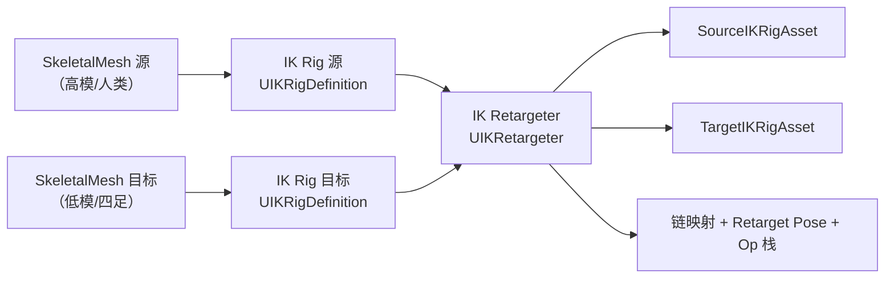
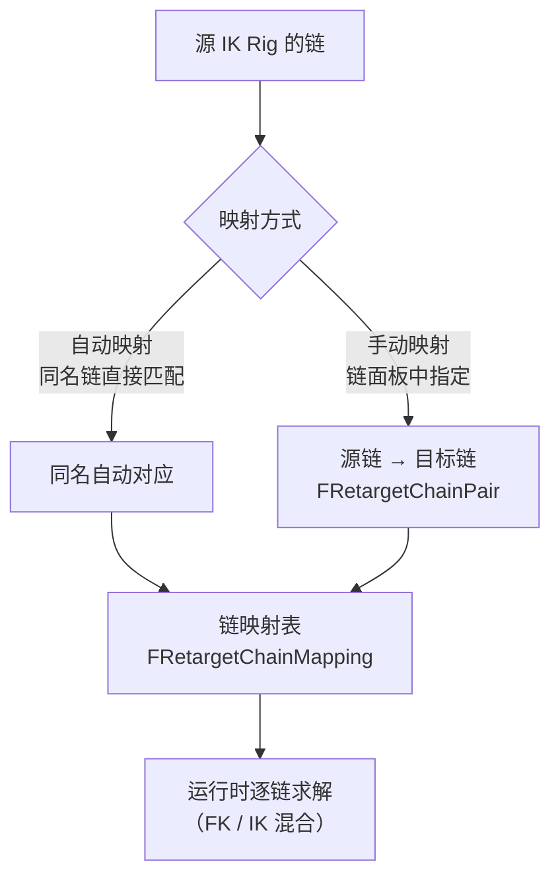
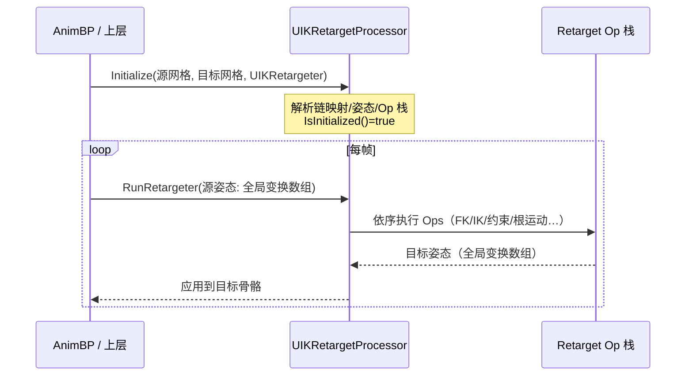
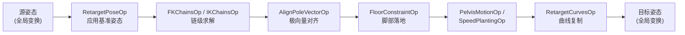

# 06-动画重定向与 IK Retargeter

> 版本基准：UE 5.8.0（本机 `Engine/Build/Build.version`：CL 55116800，分支 `++UE5+Release-5.8`）。
> 源码依据：`C:\Program Files\Epic Games\UE_5.8\Engine\Plugins\Animation\IKRig\Source\IKRig\Public\Retargeter\`（`IKRetargeter.h`、`IKRetargetProcessor.h`、`IKRetargetSettings.h`、`IKRetargetChainMapping.h`、`IKRetargetOps.h`、`RetargetOps\`）与 `Public\Rig\IKRigDefinition.h`。
> 适用范围：动画重定向（Retargeting）的使用层说明——跨骨骼复用动画、IK Rig / IK Retargeter 资产工作流、重定向链、运行时处理器与常见问题。
> 兼容性边界：重定向 Ops 操作栈为 UE5.6 起的新架构（旧版按链设置的 FK/IK 属性已迁移为 Op）；4.27 及更早版本的 IK 重定向是另一套工具（旧 IK Rig 插件），本文仅作历史对照。
> 最后更新：2026-08-07。
> 官方参考：[Unreal Engine UE5.8 官方文档总页](https://dev.epicgames.com/documentation/en-us/unreal-engine)。

## 概述

一套绑定（Rig）下制作的动画，只能直接驱动同一套骨骼。换一个体型、比例、骨骼命名不同的角色（人类 → 兽人、人形 → 四足、高模 → 低模），动画就必须"翻译"过去——这就是**动画重定向（Retargeting）**。

重定向要解决的问题：

- **骨骼命名不同**：源骨骼叫 `spine_01`，目标骨骼叫 `Spine1`，不能靠名字直接对应；
- **骨骼层级不同**：脊椎节数、手臂链长度、是否有尾骨，层级关系不一致；
- **比例与朝向不同**：源角色 180cm、目标角色 90cm，骨骼朝向（Z 轴朝上还是沿骨方向）不一致；
- **姿态基准不同**：源骨架的 T-Pose 与目标骨架的 T-Pose 存在差异，需要"重定向姿态（Retarget Pose）"做桥梁；
- **表现意图不同**：同样的走路动画，大块头角色的步幅、骨盆起伏、脚掌落地姿态需要重新映射。

UE5 的答案是 **IK Rig + IK Retargeter** 资产体系：先用 **IK Rig** 为源/目标骨架各自定义"骨骼链（Chain）与目标（Goal）"，再用 **IK Retargeter** 建立链映射并执行逐帧重定向。它取代了 UE4 时代基于 `RetargetSource` 与旧 `IK Rig` 插件的方案，是 UE5 官方推荐的重定向工具。

## 核心概念

| 概念 | 英文 | 说明 | 关键点 |
| --- | --- | --- | --- |
| 重定向 | Retargeting | 把一套骨骼上的动画姿态迁移到另一套骨骼 | 命名/层级/比例/朝向四重差异 |
| 源 / 目标 | Source / Target | 动画"从哪来 / 到哪去" | `ERetargetSourceOrTarget::Source/Target` |
| IK Rig 资产 | IK Rig Definition | 描述单套骨架的链与目标 | 源、目标各建一个 |
| 骨骼链 | Bone Chain | 一组连续骨骼（如手臂、腿、脊椎） | `FBoneChain`：ChainName/StartBone/EndBone/IKGoalName |
| 目标 | Effector Goal | 链末端的目标点（位置/旋转） | `UIKRigEffectorGoal`：GoalName/BoneName/Alpha |
| 链映射 | Chain Mapping | 源链 ↔ 目标链的对应关系 | `FRetargetChainPair`：SourceChainName/TargetChainName |
| 重定向姿态 | Retarget Pose | 源/目标各自的基准姿态（T-Pose 差异补偿） | `FIKRetargetPose`，源与目标各一组 |
| 重定向处理器 | Retarget Processor | 运行时执行重定向的引擎对象 | `UIKRetargetProcessor`：Initialize → RunRetargeter |
| 重定向操作 | Retarget Op | 可组合的重定向处理步骤（UE5.6+） | 22 个内置 Op，如 FKChains/IKChains/FloorConstraint |
| 极向量对齐 | Pole Vector Alignment | 保持肘/膝弯曲方向一致 | `AlignPoleVectorOp` |
| 根运动 | Root Motion | 根骨骼位移/旋转的重定向 | `PelvisMotionOp`、`RootMotionGeneratorOp` |
| 曲线重定向 | Curve Retargeting | 动画曲线的复制/重映射 | `RetargetCurvesOp`、`CurveRemapOp` |

## 原理详解

### 1. 为什么需要两层资产：IK Rig 与 IK Retargeter

重定向的关键洞察是：**不直接做"骨骼到骨骼"的映射，而是做"链到链"的映射**。骨骼名千差万别，但"手臂"、"腿"、"脊椎"这样的语义链在大多数角色上是一致的。UE5 因此拆成两层：

1. **IK Rig（`UIKRigDefinition`）**：为**每一套骨架**描述"它有哪些链、每条链的起点终点、是否有目标"。源骨架与目标骨架各有一个 IK Rig；
2. **IK Retargeter（`UIKRetargeter`）**：把源 IK Rig 的链"接到"目标 IK Rig 的链上，并保存重定向姿态、Op 栈等全部重定向配置。



本机 5.8 源码佐证：`UIKRetargeter`（`IKRetargeter.h` L70，`UCLASS(MinimalAPI, BlueprintType)`，继承 `UObject`）持有 `TObjectPtr<UIKRigDefinition> SourceIKRigAsset`（L357）与 `TargetIKRigAsset`（L367），并提供 `HasSourceIKRig()`/`HasTargetIKRig()`（L165/L169）；`UIKRigDefinition`（`IKRigDefinition.h` L206，继承 `UObject, IInterface_PreviewMeshProvider`）持有 `TArray<FBoneChain> BoneChains`（L178）与 `AddBoneChain(ChainName, StartBone, EndBone, GoalName)`（L181）。

### 2. 骨骼链（Bone Chain）与目标（Effector Goal）

**链**是 IK Rig 的基本单位。`FBoneChain`（`IKRigDefinition.h` L134）字段：

| 字段 | 类型 | 说明 |
| --- | --- | --- |
| `ChainName` | `FName` | 链名（如 `LeftArm`），重定向映射按此名对应 |
| `StartBone` / `EndBone` | `FBoneReference` | 链的起始与末端骨骼 |
| `IKGoalName` | `FName` | 关联的目标名（可为 `NAME_None`，纯 FK 链无目标） |

**目标（Goal）**是链末端的一个可编辑"手柄"。`UIKRigEffectorGoal`（`IKRigDefinition.h` L39）关键字段：

- `GoalName`（L48）：外部（蓝图/AnimGraph/Control Rig/重定向器）引用该目标的名称；
- `BoneName`（L52）：目标所在的骨骼；
- `PositionAlpha`（L55，0-1）与 `RotationAlpha`（L59，0-1）：在"骨骼原始位置/旋转"与"目标位置/旋转"之间混合，默认 1；
- `CurrentTransform`（L63）：目标当前变换（全局空间）；
- `PreviewMode`（L79，`EIKRigGoalPreviewMode`）：`Additive` 相对输入姿态（预览动画用）或 `Absolute` 钉在视口 Gizmo 上。

> 理解：**链 = 求解范围，Goal = 求解终点**。做"手抓握"时，链是整条手臂，Goal 是手掌要到达的世界位置；做"脚落地"时，链是整条腿，Goal 是脚踝目标点。重定向器复用的正是这套"链 + Goal"语义：它把源角色的链姿态变换到目标角色的同名链上。

### 3. 链映射：源链 → 目标链

重定向器里维护一张**链映射表**：`FRetargetChainMapping`（`IKRetargetChainMapping.h` L37）持有 `TArray<FRetargetChainPair> ChainMap`（L101），其中 `FRetargetChainPair`（L21）由 `SourceChainName` 与 `TargetChainName`（L30/L33）组成；通过 `SetChainMapping(TargetChainName, SourceChainName)`（L84）建立一条映射，`ReinitializeWithIKRigs(...)`（L45）在源/目标 IK Rig 变更时重建映射。



自动映射按链名匹配（源 `LeftArm` → 目标 `LeftArm`），匹配不上的链需要手动指定。常见做法：源、目标 IK Rig 里把语义相同的链命名为相同，自动映射一次通过。

### 4. 重定向姿态（Retarget Pose）：T-Pose 差异的桥梁

两套骨架的**基准姿态**几乎不可能一致（手臂张开角度、脊柱弯曲、骨骼朝向都不同）。如果不先对齐基准姿态，重定向结果会整体偏移或扭曲。

`UIKRetargeter` 为源与目标各维护一组重定向姿态：

- `TMap<FName, FIKRetargetPose> SourceRetargetPoses`（L478）与 `TargetRetargetPoses`（L481）；
- 当前姿态名：`CurrentSourceRetargetPose`（L485）/ `CurrentTargetRetargetPose`（L488）；
- 查询：`GetCurrentRetargetPose(const ERetargetSourceOrTarget&)`（L131）、`GetRetargetPoseByName(...)`（L135）。

`FIKRetargetPose`（L32）保存该骨架"被调整后的基准姿态"（骨骼偏移/旋转修正）。此外 `FRetargetPoseScaleWithPivot`（`IKRetargetProcessor.h` L37，含 `Factor` 与 `Pivot`）支持**带枢轴的姿态缩放**：当源/目标骨架比例差异巨大时，以某枢轴点（如骨盆）为基准缩放整个基准姿态。

编辑器工作流：在重定向器中分别进入 **Edit Source Retarget Pose / Edit Target Retarget Pose** 模式，把源与目标的基准姿态调到"等价姿势"（通常都调成与各自 T-Pose 对齐的标准站姿），保存为命名姿态（如 `Default`）。

### 5. 运行时处理流程：UIKRetargetProcessor

重定向不在编辑器里"烘焙"动画，而是**运行时逐帧求解**。引擎对象是 `UIKRetargetProcessor`（`IKRetargetProcessor.h`）。头文件注释给出标准用法（L392-395）：

```text
1. Initialize a processor with a Source/Target skeletal mesh and a UIKRetargeter asset.
2. Call RunRetargeter and pass in a source pose as an array of global-space transforms.
3. RunRetargeter() returns an array of global space transforms for the target skeleton.
```

对应 API：

- `Initialize(const FRetargetInitParameters& Params)`（L406）：传入源/目标网格与重定向资产完成初始化（也可见 L110 的 `Initialize` 重载）；初始化后 `IsInitialized()`（L416）为真；
- `RunRetargeter(const FRetargetRunParameters& Params)`（L413）→ `TArray<FTransform>&`：输入源姿态（全局空间变换数组），输出目标姿态（全局空间变换数组）；
- 处理器持有 `const USkeletalMesh* SourceSkeletalMesh`（L360）/ `TargetSkeletalMesh`（L362）与 `bIsInitialized`（L338）；网格或资产变化后调用 `SetNeedsInitialized()`（L419）触发重初始化。



注意输入输出都是**全局空间（Global Space）**变换数组：处理器内部会处理"全局 → 局部"的换算与骨骼层级差异，调用方只需按骨架骨骼顺序传入/消费数组。

### 6. Retarget Ops 操作栈（UE5.6+ 架构）

从 UE5.6 起，重定向的每一步处理被重构为可组合的 **Retarget Op**。`IKRetargetOps.h` 定义了 Op 体系：

- 基类设置：`FIKRetargetOpSettingsBase`（L70，继承 `FIKRetargetOpSkeletonProvider` L37）——所有 Op 设置的结构体基类，以 `FInstancedStruct` 形式序列化在重定向资产中；
- 运行时兼容：`CopySettingsAtRuntime(...)`（L91）保证设置可在不重新初始化的情况下应用；
- 自定义 Op：需提供 `GetControllerType()`（L132）返回 `UIKRetargetOpControllerBase` 派生控制器类（编辑器脚本化 API），并处理 `PostLoad` 版本修补（L128）。

本机 5.8 内置 22 个 Op（`RetargetOps\` 目录，每个 Op 一对"设置结构体 + 控制器"）：

| 类别 | Op 文件 | 作用 |
| --- | --- | --- |
| 基础姿态 | `CopyBasePoseOp`、`RetargetPoseOp` | 应用重定向姿态/基准姿态 |
| 链求解 | `FKChainsOp`、`IKChainsOp` | FK 直接复制与 IK 求解两条路径 |
| 地形/约束 | `FloorConstraintOp`、`PinBoneOp`、`FilterBoneOp` | 脚部落地约束、骨骼固定/过滤 |
| 姿态调整 | `AlignPoleVectorOp`、`StretchChainOp`、`ScaleGoalsOp`、`ScaleSourceOp` | 极向量、链拉伸、目标/源缩放 |
| 根与位移 | `PelvisMotionOp`、`RootMotionGeneratorOp`、`SpeedPlantingOp`、`StrideWarpingOp` | 骨盆运动、根运动生成、速度植根、步幅 |
| 混合/过渡 | `BlendToSourceOp` | 重定向结果与源姿态混合 |
| 曲线 | `RetargetCurvesOp`、`CurveRemapOp` | 曲线复制与重映射 |
| 其他 | `AdditivePoseOp`、`OffsetGoalsOp`、`RunIKRigOp`、`WeaponGoalsOp` | 加法姿态、目标偏移、运行 IK Rig、武器目标 |

每个 Op 的控制器类形如 `UIKRetargetFKChainsController : public UIKRetargetOpControllerBase`、`UIKRetargetFloorConstraintController` 等（`UCLASS(BlueprintType)`/`MinimalAPI`）；Op 本体类继承 `URetargetOpBase`（如 `UCurveRemapOp`，`CurveRemapOp.h` L153）。



> 编辑器里的 **Chain Mapping 面板**（每对链的 Settings）在 5.6+ 已映射为"为该链插入/配置哪些 Op"：例如某条链选 FK 模式就是启用 `FKChainsOp` 并配置混合参数，选 IK 模式则启用 `IKChainsOp`。

### 7. 姿态差异处理：比例、朝向与链长

重定向的质量取决于三个差异的处理：

1. **骨骼朝向差异**：源骨骼局部轴与目标不一致时，靠**重定向姿态 + Op 内的轴向修正**对齐。不要试图在动画资产层逐骨骼修正——那是历史方案（`RetargetSource`），维护成本极高；
2. **比例差异**：`FRetargetPoseScaleWithPivot`（因子 + 枢轴）做全局缩放；`ScaleGoalsOp`/`ScaleSourceOp` 处理链级缩放。目标比源矮小时，步幅会被压缩，配合 `StrideWarpingOp` 做步幅调整；
3. **链长差异**：源手臂比目标长时，FK 复制会让手"飘出去"或"陷进去"——`StretchChainOp` 允许链内拉伸补偿，或改用 IK 模式（IKChainsOp）让末端吸附到目标链的 Goal。

### 8. 重定向链与批量重定向

- **重定向链（Retarget Chain）**：A 骨骼 → B 骨骼 → C 骨骼逐级传递。每级都用独立的 IK Retargeter 资产。注意误差累积：每经过一级，比例/姿态差异都会被再次放大，链过长时质量明显下降，应尽量"直连"或选择与目标最接近的中间骨骼；
- **批量重定向（Batch Retarget）**：一个源骨骼 + 一个源 IK Rig 可以驱动任意多个目标角色（每个目标角色一个目标 IK Rig + 共享或各自的 Retargeter）。美术只需维护一套动画，即可批量铺到多个角色；
- **动画资产与重定向解耦**：动画资产本身不因重定向而修改（重定向是"播放时求解"），同一动画可同时被不同 Retargeter 以不同方式消费。

### 9. 与 Control Rig 的关系

| 维度 | IK Retargeter | Control Rig |
| --- | --- | --- |
| 层级 | 骨架级（整身） | 骨骼级（任意骨骼，常做局部） |
| 时机 | 动画采样后的姿态翻译 | 后处理修正/程序化生成 |
| 求解 | 链 + Op 栈 | Rig Graph 节点图（VM 求值） |
| 典型用途 | 跨骨骼复用动画 | 局部 IK、程序化动画、绑定控制 |

两者可以串联：先由 Retargeter 把源动画翻译到目标骨架，再在目标骨架上挂 Control Rig 做局部修正（如目标角色的特殊武器持握）。注意 Control Rig 的 Rig Graph 是 VM 求值，两者叠加时注意每帧开销预算。

## 代码 / 示例

### 示例 1：运行时用 C++ 驱动重定向（示意）

```cpp
// 节选：运行时重定向处理器调用示意（UE5.8）
// 完整流程：先 Initialize（源/目标网格 + 重定向资产），再逐帧 RunRetargeter。

// 1. 创建并初始化处理器
UIKRetargetProcessor* Processor = NewObject<UIKRetargetProcessor>(this);

FRetargetInitParameters InitParams;
InitParams.SourceSkeletalMesh = SourceMesh;   // 源网格（动画来源）
InitParams.TargetSkeletalMesh = TargetMesh;   // 目标网格（动画去向）
InitParams.IKRetargetAsset    = RetargeterAsset; // UIKRetargeter 资产
Processor->Initialize(InitParams);
check(Processor->IsInitialized());

// 2. 每帧传入源姿态（全局空间变换数组，按源骨架骨骼顺序）
//    源姿态通常来自源网格的动画求值结果（Component Space 变换）
TArray<FTransform> SourceGlobalPose = GatherSourcePose(); // 示意：自取

FRetargetRunParameters RunParams;
RunParams.SourcePose = SourceGlobalPose;      // 输入：全局空间
RunParams.DeltaTime  = DeltaSeconds;

TArray<FTransform>& TargetGlobalPose = Processor->RunRetargeter(RunParams);

// 3. 把目标姿态应用到目标骨骼（写回骨骼空间/动画蓝图）
ApplyPoseToSkeleton(TargetGlobalPose);        // 示意：由上层实现
```

> 标注：`FRetargetInitParameters`/`FRetargetRunParameters` 的精确字段名以引擎头文件为准（本文按处理器头文件注释的"网格+资产初始化、全局空间数组输入输出"语义给出示意）；实际项目更常见的接入点是 `UIKRetargetProcessor` 的蓝图/动画蓝图封装或引擎内部 `IKRetargetAnimInstance` 集成。

### 示例 2：编辑器标准工作流（操作清单）

```text
1. 为源骨架创建 IK Rig（Asset -> Animation -> IK Rig），自动生成骨骼链，检查链的 Start/End 与 Goal；
2. 为目标骨架创建 IK Rig，同样定义链与 Goal（链名尽量与源一致）；
3. 创建 IK Retargeter，指定 Source IK Rig 与 Target IK Rig；
4. 执行 Auto Map（同名链自动映射），手动补映射剩余链；
5. 进入 Edit Source Retarget Pose / Edit Target Retarget Pose，把基准姿态对齐并保存；
6. 逐链检查 Settings（FK/IK 模式、混合、速度、平移模式），必要时添加 Op（落地约束/极向量/步幅）；
7. 视口播放源动画预览，微调姿态与 Op 参数；
8. 保存 Retargeter；运行时通过 IKRetargeter 蓝图节点或处理器消费。
```

## 最佳实践

1. **源/目标 IK Rig 的链名保持一致**：自动映射一次通过，减少手动映射出错；
2. **重定向姿态先于一切**：基准姿态没对齐，后续 Op 调得再好也白费；每次换源/目标网格后重新检查；
3. **手臂、腿用 IK 模式，躯干/头用 FK 模式**：末端需要贴合环境的链用 IK，内部姿态直接复制的链用 FK，混合使用比全 IK 更稳定；
4. **脚部漂移优先查落地约束**：`FloorConstraintOp` 的射线距离与混合速度、`SpeedPlantingOp` 的植根窗口是两大旋钮，先调这两个再看骨架差异；
5. **手指重定向单独处理**：手指链短、差异敏感，常被过滤（`FilterBoneOp`）后用手部姿态近似或单独的手指 Retargeter；
6. **比例差异大时先全局缩放再逐链调**：`FRetargetPoseScaleWithPivot` 全局对齐后，`StretchChainOp`/`StrideWarpingOp` 只做微调；
7. **重定向链不超过两级**：A→B→C 会累积误差，能直连就直连；必要时在中间骨骼上做"归一化"重定向姿态；
8. **批量重定向前先做"黄金资产"**：用一个代表性动画（走路+攻击）验证全部目标角色，通过后再批量铺动画；
9. **曲线与通知随动画一起验证**：曲线靠 `RetargetCurvesOp` 按名复制，源曲线名与目标不一致时用 `CurveRemapOp`；重定向后检查曲线是否仍被玩法消费；
10. **运行时切换目标网格必须重新 Initialize**：`SetNeedsInitialized()` 或重建处理器，否则拿到的是旧骨架缓存；
11. **性能预算**：重定向是逐帧 CPU 求解，Op 栈越深开销越大；移动端建议精简 Op、降低求解频率或缓存结果；
12. **与 Control Rig 串联时注意叠加顺序**：Retargeter 输出 → Control Rig 后处理，局部修正不要与重定向抢同一批骨骼。

## 常见问题 FAQ

### Q1：重定向后手指扭曲/打架？

手指链短、骨骼命名差异大，且目标手指比例常与源不同。处理：① 用 `FilterBoneOp` 把手指从 FK 复制中排除，改用目标自身姿态（或手势覆盖）；② 单独为手指建立高精度链并配置 `StretchChainOp`；③ 检查手指骨骼是否在 IK Rig 的链中被错误包含（一条链跨了手指会整体错乱）。

### Q2：脚部漂移/滑步？

① 确认 `FloorConstraintOp` 已启用且射线距离覆盖目标角色的脚踝高度；② 检查 `SpeedPlantingOp` 的植根窗口是否匹配动画步频；③ 目标步幅与源差异大时用 `StrideWarpingOp`；④ 若只有某条腿漂移，检查该腿链映射是否错配（映射到了另一条腿）。

### Q3：手臂末端够不到/穿模？

源链比目标链长时 FK 复制会"超出"。方案：① 该链切到 IK 模式（`IKChainsOp`），让末端吸附目标 Goal；② 启用 `StretchChainOp` 限幅拉伸；③ 在目标 IK Rig 里调整该链的 Goal 位置，让求解终点更合理。

### Q4：重定向后角色整体偏移/倾斜？

典型原因是**基准姿态未对齐**：重新进入 Edit Source/Target Retarget Pose 对齐；其次是根骨骼/骨盆没有进入任何链且未做根运动处理——检查 `PelvisMotionOp` 与根骨骼映射。

### Q5：源、目标骨骼命名完全不同怎么办？

链映射是"链到链"而非"骨到骨"：只要两侧 IK Rig 的链定义正确，链名不同也能手动映射。骨骼级差异（如源 `spine_01` 对目标 `Spine1`）在链内部由 FK 复制按层级顺序对应，无需逐骨改名。

### Q6：曲线（如打击感曲线、表情曲线）重定向后丢失？

曲线重定向按**曲线名**匹配：① 确认 `RetargetCurvesOp` 启用；② 曲线名不一致用 `CurveRemapOp` 建立源→目标曲线名映射；③ 检查源曲线是否真的存在于动画资产（见 07 篇资产层的曲线存储）。

### Q7：四足/异形角色重定向效果差？

骨骼层级差异过大时，链定义本身可能就不对应（如四足的脊椎其实是水平方向）。建议：① 为四足单独建 IK Rig 与链；② 接受"半身重定向"——只用重定向器处理上半身，下半身走目标角色自身动画；③ 必要时 `FilterBoneOp` 排除差异骨骼。

### Q8：运行时性能开销大？

① 精简 Op 栈（删除不需要的 Op）；② 降低求解频率（隔帧求解并插值）；③ 低 LOD 或远景角色切换到低配 Retargeter 资产；④ 移动端优先 FK 模式（IK 求解更贵）。

### Q9：重定向结果与源动画"神似但不对"（节奏/力道丢失）？

重定向只翻译姿态，不修正动画节奏。检查：① `SpeedPlantingOp`/`StrideWarpingOp` 是否过度调整了步幅；② 根运动是否被 `RootMotionGeneratorOp` 生成而非原样传递；③ 目标角色动画蓝图中的移动参数（速度/方向）是否与动画匹配。

### Q10：UE5.5 之前的 IK Retargeter 项目升级到 5.6+？

5.6 起链设置重构为 Op 栈（`FIKRetargetOpSettingsBase` 体系），旧资产的链设置会按 `IKRigObjectVersion` 自动迁移（`FIKRetargetOpSettingsBase::PostLoad` 修补模式，见 `IKRetargetOps.h` L94-128）；迁移后检查每条链的 FK/IK 模式与混合参数是否与升级前一致，必要时手动重建个别 Op。

## 关联阅读

- [01-动画蓝图与状态机](01-动画蓝图与状态机.md)：重定向结果最终在 AnimBP/动画图中消费，先理解动画图求值流程。
- [03-IK与程序化动画](03-IK与程序化动画.md)：IK 求解原理（TwoBoneIK/FABRIK/极向量）是 IK Retargeter 链求解的底层基础。
- [05-AnimNext动画框架](05-AnimNext动画框架.md)：新一代动画框架下的重定向接入方式（UAF 生态，实验性）。
- [07-动画资产与骨骼基础](07-动画资产与骨骼基础.md)：重定向的输入输出是骨骼/动画资产，先掌握资产层结构。
- [12-引擎源码分析/18-RigVM与ControlRig源码](../12-引擎源码分析/18-RigVM与ControlRig源码.md)：Control Rig 与重定向器的协作与求值模型。

## 更新日志

- 2026-08-07：新建。基于本机 UE5.8（CL 55116800）核对 `UIKRetargeter`/`UIKRigDefinition`/`FBoneChain`/`UIKRigEffectorGoal`/`FRetargetChainMapping`/`UIKRetargetProcessor`/`FIKRetargetOpSettingsBase` 及 22 个内置 Retarget Ops 等真实符号；`FRetargetInitParameters`/`FRetargetRunParameters` 精确字段与 Op 参数细节标注"待核对/示意"。
