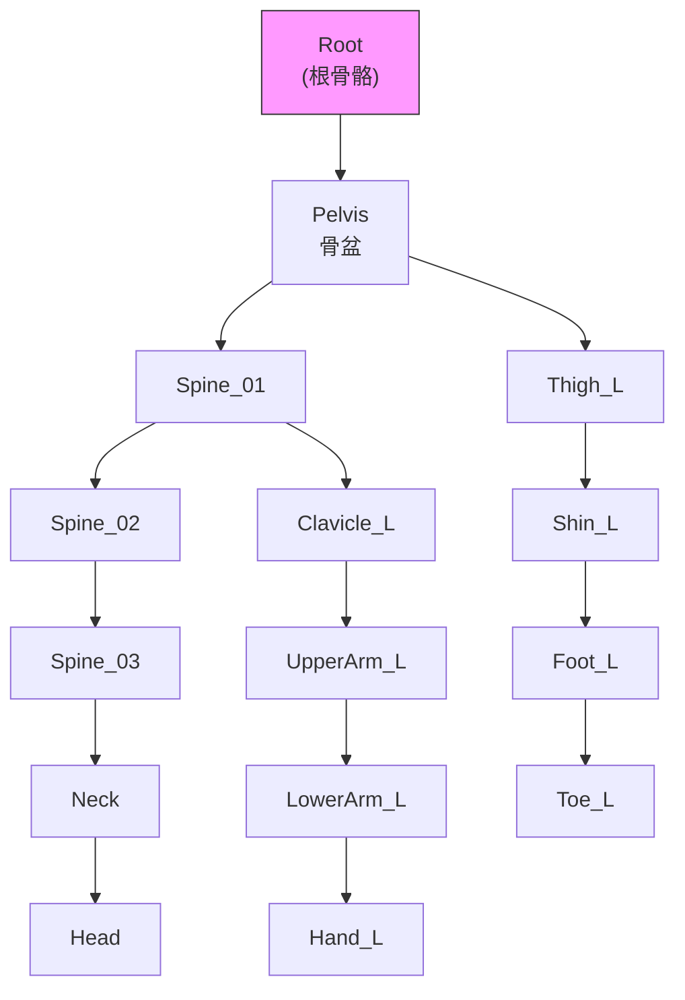
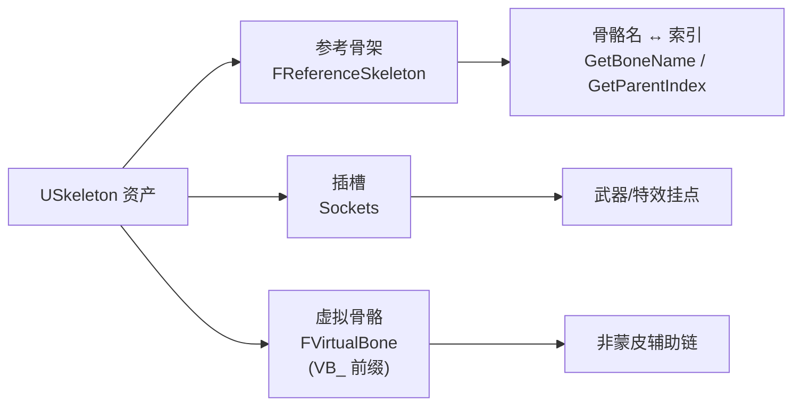
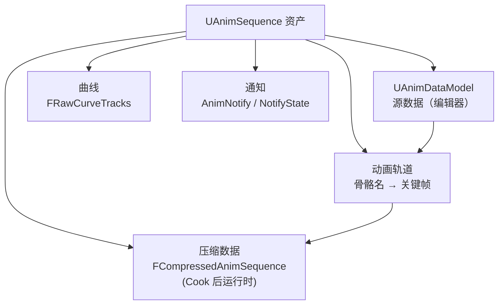

# 07-动画资产与骨骼基础

> 版本基准：UE 5.8.0（本机 `Engine/Build/Build.version`：CL 55116800，分支 `++UE5+Release-5.8`）。
> 源码依据：`C:\Program Files\Epic Games\UE_5.8\Engine\Source\Runtime\Engine\Classes\Animation\`（`Skeleton.h`、`AnimSequence.h`、`AnimSequenceBase.h`）与 `Engine\Source\Runtime\Engine\Public\ReferenceSkeleton.h`。
> 适用范围：动画资产层的地基知识——骨骼层级、蒙皮原理、Skeleton 资产、Animation Sequence 结构、曲线与通知、FBX 导入、加法动画、重定向对资产的影响、LOD 与资源预算。
> 兼容性边界：`NumFrames`/`RawCurveData`/`CompressedData` 等公开访问已在 5.0-5.6 陆续弃用，本文以 5.8 的替代 API（`UAnimDataModel`、`GetCurveData`、`GetSamplingFrameRate` 等）为准。
> 最后更新：2026-08-07。
> 官方参考：[Unreal Engine UE5.8 官方文档总页](https://dev.epicgames.com/documentation/en-us/unreal-engine)。

## 概述

动画系统的所有上层能力——状态机、蒙太奇、混合空间、IK、重定向、AnimNext——最终都建立在两块地基上：**骨骼（Skeleton）**与**动画资产（Animation Asset）**。

- **骨骼**决定"角色有几根骨头、怎么连接、顶点如何跟随"：骨骼层级（Bone Hierarchy）、参考骨架（Reference Skeleton）、插槽（Socket）、虚拟骨骼（Virtual Bone）；
- **动画资产**决定"每根骨头在什么时刻是什么姿态"：Animation Sequence 的轨道（Track）、曲线（Curve）、通知（Notify）、帧率与压缩；
- **连接两者的桥梁**是骨骼名与骨骼索引：动画轨道按骨骼名绑定到骨架，蒙皮顶点按权重绑定到骨骼。

理解资产层的好处：

1. 排查"动画错位/骨骼对不上"时，能定位问题在命名、层级还是蒙皮；
2. 做批量导入、重定向、LOD 与内存优化时，知道每一层数据存在哪里、改哪里；
3. 写 C++ 工具（批量处理动画、查询骨骼信息）时，知道该用哪些 API。

## 核心概念

| 概念 | 英文 | 说明 | 关键点 |
| --- | --- | --- | --- |
| 骨骼层级 | Bone Hierarchy | 骨骼组成的树（骨架树） | 每根骨骼有唯一父骨骼 |
| 参考骨架 | Reference Skeleton | 网格绑定时的初始骨骼结构与姿态 | `FReferenceSkeleton` |
| 骨骼信息 | Bone Info | 单根骨骼的名字与父索引 | `FMeshBoneInfo` |
| 蒙皮 | Skinning | 顶点按权重跟随骨骼运动 | 权重 = 顶点到骨骼的绑定强度 |
| 骨骼插槽 | Socket | 挂在骨骼上的命名锚点 | 武器挂点、特效挂点 |
| 虚拟骨骼 | Virtual Bone | 不参与蒙皮的"虚拟"骨骼 | `FVirtualBone`，`VB_` 前缀 |
| 动画序列 | Animation Sequence | 一段骨骼关键帧动画 | `UAnimSequence` |
| 动画数据模型 | Anim Data Model | 5.0+ 源数据统一模型 | `UAnimDataModel`（帧数/帧率/轨道） |
| 动画轨道 | Track | 单根骨骼的整段关键帧数据 | 按骨骼名对应骨架 |
| 动画曲线 | Curve | 与骨骼无关的浮点/向量数据通道 | `FRawCurveTracks`/`GetCurveData()` |
| 通知 | AnimNotify | 动画时间轴上的事件标记 | 播放到该时刻触发 |
| 加法动画 | Additive Animation | 相对基准姿态的"增量"动画 | `EAdditiveAnimationType` |
| 重定向源 | Retarget Source | 动画的"基准骨骼"声明 | `RetargetSource`/`RetargetSourceAsset` |
| 动画压缩 | Compression | 运行时数据压缩 | 骨骼/曲线压缩设置 |

## 原理详解

### 1. 骨骼层级：骨架树（Bone Hierarchy）

骨架是一棵**树**：一根根骨骼（Bone）通过父子关系连接。每根骨骼只记录**相对父骨骼的局部变换**（位置/旋转/缩放），世界姿态由根到叶逐级相乘得到。

UE 中的核心数据结构是 `FReferenceSkeleton`（`ReferenceSkeleton.h` L99）：

- `TArray<FMeshBoneInfo> RawRefBoneInfo`（L108）与 `TArray<FTransform> RawRefBonePose`（L110）：**原始**骨骼信息与姿态（导入时/编辑中）；
- `TArray<FMeshBoneInfo> FinalRefBoneInfo`（L114）与 `TArray<FTransform> FinalRefBonePose`（L116)：**最终**版本（编辑器提交后）；
- 查询：`GetNum()`（L245）、`GetBoneName(int32 BoneIndex)`（L346）、`GetParentIndex(int32 BoneIndex)`（L351）、`GetRefBoneInfo()`（L261）、`GetRawRefBonePose()`（L279）；
- 变换：`GetBoneAbsoluteTransforms()`（L463）与 `GetRawBoneAbsoluteTransforms()`（L459）可直接得到全局空间姿态；
- 修改：`FReferenceSkeletonModifier::Add(FMeshBoneInfo&, FTransform&, bAllowMultipleRoots)`（L78）与 `UpdateRefPoseTransform`（L75）用于程序化构建骨架；
- `RebuildRefSkeleton(const USkeleton*, bool bRebuildNameMap)`（L242）：骨架变化后重建（含索引缓存）。



骨骼名是**资产间绑定的键**：动画轨道的骨骼名必须与骨架一致，网格蒙皮顶点引用的骨骼名必须与骨架一致。改名 = 断链，所以骨骼命名规范是动画管线第一纪律。

### 2. 蒙皮原理：顶点如何跟随骨骼

蒙皮（Skinning）解决"网格顶点如何随骨骼运动"：

1. 美术在 DCC（Maya/Blender）中把网格顶点"绑定"到骨骼，每个顶点记录 **1~4 根骨骼的权重**（权重和为 1）；
2. 运行时每帧：骨骼算出各自的**骨骼矩阵**（局部 → 全局），顶点位置 = 各骨骼矩阵对顶点绑定姿态的加权变换；
3. 公式（示意）：

```text
顶点最终位置 P' = Σ (W[i] * BoneMatrix[i] * BindPoseInverse[i] * P)
其中 W[i] 为第 i 根骨骼的权重（ΣW = 1）
BindPoseInverse 把顶点从绑定姿态空间变换回骨骼局部空间
```

- 权重越接近 1，顶点越"跟死"该骨骼；权重分散在关节处，顶点会平滑弯曲（如肘部、肩部）；
- UE 支持 **CPU 蒙皮**与 **GPU 蒙皮**（Skin Cache/Compute Shader），顶点权重数据存放在蒙皮权重缓冲（`FSkinWeightVertexBuffer` 等，详见网格资产，标注"示意"）中；
- **LOD** 网格切换时，每个 LOD 都有独立的顶点与权重，但共享同一套骨骼与动画。

> 蒙皮问题排查口诀：**"动画对、网格错"看权重；"网格对、动画错"看骨骼名**。顶点飞到天上通常是权重丢失或骨骼矩阵未更新。

### 3. Skeleton 资产：USkeleton

`USkeleton`（`Skeleton.h` L294，`UCLASS(hidecategories=Object, MinimalAPI, BlueprintType)`，继承 `UObject, IInterface_AssetUserData, IInterface_PreviewMeshProvider`）是骨架的"项目级"资产，聚合三块内容：

| 内容 | 数据成员 | 说明 |
| --- | --- | --- |
| 参考骨架 | `GetReferenceSkeleton()`（L366） | 骨骼树（即上文 `FReferenceSkeleton`） |
| 插槽 | `TArray<TObjectPtr<USkeletalMeshSocket>> Sockets`（L379） | 命名锚点：武器/特效/相机挂点；`FindSocket(FName)`（L1000） |
| 虚拟骨骼 | `TArray<FVirtualBone> VirtualBones`（L335） | 虚拟骨骼链 |

**虚拟骨骼（Virtual Bone）**：在不动网格/蒙皮的前提下，为骨骼树"虚拟地"插入一根骨骼。`FVirtualBone`（L254）由 `SourceBoneName` 与 `TargetBoneName`（L260/L263）定义；名字自动加前缀（`VirtualBoneNameHelpers::AddVirtualBonePrefix`，L248），形如 `VB_源_目标`。API：`AddNewVirtualBone(Source, Target[, NewName])`（L469/L471/L473）、`RemoveVirtualBones(TArray<FName>)`（L475）。

典型用途：角色握枪时在手掌与枪之间加一根虚拟骨骼作为"两点约束"的中间点，或为特定挂点提供更自然的朝向参考。



其他关键成员：`RebuildLinkup(const USkinnedAsset*)`（L875）在网格重导入后重建"网格骨骼 → 骨架"的映射；`GetCompatibleAssets(...)`（L721）用于检索兼容资产。一个 Skeleton 资产可被**多个网格**与**多个动画序列**共享——这是重定向与动画复用的前提。

### 4. Animation Sequence 资产结构

`UAnimSequence`（`AnimSequence.h` L202，继承 `UAnimSequenceBase`，后者继承 `UAnimationAsset`）是"一段骨骼动画"的资产。5.x 的结构分三层：

**（1）源数据层 —— UAnimDataModel**：5.0 起所有源动画数据（轨道关键帧、曲线、帧率）统一存入数据模型。旧公开成员已弃用并给出替代：

- `NumFrames`（L219，`UE_DEPRECATED(5.0,...)`）→ `UAnimDataModel::GetNumberOfFrames()`；
- `SamplingFrameRate`（L227，弃用）→ `UAnimDataModel::GetFrameRate()`（源帧率）或 `GetSamplingFrameRate()`（L411，目标采样帧率，来自 `PlatformTargetFrameRate.Default`）。

**（2）轨道（Track）**：每根被动画的骨骼对应一条轨道，轨道内是整段关键帧序列（`FRawAnimSequenceTrack`，含位置/旋转/缩放关键帧数组；见 `AnimSequence.h` L50-82 的轨道容器结构 `AnimationTracks`/`TrackNames`）。

**（3）运行时压缩数据**：`FCompressedAnimSequence CompressedData`（L278，`UE_DEPRECATED(5.6, ...)`，公开访问将移除）；压缩数据在 Cook 时生成（`SerializeCompressedData(FArchive&, bool bDDCData)`，L567），`IsCompressedDataValid()`（L573）/`IsBoneCompressedDataValid()`/`IsCurveCompressedDataValid()`（L574/L575）用于校验，`IsCompressedDataOutOfDate()`（L586）判断是否需要重压。



播放相关：`GetPlayLength()`（`AnimSequenceBase.h` L86）、`RateScale`（L61，播放速率缩放）、`GetCurveData()`（L123，运行时曲线）。

### 5. 动画曲线与 AnimNotify 在资产层的位置

**曲线（Curve）**与骨骼轨道并列，是动画资产上的独立数据通道：

- 存储：`struct FRawCurveTracks RawCurveData`（`AnimSequenceBase.h` L56，`UE_DEPRECATED(5.0, "public access...")`）→ 运行时用 `GetCurveData()`（L123）；
- 用途：驱动玩法（打击时刻）、驱动特效（受击强度）、驱动音频（脚步力度）、驱动材质参数；
- 曲线**不绑定骨骼**，只绑定"曲线名"——因此改名/删除后玩法侧必须同步；
- 曲线重定向按名匹配（见 06 篇的 `RetargetCurvesOp`/`CurveRemapOp`）。

**通知（AnimNotify）**是动画时间轴上的事件标记：

- `AnimNotify`（点事件：一次触发，如"出刀帧"）与 `AnimNotifyState`（区间事件：Begin/Tick/End，如"挥刀判定区间"）两类；
- 存放在序列资产的**通知轨道**上，编辑器可视化编辑；运行时由动画实例在播放到对应时间时派发；
- 通知是"动画 → 玩法/表现"的标准桥梁（攻击判定、脚步音效、粒子触发）。

> 曲线与通知都属于"资产级"数据：重定向、混合、LOD 切换都必须考虑它们是否随动画一起被消费。混合空间里曲线按权重混合，通知在混合时按"已通过"语义触发。

### 6. 加法动画（Additive Animation）

加法动画存储的是**相对基准姿态的增量**，适合"叠加"类表现（呼吸、受伤颤抖、瞄准偏移）。

`UAnimSequence` 的加法字段（`AnimSequence.h`）：

- `TEnumAsByte<enum EAdditiveAnimationType> AdditiveAnimType`（L285）：加法类型枚举定义于 `AnimSequence.h`（L285 附近）；常见值为"无/局部空间基准/网格空间旋转偏移"（`AAT_*` 系列，具体取值以引擎为准）；
- `TEnumAsByte<enum EAdditiveBasePoseType> RefPoseType`（L289）：基准姿态来源（参考姿态/其他动画的缩放/某帧）；
- `TObjectPtr<UAnimSequence> RefPoseSeq`（L297）：基准动画（`RefPoseType` 用到动画时）；
- `IsValidAdditive()`（L396）：校验加法配置是否有效；`GetAdditiveBasePose(...)`（L498）取基准姿态。

加法动画与重定向配合时要小心：增量是在**源骨架空间**计算的，重定向到目标骨架后基准不一致会导致叠加错误——通常需要为每个目标骨架重新生成/验证加法动画。

### 7. FBX 导入与重导入

导入是资产层的"入口"：

- **命名规则**：FBX 中的骨骼/网格名默认原样进入 UE；建议导入前在 DCC 中统一命名（`root`/`pelvis`/`spine_01`…），命名不一致是后续一切骨骼问题的根源；
- **骨骼匹配**：导入动画时选择目标 Skeleton 资产，UE 按骨骼名匹配轨道；匹配不到的骨骼轨道会被丢弃（或提示警告）；
- **导入选项**：`Import Meshes in Bone Hierarchy`（把网格按骨骼层级导入）、`Use T0 As Ref Pose`（用第 0 帧作参考姿态）、`Import Animations` 等；
- **重导入**：改动画/骨骼后重导入，注意 ① 骨骼名变化会破坏既有绑定；② 网格重导入后执行 `RebuildLinkup`（见 `Skeleton.h` L875）；③ 重导入动画后检查曲线与通知是否保留（部分管线重导入会覆盖通知轨道，需配置保留策略）；
- **重定向源**：动画资产的 `RetargetSource`（`AnimSequence.h` L301，`FName`）声明该动画基于哪套骨骼基准；5.5 起推荐用 `RetargetSourceAsset`（`TSoftObjectPtr<USkeletalMesh>`，L307，直接访问已弃用，用 `GetRetargetSourceAsset()`/`SetRetargetSourceAsset()` L456/L448），参考姿态缓存在 `RetargetSourceAssetReferencePose`（L312），`UpdateRetargetSourceAssetData()`（L461）刷新。

### 8. 重定向对资产的影响

UE5 重定向（IK Retargeter）是**播放时求解**，动画资产本身不被改写：

- 同一动画可被多个目标角色以不同 Retargeter 消费，资产零复制；
- 传统 `RetargetSource`（基于网格参考姿态的旧式重定向）仍作为兼容路径存在，但新项目优先 IK Retargeter；
- 重定向影响的是"姿态"，不改变曲线与通知的时间轴——曲线/通知在目标角色上原样触发；
- 若源动画是加法动画或依赖特定骨骼（如 Root Motion 轨迹），重定向后要单独验证（见 06 篇 FAQ）。

### 9. LOD 与动画资源预算

- **网格 LOD**：骨骼网格的每个 LOD 是独立顶点/权重数据，但**动画共享**——LOD 只影响蒙皮开销不影响动画；
- **动画 LOD**：动画蓝图的 LOD 阈值（`LODThreshold`）控制低 LOD 时跳过动画求值/插值；配合 **URO（Update Rate Optimizations）** 降低更新频率（详见 04 篇）；
- **动画资产预算**：内存大头是压缩后的轨道数据（骨骼数 × 帧数 × 关键帧）；控制手段：采样帧率（`GetSamplingFrameRate`）、压缩设置（骨骼/曲线压缩）、删除冗余轨道、用混合空间替代多段相似动画；
- **加载预算**：动画资产按需异步加载，避免把整包动画常驻内存；热更/打补丁时动画资产的引用关系要纳入资源依赖图。

### 10. 常见资产管线坑位速查

| 症状 | 根因层 | 首选排查点 |
| --- | --- | --- |
| 动画错乱/骨骼对不上 | 命名层 | 骨骼名是否一致（轨道按名匹配） |
| 顶点飞走/网格撕裂 | 蒙皮层 | 权重是否丢失、绑定姿态是否匹配 |
| 动画整体偏移 | 参考骨架层 | `RawRefBonePose` 与网格绑定姿态是否一致 |
| 挂点不对 | 插槽层 | Socket 挂在哪根骨骼、跟随旋转/缩放配置 |
| 曲线读不到 | 曲线层 | 曲线名/压缩剔除/混合权重 |
| 通知不触发 | 通知层 | 通知是否在资产上、重导入是否覆盖 |
| 加法叠加错误 | 基准层 | `RefPoseType`/`RefPoseSeq` 与目标骨架基准 |
| 重定向后漂移 | 基准层 | 重定向姿态是否对齐（见 06 篇） |
| 内存超预算 | 数据层 | 轨道数 × 帧数 × 关键帧大小 |
| LOD 切换动画卡 | 配置层 | 动画 LOD 阈值与 URO 参数 |

排查顺序建议：**命名 → 绑定 → 基准 → 数据 → 配置**，从资产层向运行时层推进，避免在动画蓝图里瞎猜。

## 代码 / 示例

### 示例：C++ 查询骨骼与动画资产信息（示意）

```cpp
// 节选：动画资产与骨骼查询示意（UE5.8）

// 1. 遍历骨架：名字 ↔ 索引 ↔ 父骨骼
const FReferenceSkeleton& RefSkeleton = Skeleton->GetReferenceSkeleton();
for (int32 BoneIndex = 0; BoneIndex < RefSkeleton.GetNum(); ++BoneIndex)
{
    const FName BoneName   = RefSkeleton.GetBoneName(BoneIndex);
    const int32 ParentIndex = RefSkeleton.GetParentIndex(BoneIndex);
    // BoneName / ParentIndex 即骨架树结构（-1 表示根骨骼）
}

// 2. 插槽与虚拟骨骼
USkeletalMeshSocket* WSocket = Skeleton->FindSocket(TEXT("Weapon_Socket")); // Skeleton.h L1000
if (WSocket) { /* 武器挂点 */ }
FName NewVB;
Skeleton->AddNewVirtualBone(TEXT("hand_r"), TEXT("gun"), NewVB); // Skeleton.h L471

// 3. 动画序列信息（5.x 替代 API）
UAnimSequence* Seq = ...;
const FFrameRate FrameRate = Seq->GetSamplingFrameRate(); // AnimSequence.h L411
const float PlayLength = Seq->GetPlayLength();            // AnimSequenceBase.h L86
const FRawCurveTracks& Curves = Seq->GetCurveData();       // AnimSequenceBase.h L123
const bool bAdditive = Seq->IsValidAdditive();            // AnimSequence.h L396
```

> 标注：`GetNumberOfFrames`（源数据帧数）属 `UAnimDataModel`；`AddNewVirtualBone` 的返回参数形式（是否输出新名字）以引擎头文件为准——本文按 `Skeleton.h` L469-473 三个重载给出示意。

## 最佳实践

1. **骨骼命名规范是第一条纪律**：`root/pelvis/spine_01…/clavicle_L/upperarm_L…` 全项目统一，杜绝 `Bone01`、`bip001` 混用；重定向、批量导入、工具链都依赖命名；
2. **Skeleton 资产按"角色种类"收敛**：同类角色共享一个 Skeleton（含插槽/虚拟骨骼），不要一人一骨架，否则动画无法复用；
3. **插槽与虚拟骨骼优先于改网格**：挂点需求用 Socket，中间链需求用 Virtual Bone，都解决不了才考虑改骨骼（改骨骼 = 重新绑定+重导入）；
4. **动画导入前定好帧率**：源帧率统一（如 30fps），用 `GetSamplingFrameRate` 核对；混合帧率动画在混合时会产生节拍误差；
5. **曲线命名也纳入规范**：曲线是玩法契约，改名=断约；用 `CurveRemapOp`/曲线映射表统一跨角色曲线名；
6. **通知轨道重导入会丢**：重导入动画前备份通知配置，或使用支持"保留通知"的导入管线；
7. **加法动画单独验证**：加法动画依赖基准姿态，换骨架/重定向后必须重新校验（`IsValidAdditive` + 视觉检查）；
8. **预算从"轨道数 × 帧数"看起**：动画内存 ≈ 骨骼轨道数 × 采样帧数 × 关键帧大小；用压缩设置与采样帧率控制，而不是"少做动画"；
9. **LOD 切换只影响蒙皮**：动画 LOD 与 URO 是另一条独立的性能旋钮，别混为一谈；
10. **重导入网格后跑一次骨骼匹配检查**：`RebuildLinkup` 与动画预览双重验证，防止静默断链；
11. **程序化访问骨骼信息用缓存**：每帧调用 `GetBoneName`/`GetParentIndex` 要缓存结果，骨架结构不会每帧变；
12. **文档化资产契约**：骨骼名清单、插槽清单、曲线清单、通知清单各维护一份，作为美术/程序/TA 的公共接口。

## 常见问题 FAQ

### Q1：动画播放时角色"骨骼对不上"（动画错乱）？

动画轨道按骨骼名匹配骨架：① 检查动画与 Skeleton 是否匹配（动画资产上查看使用的 Skeleton）；② 检查是否有骨骼改名导致轨道静默丢弃；③ 重导入动画并观察导入日志的"无法匹配骨骼"警告。

### Q2：顶点飞到天上/网格撕裂？

蒙皮问题：① 权重丢失（顶点未绑定或权重和为 0）；② 网格与骨架的绑定姿态不匹配（换过 Skeleton）；③ 重导入网格后未重建 linkup。先在骨骼编辑器中检查该顶点的权重与骨骼。

### Q3：虚拟骨骼（VB）看不到/不生效？

① 确认 `AddNewVirtualBone` 成功且名字为 `VB_` 前缀；② 虚拟骨骼不参与蒙皮，只用于动画/IK/挂点逻辑，检查消费方是否真的引用了该名字；③ 骨架修改后需要保存 Skeleton 资产并刷新引用。

### Q4：动画曲线播放时读不到？

① 确认曲线在资产上存在（`GetCurveData` 能取到）；② 曲线名大小写/拼写；③ 混合空间/蒙太奇中曲线按权重混合，权重为 0 的槽位曲线为 0；④ 曲线在 Cook 时被剔除（压缩设置）——检查动画压缩的曲线保留配置。

### Q5：重导入动画后通知全部丢失？

通知轨道通常随重导入被覆盖。方案：① 导入前在 FBX 中嵌入通知（或使用导入管线保留策略）；② 重导入后从备份恢复通知；③ 用 DataValidation 门禁检查通知完整性。

### Q6：动画帧率不统一导致混合卡顿/节奏不对？

混合空间与蒙太奇混合依赖采样一致性：① 统一源动画帧率（推荐 30fps 或项目标准）；② 用 `GetSamplingFrameRate` 核对各资产；③ 需要变速的动画用 `RateScale` 而非改帧率。

### Q7：加法动画在目标角色上叠加错误？

加法增量基于源骨架基准姿态：① 确认目标骨架的基准姿态与源一致（重定向姿态对齐）；② 换骨架后重新生成/校验加法动画；③ 检查 `RefPoseType`/`RefPoseSeq` 配置是否仍指向有效基准。

### Q8：动画内存占用超预算？

① 用内容浏览器查看各动画资产大小，找"骨骼多 × 帧数多"的资产；② 降低采样帧率/裁剪无效帧；③ 启用骨骼与曲线压缩（Cook 后校验 `IsCompressedDataValid`）；④ 删除冗余轨道；⑤ 用混合空间/程序化动画替代同质动画序列。

### Q9：换了一个 Skeleton 后动画全失效？

动画轨道按骨骼名匹配，换 Skeleton 后所有骨骼名对不上的轨道都会被丢弃。方案：① 保持动画与网格共用 Skeleton；② 确需换骨架时用 IK Retargeter 生成目标骨架动画，而不是直接换 Skeleton；③ 用 `GetCompatibleAssets` 检索兼容资产核对匹配度。

### Q10：FBX 导入后骨骼层级变了（多出/少了一根）？

① 检查 FBX 中是否包含辅助骨骼/虚拟体（导入时过滤）；② 检查 `Import Meshes in Bone Hierarchy` 等选项是否影响层级；③ 导入日志会列出骨骼差异，逐条核对；④ DCC 中清理命名与层级后再导。

## 关联阅读

- [01-动画蓝图与状态机](01-动画蓝图与状态机.md)：资产如何被 AnimBP 消费——骨骼与序列是动画图的输入。
- [02-动画蒙太奇与混合空间](02-动画蒙太奇与混合空间.md)：蒙太奇/混合空间对序列资产的组织与曲线/通知的依赖。
- [04-动画性能与预算分配](04-动画性能与预算分配.md)：资产层预算（压缩/帧率/轨道）与运行时开销（URO/ABA）的配合。
- [06-动画重定向与IKRetargeter](06-动画重定向与IKRetargeter.md)：重定向依赖骨骼命名与链定义，资产层规范是重定向质量的前提。
- [12-引擎源码分析/11-动画系统求值源码](../12-引擎源码分析/11-动画系统求值源码.md)：从源码看动画求值管线如何读取骨骼与序列数据。

## 更新日志

- 2026-08-07：新建。基于本机 UE5.8（CL 55116800）核对 `FReferenceSkeleton`/`FReferenceSkeletonModifier`/`USkeleton`/`FVirtualBone`/`UAnimSequence`/`UAnimSequenceBase`/`FRawCurveTracks`/`EAdditiveAnimationType` 等真实符号（含行号）；`FSkinWeightVertexBuffer` 等网格蒙皮内部数据结构与 FBX 导入细节标注"示意/待核对"。
