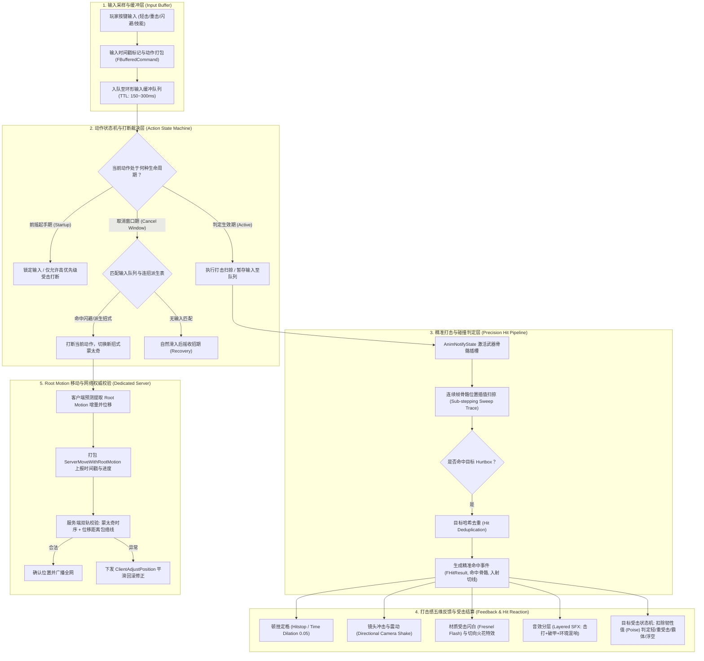
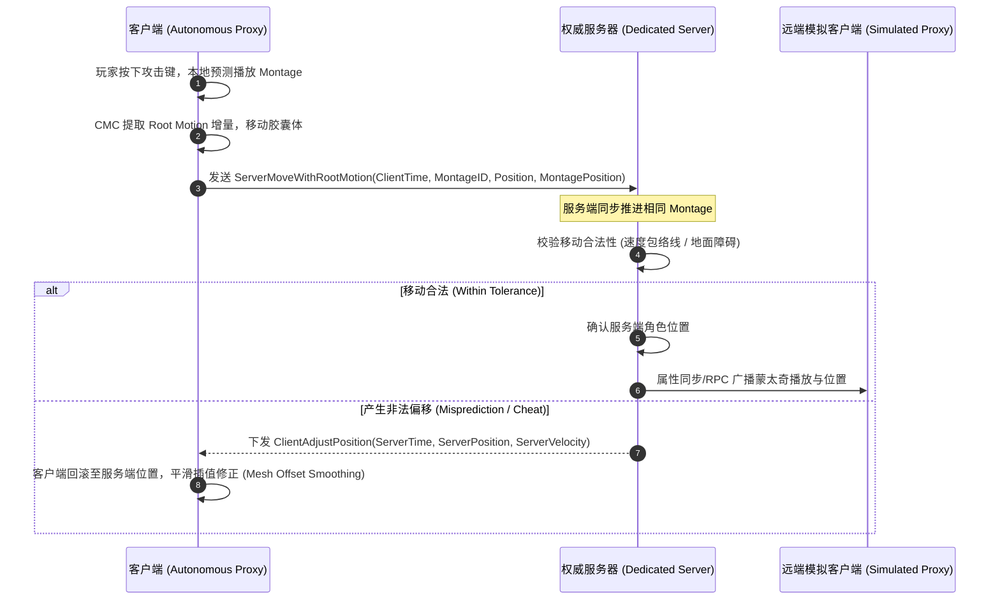

# 08 动作战斗系统与打击手感

> 知识成熟度：L2（工程体系化新著：连招打断树、输入缓冲、受击硬直与霸体、打击感反馈、高精度扫掠判定与 Root Motion 网络同步）。
> 知识基线：面向虚幻引擎（UE5.8 源码标准：CL 55116800）与工业级通用动作游戏（ACT / ARPG / 动作射击）战斗机制；紧密联动 [01-动画蓝图与状态机.md](01-动画蓝图与状态机.md)、[02-动画蒙太奇与混合空间.md](02-动画蒙太奇与混合空间.md)、[03-IK与程序化动画.md](03-IK与程序化动画.md)、[游戏知识/03-游戏玩法编程/01-GameplayAbilitySystem能力系统.md](../03-游戏玩法编程/01-GameplayAbilitySystem能力系统.md)、[游戏知识/03-游戏玩法编程/06-角色移动系统UCharacterMovement.md](../03-游戏玩法编程/06-角色移动系统UCharacterMovement.md) 以及 [游戏服务端/03-业务系统设计/08-技能与战斗框架.md](../../游戏服务端/03-业务系统设计/08-技能与战斗框架.md)。
> 适用范围：ACT / ARPG / MOBA 的动作战斗手感调优、输入预输入缓冲、连招派生状态机、多级受击反馈、精准武器扫掠碰撞判定，以及 Root Motion 动画位移在多人联机（Dedicated Server）下的预测与权威校验。
> 事实边界：动作手感与打击判定无单一行业标准，本文提供主流工业级 3A 动作系统通用方案（输入缓冲队列、四段生命周期取消窗口、五维打击反馈管线、连续骨骼扫掠检测与 RootMotionSource 复制）；涉及 UE 具体 API 以 UE5.8 源码为准。
> 参考来源：[Unreal Engine Animation System](https://dev.epicgames.com/documentation/en-us/unreal-engine)；`Engine/Source/Runtime/Engine/Classes/Animation/AnimMontage.h`；`Engine/Source/Runtime/Engine/Classes/GameFramework/RootMotionSource.h`。
> 版本基准：UE5.8（本机源码标准 CL 55116800）；动作手感与打击判定无单一行业标准，UE 相关 API 以该版本源码为准。
> 最后更新：2026-09-10（本轮补充版本基准与更新日期）。

---

## 一、概述与全景架构

在动作游戏（ACT / ARPG）中，战斗系统的“手感”是决定游戏成败的核心灵魂。优秀的动作手感由三大要素共同铸就：
1. **交互高响应度（Responsiveness）**：按键即反馈，无吞键感，通过输入预输入缓冲（Input Buffering）弥补玩家操作与动画硬直之间的时序缝隙；
2. **动作节奏与策略（Pacing & Depth）**：严谨的连招分支（Combo Branching）、动作前后摇与可取消窗口（Cancel Windows），让每一次出招兼具收益与破绽风险；
3. **沉浸击打反馈（Combat Feel & Impact）**：顿挫定格（Hitstop）、震屏（Camera Shake）、受击硬直（Hit Stun）、霸体（Super Armor）与高精度打击判定，让每一次命中充满力道感与扎实感。

### 1.1 端到端动作战斗全景闭环



---

## 二、输入缓冲与预输入系统（Input Buffer）

### 2.1 为什么必须设计输入缓冲？

人眼与手指的反应存在 100~200ms 的生物延迟，同时游戏每秒运行 60 帧（每帧 16.6ms）。在快节奏战斗中，若玩家必须在上一动作**完全结束的瞬间精确按下**下一个按键，会导致极高概率的“吞键”（Input Dropping），玩家会感觉角色“木讷、不听使唤”。

**输入缓冲机制（Input Buffering / Pre-input）**的核心思想：在角色尚处于动作硬直或不可执行操作期间，将玩家按下的战斗指令暂存入带有时间戳（Timestamp）与生存周期（Time-To-Live, TTL）的队列中。一旦角色进入“可执行动作”的时间窗口，立即消费队列中最优指令，从而实现丝滑流畅的连招手感。

### 2.2 工业级输入缓冲核心数据结构

```cpp
#pragma once

#include "CoreMinimal.h"
#include "GameplayTagContainer.h"
#include "InputBufferTypes.generated.h"

UENUM(BlueprintType)
enum class ECombatInputAction : uint8
{
    None            UMETA(DisplayName = "无"),
    LightAttack     UMETA(DisplayName = "轻攻击"),
    HeavyAttack     UMETA(DisplayName = "重攻击"),
    SpecialSkill    UMETA(DisplayName = "特殊技能"),
    Dodge           UMETA(DisplayName = "闪避/翻滚"),
    Jump            UMETA(DisplayName = "跳跃"),
    Parry           UMETA(DisplayName = "格挡/弹反")
};

USTRUCT(BlueprintType)
struct FBufferedInputCommand
{
    GENERATED_BODY()

    UPROPERTY(EditAnywhere, BlueprintReadWrite)
    ECombatInputAction ActionType = ECombatInputAction::None;

    UPROPERTY(EditAnywhere, BlueprintReadWrite)
    FGameplayTag ActionTag; // 联动 GAS 或技能系统的标签

    UPROPERTY(EditAnywhere, BlueprintReadWrite)
    float InputTimestamp = 0.0f; // 收到输入时的世界秒数

    UPROPERTY(EditAnywhere, BlueprintReadWrite)
    float TimeToLive = 0.25f; // 有效生存时间（通常 150ms ~ 300ms）

    UPROPERTY(EditAnywhere, BlueprintReadWrite)
    FVector DirectionInput = FVector::ZeroVector; // 摇杆/WASD 输入方向

    bool IsValid(float CurrentWorldTime) const
    {
        return (ActionType != ECombatInputAction::None) && 
               ((CurrentWorldTime - InputTimestamp) <= TimeToLive);
    }
};
```

### 2.3 缓冲队列工作流程与消费策略

```text
[玩家按键 LightAttack] ──(T=1.00s)──> [入队: TTL=0.25s, 失效时间=1.25s]
                                            │
   当前角色处于攻击前摇中 (不可被打断)       │ 轮询更新 (T=1.10s, 仍在有效期内)
                                            ▼
   角色播放至可取消帧 (Cancel Window) ──(T=1.15s)──> [取出指令: 匹配连招表]
                                                        │
                                                        ├─ 命中 LightAttack-2 衍生
                                                        ├─ 执行打断与下一段蒙太奇播放
                                                        └─ 消费并清除缓冲指令 (Consume)
```

**关键设计法则**：
- **TTL 阈值设置**：普攻衍生通常设为 180~250ms；闪避/格挡等保命操作设为 250~300ms。设置过短起不到预输入作用，设置过长会导致玩家“后悔出招”（误触几秒前的指令）；
- **消费排他性（Single-shot Consumption）**：一条缓冲指令一旦被成功转译为招式，必须立即从队列抹除，防止同一输入连续触发两段动作；
- **优先级抢占（Priority Preemption）**：若队列中同时存在 `Dodge`（闪避）与 `LightAttack`（轻击），防御性闪避指令必须优先被检索并消费。

---

## 三、连招状态树与动作打断窗口（Combo Tree & Cancel Windows）

### 3.1 攻击动作的四阶段生命周期

任何工业级 ACT 的攻击动作，都可精确划分为四个时间段：

```text
|<──────── 动画总时长 (Animation Duration) ────────>|
[01 前摇起手期] ──> [02 判定生效期] ──> [03 取消恢复期] ──> [04 后摇硬直期]
 (Startup)          (Active)          (Cancel Window)     (Recovery)
     │                  │                    │                 │
  出招蓄力           武器扫掠判定         可派生/闪避打断     完全僵直收刀
  不可打断           产生打击事件         输入缓冲自动消费   等待动作播完
```

| 阶段名称 | 核心特征 | 状态机行为 | 玩家感知 |
| :--- | :--- | :--- | :--- |
| **01 前摇起手（Startup）** | 动作抬手与力量积蓄 | 输入被缓冲锁定；仅允许被高优先级“受击硬直”打断 | 出招破绽期，考验出招时机 |
| **02 判定生效（Active）** | 武器挥出，激活 Hitbox 扫掠 | 持续检测重叠；产生命中反馈；一般禁止自我打断 | 击中敌人的关键瞬间 |
| **03 取消恢复（Cancel Window）** | 挥刀完成，开始收势 | **窗口激活**：允许连招派生、闪避取消、技能衔接 | 连招节奏点，高手取消后摇的窗口 |
| **04 后摇收招（Recovery）** | 收刀入鞘、归正姿态 | 错过了取消窗口，角色必须完整播放收招硬直 | 贪刀惩罚，易被敌方抓住破绽反打 |

### 3.2 动作打断优先级矩阵（Cancel Priority Matrix）

当一个输入请求发生时，系统必须基于打断优先级矩阵决定是否允许切换动作：

```text
 打击受击中断 (Hit Stun) ──[最高优先级: 强制打断任何非霸体动作]
       ▲
       │
 紧急闪避/翻滚 (Dodge)  ──[防御优先级: 可在 Active 后期与 Cancel 期打断攻击]
       ▲
       │
 特殊技能/奥义 (Skill)  ──[技能优先级: 可取消普通攻击后摇]
       ▲
       │
 普通连招衍生 (Combo)   ──[派生优先级: 仅在指定的 Cancel Window 内允许打断]
       ▲
       │
 基础移动 (Movement)   ──[最低优先级: 必须等待攻击后摇全部完成或由闪避接替]
```

### 3.3 基于 AnimNotifyState 的取消窗口实现

在 UE 引擎中，最推荐通过自定义 `UAnimNotifyState` 在动画蒙太奇时间轴上精确配置取消窗口：

```cpp
// AnimNotifyState_CancelWindow.h
#pragma once

#include "CoreMinimal.h"
#include "Animation/AnimNotifies/AnimNotifyState.h"
#include "GameplayTagContainer.h"
#include "AnimNotifyState_CancelWindow.generated.h"

UCLASS(meta = (DisplayName = "动作打断窗口 (Cancel Window)"))
class YOURGAME_API UAnimNotifyState_CancelWindow : public UAnimNotifyState
{
    GENERATED_BODY()

public:
    // 允许打断当前动作的标签集（如: Action.Dodge, Action.Combo.LightAttack）
    UPROPERTY(EditAnywhere, BlueprintReadOnly, Category = "Cancel")
    FGameplayTagContainer AllowedCancelActions;

    // 是否允许闪避无条件打断
    UPROPERTY(EditAnywhere, BlueprintReadOnly, Category = "Cancel")
    bool bAllowDodgeCancel = true;

    virtual void NotifyBegin(USkeletalMeshComponent* MeshComp, UAnimSequenceBase* Animation, float TotalDuration, const FAnimNotifyEventReference& EventReference) override;
    virtual void NotifyEnd(USkeletalMeshComponent* MeshComp, UAnimSequenceBase* Animation, const FAnimNotifyEventReference& EventReference) override;
};
```

```cpp
// AnimNotifyState_CancelWindow.cpp
#include "AnimNotifyState_CancelWindow.h"
#include "ActionCombatComponent.h"

void UAnimNotifyState_CancelWindow::NotifyBegin(USkeletalMeshComponent* MeshComp, UAnimSequenceBase* Animation, float TotalDuration, const FAnimNotifyEventReference& EventReference)
{
    if (MeshComp && MeshComp->GetOwner())
    {
        if (UActionCombatComponent* CombatComp = MeshComp->GetOwner()->FindComponentByClass<UActionCombatComponent>())
        {
            CombatComp->OpenCancelWindow(AllowedCancelActions, bAllowDodgeCancel);
        }
    }
}

void UAnimNotifyState_CancelWindow::NotifyEnd(USkeletalMeshComponent* MeshComp, UAnimSequenceBase* Animation, const FAnimNotifyEventReference& EventReference)
{
    if (MeshComp && MeshComp->GetOwner())
    {
        if (UActionCombatComponent* CombatComp = MeshComp->GetOwner()->FindComponentByClass<UActionCombatComponent>())
        {
            CombatComp->CloseCancelWindow();
        }
    }
}
```

---

## 四、受击硬直、霸体与控制物理（Hit Reaction & Poise）

### 4.1 受击硬直分级模型

受击反应直接决定战斗的力量感与挫败感，必须根据攻击强度建立严格的受击分级：

| 受击级别 | 触发条件 | 动画与位移表现 | 状态机影响 | 恢复与保护机制 |
| :--- | :--- | :--- | :--- | :--- |
| **1. 轻微受击（Light Flinch）** | 普通轻攻击、远程骚扰 | 身体局部骨骼微晃（通过 Layered Blend 单独混合上半身受击） | 不打断下半身移动；攻击动作依据霸体裁决 | 150ms 快速自恢复 |
| **2. 重受击（Heavy Stagger）** | 重攻击、破招击中 | 全身大动作后仰，伴随 1~2 米水平向后位移 | 彻底打断当前所有招式；进入无法输入的受击硬直态 | 硬直持续 400~800ms，不可被普通取消 |
| **3. 击退（Knockback）** | 大锤蓄力击、爆炸冲击波 | 角色沿受击方向加速滑行位移（速度衰减插值） | 强制位移态，禁止输入 | 期间若撞击墙体可追加额外撞墙硬直 |
| **4. 浮空击飞（Knockup / Air Juggle）** | 上挑斩、升龙拳 | 赋予垂直向上冲量，角色进入浮空重力滞空状态 | 进入浮空受击态（Air Stagger），处于被追加连击状态 | 浮空有下落衰减上限，防止无限浮空循环 |
| **5. 击倒与伏地（Knockdown）** | 强力下砸、浮空连段收尾 | 砸落击倒在地面，播放倒地趴地姿态 | 完全倒地不可选定或处于倒地判定态 | 必须播放起身动画，起身阶段拥有 0.5s 无敌帧 |

### 4.2 霸体系统（Super Armor / Hyper Armor）与韧性值（Poise）

为防止玩家或 Boss 陷入“无脑被连到死”的无限硬直循环，必须引入**韧性系统（Poise System）**：

```text
[受到攻击] ──> 计算攻击破韧值 (PoiseDamage)
                    │
                    ▼
          扣除当前韧性值: CurrentPoise -= PoiseDamage
                    │
       ┌────────────┴────────────┐
  CurrentPoise > 0          CurrentPoise <= 0
       │                         │
  [触发霸体吸收]           [触发霸体击破 (Armor Break)]
       │                         │
  - 不打断当前招式          - 强制打断当前招式
  - 仅播放受击特效与音效    - 触发大受击硬直/踉跄动画
  - 减免 20%~30% 伤害       - 重置韧性值为满值，进入保护 CD
```

**韧性恢复与衰减模型（C++ 逻辑示例）**：
```cpp
void UActionCombatComponent::TickPoise(float DeltaTime)
{
    // 若脱离受击状态超过冷却时间（如 3.0 秒），开始平滑恢复韧性
    if (CurrentWorldTime - LastHitTime > PoiseRecoveryDelay)
    {
        CurrentPoise = FMath::FInterpTo(CurrentPoise, MaxPoise, DeltaTime, PoiseRecoverySpeed);
    }
}
```

---

## 五、打击感五维反馈管线（Combat Feel Pipeline）

打击感并非玄学，它是严格的**视觉、听觉、时间与空间四维物理刺激在人类神经上的综合映射**。每次打击判定成立时，管线必须并行调度以下五维表现：

```text
                              ┌── 1. 顿挫定格 (Hitstop): 攻防双方帧冻结 0.08s
                              ├── 2. 镜头震动 (Camera Shake): 依据冲击方向脉冲
 精准命中事件 (Hit Event) ────┼── 3. 材质闪白 (Hit Flash): 边缘 Fresnel 高亮 0.05s
                              ├── 4. 音效分层 (Layered SFX): 击打层 + 钝/锐材质层
                              └── 5. 物理冲量与特效: 切向火花粒子 + 骨骼微回弹
```

### 5.1 顿挫感与定格（Hitstop / Frame Freeze）

顿挫感是动作打击感最重要的力量来源。如果利刃斩过敌人而没有任何阻滞感，武器就会显得像“切空气”。
- **攻击方顿挫**：攻击者蒙太奇播放速率瞬间降为 0 或 0.05，持续 60~100ms；
- **受击方顿挫**：受击者同样被定格 80~120ms，强化受力阻滞；
- **全局时间膨胀（Global Time Dilation）vs 局部时间膨胀（CustomTimeDilation）**：
  - 普通打击**绝不能**使用 `UGameplayStatics::SetGlobalTimeDilation`，否则整个世界（包括环境雨水、其他玩家）都会瞬间卡顿；
  - 必须使用 Actor 独立的 `CustomTimeDilation`：
    ```cpp
    // 仅针对攻防双方设置局部微秒级冻结
    AttackerActor->CustomTimeDilation = 0.05f;
    VictimActor->CustomTimeDilation = 0.02f;
    
    // 延迟 0.08 秒后恢复正常播放速率 (1.0)
    FTimerHandle ResetDilationHandle;
    GetWorld()->GetTimerManager().SetTimer(ResetDilationHandle, [AttackerActor, VictimActor]()
    {
        if (AttackerActor.IsValid()) AttackerActor->CustomTimeDilation = 1.0f;
        if (VictimActor.IsValid()) VictimActor->CustomTimeDilation = 1.0f;
    }, 0.08f, false);
    ```

### 5.2 定向镜头冲击（Directional Camera Shake）

镜头震动绝不能是简单的随机抖动（Perlin Noise）。高品质动作游戏使用**受力方向反向冲量**：
- 刀从左往右横劈：镜头瞬时向左下产生微小角位移，随后以欠阻尼简谐振动回弹；
- 重锤砸地：镜头垂直向下瞬间沉降，伴随高频衰减震颤。

---

## 六、高精度打击判定管线（Precision Hit Detection Pipeline）

### 6.1 单帧 Overlap 检测与丢帧穿模的致命缺陷

传统的“单帧包围盒碰撞检测”（如每帧挂一个 BoxCollision 开启 Overlap）在动作游戏中存在致命缺陷：
当武器高速挥动（例如 1 帧内武器刀尖移动了 1.5 米），在 60FPS 下，第 N 帧武器在敌人身前，第 N+1 帧武器已经划到了敌人身后。**两帧之间的空间完全没有碰撞体覆盖**，导致武器直接从敌人身上“穿透”，判定彻底丢失！

```text
[第 N 帧]                    [未检测的空白真空区]                   [第 N+1 帧]
 武器位置 (身前) ────> (刀光瞬间穿过目标胶囊体，无交集!) ────> 武器位置 (身后)
      │                                                               │
   检测位置                                                        检测位置
```

### 6.2 连续骨骼插值扫掠检测（Multi-Socket Sub-stepping Sweep Trace）

工业级标准解法：**在武器网格体上沿刀刃均匀布置 N 个虚拟插槽（Sockets，如 Socket_Blade_01 ~ 05）。在判定激活期内，每帧记录上一帧插槽位置与当前帧插槽位置，执行基于球体或胶囊体的扫掠碰撞检测（Sweep Multi Trace）**。

```text
[上一帧 Socket 位置 A]  ● ══════════════════════>  ● [当前帧 Socket 位置 B]
                         \    扫掠形成的圆柱体胶囊   /
                          \  (Sweep Capsule/Sphere) /
                           ═════════════════════════
                       [完美覆盖两帧之间的整个运动轨迹]
```

```cpp
void UActionCombatComponent::PerformWeaponSweepTrace(float DeltaTime)
{
    UWorld* World = GetWorld();
    if (!World || !WeaponMeshComp) return;

    FCollisionQueryParams QueryParams;
    QueryParams.AddIgnoredActor(GetOwner());
    QueryParams.bTraceComplex = false;
    QueryParams.bReturnPhysicalMaterial = true;

    // 遍历武器上的所有检测插槽（例如刀刃根部、中部、刀尖）
    for (int32 i = 0; i < WeaponSockets.Num(); ++i)
    {
        const FName& SocketName = WeaponSockets[i];
        FVector CurrentSocketLocation = WeaponMeshComp->GetSocketLocation(SocketName);
        FVector PreviousSocketLocation = PreviousSocketLocations[i];

        // 仅当上一帧位置有效时执行扫掠
        if (!PreviousSocketLocation.IsZero())
        {
            TArray<FHitResult> HitResults;
            FCollisionShape SweepSphere = FCollisionShape::MakeSphere(SweepRadius); // 比如半径 8cm

            // 执行球体扫掠检测
            bool bHit = World->SweepMultiByChannel(
                HitResults,
                PreviousSocketLocation,
                CurrentSocketLocation,
                FQuat::Identity,
                ECC_GameTraceChannel_Weapon, // 专用的武器打击检测通道
                SweepSphere,
                QueryParams
            );

            if (bHit)
            {
                for (const FHitResult& Hit : HitResults)
                {
                    AActor* HitActor = Hit.GetActor();
                    // 6.3 命中去重：同一次攻击判定窗口内，同一目标仅生效一次
                    if (HitActor && !HitVictimsDeduplicationSet.Contains(HitActor))
                    {
                        HitVictimsDeduplicationSet.Add(HitActor);
                        ProcessHitImpact(HitActor, Hit);
                    }
                }
            }
        }

        // 缓存当前帧位置供下一帧扫掠使用
        PreviousSocketLocations[i] = CurrentSocketLocation;
    }
}
```

---

## 七、Root Motion 动作位移与多人网络同步校验

### 7.1 Root Motion 根骨骼位移原理

**根骨骼位移（Root Motion）**是指动画资产在制作时，将角色的位移与旋转信息烘焙在骨骼层级的最顶层骨骼（Root Bone）上。在游戏运行时：
1. 动画求值器提取 Root Bone 相对于上一帧的位移增量 $\Delta P$ 和旋转增量 $\Delta R$；
2. 动画求值完成后，将 Root Bone 归零（不直接渲染位移），并将该增量移交给移动组件（`CharacterMovementComponent`）；
3. 移动组件将 $\Delta P$ 转化为实际胶囊体的速度与位移碰撞（Swept Move）。

### 7.2 单机与 Dedicated Server 联网环境的本质差异

| 关注维度 | 单机环境（Single Player） | 多人联网环境（Dedicated Server） |
| :--- | :--- | :--- |
| **执行权力** | 本地动画与胶囊体位移 100% 信任 | **服务端权威裁决**，客户端仅能预测先行 |
| **网络延迟** | 0 延迟，位移与输入完全同步 | 客户端先行播放，由于 RTT 延迟，两端角色位置存在时钟差 |
| **位置发散** | 无发散 | 若服务端丢包或校验失败，强行拉回会产生剧烈瞬移抽搐（Snapping） |

### 7.3 基于 FRootMotionSource 与 ServerMove 的网络闭环

在 UE5 多人网络同步架构下，Root Motion 蒙太奇同步依赖 `CharacterMovementComponent` 内置的预测与校正协议：



### 7.4 服务端权威位移防作弊校验准则

为防止客户端通过篡改本地 Root Motion 动画曲线实现超速瞬移（Speedhack / Teleport），服务端在接收到移动指令时执行严格的包络线防御：
1. **时间轴同步锁（Montage Time Window）**：服务端记录该蒙太奇启动时间戳 $T_{start}$。客户端上报的当前帧蒙太奇进度 $t_{client}$ 与服务端真实经过时间 $\Delta t = T_{now} - T_{start}$ 的偏差不得超过容差 $\epsilon$（通常允许 $1 \sim 2$ 个 Tick 抖动）；
2. **最大位移包络线（Max Displacement Envelope）**：服务端预先提取该蒙太奇在任意时刻的最大可能位移距离 $D_{max}(t)$。若客户端上报的位移矢量 $|\vec{P}_{client} - \vec{P}_{start}| > D_{max}(t) + Margin$，立即触发拒绝并强制拉回；
3. **障碍物穿透判定（Sweep Check on Server）**：服务端在同步执行位移时，同样开启带胶囊体碰撞的 `MoveUpdatedComponent`。客户端绕过障碍穿墙的位移在服务端必将发生碰撞阻挡并被阻断。

---

## 八、典型工程实战实现：C++ 动作战斗组件

以下给出一套工业级精简整合的 `UActionCombatComponent` 头文件与核心状态流转实现：

```cpp
// ActionCombatComponent.h
#pragma once

#include "CoreMinimal.h"
#include "Components/ActorComponent.h"
#include "GameplayTagContainer.h"
#include "ActionCombatComponent.generated.h"

DECLARE_DYNAMIC_MULTICAST_DELEGATE_TwoParams(FOnHitImpactSignature, AActor*, TargetActor, const FHitResult&, HitResult);

UCLASS(ClassGroup=(Combat), meta=(BlueprintSpawnableComponent))
class YOURGAME_API UActionCombatComponent : public UActorComponent
{
    GENERATED_BODY()

public:
    UActionCombatComponent();

    // 1. 输入缓冲接口
    UFUNCTION(BlueprintCallable, Category = "Combat|Input")
    void BufferAction(ECombatInputAction ActionType, FGameplayTag ActionTag, FVector DirectionInput);

    // 2. 取消窗口控制
    void OpenCancelWindow(const FGameplayTagContainer& AllowedTags, bool bAllowDodge);
    void CloseCancelWindow();

    // 3. 命中判定开关 (由 AnimNotifyState 驱动)
    void StartHitDetection(const TArray<FName>& Sockets, float Radius);
    void StopHitDetection();

    // 4. 受击处理
    UFUNCTION(BlueprintCallable, Category = "Combat|Reaction")
    void ReceiveDamage(float DamageAmount, float PoiseDamage, AActor* Attacker, const FHitResult& HitInfo);

    UPROPERTY(BlueprintAssignable, Category = "Combat|Events")
    FOnHitImpactSignature OnHitImpact;

protected:
    virtual void TickComponent(float DeltaTime, ELevelTick TickType, FActorComponentTickFunction* ThisTickFunction) override;

private:
    // 内部输入缓冲队列
    TArray<FBufferedInputCommand> InputBufferQueue;
    
    // 取消窗口状态
    bool bInCancelWindow = false;
    bool bCanDodgeCancel = false;
    FGameplayTagContainer CurrentAllowedCancelTags;

    // 武器扫掠检测上下文
    bool bHitDetectionActive = false;
    TArray<FName> ActiveWeaponSockets;
    TArray<FVector> LastSocketPositions;
    float ActiveSweepRadius = 10.0f;
    TSet<TWeakObjectPtr<AActor>> HitTargetsDeduplication;

    // 韧性与霸体状态
    float MaxPoise = 100.0f;
    float CurrentPoise = 100.0f;
    bool bIsSuperArmorActive = false;

    void TryConsumeBufferedInput();
    void ExecuteWeaponSweep();
    void ApplyHitstop(float Duration, float DilationScale);
};
```

---

## 九、反模式、失败路径与性能基准

### 9.1 动作战斗系统典型反模式（Anti-Patterns）

| 严重等级 | 反模式名称 | 典型错误做法 | 正确工业级做法 |
| :---: | :--- | :--- | :--- |
| **FATAL** | **客户端全信伤害上报** | 客户端在检测到武器扫掠重叠后，直接向服务端 RPC 发送 `ApplyDamage(Target, 100)` | 客户端仅上报命中意图；服务端回溯目标位置，权威重算防御、霸体、护盾并扣减血量 |
| **FATAL** | **无去重扫掠检测** | 扫掠检测每帧运行，未对同一个 Actor 去重，导致单次挥刀在 5 帧内造成 5 次巨额伤害 | 维护 `HitTargetsDeduplication` 哈希集，在单次 NotifyState 生命周期内同一目标只结算一次伤害 |
| **ERROR** | **全局时间膨胀做 Hitstop** | 使用 `SetGlobalTimeDilation` 实现普通攻击定格，导致全图所有队友、怪物、环境雨雪全部卡顿 | 使用攻防双方 Actor 独立的 `CustomTimeDilation`（仅在终结技全屏处决时才考虑全局微定格） |
| **WARN** | **无缓冲的瞬时输入采样** | 仅在玩家按键当帧检查当前是否能出招，不能出招就直接丢弃按键事件 | 引入 150~250ms 生存期的输入缓冲队列，在取消窗口开启时自动检索并消费 |
| **WARN** | **无子步扫掠的高速武器** | 高速重剑挥动仅做单帧 Box Overlap 碰撞检测，在 30FPS 或低端设备上频繁穿模丢失判定 | 使用基于武器 Socket 骨骼前后帧插值的 `SweepMultiByChannel` 连续柱状体扫掠检测 |

### 9.2 性能预算与线上门禁

- **CPU 扫掠判定开销**：单角色武器扫掠插槽建议控制在 $3 \sim 5$ 个（刀尖、刀刃中段、刀根），单次 SweepMulti 耗时需 $< 0.03\text{ms}$；对于同屏几十只近战小怪，必须做 LOD 降级（远距离怪物退化为粗糙前向球体判定，取消骨骼扫掠）；
- **内存无分配原则**：`HitTargetsDeduplication` 必须预分配容量（`Reserve(16)`），在 Notify 结束时调用 `Reset()` 而非 `Empty()`，防止在每秒多次的高频挥刀中反复发生堆内存重新分配；
- **网络带宽基准**：Root Motion 蒙太奇同步严禁每帧发送骨骼变换，仅发送 `MontageID (uint16) + MontageSection (uint8) + StartTimestamp (float)`，整包带宽开销控制在 8 字节以内。

---

## 十、关联阅读与演进索引

- **前置骨骼与状态机**：[01-动画蓝图与状态机.md](01-动画蓝图与状态机.md) ｜ [02-动画蒙太奇与混合空间.md](02-动画蒙太奇与混合空间.md)
- **程序化姿态与反向动力学**：[03-IK与程序化动画.md](03-IK与程序化动画.md)
- **客户端玩法能力框架**：[游戏知识/03-游戏玩法编程/01-GameplayAbilitySystem能力系统.md](../03-游戏玩法编程/01-GameplayAbilitySystem能力系统.md)
- **角色移动与网络预测**：[游戏知识/03-游戏玩法编程/06-角色移动系统UCharacterMovement.md](../03-游戏玩法编程/06-角色移动系统UCharacterMovement.md)
- **服务端战斗与伤害管线**：[游戏服务端/03-业务系统设计/08-技能与战斗框架.md](../../游戏服务端/03-业务系统设计/08-技能与战斗框架.md)
- **战斗 AI 决策与破招反馈**：[游戏AI/02-移动学习与服务端/02-战斗与Boss设计.md](../../游戏AI/02-移动学习与服务端/02-战斗与Boss设计.md)
- **战斗导演与攻击令牌协同**：[游戏AI/02-移动学习与服务端/07-战斗AI编排与战术协同.md](../../游戏AI/02-移动学习与服务端/07-战斗AI编排与战术协同.md)
