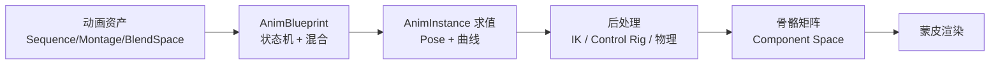
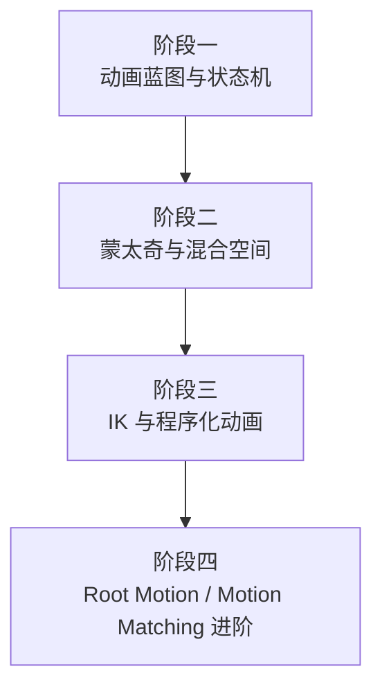

# 04-动画系统

> 分类导航 ｜ 所属知识库：UE 客户端知识库（Unreal Engine 5.x）

## 分类简介

### 动画系统在 UE 中的定位

动画系统负责把"骨骼 + 关键帧数据"转换为屏幕上角色的每一帧姿态，是角色表现力的核心。在 UE 中，动画系统横跨**资产层**（Animation Sequence、AnimMontage、Blend Space、Control Rig）、**逻辑层**（AnimBlueprint / AnimInstance、状态机、蒙太奇播放）、**求解层**（AnimGraph 求值、IK 求解、物理动画混合）与**数据流层**（Root Motion 提取、动画曲线、网络复制）。

学习动画系统的本质是理解一条流水线：

### 本分类覆盖内容

| 文章 | 主题 |
| --- | --- |
| 01-动画蓝图与状态机 | AnimBlueprint 架构、AnimGraph / EventGraph 分工、动画状态机、Blend 混合节点、Slot 插槽、同步组、Linked Anim Graph、LOD |
| 02-动画蒙太奇与混合空间 | Animation Montage 播放机制、Section / Slot、AnimNotify / AnimNotifyState、Blend Space 1D/2D 参数化混合、Aim Offset |
| 03-IK与程序化动画 | TwoBoneIK / FABRIK 原理、Foot IK 落地、Control Rig（UE5）、程序化动画、动画驱动、Root Motion、Motion Matching 简述 |

### 与其他分类的关系

| 关联分类 | 关系说明 |
| --- | --- |
| 03-游戏玩法编程 | 动画蓝图的事件图/蒙太奇通知是"动画 → 玩法"的桥梁（攻击判定、技能表现） |
| 05-AI 系统 | AI 通过动画蓝图参数（速度、朝向、意图）驱动表现层 |
| 06-网络同步 | 动画曲线、Root Motion、蒙太奇播放需要在服务器/客户端间同步 |
| 07-UI与性能优化 | 动画求值是每帧开销大户：LOD、并行求值、骨骼过滤、物理动画混合成本 |

## 文件列表

| 文件 | 一句话简介 |
| --- | --- |
| [01-动画蓝图与状态机.md](01-动画蓝图与状态机.md) | 动画蓝图的组成与更新流程、状态机工作原理、各类混合节点与 Slot 的使用方法。 |
| [02-动画蒙太奇与混合空间.md](02-动画蒙太奇与混合空间.md) | 蒙太奇播放/分段/通知机制，以及 Blend Space 1D/2D 参数化混合与 Aim Offset。 |
| [03-IK与程序化动画.md](03-IK与程序化动画.md) | TwoBoneIK/FABRIK/Foot IK 原理、Control Rig、程序化动画、动画驱动与 Root Motion。 |
| [04-动画性能与预算分配.md](04-动画性能与预算分配.md) | 骨骼动画成本、AnimationBudgetAllocator 预算算法与降级策略、AnimationSharing 动画共享。 |

## 每篇一句话简介

- **01-动画蓝图与状态机**：讲清楚"动画蓝图是什么、每帧怎么算出来的、状态机怎么转、混合怎么混"——这是动画系统的地基，所有动画需求最终都落在这张图上。
- **02-动画蒙太奇与混合空间**：讲"一次性动作"（攻击、施法、处决）与"连续动作"（走路、跑动、瞄准）两大表现手段，分别对应蒙太奇与混合空间。
- **03-IK与程序化动画**：讲"动画数据之外"的姿态修正与生成手段：IK 求解、Control Rig 程序化控制、物理驱动，以及 Root Motion 与 Motion Matching 简述。

## 学习顺序建议

### 阶段一：动画蓝图与状态机（必读）

先理解 AnimBlueprint 的"事件图（EventGraph）负责数据、动画图（AnimGraph）负责姿态"的分工，再上手搭建一个 Idle / Walk / Run / Jump 状态机。这个阶段解决 80% 的日常动画需求。

- 建议动手：新建第三人称模板，把默认动画蓝图的状态机拆开看一遍，添加一个新状态。
- 验收标准：能说清"速度参数从哪里来、状态机为什么这样转、混合节点怎么分配权重"。

### 阶段二：动画蒙太奇与混合空间

攻击、受击、技能必须用蒙太奇；移动表现用混合空间。重点理解 Slot 插槽如何让"一次性动画"叠加在"循环移动状态"之上，以及 AnimNotify 如何把动画事件送回玩法层。

- 建议动手：给角色加一个攻击蒙太奇 + 命中 AnimNotifyState；再做一个速度-方向 2D 混合空间。
- 验收标准：能独立完成"移动中出招且不打断移动状态"的完整链路。

### 阶段三：IK 与程序化动画

脚部落地（Foot IK）、手部抓握、程序化尾巴/头发，这些"动画数据给不了"的姿态靠 IK 与程序化手段生成。UE5 中 Control Rig 是主战场。

- 建议动手：用 Control Rig 给角色加一条程序化尾巴；实现简易 Foot IK。
- 验收标准：能说清 TwoBoneIK 与 FABRIK 的适用场景差异。

### 阶段四：Root Motion 与 Motion Matching 进阶

需要精确位移同步（攀爬、处决、Boss 技能）时启用 Root Motion；追求下一代表现时了解 Motion Matching / AnimNext（UE5.4+ 实验、UE5.5+ AnimNext）。

- 建议动手：把一段翻越动画改为 Root Motion 模式，对比位移与网络同步表现。
- 验收标准：能说明 Root Motion 的三种提取模式差异及网络注意事项。

### 通用前置知识

- 3D 数学基础：向量、矩阵、四元数（IK 与混合空间推导需要）。
- UE 蓝图基础：事件、变量、函数调用。
- 美术侧概念：骨骼层级（Bone Hierarchy）、骨骼绑定（Skinning）、动画重定向（Retargeting）——不理解这些，动画系统很多概念会悬空。

## 常用资源

- 官方文档：Animation Blueprints、AnimMontage、Blend Spaces、Control Rig（以 UE5 文档为准）。
- 官方示例：Lyra 项目（动画层/游戏玩法驱动的动画结构）、Animation Starter Pack。
- 调试工具：AnimDebugger（动画蓝图调试器）、Anim Insights（动画性能分析）、Debug Show Skeleton。

> 本目录文章之间通过"关联阅读"互相引用，建议按编号顺序阅读；遇到不熟悉的 UE 术语可先在对应文章的核心概念表中查找。
