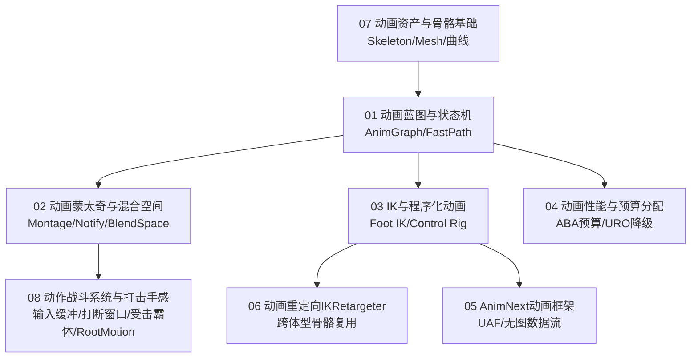

# 04 动画系统

> 知识成熟度：L2（子域工程手册，已按 8 篇核心专题与 UE5.8 源码基线全面标准化）。
>
> 领域权威导航：[游戏知识 Domain MOC](../../00_Index/domains/游戏知识.md) ｜ [游戏知识总目录](../README.md)。

---

## 1. 核心定位与设计思想

「04-动画系统」负责将离线关键帧动画资产、程序化逆运动学（IK）与物理动力学融合转化为每一帧骨骼变换矩阵，是角色表现力与打击感的核心中枢。UE 动画管线横跨多层体系：
- **流水线分工与姿态求值**：严格区分数据层（EventGraph/Property Access）与姿态求值层（AnimGraph），推行 FastPath 零开销蓝图优化与并行姿态求值（Parallel Evaluation）；
- **非线性混合与动作叠加**：以动画状态机处理循环运动，通过 Slot 插槽与蒙太奇（Montage）混播动作，以 BlendSpace 实现多向移动连续插值；
- **程序化修正与次时代框架**：通过 Control Rig 与 TwoBoneIK/FABRIK 实现高精度环境贴合与布娃娃物理动画过渡，并引入下一代基于数据流图的 AnimNext/UAF 架构；
- **动作战斗与打击手感**：打通连招派生树（Combo Tree）、输入预输入缓冲（Input Buffer）、取消窗口（Cancel Window）、受击硬直与霸体韧性机制，构建连续骨骼扫掠（Sweep Trace）与 Root Motion 多人联机权威校验闭环；
- **大规模角色预算治理**：依托 Animation Budget Allocator（ABA）实现帧率平滑、LOD 降级与跨帧更新率优化（URO）。

---

## 2. 专题矩阵与知识状态

| 专题文件（Canonical 路径） | 知识类型 | 成熟度 | 核心工程关注点与落地场景 |
| :--- | :---: | :---: | :--- |
| [01-动画蓝图与状态机.md](01-动画蓝图与状态机.md) | Concept | L2 | AnimBlueprint 架构、EventGraph 与 AnimGraph 分工、FastPath 优化、状态机转换规则与 Slot 槽位混合 |
| [02-动画蒙太奇与混合空间.md](02-动画蒙太奇与混合空间.md) | Concept | L2 | Animation Montage 分段播放、AnimNotify/AnimNotifyState 事件通知管线、1D/2D BlendSpace 与 AimOffset 瞄准偏移 |
| [03-IK与程序化动画.md](03-IK与程序化动画.md) | Concept | L2 | TwoBoneIK/FABRIK 解析求解器、Foot IK 复杂地形自适应、Control Rig 程序化控制、Root Motion 根骨骼位移提取 |
| [04-动画性能与预算分配.md](04-动画性能与预算分配.md) | Concept | L2 | Animation Budget Allocator（ABA）预算算法、三档降级与丢帧插值、URO 更新率优化与大规模海量角色开销压降 |
| [05-AnimNext动画框架.md](05-AnimNext动画框架.md) | Concept | L2 | UE5.8+ AnimNext/UAF 新一代无图动画框架、功能数据流图驱动求值、Trait 模块化装配与 StateTree 协同 |
| [06-动画重定向与IKRetargeter.md](06-动画重定向与IKRetargeter.md) | Concept | L2 | IK Rig 与 IK Retargeter 跨骨骼拓扑资产复用、骨骼链（Chains）映射、22 种 Retarget Op 与批量资产离线转换 |
| [07-动画资产与骨骼基础.md](07-动画资产与骨骼基础.md) | Concept | L2 | Skeleton 共享骨架、SkeletalMesh 顶点蒙皮权重、AnimSequence 曲线压缩算法与 FBX 资产导入导出工业管线 |
| [08-动作战斗系统与打击手感.md](08-动作战斗系统与打击手感.md) | Architecture | L2 | ACT/ARPG 核心动作战斗：输入缓冲预输入、连招打断窗口、受击硬直与霸体物理、五维打击反馈管线、连续骨骼扫掠判定与 Root Motion 网络同步校验 |

---

## 3. 逻辑学习顺序建议

```mermaid
flowchart TD
    A[07 动画资产与骨骼基础<br/>Skeleton/Mesh/曲线] --> B[01 动画蓝图与状态机<br/>AnimGraph/FastPath]
    B --> C[02 动画蒙太奇与混合空间<br/>Montage/Notify/BlendSpace]
    B --> D[03 IK与程序化动画<br/>Foot IK/Control Rig]
    C --> H[08 动作战斗系统与打击手感<br/>输入缓冲/打断窗口/受击霸体/RootMotion]
    D --> E[06 动画重定向IKRetargeter<br/>跨体型骨骼复用]
    B --> F[04 动画性能与预算分配<br/>ABA预算/URO降级]
    D --> G[05 AnimNext动画框架<br/>UAF/无图数据流]
```

1. **第一阶段（资产地基与蓝图求值）**：精读 `07-动画资产与骨骼基础` 与 `01-动画蓝图与状态机`，掌握骨骼层次、蒙皮权重、AnimGraph 姿态图求值与 FastPath 规约。
2. **第二阶段（动作混播与技能表现）**：学习 `02-动画蒙太奇与混合空间`，打通技能攻击蒙太奇、打击判定 Notify 与 2D 移动参数化混合。
3. **第三阶段（动作战斗与手感实战）**：研读 `08-动作战斗系统与打击手感`，攻坚连招分支打断、预输入防吞键、受击硬直/霸体反馈、高精度插槽连续扫掠与 Root Motion 网络防作弊校验。
4. **第四阶段（环境适应与程序化姿态）**：研读 `03-IK与程序化动画` 与 `06-动画重定向与IKRetargeter`，掌握 Foot IK 斜坡贴合与跨骨骼资产复用。
5. **第五阶段（海量性能治理与未来架构）**：深入 `04-动画性能与预算分配` 与 `05-AnimNext动画框架`，掌控大规模战场 NPC 动画预算控制与新一代 UAF 架构演进。

---

## 4. 游戏与引擎工程落地场景

- **动作战斗连招与取消后摇**：通过 `UAnimNotifyState_CancelWindow` 划定派生窗口，配置 250ms 输入缓冲队列，实现无缝衔接的普攻三连段与紧急闪避打断；
- **武器高精度挥砍判定**：在武器上部署多 Socket 插槽，利用 `SweepMultiByChannel` 进行相邻帧插值扫掠检测，彻底消除高速挥击穿模丢判定问题；
- **Root Motion 网络权威校验**：结合 Dedicated Server 与 `FRootMotionSource`，对客户端上报的位移包络线进行速度与碰撞双轨校验，兼顾本地预测流畅度与服务端防瞬移外挂；
- **移动施法与上半身分离混播**：使用 Layered blend per bone 节点，将攻击蒙太奇应用到 Spine 脊椎以上骨骼，同时下半身保持跑动状态机求值；
- **百人同屏动画性能压降**：配置 Animation Budget Allocator，将视口外或远距离角色切换到 URO（每 4 帧更新一次姿态并开启局部线性插值），节约 60% 动画 CPU 开销；
- **高低起伏地形脚部贴合**：基于 Control Rig 射线探测地面法线与高度差，计算两足盆骨偏移量与踝关节旋转，消除角色浮空与穿模。

---

## 5. 跨域技术依赖与前后置导航

- **向下扎根（计算机底座）**：
  - SIMD 向量矩阵乘法：[00-08 计算机体系结构与性能](../../00-计算机与工程基础/08-计算机体系结构与性能/README.md)
  - 四元数与骨骼旋转：[游戏算法 02-数学与碰撞](../../游戏算法/02-数学与碰撞/README.md)
- **向上驱动（引擎源码剖析）**：
  - 动画求值底层源码：[12-11 动画系统求值源码](../12-引擎源码分析/11-动画系统求值源码.md)
  - AnimNext 源码实现：[12-36 AnimNext与UAF源码](../12-引擎源码分析/36-AnimNext与UAF源码.md)
  - ControlRig 源码：[12-18 RigVM与ControlRig源码](../12-引擎源码分析/18-RigVM与ControlRig源码.md)
- **横向协同（玩法、AI与服务端）**：
  - 技能攻击与 GAS 能力：[03-游戏玩法编程](../03-游戏玩法编程/README.md)
  - 角色移动与网络预测：[03-06 角色移动系统UCharacterMovement](../03-游戏玩法编程/06-角色移动系统UCharacterMovement.md)
  - 服务端技能与伤害管线：[游戏服务端/03-业务系统设计/08-技能与战斗框架.md](../../游戏服务端/03-业务系统设计/08-技能与战斗框架.md)
  - 战斗 AI 决策与破招反馈：[游戏AI/02-移动学习与服务端/02-战斗与Boss设计.md](../../游戏AI/02-移动学习与服务端/02-战斗与Boss设计.md)
  - 布娃娃与物理动画：[09-物理系统](../09-物理系统/README.md)
