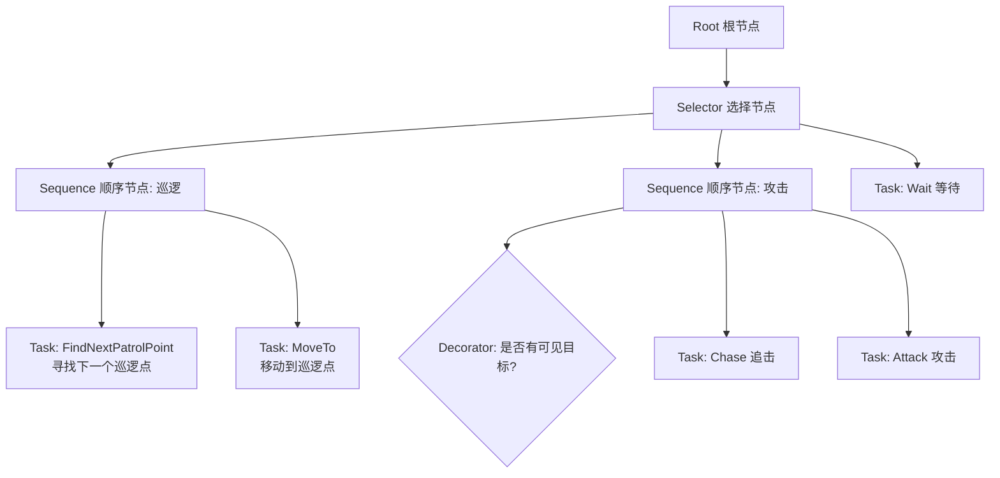
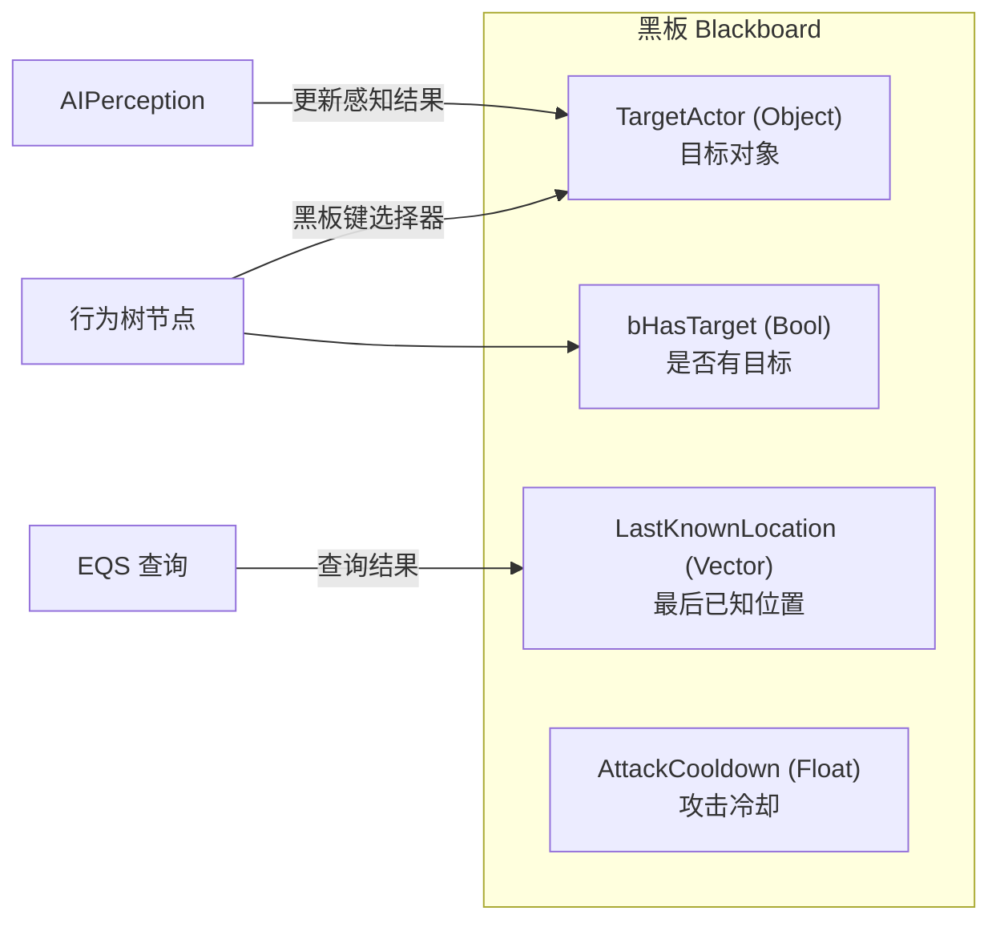
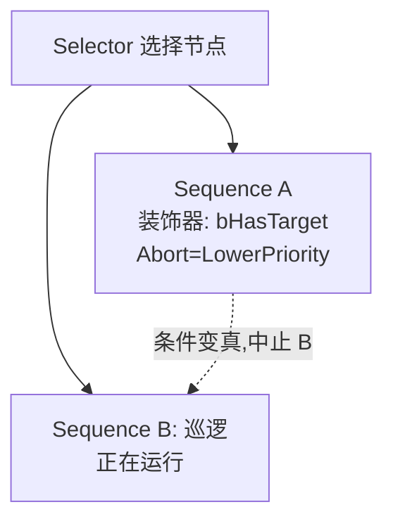
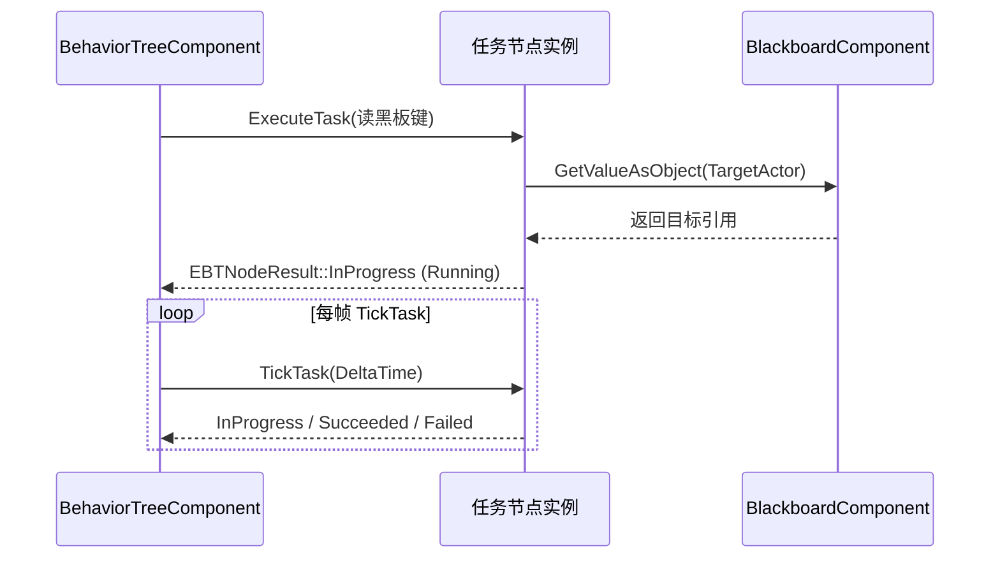
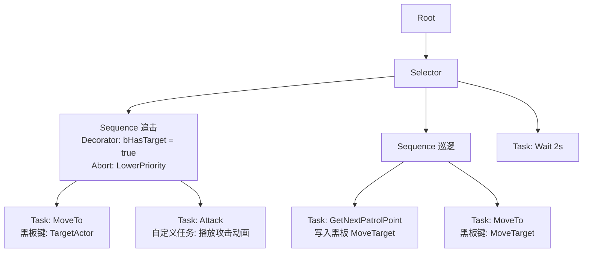

# 01 行为树详解（Behavior Tree）

## 概述

行为树（Behavior Tree，简称 BT）是虚幻引擎中游戏 AI 决策层的核心框架。它将 AI 的决策逻辑组织成一棵**树形结构**：叶子节点是具体的"动作"（Task），内部节点是控制"如何选择和执行动作"的逻辑（Composite 复合节点、Decorator 装饰器、Service 服务）。配合**黑板（Blackboard）**作为共享数据层，行为树实现了"逻辑与数据分离"的设计，让策划与程序可以协同编辑、调试 AI。

UE 从 4.x 起将行为树作为 AI 模块（AIModule）的一等公民，提供了完整的编辑器（Behavior Tree Editor）、运行时（BehaviorTreeComponent）与调试工具（Behavior Tree Debugger）。UE5 延续并增强了这一体系，行为树依然是官方推荐的决策框架，大量 Demo（如 Lyra）与商城项目都在使用。

本章内容覆盖：

- 行为树的核心概念与节点类型（复合节点、任务、装饰器、服务）；
- 节点执行流程（Tick、Abort、Restart）与黑板数据共享；
- 蓝图与 C++ 中自定义节点的完整示例；
- 行为树的调试、性能与最佳实践；
- 常见问题 FAQ。

## 核心概念（表格）

| 概念 | 英文 | 说明 |
| --- | --- | --- |
| 行为树组件 | BehaviorTreeComponent | 挂在 Pawn/Controller 上，负责运行行为树，属于 UActorComponent 子类 |
| AI 控制器 | AIController | 拥有行为树组件的控制器，`RunBehaviorTree()` 启动运行 |
| 黑板 | Blackboard | 键值对形式的数据存储，行为树各节点通过"黑板键"读写共享数据 |
| 黑板组件 | BlackboardComponent | 实际持有黑板数据的组件，提供 `GetValueAsXxx` / `SetValueAsXxx` 接口 |
| 根节点 | Root | 行为树的唯一入口，只能连接一个子节点 |
| 复合节点 | Composite | 控制子节点执行顺序的逻辑节点：选择（Selector）、顺序（Sequence）、并行（Parallel） |
| 任务节点 | Task | 叶子节点，执行实际动作（如 MoveTo、Wait、PlayAnimation），可返回成功/失败/运行中 |
| 装饰器 | Decorator | 挂在复合节点/任务上的条件判断（如"是否有目标"），可中止子树执行 |
| 服务 | Service | 挂在复合节点/任务上周期执行的逻辑（如"刷新目标位置"），不改变执行流 |
| 黑板键 | Blackboard Key | 黑板上一个具名槽位，带类型（向量、浮点、对象、枚举、类等） |
| 黑板键选择器 | Blackboard Key Selector | 节点上引用黑板键的配置字段，运行时动态解析为具体键 |
| Tick 频率 | Tick Interval | 行为树每帧（或按间隔）推进执行的机制 |
| 中止 | Abort | 装饰器条件变化时中止正在运行的子树（Lower/None/Self） |
| 黑板观察者 | BB Observer | 黑板值变化时通知行为树，用于触发装饰器重估或中止 |
| 节点实例 | Node Instance | 行为树运行时为每个节点创建的实例（BTNode 子类），保存节点运行时状态 |

## 原理详解

### 1. 行为树的结构与执行语义

行为树是一棵有向树，执行时从根节点开始，按照"深度优先、从左到右"的顺序驱动。每个节点执行后返回三种状态之一：

| 状态 | 含义 |
| --- | --- |
| `Succeeded`（成功） | 该节点代表的目标已完成 |
| `Failed`（失败） | 该节点代表的目标不可达成或条件不满足 |
| `Running`（运行中） | 该节点需要多帧才能完成，后续帧继续 tick 它 |



**执行规则**：

- **Selector（选择节点）**：从左到右执行子节点，遇到第一个 `Succeeded` 就返回成功；若所有子节点都失败则返回失败。语义是"找一件能做的事做"，常用于优先级选择（如"能攻击就攻击，否则巡逻"）。
- **Sequence（顺序节点）**：从左到右执行子节点，遇到第一个 `Failed` 就返回失败；所有子节点都成功才返回成功。语义是"按顺序完成一系列步骤"（如"先转向 → 再移动 → 再播放动画"）。
- **Parallel（并行节点）**：同时执行多个子节点，可配置完成策略（`FinishMode`：所有子节点完成 / 任一子节点完成即返回）。

> 重要：Running 状态是行为树能"多帧持续"的关键。当某任务返回 Running 后，行为树在后续帧会**继续 tick 该任务**（沿已选择的路径），直到它返回成功或失败，或被子树中止打断。

### 2. 黑板（Blackboard）—— AI 的数据中枢

黑板是一组**类型化键值对**。行为树节点通过黑板键选择器读写数据，例如"目标 Actor"、"是否看到玩家"、"攻击冷却时间"。



黑板键类型（`EBlackboardEntry` 支持的类型）：

| 类型 | C++ 枚举 | 说明 |
| --- | --- | --- |
| 布尔 | `BlackboardKeyType_Bool` | 开关类标记 |
| 整数 | `BlackboardKeyType_Int` | 计数器、枚举值 |
| 浮点 | `BlackboardKeyType_Float` | 冷却、距离、权重 |
| 字符串 | `BlackboardKeyType_String` | 名称、Tag |
| 向量 | `BlackboardKeyType_Vector` | 位置、朝向 |
| 旋转体 | `BlackboardKeyType_Rotator` | 朝向角 |
| 枚举 | `BlackboardKeyType_Enum` | 状态机值（需绑定 UENUM） |
| 类 | `BlackboardKeyType_Class` | 目标类筛选 |
| 对象 | `BlackboardKeyType_Object` | Actor/UObject 引用（可带 BaseClass 过滤） |
| 名称 | `BlackboardKeyType_Name` | FName |
| 原生指针 | `BlackboardKeyType_NativeEnum` | 原生枚举 |

**黑板键的"基本过滤/实例过滤"**：编辑器里配置黑板键时可为对象/类/枚举键设置过滤类型，运行时 `GetValueAsObject` 会返回符合过滤的值。

### 3. 装饰器（Decorator）与中止（Abort）

装饰器是挂在节点上的**条件守卫**。条件不满足时，装饰器可以：

- **阻止子节点执行**（在子节点将要启动时拦截，返回"不允许"）；
- **中止正在运行的子树**（条件在运行期间变化时，打断当前执行，让行为树重新决策）。

装饰器的 **Abort Mode**（中止模式）是行为树最核心也最易错的配置：

| 中止模式 | 英文 | 行为 |
| --- | --- | --- |
| 无 | None | 仅在被装饰节点启动前检查，运行中不重估 |
| 自身 | Self | 被装饰的子树运行中，条件失效时中止该子树 |
| 较低优先级 | Lower Priority | 该装饰器所在的"上级选择节点"中，右侧（优先级更低）的子树正在运行时，条件一旦满足就中止它们 |



黑板值变化 → 行为树的黑板观察者（BB Observer）检测到 → 触发装饰器重估 → 若满足中止条件则中止对应子树 → 行为树从根重新向下选择。这一机制让 AI 能"抢占式"地响应新情况（如突然看到敌人）。

### 4. 服务（Service）—— 周期性的"背景逻辑"

服务挂在复合节点或任务上，在其子节点运行期间**周期性执行**（可配置 Interval 与 Random Deviation），常用于：

- 刷新黑板中的目标位置（持续追踪）；
- 更新 EQS 查询结果；
- 播放脚步声、动画状态同步等副作用。

服务不返回状态，也不影响执行流，纯粹是"运行期间每 N 秒做点事"。

### 5. 节点实例化与运行机制

- 行为树资产（`UBehaviorTree`）是**可共享的模板**，多个 AI 可以同时运行同一棵行为树；
- 运行时，`UBehaviorTreeComponent` 为树中的每个节点创建**节点实例**（`UBTNode` 子类实例），实例保存每帧运行状态；
- 节点实例上的 `ExecuteTask` / `TickTask` / `OnTaskFinished` 等回调构成任务生命周期；
- 黑板组件是每个 Controller 独立的，因此不同 AI 共享树模板但拥有各自的数据。



### 6. 行为树与 AIController 的协作

```cpp
// 在 AIController 子类中启动行为树
UBehaviorTree* BTAsset = LoadObject<UBehaviorTree>(nullptr, TEXT("/Game/AI/BT_Enemy.BT_Enemy"));
if (BTAsset)
{
    RunBehaviorTree(BTAsset); // AIController 内建方法
}
```

`RunBehaviorTree` 内部会：

1. 确保 `BrainComponent`（即 BehaviorTreeComponent）已创建；
2. 通过 `UBehaviorTreeManager` 加载行为树及其关联黑板资产；
3. 初始化黑板组件（`InitializeBlackboard`），填充初始值；
4. 调用 `StartLogic()` 开始执行。

## 代码/蓝图示例

### 蓝图示例：最简"巡逻 → 追击"行为树

在 Behavior Tree 编辑器中按以下结构搭建：



步骤：

1. 新建 Blackboard 资产，添加键：`TargetActor (Object, AActor)`、`MoveTarget (Vector)`、`bHasTarget (Bool)`；
2. 新建 Behavior Tree 资产，指定该黑板；
3. 按上图连线；"追击"序列上挂 Decorator（黑板键 `bHasTarget`，`Abort = Lower Priority`）；
4. AI 控制器用 `RunBehaviorTree` 启动；
5. 运行时用 `ai.bt` 控制台命令或调试器观察节点状态（绿色=成功，红色=失败，橙色=运行中）。

### C++ 示例：自定义任务节点（BTTask 子类）

```cpp
// 头文件：BTTask_FindRandomPoint.h
#pragma once

#include "CoreMinimal.h"
#include "BehaviorTree/BTTaskNode.h"
#include "BTTask_FindRandomPoint.generated.h"

/**
 * 自定义任务：在目标点周围随机找一个可站立点，写入黑板。
 * 演示任务节点的完整生命周期：ExecuteTask -> TickTask -> FinishLatentTask。
 */
UCLASS()
class MYGAME_API UBTTask_FindRandomPoint : public UBTTaskNode
{
    GENERATED_BODY()

public:
    UBTTask_FindRandomPoint();

    /** 黑板键：圆心位置（从黑板读取） */
    UPROPERTY(EditAnywhere, Category = "Blackboard")
    FBlackboardKeySelector CenterKey;

    /** 黑板键：结果位置（写入黑板） */
    UPROPERTY(EditAnywhere, Category = "Blackboard")
    FBlackboardKeySelector ResultKey;

    /** 随机半径 */
    UPROPERTY(EditAnywhere, Category = "Config", meta = (ClampMin = "0.0"))
    float RandomRadius = 500.0f;

    /** 是否进行导航可达性检查 */
    UPROPERTY(EditAnywhere, Category = "Config")
    bool bProjectToNavigation = true;

protected:
    /** 节点首次被执行时调用；返回 Running 表示需要多帧完成 */
    virtual EBTNodeResult::Type ExecuteTask(UBehaviorTreeComponent& OwnerComp, uint8* NodeMemory) override;

    /** 每帧 tick（仅当 ExecuteTask 返回 InProgress 后才会被调用） */
    virtual void TickTask(UBehaviorTreeComponent& OwnerComp, uint8* NodeMemory, float DeltaSeconds) override;

    /** 描述节点用途，显示在编辑器里 */
    virtual FString GetStaticDescription() const override;
};
```

```cpp
// 源文件：BTTask_FindRandomPoint.cpp
#include "BTTask_FindRandomPoint.h"

#include "AIController.h"
#include "BehaviorTree/BlackboardComponent.h"
#include "BehaviorTree/Blackboard/BlackboardKeyType_Vector.h"
#include "NavigationSystem.h"

UBTTask_FindRandomPoint::UBTTask_FindRandomPoint()
{
    NodeName = TEXT("Find Random Point");          // 编辑器中的节点名
    bNotifyTick = true;                             // 声明需要 TickTask
    bCreateNodeInstance = false;                    // 默认为共享节点实例（不创建每节点实例）
}

EBTNodeResult::Type UBTTask_FindRandomPoint::ExecuteTask(UBehaviorTreeComponent& OwnerComp, uint8* NodeMemory)
{
    UBlackboardComponent* BB = OwnerComp.GetBlackboardComponent();
    if (!BB)
    {
        return EBTNodeResult::Failed;
    }

    // 1. 从黑板读取圆心
    const FVector Center = BB->GetValueAsVector(CenterKey.SelectedKeyName);

    // 2. 生成随机方向与半径
    const FVector RandomDir = FMath::VRand();
    const float Radius = FMath::FRandRange(0.0f, RandomRadius);
    FVector Result = Center + RandomDir * Radius;

    // 3. 投影到导航网格上，确保可达（演示 UNavigationSystemV1 的用法）
    if (bProjectToNavigation)
    {
        UNavigationSystemV1* NavSys = FNavigationSystem::GetCurrent<UNavigationSystemV1>(OwnerComp.GetOwner());
        if (NavSys)
        {
            FNavLocation Projected;
            const bool bFound = NavSys->ProjectPointToNavigation(Result, Projected, FVector(200.f));
            if (!bFound)
            {
                return EBTNodeResult::Failed; // 投影失败，任务失败
            }
            Result = Projected.Location;
        }
    }

    // 4. 写入黑板
    BB->SetValueAsVector(ResultKey.SelectedKeyName, Result);

    // 5. 立即完成（同步任务也可以返回 Succeeded）
    FinishLatentTask(OwnerComp, NodeMemory, EBTNodeResult::Succeeded);
    return EBTNodeResult::Succeeded;
}

void UBTTask_FindRandomPoint::TickTask(UBehaviorTreeComponent& OwnerComp, uint8* NodeMemory, float DeltaSeconds)
{
    // 本例为同步任务，用不到 TickTask；如需异步任务（如等待动画结束），
    // 可在 ExecuteTask 返回 InProgress，并在事件回调中调用 FinishLatentTask。
    Super::TickTask(OwnerComp, NodeMemory, DeltaSeconds);
}

FString UBTTask_FindRandomPoint::GetStaticDescription() const
{
    return FString::Printf(TEXT("在 %s 周围 %.1f 半径内寻找随机点，写入 %s"),
        *CenterKey.SelectedKeyName.ToString(), RandomRadius, *ResultKey.SelectedKeyName.ToString());
}
```

### C++ 示例：自定义装饰器（BTDecorator 子类）

```cpp
// BTDecorator_CheckDistance.h
#pragma once

#include "CoreMinimal.h"
#include "BehaviorTree/BTDecorator.h"
#include "BTDecorator_CheckDistance.generated.h"

/** 装饰器：目标与 AI 的距离是否小于阈值 */
UCLASS()
class MYGAME_API UBTDecorator_CheckDistance : public UBTDecorator
{
    GENERATED_BODY()

public:
    UBTDecorator_CheckDistance();

    UPROPERTY(EditAnywhere, Category = "Blackboard")
    FBlackboardKeySelector TargetKey;   // 目标 Actor 键

    UPROPERTY(EditAnywhere, Category = "Config", meta = (ClampMin = "0.0"))
    float MaxDistance = 1000.0f;

protected:
    virtual bool CalculateRawConditionValue(UBehaviorTreeComponent& OwnerComp, uint8* NodeMemory) const override;
};
```

```cpp
// BTDecorator_CheckDistance.cpp
#include "BTDecorator_CheckDistance.h"

#include "AIController.h"
#include "BehaviorTree/BlackboardComponent.h"
#include "GameFramework/Actor.h"

UBTDecorator_CheckDistance::UBTDecorator_CheckDistance()
{
    NodeName = TEXT("Check Distance < Max");
    // 允许装饰器在条件变化时中止自身或较低优先级分支
    bAllowAbortLowerPri = true;
    bAllowAbortNone = true;
    // 注意：若只想"启动前检查"，不要开启 AbortSelf；
    // 需要黑板值变化触发重估时，FlowAbortMode 会自动启用观察者。
    FlowAbortMode = EBTFlowAbortMode::LowerPriority;
}

bool UBTDecorator_CheckDistance::CalculateRawConditionValue(UBehaviorTreeComponent& OwnerComp, uint8* NodeMemory) const
{
    const UBlackboardComponent* BB = OwnerComp.GetBlackboardComponent();
    const AAIController* AIController = OwnerComp.GetAIOwner();
    if (!BB || !AIController)
    {
        return false;
    }

    const AActor* Target = Cast<AActor>(BB->GetValueAsObject(TargetKey.SelectedKeyName));
    const APawn* Pawn = AIController->GetPawn();
    if (!Target || !Pawn)
    {
        return false;
    }

    const float DistSq = FVector::DistSquared(Target->GetActorLocation(), Pawn->GetActorLocation());
    return DistSq <= MaxDistance * MaxDistance;
}
```

### C++ 示例：自定义服务（BTService 子类）

```cpp
// BTService_UpdateTargetLocation.h
#pragma once

#include "CoreMinimal.h"
#include "BehaviorTree/BTService.h"
#include "BTService_UpdateTargetLocation.generated.h"

/** 服务：周期性把目标当前位置写入黑板（跟踪移动中的目标） */
UCLASS()
class MYGAME_API UBTService_UpdateTargetLocation : public UBTService
{
    GENERATED_BODY()

public:
    UBTService_UpdateTargetLocation();

    UPROPERTY(EditAnywhere, Category = "Blackboard")
    FBlackboardKeySelector TargetKey;

    UPROPERTY(EditAnywhere, Category = "Blackboard")
    FBlackboardKeySelector LocationKey;

protected:
    virtual void TickNode(UBehaviorTreeComponent& OwnerComp, uint8* NodeMemory, float DeltaSeconds) override;
};
```

```cpp
// BTService_UpdateTargetLocation.cpp
#include "BTService_UpdateTargetLocation.h"

#include "BehaviorTree/BlackboardComponent.h"

UBTService_UpdateTargetLocation::UBTService_UpdateTargetLocation()
{
    NodeName = TEXT("Update Target Location");
    Interval = 0.2f;                 // 每 0.2 秒执行一次
    RandomDeviation = 0.05f;         // 随机抖动，避免所有 AI 同帧执行
}

void UBTService_UpdateTargetLocation::TickNode(UBehaviorTreeComponent& OwnerComp, uint8* NodeMemory, float DeltaSeconds)
{
    UBlackboardComponent* BB = OwnerComp.GetBlackboardComponent();
    if (!BB)
    {
        return;
    }

    if (const AActor* Target = Cast<AActor>(BB->GetValueAsObject(TargetKey.SelectedKeyName)))
    {
        BB->SetValueAsVector(LocationKey.SelectedKeyName, Target->GetActorLocation());
    }
}
```

## 最佳实践

1. **黑板键集中管理**：用 `UBlackboardData` 资产统一维护键定义，避免散落的魔法字符串；C++ 中可用 `FBlackboard::FKey` 缓存键 ID，避免每帧按名字查找。
2. **保持树浅而宽**：单棵树的深度建议不超过 5~6 层，过深的树难以调试；把复用逻辑抽成子树（Subtree）并用 `Run Behavior` 任务引用。
3. **正确使用 Abort 模式**：`Lower Priority` 是"抢占式"行为，开销高于 `None`；只在真正需要响应中断的场景使用，否则大量观察者会导致每帧重估开销。
4. **服务 Interval 与 RandomDeviation**：所有 AI 共用一个树模板时，务必设置随机偏差，否则 N 个 AI 会在同一帧同时执行 EQS/寻路，造成帧率尖峰。
5. **任务尽快返回**：能用同步逻辑完成的任务不要拖成异步；必须异步（等动画/等移动）时用 `FinishLatentTask` 明确收尾，防止任务悬挂。
6. **优先使用 MoveTo 的"接受半径"**：`AcceptableRadius` 设大一点（如 50~100），减少寻路器反复纠正造成的抖动。
7. **调试工具**：运行中按 ` (反引号) 打开控制台，输入 `ai.bt`（打印当前树状态）、`ai.bt 调试目标`、`BehaviorTree.Debugger` 可视化；在编辑器中用 PIE 模式 + 行为树调试器单步执行。
8. **性能**：使用 `stat AI`、`stat BehaviorTree` 查看开销；大量 AI 时考虑降低 Tick 频率（`BehaviorTreeComponent` 的 `SetComponentTickInterval`）或使用异步 EQS。

## 常见问题 FAQ

**Q1：行为树没有执行，节点一直是灰色？**
检查：① AI Controller 是否调用了 `RunBehaviorTree`；② Controller 是否 Possess 了 Pawn；③ 行为树资产是否指定了黑板；④ `ai.bt` 控制台输出是否提示资产加载失败。

**Q2：装饰器条件明明变了，为什么不中止子树？**
原因通常是 Abort Mode 配置不对：`None` 模式不会重估；`Self` 只中止自身；要抢占右侧分支必须用 `Lower Priority`。另外确认黑板键变化是通过 `SetValueAsXxx` 写入的（观察者监听的是黑板值变化），且装饰器勾选了对应的 "Abort" 开关。

**Q3：任务返回了 Running 但再也收不到 TickTask？**
检查构造函数里是否设置了 `bNotifyTick = true`；并且 `ExecuteTask` 必须返回 `EBTNodeResult::InProgress`（或在同步完成时调用 `FinishLatentTask`）。只返回 InProgress 而不调用 FinishLatentTask 会导致任务永久悬挂。

**Q4：多个 AI 共用一棵树，为什么状态互相干扰？**
行为树资产是共享模板，但**节点实例默认也是共享的**（`bCreateNodeInstance = false`）。如果节点内有非 UPROPERTY 的裸成员变量保存运行时状态，就会跨 AI 串扰。解决方案：把状态存到黑板，或设置 `bCreateNodeInstance = true` 让每个 AI 拥有独立节点实例（性能略降）。

**Q5：MoveTo 任务总是失败？**
常见原因：① 目标点在 NavMesh 之外（不可达）；② 没有设置 AI Controller 的 `SetAcceptanceRadius`；③ 缺少导航系统或 NavMesh 未烘焙；④ 移动组件被禁用。可开启导航调试（`NavMesh` 可视化 + `show Navigation`）查看可达性。

**Q6：行为树每帧 Tick 太贵怎么办？**
① 服务设置更大的 Interval + RandomDeviation；② 把低频逻辑（如 EQS）放到服务里而不是任务里循环；③ 对远处 AI 使用 `SetComponentTickInterval` 降频；④ 用 `UBehaviorTreeComponent::SetDynamicTreeTicking` 按需 tick（UE5 支持动态 tick 模式）。

**Q7：如何在 C++ 中手动启动/停止行为树？**
`AIController->RunBehaviorTree(Asset)` 启动；`AIController->GetBrainComponent()->StopLogic(TEXT("reason"))` 停止；`RestartLogic()` 重启。销毁 Controller 前调用 `Cleanup()` 释放资源。

**Q8：行为树和状态机（State Machine）怎么选？**
行为树适合"条件驱动的抢占式决策"（大多数战斗 AI）；AnimGraph 状态机管动画、GameplayAbility 管技能表现。实践中常用"行为树决策 + GameplayAbility 执行技能"的组合（如 Lyra）。

## 关联阅读

- 《02-感知系统与EQS》：感知结果写入黑板，驱动行为树分支切换；
- 《03-NavMesh寻路》：MoveTo 任务的底层实现依赖导航系统；
- UE 官方文档：Artificial Intelligence in Unreal Engine（Behavior Trees、Blackboards）；
- 源码：`Engine/Source/Runtime/AIModule/Classes/BehaviorTree/`（UBTTaskNode、UBTDecorator、UBTService、UBehaviorTreeComponent）；
- 示例工程：Lyra（`LyraGame/AI/`）、AITesting 项目、Epic Games Launcher 中的 Behavior Trees 示例。
