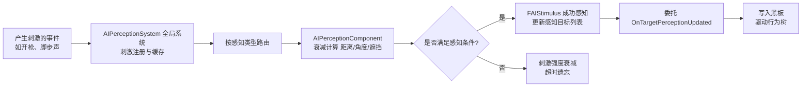
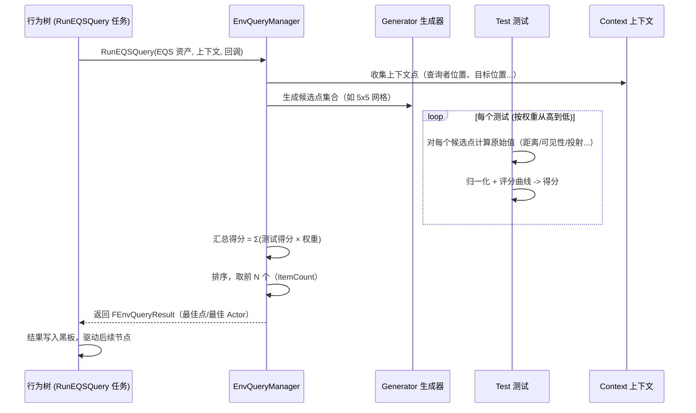
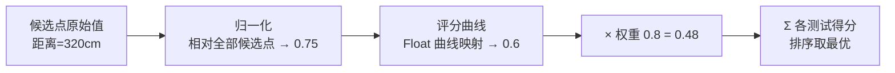
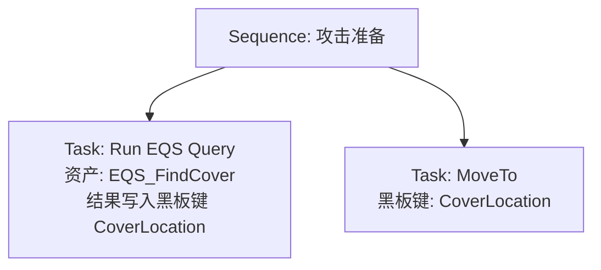

# 02 感知系统与 EQS

## 概述

感知（Perception）与 EQS（Environment Query System，环境查询系统）是 UE AI 的"感官与判断"层：

- **AIPerception**：让 AI 拥有视觉、听觉、触觉、伤害等感知能力。它通过"刺激（Stimulus）"机制工作——发声的物体、可见的 Actor 会向感知系统广播刺激，AI 的感知组件负责衰减、过滤并维护"感知到的目标"列表，结果通常写入黑板驱动行为树。
- **EQS**：环境查询系统是 UE 的"空间推理"工具。给定一个上下文（Context，如"我的位置"、"目标的位置"），EQS 会在环境中生成一批候选点（Generator），用一系列测试（Test）对每个候选点打分（Score），最终输出"最佳点"或"最佳 Actor"。典型用途：找掩体、找最佳射击位、找逃跑方向、找下一个巡逻点。

两者常协同工作：AIPerception 发现目标 → EQS 评估环境 → 行为树执行决策。

本章内容覆盖：

- 感知组件（AIPerceptionComponent）、感知配置（SensesConfig）、刺激与侦测的完整流程；
- 视觉/听觉/触觉感知的具体参数与 C++/蓝图用法；
- EQS 的生成器（Generators）、测试（Tests）、上下文（Contexts）与评分机制；
- EQS 调试（EQS Debugger、`EQS.Query` 控制台命令）；
- 最佳实践与常见问题。

## 核心概念（表格）

| 概念 | 英文 | 说明 |
| --- | --- | --- |
| 感知组件 | AIPerceptionComponent | 挂在 Pawn/AIController 上，管理多个感知配置，维护感知结果 |
| 感知配置 | UAISenseConfig | 描述某一种感知的灵敏度参数（视觉范围、听觉半径等） |
| 感知 | UAISense | 感知的"实现类"：视觉（Sight）、听觉（Hearing）、触觉（Touch）、伤害（Damage）、谓词（Prediction）、队伍（Team） |
| 刺激 | UAISenseEvent / FAIStimulus | 感知事件的载体，携带"发生位置、强度、是否被感知"等信息 |
| 刺激来源 | UAISenseConfig 的"感知器" | 产生刺激的对象（如发声的枪、可见的玩家） |
| 刺激注册器 | UAIPerceptionSystem | 全局单例，负责刺激的路由与衰减 |
| 感知结果 | FAIStimulus | 每个刺激经处理后留下的记录，含 `WasSuccessfullySensed` |
| 感知更新 | Perception Update | 感知系统按 `PerceptionTickInterval` 批量处理刺激并通知感知组件 |
| 感知监听委托 | OnTargetPerceptionUpdated | 感知组件上的事件，目标被感知/丢失时触发 |
| 遗忘 | Forget Actor | 目标离开感知范围后，刺激超时自动移除 |
| EQS | Environment Query System | 对世界进行批量查询、排序、选优的框架 |
| EQS 查询资产 | UEnvQuery | 描述一次查询的资产：生成器 + 若干测试 + 排序 |
| 上下文 | UEnvQueryContext | 查询的"锚点"：查询者的位置、目标的位置、场景点等 |
| 生成器 | UEnvQueryGenerator | 生成候选点集合（网格、环形、扇形、可到达点等） |
| 测试 | UEnvQueryTest | 对候选点逐项评估（距离、可见性、投射、点是否在导航上、追踪等） |
| 评分 | Score | 每个测试给候选点打分，按权重汇总后排序 |
| 查询运行器 | UEnvQueryManager | 全局管理查询的执行、缓存与调试 |
| 查询实例 | FEnvQueryInstance | 一次具体查询的运行时数据 |

## 原理详解

### 1. AI 感知的完整流程



详细步骤：

1. **刺激产生**：某个 Actor 发出事件（例如武器开火调用 `UAIPerceptionSystem::ReportEvent`，或实现 `UAISenseEvent` 自定义事件）；
2. **全局注册**：`UAIPerceptionSystem`（世界子系统）收集事件，按 `PerceptionTickInterval`（默认 0.25 秒）批量处理——避免每帧都广播；
3. **路由与衰减**：系统把刺激分发给所有注册了对应感知的组件；感知组件根据自身配置（如视觉范围 1500、半角 60°）计算"刺激强度"；
4. **判定**：满足条件（距离、角度、遮挡）则标记 `WasSuccessfullySensed = true`，否则只记录"检测到但未感知"（可用于"听到动静但没看到"的逻辑）；
5. **回调**：感知组件广播 `OnTargetPerceptionUpdated`，同时可通过 `GetPerceivedActors` / `GetCurrentlyPerceivedActors` 查询；
6. **遗忘**：刺激在 `ForgetStimulus` 超时后移除，目标从感知列表消失（触发"丢失目标"逻辑）。

### 2. 视觉感知（UAISense_Sight）详解

视觉感知的判定参数：

| 参数 | 说明 |
| --- | --- |
| Sight Radius | 视觉半径，超出即看不见 |
| Lose Sight Radius | 丢失半径，通常大于视觉半径，避免目标在边界抖动 |
| Peripheral Vision Angle | 周边视野半角（度），正面 0° 为正中；90° 表示半圆 |
| Affects FOV | 是否受 Pawn 朝向影响 |
| Auto Sense Range | 目标自动被感知的距离（无视 FOV，用于短距离强制感知） |
| Detection by Affiliation | 按队伍关系（我方/敌方/中立）过滤 |
| Max Age | 刺激最长存活时间，超过后遗忘 |

视觉判定的核心计算（源码 `UAISense_Sight::UpdatePerception` 简化）：

```
1. 距离检查：Dist <= SightRadius
2. 朝向检查（若 AffectsFOV）：
   视线方向与"AI->目标"方向夹角 <= PeripheralVisionAngle
3. 可见性检查：从 AI 眼睛位置（GetDefaultSightCollisionChannel /
   SightQueryChannel 指定的通道）向目标做线迹检测（LineTrace），
   若被遮挡（命中其他 Actor）则视为不可见
4. 队伍关系过滤：Affiliation 匹配才产生成功刺激
5. 命中后触发 OnTargetPerceptionUpdated
```

> 性能要点：视觉检测使用"异步/批处理"——所有 AI 的视觉迹检测在感知 tick 中统一调度，可跨帧分摊。`SightRadius` 越大、AI 越多，迹检测开销越高，应尽量把半径控制在玩法所需范围。

### 3. 听觉感知（UAISense_Hearing）与触觉/伤害感知

- **听觉（Hearing）**：`UAISense_Hearing` 监听 `ReportNoiseEvent`（或 `UAIPerceptionSystem::ReportEvent` 报告 `UAISenseEvent_Hearing`）。参数 `Hearing Range`（听觉半径）决定最大可听距离；`Lose Hearing Range` 用于遗忘。声音强度（`FAIStimulus::Strength`）可做距离衰减。听觉不要求视线，因此是"墙后预警"的常用手段。
- **触觉（Touch）**：`UAISense_Touch` 在 Actor 发生物理接触时产生刺激，用于"被碰到就警觉"。
- **伤害（Damage）**：`UAISense_Damage` 在 Actor 受伤时产生刺激，携带伤害来源，用于"挨打后反击"。
- **谓词（Prediction）**：`UAISense_Prediction` 用于预测性刺激（如"预计 2 秒后这里会有人"），常用于复杂战术 AI。
- **队伍（Team）**：`UAISense_Team` 感知同队/敌队成员的公开信息。

```cpp
// 产生一次噪声（在武器/脚步代码中调用）
#include "Perception/AIPerceptionSystem.h"
#include "Perception/AISense_Hearing.h"

UAIPerceptionSystem::ReportEvent(GetWorld(), MakeShared<FAINoiseEvent>(
    NoiseLocation,          // 噪声位置
    1.0f,                   // 强度（音量）
    NoiseMakerActor,        // 噪声来源
    NoiseTag));             // 可选的标签（用于区分脚步/枪声）
```

### 4. 感知组件挂载与配置

```cpp
// 在 AIController 构造函数中配置感知
AAController::AAController()
{
    PerceptionComponent = CreateDefaultSubobject<UAIPerceptionComponent>(TEXT("Perception"));

    // 视觉感知
    SightConfig = CreateDefaultSubobject<UAISenseConfig_Sight>(TEXT("SightConfig"));
    SightConfig->SightRadius = 1500.f;
    SightConfig->LoseSightRadius = 1800.f;
    SightConfig->PeripheralVisionAngleDegrees = 60.f;
    SightConfig->SetMaxAge(5.f);
    SightConfig->AutoSightRange = 200.f;
    SightConfig->DetectionByAffiliation.bDetectEnemies = true;
    SightConfig->DetectionByAffiliation.bDetectNeutrals = false;
    SightConfig->DetectionByAffiliation.bDetectFriendlies = false;
    PerceptionComponent->ConfigureSense(*SightConfig);

    // 听觉感知
    HearingConfig = CreateDefaultSubobject<UAISenseConfig_Hearing>(TEXT("HearingConfig"));
    HearingConfig->HearingRange = 2500.f;
    HearingConfig->SetMaxAge(10.f);
    PerceptionComponent->ConfigureSense(*HearingConfig);

    PerceptionComponent->SetDominantSense(UAISense_Sight::StaticClass());
    PerceptionComponent->OnTargetPerceptionUpdated.AddDynamic(this, &AAController::OnTargetPerceived);
}

void AAController::OnTargetPerceived(AActor* Actor, FAIStimulus Stimulus)
{
    if (Stimulus.WasSuccessfullySensed())
    {
        // 感知到目标：写入黑板
        if (UBlackboardComponent* BB = GetBlackboardComponent())
        {
            BB->SetValueAsObject(TEXT("TargetActor"), Actor);
        }
    }
    else
    {
        // 目标丢失：清空黑板（也可记录 LastKnownLocation）
    }
}
```

### 5. EQS 原理：一次查询的生命周期



**EQS 资产（UEnvQuery）结构**：

| 部分 | 作用 |
| --- | --- |
| Generator | 候选点从哪里来 |
| Contexts | 生成器/测试引用的锚点（谁的位置、目标的位置） |
| Tests | 每个测试包含：测试类型、测试目标（对哪个上下文测试）、评分模式（绝对/相对）、权重、评分曲线 |
| Query Config | 查询运行参数：`RunMode`（全部/前N个/随机）、`ItemCount`、`TimeLimit` |

### 6. EQS 生成器（Generator）

常用内置生成器：

| 生成器 | 说明 | 典型场景 |
| --- | --- | --- |
| `EnvQueryGenerator_SimpleGrid` | 以某点为中心生成矩形/圆形网格点 | 找周围可站立位置 |
| `EnvQueryGenerator_PathingGrid` | 生成**导航可达**的网格点（过滤掉不可达点） | 找附近可达掩体 |
| `EnvQueryGenerator_ProjectedPoints` | 通用投影生成器（配合数据分布） | 自定义分布 |
| `EnvQueryGenerator_Cone` | 扇形分布点 | 面向方向的散布 |
| `EnvQueryGenerator_Donut` | 环形分布（内径/外径） | 包围圈、逃跑圈 |
| `EnvQueryGenerator_CurrentLocation` | 单点（当前位置） | 做锚点 |
| `EnvQueryGenerator_ActorsOfClass` | 场景中某类 Actor 作为候选 | 找最近的掩体 Actor、弹药箱 |
| `EnvQueryGenerator_BlueprintBase` | 蓝图自定义生成器 | 完全自定义 |

### 7. EQS 测试（Test）与评分

内置测试示例：

| 测试 | 度量 | 典型用途 |
| --- | --- | --- |
| `EnvQueryTest_Distance` | 到某个上下文/点的距离 | 越近越好/越远越好 |
| `EnvQueryTest_Trace` | 两点间迹检测（是否被遮挡） | 找能看到目标的点 |
| `EnvQueryTest_Project` | 点是否在导航网格上 | 过滤不可达点 |
| `EnvQueryTest_Dot` | 向量点积（朝向一致性） | 面向目标的方向 |
| `EnvQueryTest_Pathfinding` | 寻路代价/是否可达 | 移动成本最低的点 |
| `EnvQueryTest_Overlap` | 是否有 Actor 重叠 | 排除拥挤点 |
| `EnvQueryTest_GameplayTags` | Tag 匹配 | 语义过滤 |
| `EnvQueryTest_BlueprintBase` | 蓝图自定义测试 | 完全自定义 |

**评分机制**：

1. 每个测试对每个候选点计算一个**原始值**（如距离 320 厘米）；
2. 测试的 **Scoring Equation**（评分方程）把原始值映射为分数：`Absolute`（绝对值直接使用）、`Relative`（相对所有候选点归一化到 0~1）、`Constant`（常数）等；
3. 每个测试有**权重（Weight）**，最终得分 = Σ(测试得分 × 权重)；
4. 查询按总得分排序，取前 `ItemCount` 个。



### 8. EQS 在行为树中的使用

行为树内置任务 `Run EQS Query`（`UBTTask_RunEQS`）：



配置要点：

- **Query Template**：选择 EQS 资产；
- **QueryConfig / QueryParams**：覆盖资产中的参数；
- **Blackboard Key**：结果写入哪个黑板键（对象类型可写 Actor 引用）；
- 运行时可通过 `UEnvQueryManager` 直接发起查询并绑定完成委托（异步，不阻塞行为树）。

## 代码/蓝图示例

### 蓝图示例：EQS 找掩体

1. 新建 `EQS_FindCover` 资产；
2. Generator 选择 `PathingGrid`（导航可达网格），上下文选择 `Querier`（查询者）；
3. 添加测试：
   - `Trace`：从查询者到候选点做迹检测，`bTraceFromContext = true`，要求"能击中地面"且"到目标方向不被遮挡"（用于"能看到敌人"的掩体）；
   - `Distance`：到"目标上下文（黑板中的 TargetActor）"，评分曲线设为"距离越近越好"（权重低，避免贴脸）；
   - `Dot`：与"目标方向"的点积，让掩体面朝目标；
4. 在行为树中挂 `Run EQS Query` 任务，把结果写入 `CoverLocation`；
5. 运行后用调试器查看候选点热力图（绿色=高分，红色=低分）。

### C++ 示例：自定义 EQS 测试（UEnvQueryTest 子类）

```cpp
// EnvQueryTest_IsVisibleTo.h
#pragma once

#include "CoreMinimal.h"
#include "EnvironmentQuery/EnvQueryTest.h"
#include "EnvQueryTest_IsVisibleTo.generated.h"

/**
 * 自定义测试：候选点是否对"某个上下文中的 Actor"可见（无遮挡）。
 * 演示 EQS 测试的编写套路：绑定测试数据 -> 逐点计算 -> 归一化评分。
 */
UCLASS()
class MYGAME_API UEnvQueryTest_IsVisibleTo : public UEnvQueryTest
{
    GENERATED_BODY()

public:
    UEnvQueryTest_IsVisibleTo();

    /** 观测者上下文（如：玩家的位置）。每个观测者分别判断，取"全部可见/任一可见"模式 */
    UPROPERTY(EditDefaultsOnly, Category = "Test")
    TSubclassOf<UEnvQueryContext> ObserverContext;

    /** 全部观测者都可见才算通过 */
    UPROPERTY(EditDefaultsOnly, Category = "Test")
    bool bRequireAllVisible = false;

protected:
    virtual void RunTest(FEnvQueryInstance& QueryInstance) const override;
};
```

```cpp
// EnvQueryTest_IsVisibleTo.cpp
#include "EnvQueryTest_IsVisibleTo.h"

#include "EnvironmentQuery/EnvQueryContext.h"
#include "EnvironmentQuery/Items/EnvQueryItemType_Point.h"
#include "EnvironmentQuery/EnvQueryManager.h"
#include "Engine/World.h"
#include "EngineUtils.h"

UEnvQueryTest_IsVisibleTo::UEnvQueryTest_IsVisibleTo()
{
    Cost = EEnvTestCost::Medium;               // 开销等级，影响测试排序
    ValidItemType = UEnvQueryItemType_Point::StaticClass(); // 只作用于点类型候选
    SetWorkOnFloatValues(false);               // 布尔型测试（通过/不通过）
}

void UEnvQueryTest_IsVisibleTo::RunTest(FEnvQueryInstance& QueryInstance) const
{
    // 1. 收集观测者位置
    TArray<FVector> Observers;
    if (ObserverContext)
    {
        UEnvQueryContext::ProvideLocations(ObserverContext, QueryInstance, Observers);
    }
    if (Observers.Num() == 0)
    {
        return; // 没有观测者，测试不生效
    }

    UWorld* World = QueryInstance.World;
    if (!World)
    {
        return;
    }

    // 2. 遍历候选点
    for (int32 ItemIdx = 0; ItemIdx < QueryInstance.Items.Num(); ++ItemIdx)
    {
        // 已被前置测试淘汰的点直接跳过
        if (QueryInstance.Items[ItemIdx].IsValid() == false)
        {
            continue;
        }

        const FVector Candidate = QueryInstance.GetItemAsLocation(ItemIdx);
        bool bAnyVisible = false;
        bool bAllVisible = true;

        for (const FVector& ObserverLoc : Observers)
        {
            FCollisionQueryParams Params(SCENE_QUERY_STAT(EQS_IsVisibleTo), /*bTraceComplex=*/true);
            Params.AddIgnoredActor(QueryInstance.Owner.Get());

            FHitResult Hit;
            const bool bBlocked = World->LineTraceSingleByChannel(
                Hit, ObserverLoc, Candidate, ECC_Visibility, Params);
            const bool bVisible = !bBlocked;

            bAnyVisible = bAnyVisible || bVisible;
            bAllVisible = bAllVisible && bVisible;
        }

        // 3. 按模式判定并打分（0 或 1）
        const bool bPass = bRequireAllVisible ? bAllVisible : bAnyVisible;
        QueryInstance.SetScore(ItemIdx, bPass ? 1.0f : 0.0f);
    }
}
```

### C++ 示例：自定义上下文（UEnvQueryContext 子类）

```cpp
// EnvQueryContext_BlackboardTarget.h
#pragma once

#include "CoreMinimal.h"
#include "EnvironmentQuery/EnvQueryContext.h"
#include "EnvQueryContext_BlackboardTarget.generated.h"

/** 上下文：把黑板中的 TargetActor 位置提供给 EQS */
UCLASS()
class MYGAME_API UEnvQueryContext_BlackboardTarget : public UEnvQueryContext
{
    GENERATED_BODY()

public:
    UPROPERTY(EditAnywhere, Category = "Blackboard")
    FBlackboardKeySelector TargetKey;

protected:
    virtual void ProvideContext(FEnvQueryInstance& QueryInstance, FEnvQueryContextData& ContextData) const override;
};
```

```cpp
// EnvQueryContext_BlackboardTarget.cpp
#include "EnvQueryContext_BlackboardTarget.h"

#include "BehaviorTree/BlackboardComponent.h"
#include "EnvironmentQuery/EnvQueryTypes.h"
#include "EnvironmentQuery/Items/EnvQueryItemType_Actor.h"

void UEnvQueryContext_BlackboardTarget::ProvideContext(
    FEnvQueryInstance& QueryInstance, FEnvQueryContextData& ContextData) const
{
    const UBlackboardComponent* BB = QueryInstance.Owner
        ? QueryInstance.Owner->FindComponentByClass<UBlackboardComponent>() : nullptr;
    if (!BB)
    {
        return;
    }

    if (AActor* Target = Cast<AActor>(BB->GetValueAsObject(TargetKey.SelectedKeyName)))
    {
        UEnvQueryItemType_Actor::SetContextHelper(ContextData, Target);
    }
}
```

### 蓝图/C++ 中发起 EQS 查询（异步）

```cpp
#include "EnvironmentQuery/EnvQueryManager.h"

// 在 AI Controller 中发起查询
void AAController::RequestCoverQuery()
{
    UEnvQuery* QueryTemplate = LoadObject<UEnvQuery>(nullptr, TEXT("/Game/AI/EQS_FindCover.EQS_FindCover"));
    if (!QueryTemplate)
    {
        return;
    }

    FEnvQueryRequest Request(QueryTemplate, this);
    Request.SetNamedParam(TEXT("TargetActor"), TargetActor); // 覆盖资产中的参数
    Request.Execute(EEnvQueryRunMode::AllMatching, this, &AAController::OnCoverQueryFinished);
}

void AAController::OnCoverQueryFinished(TSharedPtr<FEnvQueryResult> Result)
{
    if (Result->IsSuccessful())
    {
        const FVector BestCover = Result->GetItemAsLocation(0); // 得分最高的点
        if (UBlackboardComponent* BB = GetBlackboardComponent())
        {
            BB->SetValueAsVector(TEXT("CoverLocation"), BestCover);
        }
    }
}
```

## 最佳实践

1. **感知频率与批量**：`PerceptionTickInterval` 默认 0.25 秒已足够大多数玩法；对需要精确反应的目标（如躲避弹道）才考虑缩短。
2. **视觉半径宁小勿大**：视觉迹检测是全 AI 共享的批处理，半径过大会显著抬高开销；配合 `LoseSightRadius`（略大于 SightRadius）避免边界抖动。
3. **用听觉补足盲区**：墙后敌人"听见脚步声"比"穿墙看见"更真实，且听觉开销低。
4. **感知结果写入黑板，而不是在感知回调里直接改行为树**：保持"感知 → 数据 → 决策"的分层，便于调试与复用。
5. **EQS 测试排序**：EQS 内部按 `Cost`（开销）从低到高执行测试，把便宜的测试（Distance、Project）放前面，昂贵的（Trace、Pathfinding）放后面，让大量候选点提前淘汰。
6. **限制候选点数量**：`SimpleGrid` 的 `GridSize`（如 5×5=25 点）足够；每多一维点数爆炸式增长。PathingGrid 点数建议 ≤ 100。
7. **善用查询缓存**：`UEnvQueryManager` 支持相同参数的查询复用结果（`bUseCache`），对"多个 AI 查询同一目标"的场景收益巨大。
8. **调试工具**：EQS Debugger（编辑器 → 工具 → Debugger → EQS）；控制台 `EQS.Query`（打印最近查询）、`EQS.Debugger`；候选点热力图（绿高红低）排查"为什么选了那个点"。
9. **避免每帧查询**：EQS 单次查询可能跨多帧（异步），不要在 Tick 里反复发起；用服务 + Interval 控制频率。

## 常见问题 FAQ

**Q1：AI 看不到玩家，感知回调不触发？**
依次检查：① 感知组件挂在 Controller 还是 Pawn 上（保持一致）；② `DetectionByAffiliation` 是否允许检测敌方（默认对中立/友军可能为 false）；③ 玩家是否有可被检测的碰撞体，且视觉迹检测通道（SightQueryChannel，默认 Visibility）正确；④ `MaxAge` 是否过短导致刺激被遗忘；⑤ 目标是否实现了 `IAIPerceptionListener` 之外的必要接口（一般不需要）。

**Q2：感知到了但行为树没反应？**
感知回调里是否写了黑板？黑板键类型是否匹配（Object vs Vector）？装饰器的 Abort Mode 是否允许抢占？——三层逐一排查。

**Q3：EQS 查询结果总是第一个点 / 排序不对？**
检查每个测试的评分模式：`Relative` 需要候选点集合有意义（点数太少时归一化失真）；`ScoreEquation` 的曲线是否反向（想"越近越好"却配了递增曲线）；权重是否为 0（被忽略）；`ItemCount` 是否大于 1 导致取了非最优。

**Q4：EQS 查询很卡？**
候选点过多 + 昂贵测试（Pathfinding/大量 Trace）+ 无缓存 + 多 AI 同时查询。对策：减小网格、测试按开销排序、开启缓存、给服务加随机偏差错峰。

**Q5：Trace 测试把点全部淘汰了？**
常见于迹检测起点/终点设置错误（`bTraceFromContext` 方向反了）、碰撞通道不对（地面是 WorldStatic 但测试用的通道是 Pawn）、或候选点本身在地面以下。开启 EQS 调试器的迹线可视化逐点检查。

**Q6：感知组件怎么获取当前感知到的目标列表？**
`UAIPerceptionComponent::GetPerceivedActors(SenseToUse, OutActors)`（含最近一次成功感知的）与 `GetCurrentlyPerceivedActors`（当前仍在感知中的）。蓝图中用 `Get Perceived Actors` 节点。

**Q7：自定义感知（如"闻到气味"）怎么做？**
继承 `UAISense` + 实现 `UAISenseEvent`，在感知组件 `ConfigureSense` 注册自定义 `UAISenseConfig` 子类；然后通过 `UAIPerceptionSystem::ReportEvent` 报告事件。参考源码 `UAISense_Touch` 的实现（最简单的感知类型）。

**Q8：EQS 蓝图中怎么把结果给行为树用？**
`Run EQS Query` 任务的 `Blackboard Key` 选择目标键；或者用 `Find EQS Query Results` 蓝图节点在事件中接收 `FEnvQueryResult`。

## 关联阅读

- 《01-行为树详解》：感知与 EQS 的结果通过黑板驱动行为树；
- 《03-NavMesh寻路》：EQS 的 PathingGrid 与 Pathfinding 测试依赖导航系统；
- UE 官方文档：AI Perception（感知）、Environment Query System；
- 源码：`Engine/Source/Runtime/AIModule/Classes/Perception/` 与 `EnvironmentQuery/`；
- 示例：Lyra 中的感知与 EQS 配置、AITesting 工程、Epic 官方 EQS 教程（EQS 掩体查询）。
