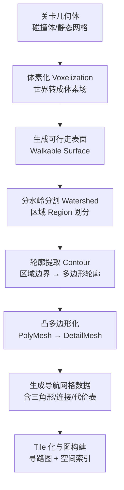
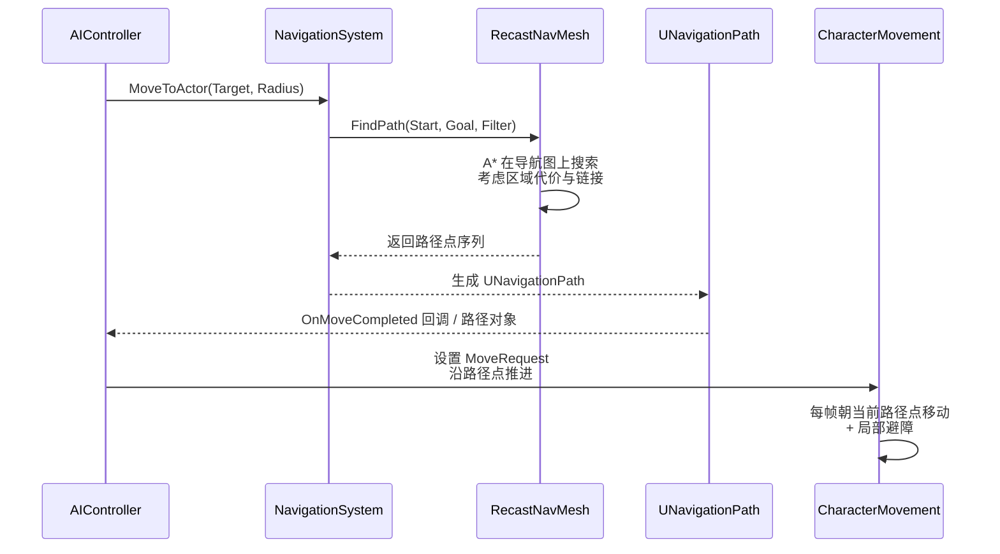
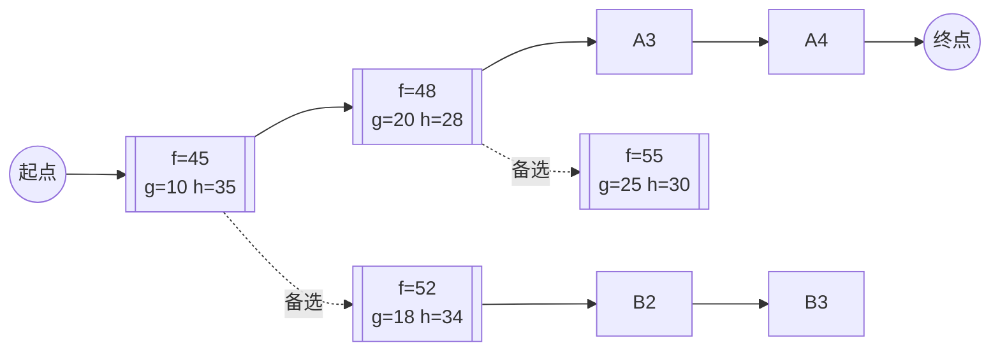
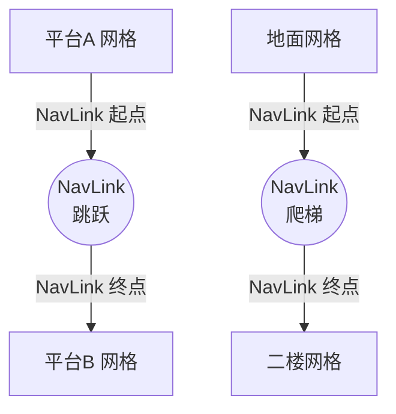
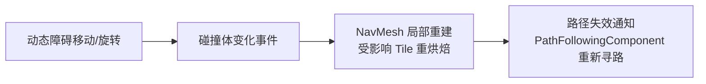
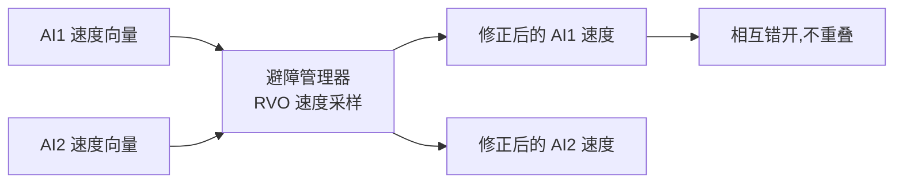

# 03 NavMesh 寻路

## 概述

NavMesh（Navigation Mesh，导航网格）是虚幻引擎 AI 移动层的核心基础设施。它把关卡地面抽象成一张**凸多边形网格图**，AI 的移动（MoveTo）通过在这张图上运行 A*（A-Star）寻路算法获得路径，再沿路径点移动，配合避障（Avoidance）与动态导航（NavLink、Dynamic Obstacle）实现真实、流畅的群体移动。

UE 的导航系统由 `NavigationSystem`（导航系统模块）、`NavMesh`（导航数据）、`NavMeshBoundsVolume`（边界体积）、`NavLinkProxy`（链接代理）、`UNavigationPath`（路径对象）与 `UCharacterMovementComponent` 的移动逻辑共同组成。UE5 延续了 UE4 的架构，并强化了 Navmesh 分区（Partition）、数据压缩与流送（Streaming）支持。

本章内容覆盖：

- NavMesh 的生成原理（体素化 → 分水岭 → 区域 → 多边形 → 轮廓 → 网格）；
- 导航系统的数据流（查询 → 路径 → 移动 → 避障）；
- A* 算法原理及其在 NavMesh 上的应用；
- NavLinkProxy 与动态寻路（Dynamic Obstacle、NavLink 运行时开关）；
- 避障系统（RVO/局部避障）的原理与配置；
- 性能优化要点（分区、增量烘焙、分层、流送）；
- 常见问题 FAQ。

## 核心概念（表格）

| 概念 | 英文 | 说明 |
| --- | --- | --- |
| 导航网格 | NavMesh / RecastNavMesh | 从关卡几何体烘焙出的凸多边形寻路网格（数据资产） |
| 导航系统 | UNavigationSystemV1 | 世界级子系统，管理导航数据、查询与避障 |
| 导航边界体积 | ANavMeshBoundsVolume | 场景中划定"哪些区域参与烘焙"的体积 |
| 烘焙 | Build / Bake | 把几何体转成 NavMesh 的离线（或运行时）过程 |
| 导航代理 | NavAgent | 代理参数（半径/高度/最大坡度/步高），不同体型可拥有不同 NavMesh |
| 导航查询过滤器 | FNavigationQueryFilter | 查询时的代价过滤器（区域代价、跳过链接等） |
| 导航区域 | UNavArea | 标记网格区域类型（默认/水域/楼梯），可设定寻路代价倍率 |
| 导航链接 | NavLink | 网格间的连接（跳跃、爬梯、跳崖），可定义起点/终点与方向 |
| 链接代理 | ANavLinkProxy | 场景中的 NavLink 载体，支持 SmartLink 动态开关 |
| 导航路径 | UNavigationPath | 一次寻路的结果：一串路径点 + 状态 |
| 动态障碍 | Dynamic Obstacle | 运行时移动/删除的碰撞体，使 NavMesh 局部失效 |
| 避障 | Avoidance | 移动中的局部避让（RVO 近似），避免 AI 互相重叠 |
| A* | A-Star | 图搜索算法，用 f = g + h 代价函数找最优路径 |
| 寻路器 | AIController / MoveTo | `MoveToActor` / `MoveToLocation` 发起寻路与移动 |
| 导航网格生成器 | FRecastNavMeshGenerator | 执行烘焙的底层模块（基于 Recast/Detour 库） |
| 分区 | Navmesh Partition | UE5 将大 NavMesh 拆分为多个分区（Tiles/Octree）便于增量更新与流送 |
| 路径走廊 | Path Corridor | 路径点之间的可行走廊，移动组件沿走廊平滑移动 |

## 原理详解

### 1. NavMesh 烘焙原理（离线生成）

UE 的 NavMesh 烘焙基于开源库 **Recast & Detour**（由 Mikko Mononen 开发，UE 自 4.x 起集成）。烘焙流程：



关键步骤说明：

1. **体素化**：把关卡几何体按 `CellSize`（水平精度，默认 19~25 厘米）与 `CellHeight`（垂直精度，默认 10 厘米左右）切成体素；
2. **可行走判定**：体素顶面坡度 ≤ `AgentMaxSlope`（最大坡度，默认 44°）、高度差 ≤ `AgentMaxStepHeight`（最大步高，默认 45 厘米）、且下方有支撑（`WalkableHeight` 内无阻挡）的体素标记为可行走；
3. **区域分割**：用分水岭算法把可行走体素连成连通区域；
4. **轮廓与多边形**：把区域边界简化为轮廓，再三角化/凸化生成导航多边形；
5. **构建图**：相邻多边形形成节点边，加上区域（NavArea）代价与链接（NavLink），构成寻路图。

**代理参数（NavAgentProperties）**：

| 参数 | 默认值（Character） | 说明 |
| --- | --- | --- |
| Agent Radius | 34 | 代理半径，决定走廊宽度 |
| Agent Height | 144 | 代理高度，决定头顶净空 |
| Step Height | 45 | 能迈上的台阶高度 |
| Max Slope | 44° | 能行走的最大坡度 |
| NavMesh 生成精度 | Medium | 影响烘焙时间与内存 |

> 同一关卡可配置多个代理（如人形 + 载具），分别为它们烘焙独立的 NavMesh 图层（Layer）。

### 2. 寻路数据流：从 MoveTo 到移动



**路径查找请求（FPathFindingQuery）** 的关键输入：

- 起点/终点（会被投影到 NavMesh 上，`ProjectPointToNavigation`）；
- `FSharedConstNavQueryFilter`：代价过滤器，可动态调整区域代价（如"绕开水域"）；
- `NavAgentProperties`：代理参数，选择对应的 NavMesh 图层；
- 可选：`AllowPartialPaths`（允许部分路径，目标不可达时走到最近点）。

### 3. A* 算法原理

A* 是启发式图搜索算法，在 NavMesh 上以**多边形**为节点、多边形邻接为边进行搜索：

**代价函数**：

```
f(n) = g(n) + h(n)

g(n) = 从起点到节点 n 的实际代价（沿边走，累加边长 × 区域代价倍率）
h(n) = 从节点 n 到终点的启发式估计（通常用欧氏距离，保证可采纳性）
```

**算法步骤**：

1. 把起点所在多边形放入开放集（Open Set），`g=0`；
2. 循环：取出开放集中 `f` 值最小的节点 `n`（用小顶堆维护）；
3. 若 `n` 是终点多边形，回溯父指针得到路径，结束；
4. 对 `n` 的每个邻居 `m`：计算 `g(m) = g(n) + cost(n→m)`；若 `g(m)` 优于 `m` 已知的 `g`，更新 `m` 的父指针与 `f` 值，加入开放集；
5. 开放集为空仍未到达终点 → 失败（或返回部分路径）。



> 图中每次从开放集取出 f 最小的节点扩展；启发式 h 越接近真实代价，搜索越高效。若 h=0，A* 退化为 Dijkstra；若 h 过大（高估），则可能找不到最优解。

**在 NavMesh 上的实现细节**：

- 节点是导航多边形，边是共享边（含 NavLink 连接的虚拟边）；
- 代价 = 距离 × `AreaCost`（区域代价）+ 链接额外代价；
- 搜索过程中用"边中点 + 漏斗算法（Simple Stupid Funnel）"生成**走廊**与最终路径点序列；
- `FNavMeshPath` 保存走廊多边形，`UNavigationPath` 提供平滑后的路径点。

### 4. NavLink 与 NavLinkProxy（动态连接）

NavLink 解决"网格断口"问题：跳跃、爬梯、跳崖、开门等场景，物理上不连续的表面通过链接相连。



**要点**：

- `ANavLinkProxy` 放在场景中，设置 `Point Links`（起点/终点）与 `Smart Link`（动态控制）；
- **SmartLink**：运行时可通过 `SetSmartLinkEnabled(false)` 关闭链接（如"桥断了"、"门锁了"），AI 会立即重新寻路；
- `NavLink` 可以指定方向性（单向/双向）、代价倍率与使用条件（如"只能跳跃链接"）；
- 当 AI 走到链接起点时，触发 `OnSmartLinkReached` 委托，可在此播放跳跃动画并调用 `ResumePathFollowing`；
- C++ 侧对应 `UNavLinkDefinition` 数据资产与 `ANavLinkProxy`。

```cpp
// 运行时开关 SmartLink 的示例（如开门/断桥）
ANavLinkProxy* Link = ...; // 场景中的链接代理
Link->SetSmartLinkEnabled(bBridgeIntact); // false 时该链接不可用
```

### 5. 动态寻路（Dynamic Obstacle）与导航更新

**Dynamic Obstacle 组件**：挂在可移动障碍物（箱子、车辆、门）上，碰撞体变化时通知导航系统局部更新：



- 开销：局部 Tile 重建比全量烘焙便宜得多（UE5 分区特性使其成为可能）；
- 替代方案：`NavMeshModifier`（修改 NavArea）、运行时 `SetDynamicObstacle`、或者干脆用避障而不是改网格（成本更低）。

**运行时全量烘焙**：`UNavigationSystemV1::Build()`（`nav build` 控制台命令）可在 PIE 中重建，代价高，仅用于调试或小型关卡。

### 6. 避障（Avoidance）

UE 的避障基于 **RVO（Reciprocal Velocity Obstacles）近似** 的局部避让算法，由 `UCharacterMovementComponent` 的避障模块（`FAvoidanceManager`）实现：

- 开启方式：移动组件上勾选 `Enable Avoidance`，设置 `AvoidanceConsiderationRadius`、`AvoidanceUID`、`AvoidanceGroup` / `GroupsToAvoid` / `GroupsToIgnore`；
- 原理：每个避障代理周期性采样周围代理的速度，计算避免碰撞的速度修正量；**相互**避让（reciprocal），避免"挤成一团"；
- 局限：避障是"局部"的，只能避动态物体，不能绕静态障碍（那是寻路的事）；走廊过窄时避障可能抖动。



### 7. UE5 特性：NavMesh 分区（Partition）与流送

UE5 对导航系统做了多项增强：

- **Tile 分区（Navmesh Partition）**：NavMesh 按 Tile 组织（`TileSizeUU`，默认约 1024 UE 单位），支持**增量更新**——只重建受影响 Tile；
- **八叉树空间索引**：大世界下快速定位 Tile 与查询；
- **数据压缩**：烘焙数据支持压缩（`bUseVoxelCache`、`bCompressTileData` 等），降低内存；
- **与 World Partition 集成**：NavMeshBoundsVolume 可随关卡流送；`Runtime Generation` 支持 `Dynamic`（运行时按需生成）；
- **分层导航（Hierarchical）**：`bUseHierarchicalNavigation` 开启分层导航，远处用粗粒度图、近处用细粒度图，显著降低长距离寻路开销；
- 注意：分区是引擎内部实现细节，日常开发主要关注"增量烘焙是否开启、运行时生成模式（Static/Dynamic）"。

## 代码/蓝图示例

### 蓝图示例：AI 移动到目标

1. 场景中放置 `NavMeshBoundsVolume`，缩放覆盖整个可玩区域，按 `P`（Build）烘焙（或 Build 菜单 → Build Navigation）；
2. 添加 `NavLinkProxy` 连接两个平台，勾选 Smart Link；
3. AIController 中使用 `Move to Actor` / `Move to Location` 节点：

```
[Event BeginPlay] → [Move to Actor(目标, 接受半径=80)] → [On Success / On Fail 分支]
```

4. 运行时按 `` ` `` 打开控制台输入 `show Navigation` 查看网格；`nav` 系列命令调试。

### C++ 示例：自定义导航区域（UNavArea 子类）与代价过滤

```cpp
// NavArea_Swamp.h —— 沼泽区域，代价昂贵，AI 绕行
#pragma once

#include "CoreMinimal.h"
#include "NavAreas/NavArea.h"
#include "NavArea_Swamp.generated.h"

/** 沼泽：行走代价 × 3，除非查询过滤器特别允许 */
UCLASS()
class MYGAME_API UNavArea_Swamp : public UNavArea
{
    GENERATED_BODY()

public:
    UNavArea_Swamp()
    {
        // 默认区域代价倍率（相对 Default 的 1.0）
        DefaultCost = 3.0f;
        FixedAreaEnteringCost = 10.0f; // 进入该区域的固定附加代价
        // 可以在行为树/查询中通过过滤器覆盖
        bIsMetaNavArea = false;
    }
};
```

```cpp
// 查询过滤器：允许"沼泽蹚水者"忽略沼泽代价
FNavQueryFilter CreateSwampTolerantFilter(const UNavigationSystemV1* NavSys)
{
    FSharedConstNavQueryFilter Filter = NavSys
        ? UNavigationQueryFilter::GetQueryFilter(*NavSys, nullptr, UNavigationQueryFilter::StaticClass())
        : FSharedConstNavQueryFilter();

    // 把沼泽区域代价调回 1.0（等于普通地面）
    Filter->SetAreaCost(UNavArea_Swamp::StaticClass(), 1.0f);
    return Filter;
}
```

### C++ 示例：MoveTo 与路径跟随（AIController）

```cpp
// 在 AIController 中发起寻路并处理结果
void AAController::MoveToTarget(AActor* Target)
{
    if (!Target)
    {
        return;
    }

    // 1. 发起移动请求（内部执行寻路 + 路径跟随）
    FPathFollowingRequestResult Result = MoveToActor(
        Target,
        /*AcceptanceRadius=*/80.0f,
        /*bStopOnOverlap=*/false,
        /*bUsePathfinding=*/true,
        /*bCanStrafe=*/true);

    // 2. 注册完成回调（也可以绑定 OnMoveCompleted 委托）
    if (Result.Code == EPathFollowingRequestResult::RequestSuccessful)
    {
        GetPathFollowingComponent()->OnRequestFinished.AddUObject(this, &AAController::OnMoveFinished);
    }
}

void AAController::OnMoveFinished(FAIRequestID RequestID, const FPathFollowingResult& Result)
{
    if (Result.IsSuccess())
    {
        // 到达：触发后续行为（如攻击）
    }
    else
    {
        // 失败：可能目标不可达，写黑板通知行为树换方案
        UE_LOG(LogTemp, Warning, TEXT("MoveTo failed: %d"), (int32)Result.Code); // EPathFollowingResult 非 UENUM，按整型输出
    }
}
```

### C++ 示例：异步寻路查询（不移动，只求路径）

```cpp
#include "NavigationSystem.h"
#include "Navigation/PathFollowingComponent.h"

void AMyActor::QueryPathAsync(const FVector& Goal)
{
    UNavigationSystemV1* NavSys = FNavigationSystem::GetCurrent<UNavigationSystemV1>(GetWorld());
    if (!NavSys)
    {
        return;
    }

    FPathFindingQuery Query(this, *NavSys->GetDefaultNavDataInstance(), GetActorLocation(), Goal);
    // 异步查找：结果通过回调返回，不阻塞游戏线程
    FNavPathQueryDelegate Delegate;
    Delegate.BindUObject(this, &AMyActor::OnPathFound);
    FPathFindingResult Result = NavSys->FindPathSync(Query); // 5.8 同步寻路 API；异步可基于 FPathFindingQuery 自行封装
}

void AMyActor::OnPathFound(uint32 RequestID, ENavigationQueryResult::Type Result, FNavPathSharedPtr NavPath)
{
    if (Result == ENavigationQueryResult::Success && NavPath.IsValid())
    {
        const TArray<FNavPathPoint>& Points = NavPath->GetPathPoints();
        // Points 即路径点序列，可用于绘制调试线或自定义移动
        for (const FNavPathPoint& P : Points)
        {
            DrawDebugSphere(GetWorld(), P.Location, 20.f, 8, FColor::Green, /*bPersistent=*/true);
        }
    }
}
```

### C++ 示例：自定义 BT 任务"跳到 NavLink 对面"（配合 SmartLink）

```cpp
// BTTask_JumpNavLink.h（节选）
UCLASS()
class MYGAME_API UBTTask_JumpNavLink : public UBTTaskNode
{
    GENERATED_BODY()

protected:
    virtual EBTNodeResult::Type ExecuteTask(UBehaviorTreeComponent& OwnerComp, uint8* NodeMemory) override;

    UFUNCTION()
    void OnLinkReached(AActor* MovingActor, const FVector& DestinationPoint);
};

// 实现（节选）
EBTNodeResult::Type UBTTask_JumpNavLink::ExecuteTask(UBehaviorTreeComponent& OwnerComp, uint8* NodeMemory)
{
    // 实际项目中：监听 NavLinkProxy 的 OnSmartLinkReached 委托，
    // 播放跳跃动画后调用 ResumePathFollowing 继续沿路径移动。
    AAIController* AIC = OwnerComp.GetAIOwner();
    if (AIC && AIC->GetPathFollowingComponent())
    {
        NavLinkProxy->OnSmartLinkReached.AddDynamic(this, &UBTTask_JumpNavLink::OnLinkReached); // FSmartLinkReachedSignature
        return EBTNodeResult::InProgress; // 等待链接事件
    }
    return EBTNodeResult::Failed;
}

void UBTTask_JumpNavLink::OnLinkReached(AActor* MovingActor, const FVector& DestinationPoint)
{
    // 触发跳跃动画（如 PlayMontage），动画结束后调用：
    // GetPathFollowingComponent()->ResumePathFollowing();
    // 并通过 FinishLatentTask 完成行为树任务。
}
```

## 最佳实践

1. **烘焙前用代理参数检查关卡**：`NavMeshBoundsVolume` 覆盖范围宁大勿小（但要排除不可达区域，减少烘焙量）；台阶高于 `Step Height`、坡度过陡的区域会自然不可走——这是设计特性，不是 Bug。
2. **多代理分层**：人形与载具分开烘焙（不同 Agent Radius），用 `NavAgentSelector` 指定每个 Actor 用哪一层。
3. **区域代价做"偏好"而不是"禁止"**：沼泽、水坑用 `NavArea` + 代价倍率让 AI 绕行；必须禁止的区域（深水、火海）用 `NavMeshModifier` 设为 `NonWalkable`。
4. **动态障碍优先用避障**：临时避让用 Avoidance；只有"长期结构性变化"（门开了、桥断了）才用 Dynamic Obstacle 或 NavLink 开关。
5. **SmartLink 统一管理可开关通道**：所有"可被玩家关闭的通道"（门、桥、机关）用一个 Manager 管理 NavLink 的 `SetSmartLinkEnabled`，避免散落各处。
6. **性能优化清单**：
   - 开启 `bUseHierarchicalNavigation`（分层导航）减少长距离搜索开销；
   - 保证 Tile 分区 + 增量烘焙开启（默认），避免运行时全量 `nav build`；
   - 降低 `TickInterval`：`AIController` 与 `PathFollowingComponent` 的 tick 频率可下调（非战斗 AI 0.1~0.2 秒）；
   - 用 `stat Navigation`、`stat AI`、`stat RHI` 定位瓶颈；
   - 大量 AI 时用 EQS 的 PathingGrid + 查询缓存减少重复寻路；
   - 避障代理数量控制在必要范围（`AvoidanceUID` 数量上限内），否则避障本身成为瓶颈。
7. **路径可视化**：`show Navigation`（网格）、`ai.debug.DrawPaths`（5.8 路径绘制 CVar；旧 `show NavPaths` 已移除）、`ai.debug` 系列命令；运行时绘制 `UNavigationPath` 便于排查"为什么走这条路"。
8. **流送关卡**：NavMeshBoundsVolume 与关卡绑定，注意 `Runtime Generation` 设为 `Dynamic` 或按需生成，避免流送后无网格。

## 常见问题 FAQ

**Q1：烘焙后没有网格 / AI 不动？**
检查：① 是否放置了 NavMeshBoundsVolume 并覆盖目标区域；② 是否按 Build 按钮烘焙（或 `nav build`）；③ 地板碰撞是否开启（NavMesh 依赖碰撞几何）；④ 代理半径是否大于走廊宽度；⑤ `show Navigation` 是否显示网格。

**Q2：AI 走直线穿墙 / 不绕障碍？**
多半是网格与视觉不一致：障碍物碰撞关闭、烘焙后修改了关卡、或 `NavMeshModifier` 设置错误。重新烘焙 + `show Navigation` 对比。

**Q3：目标在网格外（如楼上阳台），MoveTo 一直失败？**
用 NavLink 连接阳台；或在 MoveTo 前把目标点 `ProjectPointToNavigation` 投影。`AllowPartialPaths` 可让 AI 至少走到最近可达点。

**Q4：AI 到达目标点附近反复抖动？**
`AcceptanceRadius` 太小 + 目标点在网格边缘。调大接受半径（50~100），或把目标点投影到网格内部，或给移动组件开启 `bAllowPhysicsRotationDuringAnimRootMotion` 等平滑选项。

**Q5：运行时改了障碍物，AI 仍然穿过去？**
动态障碍物需要挂 `DynamicObstacle` 组件（或手动调用 `UNavigationSystemV1::OnNavigationGenerationFinished` 相关更新）；纯避障只能避 AI 之间，不能避静态几何。结构性变化建议用 NavLink/NavModifier 而非改网格。

**Q6：大量 AI 一起移动很卡？**
优先：降低 tick 频率、开启分层导航、用避障而非动态障碍、减少 EQS 查询、路径复用（多 AI 到同一目标共享路径）。用 `stat Navigation` 确认瓶颈在寻路还是避障。

**Q7：NavLink 跳跃动作不播放？**
SmartLink 需要监听 `OnSmartLinkReached` 并调用 `ResumePathFollowing`；确认链接方向（单向/双向）、`bUseSmartLink` 勾选、以及 AI 的 `NavAgentSelector` 包含该链接类型。

**Q8：世界大、烘焙慢、内存高？**
使用 Tile 分区（默认）避免整体重烘焙；缩小 `CellSize` 只对需要精细走廊的区域；开启 `bCompressTileData`；把无关区域从 BoundsVolume 排除；必要时用 `Runtime Generation = Dynamic` 按需生成。

**Q9：A* 与"看起来最优"不符？**
NavMesh 寻路是"多边形粒度"的最优，受网格精度、区域代价、链接代价影响；走廊窄、体素粗会导致绕远。提高烘焙精度（`CellSize` 调小）或调整区域代价即可。

## 关联阅读

- 《01-行为树详解》：MoveTo 任务（BTTask_MoveTo）把导航能力接入行为树；
- 《02-感知系统与EQS》：EQS 的 PathingGrid/Pathfinding 测试依赖 NavMesh；
- UE 官方文档：Navigation System、RecastNavMesh、NavLinkProxy；
- 源码：`Engine/Source/Runtime/NavigationSystem/`（UNavigationSystemV1、ARecastNavMesh、ANavLinkProxy）、`Engine/Source/Runtime/AIModule/Classes/Navigation/`（PathFollowingComponent、AvoidanceManager）；
- 延伸阅读：Recast/Detour 开源库文档（体素化、分水岭、漏斗算法）、《游戏编程精粹》寻路章节、GDC 关于大规模 AI 导航的演讲。
