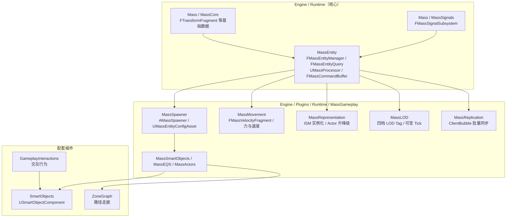
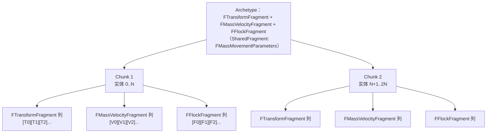
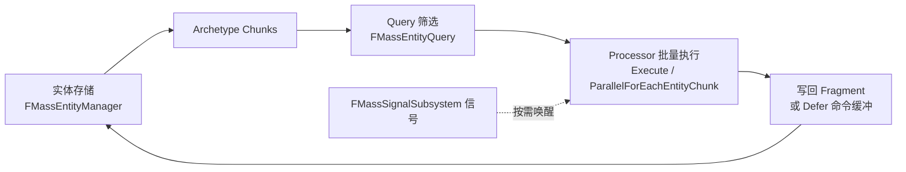
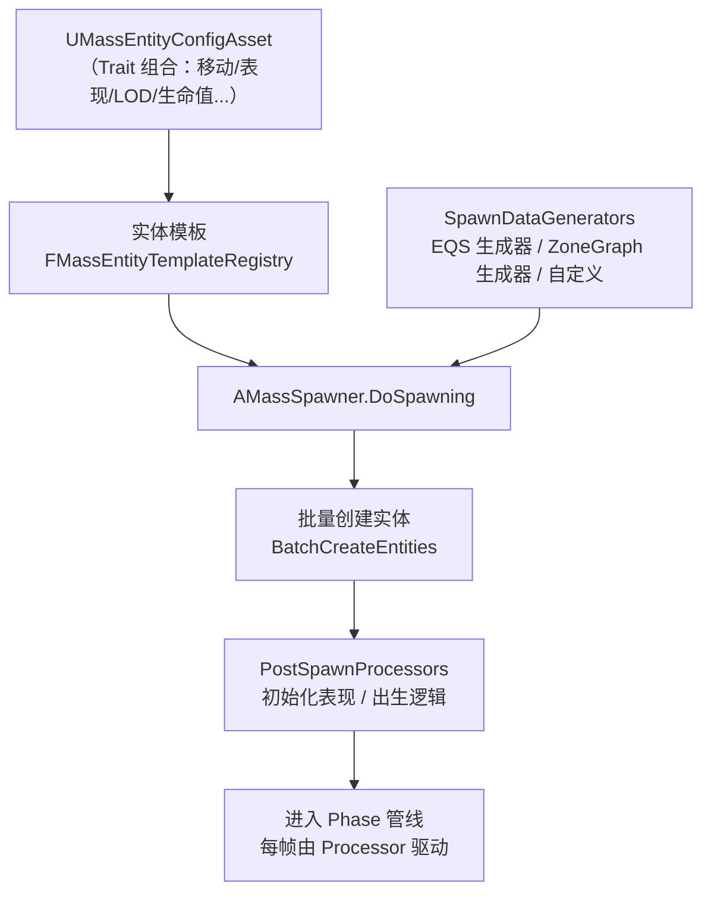
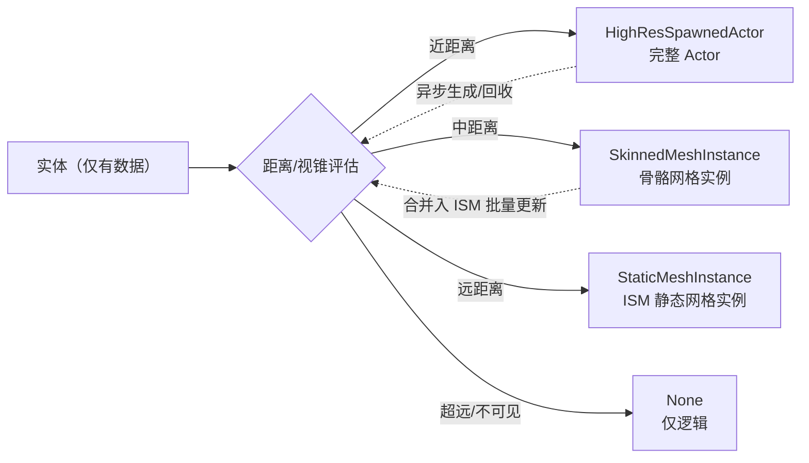

# 04 Mass 实体框架与群集模拟（Mass Entity Framework & Crowd Simulation）
> 版本基准：UE 5.8.0（本机 `Engine/Build/Build.version`：CL 55116800，分支 `++UE5+Release-5.8`）。
> 兼容性边界：适用于 UE5.8 编辑器/运行时，UE4.27 与早期 UE5 仅作迁移背景，具体模块以正文为准。
> 官方参考：[Unreal Engine UE5.8 官方文档总页](https://dev.epicgames.com/documentation/en-us/unreal-engine)。
> 最后更新：2026-08-06（本轮元数据维护）。

## 概述

Mass 是虚幻引擎 5 中面向"超大规模实体模拟"的数据驱动框架，专为鸟群、鱼群、人群、军队、车流等**成百上千乃至数万实体**的场景设计。它抛弃了"每个对象一个 Actor + 组件"的传统对象模型，改用 **ECS（Entity-Component-System，实体-组件-系统）** 思路：实体只是一串紧凑的数据，逻辑按"数据形态"批量执行，从而在内存访问与 CPU 利用率上获得数量级提升。

在本机 UE 5.8 源码中，Mass 生态由三部分组成：

- **MassEntity 核心**（`Engine/Source/Runtime/MassEntity` 与 `Engine/Source/Runtime/Mass`）：实体存储、Fragment/Tag、Archetype/Chunk、Query、Processor、命令缓冲与信号机制；
- **MassGameplay 插件集**（`Engine/Plugins/Runtime/MassGameplay`）：MassSpawner（生成）、MassRepresentation（表现）、MassLOD（细节层次）、MassMovement（移动）、MassCommon（公共数据）、MassReplication（网络同步）、MassSimulation（模拟编排）、MassSmartObjects（智能对象集成）、MassEQS（环境查询）、MassActors（Actor 桥接）、MassCharacterTrajectory、MassGameplayDebug 等模块；
- **配套插件**：SmartObjects（智能对象）、GameplayInteractions（交互行为）、ZoneGraph（路径走廊）等。

Mass 并不取代传统 AI：行为树 / 感知 / EQS / NavMesh（见本分类 01~03）适合"少数精英个体"的精细决策，Mass 适合"数量巨大的群体"的模拟。二者可以共存：Mass 负责群体运动与表现，StateTree 负责个体决策（见《05-StateTree状态树》）。

本文所有类名与 API 均对照本机 UE 5.8 源码逐条验证，可直接在 IDE 中跳转查看。

## 核心概念（表格）

| 概念 | 英文 / 类型 | 说明 |
| --- | --- | --- |
| 实体 | Entity / `FMassEntityHandle` | 一个轻量 ID（Index + SerialNumber），不持有任何数据，数据存在 Fragment 里 |
| 数据片段 | Fragment / `FMassFragment` | 挂到实体上的结构化数据（位置、速度、生命值），每个实体各有一份 |
| 标签 | Tag / `FMassTag` | 空结构体，只做筛选不做存储（如"是否被玩家看见"） |
| 块片段 | ChunkFragment / `FMassChunkFragment` | 每个 Chunk 共享一份的数据（如可变 tick 参数） |
| 共享片段 | SharedFragment / `FMassSharedFragment` | 整个 Archetype 共享的数据，分只读（ConstShared）与可变两类 |
| 原型 | Archetype / `FMassArchetypeData` | Fragment + Tag + SharedFragment 组合的唯一形态，同类实体聚在一起 |
| 块 | Chunk | Archetype 内部连续的内存块，按 Fragment 分列存储（SoA），CPU 缓存友好 |
| 实体管理器 | `FMassEntityManager` | 全局实体存储与操作入口：创建/销毁/查询/命令缓冲 |
| 实体查询 | `FMassEntityQuery` | 声明"我要哪些 Fragment/Tag"，运行时筛选匹配的 Archetype/Chunk |
| 处理器 | `UMassProcessor` | 消费查询结果的逻辑单元，按处理阶段（Phase）与依赖顺序执行 |
| 处理阶段 | `EMassProcessingPhase` | PrePhysics / StartPhysics / DuringPhysics / EndPhysics / PostPhysics / FrameEnd |
| 实体配置 | `UMassEntityConfigAsset` | 描述"一种实体由哪些 Trait 组成"的数据资产 |
| 特征 | Trait / `UMassEntityTraitBase` | 往实体模板里添加 Fragment/Tag 的配置单元，可继承组合 |
| 生成器 | `UMassEntitySpawnDataGeneratorBase` | 为批量生成提供出生点/初始数据的算法（EQS、ZoneGraph 等） |
| 群集生成器 | `AMassSpawner` | 场景中放置的生成器 Actor，配置实体类型、数量与生成器 |
| 表现 | Representation / `EMassRepresentationType` | 实体如何被看见：全量 Actor、低配 Actor、骨骼网格实例、静态网格实例、无 |
| 表现子系统 | `UMassRepresentationSubsystem` | 管理 ISM 实例数据与 Actor 异步生成/回收 |
| 细节层次 | LOD / MassLOD 模块 | 按观察者距离/视锥分级（High/Medium/Low/Off），控制 tick 频率与表现档位 |
| 网络同步 | Replication / MassReplication 模块 | 服务器权威的群体同步：ClientBubble 批量传输实体状态 |
| 信号 | Signal / `FMassSignalSubsystem` | 事件式唤醒 Processor 的机制，避免无意义轮询 |
| 命令缓冲 | `FMassCommandBuffer` | 延迟执行的实体操作队列，并行 Processor 中安全修改世界的通道 |
| 翻译器 | Translator / MassTranslator | 实体数据与 UObject 世界（Actor、动画组件）之间的桥接 |
| 智能对象 | SmartObject / `USmartObjectComponent` | 世界中可交互的点（座位、门、工作台），Mass 实体可与 StateTree 配合使用 |

## 原理详解

### 1. 整体架构：Mass 生态地图



上层游戏逻辑通常只接触三条通道：**配置资产**（Trait/Config 定义实体长什么样）、**Processor**（每帧批量处理数据）、**Representation/Translator**（把数据变成画面与 UObject 交互）。

### 2. 实体与句柄：FMassEntityHandle

Mass 中的"实体"不是对象，而是一个 **ID**。`FMassEntityHandle` 由两个整数组成（见 `MassEntityManager.h` 中 `CheckIfEntityIsValid` 的断言消息 `"Invalid entity (ID: %d, SN:%d)"`，对应 `Index` 与 `SerialNumber` 两个字段）：

- **Index**：实体在存储中的槽位编号；
- **SerialNumber**：代际号，槽位被销毁复用时会递增。

句柄机制让"悬垂引用"变得安全：A 实体销毁后，其 Index 被 B 复用，A 持有的旧句柄因 SerialNumber 不匹配而立即失效，不会误操作 B。`FMassEntityManager::InvalidEntity` 表示无效句柄。

实体的标准生命周期（API 均出自 `MassEntityManager.h`）：

```cpp
// 1. 先有 Archetype（实体的"形态"）
FMassArchetypeHandle Archetype = EntityManager.CreateArchetype({ FTransformFragment::StaticStruct(), ... });

// 2a. 一步创建：返回句柄
FMassEntityHandle Entity = EntityManager.CreateEntity(Archetype);

// 2b. 或先预留、再构建（适合延迟初始化）
FMassEntityHandle Reserved = EntityManager.ReserveEntity();
EntityManager.BuildEntity(Reserved, Archetype);

// 3. 批量创建（性能关键：一次调用创建 N 个实体）
TArray<FMassEntityHandle> Entities;
TSharedRef<FEntityCreationContext> Ctx = EntityManager.BatchCreateEntities(Archetype, Count, Entities);

// 4. 销毁
EntityManager.DestroyEntity(Entity);
EntityManager.BatchDestroyEntities(Entities);
```

**延迟命令（Defer）**：Processor 并行执行时不能直接增删实体或改共享数据，必须把操作提交到 `FMassCommandBuffer`（`EntityManager.Defer()` 获取），待本帧同步点统一执行（`FlushCommands`）。这是 Mass 并行安全的基石。

### 3. Fragment / Tag / SharedFragment：实体的"数据"

Mass 把数据按作用域分成四类（源码中分别继承 `FMassFragment`、`FMassTag`、`FMassChunkFragment`、`FMassSharedFragment` / `FMassConstSharedFragment`）：

| 类型 | 作用域 | 典型用途 | 5.8 源码示例 |
| --- | --- | --- | --- |
| Fragment | 每个实体一份 | 位置、速度、朝向、状态 | `FTransformFragment`（MassCore `Mass/EntityFragments.h`）、`FMassVelocityFragment`、`FMassForceFragment`（`MassMovementFragments.h`）、`FAgentRadiusFragment`（默认半径 40）、`FAgentHeightFragment`（默认高度 180，`MassCommonFragments.h`） |
| Tag | 每个实体一份（无数据） | 筛选标记 | `FMassCodeDrivenMovementTag`（代码驱动移动）、`FMassCustomMovementTag`（`MassMovementFragments.h`）；LOD 四档 Tag（`MassLODFragments.h`） |
| ChunkFragment | 每个 Chunk 一份 | 块级参数 | `FMassVariableTickChunkFragment`、`FMassVisualizationChunkFragment`（`MassLODFragments.h`） |
| ConstSharedFragment | 每个 Archetype 一份（只读） | 共享参数 | `FMassMovementParameters`（`MassMovementFragments.h`） |

声明一个 Fragment 只需继承 `FMassFragment` 并添加 UPROPERTY 字段：

```cpp
USTRUCT()
struct FFlockFragment : public FMassFragment
{
    GENERATED_BODY()

    /** 与邻居的平均朝向（示例） */
    UPROPERTY()
    FVector AlignmentDirection = FVector::ForwardVector;

    /** 邻居计数 */
    UPROPERTY()
    int32 NeighborCount = 0;
};
```

> 5.8 注意：常用基础 Fragment 已从 `MassEntityFragments.h` 迁至 MassCore 模块的 `Mass/EntityFragments.h`，且部分类名去掉 `Mass` 前缀（如 `FMassTransformFragment` → `FTransformFragment`）。旧头文件 `MassEntityFragments.h` 仅保留弃用转发（源码中带 `UE_DEPRECATED_HEADER(5.8, ...)` 标记），新代码请直接包含 `Mass/EntityFragments.h` 并添加 MassCore 模块依赖。

### 4. Archetype 与 Chunk：内存布局

**Archetype（原型）** 是 Fragment + Tag + SharedFragment 的**唯一组合**。例如"会飞 + 有速度"与"会飞 + 有速度 + 有生命值"就是两个不同的 Archetype。`FMassEntityManager::CreateArchetype(...)` 有多组重载：按结构体列表、按源 Archetype 克隆、按组合描述符（`FMassArchetypeCompositionDescriptor`）等。

同一 Archetype 的实体在内存中**连续存放**，且每个 Fragment 类型独占一列（SoA，Structure of Arrays 布局）：



这种布局带来的收益：

- **顺序访问**：遍历 Chunk 时按列连续读内存，命中 CPU 缓存行，避免传统对象模型的指针跳跃；
- **批量处理**：`FMassEntityQuery::ForEachEntityChunk` 一次拿到整个 Chunk 的视图（`FMassExecutionContext` 提供 `GetMutableFragmentView<T>()` 等接口），循环体可以向量化；
- **可并行**：Chunk 之间互不依赖，`ParallelForEachEntityChunk` 直接把不同 Chunk 分给不同线程。

注意：**给实体添加/移除 Fragment 会改变 Archetype**（`AddFragmentToEntity` 等 API），实体数据会被整体搬迁到新 Archetype 的 Chunk 中。频繁增删 Fragment 会产生迁移开销，运行时尽量保持实体"形态稳定"。

### 5. FMassEntityManager：实体管理器核心 API

`FMassEntityManager`（`MassEntityManager.h`，1781 行）是整个 Mass 的"操作系统"。常用 API：

| API | 说明 |
| --- | --- |
| `CreateArchetype(...)` | 创建/获取 Archetype（按结构体列表 / 克隆 / 组合描述符） |
| `GetArchetypeForEntity(Handle)` / `GetArchetypeForEntityUnsafe(...)` | 查询实体当前所属 Archetype |
| `CreateEntity(Archetype)` | 创建单实体并返回句柄 |
| `BatchCreateEntities(Archetype, Count, OutEntities)` | 批量创建，返回 `TSharedRef<FEntityCreationContext>`，性能远优于逐个创建 |
| `DestroyEntity` / `BatchDestroyEntities` | 销毁实体（支持整块销毁 `BatchDestroyEntityChunks`） |
| `ReserveEntity` + `BuildEntity` | 先预留句柄，稍后再构建 |
| `AddFragmentToEntity` / `RemoveFragmentFromEntity` | 运行时改变实体形态（触发 Archetype 迁移） |
| `GetFragmentDataChecked<T>(Handle)` | 直接按类型取某实体数据（含 `MASS_STATIC_CHECK_FRAGMENT` 编译期校验） |
| `Defer()` / `FlushCommands()` | 延迟命令缓冲：并行安全地增删实体/改共享数据 |
| `IsEntityValid` / `IsEntityReserved` / `IsEntityBuilt` | 句柄/状态校验 |

5.8 源码细节：实体存储支持并发预留初始化参数 `FMassEntityManager_InitParams_Concurrent`（`MaxEntityCount = 1 << 30`，即约 10 亿上限；`MaxEntitiesPerPage = 65536`），旧的单线程存储初始化参数已标记 `UE_DEPRECATED(5.8, ...)`。存储上限是工程能力上限，不是性能目标——实际规模受逻辑与表现瓶颈约束（见 FAQ）。

### 6. Query 与 Processor：批量执行

**Query（查询）** 描述"我要处理哪些数据"。`FMassEntityQuery` 支持：

- `AddRequirement<T>(EMassFragmentAccess::ReadOnly / ReadWrite)`：需要某 Fragment 及访问权限；
- `AddTagRequirement<T>(EMassFragmentPresence::All / None)`：需要/排除某 Tag；
- `AddChunkRequirement<T>()`：需要 ChunkFragment；
- `CacheArchetypes()`：把匹配的 Archetype 缓存下来，避免每帧重复筛选；
- `ForEachEntityChunk(ExecutionContext, Function)` / `ParallelForEachEntityChunk(...)`：迭代执行。

> 5.6 起 `ForEachEntityChunk` 不再需要 `FMassEntityManager` 参数（旧签名在源码中带 `UE_DEPRECATED(5.6, ...)` 标记），写新代码时用新签名。

**Processor（处理器）** 是逻辑的载体。自定义处理器继承 `UMassProcessor`，在 `ConfigureQueries` 里配置 Query，在 `Execute` 里批量处理：

```cpp
UCLASS()
class UMyFlockProcessor : public UMassProcessor
{
    GENERATED_BODY()

public:
    UMyFlockProcessor()
    {
        // 自动注册到全局阶段管线（每帧按 ProcessingPhase 执行）
        bAutoRegisterWithProcessingPhases = true;
    }

    virtual void ConfigureQueries(const TSharedRef<FMassEntityManager>& EntityManager) override
    {
        EntityQuery.AddRequirement<FTransformFragment>(EMassFragmentAccess::ReadWrite);
        EntityQuery.AddRequirement<FMassVelocityFragment>(EMassFragmentAccess::ReadWrite);
        EntityQuery.AddRequirement<FFlockFragment>(EMassFragmentAccess::ReadWrite);
        EntityQuery.AddTagRequirement<FFlyingTag>(EMassFragmentPresence::All);
        EntityQuery.CacheArchetypes();
    }

    virtual void Execute(FMassEntityManager& EntityManager, FMassExecutionContext& Context) override
    {
        EntityQuery.ForEachEntityChunk(Context, [](FMassExecutionContext& ChunkContext)
        {
            const int32 Num = ChunkContext.GetEntityCount();
            TArrayView<FTransformFragment> Transforms = ChunkContext.GetMutableFragmentView<FTransformFragment>();
            TArrayView<FMassVelocityFragment> Velocities = ChunkContext.GetMutableFragmentView<FMassVelocityFragment>();
            for (int32 i = 0; i < Num; ++i)
            {
                // 批量更新：分离 / 对齐 / 聚集（示意）
            }
        });
    }

private:
    FMassEntityQuery EntityQuery;
};
```

执行管线由 **Phase + 依赖顺序** 编排（`EMassProcessingPhase`：`PrePhysics → StartPhysics → DuringPhysics → EndPhysics → PostPhysics → FrameEnd`，见 `MassProcessingTypes.h`）。同 Phase 内通过 `FMassProcessorExecutionOrder` 声明前置/后置依赖，系统自动拓扑排序。另有 `UMassObserverProcessor` 监听 Fragment 的创建/销毁/形态变更，适合做"实体出生时初始化"。



### 7. Mass Spawner：配置驱动的大规模生成

`AMassSpawner`（`MassSpawner.h`）是放在关卡里的生成器 Actor，核心配置：

| 属性/方法 | 说明 |
| --- | --- |
| `EntityTypes`（`TArray<FMassSpawnedEntityType>`） | 要生成的实体类型列表，每项含 `EntityConfig`（软引用 `UMassEntityConfigAsset`）与 `Proportion`（占比，自动归一化） |
| `Count` | 生成总数（按比例分配到各类型） |
| `SpawnDataGenerators` | 出生点数据生成器（决定"生成在哪"） |
| `bAutoSpawnOnBeginPlay` | 运行时是否自动生成 |
| `DoSpawning()` / `DoDespawning()` | 蓝图可调用的手动生成/回收 |
| `ScaleSpawningCount(float)` / `GetSpawningCountScale()` | 运行时整体缩放生成数量 |
| `OnSpawningFinishedEvent` / `OnDespawningFinishedEvent` | 生成/回收完成的动态多播委托 |
| `PostSpawnProcessors` | 生成后立即执行的一次性处理器（如初始化表现） |

`UMassEntityConfigAsset` / `FMassEntityConfig`（`MassEntityConfigAsset.h`）描述"这种实体由哪些 Trait 组成"：`FMassEntityConfig` 持有 `Parent`（继承另一个配置资产）与 Instanced 的 Trait 列表；每个 `UMassEntityTraitBase::BuildTemplate(FMassEntityTemplateBuildContext&, const UWorld&)` 把 Fragment/Tag 写进实体模板（`FMassEntityTemplateBuildContext`，见 `MassEntityTemplateRegistry.h`），模板注册后可被 Spawner 批量实例化。

生成流程：



内置生成器包括 `UMassEntityEQSSpawnPointsGenerator`（用 EQS 查询选出出生点）与 `UMassEntityZoneGraphSpawnPointsGenerator`（沿 ZoneGraph 走廊分布），也可以继承 `UMassEntitySpawnDataGeneratorBase` 自定义（例如按地形高度、圆环、噪声场分布）。

### 8. Representation：实例化表现（ISM 与 Actor 升降级）

Mass 实体本身**不可见**——它只是一堆数据。让实体"被看见"由 Representation 系统负责。`EMassRepresentationType`（`MassRepresentationTypes.h`）定义五档表现：

| 表现类型 | 说明 |
| --- | --- |
| `HighResSpawnedActor` | 全功能 Actor（近处主角级个体，可挂动画/组件/交互） |
| `LowResSpawnedActor` | 精简 Actor（保留可见性但少组件） |
| `SkinnedMeshInstance` | 骨骼网格实例化（可动画，如人群行走） |
| `StaticMeshInstance` | 静态网格实例化（ISM，最省，适合鸟群/鱼群/石块） |
| `None` | 无表现（纯逻辑实体，如隐形区域数据） |

**ISM 实例化**是 Mass 大规模渲染的根基：成千上万个实体共享同一个静态网格，`UMassRepresentationSubsystem` 把每个实体的 Transform 收集到 `FMassISMCSharedData`（内含 `StaticMeshInstanceTransforms`、`StaticMeshInstancePrevTransforms`（供插值）、`StaticMeshInstanceCustomFloats`（自定义数据，如颜色/大小）、`RemoveInstanceIds`），每帧一次性批量更新 ISM 组件，把 Draw Call 从"每实体一次"降到"每网格一次"。

子系统关键 API（`MassRepresentationSubsystem.h`）：

- `FindOrAddStaticMeshDesc(FStaticMeshInstanceVisualizationDesc)`：注册"一个表现类型由哪些网格/材质/偏移组成"的描述（`FStaticMeshInstanceVisualizationDesc` 内含多个 `FMassStaticMeshInstanceVisualizationMeshDesc` 与变换偏移；句柄 `FStaticMeshInstanceVisualizationDescHandle` 仅 16 位，源码中有 `static_assert` 保证其内存紧凑）；
- `AddVisualDescWithISMComponent(s)`：把 ISM 组件绑定到表现类型；
- `GetISMCSharedDataForDescriptionIndex` / `GetMutableInstancedStaticMeshInfos`：获取/更新实例数据；
- `DirtyStaticMeshInstances()`：标记渲染状态脏；
- `FindOrAddTemplateActor(ActorClass)` + `GetOrRequestSpawnActorFromTemplate(Entity, Transform, Index, ...)`：**异步排队**生成 Actor（支持优先级与生成前/后委托），避免同一帧创建上千 Actor 造成卡顿；
- `CancelSpawning` / `ReleaseTemplateActor` / `ReleaseTemplateActorOrCancelSpawning`：取消或回收 Actor。

表示类型切换（升降级）由 LOD/距离逻辑驱动，过程示意：



### 9. LOD 与 Replication 简述

**MassLOD**（`MassLOD` 模块）把实体按观察者情况分级，四档 Tag：`FMassHighLODTag` / `FMassMediumLODTag` / `FMassLowLODTag` / `FMassOffLODTag`（`MassLODFragments.h`）。相关基础设施：

- `FMassViewerInfoFragment`：记录观察者（玩家）与实体的关系信息；
- `MassLODCollectorProcessor` / `MassLODDistanceCollectorProcessor`：收集观察者并计算 LOD 等级；
- `FMassVariableTickChunkFragment`（ChunkFragment）：实现**可变 tick 频率**——远距离实体降频 tick，省出 CPU；
- `MassLODTrait`：在配置资产里一键开启 LOD 行为；
- 可视化标签：`FMassVisibilityCanBeSeenTag`、`FMassVisibilityCulledByFrustumTag`、`FMassVisibilityCulledByDistanceTag`。

LOD 不只是"画质"，更是**性能预算的分配器**：Off-LOD 实体可以不 tick、不参与查询，只在必要时"醒来"。

**MassReplication**（`MassReplication` 模块）解决"服务器权威 + 大规模同步"：服务器端 `MassReplicationProcessor` 收集实体状态，打包进 **ClientBubble**（`MassClientBubbleInfoBase` / `MassClientBubbleSerializerBase`，类似"气泡"式的批量数据块）发送到客户端；客户端 `MassReplicationSubsystem` 重建/更新本地实体。`MassReplicationGridProcessor` 按网格区域分发数据，`MassReplicationTrait` 负责配置。它的设计动机是：传统 Actor 复制按"每个 Actor 一份"传输，万级实体时协议开销与 CPU 都扛不住；Mass 复制按"批量数据 + 句柄映射"传输，量级完全不同。注意：Mass 复制面向"状态同步 + 客户端表现"，需要与 Representation 配合（客户端实体以实例化表现呈现，不产生完整 Actor）。

### 10. 与传统 Actor / AI 架构对比

| 维度 | 传统 Actor + 组件 | Mass 实体 |
| --- | --- | --- |
| 对象模型 | UObject 对象，含 GC、反射、组件层级 | 纯数据（Fragment）+ 句柄，无 UObject 开销 |
| 内存布局 | 每个 Actor 堆上分散分配，指针跳跃 | Archetype/Chunk 连续存储，SoA 列布局 |
| Tick | 每个 Actor 独立 TickComponent | Processor 按批处理所有匹配实体，Chunk 并行 |
| 创建/销毁 | 逐个 SpawnActor/DestroyActor（开销大） | `BatchCreateEntities` 批量创建，无 GC 压力 |
| 数据共享 | 组件间通过引用/接口 | SharedFragment / ChunkFragment / Tag 筛选 |
| 编辑体验 | 关卡里摆 Actor，属性面板 | Spawner + Config 资产 + Trait 组合，批量调控 |
| 网络 | Actor 复制（每 Actor 一份） | ClientBubble 批量同步 |
| 适合规模 | 几十 ~ 几百 | 几千 ~ 数万+（配合 LOD/ISM） |
| 与 AI 集成 | BT/黑板/感知（01~03 篇） | StateTree（05 篇）+ SmartObjects + ZoneGraph |

## 示例：C++ 编写鸟群（Flock）处理器

目标：让一群鸟（每个实体只有数据）产生"分离 / 对齐 / 聚集"的群集行为。完整步骤：

**第 1 步：定义数据（Fragment）**

```cpp
// FlockFragments.h
USTRUCT()
struct FFlockFragment : public FMassFragment
{
    GENERATED_BODY()

    UPROPERTY()
    FVector DesiredDirection = FVector::ForwardVector;

    UPROPERTY()
    float DesiredSpeed = 400.f;
};
```

**第 2 步：定义处理器（逻辑）**

```cpp
// FlockProcessor.h
UCLASS()
class UMassFlockProcessor : public UMassProcessor
{
    GENERATED_BODY()

public:
    UMassFlockProcessor();

    virtual void ConfigureQueries(const TSharedRef<FMassEntityManager>& EntityManager) override;
    virtual void Execute(FMassEntityManager& EntityManager, FMassExecutionContext& Context) override;

private:
    FMassEntityQuery EntityQuery;
};

// FlockProcessor.cpp
UMassFlockProcessor::UMassFlockProcessor()
{
    // 在 PrePhysics 阶段、移动处理之前执行
    ProcessingPhase = EMassProcessingPhase::PrePhysics;
    bAutoRegisterWithProcessingPhases = true;
}

void UMassFlockProcessor::ConfigureQueries(const TSharedRef<FMassEntityManager>& EntityManager)
{
    EntityQuery.AddRequirement<FTransformFragment>(EMassFragmentAccess::ReadWrite);
    EntityQuery.AddRequirement<FMassVelocityFragment>(EMassFragmentAccess::ReadWrite);
    EntityQuery.AddRequirement<FFlockFragment>(EMassFragmentAccess::ReadWrite);
    EntityQuery.AddRequirement<FAgentRadiusFragment>(EMassFragmentAccess::ReadOnly);
    EntityQuery.AddTagRequirement<FFlyingTag>(EMassFragmentPresence::All);
    EntityQuery.CacheArchetypes();
}

void UMassFlockProcessor::Execute(FMassEntityManager& EntityManager, FMassExecutionContext& Context)
{
    // 简化版群集规则：向邻居中心聚集 + 保持朝向一致（真实实现需邻居查询）
    EntityQuery.ForEachEntityChunk(Context, [](FMassExecutionContext& ChunkContext)
    {
        const int32 Num = ChunkContext.GetEntityCount();
        TArrayView<FTransformFragment> Transforms = ChunkContext.GetMutableFragmentView<FTransformFragment>();
        TArrayView<FMassVelocityFragment> Velocities = ChunkContext.GetMutableFragmentView<FMassVelocityFragment>();
        TArrayView<FFlockFragment> Flocks = ChunkContext.GetMutableFragmentView<FFlockFragment>();

        for (int32 i = 0; i < Num; ++i)
        {
            const FVector CurrentVelocity = Velocities[i].Value;
            const FVector Alignment = Flocks[i].DesiredDirection;
            const float Speed = Flocks[i].DesiredSpeed;

            // 向期望方向加速（简化：直接设速度）
            FVector NewVelocity = Alignment * Speed;
            NewVelocity.Z = CurrentVelocity.Z; // 保持原有垂直分量，防止抖动
            Velocities[i].Value = FMath::VInterpTo(CurrentVelocity, NewVelocity, ChunkContext.GetDeltaTimeSeconds(), 2.0f);
        }
    });
}
```

**第 3 步：在编辑器中部署**

1. 创建 `UMassEntityConfigAsset`，添加 Trait：移动（`FMassVelocityFragment` 等）、表现（`MassRepresentation` 相关 Trait，选择 `StaticMeshInstance` + 指定鸟网格）、LOD（`MassLODTrait`）、自定义 `UMassEntityTraitBase` 子类（`BuildTemplate` 里 `AddFragment<FFlockFragment>()`、`AddTag<FFlyingTag>()`）；
2. 关卡里放一个 `AMassSpawner`：`EntityTypes` 引用该配置资产，`Count` 填 5000，`SpawnDataGenerators` 选择 EQS 或自定义生成器；
3. 运行：`DoSpawning()` 后实体批量创建，`UMassFlockProcessor` 每帧驱动群集行为，`UMassRepresentationSubsystem` 把 5000 只鸟合并为 1 个 ISM 的 5000 个实例。

> 真实项目的邻居查询一般用空间网格（Mass 通常配合 ZoneGraph/自建 HashGrid 或 Mass 的 Relations 机制）做"邻近实体"计算，本例聚焦 API 骨架。

## 选型对比

**什么时候用 Mass，什么时候用传统 Actor？**

| 场景 | 推荐方案 | 原因 |
| --- | --- | --- |
| 50 个以内的精英敌人（Boss、剧情角色） | 传统 Actor + BT（01 篇） | 需要丰富组件、动画蓝图、AI 感知与交互，Actor 生态最方便 |
| 500~5000 群体（人群/军队/鸟群） | Mass + ISM 表现 | 数据驱动 + 实例化渲染，单帧开销稳定 |
| 5000+ 群体 + 个体决策 | Mass + StateTree（05 篇） | 每个实体一个轻量决策实例，按需 tick |
| 需要世界交互点（座位/门/工作台） | Mass + SmartObjects | 实体"使用"智能对象，无需每个都生成完整 Actor |
| 纯视觉粒子（灰尘、落叶） | Niagara | 粒子系统在 GPU 上，Mass 是 CPU 逻辑框架 |
| 大世界流送 + 群体 | Mass + World Partition | Representation 子系统内置 WorldPartition 集成 |

**典型分工**：Mass 管"数量与运动"（生成、移动、表现、LOD、同步），StateTree 管"个体决策"（05 篇），SmartObjects/GameplayInteractions 管"与环境交互"，ZoneGraph 管"路径走廊"。

## 最佳实践

1. **数据全部进 Fragment**：Processor 中避免直接 `FindActor`/访问 UObject 属性（会打回原形）；与 UObject 世界的桥接交给 MassTranslator / MassActors，或使用 `FObjectWrapperFragment` 这类包装数据。
2. **批量操作优先**：生成用 `BatchCreateEntities`，销毁用 `BatchDestroyEntities`；逐实体 `CreateEntity` 会浪费 Mass 的批量优势。
3. **并行写共享数据必须走 Defer**：`ParallelForEachEntityChunk` 内增删实体、改 SharedFragment 一律提交 `FMassCommandBuffer`，否则数据竞争难以排查。
4. **Query 越窄越好**：用 Tag 做"快速排除"，用 `EMassFragmentAccess::ReadOnly` 声明只读，让系统获得更多并行度；`CacheArchetypes()` 避免每帧重复匹配。
5. **表现与逻辑分离**：远处群体用 ISM/无表现，近处才升级 Actor；不要让 5000 个实体都是完整 Actor。
6. **用 LOD 分配性能预算**：Off-LOD 实体停止 tick；可变 tick（`FMassVariableTickChunkFragment`）让远距离实体低频更新。
7. **保持实体形态稳定**：避免运行时频繁增删 Fragment（触发 Archetype 迁移与整块拷贝）；形态不同的实体拆成不同 Config 资产。
8. **一个 Processor 处理一类数据**：不要为每个实体建实例；Processor 是全局单例式的批量逻辑。
9. **善用信号**：低频事件（如"进入区域"）用 `FMassSignalSubsystem` 唤醒对应 Processor，避免每帧全量轮询。
10. **调试优先用 Mass 调试工具**：MassGameplayDebug 模块 + GameplayDebugger 可视化实体/查询/LOD 状态；编辑器内用 MassGameplayEditor 的调试视图检查 Archetype 分布与 Processor 耗时。

## 常见问题 FAQ

**Q1：Mass 实体在场景里看不见？**
检查 Representation 配置：实体必须有表现 Trait（选择 `StaticMeshInstance`/`SkinnedMeshInstance`/Actor 档位之一），`FStaticMeshInstanceVisualizationDesc` 里网格/材质/变换偏移正确，且 `UMassRepresentationSubsystem` 的 ISM 描述已注册。纯逻辑实体（`None`）本来就不渲染。

**Q2：自定义 Processor 没有执行？**
检查：① `bAutoRegisterWithProcessingPhases = true`（或手动注册到 `UMassSimulationSubsystem` 的示意管线）；② `ProcessingPhase` 是否符合预期（PrePhysics 等在对应 tick 阶段）；③ `ConfigureQueries` 是否调用且 Query 有匹配的实体；④ 实体是否真的带有 Query 要求的 Tag（Tag 要求不满足会被静默排除）。

**Q3：实体数据没有被修改？**
确认 Fragment 的访问权限：`AddRequirement<T>(EMassFragmentAccess::ReadOnly)` 只读，改数据必须用 `ReadWrite`；并确认用的是 `GetMutableFragmentView<T>()` 而不是 `GetFragmentView<T>()`。

**Q4：并行执行时崩溃/数据错乱？**
几乎都是并行中直接修改共享数据或增删实体。把所有结构变更挪进 `EntityManager.Defer()` 命令缓冲（帧末统一执行），共享参数只读访问。

**Q5：Mass 和 Actor 怎么互相转换？**
MassActors 模块提供实体↔Actor 的桥接；表现层用 `GetOrRequestSpawnActorFromTemplate` 异步生成 Actor；逻辑层用 Translator 把 Actor 数据（如动画根骨骼位置）拷进/拷出实体。也可以保留"传统 Actor 触发 Mass"的模式：由普通 Actor 检测事件后调用 Spawner/处理器。

**Q6：能支撑多少实体？**
存储上限极大（5.8 并发存储 `MaxEntityCount = 1 << 30`），但实际规模取决于：逻辑复杂度（每实体每帧指令数）、tick 频率（LOD 降频）、表现方式（ISM 实例数 vs Actor 数）、并行度。经验区间：ISM + LOD + 轻逻辑可支撑数万实体稳定运行；全 Actor + 复杂决策请回到传统方案。

**Q7：Mass 实体怎么做寻路/移动？**
MassMovement 负责速度/力/移动（`FMassVelocityFragment`、`FMassDesiredMovementFragment`、`FMassForceFragment`、`FMassMovementParameters`）；路径规划通常借助 ZoneGraph（`Engine/Plugins/Runtime/ZoneGraph`）的路径走廊，配合 MassEQS 做环境查询；5.8 的 MassGameplay 插件集不再包含独立的 MassNavigation 模块，寻路职责由 ZoneGraph + 游戏逻辑承担。

**Q8：Mass 和 Niagara 有什么区别？**
Mass 是 CPU 上的逻辑框架，实体可以有任意业务数据（血量、阵营、AI 状态），配合传统渲染管线（ISM）；Niagara 是 GPU 粒子系统，适合纯视觉、无逻辑的粒子。两者可以共存：Niagara 做特效，Mass 做有逻辑的群体。

**Q9：群体 AI 的"个体差异"怎么做？**
不要让每个实体跑一棵完整行为树。推荐：① 用 Tag/Fragment 表达个体差异（性格、阵营、速度偏好）；② 决策交给 StateTree（05 篇），每个实体一份轻量 `FStateTreeInstanceData`；③ 交互行为交给 SmartObjects；④ 需要"精英个体"时，通过 Representation 升级为 Actor 并挂传统 AI 组件。

**Q10：编辑器里怎么调试 Mass？**
启用 MassGameplayDebug 相关模块与 GameplayDebugger 的 Mass 类别，可查看实体所属 Archetype、Fragment 数据、LOD 等级、Processor 执行顺序；编辑器内使用 MassGameplayEditor 的工具检查 Spawner 配置与模板注册情况；控制台 `stat` 类命令查看处理器耗时分布。

## 关联阅读

- 《01-行为树详解》：Mass 群体中的"精英个体"仍可用行为树，Mass 通过 Representation 升级 Actor 后挂 BT 组件；
- 《02-感知系统与EQS》：MassEQS 复用 EQS 查询做生成点/兴趣点评估，感知结果可写入 Fragment 驱动群体行为；
- 《03-NavMesh寻路》：群体寻路可结合 ZoneGraph 路径走廊与 NavMesh 分区思想理解；
- 《05-StateTree状态树》：Mass 实体的个体决策层，数据驱动、可与 Mass 实例化组合；
- UE 官方文档：Mass Entity Framework（Unreal Engine 5 文档）；
- 源码（本机 UE 5.8）：
  - `Engine/Source/Runtime/MassEntity/Public/`：`MassEntityManager.h`、`MassEntityQuery.h`、`MassProcessor.h`、`MassExecutionContext.h`、`MassCommandBuffer.h`、`MassObserverProcessor.h`、`MassEntitySubsystem.h`；
  - `Engine/Source/Runtime/Mass/MassCore/Public/Mass/EntityFragments.h`（5.8 基础 Fragment）；
  - `Engine/Plugins/Runtime/MassGameplay/Source/MassSpawner/Public/`：`MassSpawner.h`、`MassEntityConfigAsset.h`、`MassEntityTraitBase.h`、`MassEntitySpawnDataGeneratorBase.h`；
  - `Engine/Plugins/Runtime/MassGameplay/Source/MassRepresentation/Public/`：`MassRepresentationSubsystem.h`、`MassRepresentationTypes.h`；
  - `Engine/Plugins/Runtime/MassGameplay/Source/MassLOD/Public/` 与 `MassReplication/Public/`；
- 示例工程：CitySample（Mass 人群）、Lyra（Mass + StateTree 组合）、MassGameplay 自带的 `MassGameplayTestSuite` 模块可作 API 用法参考。
