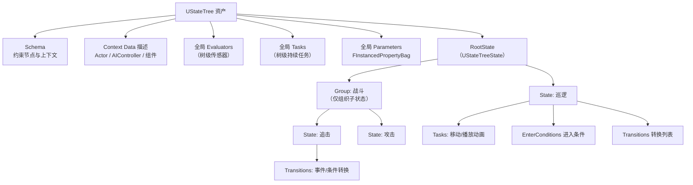
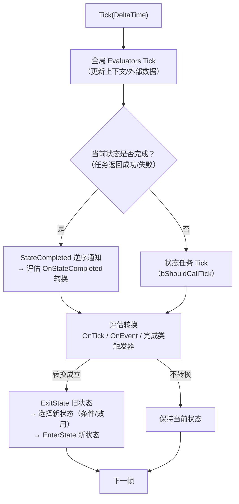
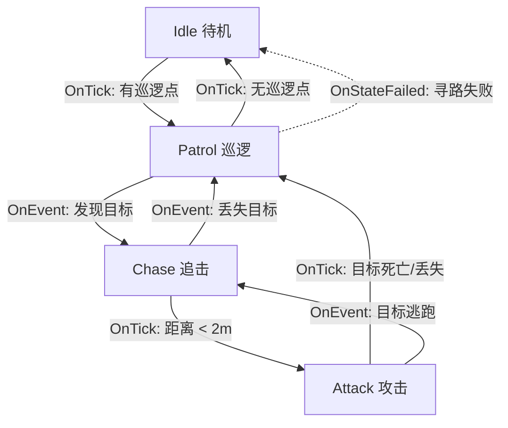
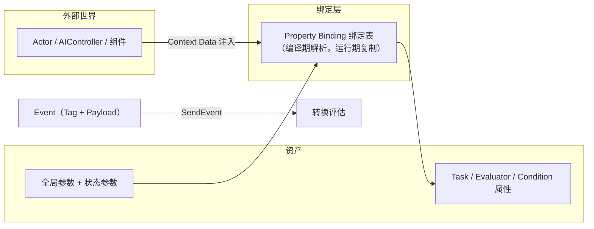
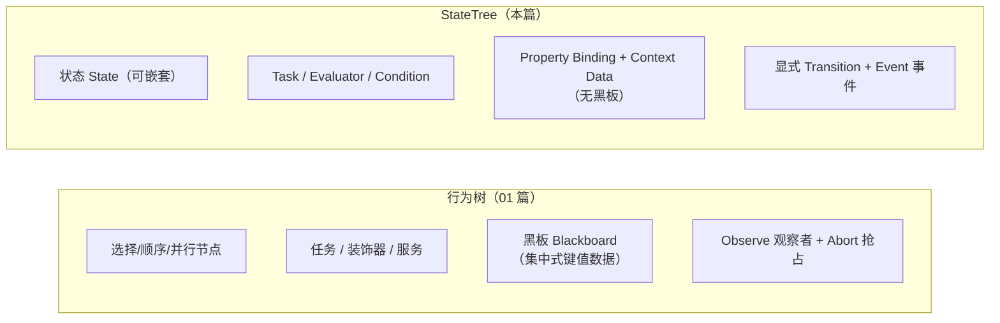

# 05 StateTree 状态树（State Tree）

## 概述

StateTree 是虚幻引擎 5 提供的数据驱动**状态树**框架：把 AI/游戏逻辑组织成一棵**分层状态（State）树**，状态之间通过**显式转换（Transition）**相连，节点所需数据通过**属性绑定（Property Binding）**从外部注入——**没有行为树那种集中式黑板**。

StateTree 自 UE 5.1 起随 Mass 生态逐步成型，5.4 后模块化趋于稳定。在本机 UE 5.8 源码中，相关代码分布在：

- **StateTreeModule**（`Engine/Plugins/Runtime/StateTree/Source/StateTreeModule`）：运行时核心——`UStateTree` 资产、节点基类（Task/Evaluator/Condition/Consideration）、`FStateTreeExecutionContext` 执行上下文、Schema、属性绑定、事件系统；
- **StateTreeEditorModule**：编辑器（State Tree Editor、`UStateTreeEditorData`、`UStateTreeState` 编辑器节点定义）；
- **GameplayStateTreeModule**（`Engine/Plugins/Runtime/GameplayStateTree`）：AI 集成层——`UStateTreeComponent`、`UStateTreeAIComponent`、`UBTTask_RunStateTree`（行为树内运行状态树）、`StateTreeMoveToTask`（寻路移动）、`StateTreeRunEnvQueryTask`（EQS）；
- **配套**：GameplayInteractions（`Engine/Plugins/Runtime/GameplayInteractions`，交互行为）、SmartObjects（智能对象，StateTree 行为常挂在 SmartObject 上）。

定位一句话：**行为树是"任务树 + 黑板"的抢占式决策；StateTree 是"状态机 + 数据绑定"的显式决策**。前者适合"随时可以打断重来"的行为编排，后者适合"状态明确、转换可枚举"的逻辑，二者在 5.8 中可以通过 `UBTTask_RunStateTree` 互相嵌套。

本文所有类名、枚举与 API 均对照本机 UE 5.8 源码验证。

## 核心概念（表格）

| 概念 | 英文 / 类型 | 说明 |
| --- | --- | --- |
| 状态 | State / `UStateTreeState` | 树上的一个节点：一组任务 + 进入条件 + 转换；可嵌套子状态 |
| 状态类型 | `EStateTreeStateType` | State（普通）/ Group（仅组织子状态）/ Linked（链接到本树另一状态）/ LinkedAsset（链接到另一资产）/ Subtree（可被链接的子树） |
| 任务 | Task / `UStateTreeTaskBase` | 状态里的执行单元（移动、播放动画、攻击），返回运行中/成功/失败 |
| 求值器 | Evaluator / `UStateTreeEvaluatorBase` | 树级"传感器"：每帧/每树周期更新外部数据或参数，不产生决策 |
| 条件 | Condition / `UStateTreeConditionBase` | 布尔判断：用于"进入条件"或"转换条件" |
| 效用 | Consideration / `UStateTreeConsiderationBase` | 打分式条件（0~1），配合 Utility 选择行为挑选子状态 |
| 转换 | Transition / `FStateTreeTransition` | 状态间的边：触发器 + 条件 + 目标类型 + 可选延迟 |
| 触发器 | `EStateTreeTransitionTrigger` | 何时尝试转换：状态成功/失败/完成、每帧 Tick、收到事件、委托 |
| 转换目标 | `EStateTreeTransitionType` | 转到指定状态/父状态/下一个兄弟状态/结束成功/结束失败等 |
| 事件 | Event / `FStateTreeEvent` | 带 GameplayTag 与可选载荷的异步消息，驱动 OnEvent 转换 |
| 模式 | Schema / `UStateTreeSchema` | 规定"这棵树允许哪些节点、上下文数据是什么"的约束资产 |
| 上下文数据 | Context Data | 外部注入的对象（Actor、AIController、组件等），通过绑定提供给节点 |
| 属性绑定 | Property Binding | 编辑器里把上下文/参数/外部属性"连线"到节点属性的机制，编译期解析 |
| 参数 | Parameters / `FInstancedPropertyBag` | 资产级全局参数 + 状态级参数，运行时可被覆盖 |
| 实例数据 | InstanceData / `FStateTreeInstanceData` | 每次运行（每棵树实例）独立的节点状态存储，多实体不串扰 |
| 运行状态 | `EStateTreeRunStatus` | Running（运行中）/ Stopped（被停止）/ Succeeded / Failed |
| 执行上下文 | `FStateTreeExecutionContext` | 运行时驱动器：Start / Tick / Stop / SendEvent |
| 树引用 | `FStateTreeReference` | 对状态树资产的引用（可带参数覆盖），挂在组件/BT 任务上 |
| 组件 | `UStateTreeComponent` | 挂在 Actor 上运行状态树的组件（继承 `UBrainComponent`） |
| AI 组件 | `UStateTreeAIComponent` | 带 AI 上下文的 StateTree 组件（保证可访问 AIController） |
| 编辑器数据 | `UStateTreeEditorData` | 编辑器侧持有节点定义与编译源数据，运行时不可见 |

## 原理详解

### 1. 资产结构：一棵状态树长什么样

`UStateTree`（`StateTree.h`）是资产本体，包含：Schema、上下文数据描述、**全局求值器**（`GetGlobalEvaluatorsBegin/Num`）、**全局任务**（`GetGlobalTasksBegin/Num`、`CompletionGlobalTasksMask`，如"整棵树共同完成的移动任务"）、全局参数（`Parameters`，`FInstancedPropertyBag`，`GetDefaultParameters()` 返回默认值）以及根状态（状态树）。



编辑器中状态节点定义在 `UStateTreeState`（`StateTreeEditorModule/Public/StateTreeState.h`）里，运行时编译（Linker）后扁平化为节点索引、绑定表与转换表，`FStateTreeExecutionContext` 只消费编译结果。

### 2. 状态（State）与状态类型

`UStateTreeState` 的主要字段（源码验证）：

| 字段 | 说明 |
| --- | --- |
| `Name` / `Description` / `Tag` / `ColorRef` | 名称、描述、GameplayTag、编辑器配色 |
| `Type`（`EStateTreeStateType`） | State / Group / Linked / LinkedAsset / Subtree |
| `SelectionBehavior`（`EStateTreeStateSelectionBehavior`） | 选中本状态后如何处理子状态（见下） |
| `Tasks`（`TArray<FStateTreeEditorNode>`） | 本状态的任务列表；Schema 也可规定单任务（`SingleTask`） |
| `EnterConditions` | 进入条件：全部为真才允许选中本状态 |
| `Considerations` + `Weight` | 效用打分（Utility），配合"最高效用"选择行为 |
| `Transitions` | 转换列表（见第 4 节） |
| `Parameters`（`FStateTreeStateParameters`） | 状态参数（`FInstancedPropertyBag`）+ 覆盖标记（`PropertyOverrides`） |
| `LinkedSubtree` / `LinkedAsset` | 链接子树 / 链接其他状态树资产（复用逻辑） |
| `RequiredEventToEnter`（`FStateTreeEventDesc`） | 选中本状态前必须收到的事件 |
| `CustomTickRate` / `bHasCustomTickRate` | 自定义 tick 频率（降低高频状态开销） |
| `bCopyParameterBindingsOnTick` | 每 tick 复制参数绑定（默认进入/退出时复制） |
| `TasksCompletion`（`EStateTreeTaskCompletionType`） | 状态何时算"完成"：`All`（全部任务完成）/ `Any`（任一完成） |
| `Children` / `Parent` / `ID` / `bEnabled` | 树结构、唯一 ID、启停 |

**选择行为**（`EStateTreeStateSelectionBehavior`）决定状态激活时如何下钻：

| 枚举 | 行为 |
| --- | --- |
| `None` | 本状态不可被直接选中 |
| `TryEnterState`（Try Enter） | 直接进入本状态（即使有子状态） |
| `TrySelectChildrenInOrder`（默认） | 按子状态顺序尝试选中第一个可进入的 |
| `TrySelectChildrenAtRandom` | 随机顺序尝试 |
| `TrySelectChildrenWithHighestUtility` | 选效用分最高的子状态（平局按顺序） |
| （随机效用） | 按归一化效用概率随机挑选 |

运行时的"当前在哪"是一串**激活状态栈**（`FStateTreeActiveStates`）：从根到叶的路径（例如 根 → 战斗 Group → 攻击 State），父状态任务与子状态任务同时运行。

### 3. 运行时生命周期

`FStateTreeExecutionContext`（`StateTreeExecutionContext.h`）是运行时驱动器，典型使用：

```cpp
FStateTreeInstanceData InstanceData; // 每个运行实例一份
FStateTreeExecutionContext Context(*Owner, *StateTree, InstanceData);

Context.Start();               // 启动：运行全局 Evaluator/任务，选择初始状态
Context.Tick(DeltaTime);       // 每帧推进
Context.SendEvent(Tag, Payload); // 发送事件（OnEvent 转换响应）
Context.Stop();                // 停止
EStateTreeRunStatus Status = Context.GetStateTreeRunStatus(); // Running/Succeeded/Failed...
```

一帧内的推进顺序：



**节点生命周期回调**（均可在 C++ 子类中覆写）：

| 节点 | 回调 | 时机 |
| --- | --- | --- |
| Task | `EnterState(Context, Transition)` | 状态进入时；返回 `EStateTreeRunStatus`（Running 继续 tick；Succeeded/Failed 立即完成） |
| Task | `Tick(Context, DeltaTime)` | 每帧（受 `bShouldCallTick` 控制） |
| Task | `ExitState(Context, Transition)` | 状态退出时 |
| Task | `StateCompleted(Context, Status, ActiveStates)` | 状态完成、新状态选中前，**逆序**通知（先子后父） |
| Evaluator | `TreeStart` / `TreeStop` | 树启动/停止 |
| Evaluator | `Tick(Context, DeltaTime)` | 每树周期（先于状态选择） |
| Condition | `TestCondition(Context)` | 条件求值（进入条件/转换条件） |

`UStateTreeTaskBase` 还有一组行为开关（源码验证）：`bShouldStateChangeOnReselect`（重选时是否触发状态切换）、`bShouldCallTick` / `bShouldCallTickOnlyOnEvents`（是否每帧/仅事件时 tick）、`bShouldCopyBoundPropertiesOnTick` / `bShouldCopyBoundPropertiesOnExitState`（绑定数据复制时机）。

### 4. 转换（Transition）机制

转换是 StateTree 的"灵魂"。`FStateTreeTransition`（`StateTreeState.h`）包含：

- **Trigger（触发器）**：`EStateTreeTransitionTrigger`
  - `OnStateSucceeded` / `OnStateFailed` / `OnStateCompleted`（成功或失败）；
  - `OnTick`：每帧尝试；
  - `OnEvent`：收到匹配的 GameplayTag 事件时；
  - `OnDelegate`：收到委托（delegate）时。
- **Conditions（转换条件）**：条件列表，全部为真才允许转换；
- **Type（目标）**：`EStateTreeTransitionType`
  - `GotoState`：转到指定状态；
  - `Parent`：回到父状态；`NextState` / `NextSelectableState`：下一个（可选的）兄弟状态；
  - `NextParent` / `NextSelectableParent`：父状态的下一个兄弟；
  - `Succeeded` / `Failed`：整棵树结束（成功/失败）；`None`：不转换。
- **EventTag（需要的事件）**：`OnEvent` 触发时匹配的 `FGameplayTag`；
- **Priority（优先级）**：同帧多个转换同时成立时按优先级处理；**转换评估从叶到根**（源码注释：`transitions are visited from leaf to root`），子状态优先；
- **bDelayTransition + 延迟时长**：转换可延迟执行；
- **ReactivateTargetState**（`EStateTreeTransitionChangeTypeRules`）：转到自身/已激活状态时是否重新激活；
- **Delegate**：绑定到外部委托（OnDelegate 触发）。

示例：一个巡逻 AI 的转换拓扑



**事件**：`FStateTreeExecutionContext::SendEvent(const FGameplayTag Tag, const FConstStructView Payload, const FName Origin)`。事件是"推"式通信：发送方不关心谁响应，接收方用 `OnEvent` 转换 + EventTag 匹配。这是 StateTree 与行为树"黑板轮询"最大的区别之一。

### 5. 数据流：无黑板设计

行为树用黑板做"共享数据层"，StateTree 换成了三件套：

| 机制 | 说明 | 对应源码 |
| --- | --- | --- |
| Context Data | Schema 声明的外部对象（Actor、AIController、StateTreeComponent…），运行时由外部注入（`FStateTreeExecutionContext` 构造参数中的 `FOnCollectStateTreeExternalData` 回调） | `StateTreeSchema.h`、`StateTreeExecutionContext.h` |
| Property Binding | 编辑器可视化"连线"：把 Context 对象属性 / 参数 / 事件载荷绑定到节点属性；编译期解析为绑定表（`FStateTreePropertyBindings`），运行期按需复制（进入状态时，或 `bCopyParameterBindingsOnTick` 每帧） | `StateTreePropertyBindings.h` |
| Parameters | 资产级全局参数（运行时可通过 `Start(FInstancedPropertyBag*)` 覆盖）与状态级参数（`FStateTreeStateParameters`，含 `PropertyOverrides` 覆盖标记）；5.8 起全局参数存入实例存储（版本枚举 `StoringGlobalParametersInInstanceStorage`） | `StateTree.h`、`StateTreeState.h` |



没有黑板意味着：**没有"键名魔法字符串"、没有跨树隐式耦合**——所有数据流在资产编辑器中可视化、可在编译期校验类型。代价是：运行时数据访问必须经过绑定/上下文，不适合"任意代码随手写全局变量"的粗放风格。

### 6. 编辑器与运行时组件

**编辑器**（StateTreeEditorModule）：状态为中心（State-Centric）的树视图 + 节点属性面板 + 编译错误面板 + 运行时调试器（高亮当前状态、显示转换历史与事件流）。`UStateTreeEditorData` 持有编辑期数据；保存时编译（Linker）产出运行时数据结构。

**运行时组件**（GameplayStateTreeModule）：

| 组件/类 | 说明 |
| --- | --- |
| `UStateTreeComponent` | 继承 `UBrainComponent`（同时实现 `IGameplayTaskOwnerInterface` 与 `IStateTreeSchemaProvider`），挂在 Pawn/Actor 上运行状态树；属性 `StateTreeRef`（`FStateTreeReference`，Schema 固定为 `StateTreeComponentSchema`）；`SetStateTree` / `SetStateTreeReference` 切换资产；覆写 `TickComponent` 驱动执行；`ScheduleNextTick` 支持按需 tick（无事件时休眠） |
| `UStateTreeAIComponent` | 继承 `UStateTreeComponent`，使用 `StateTreeAIComponentSchema`，**保证上下文可访问 AIController**，适合纯 AI 用途 |
| `UBTTask_RunStateTree` / `UBTTask_RunDynamicStateTree` | 行为树任务：在 BT 里运行一棵状态树（Schema 为 `StateTreeAIComponentSchema`），实现"BT 挂局部状态机" |
| `StateTreeMoveToTask` | 寻路移动任务（`AcceptableRadius` 默认取 AI 配置 `GET_AI_CONFIG_VAR(AcceptanceRadius)`），配合 AIController 的 MoveTo |
| `StateTreeRunEnvQueryTask` | 运行 EQS 查询的任务（与 02 篇 EQS 打通） |
| `StateTreeAITask` / `StateTreeAIConditionBase` | AI 侧任务/条件基类 |
| `GameplayStateTreeBlueprintFunctionLibrary` | 蓝图侧工具（发送事件等） |

### 7. 与行为树对比



| 维度 | 行为树 | StateTree |
| --- | --- | --- |
| 结构 | 树：复合节点控制执行流 | 树：状态嵌套 + 显式转换 |
| 数据 | 黑板（集中式键值对） | Context Data + 属性绑定 + 参数 |
| 状态保持 | 节点实例内存（任务自行管理） | InstanceData（每实例独立） |
| 事件 | 无原生事件，靠黑板观察者模拟 | 原生事件（Tag + Payload） |
| 中断 | Decorator Abort（Lower/Self/None） | 转换 + 条件 + 优先级（叶→根） |
| 完成语义 | 节点返回 Succeeded/Failed/Running | 状态任务完成 → OnStateCompleted 转换 |
| 多任务 | 一个任务节点一件事 | 一个状态可挂多个任务 + 全局任务 |
| 复杂度 | 深树难维护；抢占语义需经验 | 状态爆炸时转换数量增长；适合显式流程 |
| 互操作 | 通过 UBTTask_RunStateTree 运行 StateTree | 可内嵌于 BT（BTTask） |
| 典型场景 | 复杂战斗决策、长期巡逻编排 | 状态明确的流程、Mass 个体、交互行为 |

### 8. 与 Mass / GameplayInteractions 配合

- **Mass + StateTree**：Mass 负责群体数量与运动（04 篇），StateTree 负责**个体决策**——每个实体一份 `FStateTreeInstanceData`，由自定义 MassProcessor 驱动执行（把实体数据通过绑定暴露为上下文），决策结果写回 Fragment（如"切换到追击"→ 移动参数改变）。这就是 Lyra 等官方示例的 AI 组合方式。
- **SmartObjects**（`Engine/Plugins/Runtime/SmartObjects`）：世界中的交互点（座位、门、工作台）用 `USmartObjectComponent` + `USmartObjectDefinition` 描述；StateTree 行为定义可挂载在 SmartObject 上（如"坐下"、"开门"）。
- **GameplayInteractions**（`Engine/Plugins/Runtime/GameplayInteractions`）：提供交互行为框架，Mass 实体通过 SmartObject 找到交互点，用 StateTree 执行交互流程，交互时由 Representation 升级为 Actor 以播放动画/使用组件。

一句话架构：**Mass 决定"谁在哪、怎么动"，StateTree 决定"下一步做什么"，SmartObject 决定"能跟世界发生什么交互"**。

## 示例：C++ 自定义 Task / Evaluator / Condition

目标：写一套"巡逻 → 追击"的最小 AI 节点，在 StateTree 编辑器中组合。

**第 1 步：自定义 Evaluator（每帧更新目标距离）**

```cpp
// UDistToTargetEvaluator.h
USTRUCT()
struct FDistToTargetEvaluatorInstanceData
{
    GENERATED_BODY()

    /** 绑定目标：外部注入的 Actor */
    UPROPERTY(EditAnywhere, Category = "Output")
    TObjectPtr<AActor> Target = nullptr;

    /** 输出：到目标的距离（绑定给其他节点） */
    UPROPERTY(EditAnywhere, Category = "Output")
    float Distance = 0.f;
};

UCLASS()
class UDistToTargetEvaluator : public UStateTreeEvaluatorBase
{
    GENERATED_BODY()

public:
    using FInstanceDataType = FDistToTargetEvaluatorInstanceData;

    virtual void Tick(FStateTreeExecutionContext& Context, const float DeltaTime) const override
    {
        FInstanceDataType& InstanceData = Context.GetInstanceData(*this);
        const AActor* Self = Context.GetOwner();
        InstanceData.Distance = (Self && InstanceData.Target)
            ? FVector::Distance(Self->GetActorLocation(), InstanceData.Target->GetActorLocation())
            : MAX_FLT;
    }
};
```

> 说明：`FInstanceDataType` 约定是 StateTree 节点"实例数据"的惯用方式（节点属性都放进实例数据结构体，随 InstanceData 存储）；`Context.GetOwner()` 返回运行树的所有者（`StateTreeExecutionContext.h` 中 `TNotNull<UObject*> GetOwner()`）。此处为演示简化，真实 AI 项目建议通过 Schema 上下文 + 绑定获取目标，而非直接塞 Actor 属性。

**第 2 步：自定义 Condition（距离阈值）**

```cpp
// UDistanceCondition.h
USTRUCT()
struct FDistanceConditionInstanceData
{
    GENERATED_BODY()

    UPROPERTY(EditAnywhere, Category = "Parameter")
    float MaxDistance = 1000.f;

    /** 绑定 Evaluator 输出的距离 */
    UPROPERTY(EditAnywhere, Category = "Input")
    float Distance = MAX_FLT;
};

UCLASS()
class UDistanceCondition : public UStateTreeConditionBase
{
    GENERATED_BODY()

public:
    using FInstanceDataType = FDistanceConditionInstanceData;

    virtual bool TestCondition(FStateTreeExecutionContext& Context) const override
    {
        const FInstanceDataType& InstanceData = Context.GetInstanceData(*this);
        return InstanceData.Distance <= InstanceData.MaxDistance;
    }
};
```

**第 3 步：自定义 Task（移动到目标）**

```cpp
// UMoveToTargetTask.h
USTRUCT()
struct FMoveToTargetTaskInstanceData
{
    GENERATED_BODY()

    UPROPERTY(EditAnywhere, Category = "Parameter")
    TObjectPtr<AActor> Target = nullptr;

    UPROPERTY(EditAnywhere, Category = "Parameter")
    float AcceptableRadius = 100.f;
};

UCLASS()
class UMoveToTargetTask : public UStateTreeTaskBase
{
    GENERATED_BODY()

public:
    using FInstanceDataType = FMoveToTargetTaskInstanceData;

    UMoveToTargetTask()
    {
        bShouldCallTick = true; // 每帧 Tick
    }

    virtual EStateTreeRunStatus EnterState(FStateTreeExecutionContext& Context,
        const FStateTreeTransitionResult& Transition) const override
    {
        const FInstanceDataType& InstanceData = Context.GetInstanceData(*this);
        AActor* Self = Context.GetOwner();
        if (!Self || !InstanceData.Target)
        {
            return EStateTreeRunStatus::Failed; // 缺条件：状态失败 → 触发 OnStateFailed 转换
        }
        // 真实项目在这里发起 AIController 的 MoveTo（参考 StateTreeMoveToTask 实现）
        return EStateTreeRunStatus::Running;
    }

    virtual void Tick(FStateTreeExecutionContext& Context, const float DeltaTime) const override
    {
        const FInstanceDataType& InstanceData = Context.GetInstanceData(*this);
        AActor* Self = Context.GetOwner();
        if (Self && InstanceData.Target)
        {
            const float Dist = FVector::Distance(Self->GetActorLocation(), InstanceData.Target->GetActorLocation());
            if (Dist <= InstanceData.AcceptableRadius)
            {
                // 到达：完成任务。可用 Context 的完成通知机制结束本状态任务
                // （StateTree 5.x 通过完成委托/状态完成语义触发 OnStateCompleted 转换）
            }
        }
    }

    virtual void ExitState(FStateTreeExecutionContext& Context,
        const FStateTreeTransitionResult& Transition) const override
    {
        // 停止移动、清理（真实项目在这里取消 MoveTo）
    }
};
```

**第 4 步：在编辑器中组装**

1. 创建 State Tree 资产，选择 Schema（AI 场景选 `StateTreeAIComponentSchema` 或 `StateTreeComponentSchema`）；
2. 加全局 Evaluator `UDistToTargetEvaluator`；
3. 建状态：`Idle`（条件：无目标）、`Chase`（任务：`UMoveToTargetTask`；进入条件：`UDistanceCondition` 距离 > 阈值；转换：`OnStateCompleted` → `Idle`，`OnEvent` 丢失目标 → `Idle`）；
4. 把 Evaluator 输出 `Distance` 绑定到 Condition 的 `Distance` 输入（编辑器连线）；
5. 在 Pawn 上加 `UStateTreeComponent`（或 `UStateTreeAIComponent`），引用该资产运行。

## 选型对比

| 方案 | 优点 | 缺点 | 推荐场景 |
| --- | --- | --- | --- |
| 行为树（01 篇） | 生态成熟、抢占式决策自然、策划友好 | 黑板隐式耦合、事件模拟别扭、深树难调 | 复杂战斗 AI、长期巡逻编排、多技能决策 |
| StateTree | 显式转换、事件驱动、数据绑定可校验、轻量可实例化 | 状态多时转换爆炸、生态相对年轻 | 状态明确流程、Mass 个体、交互行为、UI/流程逻辑 |
| 手写状态机（枚举 + switch） | 完全可控、零依赖 | 难维护、难扩展、无可视化 | 极简逻辑（3~5 个状态） |
| GameplayAbilitySystem | 技能表现层丰富（成本/冷却/标签） | 偏"技能"而非"决策" | 技能/动作表现，与决策层配合 |

**建议**：决策层优先 StateTree（事件驱动、数据绑定），需要抢占式"能做什么就做什么"的弹性决策时用行为树；两者可用 `UBTTask_RunStateTree` 嵌套；技能表现交给 GAS。规模参考：Mass 万级实体上每实体一个 StateTree 实例是官方推荐组合（配合按需 tick）。

## 最佳实践

1. **事件驱动优先于轮询**：能用 `OnEvent` + `SendEvent` 的转换就不要用 `OnTick` 轮询；大量 OnTick 转换等于把 StateTree 用成行为树，失去事件优势。
2. **转换条件放 Transition Conditions**：不要在任务里写"if 目标太远就怎样"的分支，把条件放转换上，状态图才可读、可调试。
3. **数据全部走绑定**：节点里不要 `FindActor`/`GetWorld()->GetFirstPlayerController()`；通过 Schema 上下文 + 属性绑定注入，保证可复用、可校验。
4. **合理使用状态层级**：Group 只做组织，Leaf State 挂任务；共享行为用 `LinkedSubtree` / `LinkedAsset` 复用，避免复制粘贴状态。
5. **控制转换数量**：状态图"横平竖直"，每状态 2~4 条转换；转换超过 6 条说明状态划分不合理，考虑拆状态或用子状态机。
6. **小心转换优先级与 ReactivateTargetState**：同帧多转换时从叶到根评估（`Priority` 可调）；转到自身状态默认可能不重新激活，需要时配置 `ReactivateTargetState`。
7. **利用 CustomTickRate 与按需 tick**：低频状态（待机）降低 tick 频率；`UStateTreeComponent::ScheduleNextTick` 支持事件驱动唤醒，Mass 场景收益显著。
8. **用 Schema 约束团队**：不同用途（AI/交互/UI）建不同 Schema，限制可用节点与上下文，编译期拦截错误配置。
9. **参数覆盖实现"一树多用"**：`FStateTreeReference` 的 overrides（组件上 `LinkedStateTreeOverrides`）可为不同个体覆盖参数，避免复制资产。
10. **调试三板斧**：编辑器 StateTree 调试器（高亮当前状态、转换历史）、GameplayDebugger（运行时查看状态栈）、日志输出 `Context.GetStateTreeRunStatus()` 变化点。

## 常见问题 FAQ

**Q1：状态树没有执行，状态一直不动？**
检查：① 组件是否添加并引用资产（`UStateTreeComponent::SetStateTree`）；② Schema 是否与组件匹配（`StateTreeComponentSchema` / `StateTreeAIComponentSchema`）；③ 资产是否编译成功（编辑器编译错误面板）；④ 根状态是否有可进入的路径（进入条件是否全部为真）；⑤ 组件 tick 是否被禁用（按需 tick 下无事件会休眠，`ScheduleNextTick` 需要触发源）。

**Q2：转换为什么不触发？**
按顺序排查：① 触发器类型（`OnTick` 才每帧评估，`OnStateSucceeded/Failed` 只在完成时评估）；② 转换条件是否全部为真（条件绑定是否生效）；③ `OnEvent` 转换的事件 Tag 是否与 `SendEvent` 的 Tag 一致（大小写敏感）；④ 是否被同帧更高优先级的转换抢占（叶→根顺序）；⑤ 延迟转换（`bDelayTransition`）是否还没到期。

**Q3：任务卡在 Running 永远不结束？**
`EnterState` 返回 `Running` 后，任务必须最终返回 Succeeded/Failed 或通过完成机制结束状态，否则状态永不完成、`OnStateCompleted` 转换永不触发。检查任务是否在合适时机调用了完成路径；只返回 Running 而不做任何收尾是常见 bug。

**Q4：多个实例（多个 AI）会互相串数据吗？**
不会——每个运行实例有独立的 `FStateTreeInstanceData`（构造 `FStateTreeExecutionContext` 时传入）。但注意：**不要用静态成员或全局变量保存节点状态**；节点配置（UPROPERTY 默认值）是共享的，运行期可变状态必须放 InstanceData。

**Q5：StateTree 和行为树怎么选？**
参考"选型对比"：需要抢占式弹性决策（随时打断重来）→ 行为树；状态明确、流程化、事件驱动 → StateTree；混合场景用 `UBTTask_RunStateTree` 在 BT 里挂状态机（如"全局用 BT 编排，单场战斗用 StateTree 管理阶段"）。

**Q6：Evaluator 和 Task 有什么区别？**
Evaluator 是树级"传感器"：每树周期运行、不产生决策、输出数据供绑定；Task 是状态级"执行器"：随状态生命周期运行、可以完成状态。规则：**更新数据用 Evaluator，做动作用 Task**；需要按状态启停的持续性逻辑（如"追击时才刷新目标"）也可放 Task。

**Q7：SendEvent 发了但状态没反应？**
① 确认接收方状态/转换用的是 `OnEvent` 触发器且 EventTag 匹配；② 事件只在转换评估时处理——如果树处于休眠（按需 tick）且没有触发 `ScheduleNextTick`，事件可能延迟到下一次 tick；③ 检查事件载荷类型是否与绑定目标兼容；④ 确认发送的 Origin/来源没有把事件过滤掉。

**Q8：Mass 实体上怎么跑 StateTree？**
Mass 实体不是 Actor，不能直接挂 `UStateTreeComponent`。做法：自定义 MassProcessor 为每个实体持有 `FStateTreeInstanceData` + `FStateTreeExecutionContext`，把实体 Fragment 数据暴露为上下文/绑定输入，Processor 在实体 tick 时驱动 `Start/Tick/SendEvent`，并把决策结果写回 Fragment。表现升级为 Actor 时（Representation），再由 `UStateTreeComponent` 接管。

**Q9：参数怎么覆盖？**
资产级：`Start(FInstancedPropertyBag*)` / `Start(FStartParameters)` 传入初始参数；组件级：`FStateTreeReference` 带 overrides（`SetLinkedStateTreeOverrides` / `AddLinkedStateTreeOverrides(StateTag, Ref)`）；状态级：`FStateTreeStateParameters` 的 `PropertyOverrides` 覆盖（编辑器里对参数项打勾覆盖）。5.8 起全局参数存入实例存储，覆盖语义更一致。

**Q10：StateTree 能做"效用 AI"（Utility AI）吗？**
可以——`Considerations`（`UStateTreeConsiderationBase`）为子状态打分，配合 `TrySelectChildrenWithHighestUtility`（或按效用概率随机）选择行为，`Weight` 调权重。这是 StateTree 内置的 Utility 支持，比行为树"手写装饰器打分"更规范。

## 关联阅读

- 《01-行为树详解》：行为树与 StateTree 的对比基础；`UBTTask_RunStateTree` 让两者嵌套协作；
- 《02-感知系统与EQS》：感知结果通过绑定/事件送入 StateTree；`StateTreeRunEnvQueryTask` 在树内直接跑 EQS；
- 《03-NavMesh寻路》：`StateTreeMoveToTask` 底层依赖导航系统，理解寻路代价与接受半径有助于调参；
- 《04-Mass实体框架与群集模拟》：Mass 提供群体数量与表现，StateTree 提供个体决策，二者是官方推荐组合；
- UE 官方文档：StateTree（Unreal Engine 5 文档，含编辑器教程与 C++ 节点示例）；
- 源码（本机 UE 5.8）：
  - `Engine/Plugins/Runtime/StateTree/Source/StateTreeModule/Public/`：`StateTree.h`、`StateTreeState.h`（编辑器定义）、`StateTreeTypes.h`（转换/触发器/状态类型枚举）、`StateTreeExecutionContext.h`、`StateTreeTaskBase.h`、`StateTreeEvaluatorBase.h`、`StateTreeConditionBase.h`、`StateTreeConsiderationBase.h`、`StateTreeSchema.h`、`StateTreePropertyBindings.h`、`StateTreeEvents.h`；
  - `Engine/Plugins/Runtime/GameplayStateTree/Source/GameplayStateTreeModule/Public/`：`Components/StateTreeComponent.h`、`Components/StateTreeAIComponent.h`、`BehaviorTree/Tasks/BTTask_RunStateTree.h`、`Tasks/StateTreeMoveToTask.h`、`Tasks/StateTreeRunEnvQueryTask.h`；
  - `Engine/Plugins/Runtime/SmartObjects/`（`SmartObjectComponent.h`、`SmartObjectSubsystem.h`）与 `Engine/Plugins/Runtime/GameplayInteractions/`；
- 示例工程：Lyra（AI 全面使用 StateTree + Mass）、CitySample（Mass 人群 + SmartObject 交互）、StateTree 插件自带的测试/示例资产。
