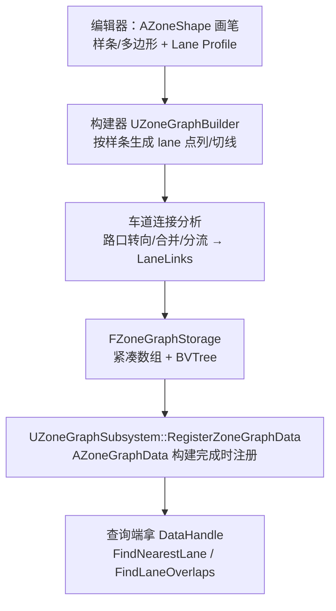
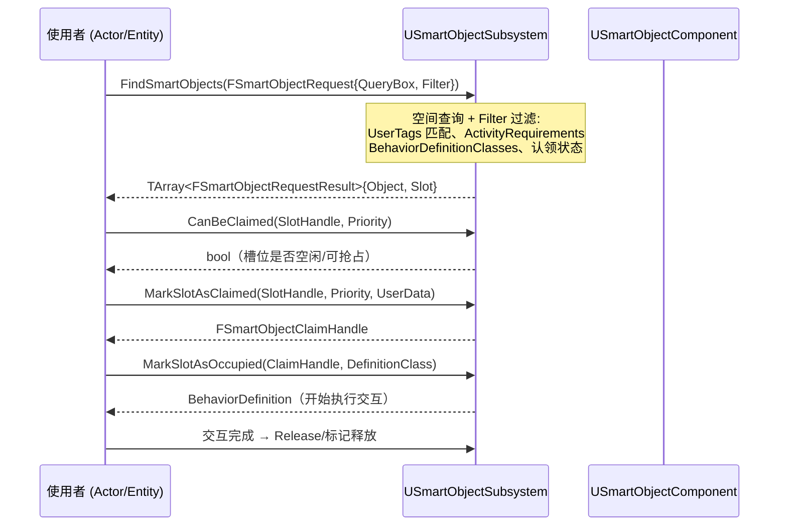
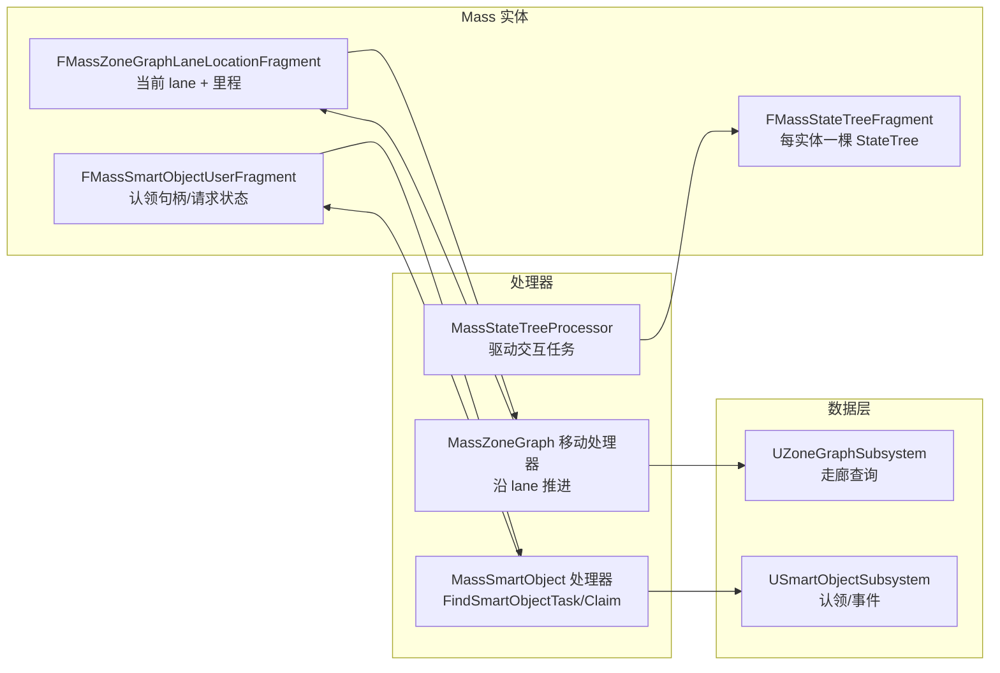

# 06 ZoneGraph 与 SmartObjects

> 适用版本：UE 5.8（以本机 `C:\Program Files\Epic Games\UE_5.8\Engine` 安装源码为基准，逐行核对）。源码路径基于 `Engine/Plugins/Runtime/ZoneGraph`、`Engine/Plugins/Runtime/SmartObjects`、`Engine/Plugins/Runtime/GameplayInteractions` 与 `Engine/Plugins/Runtime/MassGameplay`。

## 一、概述

传统 AI 寻路（NavMesh，见本分类 03 篇）解决"**从 A 到 B**"的问题；但开放世界 NPC 还需要回答两类新问题：

1/ **走在哪里、怎么描述"路"**：道路不是随便一块可走区域，而是有方向、有宽度、有车道语义（人行道/车道/骑行道）、有连接关系的**导航走廊**——这是 ZoneGraph；
2/ **世界里有什么可以"交互"的东西、怎么用**：椅子能坐、门能开、工作台能加工——这些东西有位置、有使用点、有占用状态、有行为定义——这是 SmartObjects；
3/ **两者如何编排成行为**：NPC 先沿着 ZoneGraph 走到椅子旁的"入口点"，再触发坐下动画、等待、离开——这是 GameplayInteractions（基于 StateTree 的交互任务）与 Mass 的协作舞台。

三者与 Mass 的关系：**Mass 是"人群的躯体"，ZoneGraph 是"人群的马路"，SmartObjects 是"路上的设施"，StateTree + GameplayInteractions 是"设施的使用说明书"**。它们共同构成 UE5 大世界群体 AI 的官方组合拳（MassAI 示例项目即以此搭建）。

> 适用范围提示：ZoneGraph/SmartObjects 并非只能配 Mass——单个 AIController + 行为树同样可以查 ZoneGraph 走廊、认领 SmartObject 槽位。理解数据层与使用层分离，是这篇的核心。

### 1/1 本篇回答的问题

- ZoneGraph 的"走廊"底层数据结构是什么？一条 lane 由哪些数组描述？
- `FZoneGraphTag` / `FZoneGraphTagMask` 的 32 位掩码如何做车道筛选？
- 运行时怎么查路：`FindNearestLane` / `FindLaneOverlaps` / `AdvanceLaneLocation` 各自适用什么场景？
- SmartObject 的"注册 → 查询 → 认领 → 使用"全流程 API 是什么？
- `FSmartObjectRequestFilter` 的每个字段管什么？槽位（Slot）和入口（Entrance）有什么区别？
- GameplayInteractions 在 StateTree 里提供哪些任务？`UAITask_UseGameplayInteraction` 怎么用？
- 与 Mass 协作时，`FMassSmartObjectUserFragment`、`FindSmartObjectTask` 等组件怎么接线？
- 落地案例：NPC 坐下、开门、工作台交互分别怎么搭？

## 二、核心概念

| 概念 | 类型 | 说明 |
| --- | --- | --- |
| Zone（区域） | `FZoneData` | 一块由边界点围成的区域（多边形/样条），包含若干 lane |
| Lane（车道/走廊） | `FZoneLaneData` | 一条有方向、宽度、标签的单向走廊；由点列与切线描述 |
| Lane Profile（车道配置） | `FZoneLaneProfile` | 一组平行 lane 的模板（如"双向人行道 + 双向车道"），按名称复用 |
| `FZoneLaneDesc` | 结构体 | 单条 lane 描述：`Width`（默认 150）、`Direction`、`Tags` |
| `FZoneGraphStorage` | 结构体 | 构建产物：Zones / Lanes / BoundaryPoints / LanePoints / LaneTangentVectors / LanePointProgressions / LaneLinks + BVTree |
| Tag / TagMask | `FZoneGraphTag` / `FZoneGraphTagMask` | 32 位标签（`EZoneGraphTags::MaxTags = 32`）与掩码，用于筛选车道 |
| `FZoneGraphLaneHandle` | 句柄 | lane 的运行时引用（DataHandle + LaneIndex） |
| `FZoneGraphLaneLocation` | 结构体 | lane 上某点：位置/朝向/切线/前进距离/所属段 |
| `UZoneGraphSubsystem` | World Subsystem | 查询入口：注册数据、最近车道、重叠查询、沿路推进 |
| `AZoneShape` / `UZoneShapeComponent` | 编辑器形状 | 样条/多边形"路网画笔"，构建时的输入 |
| SmartObject（智能对象） | `USmartObjectComponent` | 挂在 Actor 上，声明"这里有可交互的东西"及其槽位 |
| Slot（槽位） | `FSmartObjectSlotHandle` | 对象上的一个使用点（如椅子上的座位），可被认领 |
| Entrance（入口） | `FSmartObjectSlotEntranceHandle` | 槽位的到达点（站在哪个位置触发交互），可多个 |
| `USmartObjectSubsystem` | World Subsystem | 注册/注销、查询、认领、占用、事件 |
| `FSmartObjectRequestFilter` | 结构体 | 查询过滤器：UserTags / ActivityRequirements / BehaviorDefinitionClasses / 认领状态 |
| `FSmartObjectClaimHandle` | 句柄 | 认领凭证：对象 + 槽位 + 用户 ID 三合一 |
| BehaviorDefinition | `USmartObjectBehaviorDefinition` | 槽位使用的行为定义（MassBehavior / GameplayInteraction 两种） |
| GameplayInteractions | 插件 | StateTree 交互任务集（找槽、用槽、开门、动画等） |
| `UAITask_UseGameplayInteraction` | AITask | 传统 AI 侧"走过去 + 执行交互"的桥接任务 |

## 三、原理详解（Mermaid）

### 3/1 ZoneGraph：数据与查询

#### 3/1/1 数据模型（ZoneGraphTypes.h 已验证）

```cpp
// 节选：ZoneGraphTypes.h —— 标签（最多 32 个）
enum class EZoneGraphTags
{
	MaxTags = 32,
	MaxTagIndex = MaxTags - 1,
};

// 节选：ZoneGraphTypes.h —— 存储（构建产物，全部为紧凑数组）
USTRUCT()
struct FZoneGraphStorage
{
	TArray<FZoneData> Zones;              // 区域
	TArray<FZoneLaneData> Lanes;          // 车道（LaneIndex → ZoneIndex）
	TArray<FVector> BoundaryPoints;       // 区域边界点
	TArray<FVector> LanePoints;           // 车道点列
	TArray<FVector> LaneUpVectors;        // 车道法线
	TArray<FVector> LaneTangentVectors;   // 车道切线（朝向）
	TArray<float> LanePointProgressions;  // 每点的累计前进距离
	TArray<FZoneLaneLinkData> LaneLinks;  // 车道连接（转向/合并/分流）
	FBox Bounds;
	FZoneGraphBVTree ZoneBVTree;          // 区域 BV 树（空间索引）
	FZoneGraphDataHandle DataHandle;      // 注册句柄
};
```

```cpp
// 节选：ZoneGraphTypes.h —— 单条车道描述（编辑期配置）
USTRUCT(BlueprintType)
struct FZoneLaneDesc
{
	float Width = 150/0f;                                  // 宽度（默认 150cm）
	EZoneLaneDirection Direction = EZoneLaneDirection::Forward;
	FZoneGraphTagMask Tags = FZoneGraphTagMask(1);        // 默认带 Tag 0
};
```

车道是**单向**的：方向由 `EZoneLaneDirection` 表达；双向路需要两条 lane。`LanePointProgressions` 让"沿路走了多远"成为 O(1) 查询（配合 `AdvanceLaneLocation`），这是走廊模型相对 NavMesh 多边形最核心的差异——**路是 1D 参数化的曲线，而不是 2D 区域**。

#### 3/1/2 构建流程



#### 3/1/3 查询 API（ZoneGraphSubsystem.h 已验证）

```cpp
FZoneGraphDataHandle RegisterZoneGraphData(AZoneGraphData& InZoneGraphData);
const FZoneGraphStorage* GetZoneGraphStorage(const FZoneGraphDataHandle DataHandle) const;

// 找到指定包围盒内"最近"的车道（给定位置 → 车道定位）
bool FindNearestLane(const FBox& QueryBounds, const FZoneGraphTagFilter TagFilter,
                     FZoneGraphLaneLocation& OutLaneLocation, float& OutDistanceSqr) const;

// 找到半径范围内与圆重叠的所有车道段（批量，Mass 常用）
bool FindLaneOverlaps(const FVector& Center, const float Radius, const FZoneGraphTagFilter TagFilter,
                      TArray<FZoneGraphLaneSection>& OutLaneSections) const;

// 沿车道推进指定距离（走"里程"）
bool AdvanceLaneLocation(const FZoneGraphLaneLocation& InLaneLocation, const float AdvanceDistance,
                         FZoneGraphLaneLocation& OutLaneLocation) const;

bool IsLaneValid(const FZoneGraphLaneHandle LaneHandle) const;
```

标签筛选：`FZoneGraphTagFilter` 支持 `EZoneLaneTagMaskComparison::Any / All / Not`，把"只走人行道、不走施工路段"表达为一次掩码运算。

### 3/2 SmartObjects：智能对象

#### 3/2/1 注册

在 Actor 上加 `USmartObjectComponent`，配置好槽位（`FSmartObjectSlotDefinition`：位置、朝向、活动标签、行为定义）后，Actor 注册进世界时自动调用：

```cpp
// 节选：SmartObjectSubsystem.h
bool RegisterSmartObject(TNotNull<USmartObjectComponent*> SmartObjectComponent);
bool UnregisterSmartObject(TNotNull<USmartObjectComponent*> SmartObjectComponent);
bool RegisterSmartObjectActor(const AActor& SmartObjectActor);
```

#### 3/2/2 查询与认领全流程



关键 API（`SmartObjectSubsystem.h` / `SmartObjectRequestTypes.h` 已验证）：

```cpp
// 过滤器：所有可调项
USTRUCT(BlueprintType)
struct FSmartObjectRequestFilter
{
	FGameplayTagContainer UserTags;              // 请求者的标签（如 "AI/Peasant"）
	ESmartObjectClaimPriority ClaimPriority = ESmartObjectClaimPriority::Normal;
	FGameplayTagQuery ActivityRequirements;      // 槽位活动标签必须匹配
	TArray<TSubclassOf<USmartObjectBehaviorDefinition>> BehaviorDefinitionClasses;
	bool bShouldEvaluateConditions = true;       // 是否跑槽位/对象条件
	bool bShouldIncludeClaimedSlots = false;     // 是否包含已被认领的槽
	bool bShouldIncludeDisabledSlots = false;    // 是否包含禁用槽
};

// 查询
bool FindSmartObjects(const FSmartObjectRequest& Request, TArray<FSmartObjectRequestResult>& OutResults, const FConstStructView UserData) const;
bool FindSmartObjectsInList(const FSmartObjectRequestFilter& Filter, const TConstArrayView<AActor*> ActorList, ///) const;
void FindSlots(const FSmartObjectHandle Handle, const FSmartObjectRequestFilter& Filter, TArray<FSmartObjectSlotHandle>& OutSlots, ///) const;

// 认领与占用
bool CanBeClaimed(const FSmartObjectSlotHandle& SlotHandle, ESmartObjectClaimPriority ClaimPriority = ESmartObjectClaimPriority::Normal) const;
FSmartObjectClaimHandle MarkSlotAsClaimed(const FSmartObjectSlotHandle& SlotHandle, ESmartObjectClaimPriority ClaimPriority, const FConstStructView UserData = {});
const USmartObjectBehaviorDefinition* MarkSlotAsOccupied(const FSmartObjectClaimHandle& ClaimHandle, TSubclassOf<USmartObjectBehaviorDefinition> DefinitionClass);

// 入口位置（站哪儿触发交互）
bool FindEntranceLocationForSlot(const FSmartObjectSlotHandle& SlotHandle,
                                 const FSmartObjectSlotEntranceLocationRequest& Request,
                                 FSmartObjectSlotEntranceLocationResult& Result) const;
```

设计要点：

- **槽位与入口分离**：椅子有 1 个座位槽 + 1 个"到达入口"；工作台有 2 个工位槽 + 2 个入口。入口让 NPC 先走到精确位置，再播放交互动画；
- **认领是状态不是所有权**：`ClaimHandle` 把 对象 + 槽位 + 用户 ID 绑在一起，支持抢占优先级（高优先级可抢低优先级）；槽位被认领/占用/释放时会广播事件（`SendEvent` / `ListenSlotEvents`），供交互系统响应；
- **行为定义决定"怎么用"**：`MassBehaviorDefinition`（Mass 侧直接驱动动画/移动）或 `GameplayInteractionDefinition`（走 StateTree 任务图）——数据驱动，逻辑不在对象上。

### 3/3 GameplayInteractions：StateTree 交互任务

`GameplayInteractionsTypes.h` 提供：

```cpp
// 交互上下文里预定义的命名对象（StateTree 上下文数据）
extern const FName ContextActor;        // 执行交互的 Actor
extern const FName SmartObjectActor;    // 参与交互的 SmartObject Actor
extern const FName SmartObjectClaimedHandle;

// 所有交互任务/条件的基类（便于 Schema 统一包含）
struct FGameplayInteractionStateTreeTask : public FStateTreeTaskBase;
struct FGameplayInteractionStateTreeCondition : public FStateTreeConditionBase;
```

内置任务（`GameplayInteractionsModule/Private/StateTree/`）：

| 任务 | 作用 |
| --- | --- |
| `FGameplayInteractionFindSlotTask`（Find Slot） | 按过滤条件找槽并认领，输出 ClaimHandle |
| `FGameplayInteractionGetSlotActorTask` | 从 ClaimHandle 取对象 Actor |
| `FGameplayInteractionListenSlotEventsTask` | 监听槽位事件（如"开始/结束使用"） |
| `FGameplayInteractionSendSlotEventTask` | 向槽位发事件（如"我坐下了"） |
| `FGameplayInteractionModifySlotTagTask` / `SyncSlotTagStateTask` | 增删/同步槽位 GameplayTag |
| `FGameplayInteractionSetSlotEnabledTask` | 启用/禁用槽位 |
| `StateTreeTask_PlayContextualAnim` | 播放情境动画（Contextual Animation） |
| `PlayMontageStateTreeTask` | 播放蒙太奇 |
| `StateTreeTask_FindSlotEntranceLocation` / `GetSlotEntranceTags` | 求入口位置/标签 |

传统 AI 侧（行为树/AITask 用户）用 `UAITask_UseGameplayInteraction`（`AI/AITask_UseGameplayInteraction.h`）：

```cpp
static UAITask_UseGameplayInteraction* UseSmartObjectWithGameplayInteraction(AAIController* Controller, FSmartObjectClaimHandle ClaimHandle, bool bLockAILogic = true);
static UAITask_UseGameplayInteraction* MoveToAndUseSmartObjectWithGameplayInteraction(AAIController* Controller, FSmartObjectClaimHandle ClaimHandle, bool bLockAILogic = true);
```

`MoveToAndUse///` 内部：先 `UAITask_MoveTo` 走到槽位入口，再启动 `FGameplayInteractionContext` 执行交互定义（StateTree）。

### 3/4 与 Mass 的协作



Mass 侧关键部件（`MassGameplay` 插件，均已验证存在）：

| 文件 | 内容 |
| --- | --- |
| `MassSmartObjectFragments.h` | `FMassSmartObjectUserFragment`（用户状态）、`FMassSmartObjectWorldConditionTimerFragment` 等 |
| `MassSmartObjectProcessor.h` | `UMassSmartObjectProcessor`：周期查询/认领/释放槽位 |
| `MassSmartObjectRequest.h` | `UMassSmartObjectRequestProcessor`、`FindSmartObjectTask`（StateTree 任务） |
| `MassSmartObjectUserTrait.h` | `UMassSmartObjectUserTrait`：给实体挂上"智能对象用户"配置 |
| `MassSmartObjectBehaviorDefinition.h` | `UMassSmartObjectMassBehaviorDefinition`：Mass 直驱的行为定义 |
| `MassEntityZoneGraphSpawnPointsGenerator.h` | 沿 ZoneGraph lane 生成实体的生成器 |
| `SmartObjectZoneAnnotations.h` | 把 SmartObject 入口注册进 ZoneGraph 的注解（让"入口"成为路网上的点） |

典型 Mass 交互链路：Mass 移动处理器沿 lane 走 → 靠近目标区域时 `FindSmartObjectTask`（StateTree 任务）发起 `FindSmartObjects` → 认领槽位 → 实体切到交互 StateTree（`UseSmartObject` 分支：移动到入口 → 播放动画 → 发事件 → 释放）。

### 3/5 应用场景

| 场景 | 怎么搭 |
| --- | --- |
| NPC 坐下 | 椅子上挂 `USmartObjectComponent`：1 个座位槽（活动标签 `Seat`）+ 1 个入口；NPC 查 `ActivityRequirements=Seat` → 认领 → 走到入口 → `StateTreeTask_PlayContextualAnim` 坐下 → 等待 → 起身释放 |
| NPC 开门 | 门上挂智能对象：把手槽位 + 门前入口；交互 StateTree：走到入口 → 播放"开门"动画 → `ModifySlotTag` 把门状态改成 `Open` → 门 Actor 响应 Tag 打开碰撞 |
| 工作台交互 | 工作台 2 个工位槽 + 2 个入口，行为定义为 `GameplayInteractionDefinition`；两个 NPC 各自认领不同槽位并发加工，槽位 Tag `Busy` 阻止第三人抢占 |
| 城市人群 | Mass 生成实体沿 ZoneGraph 人行道 lane 行走，路过长椅/商店时用 `FindLaneOverlaps` 发现附近智能对象，按概率离队交互 |

## 四、示例

### 4/1 C++：给椅子加智能对象并查询（传统 AI 侧）

```cpp
// 椅子 Actor 的初始化（示意）
USmartObjectComponent* SOComp = NewObject<USmartObjectComponent>(ChairActor);
// 配置槽位：1 个座位 + 1 个入口，活动标签 Seat，行为定义用 GameplayInteraction
FSmartObjectSlotDefinition& Slot = SOComp->GetMutableSlotDefinitions()/AddDefaulted_GetRef();
Slot/ActivityTags/AddTag(FGameplayTag::RequestGameplayTag(TEXT("Activity/Seat")));
// /// 设置槽位变换与行为定义
SOComp->RegisterComponent();
```

```cpp
// 使用者：查询并认领
USmartObjectSubsystem* SOSub = UWorld::GetSubsystem<USmartObjectSubsystem>(World);

FSmartObjectRequestFilter Filter;
Filter/UserTags/AddTag(FGameplayTag::RequestGameplayTag(TEXT("AI/NPC")));
Filter/ActivityRequirements = FGameplayTagQuery::MakeQuery_MatchAnyTags(
	FGameplayTagContainer(FGameplayTag::RequestGameplayTag(TEXT("Activity/Seat"))));

FSmartObjectRequest Request(FBox(MyLocation - FVector(500), MyLocation + FVector(500)), Filter);
TArray<FSmartObjectRequestResult> Results;
SOSub->FindSmartObjects(Request, Results);

if (Results/Num() > 0 && SOSub->CanBeClaimed(Results[0]/SlotHandle))
{
	FSmartObjectClaimHandle Claim = SOSub->MarkSlotAsClaimed(Results[0]/SlotHandle, ESmartObjectClaimPriority::Normal);
	// 传统 AI：用 AITask 走过去并执行交互
	UAITask_UseGameplayInteraction* Task =
		UAITask_UseGameplayInteraction::MoveToAndUseSmartObjectWithGameplayInteraction(MyController, Claim);
	Task->ReadyForActivation();
}
```

### 4/2 StateTree 交互定义（配置侧结构）

```text
StateTree：UseChair
├─ State: Find And Claim Slot
│    ├─ Task: Find Slot（过滤 Seat，输出 ClaimHandle）
│    └─ Task: Move To Slot Entrance（入口位置）
├─ State: Sit Down
│    ├─ Task: Play Contextual Anim（坐下）
│    ├─ Task: Send Slot Event（“Occupied”）
│    └─ 条件：事件/时长
└─ State: Stand Up
     ├─ Task: Play Contextual Anim（起身）
     └─ Task: Release（释放认领）
```

### 4/3 ZoneGraph 查询（Mass 移动处理器示意）

```cpp
UZoneGraphSubsystem* ZoneSub = UWorld::GetSubsystem<UZoneGraphSubsystem>(World);

FZoneGraphTagFilter Filter;
Filter/AnyTags = FZoneGraphTagMask(FZoneGraphTag(1)); // 例如 Tag1 = 人行道

FZoneGraphLaneLocation OutLocation;
float OutDistanceSqr = 0/f;
if (ZoneSub->FindNearestLane(FBox(AgentPos - FVector(100), AgentPos + FVector(100)), Filter, OutLocation, OutDistanceSqr))
{
	// 沿路推进 200cm 得到下一点
	FZoneGraphLaneLocation Next;
	ZoneSub->AdvanceLaneLocation(OutLocation, 200/f, Next);
}
```

## 五、最佳实践

1/ **ZoneGraph 是"路"，NavMesh 是"地"**：道路/走廊用 ZoneGraph 表达（方向、车道、交通语义），开阔地自由寻路仍用 NavMesh；两者可按区域共存。
2/ **标签是筛选的第一语言**：把"人行道/车道/施工"做成 Tag，查询用 `FZoneGraphTagFilter`（Any/All/Not），不要在查询后自己逐个过滤。
3/ **SmartObject 只描述"能交互"，不实现"怎么交互"**：逻辑放 BehaviorDefinition（Mass 或 GameplayInteraction），对象 Actor 保持简单；用 Tag 表达状态（`Busy`/`Open`）而非硬编码。
4/ **认领后必须考虑释放**：交互中断（死亡/被推走）要监听槽位事件或使用 `FSmartObjectClaimHandle` 的失效回调（`OnSlotInvalidated`），避免槽位永久占用。
5/ **入口与槽位分开配**：永远给槽位配入口；NPC 直接瞬移到座位上会穿帮，`FindEntranceLocationForSlot` 是标准姿势。
6/ **Mass 场景控制查询频率**：`FindSmartObjects` 是全量空间查询，Mass 实体成千上万时用 `FindLaneOverlaps` + 区域预筛或处理器节流（间隔帧），别每实体每帧查。
7/ **行为树 / AITask 也能用**：没有 Mass 时用 `UAITask_UseGameplayInteraction` 或直接在 BTTask 里调 Subsystem API，组合自由。
8/ **Schema 一致**：GameplayInteractions 任务要求 StateTree Schema 提供 `ContextActor`/`SmartObjectActor`/`ClaimHandle` 上下文，自定义 Schema 时用 `FGameplayInteractionStateTreeTask` 基类并注册上下文槽。

## 六、FAQ

**Q1：ZoneGraph 能替代 NavMesh 吗？**
不能完全替代。ZoneGraph 适合"结构化的路"（车道/走廊/轨迹），NavMesh 适合"任意可走区域"。Mass 项目的常见做法是两者并用：走廊外自由移动用 NavMesh，上道后用 ZoneGraph lane 巡航。

**Q2：`FZoneGraphTagMask` 为什么是 32 位？**
`EZoneGraphTags::MaxTags = 32`：标签索引 0~31，掩码是 uint32。超过 32 种语义时合并/复用标签，或在查询后二次过滤。

**Q3：SmartObject 与普通 Actor 交互（可交互提示）有什么区别？**
SmartObject 提供**标准化注册/查询/认领协议**与行为定义机制，多个使用者（Mass、行为树、玩家）可以共用同一套"找东西 → 抢位置 → 用"流程；普通交互需要每对象自己实现一套。提示 UI 通常在认领成功后由交互层（StateTree/UMG）驱动。

**Q4：槽位被认领后别人还能用吗？**
`CanBeClaimed` + 认领优先级决定：同优先级下已认领槽位不可再认领；更高优先级可抢占（除非占用中）。`bShouldIncludeClaimedSlots` 控制查询是否把已认领槽位也返回。

**Q5：`FindSmartObjects` 和 `FindSlots` 有什么区别？**
`FindSmartObjects` 按请求（包围盒 + 过滤器）返回"对象+槽位"结果列表；`FindSlots` 针对已知对象（`FSmartObjectHandle`）枚举其满足过滤器的槽位。前者用于"找地方"，后者用于"看这地方有哪些位子"。

**Q6：交互动画怎么和 Mass 实体（无 Actor 表现）配合？**
低配实体用 Mass 直驱动画（`UMassSmartObjectMassBehaviorDefinition` + 动画数据接口）；高配/近玩家实体用 `StateTreeTask_PlayContextualAnim`（情境动画，支持对齐槽位姿势）。MassLOD 负责档位切换。

**Q7：ZoneGraph 数据是运行时构建还是编辑器烘焙？**
`AZoneGraphData` 在编辑器/构建期生成 `FZoneGraphStorage` 并序列化；运行时 `UZoneGraphSubsystem` 注册加载的数据（`RegisterZoneGraphData`）。运行时也可以动态构建（程序化道路），需要自行注册/注销数据。

**Q8：GameplayInteractions 依赖 GAS 吗？**
不依赖 GAS。它只依赖 GameplayTags（槽位标签）与 StateTree。与 GAS 的联动（如交互给 buff）需要你自己在交互任务里调 `UAbilitySystemComponent`。

## 七、关联阅读

- [04-Mass实体框架与群集模拟](04-Mass实体框架与群集模拟.md)（本文三者的主要宿主框架，必读）
- [05-StateTree状态树](05-StateTree状态树.md)（GameplayInteractions 任务的运行载体）
- [03-NavMesh寻路](03-NavMesh寻路.md)（与 ZoneGraph 的定位对比）
- [01-行为树详解](01-行为树详解.md)（传统 AI 侧接入 `UAITask_UseGameplayInteraction`）
- [03-游戏玩法编程/03-GameplayTag与数据资产](../03-游戏玩法编程/03-GameplayTag与数据资产.md)（槽位活动标签/用户标签的基础）
- 官方示例：MassAI 示例项目（Lyra 亦含 SmartObject 交互范式）、Mass 框架文档
