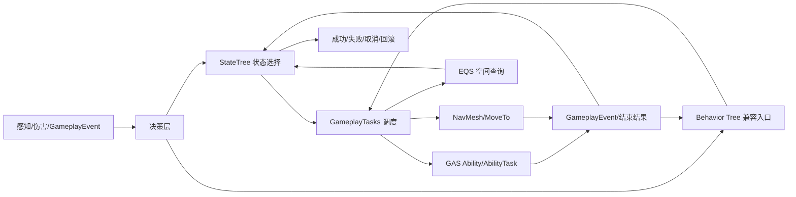
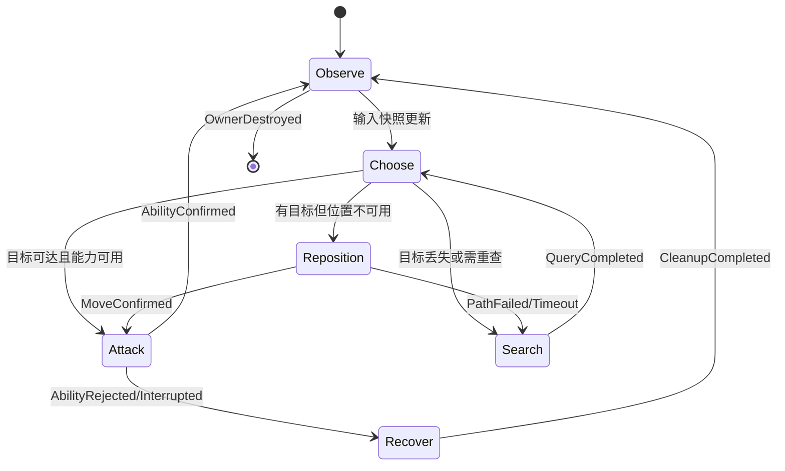
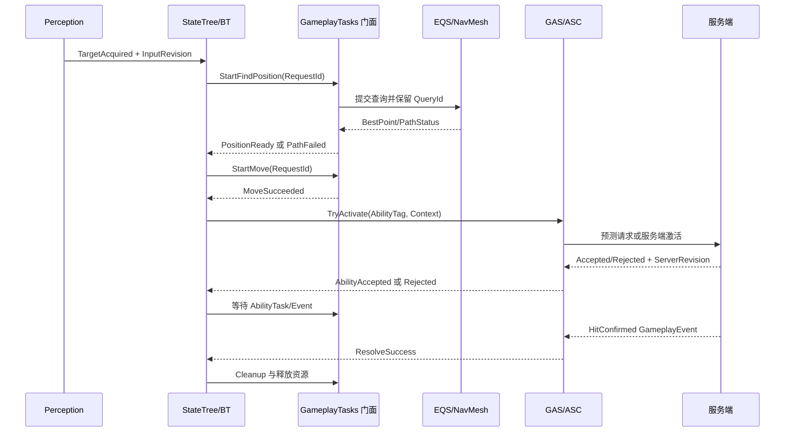
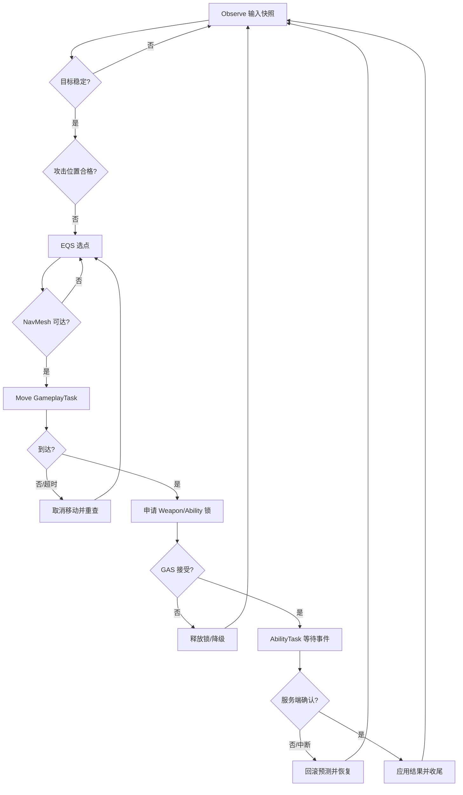

# 07 GameplayTasks、StateTree、GAS 与 AI 协同闭环
> 一句话定位：用 StateTree 或行为树做决策，用 GameplayTasks 做可取消的异步执行编排，用 GAS 管理能力与战斗承诺，再把感知、EQS、NavMesh 结果接回状态机，形成可观测、可回滚、可由服务端确认的 AI 行为闭环。

> 版本基准：UE5.8.0 / CL55116800 / ++UE5+Release-5.8。
> 适用范围：单体 NPC、玩家与 AI 共用的战斗能力、带感知和导航的实时战斗，以及需要把行为树逐步迁移到 StateTree 的 UE5 项目。
> 兼容性边界：本文以本机 `Engine/Build/Build.version` 的版本元数据为基准；代码块是示意 C++ 或伪代码，不宣称已经逐行核对 UE5.8 的每个函数签名。UE4.27、早期 UE5、Mass 大规模实体和项目自定义任务系统只作为迁移或扩展讨论，落地前必须以实际插件启用状态、头文件和目标平台编译结果为准。
> 官方参考：[Unreal Engine 官方文档](https://dev.epicgames.com/documentation/en-us/unreal-engine)。
> 最后更新：2026-08-06。

## 0. 阅读方式与事实边界

本文讨论的是一条组合闭环，而不是把四套框架揉成一个“万能任务类”。
先读职责边界，再读生命周期和失败路径，最后把示例映射到自己的游戏标签、能力和导航代理。
“选择了什么”与“怎样完成”必须分开，才能让状态切换、网络确认和性能预算有可追踪的落点。

本次已用 `Test-Path` 核验以下相对文件存在，正文只创建指向这些实际文件的链接。

| 核验目标 | 相对路径 | 核验结果 |
| --- | --- | --- |
| GameplayTasks 源码专题 | `../12-引擎源码分析/29-GameplayTasks源码.md` | 已存在 |
| Mass 与 StateTree 源码专题 | `../12-引擎源码分析/21-Mass与StateTree源码.md` | 已存在 |
| GAS 源码专题 | `../12-引擎源码分析/05-GAS能力系统源码.md` | 已存在 |
| 行为树与 AI 源码专题 | `../12-引擎源码分析/12-行为树与AI源码.md` | 已存在 |
| 本分类行为树正文 | `01-行为树详解.md` | 已存在 |
| 本分类感知与 EQS 正文 | `02-感知系统与EQS.md` | 已存在 |
| 本分类 NavMesh 正文 | `03-NavMesh寻路.md` | 已存在 |
| 本分类 StateTree 正文 | `05-StateTree状态树.md` | 已存在 |
| 本分类 SmartObjects 正文 | `06-ZoneGraph与SmartObjects.md` | 已存在 |

本文只把本地版本文件和上述链接作为已核验事实。
未在本次任务中逐行验证的引擎实现，用“示意”“方案”“需要在项目中确认”等词明确隔离。
特别是调度器内部线程模型、具体 Trace 通道和某些插件 API 的重载，不应仅凭本文代码片段判断。

## 1. 闭环概述

一个可落地的 AI 行为通常经历下面的循环：

1. 感知、伤害事件或 GameplayEvent 改变输入事实。
2. StateTree 选择新的状态，或行为树对当前子树执行 Decorator Abort。
3. 状态实例创建一个“意图”，而不是直接修改所有游戏状态。
4. GameplayTask 竞争资源并异步等待导航、动画、能力或交互结果。
5. GAS Ability 负责可授权、可预测、可复制的玩法承诺。
6. GameplayEvent、Ability 结束回调或导航结果把结果送回状态机。
7. StateTree 处理成功、失败、取消和超时，释放旧资源并决定重试、重规划或退出。

闭环的关键不是“每个系统都能调用另一个系统”，而是每次跨系统调用都有明确的输入、Owner、资源、取消令牌、结果和网络权威。



### 1.1 一个示例问题

假设“近战 NPC 发现玩家后寻找可达位置、申请攻击、播放攻击并等待命中确认”。

| 阶段 | 主要问题 | 推荐归属 |
| --- | --- | --- |
| 发现玩家 | 是否看见、是否仍可见、刺激是否过期 | AIPerception 与黑板/状态输入 |
| 选择位置 | 哪个点可达、是否有掩体、查询是否超时 | EQS + NavMesh |
| 选择行为 | 追击、攻击、撤退还是等待 | StateTree；已有行为树项目可由 BT 选择入口 |
| 抢占动作 | 移动与攻击是否冲突、谁能打断谁 | GameplayTasks 资源锁与优先级 |
| 执行能力 | 消耗、冷却、命中、预测和服务端认可 | GAS Ability |
| 等待完成 | 动画、GameplayEvent、命中或失败回调 | AbilityTask / GameplayTask |
| 收尾 | 释放锁、撤销预测、回滚临时标记、重规划 | 状态退出协议 + GAS End/Cancel |

### 1.2 最小可行闭环

第一版不需要同时改造所有 AI。
可以先让行为树继续负责高层选择，把一个叶子 Task 适配成 GameplayTask，再由该任务触发 GAS。
第二版再把同一个意图迁移到 StateTree，让行为树只保留兼容入口。
第三版才考虑把批量 NPC 的相同状态逻辑抽到 Mass/StateTree 数据驱动层。

## 2. 核心概念与职责边界

| 概念 | 英文 | 负责什么 | 不负责什么 |
| --- | --- | --- | --- |
| 游戏玩法任务 | GameplayTask | 表达一个可排队、可运行、可完成或可取消的执行单元 | 不决定整个 AI 的长期策略 |
| 任务 Owner | GameplayTask Owner | 提供任务组件、生命周期和外部取消入口 | 不自动等于网络权威 |
| 资源锁 | GameplayTask Resource Lock | 声明移动、武器、交互等互斥或共享资源 | 不代替业务层的目标合法性检查 |
| 状态树 | StateTree | 用条件、效用和事件选择状态，并管理状态实例生命周期 | 不应隐藏一大段不可观察的异步回调 |
| 状态任务 | StateTree Task | 在状态进入/运行/退出时执行局部工作 | 不应偷偷持有跨状态的永久单例句柄 |
| 能力 | Gameplay Ability | 把可授权的玩法行为、成本、冷却、预测和复制边界集中起来 | 不负责感知全局和导航点生成 |
| 能力任务 | AbilityTask | 在 Ability 内等待动画、事件、目标选择或异步结果 | 不应绕过 Ability 生命周期自行永久运行 |
| GameplayEvent | Gameplay Event | 用 Tag 加载荷表达可路由的玩法事实或完成信号 | 不保证接收者一定存在或一定成功 |
| 行为树 | Behavior Tree | 以任务树、黑板和 Decorator 组织既有 AI 决策 | 不应与 StateTree 同时拥有同一资源的最终裁决权 |
| 感知 | Perception | 将视觉、听觉、伤害等外界刺激变成可消费事实 | 不直接决定“必须攻击” |
| EQS | Environment Query System | 产生和评分空间候选 | 不应在每个 Tick 无条件运行昂贵查询 |
| NavMesh | Navigation Mesh | 提供可达性、路径和导航代价 | 不等于移动已经完成 |

### 2.1 “选择”和“执行”的边界

StateTree 或行为树回答“现在要做哪一个意图”。
GameplayTasks 回答“这个意图的异步执行阶段如何排队、等待、取消和释放资源”。
GAS 回答“这个能力是否被授权、成本是否支付、结果是否对网络成立”。
AI 子系统回答“目标、位置和路径是否可用”。

如果一个 StateTree Task 里同时写感知扫描、EQS 评分、导航移动、扣血和网络 RPC，说明边界已经失控。
拆分后的每个阶段都应能给出一个可测试结果：`NoTarget`、`QueryTimeout`、`PathFailed`、`AbilityRejected`、`Confirmed` 或 `Canceled`。

### 2.2 Owner、实例和权威的三种“拥有”

“Owner”容易产生歧义，至少要分为三层：

| 名称 | 例子 | 生命周期 | 责任 |
| --- | --- | --- | --- |
| 任务 Owner | AIController、Pawn 或专用任务组件 | Actor/组件存活期间 | 让任务找到调度器并接受取消 |
| 状态实例 Owner | StateTreeComponent 或执行上下文 | 一次运行实例 | 保存状态绑定、任务实例数据和退出原因 |
| 网络权威 Owner | 服务端 AbilitySystemComponent 或服务器 AIController | 网络会话期间 | 产生最终可复制的游戏结果 |

一个客户端本地的 GameplayTask 可以拥有执行对象，但它没有资格因此写入服务端伤害结果。
一个 StateTree 实例结束时，必须取消或转移它创建的异步句柄，不能把回调留给已经失效的实例。

## 3. GameplayTasks：把异步工作变成可取消协议

### 3.1 任务生命周期

GameplayTask 的核心价值是把“启动后等待一段时间”的工作显式化。
概念生命周期可以抽象为：创建、等待资源、激活、运行、成功/失败、暂停、取消、销毁。

| 阶段 | 进入条件 | 允许做的事 | 必须避免的事 |
| --- | --- | --- | --- |
| Created | 已创建任务实例 | 保存不可变输入、关联 Owner | 立刻修改最终玩法状态 |
| WaitingForResources | 资源未获得 | 排队、更新等待原因 | 在没有锁时播放攻击或移动 |
| Active | 调度器授予资源 | 发起异步操作、监听结果 | 阻塞游戏线程等待完成 |
| Succeeded | 业务结果满足 | 发出一次完成信号、释放临时数据 | 重复广播完成 |
| Failed | 不可恢复或超时 | 携带稳定失败码、触发重规划 | 把失败吞掉变成“无响应” |
| Canceled | Owner、状态或上层主动取消 | 解除委托、停止可取消子操作 | 把取消误报为成功 |
| Destroyed | 没有外部引用 | 释放引用、记录最终 Trace | 访问已失效的状态实例 |

“完成”与“取消”不是同义词。
完成表示任务达成了自己的契约；取消表示上层不再等待它，可能需要由上层决定是否回滚。

### 3.2 异步任务的输入和输出

每个跨系统任务建议拥有不可变输入和一次性输出。

| 字段 | 示例 | 说明 |
| --- | --- | --- |
| RequestId | `Attack-42-18` | 贯穿 StateTree、Task、Ability、Trace 和测试 |
| OwnerId | NPC NetGUID 或本地实例 ID | 用于隔离不同 AI 的回调 |
| TargetId | 目标 Actor 的稳定标识 | 不要只保存裸指针作为网络协议 |
| InputRevision | 感知/决策版本号 | 结果返回时检查是否仍是当前意图 |
| Deadline | 服务器时间或单调时钟截止点 | 防止任务永远等待 |
| ResultCode | `Confirmed`、`PathFailed` | 机器可读，便于重试策略 |
| CleanupToken | 子操作集合 | 取消时统一解除委托和锁 |

### 3.3 资源锁

资源锁（Resource Lock）表达“同时运行哪些任务是安全的”。
它不是全局互斥锁，也不是数据库事务；它只应覆盖足够短、边界清晰的玩法阶段。

| 资源 | 默认关系 | 可同时运行的例子 | 冲突例子 |
| --- | --- | --- | --- |
| Movement | 常见互斥 | 感知与 UI 更新 | 两个导航任务同时写移动目标 |
| Weapon | 常见互斥 | 目标评估与冷却计时 | 两个 Ability 同时装填同一武器 |
| Ability | 按标签分组 | 非战斗状态和感知 | 同一槽位的两个攻击能力 |
| Interaction | 常见互斥 | 查询候选与动画预加载 | 两个 NPC 认领同一个 SmartObject 槽位 |
| RootMotion | 与移动相关互斥 | 音效和事件监听 | Root Motion 与普通 MoveTo 同时驱动位移 |
| PerceptionQuery | 通常共享但限额 | 多种轻量读取 | 每个任务都独立刷新全量感知 |

实际资源枚举和引擎内置资源集合需以启用的 GameplayTasks/AI/GAS 模块及项目封装为准。
本文中的资源名称是架构协议名，代码示例不假设某个项目已有同名枚举。

### 3.4 Owner 选择

单体 AI 通常把 AIController 或挂在 Pawn 上的专用 `UActorComponent` 作为任务 Owner。
玩家能力通常把 AbilitySystemComponent 作为能力 Owner，但“任务调度 Owner”和“能力授权 Owner”仍可分离。

推荐使用下面的查找顺序：

1. 先从状态执行上下文取得显式的任务宿主接口。
2. 宿主接口返回稳定的 GameplayTasksComponent 或项目任务门面。
3. 任务门面检查 Actor 是否仍有效、World 是否仍在 Play、Owner 是否属于当前实例。
4. 找不到宿主时立即返回 `OwnerUnavailable`，不创建“悬空异步任务”。

### 3.5 调度与优先级

调度器只解决“此刻是否可以运行”，不解决“为什么选择它”。
建议把优先级拆成硬约束和软排序：

| 层级 | 例子 | 处理方式 |
| --- | --- | --- |
| 硬约束 | 武器锁被占用、Owner 已取消 | 直接拒绝或排队 |
| 截止时间 | 反应窗口只剩 80 ms | 超时后取消，不再排队 |
| 软优先级 | 受击逃生高于巡逻 | 抢占低优先级任务或提高排序 |
| 公平性 | 多个 NPC 争同一交互槽位 | FIFO、距离和饥饿补偿组合 |

不要让低优先级任务无限等待高优先级任务。
等待超过预算后应该返回 `Starved`，让 StateTree 选择备用状态或降级行为。

## 4. StateTree：状态选择与实例生命周期

### 4.1 状态树的职责

StateTree 适合把“当前行为是什么”显式放进层级状态和转换中。
Evaluator 负责提供状态输入，Condition/Consideration 负责判断，Task 负责执行局部动作，Transition 负责离开当前状态。

| StateTree 部件 | 组合闭环中的职责 | 例子 |
| --- | --- | --- |
| Evaluator | 读取感知、生命、目标和冷却快照 | `HasVisibleTarget`、`HealthRatio` |
| Condition | 做廉价硬判断 | 目标有效且距离小于阈值 |
| Consideration | 做可解释的效用评分 | 攻击风险/收益/距离评分 |
| State | 组织一个可进入、可退出的阶段 | `AcquirePosition` |
| Task | 启动一个有限生命周期的执行协议 | `StartMoveTask` |
| Transition | 依据结果、事件或超时离开 | `MoveSucceeded`、`PathFailed` |
| Instance Data | 保存本次运行的句柄和版本 | `RequestId`、`TaskHandle` |

### 4.2 选择与执行的顺序

推荐的每次评估顺序如下：

1. 先更新输入快照，不在 Condition 内做昂贵查询。
2. 再按硬条件排除不可能状态。
3. 在剩余分支中进行效用选择或显式优先级选择。
4. 进入状态时创建本次实例数据和取消令牌。
5. Task 只启动异步协议，并立即返回运行中。
6. 外部结果通过事件或安全回调写入实例结果。
7. Transition 读取结果并执行退出清理。



### 4.3 状态实例的创建和退出

同一个 StateTree 资产可以有很多运行实例。
状态资产里的配置是共享只读数据；本次任务句柄、请求 ID、取消原因和结果必须放在实例数据或外部会话对象中。

| 生命周期点 | 要做 | 可观测字段 |
| --- | --- | --- |
| Enter | 生成 RequestId，清空上次结果，绑定取消回调 | `State.Enter` |
| Tick | 只消费快照，检查 deadline 和结果 | `State.Tick` |
| Event | 校验 Tag、RequestId、InputRevision | `State.Event` |
| Transition | 记录原因，决定成功/失败/重试 | `State.Transition` |
| Exit | 取消未完成任务，解绑委托，释放临时锁 | `State.Exit` |
| Instance Stop | 取消全量子任务，回收会话 | `Instance.Stop` |

StateTree Task 的 `ExitState` 或等价生命周期钩子必须是幂等的。
重复退出、Owner 销毁后回调、Ability 已结束后仍收到事件，都是必须能安全处理的情况。

### 4.4 StateTree 与行为树的共存

行为树已有大量生态：黑板、Decorator Abort、MoveTo、EQS Task 和调试器。
StateTree 更适合把状态、数据绑定和转换显式化。

| 选择 | 适合 | 迁移策略 |
| --- | --- | --- |
| 继续用行为树 | 既有单体 AI、黑板逻辑成熟、需要编辑器团队协作 | 只把叶子执行替换成统一任务门面 |
| 采用 StateTree | 状态边界清晰、事件多、需要实例级生命周期 | 把黑板键映射为输入快照和绑定属性 |
| 两者嵌套 | 高层行为树保留，局部战斗或交互用 StateTree | 只允许一个系统拥有某一资源的最终决策 |
| Mass + StateTree | 大量同构实体、数据驱动和批量更新 | 先验证单体协议，再做无 UObject 假设的批处理 |

行为树和 StateTree 都能触发 GameplayTask，但不要让一个动作同时被两棵树重启。
通过 `DecisionSource` 字段记录当前裁决者，收到第二个启动请求时返回 `AlreadyOwned` 或进入显式抢占流程。

## 5. GAS：Ability、AbilityTask 与 GameplayEvent

### 5.1 三个层级

| 层级 | 主要问题 | 典型结果 |
| --- | --- | --- |
| Gameplay Ability | 这个能力能否使用、消耗什么、何时结束 | `Granted`、`CostFailed`、`Cooldown` |
| AbilityTask | 能力执行中要等待什么 | 动画事件、目标选择、GameplayEvent、延迟 |
| GameplayEvent | 外部系统告诉能力或状态发生了什么 | `Event.Combat.HitConfirmed` |

Ability 不应被 StateTree 当成一个“播放动画函数”。
StateTree 只提交一个带上下文的能力意图，AbilitySystemComponent 在服务端或预测规则允许的端上判断是否真正激活。

### 5.2 GameplayEvent 的契约

事件 Tag 应描述事实，而不是命令结果的猜测。

| 推荐 Tag | 事实含义 | 发送者 | 接收者可能的动作 |
| --- | --- | --- | --- |
| `Event.AI.TargetAcquired` | 本次观察确认目标 | Perception/决策层 | StateTree 转入追击或攻击候选 |
| `Event.AI.PathReady` | 路径查询已经返回 | Nav/EQS 任务 | 允许开始移动或重新评分 |
| `Event.Ability.Commit` | Ability 已过授权并提交成本 | GAS | 记录不可逆点 |
| `Event.Combat.HitConfirmed` | 命中已由权威规则确认 | 服务端 Ability | 进入收尾并应用效果 |
| `Event.Ability.Rejected` | 激活请求未被接受 | ASC/服务端 | 释放锁、重规划或降级 |
| `Event.Task.Canceled` | 异步执行被取消 | Task 门面 | Transition 到恢复状态 |

事件加载荷应包含 `RequestId`、目标标识、时间戳或服务器序号、结果码和必要的上下文版本。
不要只依赖全局 Tag；同一 NPC 的旧事件可能在新状态已经开始后到达。

### 5.3 Ability 的提交点

把 Ability 分成“可撤销准备”和“不可逆提交”两个阶段。

| 阶段 | 可做 | 失败处理 |
| --- | --- | --- |
| Prepare | 检查目标、距离、资源、冷却和预测窗口 | 直接拒绝，释放锁 |
| Commit | 支付成本、生成服务端认可的 GameplayEffect 或伤害意图 | 进入已提交收尾，不能伪装取消 |
| Resolve | 等待命中、动画或服务端结果 | 超时按协议失败或回滚可回滚部分 |
| Finish | 发完成事件、更新统计、释放资源 | 幂等收尾 |

“取消 Ability”不一定能撤销已经应用的伤害、消耗或复制状态。
因此状态机会记录 `CommitPoint`，回滚只覆盖明确列出的可逆操作。

## 6. AI 输入：行为树、感知、EQS 与 NavMesh

### 6.1 感知不是决策

感知系统提供带时间和置信度的事实，例如“最后一次看见目标的位置”。
决策层需要自己定义刺激有效期、遮挡容忍、队伍关系、目标优先级和信息共享范围。

| 输入 | 建议快照字段 | 失效策略 |
| --- | --- | --- |
| 视觉 | `bVisible`、`LastSeenTime`、`LastSeenLocation` | 超过记忆时间转搜索 |
| 听觉 | `NoiseLocation`、`NoiseStrength` | 只作为线索，不直接等于目标 |
| 伤害 | `DamageSource`、`DamageTime` | 触发警戒或反击候选 |
| 队友共享 | `SharedTargetId`、`SourceRevision` | 过期或来源失效时丢弃 |
| 导航 | `PathStatus`、`RemainingDistance` | 路径脏化时重查 |

本分类已有的 [感知系统与 EQS 正文](02-感知系统与EQS.md) 适合补充刺激和查询细节。

### 6.2 EQS 是异步查询，不是移动完成

EQS 产生候选点并评分；即使返回一个点，也还需要用 NavMesh 验证可达性和实际移动结果。
查询结果应该带 `QueryId`、输入版本和截止时间。

```text
QueryStarted(QueryId, InputRevision)
    -> CandidatesGenerated
    -> Scored
    -> BestPointReturned
    -> NavPathRequested
    -> MoveStarted
    -> MoveSucceeded / MoveFailed / MoveCanceled
```

如果 EQS 结果对应的目标已死亡、距离已改变或 NavMesh 已重建，旧结果必须被丢弃，而不是强行执行。

### 6.3 NavMesh 是路径基础设施

NavMesh 负责可达性和路径规划，移动组件或移动任务负责沿路径前进。
路径成功不代表攻击位置安全；位置任务还应检查视线、武器射程、占位冲突和资源状态。

| 结果 | 解释 | 状态机动作 |
| --- | --- | --- |
| `PathFound` | 找到一条候选路径 | 启动 Move Task |
| `Partial` | 只有部分路径或边界路径 | 按策略接受、重查或换点 |
| `NoPath` | 当前导航数据不可达 | 换点、等待流送或搜索 |
| `Invalidated` | 目标、NavMesh 或代理参数变化 | 取消当前移动并重规划 |
| `MoveFinished` | 角色实际到达接受误差内 | 进入攻击/交互前验证 |

本分类的 [NavMesh 寻路正文](03-NavMesh寻路.md)和 [行为树详解正文](01-行为树详解.md)分别补充路径与 MoveTo 的背景。

## 7. 组合架构：一条可执行的协同协议

### 7.1 推荐数据流

把跨系统数据收敛成一个短生命周期 `DecisionContext`。
它不是把所有对象塞进一个巨型结构，而是给每次决策一个版本化快照。

| 字段 | 来源 | 消费者 | 变更规则 |
| --- | --- | --- | --- |
| `RequestId` | 状态进入 | 全链路 | 状态退出后不复用 |
| `InputRevision` | 感知/目标快照 | EQS、Ability、回调 | 输入改变就递增 |
| `TargetHandle` | 感知或服务器目标选择 | EQS、GAS、动画 | 先验证存在和阵营 |
| `DesiredLocation` | EQS | NavMesh/Move Task | 必须再次验证可达 |
| `AbilityTag` | StateTree 选择 | GAS | 只能提交白名单能力 |
| `ResourceMask` | 任务门面 | GameplayTasks | 启动前检查、退出释放 |
| `Deadline` | 状态策略 | 所有等待者 | 超时统一走取消协议 |
| `AuthorityMode` | 网络角色 | GAS、结果处理 | 不能由客户端随意上调权限 |

### 7.2 状态与任务表

| 状态 | 进入条件 | 子任务 | 成功信号 | 失败/取消信号 | 资源 |
| --- | --- | --- | --- | --- | --- |
| Observe | Owner 有效 | 感知快照读取 | `InputUpdated` | `OwnerLost` | 轻量读取 |
| AcquireTarget | 有刺激但无稳定目标 | 目标确认/过滤 | `TargetAcquired` | `TargetInvalid` | TargetSelection |
| FindPosition | 有目标但位置不合适 | EQS + Nav 预检 | `PositionReady` | `QueryTimeout` | Query、Navigation |
| MoveToPosition | 已有合法点 | Move GameplayTask | `MoveSucceeded` | `PathFailed` | Movement |
| RequestAbility | 到达且能力候选有效 | GAS 激活/等待 | `AbilityAccepted` | `AbilityRejected` | Ability、Weapon |
| ResolveAbility | 已进入能力阶段 | AbilityTask/Event | `HitConfirmed` | `Interrupted`、`Timeout` | Weapon、RootMotion |
| Recover | 能力失败或被打断 | 清理/撤销/重查 | `CleanupCompleted` | `CleanupFailed` | 释放全部临时锁 |
| Search | 目标丢失 | EQS 搜索点 + Move | `TargetReacquired` | `SearchExpired` | Navigation |

### 7.3 时序图



图中的方法名是协议名，不是声称 UE5.8 一定存在的同名函数。
项目实现可以由真实的 StateTree Task、BT Task、AbilityTask 或一个适配组件承载这些边界。

## 8. 调度、线程与网络权威性

### 8.1 调度线程原则

默认把 UObject、Actor、AbilitySystemComponent、StateTree 执行上下文、行为树组件和导航请求的最终状态变更安排在游戏线程。
纯数据计算可以放到异步线程，但必须满足可复制输入、无 UObject 写入、无共享容器竞态和结果回到游戏线程后再验证。

| 工作 | 可异步计算 | 回到游戏线程后必须做 |
| --- | --- | --- |
| EQS 候选评分 | 只读位置、标签、权重 | 验证 World、目标、NavMesh 版本 |
| 目标排序 | 只读快照 | 验证目标仍有效和阵营关系 |
| 路径代价估计 | 只读网格快照或查询服务 | 提交/取消真实导航请求 |
| Ability 结算 | 不把最终结果放后台线程 | 服务端/ASC 权威结算 |
| StateTree Transition | 不直接跨线程切状态 | 在拥有实例的线程安全边界执行 |
| Trace 汇总 | 聚合本地值 | 用统一 RequestId 写事件 |

不要在后台线程直接调用 Actor、修改 GameplayTag 容器、写黑板、触发 Ability 或广播给已销毁对象。
即使某个版本的内部查询看起来可异步，也要把项目代码限制在官方声明的线程边界内。

### 8.2 网络权威矩阵

| 操作 | 客户端可做 | 服务端必须做 | 备注 |
| --- | --- | --- | --- |
| 本地感知预测 | 可以 | 可重新计算或校验 | 不能直接造成伤害 |
| 本地 EQS 选点 | 可以 | 关键战斗点需验证 | 选点偏差可重规划 |
| 本地移动表现 | 可以预测 | 服务端校验位置与速度 | 以移动协议为准 |
| Ability 请求 | 发送请求或预测 | 授权、成本、冷却、结果 | 由 ASC/Ability 规则决定 |
| GameplayEvent | 可发本地预测事件 | 权威事件由服务端发 | 携带 RequestId/序号 |
| 伤害/GAS Effect | 不能自行确认最终结果 | 必须服务端确认 | 客户端只表现预测状态 |
| 资源锁 | 本地调度需要 | 权威资源状态按玩法决定 | 服务器拒绝需释放本地锁 |

AIController 在服务器上通常是决策权威者；客户端 AI 只应表现或预测允许的部分。
玩家控制的 Ability 则可以有预测窗口，但 AI 的决策结果不能借“客户端预测”绕过服务器授权。

### 8.3 预测与服务端确认

用两个状态记录“看起来完成”和“权威完成”：

| 状态 | 含义 | 可做的表现 |
| --- | --- | --- |
| Predicted | 本地预演成功，等待服务器 | 播放可撤销动画、隐藏延迟、临时特效 |
| Confirmed | 服务器确认同一请求 | 应用不可逆表现、记录统计 |
| Rejected | 服务器拒绝 | 停止预测、撤销可逆标记、恢复姿态 |
| Corrected | 服务器接受但参数不同 | 按 ServerRevision 重放或校正 |

服务端响应必须带 `RequestId` 或等价序号。
如果响应没有对应当前状态的请求，应该记录 `StaleResponse` 并丢弃，不能按“最新到达”盲目应用。

## 9. 取消、回滚与失败路径

### 9.1 取消来源

| 来源 | 例子 | 期望动作 |
| --- | --- | --- |
| 上层决策 | 目标优先级改变 | 取消低优先级任务并进入新状态 |
| Owner 生命周期 | Pawn 死亡、Controller 解绑 | 取消全部任务，禁止新回调 |
| Deadline | EQS 或能力等待超时 | 发超时结果，按策略重试或降级 |
| 资源抢占 | 受击逃生抢占巡逻 | 按锁顺序释放，被抢占者收到原因 |
| 网络拒绝 | Ability 未授权 | 撤销预测部分并回到可选状态 |
| 数据失效 | NavMesh 重建、目标销毁 | 取消旧请求，递增输入版本 |

### 9.2 两阶段取消协议

推荐把取消拆成“请求取消”和“清理完成”。

1. 上层把 `CancelRequested` 写入任务会话，阻止新副作用。
2. 任务停止发起新的导航、Ability 或事件。
3. 解除异步委托、计时器、查询句柄和动画监听。
4. 释放 GameplayTask 资源锁。
5. 对可逆副作用执行 rollback journal。
6. 发出一次 `CleanupCompleted`，StateTree 才能转换。

不要在第一步就销毁保存 RequestId 的对象，异步回调可能仍然到达。
可以让回调先进入“已取消”分支，再由游戏线程完成最终回收。

### 9.3 回滚账本

只回滚自己明确记录的副作用。

| 副作用 | 是否默认可回滚 | 记录内容 |
| --- | --- | --- |
| 本地预测动画 | 是 | 动画实例、起始时间、恢复姿态 |
| 本地预测特效 | 是 | Effect/Component 句柄 |
| 任务资源锁 | 是 | 资源掩码、持有者、获取时间 |
| 黑板临时值 | 视项目而定 | 原值、来源、版本 |
| Ability 成本 | 不默认可回滚 | 由 GAS 规则和服务器结果决定 |
| 服务端伤害 | 否 | 只能走纠错或补偿业务 |
| SmartObject 认领 | 通常可释放 | ClaimHandle 和释放状态 |

### 9.4 失败路径表

| 失败码 | 触发 | 不要做 | 推荐下一步 |
| --- | --- | --- | --- |
| `OwnerUnavailable` | 组件或 World 无效 | 创建后台任务 | 结束实例 |
| `TargetInvalid` | 目标销毁/阵营变化 | 使用旧裸指针 | 回到 Observe |
| `QueryTimeout` | EQS 超预算 | 无限重试 | 降级为最近点或 Search |
| `PathFailed` | 无路/路径脏化 | 继续播放到达动画 | 换点或等待 NavMesh |
| `ResourceBusy` | 锁被占用 | 忙等每帧重试 | 排队、抢占或降级 |
| `AbilityRejected` | 冷却/成本/权威拒绝 | 当作命中成功 | Cleanup 后重选 |
| `StaleResponse` | 版本落后 | 覆盖当前状态 | 丢弃并记 Trace |
| `Interrupted` | 受击/状态转换 | 遗留能力监听 | 取消并恢复 |
| `CleanupFailed` | 释放句柄异常 | 静默吞掉 | 保护性清理与告警 |

### 9.5 取消与回滚伪代码

下面是示意伪代码，重点是协议顺序，不是可直接复制的 UE5.8 API。

```cpp
// 示意：项目门面统一管理 StateTree/BT、GameplayTask 与 GAS 之间的句柄。
CancelResult FCombatSession::RequestCancel(ECancelReason Reason)
{
    if (bCleanupCompleted)
    {
        return CancelResult::AlreadyClean;
    }

    bCancelRequested = true;
    CancelReason = Reason;
    StopStartingNewSideEffects();
    UnbindGameplayEvents();
    CancelNavigationQuery();
    CancelAbilityIfBeforeCommit();
    ReleaseGameplayTaskResources();
    RollbackLocalPrediction();
    bCleanupCompleted = true;
    EmitResult(ECombatResult::Canceled, Reason);
    return CancelResult::Cleaned;
}
```

关键约束是 `Cancel` 可以被调用多次，但 `EmitResult`、释放锁和撤销预测效果都必须幂等。

## 10. 资源竞争与调度策略

### 10.1 锁的粒度

锁粒度太粗会让 NPC 卡住，太细会让两个系统同时写同一对象。

| 设计 | 优点 | 风险 | 适用 |
| --- | --- | --- | --- |
| 一个全局 Combat 锁 | 简单 | 感知、转身、攻击全部互斥 | 原型验证 |
| Movement/Weapon 分锁 | 并发更高 | RootMotion 和移动边界需定义 | 单体战斗 |
| AbilityTag 细粒度锁 | 支持多技能 | 标签规划复杂 | 技能较多的项目 |
| 资源组 + 读写锁 | 表达共享读取 | 调度实现和死锁审查更难 | 高并发或工具系统 |

优先从“动作会写哪些状态”反推资源，而不是从类名反推资源。
例如瞄准任务可能只读目标，但会写朝向和武器姿态，因此不能只申请 `TargetSelection`。

### 10.2 锁顺序

跨任务获取多个锁时固定全局顺序，例如：

`TargetSelection -> Query -> Navigation -> Ability -> Weapon -> RootMotion -> Interaction`。

如果任务先拿 `Weapon` 再等 `Navigation`，另一个任务先拿 `Navigation` 再等 `Weapon`，就可能产生死锁或长时间饥饿。
不能在持有锁期间等待不可控的服务端响应而不设置 deadline。

### 10.3 竞争决策表

| 情况 | 巡逻移动 | 战斗移动 | 攻击 Ability | 处理 |
| --- | --- | --- | --- | --- |
| 目标刚发现 | 可抢占 | 可启动 | 等待位置 | 目标确认提升优先级 |
| 受击硬直 | 取消 | 取消 | 由 Ability 规则处理 | RootMotion/Movement 统一收尾 |
| 攻击已 Commit | 禁止抢占武器 | 视能力允许 | 继续 Resolve | 只取消可逆表现 |
| EQS 正在查询 | 可取消 | 允许结果返回但校验版本 | 不相关 | 以 deadline 为界 |
| SmartObject 已认领 | 释放 | 视交互策略 | 通常暂停 | 使用稳定 ClaimHandle |

SmartObject 认领与资源锁是两层机制：前者解决世界对象的槽位所有权，后者解决本地任务之间的执行互斥。
本分类 [ZoneGraph 与 SmartObjects 正文](06-ZoneGraph与SmartObjects.md)可作为认领、入口和交互任务的补充阅读。

### 10.4 抢占伪代码

```text
Request(task):
    validate Owner, deadline, input revision
    if resources are free:
        acquire in global order
        activate task
    else if task is higher priority and victim is preemptible:
        request cancel(victim, Preempted)
        wait CleanupCompleted
        retry once with same RequestId
    else if task can queue:
        enqueue with deadline and fairness ticket
    else:
        return ResourceBusy
```

“retry once”是为了避免一个状态在同一帧无限抢占。
反复失败应该让状态机看到 `ResourceStarved`，而不是隐藏在调度器内部。

## 11. 示意实现：统一战斗会话

### 11.1 领域数据结构

```cpp
// 示意结构：类型名和字段只表达跨系统协议，需映射到项目实际类型。
struct FCombatDecisionContext
{
    FGuid RequestId;
    uint32 InputRevision = 0;
    FObjectKey TargetKey;
    FVector DesiredLocation = FVector::ZeroVector;
    FGameplayTag AbilityTag;
    uint8 ResourceMask = 0;
    double DeadlineSeconds = 0.0;
    bool bServerAuthoritative = true;
};

struct FCombatTaskResult
{
    ECombatResult Code = ECombatResult::None;
    FGuid RequestId;
    uint32 ServerRevision = 0;
    FName Detail;
};
```

`FObjectKey`、`ECombatResult` 和资源掩码是项目协议示例，不要求直接创建同名类型。
不要把 `AActor*` 当作跨网络或跨异步边界的唯一标识。

### 11.2 StateTree Task 的伪代码

```cpp
// 示意：StateTree Task 只拥有本次实例的会话句柄，不拥有全局决策。
EStateTreeRunStatus FStartCombatTask::EnterState(FStateTreeExecutionContext& Context)
{
    auto& Instance = Context.GetInstanceData(*this);
    Instance.RequestId = MakeRequestId(Context);
    Instance.Session = CombatFacade->Start(Instance.RequestId, BuildContext(Context));

    if (!Instance.Session.IsValid())
    {
        Instance.Result = ECombatResult::OwnerUnavailable;
        return EStateTreeRunStatus::Failed;
    }
    return EStateTreeRunStatus::Running;
}

EStateTreeRunStatus FStartCombatTask::Tick(FStateTreeExecutionContext& Context, float DeltaSeconds)
{
    auto& Instance = Context.GetInstanceData(*this);
    if (Instance.Session.IsFinished())
    {
        Instance.Result = Instance.Session.GetResult();
        return IsSuccess(Instance.Result)
            ? EStateTreeRunStatus::Succeeded
            : EStateTreeRunStatus::Failed;
    }
    if (Instance.Session.IsPastDeadline())
    {
        Instance.Session.Cancel(ECancelReason::Deadline);
        Instance.Result = ECombatResult::Timeout;
        return EStateTreeRunStatus::Failed;
    }
    return EStateTreeRunStatus::Running;
}

void FStartCombatTask::ExitState(FStateTreeExecutionContext& Context,
                                 const FStateTreeTransitionResult& Transition)
{
    auto& Instance = Context.GetInstanceData(*this);
    if (Instance.Session.IsActive())
    {
        Instance.Session.Cancel(ECancelReason::StateExit);
    }
}
```

这里的 `EnterState`、`Tick`、`ExitState` 是表达 StateTree 生命周期的示意名称。
项目必须用实际 UE5.8 StateTree Task 基类要求的签名和实例数据声明替换它们。

### 11.3 行为树适配器伪代码

```cpp
// 示意：BT 只负责把黑板快照转换为同一个 CombatFacade 请求。
EBTNodeResult::Type UBTTask_StartCombat::ExecuteTask(UBehaviorTreeComponent& OwnerComp,
                                                       uint8* NodeMemory)
{
    FCombatDecisionContext Input = ReadBlackboardSnapshot(OwnerComp);
    FCombatSessionHandle Handle = CombatFacade->Start(Input.RequestId, Input);
    if (!Handle.IsValid())
    {
        return EBTNodeResult::Failed;
    }
    StoreHandle(NodeMemory, Handle);
    return EBTNodeResult::InProgress;
}

void UBTTask_StartCombat::OnAbort(UBehaviorTreeComponent& OwnerComp, uint8* NodeMemory)
{
    if (FCombatSessionHandle* Handle = LoadHandle(NodeMemory))
    {
        Handle->Cancel(ECancelReason::BehaviorTreeAbort);
    }
}
```

BT 和 StateTree 共享门面后，资源锁、RequestId、取消和 Trace 不会因为迁移入口不同而出现两套规则。

### 11.4 GAS Ability 适配器伪代码

```cpp
// 示意：Ability 只在授权端执行不可逆结算。
void UGA_AICombat::ActivateAbility(/*实际参数按项目和 UE5.8 API 替换*/)
{
    FCombatDecisionContext Input = ReadActivationContext();
    if (!HasAuthorityOrAllowedPrediction(Input))
    {
        EndAbility(/*Cancelled*/);
        return;
    }

    if (!CheckTargetAndCost(Input) || !TryCommitAbility(Input))
    {
        SendGameplayEvent(Tag_AbilityRejected, MakeResult(Input));
        EndAbility(/*Cancelled*/);
        return;
    }

    MarkCommitPoint(Input.RequestId);
    WaitForGameplayEvent(Tag_Combat_HitConfirmed,
        [this, Input](const FGameplayEventData& Data)
        {
            if (!IsCurrentRequest(Input.RequestId, Data))
            {
                return;
            }
            ApplyAuthoritativeResolve(Data);
            SendGameplayEvent(Tag_Ability_Confirmed, MakeResult(Input));
            EndAbility(/*Completed*/);
        });
}
```

`WaitForGameplayEvent` 和具体 `EndAbility` 参数只是示意。
真实实现必须遵循项目的 AbilityTask 创建、委托生命周期、预测 Key 和服务器确认规则。

### 11.5 GameplayEvent 加载荷

```cpp
// 示意：用 Tag + 可验证的上下文，避免裸广播“命中了”。
FGameplayEventData MakeHitEvent(const FCombatDecisionContext& Context,
                                uint32 ServerRevision,
                                FName Result)
{
    FGameplayEventData Event;
    Event.EventTag = Tag_Combat_HitConfirmed;
    Event.EventMagnitude = static_cast<float>(ServerRevision);
    Event.OptionalObject = MakeRequestObject(Context.RequestId);
    Event.Instigator = GetOwningActor();
    Event.Target = ResolveActor(Context.TargetKey);
    AddNamedResult(Event, Result);
    return Event;
}
```

加载荷中的对象引用必须在接收端重新验证。
如果项目需要严格网络协议，建议把 RequestId、TargetNetId、ServerRevision 和结果码放进专用可序列化结构，而不是依赖可选对象字段。

## 12. 典型闭环：发现、占位、攻击、确认、恢复

### 12.1 状态流



### 12.2 结果与转换表

| 当前阶段 | 结果 | 是否已经 Commit | 转换 | 回滚范围 |
| --- | --- | --- | --- | --- |
| EQS | 无候选点 | 否 | Search/Wait | 查询句柄 |
| Move | 无路 | 否 | Replan | 移动锁 |
| Ability Prepare | 成本不足 | 否 | Recover | 锁和本地动画 |
| Ability Prepare | 服务端拒绝 | 否 | Observe | 预测标记 |
| Ability Resolve | 客户端中断 | 可能 | Recover | 仅可逆局部 |
| Ability Resolve | 命中确认 | 是 | Finish | 不回滚服务端伤害 |
| Finish | 旧事件到达 | 已完成 | 丢弃 | 无 |

### 12.3 目标变化

目标被替换时，不要只更新 `TargetActor` 字段。
需要递增 `InputRevision`，取消依赖旧目标的 EQS、Move、AbilityTask，释放旧锁，并让新的状态选择产生新的 RequestId。
这样旧路径、旧命中事件和旧动画回调即使到达，也会因为版本校验而被丢弃。

## 13. 性能预算与降级

下面的数字是项目初始预算示例，不是 UE5.8 的硬性保证。
应按目标平台、NPC 数量、地图流送和战斗密度在 Unreal Insights 中校准。

### 13.1 单个活跃 NPC 的预算示例

| 工作项 | 建议目标 | 预算策略 |
| --- | --- | --- |
| 状态输入快照 | 每帧小于 0.05 ms | 复用快照，避免重复 Get/查找 |
| StateTree/BT 评估 | 每帧小于 0.10 ms | 事件驱动优先，降低 Tick 频率 |
| GameplayTask 调度 | 每帧小于 0.05 ms | 小对象池、一次性完成信号 |
| Perception 更新 | 按感知间隔批处理 | 视距、队伍和 LOD 分组 |
| EQS 查询 | 单次限定候选数和 deadline | 缓存上下文，超时降级 |
| NavMesh 请求 | 只对必要目标重查 | 路径脏化事件触发 |
| GAS Ability 等待 | 不在 Tick 自旋 | Event/委托/能力结束回调 |
| Trace/日志 | 每个请求少量关键点 | 正常路径采样，失败全量 |

全体预算还要乘以同时活跃的 NPC 数量，并计入导航重建、动画评估、网络复制和渲染。
不要因为单体帧耗低就忽略尖峰；EQS 全量运行和 NavMesh 重建往往是批量尖峰的来源。

### 13.2 降级顺序

当预算超出时，推荐按下面顺序降级：

1. 延长非战斗感知间隔。
2. 限制 EQS 候选数量和查询并发数。
3. 复用最近有效路径或候选点，并带失效时间。
4. 将远处 AI 切换到低频状态评估。
5. 降低 Trace 采样而不删除失败事件。
6. 最后才降低战斗 NPC 的确认频率，并明确玩法风险。

不要用“每帧再试一次”修复异步失败。
重试必须有次数、退避时间和原因，且同一个输入版本不能无界创建请求。

### 13.3 资源和内存

StateTree 实例数据应该保存小句柄和版本，而不是复制大型候选数组。
EQS 结果只保留当前候选及必要评分；完整调试数据应在调试开关或 Trace 采样时保留。
GameplayTask 完成后立即解绑委托，避免 Owner 因循环引用无法回收。

## 14. Trace、Unreal Insights 与故障观测

### 14.1 统一关联字段

每一条跨系统观测至少包含：

| 字段 | 作用 |
| --- | --- |
| `RequestId` | 串起一次行为闭环 |
| `OwnerId` | 区分 NPC、玩家和实例 |
| `InputRevision` | 判断回调是否过期 |
| `StateName` | 定位决策阶段 |
| `TaskName` | 定位执行阶段 |
| `ResourceMask` | 解释为何等待 |
| `AuthorityMode` | 区分预测与服务端 |
| `ServerRevision` | 解释确认/校正顺序 |
| `ResultCode` | 聚合失败原因 |

### 14.2 观测点

| 时间点 | 建议事件 | 关键属性 |
| --- | --- | --- |
| 状态进入 | `AI.State.Enter` | StateName、RequestId |
| 资源等待 | `GameplayTask.Wait` | ResourceMask、QueueAge |
| 任务激活 | `GameplayTask.Activate` | TaskName、Deadline |
| 查询返回 | `AI.Query.Result` | QueryId、CandidateCount |
| 路径结束 | `AI.Navigation.Result` | PathStatus、Distance |
| Ability 请求 | `GAS.Ability.Request` | AbilityTag、Prediction |
| 权威确认 | `GAS.Ability.Confirm` | ServerRevision、Result |
| 任务取消 | `GameplayTask.Cancel` | Reason、CommitPoint |
| 状态退出 | `AI.State.Exit` | Transition、Duration |

代码层可以用项目统一的 Trace 封装；下面只展示观测意图。

```cpp
// 示意：宏名和字段注册由项目 Trace 封装决定。
TRACE_CPUPROFILER_EVENT_SCOPE(AICombatSession);
ProjectTrace::StateEnter(Context.RequestId, TEXT("RequestAbility"));
ProjectTrace::Counter(TEXT("AI.ActiveCombatSessions"), ActiveSessionCount);
ProjectTrace::Result(Context.RequestId, TEXT("AbilityRejected"), AuthorityMode);
```

不要把每个 Tick 的完整 Blackboard、候选数组或 GameplayEffect 内容都写入 Trace。
正常路径记录边界和计数，失败路径记录输入摘要；需要重现时再打开小范围高详细度采样。

### 14.3 Insights 排查路径

建议在 Unreal Insights 中按如下顺序查看：

1. 先看 Game Thread 峰值和活跃 NPC 数量。
2. 用 `RequestId` 找到 State Enter 到 Exit 的完整时间段。
3. 检查 Resource Wait 是否大于真实执行时间。
4. 查看 EQS、NavMesh、Ability 请求是否存在重复或过期版本。
5. 对比客户端预测、服务端确认和校正的时间差。
6. 汇总 `ResourceBusy`、`QueryTimeout`、`StaleResponse` 和 `CleanupFailed`。

如果只看 Ability 的耗时而不看它前面排队的 Movement/Weapon 锁，会把调度问题误判成能力执行问题。

## 15. 自动化、Gauntlet 与验收用例

### 15.1 测试分层

| 层级 | 测试对象 | 目标 |
| --- | --- | --- |
| 纯单元测试 | 资源排序、版本校验、回滚账本 | 不依赖 World，快速覆盖边界 |
| 功能测试 | StateTree/BT + Mock Task | 验证状态转换和取消顺序 |
| PIE/地图测试 | 感知、EQS、NavMesh、GAS | 验证真实插件接线 |
| 网络测试 | 客户端预测与服务端拒绝/确认 | 验证权威边界和旧响应丢弃 |
| Gauntlet | 多地图、多 NPC、长时间运行 | 验证流送、稳定性和资源泄漏 |
| 性能回归 | Insights/Trace 指标 | 验证预算和尖峰不回退 |

### 15.2 必测场景

| 场景 | 注入条件 | 预期 |
| --- | --- | --- |
| 目标在查询中死亡 | EQS 返回前销毁目标 | 旧结果丢弃，状态回 Observe |
| NavMesh 动态变化 | Move 期间让路径失效 | 收到 Invalidated，释放移动锁并重查 |
| Weapon 锁竞争 | 两个攻击同时请求 | 只有一个进入 Commit，另一个得到稳定失败码 |
| Ability 冷却 | 服务端拒绝激活 | 不播报命中，清理预测并降级 |
| 事件乱序 | 先发旧 Hit，再发新 Request | 旧 Hit 被 `RequestId/InputRevision` 拒绝 |
| Owner 销毁 | Pawn/Controller EndPlay | 所有任务取消、无崩溃、无回调写入 |
| 超时 | EQS/Ability 不返回 | deadline 触发一次 Cleanup |
| 重复取消 | State Exit 和 EndPlay 都取消 | 幂等，不重复释放和广播 |
| SmartObject 被抢 | 认领后槽位失效 | 释放 ClaimHandle，进入备用状态 |
| 高密度 AI | 大量 NPC 同时感知 | 查询限流，失败可解释，帧尖峰在预算内 |

### 15.3 自动化伪代码

```cpp
TEST_CASE("旧响应不能改写新状态")
{
    FakeCombatFacade Facade;
    auto First = Facade.Start(NewContext(/*revision*/ 10));
    First.Cancel(ECancelReason::TargetChanged);
    auto Second = Facade.Start(NewContext(/*revision*/ 11));

    Facade.DeliverEvent(First.RequestId, Tag_Combat_HitConfirmed);
    REQUIRE(Second.GetState() == ESessionState::Active);
    REQUIRE(Facade.GetIgnoredStaleEventCount() == 1);
}

TEST_CASE("重复取消只释放一次资源")
{
    auto Session = MakeSessionWithResources(Resource::Movement | Resource::Weapon);
    Session.Cancel(ECancelReason::StateExit);
    Session.Cancel(ECancelReason::OwnerDestroyed);
    REQUIRE(Session.CleanupCount() == 1);
    REQUIRE(ResourceBroker::Free(Resource::Movement | Resource::Weapon));
}
```

测试代码中的宏和 Broker 是伪代码；落地时可映射到项目的 Automation Test、功能测试或自建 harness。

### 15.4 Gauntlet 运行建议

Gauntlet 适合验证“启动一张地图，注入一组确定事件，等待结束并收集日志/Trace”的长流程。
测试参数应由项目现有 Gauntlet 脚本定义，本文不编造固定命令行或不存在的测试类名。

建议每个场景输出：

1. 场景名和固定随机种子。
2. AI 数量、网络模式和地图流送配置。
3. 预期成功/失败码计数。
4. 最大状态停留时长和资源等待时长。
5. 预测拒绝、旧响应、重复取消和 Cleanup 失败计数。
6. 失败时关联的 RequestId 和 Trace 文件路径。

## 16. 最佳实践

1. 让 StateTree/行为树只决定意图，让 GameplayTask 门面统一执行和取消。
2. 每次跨系统请求都生成新的 RequestId，并携带 InputRevision。
3. 让资源锁描述写冲突，避免用“类名不同”假设没有竞争。
4. 把 Ability 的 Prepare、Commit、Resolve、Finish 明确写在协议里。
5. 把 GameplayEvent 当作带版本的事实，不把全局 Tag 当成无条件命令。
6. 所有异步回调先验证 Owner、RequestId、InputRevision 和 deadline。
7. 取消先阻止副作用，再解除监听、释放锁和回滚可逆表现。
8. 目标、EQS 点和路径结果返回后都要重新验证，不能信任旧快照。
9. 为 BT 与 StateTree 复用同一执行门面，迁移时保持行为语义一致。
10. 为资源等待、旧响应和 Cleanup 失败建立 Trace，而不是只打印最终失败。
11. 远处或低优先级 AI 使用事件驱动和频率降级，不每帧重复全量查询。
12. 在提交不可逆 Ability 结果之前保留可取消窗口，并把 CommitPoint 纳入测试。

## 17. 常见问题 FAQ

### Q1：GameplayTasks 能否替代 StateTree？

不能。GameplayTasks 是执行调度协议，StateTree 是状态选择和生命周期协议。
前者知道资源和异步结果，后者知道进入哪个状态、何时转换以及实例何时退出。

### Q2：为什么不直接在 StateTree Task 里调用 Ability？

可以由 Task 发起能力意图，但不应把成本、冷却、预测、服务端确认和事件监听全部散落在 Task 中。
把这些规则收敛到 GAS 或 Ability 门面，才能让玩家与 AI 共用授权边界。

### Q3：行为树和 StateTree 同时运行会不会重复触发攻击？

会，除非明确唯一裁决者。
可以让 BT 运行 StateTree，也可以让 BT 只触发统一门面；不要让两套树分别持有同一 Weapon/Ability 资源并各自重试。

### Q4：EQS 已经选到点，为什么还会 Move 失败？

EQS 点是查询时的候选结果，不是永久有效的路径承诺。
NavMesh、目标、代理半径、动态障碍或资源状态变化后必须重新验证。

### Q5：客户端看到攻击动作后，能否直接发 HitConfirmed？

不能把客户端事件当作最终伤害事实。
客户端可以做允许的预测表现，权威命中和不可逆 GameplayEffect 必须由服务器按 Ability 规则确认。

### Q6：取消已经 Commit 的 Ability 是否能完全回滚？

通常不能默认完全回滚。
应区分本地动画、特效、任务锁等可逆副作用与成本、伤害、复制状态等不可逆结果，后者需要服务器纠错或补偿业务。

### Q7：资源锁是否应该覆盖整个 StateTree 状态？

只有当状态的全部生命周期都需要该资源时才这样做。
更常见的做法是任务激活时获取，完成或取消时释放；长时间占锁会放大饥饿和死锁风险。

### Q8：异步线程能否直接更新黑板或 StateTree？

不要直接更新。
后台线程只处理满足线程安全约束的数据，结果回到拥有实例的安全执行边界后，先验证版本再改变状态。

### Q9：如何判断是 AI 决策慢，还是任务排队慢？

用统一 RequestId 分开记录 State 评估时长、Resource Wait、Task Active、EQS/Nav 时长和 Ability Confirm 延迟。
只看总耗时无法区分选择、锁竞争和网络等待。

### Q10：Mass + StateTree 是否必须用于这个闭环？

不是。
单体 AI 可先使用 AIController、行为树或 StateTree；当实体数量和同构逻辑成为主要瓶颈时，再参考 Mass + StateTree 的数据驱动约束迁移。

### Q11：没有服务端确认时可以怎样简化？

本地原型可以保留同样的 RequestId、取消和失败码协议，只把 AuthorityMode 固定为本地。
以后接入网络时再替换确认实现，避免把本地直接修改散落到状态和动画代码中。

### Q12：如何处理旧 GameplayEvent？

事件携带 RequestId、InputRevision 或 ServerRevision，接收端只接受当前会话匹配的事件。
不匹配的事件记录 `StaleResponse`，不触发状态转换。

## 18. 关联阅读

### 18.1 源码专题

- [GameplayTasks 源码](../12-引擎源码分析/29-GameplayTasks源码.md)：查看任务组件、资源、Owner 和调度相关的源码分析；本文的任务门面应以该专题及本机头文件为最终依据。
- [Mass 与 StateTree 源码](../12-引擎源码分析/21-Mass与StateTree源码.md)：补充 StateTree 实例、Mass 数据驱动和大规模实体协同的源码定位。
- [GAS 能力系统源码](../12-引擎源码分析/05-GAS能力系统源码.md)：补充 Ability、ASC、预测、GameplayEffect 与网络边界。
- [行为树与 AI 源码](../12-引擎源码分析/12-行为树与AI源码.md)：补充行为树组件、黑板、AIController 和 AIModule 的源码关系。

### 18.2 本分类正文

- [行为树详解](01-行为树详解.md)：先理解 Composite、Decorator、Service、Blackboard 和 Abort，再看 BT 适配任务。
- [感知系统与 EQS](02-感知系统与EQS.md)：补充刺激更新、查询生成器、测试、上下文和调试器。
- [NavMesh 寻路](03-NavMesh寻路.md)：补充路径、导航代理、动态障碍、NavLink 和移动性能。
- [StateTree 状态树](05-StateTree状态树.md)：补充 State、Task、Evaluator、Condition、Transition 和绑定。
- [ZoneGraph 与 SmartObjects](06-ZoneGraph与SmartObjects.md)：补充交互槽位、认领、GameplayInteractions 与 Mass 的使用场景。

### 18.3 推荐落地顺序

1. 先在单体 NPC 上实现 RequestId、输入版本和失败码。
2. 用一个 Move Task 验证资源锁、取消和 NavMesh 重规划。
3. 接入一个不造成伤害的 Ability，验证预测/拒绝/确认路径。
4. 用 GameplayEvent 替换轮询式“攻击完成”判断。
5. 把同一门面接到行为树和 StateTree，跑迁移回归。
6. 最后打开 Insights、Gauntlet 和高密度 NPC 测试，校准性能预算。

最终验收标准不是“攻击动画播放了”，而是每次行为都能回答：谁选择、谁执行、谁授权、谁拥有资源、何时可取消、何时已提交、结果如何回到状态机，以及失败后是否留下可解释的观测记录。
