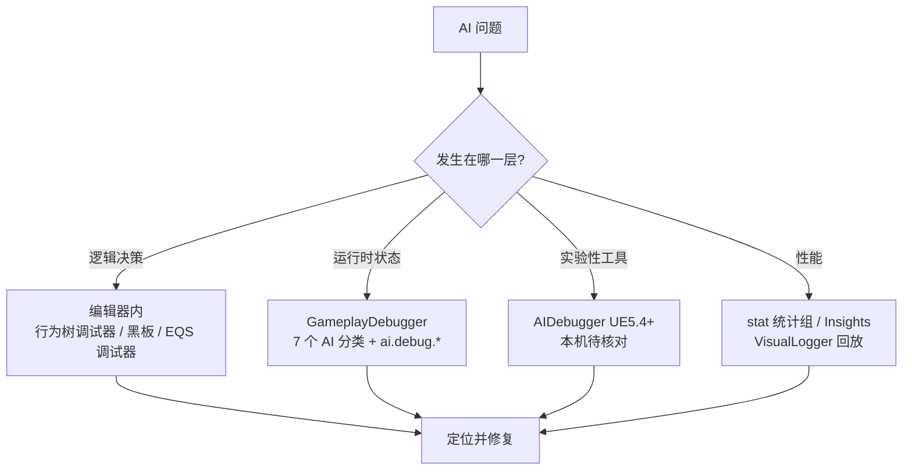
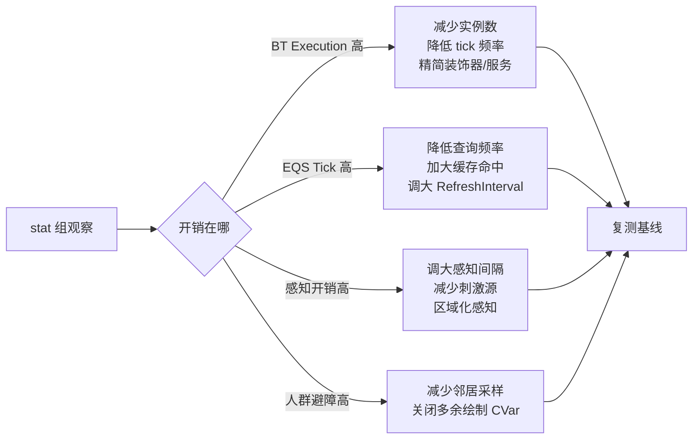
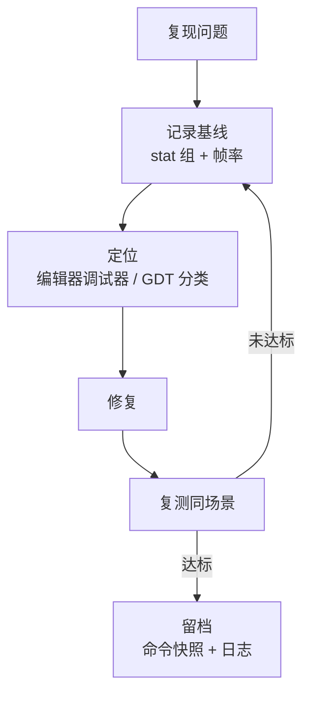

# 08 AI 调试与性能分析（AI Debugging & Performance Analysis）

> 版本基准：UE 5.8.0（本机 `Engine/Build/Build.version`：CL 55116800，分支 `++UE5+Release-5.8`）。
> 适用范围：AI 系统的运行时调试与性能分析方法，覆盖行为树（Behavior Tree）、感知（Perception）、EQS、NavMesh、人群避障（Crowd）与 Mass 相关调试命令与统计组；AIDebugger 为 UE5.4+ 实验性工具，本机发行版未包含，相关内容按官方文档描述并标注"待核对"。
> 事实边界：文中命令名、CVar、统计组与类名均先经本机 UE5.8 源码只读核对（标注文件:行号），无法核对项如实标注"待核对"，不虚构 API。
> 官方参考：[Unreal Engine UE5.8 官方文档总页](https://dev.epicgames.com/documentation/en-us/unreal-engine)。
> 最后更新：2026-08-07。

## 概述

AI 开发周期中，**调试与性能分析**往往占据比"写逻辑"更多的时间：行为树为什么不走预期的分支、感知为什么没看到目标、EQS 评分为什么异常、几百个 AI 同时 tick 时帧率为什么掉——这些问题都需要一套系统化的工具组合来定位。

UE 的 AI 调试工具分布在四个层面：

- **编辑器内（PIE）**：行为树调试器（Behavior Tree Debugger）、黑板监视、EQS 调试器、NavMesh 调试绘制；
- **运行时（GameplayDebugger，简称 GDT）**：AIModule 注册的 7 个 AI 分类，在游戏中实时查看行为树、感知、EQS、导航状态；
- **实验性工具（AIDebugger，UE5.4+）**：独立的 Agent 级 AI 调试窗口，本机 5.8 发行版未包含，按官方文档描述；
- **性能分析**：`stat` 统计组（Behavior Tree / Environment Query）、Unreal Insights、VisualLogger 回放。

本篇与 `../07-UI与性能优化/05-GameplayDebugger与运行时调试.md` 互补：那篇讲 GDT 的架构（服务端收集、客户端绘制、VisualLogger）与通用调试能力；本篇聚焦 **AI 场景的工具组合、命令与性能预算**。行为树、感知、NavMesh 的系统原理分别见本章 01/02/03 篇。

## 核心概念（表格）

| 概念 | 英文 | 说明 |
| --- | --- | --- |
| 行为树调试器 | Behavior Tree Debugger | 编辑器内调试面板：暂停/单步/断点、当前节点高亮、黑板值监视 |
| GameplayDebugger | GDT | 运行时调试工具（引擎模块 `Engine/Source/Runtime/GameplayDebugger`），AI 分类由 AIModule 注册 |
| AI 通用分类 | GameplayDebuggerCategory_AI | 头顶图标、AI 路径等通用绘制 |
| 行为树分类 | GameplayDebuggerCategory_BehaviorTree | 行为树运行时状态：当前节点链、黑板键值、执行统计 |
| 感知分类 | GameplayDebuggerCategory_Perception / _PerceptionSystem | 感知刺激、强度、衰减与遗忘、感知系统状态 |
| EQS 分类 | GameplayDebuggerCategory_EQS | EQS 查询结果与评分可视化 |
| 导航分类 | GameplayDebuggerCategory_Navmesh / _NavLocalGrid | 导航数据、局部网格可视化 |
| 绘制开关 | `ai.debug.*` | AI 分类的绘制 CVar 族（头顶图标/路径/刷新间隔） |
| 人群调试 | `ai.crowd.*` | CrowdManager 的避障调试 CVar 族（邻居/路径/速度障碍） |
| 统计组 | `Behavior Tree` / `Environment Query` | AIModule 声明的 `stat` 统计组，见 `BehaviorTreeTypes.h` / `EnvQueryTypes.h` |
| AIDebugger | AIDebugger | UE5.4+ 实验性 AI 调试插件（独立窗口、Agent 级状态查看），本机发行版未包含（待核对） |
| VisualLogger | Visual Logger | 基于 `UE_VLOG` 的日志回放，AI 决策过程留痕（详见 07-UI 章 05 篇） |

## 原理详解

### 1. AI 调试工具全景



图释：AI 问题先按"逻辑层 / 运行状态 / 性能"分层定位；编辑器工具解决"为什么这么决策"，GDT 解决"运行中到底发生了什么"，统计组解决"开销在哪"，VisualLogger 解决"历史帧回放"。

### 2. GameplayDebugger 的 AI 分类

AIModule 在 `Engine/Source/Runtime/AIModule/Private/GameplayDebugger/` 下提供了 7 个 AI 相关分类（本机 5.8 已核对）：

| 分类类名 | 关注内容 | 相关 CVar（本机核对） |
| --- | --- | --- |
| `GameplayDebuggerCategory_AI` | AI 通用：头顶图标、路径绘制 | `ai.debug.DrawOverheadIcons`、`ai.debug.DrawPaths`（`GameplayDebuggerCategory_AI.cpp:38-39`） |
| `GameplayDebuggerCategory_BehaviorTree` | 行为树执行状态：当前节点、黑板、统计 | — |
| `GameplayDebuggerCategory_EQS` | EQS 查询结果与评分 | `ai.debug.EQS.RefreshInterval`（`GameplayDebuggerCategory_EQS.cpp:22`） |
| `GameplayDebuggerCategory_Perception` | 单个感知组件：刺激、强度、遗忘 | — |
| `GameplayDebuggerCategory_PerceptionSystem` | 感知系统全局状态 | — |
| `GameplayDebuggerCategory_Navmesh` | 导航数据绘制 | `ai.debug.nav.DrawExcludedFlags`、`ai.debug.nav.DisplaySize`、`ai.debug.nav.RefreshInterval`（`GameplayDebuggerCategory_Navmesh.cpp:22-32`） |
| `GameplayDebuggerCategory_NavLocalGrid` | 局部网格（Local Grid）可视化 | — |

这些分类遵循 GDT 的"服务端收集 → 复制 → 客户端绘制"模型（详见 `../07-UI与性能优化/05-GameplayDebugger与运行时调试.md` 3.3-3.4 节）：AI 逻辑通常在服务器/权威端运行，GDT 通过网络把收集到的状态同步到显示端，因此联机项目默认就能看到服务器 AI 的状态。

### 3. GDT 控制台命令与 ai.debug.* 绘制开关

GDT 控制台命令定义在 `GameplayDebuggerLocalController.cpp:1205-1270`（`WITH_GAMEPLAY_DEBUGGER_MENU` 门控，本机已核对）：

| 命令 | 作用 |
| --- | --- |
| `EnableGDT` | 传统命令（legacy），开关 Gameplay Debugger |
| `gdt.Enable` | 启用 Gameplay Debugger |
| `gdt.Toggle` | 切换 Gameplay Debugger 开关 |
| `gdt.SelectLocalPlayer` | 选择本地玩家 |
| `gdt.SelectPreviousRow` / `gdt.SelectNextRow` | 切换调试目标（上一/下一行） |
| `gdt.ToggleCategory` | 切换指定索引的分类开关 |
| `gdt.EnableCategoryName <CategoryNamePart> [Enable]` | 按名称子串批量启用/禁用分类，如 `gdt.EnableCategoryName BehaviorTree 1` |
| `gdt.fontsize <fontSize>` | 设置调试字体大小（默认 10） |

`ai.debug.*` 是一组**绘制 CVar**，直接控制 AI 分类的绘制行为（本机核对）：

- `ai.debug.DrawOverheadIcons`：是否绘制 AI 头顶图标（如"当前状态"图标）；
- `ai.debug.DrawPaths`：是否绘制 AI 的移动路径；
- `ai.debug.EQS.RefreshInterval`：EQS 分类的刷新间隔（秒），数据量大时调大以降低开销；
- `ai.debug.nav.DrawExcludedFlags`：导航排除标记绘制；
- `ai.debug.nav.DisplaySize`：导航绘制尺寸；
- `ai.debug.nav.RefreshInterval`：导航分类刷新间隔。

典型组合：先 `gdt.Enable` 打开 GDT，再 `gdt.EnableCategoryName BehaviorTree` 只看行为树分类；发布/直播时用 `ai.debug.DrawOverheadIcons 0` 关闭头顶图标避免信息干扰。

### 4. 行为树调试实操

**编辑器内（PIE）**：行为树调试器提供暂停、单步执行、断点（在节点上打断点），并高亮当前执行节点；配合黑板面板实时查看键值变化，是"为什么走到这个分支"的首选工具。

**运行时（GDT）**：`GameplayDebuggerCategory_BehaviorTree` 显示当前节点链、黑板关键值与执行统计，适合"游戏中实时观察多只 AI"的场景；配合 `gdt.SelectNextRow` 在多个 AI 之间切换目标。

**耗时记录**：`BehaviorTree.RecordFrameSearchTimes`（`BehaviorTreeComponent.cpp:29`，默认 0）置 1 后，行为树会记录每帧搜索耗时用于性能统计；`BehaviorTree.ApplyAuxNodesFromFailedSearches`（`BehaviorTreeComponent.cpp:45`）控制搜索失败时辅助节点（Aux Node）的应用策略，两个均为调试/调优用途 CVar。

**留痕**：行为树运行事件可通过 `UE_VLOG` 写入 VisualLogger（记录节点切换、黑板赋值等），事后在 VisualLogger 中回放决策过程（结合 07-UI 章 05 篇）。

### 5. 感知与 EQS 调试

**感知（Perception）**：`GameplayDebuggerCategory_Perception` 显示单个感知组件收到的刺激（刺激源、类型、强度、衰减进度、遗忘状态）；`GameplayDebuggerCategory_PerceptionSystem` 显示感知系统的全局状态（注册的组件数、更新队列等）。常见用法：目标明明在视野内却没被感知到——查看刺激强度是否低于阈值、是否正在遗忘、感知半径/角度配置是否符合预期（感知系统原理见 02 篇）。

**EQS**：`GameplayDebuggerCategory_EQS` 把查询结果绘制在场景中（各选项的评分可视化），配合编辑器内 EQS 调试器（对指定查询执行单次运行并逐步查看生成器/测试的中间结果）定位"为什么选了这个点"。EQS 分类的刷新频率用 `ai.debug.EQS.RefreshInterval` 调节：查询量大时调大间隔，避免调试绘制本身成为性能瓶颈。

**性能注意**：EQS 是 AI 系统中开销较高的子系统，调试阶段应同时关注查询频率与缓存命中（EnvQueryManager 的查询缓存与预算参数以 `EnvQueryManager.cpp` 的 CVar 块为准，本机具体参数名**待核对**）；线上环境关闭 EQS 分类绘制。

### 6. NavMesh 与人群避障调试

**NavMesh**：`GameplayDebuggerCategory_Navmesh` 在运行时绘制导航网格与寻路数据，`ai.debug.nav.*` 控制绘制细节与刷新频率；`GameplayDebuggerCategory_NavLocalGrid` 可视化局部网格（动态障碍物附近的临时导航数据）。NavigationSystem 的调试绘制命令（`NavMesh.*` 等）本机源码未检索到明确注册，具体命令名**待核对**；实际使用以编辑器内 Navigation 调试绘制面板为主。

**人群避障（Crowd）**：CrowdManager 提供完整调试 CVar 族（`CrowdManager.cpp:47-82`，本机已核对）：

| CVar | 作用 |
| --- | --- |
| `ai.crowd.DebugSelectedActors` | 调试选中角色的避障 |
| `ai.crowd.DebugVisLog` | 避障数据写入 VisualLogger |
| `ai.crowd.DrawDebugCorners` | 绘制避障角点 |
| `ai.crowd.DrawDebugCollisionSegments` | 绘制碰撞线段 |
| `ai.crowd.DrawDebugPath` | 绘制路径 |
| `ai.crowd.DrawDebugVelocityObstacles` | 绘制速度障碍（VO） |
| `ai.crowd.DrawDebugPathOptimization` | 绘制路径优化结果 |
| `ai.crowd.DrawDebugNeighbors` | 绘制邻居关系 |
| `ai.crowd.DrawDebugBoundaries` | 绘制避障边界 |

### 7. AIDebugger（UE5.4+ 实验性工具）

AIDebugger 是 UE5.4 起官方引入的**实验性 AI 调试插件**，定位为独立于 GDT 的 Agent 级调试窗口：集中查看 AI 代理（Agent）的行为树状态、感知、黑板等信息，面向"成百上千 AI 的批量调试"场景。

**本机事实**：在 UE5.8 发行版安装（`C:\Program Files\Epic Games\UE_5.8\Engine`）中，`Plugins\Experimental` 目录**未包含 AIDebugger 插件**，AIModule 与 GameplayDebugger 源码中也无相关符号（已全引擎检索核对）；官方文档记载其位于引擎源码仓库的 `Engine/Plugins/Experimental/AIDebugger`（需源码编译或相应分发渠道提供，**待核对**）。因此本文不展开其 API 细节，实际能力与启用方式以官方文档与所用引擎版本为准。

### 8. AI 性能分析：统计组与预算

AIModule 声明了两个 `stat` 统计组（本机核对）：

| 统计组 | 源码声明 | 统计项 |
| --- | --- | --- |
| `Behavior Tree` | `BehaviorTreeTypes.h:34`（`STATGROUP_AIBehaviorTree`） | BT Tick、BT Load Time、BT Search Time、BT Execution Time、BT Auxiliary Update Time、BT Cleanup Time、BT Stop Tree Time、Num Templates、Num Instances、Instance memory |
| `Environment Query` | `EnvQueryTypes.h:39`（`STATGROUP_AI_EQS`） | Tick、Tick - EQS work、Tick - OnFinished delegates |

在控制台输入 `stat` 可列出全部统计组；AI 组名含空格（"Behavior Tree" / "Environment Query"），启用时按 `stat` 列表中的组名输入（含空格组名的精确输入方式以控制台 autocomplete 为准）。NavigationSystem 与感知系统在本机未检索到独立的 `DECLARE_STATS_GROUP`，相关统计口径**待核对**。



图释：性能调优是"观察 → 定位 → 降级 → 复测"的闭环；降级手段优先选**频率类**（tick 间隔、查询频率、刷新间隔），其次选**规模类**（实例数、邻居数、刺激源），最后才是砍功能。

**Mass AI**：Mass 体系的调试由 MassAI 插件的 `MassAIDebug` 模块提供（本机 `Plugins/AI/MassAI/Source/MassAIDebug` 已核对存在），结合 Mass 的 LOD 降级机制（详见 04 篇）做集群 AI 的预算控制；具体调试命令**待核对**。

### 9. AI 调试最佳实践

- **先编辑器后运行时**：逻辑问题先在 PIE 用行为树调试器/黑板定位，运行时状态问题再开 GDT；
- **按需开分类**：只开当前问题相关的分类，`gdt.EnableCategoryName` 精确控制，避免 7 个分类全开拖垮帧率；
- **绘制开关留档**：`ai.debug.*` / `ai.crowd.*` 绘制 CVar 记录到调试手册，联机/直播环境按需关闭；
- **性能基线先行**：动手优化前先记录 `stat` 组基线（帧耗时、实例数），优化后复测同一场景同一条件；
- **VisualLogger 留痕**：复杂决策问题在复现场景开启 `UE_VLOG`，事后回放比现场盯屏更高效；
- **发布前清理**：确认所有调试 CVar 默认值在 Shipping 下关闭（GDT 绘制默认仅开发构建）。

### 10. 调试环境与协作规范

AI 调试的结论要可复现、可交接，建议在团队内建立以下规范：

| 规范 | 说明 |
| --- | --- |
| 复现清单 | 记录复现场景、AI 数量、帧率与 `stat` 基线，保证"同样条件同样现象" |
| 命令快照 | 把定位问题的整套命令（GDT 分类 + CVar + stat 组）贴进 Bug 单 |
| 日志分级 | 关键决策用 `UE_VLOG`（VisualLogger），高频数据用 `AI_LOG` 分类过滤，避免刷屏 |
| 环境差异 | 编辑器/独立客户端/服务器三端分别验证，GDT 数据来源端不同（见 Q9） |
| 回归门禁 | 性能类修复后跑固定场景的基线对比（可结合 Gauntlet 自动化验收） |



图释：调试闭环以"同一场景、同一基线"为前提，结论以命令快照与日志留档，保证可交接、可回归。

## 代码 / 示例

### 1. 控制台命令速查表

```text
# GameplayDebugger（本机 GameplayDebuggerLocalController.cpp 核对）
gdt.Enable
gdt.Toggle
gdt.EnableCategoryName BehaviorTree 1      # 启用名称含 BehaviorTree 的分类
gdt.EnableCategoryName Perception 1
gdt.SelectNextRow                          # 切换到下一个调试目标
gdt.fontsize 12

# AI 分类绘制开关（本机核对）
ai.debug.DrawOverheadIcons 0
ai.debug.DrawPaths 1
ai.debug.EQS.RefreshInterval 0.5
ai.debug.nav.RefreshInterval 0.5

# 人群避障调试（本机 CrowdManager.cpp 核对）
ai.crowd.DebugSelectedActors 1
ai.crowd.DrawDebugNeighbors 1
ai.crowd.DrawDebugVelocityObstacles 1

# 行为树性能记录（本机 BehaviorTreeComponent.cpp 核对）
BehaviorTree.RecordFrameSearchTimes 1

# 统计组（组名含空格，以 stat 列表为准）
stat
```

### 2. 自定义 AI 分类注册（示意）

```cpp
// 示意：在模块 StartupModule 中注册一个 AI 专用 GDT 分类
// （完整生命周期与 CategoryReplicator 机制见 07-UI 章 05 篇 4.1/4.2 节）
#include "GameplayDebugger.h"
#include "GameplayDebuggerCategory_AI.h"   // 可继承内置 AI 分类扩展

void FMyAIModule::StartupModule()
{
    // 注册自定义分类（类需继承 FGameplayDebuggerCategory）
    IGameplayDebugger::Get().RegisterCategory(
        TEXT("MyAICategory"),
        IGameplayDebugger::FOnGetCategory::CreateStatic(&FMyAICategory::MakeInstance),
        EGameplayDebuggerCategoryState::EnabledInGameAndSimulate,
        5 /* 显示顺序 */);
}
```

> 节选/示意：`RegisterCategory` 接口签名以本机 `GameplayDebuggerAddonManager.h` 为准（源码分析见 07-UI 章 05 篇）。

### 3. VisualLogger 记录 AI 决策（示意）

```cpp
// 示意：在行为树服务/任务中记录关键决策
#include "VisualLogger/VisualLogger.h"

UE_VLOG(OwnerComp.GetAIOwner(), LogBehaviorTree, Log,
        TEXT("SwitchToState: %s (target=%s)"),
        *StateName.ToString(), *TargetName.ToString());
```

## 最佳实践

- 建立"AI 调试手册"：把常用 `gdt.*` / `ai.debug.*` / `ai.crowd.*` 命令与用途固化进团队文档（即本篇速查表）；
- 调试期开启、发布期关闭：所有绘制 CVar 只影响开发构建，但养成上线前检查的习惯；
- 用 VisualLogger 代替"现场盯屏"：复杂 AI 问题先复现录日志，再离线回放；
- 性能问题按"stat 组 → 降级 → 复测"闭环处理，每次只改一个变量；
- 大世界/集群 AI 优先考虑 Mass + LOD 降级（04 篇），而不是无脑降低单 AI 质量。

## 常见问题 FAQ

**Q1：按下快捷键后 GDT 打开了，但看不到任何 AI 分类？**
先确认目标 AI 属于当前调试的本地玩家/服务器；用 `gdt.SelectNextRow` 切换目标，用 `gdt.EnableCategoryName BehaviorTree` 等命令显式打开分类。

**Q2：`ai.debug.DrawOverheadIcons` 设了 1 但没图标？**
该 CVar 控制 AI 分类的头顶图标绘制，需同时打开 `GameplayDebuggerCategory_AI` 分类；另外确认是开发构建（Shipping 下 GDT 绘制默认关闭）。

**Q3：行为树编辑器调试与 GDT 分类显示不一致？**
编辑器调试器基于 PIE 本地权威，GDT 可能显示服务器/远程权威数据；两者采样时机不同属正常现象，联机环境以 GDT 为准。

**Q4：EQS 分类刷新太快，帧率明显下降？**
调大 `ai.debug.EQS.RefreshInterval`（如 0.5 秒），同时考虑降低查询本身的频率与提高缓存命中（EnvQueryManager 缓存参数以源码为准，待核对）。

**Q5：大量 AI 时 GDT 很卡怎么办？**
只保留当前问题相关分类、调大各分类 `RefreshInterval`、用 `gdt.SelectNextRow` 单目标观察而非全量绘制；联机项目可参考 07-UI 章 05 篇的远程调试模式。

**Q6：AIDebugger 在哪里打开？**
本机 UE5.8 发行版未包含 AIDebugger 插件（Plugins\Experimental 无此目录，全引擎检索无命中）；官方记载为 UE5.4+ 实验性插件，需源码编译或相应分发渠道提供（待核对）。

**Q7：`stat` 列表里找不到 "Behavior Tree" 组？**
组名含空格，按 `stat` 列表中的完整组名输入；确认在开发/调试构建中运行（Shipping 下统计可能被裁剪）。

**Q8：人群避障时看不到邻居/路径绘制？**
确认使用的是 Crowd 代理（`bEnableCrowdSimulation`），并打开对应 CVar：`ai.crowd.DrawDebugNeighbors`、`ai.crowd.DrawDebugPath`、`ai.crowd.DrawDebugVelocityObstacles`。

**Q9：联机环境下服务器 AI 怎么调试？**
GDT 的 AI 分类收集发生在 AI 所在端（服务器），通过网络复制到客户端绘制；详见 07-UI 章 05 篇 3.6 节"远程调试"。

**Q10：`BehaviorTree.RecordFrameSearchTimes` 开了之后在哪看结果？**
该 CVar 让行为树组件记录每帧搜索耗时用于性能统计，配合 `stat` 的 "Behavior Tree" 组（BT Search Time）观察；调优完成记得复位为 0。

## 关联阅读

- 本知识库：[01-行为树详解.md](01-行为树详解.md)（行为树结构与调试器原理）
- 本知识库：[02-感知系统与EQS.md](02-感知系统与EQS.md)（感知刺激与 EQS 查询原理）
- 本知识库：[03-NavMesh寻路.md](03-NavMesh寻路.md)（导航网格与避障原理）
- 本知识库：[04-Mass实体框架与群集模拟.md](04-Mass实体框架与群集模拟.md)（Mass LOD 与集群 AI 预算）
- 本知识库：[05-GameplayDebugger与运行时调试.md](../07-UI与性能优化/05-GameplayDebugger与运行时调试.md)（GDT 架构、VisualLogger、自定义分类）
- [UE 官方文档：Gameplay Debugger](https://dev.epicgames.com/documentation/en-us/unreal-engine/gameplay-debugger-in-unreal-engine)
- [UE 官方文档：AIDebugger](https://dev.epicgames.com/documentation/en-us/unreal-engine/aidebugger-in-unreal-engine)（UE5.4+，本机待核对）

## 更新日志

- 2026-08-07：创建。命令/CVar/统计组均经本机 UE5.8（CL 55116800）源码核对；AIDebugger 因本机发行版未包含而标注"待核对"。
