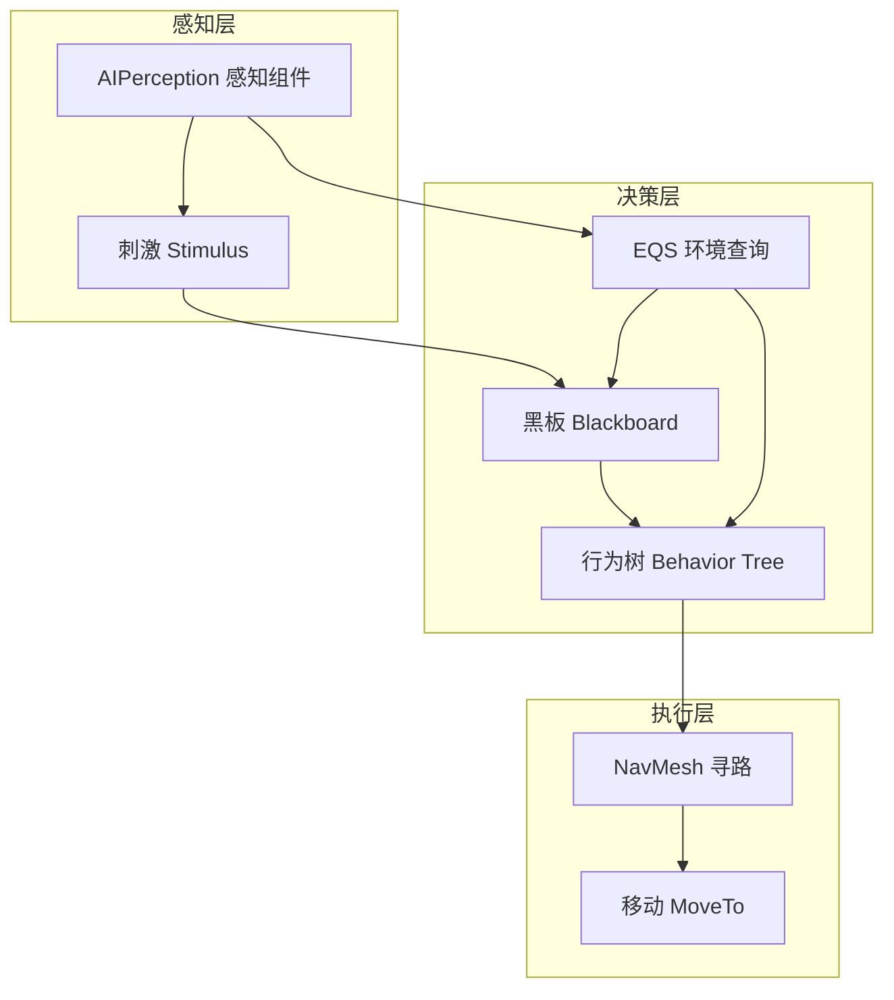

# 05 - AI 系统

## 分类简介

本分类收录虚幻引擎（Unreal Engine 4 / UE5）AI 系统的核心知识文档，覆盖游戏 AI 的三大支柱：

1. **行为树（Behavior Tree）** —— 游戏 AI 的"大脑"，负责决策逻辑的组织与执行；
2. **感知系统与 EQS（Environment Query System）** —— AI 的"感官"，负责发现目标、评估环境、选择最优位置；
3. **NavMesh 寻路（Navigation Mesh）** —— AI 的"双腿"，负责在场景中安全、高效地移动。

三者协同工作，构成 UE 中一个完整、可扩展的游戏 AI 框架：感知系统发现目标 → 行为树根据黑板数据做决策 → 导航系统执行移动。文档以中文撰写，包含 Mermaid 结构图、C++ 扩展示例、最佳实践与常见问题，适合从入门到进阶的 UE 开发者阅读。

## 文件列表

| 文件 | 一句话简介 |
| --- | --- |
| [01-行为树详解.md](01-行为树详解.md) | 深入剖析 Behavior Tree 的节点类型、执行流程、黑板数据共享，以及如何用 C++ 编写自定义任务/装饰器/服务节点。 |
| [02-感知系统与EQS.md](02-感知系统与EQS.md) | 讲解 AIPerception 视觉/听觉/触觉感知机制、刺激与侦测流程，以及 EQS 环境查询的生成器、测试、上下文与评分原理。 |
| [03-NavMesh寻路.md](03-NavMesh寻路.md) | 详解 NavMesh 生成与烘焙、寻路原理（A*）、NavLinkProxy 动态连接、避障与性能优化要点。 |
| [04-Mass实体框架与群集模拟.md](04-Mass实体框架与群集模拟.md) | UE5 Mass 生态：MassEntity ECS、Spawner、Representation、LOD 与大规模群集模拟。 |
| [05-StateTree状态树.md](05-StateTree状态树.md) | StateTree 状态树：State/Task/Evaluator/Transition、与行为树对比、Mass 配合与选型。 |
| [06-ZoneGraph与SmartObjects.md](06-ZoneGraph与SmartObjects.md) | ZoneGraph 导航走廊空间数据、SmartObjects 智能对象交互、GameplayInteractions 与 Mass 协作。 |

## 学习顺序建议

1. **第一阶段（入门，约 1 周）**：通读《01-行为树详解》，掌握 Behavior Tree 编辑器中的常用节点（选择/顺序/并行、任务、装饰器、服务），理解"黑板 = 数据层、行为树 = 逻辑层"的分层思想，并完成一个"巡逻 → 发现目标 → 追击"的简单 AI。
2. **第二阶段（进阶，约 1 周）**：学习《02-感知系统与EQS》，把"发现目标"从蓝图写死升级为 AIPerception 视觉/听觉感知，再用 EQS 让 AI 在战斗中自动寻找掩体或最佳射击位置。
3. **第三阶段（综合，约 1 周）**：学习《03-NavMesh寻路》，理解寻路代价、动态障碍、NavLink 跳点与性能优化，最后把三者组合成一个完整的战斗 AI 原型，并在项目实际场景中验证运行性能。
4. **贯穿始终的实践建议**：每篇文档末尾都有"动手练习"，建议在空白工程中逐个实现；遇到性能问题时，优先使用 UE 自带的 AI 调试工具（`ai.debug.*` 控制台命令、EQS 调试器、NavMesh 可视化）。

## 文档间的关系

> 提示：阅读时建议搭配 UE 官方文档《Artificial Intelligence in Unreal Engine》与源码 `Engine/Source/Runtime/AIModule/` 目录下的实现，文档中涉及的类名均为真实源码类名，可直接在 IDE 中跳转查看。
