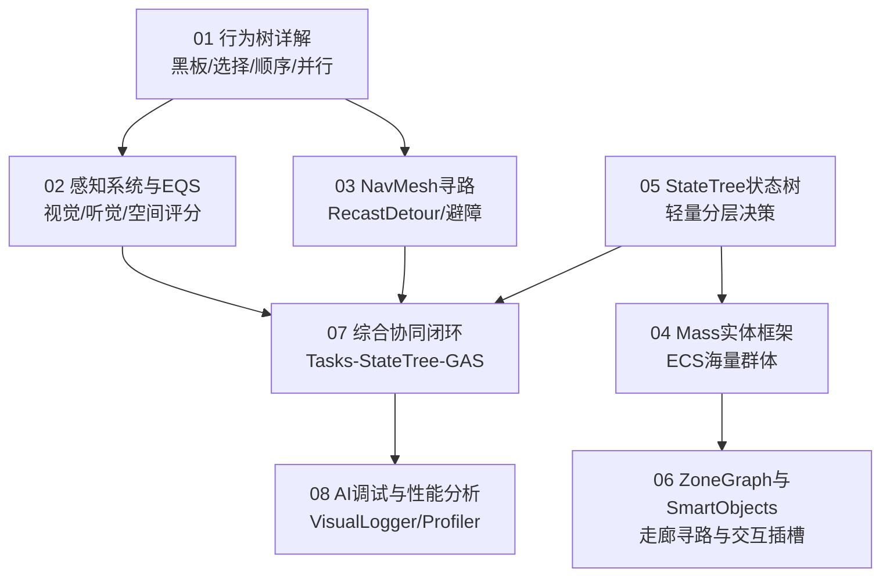

# 05 AI系统

> 知识成熟度：L2（子域工程手册，已按 8 篇核心专题与 UE5.8 源码基线全面标准化）。
>
> 领域权威导航：[游戏知识 Domain MOC](../../00_Index/domains/游戏知识.md) ｜ [游戏知识总目录](../README.md)。

---

## 1. 核心定位与设计思想

「05-AI系统」负责虚幻引擎中 NPC、怪物、伴随伙伴与大规模群体的自主行为逻辑。UE5 提供了从传统单体有限状态决策到现代数据驱动的大规模群体模拟全谱系架构：
- **感知与决策三大支柱**：通过 AIPerception（感知系统）收集视听刺激，由 Environment Query System（EQS）进行空间位置打分筛选，并在 Behavior Tree（行为树）中通过黑板（Blackboard）事件驱动执行决策；
- **空间感知与动态寻路**：集成工业级 Recast/Detour 导航网格（NavMesh），支持动态障碍物切割、NavLink 跨越跳跃以及异步寻路请求；
- **现代通用决策与交互模型**：引入 StateTree 通用分层状态树框架与 SmartObjects（智能对象），实现环境交互插槽与状态机的高内聚解耦；
- **次时代海量实体模拟（Mass）**：基于 ECS（实体-组件-系统）数据驱动架构，利用连续内存 Archetype 与 Chunk 迭代，突破传统 Actor 性能瓶颈，支撑上万级别的城市人流与战争群集。

---

## 2. 专题矩阵与知识状态

| 专题文件（Canonical 路径） | 知识类型 | 成熟度 | 核心工程关注点与落地场景 |
| :--- | :---: | :---: | :--- |
| [01-行为树详解.md](../../知识/06-游戏AI/感知决策与行为规划/01-行为树详解.md) | Concept | L2 | BehaviorTree 执行模型、Composite（选择/顺序/简单并行）、Decorator 条件打断、Task 任务与 Blackboard 数据共享 |
| [02-感知系统与EQS.md](../../知识/06-游戏AI/感知决策与行为规划/02-感知系统与EQS.md) | Concept | L2 | AIPerceptionComponent 视觉/听觉感知配置、刺激源（Stimulus）、EQS 查询上下文、生成器/测试评分函数与最优掩体筛选 |
| [03-NavMesh寻路.md](../../知识/06-游戏AI/导航移动与群体协同/03-NavMesh寻路.md) | Concept | L2 | Recast/Detour 导航网格烘焙、NavMeshBoundsVolume 动态切分、NavLinkProxy 攀爬跳点、RVO 避障与寻路代价优化 |
| [04-Mass实体框架与群集模拟.md](../../知识/06-游戏AI/导航移动与群体协同/04-Mass实体框架与群集模拟.md) | Concept | L2 | UE5 Mass 生态：MassEntity ECS 架构、Fragments/Tags 内存布局、Processors 批处理执行、LOD 降级与海量群集模拟 |
| [05-StateTree状态树.md](../../知识/06-游戏AI/感知决策与行为规划/05-StateTree状态树.md) | Concept | L2 | StateTree 分层状态机架构、State/Task/Evaluator/Transition 条件状态转移、与 MassEntity 和 Actor 深度集成 |
| [06-ZoneGraph与SmartObjects.md](../../知识/06-游戏AI/导航移动与群体协同/06-ZoneGraph与SmartObjects.md) | Concept | L2 | ZoneGraph 走廊空间拓扑、SmartObjects 环境交互槽位声明、Claim 认领与释放机制、NPC 动作无缝衔接 |
| [07-GameplayTasks-StateTree-GAS-AI协同.md](../../知识/06-游戏AI/感知决策与行为规划/07-GameplayTasks-StateTree-GAS-AI协同.md) | Concept | L2 | 组合 GameplayTasks、StateTree、GAS 与 NavMesh，落地可中断、可恢复、带确认与可观测的 AI 战斗闭环 |
| [08-AI调试与性能分析.md](../../知识/06-游戏AI/评测安全与运行预算/08-AI调试与性能分析.md) | Concept | L2 | Visual Logger 行为录制回放、GameplayDebugger AI 七大分类、控制台调试命令体系与 AI Tick 预算治理 |

---

## 3. 逻辑学习顺序建议

```mermaid
flowchart TD
    A[01 行为树详解<br/>黑板/选择/顺序/并行] --> B[02 感知系统与EQS<br/>视觉/听觉/空间评分]
    A --> C[03 NavMesh寻路<br/>RecastDetour/避障]
    B --> D[07 综合协同闭环<br/>Tasks-StateTree-GAS]
    C --> D
    E[05 StateTree状态树<br/>轻量分层决策] --> D
    F[04 Mass实体框架<br/>ECS海量群体] --> G[06 ZoneGraph与SmartObjects<br/>走廊寻路与交互插槽]
    E --> F
    D --> H[08 AI调试与性能分析<br/>VisualLogger/Profiler]
```

1. **第一阶段（经典 AI 三大支柱）**：精读 `01-行为树详解`、`02-感知系统与EQS` 与 `03-NavMesh寻路`，构建完整的“感知刺激 → 黑板记录 → 行为树评估 → 寻路移动”闭环。
2. **第二阶段（现代决策与系统协同）**：研读 `05-StateTree状态树` 与 `07-GameplayTasks-StateTree-GAS-AI协同`，掌握现代 UE5 状态树轻量化决策与 GAS 技能战斗无缝打通。
3. **第三阶段（现代 Mass 与环境交互）**：学习 `04-Mass实体框架与群集模拟` 与 `06-ZoneGraph与SmartObjects`，攻克大规模城市 NPC 模拟、道路走向约束与场景物体交互。
4. **第四阶段（调试与生产运维）**：深入 `08-AI调试与性能分析`，掌握 Visual Logger 录制排查行为树震荡死锁与 AI Tick 帧开销分析。

---

## 4. 游戏与引擎工程落地场景

- **智能走位与掩体战术**：利用 EQS 沿掩体边界生成测试点（Generator），计算到玩家视线的距离与法线夹角（Test），使 AI 自动寻找视野死角换弹；
- **万人战场同屏流畅运行**：将海量士兵从传统 ACharacter 迁移到 MassEntity，实体数据以 SoA（结构体数组）连续排列在 Chunk 中，并行执行移动与避免碰撞；
- **酒馆生活化交互**：在桌椅、吧台布置 SmartObject 交互插槽，巡逻 AI 在 StateTree 驱动下动态认领（Claim）空闲椅子并无缝过渡到坐下动画。

---

## 5. 跨域技术依赖与前后置导航

- **向下扎根（计算机与算法底座）**：
  - 图论搜索与 A* 寻路：[游戏算法 01-寻路与图论](../../游戏算法/01-寻路与图论/README.md)
  - Recast/Detour 原理与确定性：[游戏算法 04-确定性与基准工程](../../游戏算法/04-确定性与基准工程/README.md)
  - 通用 AI 决策模型（FSM/BT/GOAP/Utility）：[游戏AI 01-决策与架构](../../游戏AI/01-决策与架构/README.md)
- **向上驱动（引擎源码剖析）**：
  - 行为树与 AI 源码：[12-12 行为树与AI源码](../../知识/06-游戏AI/感知决策与行为规划/12-行为树与AI源码.md)
  - Mass 与 StateTree 源码：[12-21 Mass与StateTree源码](../../知识/06-游戏AI/导航移动与群体协同/21-Mass与StateTree源码.md)
  - Lyra 机器人与队伍源码：[12-46 Lyra-AI机器人源码](../../知识/06-游戏AI/战斗战术与机器人/46-Lyra-AI机器人与队伍源码.md)
- **横向协同（玩法与实战）**：
  - 技能触发与属性修改：[03-游戏玩法编程](../03-游戏玩法编程/README.md)
  - 假人 AI 完整链路：[系统实战 07-假人AI完整链路](../../知识/06-游戏AI/战斗战术与机器人/07-假人AI完整链路.md)
