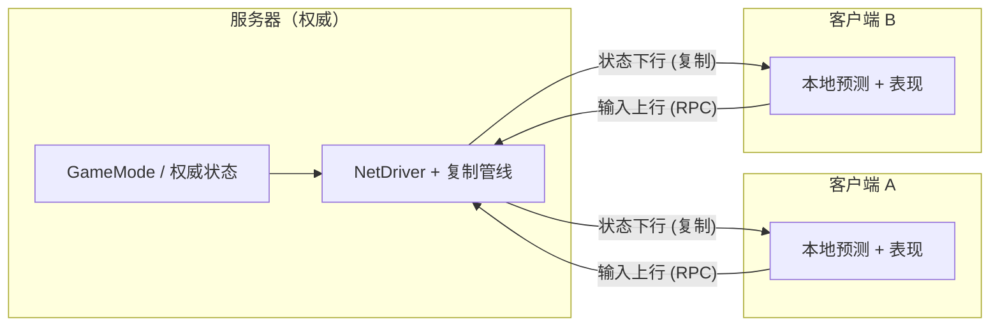
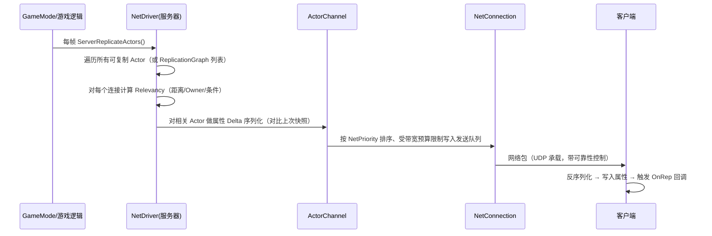
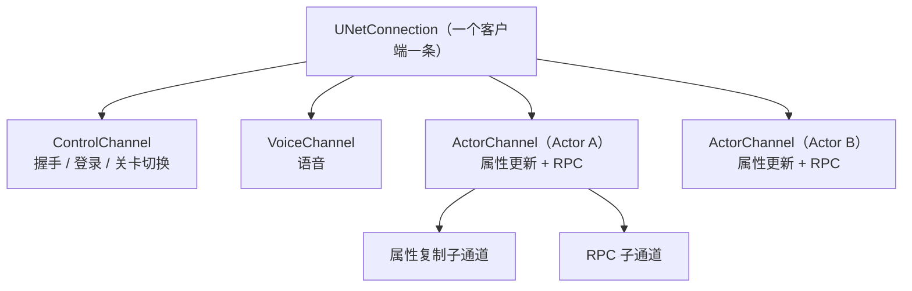
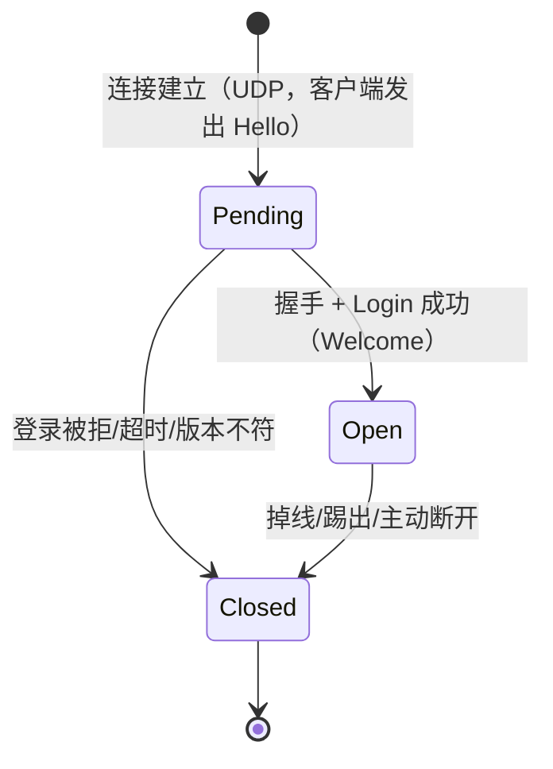

# 01 · 网络架构与复制基础

> 本篇是「06-网络同步」分类的第一篇，回答两个根本问题：
> **① 谁说了算？**（客户端-服务器架构与权威性）　**② 东西怎么传到别人机器上？**（Actor 复制）。
> 适用版本：UE 5.0 ~ 5.5，涉及 Iris 处会单独标注。

---

## 一、概述

UE 的多人在线游戏默认采用**客户端-服务器（Client-Server）架构**：一台机器作为服务器（Server）持有全部游戏状态的"权威副本"，其余机器作为客户端（Client）连接服务器并接收状态更新。与此相对的是 P2P（点对点）架构，UE 在早期版本中曾支持（如 UE3 的 P2P 支持），现代 UE 网络系统已经完全围绕 Client-Server 设计，原因在于：

- **权威集中**：只有一个权威者，杜绝"各说各话"，天然解决冲突裁决与作弊问题；
- **状态一致**：所有客户端看到的是同一份由服务器广播的状态；
- **实现简单**：不需要复杂的分布式一致性算法（如向量时钟、选举）；
- **带宽可预期**：流量模型是"星型"，服务器可以统一做带宽调度与压缩。

复制（Replication）是 UE 实现"状态一致"的核心机制：**服务器把 Actor 的属性、RPC、生成与销毁事件自动同步到相关客户端**，开发者只需要声明"哪些属性要复制、按什么条件复制"，剩下的序列化、发送、应用由引擎完成。

本篇先建立架构与权威性的全局观，再深入 Actor 复制管线（bReplicates、Replicated、Relevancy、频率与优先级），最后介绍 NetConnection 与通道模型，并简述 UE5 的新一代复制系统 Iris。

---

## 二、核心概念（速查表）

### 2.1 网络模式（NetMode）：当前进程是什么角色

| 枚举值 | 含义 | 说明 |
| --- | --- | --- |
| `NM_Standalone` | 单机模式 | 无网络，本地即权威，常用于开发调试 |
| `NM_DedicatedServer` | 专用服务器 | 无渲染、无本地玩家的纯逻辑服务器（无头服务器） |
| `NM_ListenServer` | 监听服务器 | 一台机器既是服务器又是客户端（主机玩家），如局域网联机/合作游戏 |
| `NM_Client` | 客户端 | 只连接到服务器，本地没有权威 |

获取方式：`GetNetMode()`（Actor 内）、`GetWorld()->GetNetMode()`。`GIsServer` / `GIsClient` 等全局标志是早期遗留，推荐一律用 `GetNetMode()`。

### 2.2 网络角色（NetRole）：某个 Actor 在某连接视角下是什么角色

| 枚举值 | 含义 | 谁拥有 |
| --- | --- | --- |
| `ROLE_None` | 不参与复制 | 静态装饰物等 |
| `ROLE_SimulatedProxy` | 模拟代理 | 客户端上"看到"的其他玩家 Pawn |
| `ROLE_AutonomousProxy` | 自主代理 | 客户端上"自己控制"的 Pawn |
| `ROLE_Authority` | 权威 | 服务器上的所有复制 Actor；单机时本地也是 Authority |

关键 API：`GetLocalRole()`（本地视角的角色）、`GetRemoteRole()`（对端视角的角色）、`HasAuthority()`（是否为权威）。

### 2.3 Actor 复制相关属性

| 属性/API | 作用 |
| --- | --- |
| `AActor::bReplicates` | 开关：该 Actor 是否参与复制（属性 + RPC 的前提） |
| `SetReplicates(bool)` | 运行时开关复制 |
| `UPROPERTY(Replicated)` | 声明该属性需要复制 |
| `UPROPERTY(ReplicatedUsing=OnRep_X)` | 复制并在客户端收到时回调 `OnRep_X` |
| `GetLifetimeReplicatedProps()` | 注册需要复制的属性列表（`DOREPLIFETIME` 系列宏） |
| `bNetStartup` | 是否关卡启动 Actor（静态放置，客户端加载关卡时直接本地生成而非复制生成） |
| `bNetLoadOnClient` | 静态放置 Actor 是否也随关卡在客户端加载 |
| `bOnlyRelevantToOwner` | 只复制给 Owner 连接 |
| `bAlwaysRelevant` | 无视距离始终复制 |
| `bNetUseOwnerRelevancy` | 相关性跟随 Owner |
| `NetUpdateFrequency` | 每秒检查并发送更新的频率（默认 100） |
| `NetPriority` | 发送优先级（默认 1.0），带宽紧张时决定谁先发 |
| `NetCullDistanceSquared` | 相关性剔除距离的平方（超出则不复制） |
| `bTearOff` | 撕裂：服务器停止更新，客户端接管本地模拟 |
| `bReplicateMovement` | Pawn 的移动数据是否复制（通常由移动组件管理） |

### 2.4 连接与通道

| 概念 | 说明 |
| --- | --- |
| `UNetDriver` | 网络驱动，管理整个进程的网络收发（每个 World 一个） |
| `UNetConnection` | 服务器与**一个**客户端之间的逻辑连接（双向） |
| `UChannel` | 连接内的通信子通道：控制通道、语音通道、Actor 通道 |
| `ControlChannel` | 连接控制：握手、关卡切换通知、玩家登录等系统消息 |
| `VoiceChannel` | 语音聊天数据 |
| `ActorChannel` | 每个被复制的 Actor 一条，承载属性更新与 RPC |

---

## 三、原理详解

### 3.1 客户端-服务器架构

#### 3.1.1 为什么选择客户端-服务器



所有客户端都只与服务器通信，客户端之间**不直接通信**（语音除外）。任何需要"所有人都知道"的变化，都必须先由服务器确认，再广播出去。

#### 3.1.2 监听服务器 vs 专用服务器

| 对比项 | 监听服务器（Listen Server） | 专用服务器（Dedicated Server） |
| --- | --- | --- |
| 是否渲染 | 渲染（主机玩家也要看画面） | 不渲染（无头） |
| 是否有本地玩家 | 有（主机玩家） | 无 |
| 主机玩家角色 | `ROLE_Authority`，本地直连，无网络延迟 | —— |
| 部署成本 | 低（一台 PC 即可） | 高（需要服务器资源/机房） |
| 典型场景 | 合作游戏、局域网联机、小规模 PvP | 大规模 PvP、商业化运营 |
| 风险 | 主机掉线=全员掉线；主机可能利用权威作弊 | 公平性最好，但延迟对所有玩家都存在 |
| 反作弊 | 需要额外防护主机端 | 服务器可控，防护容易 |

开发时通常两种模式共用同一套代码：通过 `GetNetMode()` 区分，但**业务逻辑不应依赖具体模式**，只应依赖 `HasAuthority()`。

#### 3.1.3 权威性（Authority）

**权威性原则：一切影响游戏结果的逻辑都应在服务器执行。** 具体体现：

- 伤害结算、得分、掉落、解锁等"结果类"逻辑：服务器判定；
- 移动最终位置：服务器裁决（客户端可预测，但以服务器为准）；
- 生成/销毁 Actor：服务器执行；
- 客户端只能"请求"（通过 Server RPC），不能"直接改"（不能直接修改复制属性的服务器副本）。

违反权威性原则的典型表现：客户端本地改了血量就广播——这是典型的作弊入口与状态不一致来源。

### 3.2 Actor 复制

#### 3.2.1 复制的三个前提

一个 Actor 要从服务器复制到客户端，需要同时满足：

1. **服务器上 `bReplicates == true`**（或在 Spawn 后调用 `SetReplicates(true)`）；
2. **有需要复制的数据**：至少一个 `Replicated` 属性，或存在会被调用的跨网络 RPC；
3. **与目标连接相关（Relevant）**：通过了相关性判定，且双方存在 Actor 通道。

注意：`bReplicates` 只是"允许复制"，不代表"每帧都发"。属性只有在**服务器上被修改**（与上次发送快照不同）时才会被序列化发送。

#### 3.2.2 复制管线（服务器视角）



关键点：

- **Delta 序列化**：每次更新只发送"变化的部分"，而不是整个 Actor。引擎在 `FRepLayout` 中保存每个复制属性的上次发送值，逐属性比较（本质是内存快照对比），只打包发生变化的属性。
- **初始快照**：Actor 通道刚建立时（如新玩家加入），会发送一次**完整初始状态**（所有复制属性的当前值 + 已有 RPC 的补发？—— RPC 不补发，Reliable RPC 只保证送达已发出的）。
- **带宽预算**：每个连接每帧能发送的字节数受服务器/客户端速率设置限制（如 `MaxClientRate`），`NetPriority` 决定同一帧内发送顺序，`NetUpdateFrequency` 决定 Actor 被纳入发送检查的频率。

#### 3.2.3 相关性（Relevancy）

服务器不需要（也不应该）把场景里每个 Actor 都发给每个客户端。相关性判定决定了"谁该收到谁"：

| 判定因素 | 说明 |
| --- | --- |
| 距离 | `NetCullDistanceSquared`，超出剔除（默认对大多数 Actor 生效） |
| `bAlwaysRelevant` | 无视距离，始终相关（如 GameState、关键事件 Actor） |
| `bOnlyRelevantToOwner` | 只对 Owner 连接相关（如玩家自身的武器、HUD 数据） |
| `bNetUseOwnerRelevancy` | 跟随 Owner 的相关性（挂在玩家身上的装饰物） |
| 可见性 | 旧版 `UNetDriver` 中可选基于视锥/遮挡的判定，现代版本主要用距离 + 兴趣管理 |
| Replication Graph | UE 4.20+ 的 `UNetReplicationGraph` 可编程的兴趣管理框架（网格分区等） |

相关性直接决定带宽与性能：**每多一个相关的 Actor，就多一份带宽开销**。大规模世界强烈建议使用 Replication Graph 做空间分区（2D 网格），把"遍历所有 Actor × 所有连接"的 O(N×M) 变成 O(N+M) 级别。

#### 3.2.4 NetUpdateFrequency 与 NetPriority

- `NetUpdateFrequency`：Actor 每秒最多被检查/发送更新的次数。调低可省带宽（如装饰物 5~10Hz），调高可提高实时性（如玩家 30~100Hz）。
- `NetPriority`：同一时刻带宽不足时，谁的更新先发。引擎内部按 `NetPriority` 与 `NetUpdateFrequency` 综合排序（高优先级、低频 Actor 的更新更早进入发送队列）。
- 二者都是"软性"控制：实际发送节奏还受服务器 `NetServerMaxTickRate`、连接速率上限与当前拥塞状态影响。

#### 3.2.5 TearOff（撕裂）

`bTearOff = true` 后，服务器停止对该 Actor 的复制，把它"交给"客户端本地模拟。典型场景：投掷物落地后的残骸、爆炸后的粒子、已经结算完的物体。被撕裂的 Actor 在客户端上不再接收更新，但依然存在于本地世界中（用最后的状态继续模拟）。

#### 3.2.6 复制与 RPC 的关系

属性复制是"状态"同步，RPC 是"事件"同步：

| 维度 | 属性复制 | RPC |
| --- | --- | --- |
| 粒度 | 属性（数据） | 函数（行为） |
| 触发 | 服务器修改属性 → 自动检测 → 发送 | 显式调用 → 序列化参数 → 发送 |
| 典型用途 | 血量、位置、状态、得分 | 开火、开门、请求、通知 |
| 是否要求 Actor 复制 | 是 | 是（需要 Actor 通道） |
| 丢失行为 | 自然覆盖为最新值 | Unreliable 可能丢失；Reliable 保证送达 |

### 3.3 NetConnection 与通道

#### 3.3.1 UNetConnection

`UNetConnection` 表示服务器与单个客户端之间的完整逻辑连接，包含：

- `RemoteAddr`：对端 IP 与端口（`FInternetAddr`）；
- `PlayerController` / `OwningActor`：与该连接绑定的玩家控制器；
- `Channels`：该连接下所有通道的集合；
- `Driver`：所属 NetDriver；
- 连接状态：`Invalid → Pending → Open → Closed`；
- 流量统计：发送/接收字节、丢包统计、拥塞控制状态。

UE 的网络传输默认基于 **UDP**（IP 层之上自带可靠性、确认、重传与拥塞控制），`UNetConnection` 的包序与可靠性由引擎内部协议保证。服务器通过 `UNetDriver::ServerConnection`（客户端视角）与 `UNetDriver::ClientConnections`（服务器视角，数组）管理连接。

#### 3.3.2 通道模型



- **ControlChannel**：系统级消息（`NMT_*` 系列），如 `NMT_Hello`、`NMT_Login`、`NMT_Welcome`、关卡旅行通知；也承载关卡流送（Level Streaming）的加载同步。
- **VoiceChannel**：VoIP 语音数据（需开启语音功能配置）。
- **ActorChannel**：每个被复制的 Actor 一条；Actor 的生成、属性更新、RPC 都走它。通道建立时客户端会在本地生成对应 Actor（若还不存在）。

#### 3.3.3 连接生命周期



握手与登录的详细消息时序见本分类 `04-多人游戏框架与玩家状态.md`。

### 3.4 UE5 新特性：Iris 复制系统（简述）

- **Iris** 是 UE5 引入的新一代对象复制系统（UE5.4 起以实验性状态随引擎发布，5.5 继续完善），目标是替代传统的"每 Actor 一条通道 + 属性快照对比"实现。
- 核心改进：**显式的对象复制模型（`FObjectReplicationBridge`）**、更细粒度的带宽控制、更好的扩展性（可插拔的过滤器与优先级策略）、对大规模场景与 DDoS 防护更友好。
- 现状：实验性，需要额外模块与配置启用（通常要求自定义构建/项目配置），**生产项目仍以传统复制为主**；但新项目应关注其 API 演进，因为官方计划逐步将其设为默认。
- 对开发者而言：`UPROPERTY(Replicated)`、`DOREPLIFETIME`、RPC 的**上层语法保持不变**，Iris 替换的是底层管线，因此学习传统复制仍然完全有效。

---

## 四、代码示例

### 4.1 开启 Actor 复制

```cpp
// 方式一：构造函数中开启（推荐，简单直接）
AMyPickup::AMyPickup()
{
    bReplicates = true;
}

// 方式二：运行时开启
void AMyPickup::BeginPlay()
{
    Super::BeginPlay();
    if (HasAuthority())
    {
        SetReplicates(true);
    }
}
```

### 4.2 声明复制属性

```cpp
UCLASS()
class AMyPickup : public AActor
{
    GENERATED_BODY()

public:
    AMyPickup();

    // 普通复制：值变了就同步
    UPROPERTY(Replicated, BlueprintReadOnly)
    int32 PickupCount = 0;

    // 复制 + 客户端通知：收到新值时调用 OnRep_Health
    UPROPERTY(ReplicatedUsing = OnRep_Health, BlueprintReadOnly)
    float Health = 100.f;

    UFUNCTION()
    void OnRep_Health();

    // 服务器专属修改函数：客户端只能通过 RPC 请求
    UFUNCTION(Server, Reliable)
    void ServerHeal(float Amount);
    void ServerHeal_Implementation(float Amount);

protected:
    // 注册复制属性：必须在子类里实现
    virtual void GetLifetimeReplicatedProps(TArray<FLifetimeProperty>& OutLifetimeProps) const override;
};

void AMyPickup::GetLifetimeReplicatedProps(TArray<FLifetimeProperty>& OutLifetimeProps) const
{
    Super::GetLifetimeReplicatedProps(OutLifetimeProps);

    DOREPLIFETIME(AMyPickup, PickupCount);
    DOREPLIFETIME(AMyPickup, Health);
}

void AMyPickup::OnRep_Health()
{
    // 仅在客户端触发：更新血条 UI、播放受伤特效
    UpdateHealthBar(Health);
    PlayHitEffect();
}

void AMyPickup::ServerHeal_Implementation(float Amount)
{
    // 服务器权威修改：修改后自动触发复制，客户端 OnRep_Health 收到
    Health = FMath::Clamp(Health + Amount, 0.f, 100.f);
}
```

宏说明：

| 宏 | 含义 |
| --- | --- |
| `DOREPLIFETIME(Class, Prop)` | 无条件复制 |
| `DOREPLIFETIME_CONDITION(Class, Prop, COND_X)` | 带条件复制 |
| `DOREPLIFETIME_CONDITION_NOTIFY(Class, Prop, COND_X, REPNOTIFY_OnChanged/REPNOTIFY_Always)` | 条件 + 通知策略 |
| `DOREPLIFETIME_ACTIVE_OVERRIDE(Class, Prop, bActive)` | 运行时动态开关某属性复制 |
| `DOREPLIFETIME_CHANGE_CONDITION(Class, Prop, COND_X)` | 运行时动态改条件 |

### 4.3 条件复制示例

```cpp
void AMyPlayerCharacter::GetLifetimeReplicatedProps(TArray<FLifetimeProperty>& OutLifetimeProps) const
{
    Super::GetLifetimeReplicatedProps(OutLifetimeProps);

    // 武器弹药：只发给 Owner（别人不需要知道你的弹匣细节）
    DOREPLIFETIME_CONDITION(AMyPlayerCharacter, AmmoInMagazine, COND_OwnerOnly);

    // 外观随机种子：仅初始发送一次，之后不再变化
    DOREPLIFETIME_CONDITION(AMyPlayerCharacter, AppearanceSeed, COND_InitialOnly);

    // 自定义条件：配合 AActor::PreReplication 或 GetLifetimeReplicatedProps 中的判定
    DOREPLIFETIME_CONDITION(AMyPlayerCharacter, StealthValue, COND_Custom);
}

// 自定义条件示例：根据服务器状态动态决定是否发送
void AMyPlayerCharacter::PreReplication(IRepChangedPropertyTracker& ChangedPropertyTracker)
{
    Super::PreReplication(ChangedPropertyTracker);

    // 潜行值只在玩家进入潜行状态时才同步给其他人
    DOREPLIFETIME_ACTIVE_OVERRIDE(AMyPlayerCharacter, StealthValue, bIsStealthed);
}
```

常用条件枚举速查：

| 条件 | 含义 |
| --- | --- |
| `COND_None` | 无条件（默认） |
| `COND_InitialOnly` | 仅初始快照发送一次 |
| `COND_OwnerOnly` | 只发给 Owner 连接 |
| `COND_SkipOwner` | 跳过 Owner，发给其他所有人 |
| `COND_SimulatedOnly` | 只发给模拟代理（跳过 Autonomous/权威） |
| `COND_AutonomousOnly` | 只发给自主代理（自己控制的客户端） |
| `COND_SimulatedOrPhysics` | 模拟代理或物理模拟时发送 |
| `COND_InitialOrOwner` | 初始快照或发给 Owner |
| `COND_Custom` | 配合 `PreReplication`/`GetLifetimeReplicatedProps` 自定义 |
| `COND_ServerOnly` / `COND_ClientOnly` | 仅服务器/仅客户端（UE5 新增，谨慎使用） |
| `COND_Never` | 永不发送（用于占位/内部） |

### 4.4 服务器生成带复制的 Actor

```cpp
// 服务器生成可复制的 Actor：客户端会自动看到它（前提是相关）
void AMyGameMode::SpawnPickupAt(const FVector& Location)
{
    if (!HasAuthority())
    {
        return; // 只有服务器能生成
    }

    FActorSpawnParameters Params;
    Params.SpawnCollisionHandlingOverride = ESpawnActorCollisionHandlingMethod::AdjustIfPossibleButAlwaysSpawn;

    AMyPickup* Pickup = GetWorld()->SpawnActor<AMyPickup>(PickupClass, Location, FRotator::ZeroRotator, Params);
    if (Pickup)
    {
        // bReplicates 已在构造函数开启；必要时补充初始状态
        Pickup->PickupCount = 3;
    }
}
```

**重要规则**：不要试图在客户端直接 Spawn"需要复制"的 Actor（客户端 Spawn 的对象默认只在本地存在，服务器不知道它）。客户端只需要本地表现时，应使用"服务器生成 + 条件复制"或纯本地特效 Actor（`bReplicates=false`）。

### 4.5 TearOff 示例

```cpp
// 投掷物：落地后停止复制，交给客户端本地收尾
void AMyProjectile::OnImpact(const FHitResult& Hit)
{
    if (HasAuthority())
    {
        // 结算伤害（权威）
        ApplyDamage(Hit);

        // 撕裂：之后服务器不再更新该 Actor
        bTearOff = true;
    }
    // 客户端与服务器都会播放本地爆炸表现
    PlayExplosionEffect(Hit.Location);
}
```

### 4.6 自定义相关性（进阶）

```cpp
// 在服务器上覆写：决定某连接是否需要这个 Actor
bool AMyPickup::IsNetRelevantFor(const AActor* RealViewer, const AActor* ViewTarget, const FVector& SrcLocation) const
{
    if (bAlwaysRelevant)
    {
        return true;
    }

    // 例如：只有携带"探宝器"的玩家能看到隐藏宝箱
    const AMyPlayerCharacter* Viewer = Cast<AMyPlayerCharacter>(RealViewer);
    return Viewer && Viewer->HasTreasureDetector();
}
```

---

## 五、最佳实践

1. **一切判定以 `HasAuthority()` 为准**，不要依赖 `GetNetMode() == NM_DedicatedServer` 之类判断写业务分支；监听服务器下主机玩家同样走权威路径。
2. **能少发就少发**：属性复制按"属性"为单位，把经常变化的数据拆成独立属性（如位置/朝向/血量分开），避免"一个大结构体改了 1 个字段全量重发"。
3. **尽早设置 NetUpdateFrequency / NetPriority**：在构造函数或 CDO 里定好，运行时频繁改会造成抖动；低频对象（装饰、掉落物）用 5~20Hz，高频对象（玩家移动）用 30~100Hz。
4. **善用条件复制**：`COND_OwnerOnly` 能省掉大量带宽（弹药、准星、UI 数据几乎都只与 Owner 相关）。
5. **相关性优先于数量**：大世界必须上 Replication Graph（2D 网格分区），否则连接数与 Actor 数乘积会压垮服务器。
6. **客户端永远不要"直接改"服务器数据**：所有请求走 Server RPC，服务器校验后修改，再靠复制发回。
7. **不要在客户端 Tick 里写服务器才有的逻辑**：先问"这行代码在 NM_DedicatedServer 上跑会怎样？"——服务器不渲染，所有纯视觉逻辑都要用 `IsLocallyControlled()` / NetMode 保护或放进客户端分支。
8. **复制的属性用"小类型"**：整数用 `uint8/int32` 并按需限制范围，浮点位置用 `FVector_NetQuantize` 系列压缩，减少字节数。
9. **调试先行**：打开 `net.RepGraph.DrawGraph`、`p.NetShowCorrections`、`log LogNet verbose` 等调试命令，先观察再优化。

---

## 六、常见问题 FAQ

**Q1：我在客户端改了 `Replicated` 属性，为什么别人看不到？**
复制是单向的：只有服务器修改才会触发发送。客户端本地修改只影响本地实例（且会被服务器下次更新覆盖）。要改必须走 Server RPC。

**Q2：为什么我的 Actor 在客户端没出现？**
逐项排查：① `bReplicates` 是否为 true（服务器上）；② 是否在 `GetLifetimeReplicatedProps` 注册了属性；③ 是否相关（距离/条件/Owner）；④ 是否是在客户端本地 Spawn 的（应改为服务器 Spawn）；⑤ 检查输出日志中是否有 `Replicated actor could not be spawned` 之类的警告（类没被服务器/客户端加载也会失败）。

**Q3：监听服务器和专用服务器代码要写两份吗？**
不需要。只依赖 `HasAuthority()` 与角色判定写一份代码；仅在极少数场景（如主机玩家专属 UI）用 NetMode 分支。

**Q4：NetUpdateFrequency 设得越高越好吗？**
不是。频率越高带宽越大，且超过服务器 `NetServerMaxTickRate` 后无效。玩家移动类 30~100Hz 足够，普通属性 10~30Hz 即可，装饰物更低。

**Q5：Reliable RPC 和复制属性都"可靠"，有什么区别？**
属性复制天然"以最新为准"（丢了就等下个更新），Reliable RPC 保证"每一条都送达且有序"（有 ACK/重传）。高频状态用属性，低频事件用 Reliable RPC，别用 Reliable RPC 传高频数据（会堆积重传风暴）。

**Q6：为什么客户端看到的 Actor 会"瞬移"？**
常见原因：① 属性在服务器上被"跳变"式修改（如直接 SetActorLocation 而非移动组件）；② NetUpdateFrequency 过低；③ 客户端插值缺失（见 02 篇抖动与插值章节）；④ 服务器 Tick 与客户端 Tick 不同步。

**Q7：Iris 什么时候能用？**
UE5.4/5.5 中为实验性特性，需要额外配置/模块支持，不建议生产依赖；官方在持续推进其稳定性，上层 API（Replicated/DOREPLIFETIME/RPC）不变，可放心学习传统管线。

**Q8：`bNetStartup`（关卡放置的 Actor）和运行时 Spawn 的 Actor 复制有什么不同？**
关卡静态放置的 Actor 随关卡资源在客户端本地生成，服务器只同步属性变化（通过 `bNetStartup` 标记避免重复生成）；运行时 Spawn 的 Actor 由服务器通过 Actor 通道"远程生成"。前者要小心客户端与服务器资源版本不一致的问题。

**Q9：一个连接最多能有多少 Actor 通道？**
没有硬性上限，但通道数量直接占用内存与带宽，且每条通道有独立的属性跟踪开销。这也是为什么要靠相关性/Replication Graph 控制"可见 Actor 数"。

---

## 七、关联阅读

- 本分类：[02-RPC与属性同步.md](02-RPC与属性同步.md) —— RPC 与属性同步的完整细节（本篇只给了骨架）
- 本分类：[03-客户端预测与延迟补偿.md](03-客户端预测与延迟补偿.md) —— 移动数据复制后的预测与修正
- 本分类：[04-多人游戏框架与玩家状态.md](04-多人游戏框架与玩家状态.md) —— NetConnection 生命周期与登录握手
- 本仓库：[01-引擎基础](../01-引擎基础/README.md) —— Actor 生命周期、UObject 反射（Replicated 依赖反射系统）
- 官方文档：Unreal Engine 5 官方 Networking Overview、Replication 章节
- 引擎源码：`Engine/Source/Runtime/Engine/Private/NetDriver.cpp`、`ActorChannel.cpp`、`ReplicationGraph.cpp`、`Iris/` 目录
