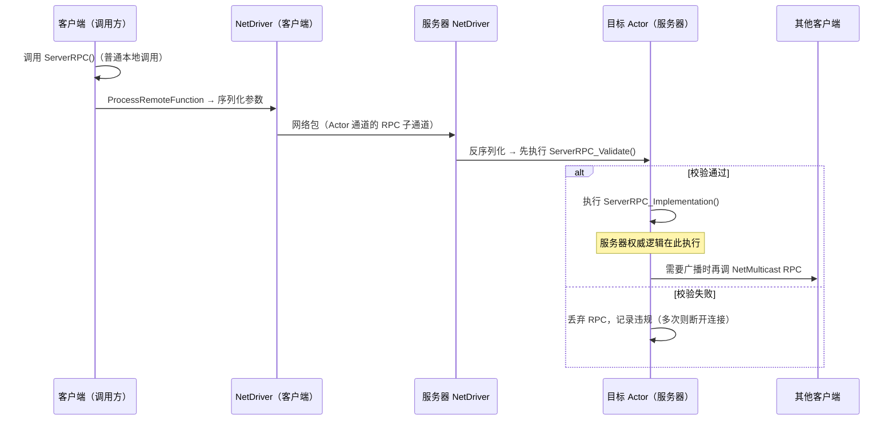
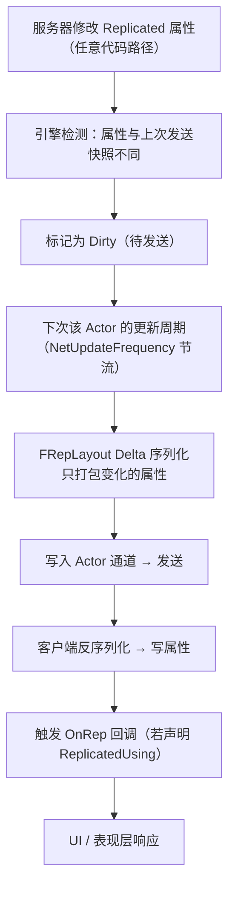

# 02 · RPC 与属性同步
> 版本基准：UE 5.8.0（本机 `Engine/Build/Build.version`：CL 55116800，分支 `++UE5+Release-5.8`）。
> 兼容性边界：适用于 UE5.8 编辑器/运行时，UE4.27 与早期 UE5 仅作迁移背景，具体模块以正文为准。
> 官方参考：[Unreal Engine UE5.8 官方文档总页](https://dev.epicgames.com/documentation/en-us/unreal-engine)。
> 最后更新：2026-08-06（本轮元数据维护）。

> 本篇是「06-网络同步」分类的第二篇，讲解 UE 网络通信的两种核心手段：
> **RPC（Remote Procedure Call，远程过程调用）**——跨机器执行函数；
> **属性同步（Replicated Properties）**——服务器状态自动下发。
> 适用版本：UE 5.0 ~ 5.8。

---

## 一、概述

在客户端-服务器架构下，任何跨机器的信息传递只有两种形态：

1. **事件（Event）**：我要通知你"发生了什么事"→ 用 **RPC**。例如"开火"、"开门"、"请重开一局"。
2. **状态（State）**：我要让你持续看到"现在是什么状态"→ 用 **属性同步**。例如血量、位置、得分、弹药数。

RPC 与属性同步都建立在 Actor 复制（`bReplicates` + Actor 通道）之上：**没有复制就没有 RPC 与属性同步**。它们的共同基础设施包括：序列化（把参数/属性变成字节）、可靠性（Reliable/Unreliable）、带宽调度（频率与优先级）。

本篇结构：先讲 RPC 的声明语法、三种方向（Server / Client / Multicast）、可靠性与校验；再讲属性同步的注册、条件、通知与 Fast Array；最后集中解决工程问题——同步频率怎么调、抖动从哪来、插值怎么做。

---

## 二、核心概念（速查表）

### 2.1 RPC 三大方向

| 修饰符 | 调用位置 | 执行位置 | 典型用途 |
| --- | --- | --- | --- |
| `UFUNCTION(Server)` | 客户端（拥有该 Actor 的连接） | 服务器 | 客户端向服务器"请求/上报"：移动输入、攻击请求、交互请求 |
| `UFUNCTION(Client)` | 服务器 | **拥有该 Actor 的那个客户端** | 服务器向 Owner 单发通知：扣血提示、UI 事件、确认结果 |
| `UFUNCTION(NetMulticast)` | 服务器 | 服务器本地 + **所有客户端** | 广播事件：爆炸、开门动画、全场公告 |

### 2.2 可靠性修饰

| 修饰符 | 保证 | 代价 | 适用 |
| --- | --- | --- | --- |
| `Reliable` | 保证送达 + 保证顺序（ACK/重传） | 高带宽、可能阻塞队列 | 低频关键事件：登录、开火判定、伤害结算 |
| `Unreliable` | 尽力而为，可能丢失/乱序 | 低开销、以最新为准 | 高频状态：移动输入、实时位置 |

### 2.3 校验与实现

| 后缀函数 | 作用 |
| --- | --- |
| `Foo_Implementation` | 实际执行体（必须实现） |
| `Foo_Validate` | 服务器端参数校验（配合 `WithValidation`），失败则不执行 |

### 2.4 属性同步关键宏

| 宏 | 作用 |
| --- | --- |
| `DOREPLIFETIME(Class, Prop)` | 无条件复制 |
| `DOREPLIFETIME_CONDITION(Class, Prop, COND_X)` | 条件复制 |
| `DOREPLIFETIME_CONDITION_NOTIFY(Class, Prop, COND_X, REPNOTIFY_Always/REPNOTIFY_OnChanged)` | 条件 + OnRep 触发策略 |
| `DOREPLIFETIME_ACTIVE_OVERRIDE(Class, Prop, bActive)` | 动态开关 |
| `DOREPLIFETIME_CHANGE_CONDITION(Class, Prop, COND_X)` | 动态改条件 |

### 2.5 同步频率与平滑

| 概念 | 说明 |
| --- | --- |
| `NetUpdateFrequency` | Actor 每秒被检查更新的次数（默认 100） |
| `NetPriority` | 带宽竞争时的发送优先级 |
| Jitter（抖动） | 网络延迟的波动，导致到达时间不均匀 |
| Interpolation（插值） | 用历史/目标值平滑过渡，消除跳变 |
| Extrapolation（外推） | 无新数据时按运动趋势继续推算 |

---

## 三、原理详解

### 3.1 RPC 调用路径



要点：

- RPC 的调用方只是"发起"，真正的执行在目标机器上；`_Implementation` 与普通函数一样可以访问该机器上的完整对象状态。
- RPC 参数与返回值：**RPC 没有返回值**（跨机器无法同步返回）；结果必须通过属性复制或另一个 RPC 传回。
- 执行上下文：Server RPC 在服务器上"以该 Actor 为上下文"执行；Client RPC 在目标客户端上执行。
- RPC 只有在 **Actor 通道存在**时才能发送：即该 Actor 正在被复制给目标连接。若客户端上该 Actor 已被销毁/剔除，Server RPC 会被静默丢弃。

### 3.2 三类 RPC 的方向细节

#### 3.2.1 Server RPC

- 只能由客户端调用（服务器调用 Server RPC 没有意义，引擎会警告/直接本地执行路径不同——请始终按"客户端→服务器"使用）。
- 服务器无法"替客户端"调用 Server RPC，这是方向约束。
- 常见误区：在服务器上也调用 Server RPC 想"再发一次"——不会重复发送，服务器上调用会直接本地执行（或警告），不要依赖这种行为。

#### 3.2.2 Client RPC

- 服务器调用，**只发给拥有该 Actor 的客户端**（Owner）。
- 若 Actor 没有 Owner（如无主的 GameState 上的 Client RPC），则无处可发。
- 典型应用：服务器向某个玩家单独下发 UI 通知、确认其请求、同步其专属数据。

#### 3.2.3 NetMulticast RPC

- 服务器调用：服务器本地立即执行一遍，同时广播给所有相关客户端。
- 客户端调用：只在本地执行，**不会转发**给服务器或其他人（方向约束）。
- 广播范围同样受相关性约束：只有"相关"的客户端会收到。
- 典型应用：爆炸特效、开门、公告、动画事件。

### 3.3 可靠性：Reliable 与 Unreliable

- **Reliable RPC**：发送后等待确认（ACK），未确认则重传，保证"每一条都到达且按序"。代价：占用队列、重传风暴时延迟飙升；**不要在 Reliable 上高频调用**（如每帧调用可靠 RPC 会压垮连接）。
- **Unreliable RPC**：发出即忘，可能丢失、可能乱序。适合高频"最新值覆盖旧值"的语义（移动输入、实时坐标）。
- 属性复制本质上是"最可靠的 Unreliable"：丢了就等下个更新，永远以最新为准。

### 3.4 WithValidation：服务器端校验

```cpp
UFUNCTION(Server, Reliable, WithValidation)
void ServerRequestFire(const FVector& AimDirection);

bool ServerRequestFire_Validate(const FVector& AimDirection)
{
    // 校验参数合法性：方向必须归一化、数值不能为 NaN/无穷
    return AimDirection.IsNormalized();
}
```

- 校验在服务器上、`_Implementation` 之前执行；
- 校验失败：该 RPC 不执行，引擎记录违规（`RPC` 校验失败计数），连续多次违规会断开连接（防作弊手段）；
- **所有 Server RPC 都应尽量加 `WithValidation`**，尤其涉及伤害、货币、交易等敏感参数。

### 3.5 参数序列化与压缩类型

RPC 与属性同步的参数都会被序列化进网络包，参数类型直接影响带宽：

| 类型 | 说明 |
| --- | --- |
| `int32 / float / bool` | 基础类型，直接序列化 |
| `FVector / FRotator` | 直接序列化（未压缩，各 12 字节） |
| `FVector_NetQuantize` | 位置压缩（1/100 精度？——实际是整数量化，适合小范围坐标） |
| `FVector_NetQuantize100` | 高精度量化（厘米级，适合移动坐标） |
| `FVector_NetQuantize10` | 低精度量化（适合大范围粗略位置） |
| `FVector_NetQuantizeNormal` | 单位向量压缩（适合朝向） |
| `TArray<复制的类型>` | 数组整体序列化（效率低于 Fast Array，见 3.8） |
| 自定义结构体 | 需实现 `NetSerialize` 才能高效压缩 |

> 注：`FVector_NetQuantize` 系列是 UE 官方推荐的坐标/方向传输类型，CharacterMovement 的 `ServerMove` 就大量使用它们。

### 3.6 属性同步机制



关键机制：

1. **自动脏检测**：引擎在每次 Actor 更新周期比较属性值与上次发送值（内存快照对比），只发送变化的部分；初始快照则全量发送。
2. **属性级粒度**：复制以"属性"为单位。一个 `FVector` 属性改了 X 分量，整个属性重发（12 字节）。所以**拆分属性**（位置、速度、朝向分开）比"一个大结构体"高效。
3. **服务器不触发 OnRep**：`OnRep` 只在客户端"收到复制更新"时触发；服务器本地修改不会触发自己的 OnRep（除非你手动调用）。
4. **顺序保证**：同一 Actor 的属性更新按序应用（Reliable 语义由通道保证），不同 Actor 之间没有严格顺序。

### 3.7 同步频率：NetUpdateFrequency 与 NetPriority

- `NetUpdateFrequency` 是"上限节流"：Actor 每秒至多被检查/发送那么多次。它**不是**固定周期发送——只有当属性脏了才会真的发。
- 服务器每个 Tick 会遍历所有连接的候选 Actor，按 `NetPriority` 排序，在带宽预算内尽量多发。
- 组合策略：

| 场景 | 建议 |
| --- | --- |
| 玩家位置/朝向 | 30~100Hz，Unreliable 属性或移动组件专用通道 |
| 血量/状态变化 | 10~30Hz 足够（变化本身低频） |
| 装饰/静态物 | 1~10Hz，或干脆 `COND_InitialOnly` |
| 一次性事件 | 用 RPC，别用属性 |

### 3.8 Fast Array：高效复制数组

普通 `TArray` 属性复制是"整个数组"作为一个属性重发（增删一个元素也会全量发）。**Fast Array（`FFastArraySerializer`）** 把数组拆成"增量条目"：增删改只发受影响的那一项。

适用场景：物品栏、玩家列表、Buff 列表、生成物列表等"元素频繁增删改"的数组。

### 3.9 抖动（Jitter）与插值（Interpolation）

#### 抖动从哪来

- 网络路径上的排队与拥塞（延迟本身波动）；
- 服务器与客户端帧率不同步（更新到达时间不均匀）；
- 丢包导致的等待重传；
- 时钟漂移（客户端与服务器时钟不同步）。

抖动在表现上的后果：位置跳变、角色"瞬移"、动画卡顿。

#### 插值策略

| 策略 | 做法 | 适用 |
| --- | --- | --- |
| 属性级插值 | 每帧把当前值向目标值逼近（`FMath::FInterpTo`） | 血条、进度、自定义状态 |
| 位置插值 | 按时间戳在两个已知位置之间线性插值 | SimulatedProxy 的移动 |
| 旋转插值 | 四元数 `Slerp` 或最短路径旋转 | 朝向平滑 |
| 缓冲插值 | 客户端保留 50~150ms 的接收缓冲，统一延迟到"过去"再渲染 | 高实时对战 |
| 外推 | 无新数据时按速度继续推进 | 短暂丢包时避免停顿 |

UE 内置的移动插值由 `UCharacterMovementComponent` 的 `NetworkSmoothingMode`（Linear / Exponential / Disabled）控制，详见本分类 03 篇。

---

## 四、代码示例

### 4.1 Server RPC：客户端请求，服务器裁决

```cpp
UCLASS()
class AMyCharacter : public ACharacter
{
    GENERATED_BODY()

public:
    // 客户端调用：请求开火
    UFUNCTION(Server, Reliable, WithValidation)
    void ServerRequestFire(FVector_NetQuantizeNormal AimDirection);

    bool ServerRequestFire_Validate(FVector_NetQuantizeNormal AimDirection);
    void ServerRequestFire_Implementation(FVector_NetQuantizeNormal AimDirection);
};

bool AMyCharacter::ServerRequestFire_Validate(FVector_NetQuantizeNormal AimDirection)
{
    // 校验：方向必须有效
    return !AimDirection.IsZero() && AimDirection.IsNormalized();
}

void AMyCharacter::ServerRequestFire_Implementation(FVector_NetQuantizeNormal AimDirection)
{
    // 服务器权威：检查弹药、冷却、生成子弹
    if (CurrentAmmo > 0 && GetWorld()->GetTimeSeconds() >= NextFireTime)
    {
        CurrentAmmo--;
        NextFireTime = GetWorld()->GetTimeSeconds() + FireCooldown;
        SpawnProjectile(AimDirection);
    }
}

// 客户端输入回调里发起请求
void AMyCharacter::OnFirePressed()
{
    if (!HasAuthority()) // 非服务器才需要上行
    {
        ServerRequestFire(GetControlRotation().Vector());
    }
    // 客户端本地立即播放开火表现（预测），结果以服务器为准
    PlayFireEffects();
}
```

### 4.2 Client RPC：服务器向 Owner 下发

```cpp
UCLASS()
class AMyPlayerController : public APlayerController
{
    GENERATED_BODY()

public:
    // 服务器调用：只发给这个 Controller 对应的客户端
    UFUNCTION(Client, Reliable)
    void ClientNotifyMatchStarted(const FString& MapName);

    void ClientNotifyMatchStarted_Implementation(const FString& MapName)
    {
        // 客户端本地：更新 UI、播放开场动画
        UGameplayStatics::GetPlayerController(this, 0)->ClientMessage(TEXT("比赛开始：" + MapName));
        OnMatchStarted.Broadcast(MapName);
    }
};
```

### 4.3 NetMulticast RPC：广播事件

```cpp
UCLASS()
class AMyExplosiveBarrel : public AActor
{
    GENERATED_BODY()

public:
    // 服务器调用：全客户端播放爆炸
    UFUNCTION(NetMulticast, Unreliable)
    void MulticastExplode(const FVector& Location, const FRotator& Rotation);

    void MulticastExplode_Implementation(const FVector& Location, const FRotator& Rotation)
    {
        // 每个机器（含服务器）都执行：生成特效、播放音效、震屏
        SpawnExplosionVFX(Location, Rotation);
        PlaySound(ExplosionSound, Location);
        if (IsLocallyControlled()) // 本地玩家震屏
        {
            CameraShake();
        }
    }

    void ServerExplode()
    {
        if (HasAuthority())
        {
            ApplyAreaDamage();        // 权威结算
            MulticastExplode(GetActorLocation(), GetActorRotation()); // 广播表现
        }
    }
};
```

### 4.4 属性同步 + OnRep 完整示例

```cpp
UCLASS()
class AMyHealthComponent : public UActorComponent
{
    GENERATED_BODY()

public:
    AMyHealthComponent()
    {
        SetIsReplicatedByDefault(true); // 组件也要复制
    }

    UPROPERTY(ReplicatedUsing = OnRep_Health, BlueprintReadOnly)
    float Health = 100.f;

    UFUNCTION()
    void OnRep_Health();

    virtual void GetLifetimeReplicatedProps(TArray<FLifetimeProperty>& OutLifetimeProps) const override
    {
        Super::GetLifetimeReplicatedProps(OutLifetimeProps);
        DOREPLIFETIME(AMyHealthComponent, Health);
    }

    UFUNCTION(Server, Reliable, WithValidation)
    void ServerApplyDamage(float Amount);
    bool ServerApplyDamage_Validate(float Amount)
    {
        return Amount >= 0.f && Amount <= 1000.f && FMath::IsFinite(Amount);
    }
    void ServerApplyDamage_Implementation(float Amount)
    {
        // 服务器权威修改 → 自动复制 → 客户端 OnRep
        Health = FMath::Max(0.f, Health - Amount);
        if (Health <= 0.f)
        {
            OnDeath_Authority();
        }
    }
};

void AMyHealthComponent::OnRep_Health()
{
    // 只在客户端执行
    UpdateHealthBarUI(Health);
    if (Health <= 0.f)
    {
        PlayDeathEffects();
    }
}
```

### 4.5 条件复制 + 通知策略

```cpp
void AMyPlayerState::GetLifetimeReplicatedProps(TArray<FLifetimeProperty>& OutLifetimeProps) const
{
    Super::GetLifetimeReplicatedProps(OutLifetimeProps);

    // 分数：所有人可见，变化即通知
    DOREPLIFETIME_CONDITION_NOTIFY(AMyPlayerState, Score, COND_None, REPNOTIFY_OnChanged);

    // 队伍：只初始同步一次（中途换队走专门 RPC）
    DOREPLIFETIME_CONDITION(AMyPlayerState, TeamId, COND_InitialOnly);
}

void AMyPlayerState::OnRep_Score()
{
    // 分数条动画（客户端）
    OnScoreChanged.Broadcast(Score);
}
```

`REPNOTIFY_OnChanged`（默认）：只有值发生变化才触发 OnRep；`REPNOTIFY_Always`：每次收到都触发（即使值相同）。

### 4.6 Fast Array 示例

```cpp
// 1. 定义条目结构（继承 FFastArraySerializerItem）
USTRUCT()
struct FInventoryItem : public FFastArraySerializerItem
{
    GENERATED_BODY()

    UPROPERTY()
    FName ItemID;

    UPROPERTY()
    int32 Count = 0;
};

// 2. 定义 Fast Array 容器
USTRUCT()
struct FInventoryArray : public FFastArraySerializer
{
    GENERATED_BODY()

    UPROPERTY()
    TArray<FInventoryItem> Items;

    void AddItem(const FName& InItemID, int32 InCount)
    {
        FInventoryItem& NewItem = Items.AddDefaulted_GetRef();
        NewItem.ItemID = InItemID;
        NewItem.Count = InCount;
        MarkItemDirty(NewItem); // 关键：标记该条目脏
    }

    bool NetDeltaSerialize(FNetDeltaSerializeInfo& DeltaParms)
    {
        return FFastArraySerializer::FastArrayDeltaSerialize<FInventoryItem, FInventoryArray>(Items, DeltaParms, *this);
    }
};

// 3. 宿主类中注册
UCLASS()
class AMyInventoryActor : public AActor
{
    GENERATED_BODY()

    UPROPERTY(Replicated)
    FInventoryArray Inventory;

    virtual void GetLifetimeReplicatedProps(TArray<FLifetimeProperty>& OutLifetimeProps) const override
    {
        Super::GetLifetimeReplicatedProps(OutLifetimeProps);
        // Fast Array 用 DOREPLIFETIME 注册即可（内部走 NetDeltaSerialize）
        DOREPLIFETIME(AMyInventoryActor, Inventory);
    }
};
```

### 4.7 属性插值示例（客户端平滑）

```cpp
// 在客户端 Tick 中平滑逼近服务器目标值
void AMyActor::Tick(float DeltaSeconds)
{
    Super::Tick(DeltaSeconds);

    if (!HasAuthority() && bSmoothInterpolate)
    {
        // 显示值向服务器目标值插值（Exponential 逼近）
        DisplayValue = FMath::FInterpTo(DisplayValue, ServerTargetValue, DeltaSeconds, 12.f);
    }
}
```

---

## 五、最佳实践

1. **RPC 与属性的选择**：高频变化的持续状态用属性；低频一次性事件用 RPC；"想立刻执行逻辑"用 RPC，"想看到最新状态"用属性。
2. **Server RPC 全部加 `WithValidation`**：伤害、经济、交易、技能释放等敏感操作必须校验参数范围与合法性。
3. **别滥用 Reliable**：Reliable RPC 有 ACK/重传开销，高频调用会形成重传风暴；高频数据走 Unreliable 或属性。
4. **RPC 参数最小化**：能传 `FVector_NetQuantizeNormal` 就别传 `FVector`；能传索引/ID 就别传对象引用。
5. **属性拆细**：按变化频率拆分属性，避免"牵一发动全身"的全量重发；结构体属性慎用（改一个字段整块重发）。
6. **条件复制是免费的带宽**：`COND_OwnerOnly` / `COND_InitialOnly` / `COND_SimulatedOnly` 用起来，大多数玩家数据并不需要全员实时同步。
7. **OnRep 里不要写服务器逻辑**：OnRep 只在客户端执行；需要服务器响应时，服务器代码写在修改处，两边各写各的（或通过 RPC 桥接）。
8. **Fast Array 优先于 TArray 复制**：只要数组会增删元素，就用 `FFastArraySerializer`。
9. **插值要基于时间戳**：不要"每帧按固定速度追"，而要用时间戳差计算，否则不同帧率下平滑效果不一致（03 篇详述）。
10. **调试命令**：`showdebug net`（5.8；`net.InspectChannels` 已移除）、`p.NetShowCorrections`、`log LogNetRPC verbose`、`stat Net`，用数据说话。

---

## 六、常见问题 FAQ

**Q1：RPC 为什么"没生效"？**
按顺序排查：① Actor `bReplicates` 是否开启；② 声明是否用了正确的 `Server/Client/NetMulticast` 修饰；③ 是否实现 `_Implementation`（没实现会在日志报错）；④ 是否有 Actor 通道（Actor 是否相关/存在）；⑤ 调用方向是否正确（Server RPC 必须由客户端调用）；⑥ `WithValidation` 的 `_Validate` 是否误判失败。

**Q2：客户端调用了 Server RPC，服务器没执行，日志也没有报错？**
最常见原因：该 Actor 在客户端上不存在通道（例如客户端本地 Spawn 的 Actor、被相关性剔除的 Actor）。RPC 无法送达时会被静默丢弃（Unreliable）或在日志中记录（Reliable 会打印 `UNetConnection::Close` 相关警告）。

**Q3：Reliable RPC 会丢吗？**
不会丢（最终会重传到送达），但可能"迟到"；且重传风暴会拖垮整个连接。Reliable 保证的是送达与顺序，不是低延迟。

**Q4：为什么服务器上调用 Client RPC 客户端没收到？**
Client RPC 只发给 **Owner** 连接。若 Actor 没有 Owner（或 Owner 连接已断），则无人接收。确认 `GetOwner()` / `GetNetConnection()` 正确。

**Q5：属性同步有延迟吗？**
有。服务器修改 → 下一个更新周期（受 `NetUpdateFrequency` 与服务器 TickRate 限制）→ 网络传输 → 客户端应用。一般几毫秒到几十毫秒。对延迟敏感的状态请考虑预测与插值（03 篇）。

**Q6：OnRep 在服务器上会执行吗？**
不会（除非手动调用）。服务器修改属性后需要做"服务器侧响应"时，直接在修改处写逻辑。

**Q7：为什么我的 float 属性同步后精度变了？**
序列化会按类型压缩/量化，浮点数默认保留足够精度，但经过 `FVector_NetQuantize` 等类型或自定义 `NetSerialize` 会损失精度。需要精确值就不要用压缩类型，或用 `NetSerialize` 自定义精度。

**Q8：两个客户端同时改同一属性会怎样？**
属性同步只认服务器副本：谁改都无效，服务器最终值覆盖所有人。这正是权威模型的含义——客户端之间的"同时操作"由服务器串行化裁决。

**Q9：Unreliable RPC 乱序到达怎么办？**
让数据自带时间戳/序号，接收方按时间戳处理（移动系统就是这么做的）。不要把"顺序敏感"的逻辑放在 Unreliable 上。

**Q10：一个属性又复制又走 RPC，会重复吗？**
会各走各的，需要自己保证语义不冲突。常见设计：高频状态用属性，边界事件用 RPC（如"血量"属性 + "死亡"RPC），两者职责分开。

---

## 七、关联阅读

- 本分类：[01-网络架构与复制基础.md](01-网络架构与复制基础.md) —— Actor 复制、NetConnection、通道与 Relevancy 前置知识
- 本分类：[03-客户端预测与延迟补偿.md](03-客户端预测与延迟补偿.md) —— ServerMove RPC 与移动属性的实战应用
- 本分类：[04-多人游戏框架与玩家状态.md](04-多人游戏框架与玩家状态.md) —— PlayerState/GameState 的复制设计
- 本仓库：[03-游戏玩法编程](../03-游戏玩法编程/README.md) —— GAS 中 Attribute 的复制与预测
- 官方文档：Unreal Engine 5 RPCs、Replicated Properties、Fast Array Replication
- 引擎源码：`Engine/Source/Runtime/Engine/Private/Net/`、`Iris/`（新复制系统的属性定义）、`NetSerialization.h`
