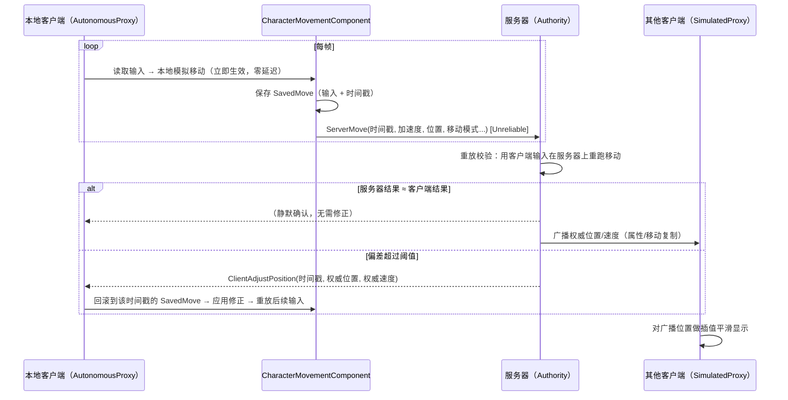
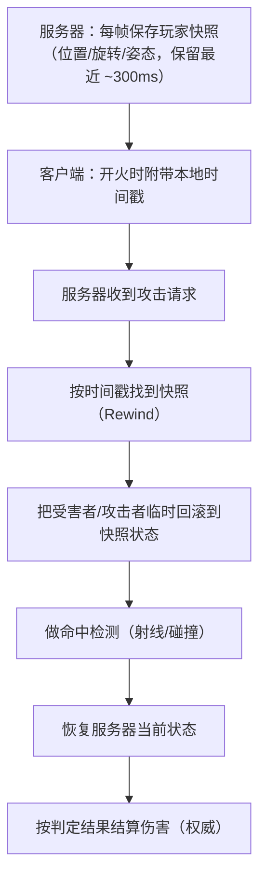

# 03 · 客户端预测与延迟补偿

> 本篇是「06-网络同步」分类的第三篇，解决多人游戏里最影响"手感"的两个问题：
> **客户端预测（Client-Side Prediction）**——让玩家操作零延迟响应；
> **延迟补偿（Lag Compensation）**——让射击判定公平地补偿网络延迟。
> 适用版本：UE 5.0 ~ 5.5，以 CharacterMovementComponent（CMC）为核心讲解。

---

## 一、概述

在纯"服务器权威 + 客户端只看同步结果"的模型下，玩家按一下 W，输入要先上行到服务器（半个 RTT），服务器移动角色，再把新位置下行回来（另外半个 RTT）——**玩家的操作要等整整一个 RTT 才有视觉反馈**。RTT 为 50ms 时尚可接受，RTT 达到 150ms 时角色会"黏在键盘上"，体验极差。

**客户端预测**的思路是：让拥有控制权的客户端（AutonomousProxy）**先在本地立即执行移动**，同时把输入上行给服务器；服务器以权威身份重放并校验，若与客户端结果一致则"确认"，若不一致则下发**修正（Correction）**，客户端**回滚**到服务器认可的状态并重放后续输入。

**延迟补偿**解决的是另一个问题：玩家 A 瞄准玩家 B 开枪时，B 在他屏幕上已经跑到了另一个位置——服务器该按"谁的时间"判定？业界标准做法是：服务器保留最近一段时间的状态快照（时间窗），按**攻击方客户端的时间戳**回滚到当时的世界状态做命中检测，这就是"服务器回退（Server Rewind）"。

本篇先讲移动预测的完整链路（SavedMove / ServerMove / Correction / 回滚重放），再讲延迟补偿的工程实现，最后覆盖插值、外推与动画/射击预测等配套话题。

---

## 二、核心概念（速查表）

| 概念 | 英文 | 含义 |
| --- | --- | --- |
| 自主代理 | AutonomousProxy | 自己控制的 Pawn：本地预测 + 上行输入 |
| 模拟代理 | SimulatedProxy | 看到的其他玩家：只接收服务器广播并插值 |
| 权威 | Authority | 服务器：最终位置与判定 |
| 本地预测 | Local Prediction | 客户端在本地先执行移动/表现 |
| 服务器移动 | ServerMove | 客户端上行移动输入/状态的 RPC（Unreliable） |
| 保存的移动 | SavedMove | 客户端保存的移动输入历史（含时间戳），用于回滚重放 |
| 修正 | Correction / ClientAdjust* | 服务器下发的"权威位置/速度"，客户端需回滚到该状态 |
| 回滚 | Rollback / Replay | 客户端退回服务器认可的状态，重放之后的输入 |
| 延迟补偿 | Lag Compensation | 服务器按客户端时间戳回退世界状态做判定 |
| 时间窗 | Rewind Window | 服务器保存历史状态的时长（通常 100~500ms） |
| 插值 | Interpolation | 用历史数据平滑过渡（渲染到过去） |
| 外推 | Extrapolation | 无新数据时按速度继续推算位置 |
| 时钟同步 | Clock Sync | 估算客户端与服务器的时钟差/RTT |
| 网络平滑模式 | NetworkSmoothingMode | CMC 对模拟代理的平滑方式（Linear/Exponential/Disabled） |

---

## 三、原理详解

### 3.1 移动预测的完整链路



#### 3.1.1 客户端本地模拟

拥有控制权的客户端（`GetLocalRole() == ROLE_AutonomousProxy`）上的 CMC 会像单机一样执行完整的移动逻辑：加速度、速度、碰撞、物理。玩家的输入立即反映在画面上——这是"手感"的来源。

#### 3.1.2 ServerMove：输入上行

客户端把每次移动意图封装成 **SavedMove** 并通过 `ServerMove`（Unreliable RPC）上行，核心字段包括：

- `TimeStamp`：客户端本地时间戳（用于服务器对齐与回滚）；
- `InAccel`：本次输入的加速度向量（量化压缩）；
- `ClientLoc`：客户端预测出的位置（服务器用来快速比对）；
- `CompressedFlags`：跳跃/蹲伏/冲刺等状态位；
- `ClientRoll`、`View`：视角信息（用于移动与相机一致）；
- `ClientMovementBase` / `ClientBaseBoneName`：站在哪个移动平台上；
- `ClientMovementMode`：客户端认为的移动模式（走路/飞行/游泳…）。

引擎还有 `ServerMoveDual`（双帧合并发送）、`ServerMoveDualHybridRootMotion`（根运动混合）等变体，用于高频移动时合并包、减少 RPC 数量。

#### 3.1.3 服务器重放与校验

服务器收到 `ServerMove` 后，把"客户端声称的状态"与"服务器当前状态"对比：

- 若客户端位置与服务器计算结果偏差很小 → 接受，正常广播；
- 若偏差超过阈值（`MaxClientError` 等）→ 认为客户端预测错误（可能撞墙、被击退、服务器裁决不同），下发修正；
- 服务器还会做**合法性校验**：移动速度是否超过 `MaxWalkSpeed`、是否穿过不该穿过的几何体、跳跃频率是否异常——防作弊的一线。

#### 3.1.4 修正与回滚重放（Correction & Replay）

当客户端收到 `ClientAdjustPosition`（或 `ClientAdjustLocation` / `ClientAdjustRotation` / `ClientVeryShortAdjustPosition` 等变体）时：

1. 找到对应时间戳的 SavedMove；
2. 把角色状态**回滚**到服务器给出的权威状态（位置、速度、移动模式）；
3. 从该时刻起**重放**之后所有本地 SavedMove（把"后来发生的输入"重新执行一遍）；
4. 继续正常预测。

重放保证：修正后不会"丢掉"玩家在 RTT 期间的操作，玩家几乎感知不到修正（除非偏差巨大，如服务器判定角色撞墙）。

#### 3.1.5 模拟代理的插值

其他客户端看到的是 SimulatedProxy：它们只接收服务器广播的权威位置/速度（通常 30~60Hz），并用 `NetworkSmoothingMode` 做平滑：

| 模式 | 行为 | 适用 |
| --- | --- | --- |
| `Linear` | 在两次更新之间按时间线性插值 | 大多数游戏 |
| `Exponential` | 指数逼近（快到目标时减速），更顺滑但延迟略高 | 追求顺滑的表现 |
| `Disabled` | 直接应用，无平滑（会瞬移） | 调试/特殊需求 |

插值本质上让模拟代理"渲染在过去"（滞后约一个更新间隔），这是换取平滑的必然代价。

### 3.2 时间戳与时钟同步

预测、回滚、延迟补偿全部依赖**时间戳对齐**：

- 客户端 SavedMove 使用客户端本地时间戳；
- 服务器需要估算"客户端时钟与服务器时钟的偏差"（`ClientWorldTime` 机制：客户端周期性上报本地时间，服务器用 RTT 折半估算偏差）；
- 实际 RTT 是波动的，所以估算值带误差——这也是为什么修正阈值不能设得太小。

引擎的 `UNetConnection` 会维护 RTT 统计（`AvgLag` 等），移动系统用它做超时判断（如 `ServerMove` 太旧直接丢弃）。

### 3.3 延迟补偿（Lag Compensation）



#### 3.3.1 为什么需要延迟补偿

没有延迟补偿时，服务器用"当前时刻"的状态判定攻击：玩家 A 看到 B 在位置 P 开枪，但服务器上 B 已经在位置 Q——子弹"明明打中了"却显示未命中（或者反过来，玩家被"隔墙打死"）。延迟补偿让判定基于**攻击发起时刻**的世界状态，对攻击方公平。

#### 3.3.2 工程要点

- **快照内容**：位置、旋转、姿态（蹲/站）、可能还要骨骼朝向；压缩存储（如每秒 30~60 个快照 × 16 字节）。
- **时间窗**：通常覆盖最大可容忍延迟（如 100~500ms）；超过窗口的请求按最老快照或直接拒绝。
- **回滚范围**：只回滚参与判定的 Actor（通常是被攻击者与攻击者自身），不要回滚整个世界。
- **判定方式**：射线（Raycast）或胶囊体扫描（Sweep），需要临时禁用碰撞/忽略回滚对象间碰撞，判定完恢复。
- **校验**：攻击频率、射击距离、弹药必须校验，防止利用回滚窗口作弊（如"延迟开枪"）。

### 3.4 其他预测：射击与动画

#### 射击预测

客户端开火瞬间**立即**播放枪口火光、弹道特效、后坐力，同时上行 Server RPC；服务器验证（弹药、冷却、命中判定）后广播伤害与弹孔。若服务器判定未命中（如目标已跑开），客户端后续收到"未命中"结果并纠正（如弹孔消失、伤害数字不出现）。这是"表现预测 + 逻辑权威"的典型模式。

#### 动画预测

移动动画由 CMC 的移动状态驱动，天然跟随预测；蒙太奇（AnimMontage）等一次性动画通常由服务器触发 NetMulticast 同步，或由客户端预测播放、服务器确认后广播（注意防止"重复播放"：客户端播放时标记本地已播，收到广播时跳过）。

### 3.5 常见失败模式

| 现象 | 原因 | 对策 |
| --- | --- | --- |
| 橡皮筋（Rubber-banding） | 服务器频繁修正 | 检查输入是否重复上报、修正阈值、时钟偏差 |
| 角色瞬移 | 服务器跳变式 SetActorLocation | 用移动组件、减少强制传送 |
| 穿墙 | 服务器未校验移动路径 | 服务器重放时做完整碰撞检测 |
| 修正后抖动 | 修正与本地重放冲突 | 检查 SavedMove 清理、时间戳对齐 |
| 站在移动平台上错位 | 平台移动未正确同步 | 处理 BasedMovement / MovementBase |
| 攻击判定不公平 | 未做延迟补偿 | 实现 Rewind 命中检测 |

---

## 四、代码示例

### 4.1 启用/配置网络移动（C++ / ini）

```cpp
// 在 Pawn 的构造函数或 CMC 配置中
UCharacterMovementComponent* MoveComp = GetCharacterMovement();
MoveComp->NetworkSmoothingMode = ENetworkSmoothingMode::Exponential; // 模拟代理平滑
MoveComp->bReplicateMovement = true;                                 // 广播移动
MoveComp->bNetworkUpdatePosition = true;                             // 客户端接收更新

// DefaultEngine.ini 常用网络节流
// [/Script/OnlineSubsystemUtils.IpNetDriver]
// NetServerMaxTickRate=60
// MaxInternetClientRate=10000
```

### 4.2 覆写 ServerMove 校验（防作弊入口）

```cpp
UCLASS()
class AMyCharacterMovement : public UCharacterMovementComponent
{
    GENERATED_BODY()

protected:
    // 服务器端：重放客户端移动前做额外校验
    virtual void ServerMove_Implementation(
        float TimeStamp,
        FVector_NetQuantize100 InAccel,
        FVector_NetQuantize100 ClientLoc,
        uint8 CompressedFlags,
        uint8 ClientRoll,
        uint32 View,
        UPrimitiveComponent* ClientMovementBase,
        FName ClientBaseBoneName,
        uint8 ClientMovementMode) override;
};

void AMyCharacterMovement::ServerMove_Implementation(
    float TimeStamp, FVector_NetQuantize100 InAccel, FVector_NetQuantize100 ClientLoc,
    uint8 CompressedFlags, uint8 ClientRoll, uint32 View,
    UPrimitiveComponent* ClientMovementBase, FName ClientBaseBoneName, uint8 ClientMovementMode)
{
    // 基础合法性：时间戳不能乱跳（防止重放攻击）
    const float ServerTime = GetWorld()->GetTimeSeconds();
    if (FMath::Abs(ServerTime - TimeStamp) > MaxMoveDeltaTime)
    {
        // 时间戳异常：丢弃本次移动（不执行）
        return;
    }

    // 速度上限校验：加速度模长不能超过允许值（防止加速作弊）
    if (InAccel.SizeSquared() > FMath::Square(MaxAcceleration * 2.f))
    {
        return;
    }

    Super::ServerMove_Implementation(TimeStamp, InAccel, ClientLoc, CompressedFlags,
        ClientRoll, View, ClientMovementBase, ClientBaseBoneName, ClientMovementMode);
}
```

### 4.3 处理修正（客户端）

```cpp
void AMyCharacterMovement::ClientAdjustPosition_Implementation(
    float TimeStamp, FVector NewLoc, FVector NewVel, uint8 NewMode)
{
    // 默认实现已经做了：回滚到对应 SavedMove → 应用修正 → 重放
    // 这里可以加自己的表现层处理
    if (APawn* MyPawn = Cast<APawn>(GetOwner()))
    {
        if (MyPawn->IsLocallyControlled())
        {
            OnCorrectionReceived.Broadcast(NewLoc, NewVel);
        }
    }

    Super::ClientAdjustPosition_Implementation(TimeStamp, NewLoc, NewVel, NewMode);
}
```

### 4.4 访问 SavedMove 历史（调试/扩展）

```cpp
// 仅在客户端（AutonomousProxy）有效
FNetworkPredictionData_Client_Character* PredData = GetPredictionData_Client_Character();
if (PredData)
{
    const float Now = GetWorld()->GetTimeSeconds();
    for (const FSavedMovePtr& Move : PredData->SavedMoves)
    {
        if (Move.IsValid())
        {
            UE_LOG(LogTemp, Log, TEXT("SavedMove Time=%.3f, SavedLocation=%s"),
                Move->TimeStamp, *Move->SavedLocation.ToString());
        }
    }
}
```

### 4.5 延迟补偿：简易实现骨架

```cpp
// ---- 服务器端快照结构 ----
USTRUCT()
struct FPlayerSnapshot
{
    GENERATED_BODY()

    float ServerTime = 0.f;      // 服务器时间
    FVector Location;            // 位置
    FRotator Rotation;           // 朝向
    FVector Velocity;            // 速度
    uint8 bIsCrouched : 1;       // 姿态
    ACharacter* Character = nullptr; // 快照对象（不序列化，仅服务器内存）
};

// ---- 服务器保存历史 ----
UCLASS()
class AMyLagCompensationComponent : public UActorComponent
{
    GENERATED_BODY()

    TArray<FPlayerSnapshot> History; // 滚动历史（时间窗）
    static constexpr float RewindWindow = 0.5f; // 500ms 窗口

public:
    void RecordSnapshot(ACharacter* Character)
    {
        FPlayerSnapshot S;
        S.ServerTime = GetWorld()->GetTimeSeconds();
        S.Location = Character->GetActorLocation();
        S.Rotation = Character->GetActorRotation();
        S.Velocity = Character->GetVelocity();
        S.bIsCrouched = Character->bIsCrouched;
        S.Character = Character;
        History.Add(S);

        // 裁剪窗口外的旧快照
        while (History.Num() > 0 &&
               History[0].ServerTime < S.ServerTime - RewindWindow)
        {
            History.RemoveAt(0);
        }
    }

    // ---- 回滚判定核心 ----
    bool RewindHitCheck(float ClientTimeStamp, const FVector& Origin,
                        const FVector& Direction, float Range, FHitResult& OutHit)
    {
        // 1. 找到最接近客户端时间戳的快照
        FPlayerSnapshot* Target = FindClosestSnapshot(ClientTimeStamp);
        if (!Target || !Target->Character)
        {
            return false;
        }

        // 2. 临时回滚目标角色
        ACharacter* Victim = Target->Character;
        const FVector OldLoc = Victim->GetActorLocation();
        const FRotator OldRot = Victim->GetActorRotation();
        const bool OldCrouch = Victim->bIsCrouched;

        Victim->SetActorLocation(Target->Location);
        Victim->SetActorRotation(Target->Rotation);
        Victim->bIsCrouched = Target->bIsCrouched;
        Victim->GetCapsuleComponent()->UpdateBounds();

        // 3. 在回滚状态下做射线检测
        const FVector End = Origin + Direction * Range;
        FCollisionQueryParams Params;
        Params.bTraceComplex = false;
        const bool bHit = GetWorld()->LineTraceSingleByChannel(
            OutHit, Origin, End, ECC_Visibility, Params);

        // 4. 恢复服务器当前状态
        Victim->SetActorLocation(OldLoc);
        Victim->SetActorRotation(OldRot);
        Victim->bIsCrouched = OldCrouch;
        Victim->GetCapsuleComponent()->UpdateBounds();

        return bHit;
    }

private:
    FPlayerSnapshot* FindClosestSnapshot(float ClientTimeStamp)
    {
        // 用"服务器时钟 ≈ 客户端时钟 + 偏差"换算后查找最近快照
        // 这里简化为线性扫描；生产环境建议用二分查找 + 时钟偏差校正
        FPlayerSnapshot* Best = nullptr;
        float BestDiff = TNumericLimits<float>::Max();
        for (FPlayerSnapshot& S : History)
        {
            const float Diff = FMath::Abs(S.ServerTime - ClientTimeStamp);
            if (Diff < BestDiff)
            {
                BestDiff = Diff;
                Best = &S;
            }
        }
        return Best;
    }
};
```

> 说明：生产级延迟补偿还需要①客户端/服务器时钟偏差校正（用 RTT 折半或专用同步 RPC）；②批量回滚多个受害者；③对"延迟开枪"（超窗请求）做拒绝；④配合 `WithValidation` 校验攻击参数。

### 4.6 射击预测：客户端即时反馈

```cpp
void AMyPlayerCharacter::Fire()
{
    // 客户端：立即表现（预测）
    PlayMuzzleFlash();
    SpawnTracer(GetAimDirection());

    if (!HasAuthority())
    {
        // 上行请求；命中结果由服务器广播回来
        ServerRequestFire(GetAimDirection(), GetWorld()->GetTimeSeconds());
    }
}

// 服务器：权威判定
void AMyPlayerCharacter::ServerRequestFire_Implementation(
    FVector_NetQuantizeNormal AimDirection, float ClientTimeStamp)
{
    if (CanFire())
    {
        // 用客户端时间戳做延迟补偿命中检测
        FHitResult Hit;
        if (LagComp->RewindHitCheck(ClientTimeStamp, GetMuzzleLocation(), AimDirection, 10000.f, Hit))
        {
            ApplyDamage(Hit.GetActor(), DamageAmount); // 权威结算
        }
        MulticastFireFX(Hit); // 广播命中/未命中表现
    }
}
```

---

## 五、最佳实践

1. **只预测"玩家可控且高频"的状态**：移动、转向、射击。不要预测"服务器随机决定"的东西（掉落、伤害数值），预测不了就等服务器。
2. **服务器永远留一手**：客户端预测只是"体验优化"，服务器重放校验 + 修正才是真相；所有关键逻辑以服务器结果为准。
3. **修正要温和**：修正阈值、插值速度要调到"玩家几乎无感"；频繁强修正 = 橡皮筋。
4. **时间戳是灵魂**：预测、重放、延迟补偿全靠时间对齐。先做时钟偏差校正，再做功能。
5. **延迟补偿窗口要设上限**：超过窗口的攻击请求直接拒绝，防止"延迟开枪"滥用。
6. **校验一切上行参数**：速度上限、加速度、时间戳单调性、攻击频率、弹药消耗——服务器不信任何客户端数据。
7. **模拟代理插值别过度**：Linear 模式通常够用；Exponential 更顺但引入额外滞后，实时竞技要权衡。
8. **用 `p.NetShowCorrections 1` 调试修正**：观察修正频率与幅度，这是移动网络质量的"心电图"。
9. **区分"服务器修正"与"表现平滑"**：修正改的是权威状态（回滚重放），平滑改的是渲染表现（插值），两者职责别混。
10. **移动平台（BasedMovement）**：站在移动平台上的角色要同步平台引用与相对位置，否则修正会乱；CMC 已有支持，别自己另搞一套。

---

## 六、常见问题 FAQ

**Q1：为什么我的角色在别人眼里"一顿一顿"的？**
大概率是模拟代理没有插值或插值参数不当：检查 `NetworkSmoothingMode`；另外服务器 `NetServerMaxTickRate` 过低也会让广播频率不足。

**Q2：什么是"橡皮筋效应"？怎么修？**
角色被反复拉回服务器位置 = 修正频繁。排查：① 客户端是否重复上报输入；② 服务器重放与客户端预测不一致（碰撞、浮点差异）；③ 时间戳/时钟偏差校正缺失；④ 修正阈值过小。

**Q3：服务器怎么防止"加速挂"？**
在 `ServerMove_Implementation` 中校验加速度模长与速度上限；定期用 `GetVelocity().Size()` 比对 `MaxWalkSpeed`；对超限连接做警告计数直至踢出。

**Q4：延迟补偿会不会被用来作弊（延迟开枪）？**
会，所以必须：限制攻击频率与每发消耗、拒绝超出时间窗的请求、对请求时间戳与接收时间的差做阈值校验、关键操作加 `WithValidation`。

**Q5：预测的动画和服务器结果对不上怎么办？**
动画由本地预测驱动时必然存在与权威状态的短暂偏差；修正到达后动画要能平滑收敛（如重新同步 AnimMontage 的播放位置）。若偏差持续存在，检查移动模式同步（如客户端以为在飞、服务器以为在走）。

**Q6：站在移动平台上为什么会"飘"？**
移动平台的位移在服务器与客户端之间有延迟，基于平台的角色位置会出现偏差。CMC 的 `BasedMovement` 会同步平台引用；若自定义平台逻辑，必须把平台位置/速度也复制（通常 `bReplicateMovement` + 高频更新）。

**Q7：Unreliable 的 ServerMove 丢了怎么办？**
丢了就丢了——下一条 ServerMove 会带来更新的状态；服务器按最新时间戳处理，客户端按修正收敛。这正是"移动走 Unreliable"的原因：永远以最新为准。

**Q8：什么时候应该关掉预测，完全等服务器？**
当状态"低频、结果随机、不需要即时反馈"时（如抽奖结果、交易确认、放置类操作），关预测更简单可靠。预测是手段不是目的。

**Q9：修正会把客户端"传送"吗？**
正常不会：客户端会回滚到修正点并重放后续输入，玩家几乎无感。只有当服务器与客户端状态严重失配（如角色死亡/被传送/掉线重连）时才会出现明显跳变。

**Q10：Lyra 项目里的移动预测和默认 CMC 有什么区别？**
Lyra 基于 CMC 做了扩展（自定义移动模式、`UCharacterMovementComponent` 子类、Root Motion 增强），但底层链路（SavedMove/ServerMove/修正）与默认一致。研究预测从默认 CMC 入手即可。

---

## 七、关联阅读

- 本分类：[01-网络架构与复制基础.md](01-网络架构与复制基础.md) —— NetRole（Autonomous/Simulated Proxy）与移动数据复制
- 本分类：[02-RPC与属性同步.md](02-RPC与属性同步.md) —— ServerMove 的 RPC 属性（Unreliable）、移动属性的同步频率
- 本分类：[04-多人游戏框架与玩家状态.md](04-多人游戏框架与玩家状态.md) —— 玩家 Pawn 的 Possess 与本地控制判定
- 本仓库：[01-引擎基础](../01-引擎基础/README.md) —— Actor 生命周期（预测对象的生成/销毁）
- 官方文档：Unreal Engine 5 Character Movement Component（网络移动章节）、Client-Side Prediction
- 引擎源码：`Engine/Source/Runtime/Engine/Private/Components/CharacterMovementComponent.cpp`（`ServerMove`、`ClientAdjustPosition`、`SmoothCorrection`）
- 参考项目：Epic Games 的 Lyra（生产级移动预测与网络配置）
