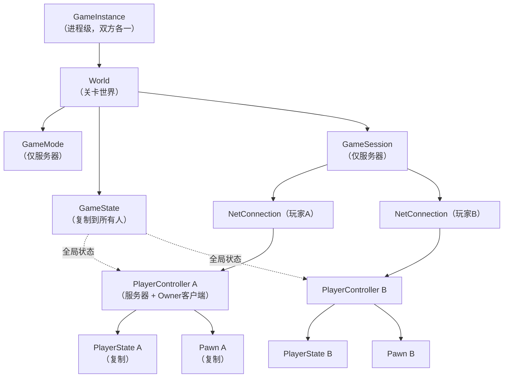
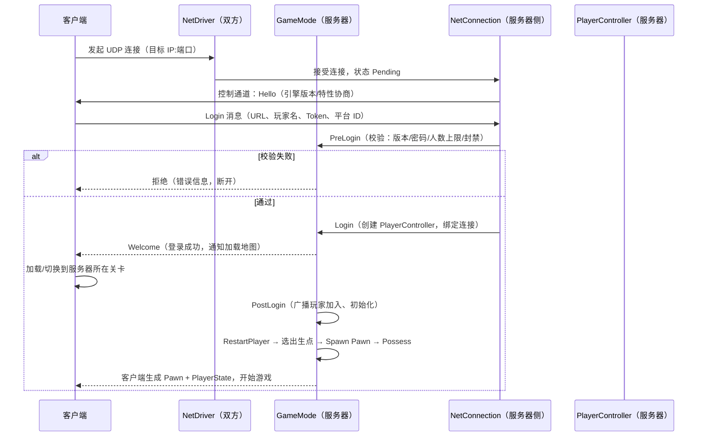
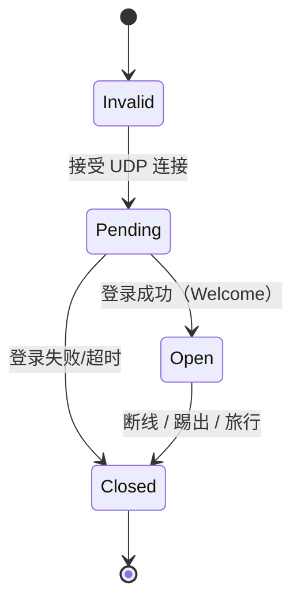

# 04 · 多人游戏框架与玩家状态

> 本篇是「06-网络同步」分类的第四篇，把前三篇的知识落到框架层面：
> 各类框架对象（GameMode / GameState / PlayerState / PlayerController / Pawn）在网络中扮演什么角色，
> 以及一个玩家从"点击连接"到"进入游戏操控角色"的完整流程。
> 适用版本：UE 5.0 ~ 5.5。

---

## 一、概述

UE 的多人游戏框架（Gameplay Framework）为"多人在线游戏"预置了一整套对象分工：

- **GameInstance**：进程级容器，客户端/服务器各有一个，不复制；
- **GameMode**：规则制定者，**只存在于服务器**；
- **GameState**：全局状态广播者，复制给所有人；
- **PlayerController**：玩家的"大脑/遥控器"，存在于服务器与所属客户端；
- **Pawn**：玩家在世界的化身（身体），复制；
- **PlayerState**：玩家的"档案卡"（名字/分数/队伍），复制给所有人；
- **GameSession**：会话管理（服务器）；
- **PlayerStart / SpectatorPawn / AIController**：配套对象。

理解这套分工是多人开发的必修课：**把数据放错对象**（例如把分数放 Pawn 上导致死亡后丢失、把规则放 GameState 上导致客户端也能改）是新手最常见的架构错误。

本篇先给出"对象 × 网络位置"总览，再逐个详解职责，最后用时序图完整还原连接与登录流程，并介绍 NetConnection 的管理细节与 Seamless Travel。

---

## 二、核心概念（速查表）

### 2.1 框架对象与网络分布

| 对象 | 服务器 | 客户端 | 是否复制 | 主要职责 |
| --- | --- | --- | --- | --- |
| `UGameInstance` | 有 | 有 | 否 | 进程级生命周期、会话（Session）管理 |
| `UWorld` | 有 | 有 | 否 | 关卡世界容器 |
| `AGameModeBase` | **仅有** | 无 | 否（不需要） | 规则、登录流程、Pawn 生成 |
| `AGameStateBase` | 有 | 有 | **是** | 全局状态：比赛阶段、倒计时、比分 |
| `APlayerController` | 有 | **仅 Owner 客户端有** | 部分（引用） | 输入、视角、HUD、RPC 收件箱 |
| `APawn` | 有 | 有 | **是** | 可被控制的化身 |
| `APlayerState` | 有 | 有 | **是** | 玩家公开信息：名字/分数/队伍 |
| `AGameSession` | 有 | 无 | 否 | 会话/房间管理（服务器） |
| `APlayerStart` | 有 | 有 | 否（关卡内静态） | 出生点 |
| `ASpectatorPawn` | 有 | 有 | 是 | 观战载体 |
| `AIController` | 有 | 无 | 否 | 驱动非玩家 Pawn |

### 2.2 连接相关

| 概念 | 说明 |
| --- | --- |
| `UNetDriver` | 网络驱动：监听/连接/收发 |
| `UNetConnection` | 服务器 ↔ 单个客户端的逻辑连接 |
| `APlayerController::GetNetConnection()` | 获取该玩家对应的连接 |
| `UGameInstance::GetLocalPlayers()` | 本地玩家列表 |
| `UGameplayStatics::GetPlayerController(World, 0)` | 按索引取玩家控制器 |
| `AGameModeBase::Login()` / `PostLogin()` | 登录流程回调 |
| `PreLogin()` | 登录前校验（白名单/踢人） |
| `RestartPlayer()` | 为玩家生成 Pawn 并附身 |
| Seamless Travel | 无缝切换地图（保留连接与控制器） |

---

## 三、原理详解

### 3.1 对象关系全景



### 3.2 GameMode：仅存在于服务器的规则对象

`AGameModeBase`（及子类 `AGameMode`）**只存在于服务器进程**，客户端进程里根本没有它的实例。职责：

- 定义默认类：`DefaultPawnClass`、`PlayerControllerClass`、`PlayerStateClass`、`GameStateClass`、`HUDClass`；
- 登录流程：`PreLogin` / `Login` / `PostLogin` / `Logout`；
- 玩家生成：`RestartPlayer` → `FindPlayerStart` → `SpawnDefaultPawnFor` → `FinishRestartPlayer`；
- 规则：胜负条件、比赛阶段（`MatchState`）、计时；
- 与 GameState 的关系：**GameMode 决定规则，GameState 广播状态**。GameMode 修改数据后，把需要公开的数据写进 GameState（复制属性），客户端从 GameState 读取。

> 关键认知：客户端代码里 `GetWorld()->GetAuthGameMode()` 返回空（客户端没有 GameMode）。客户端想要规则数据，只能通过 GameState 的复制属性。

### 3.3 GameState：复制到所有人的全局状态

- 每个 World 一个，服务器创建，**复制到所有客户端**；
- 存储全局性数据：比赛阶段（`MatchState`：WaitingToStart → InProgress → WaitingPostMatch → LeavingMap）、剩余时间、双方比分、全局环境状态；
- 客户端用 `GetWorld()->GetGameState<AMyGameState>()` 读取；
- `bReplicates = true`，属性用 `DOREPLIFETIME` 注册，客户端通过 `OnRep` 更新 UI。

### 3.4 PlayerController：玩家的大脑

**网络形态**：服务器上有完整实例，Owner 客户端上有本地实例；其他客户端**没有**该玩家的 PlayerController。

职责与网络要点：

- **输入**：输入只在 Owner 客户端处理（`EnableInput` / `DisableInput`）；服务器上的 PC 不处理键盘鼠标；
- **RPC 收件箱**：服务器 → 玩家的专属通知（Client RPC 的目标就是 PC）；
- **视角**：`SetViewTarget`、相机控制（仅客户端有意义）；
- **HUD/UI 归属**：UI 数据通常挂在 PC（Owner 可见）或 PlayerState（全员可见）；
- **网络判定**：`IsLocalController()`（客户端本地是否有这个 PC）、`IsLocalPlayerController()`、`GetNetConnection()`。

**Pawn 与 PC 的关系**：PC "附身（Possess）"一个 Pawn 后，Pawn 的输入、视角归属该 PC。客户端上 PC 的存在也决定了"哪些 RPC 可以发给这个玩家"。

### 3.5 Pawn：玩家的化身

- 服务器 Spawn 并 Possess，通过复制让所有客户端看到；
- 关键回调：`PossessedBy()`（服务器）、`OnRep_Controller()`（客户端收到 Controller 变化时）、`UnPossessed()`；
- 判定本地控制：`IsLocallyControlled()`（本客户端是否控制这个 Pawn）、`GetLocalRole()`；
- 移动、动画、碰撞等表现数据随 Pawn 复制；
- **注意**：Pawn 死亡/重生时会被销毁重建或 Respawn——不要把"跨重生需要保留的数据"放 Pawn 上（放 PlayerState）。

### 3.6 PlayerState：玩家的公开档案

- 每个玩家一个，服务器创建，**复制给所有客户端**（这样计分板能看到所有人）；
- 存放：玩家名、分数、击杀数、队伍、是否就绪等"公开个人信息"；
- 数据放置决策：

| 数据 | 放哪 | 原因 |
| --- | --- | --- |
| 名字/分数/队伍/等级 | PlayerState | 需要被所有人看到，且跨重生保留 |
| 弹药/准星/私人 UI 状态 | PlayerController 或 Pawn（`COND_OwnerOnly`） | 只有自己需要 |
| 比赛规则/全局倒计时 | GameState | 全局共享 |
| 服务器内部状态（匹配逻辑） | GameMode | 不需要同步 |

### 3.7 连接与登录流程



#### 3.7.1 握手细节（控制通道消息）

| 消息 | 方向 | 内容 |
| --- | --- | --- |
| `NMT_Hello` | 服务器→客户端 | 引擎版本、网络协议版本、是否加密等 |
| `NMT_Login` | 客户端→服务器 | URL（含地图、选项）、玩家名、平台 UniqueId、会话 Token |
| `NMT_Welcome` | 服务器→客户端 | 登录成功；客户端随后创建 PlayerController、加载地图 |
| `NMT_Failure` | 服务器→客户端 | 登录被拒（版本不符/密码错误/人数已满） |

#### 3.7.2 GameMode 登录回调链

```cpp
// 典型顺序（服务器侧）
1. PreLogin(Params, ErrorMessage)      // 能否进（校验版本/黑名单/人数）
2. Login(Params, ErrorMessage)         // 创建 PlayerController，返回它
3. PostLogin(PlayerController)         // 初始化玩家数据、广播加入
4. HandleStartingNewPlayer(PlayerController) // 触发 RestartPlayer
5. RestartPlayer(PlayerController)     // 找出生点、生成 Pawn、Possess
```

#### 3.7.3 登录后的客户端视角

客户端在收到 Welcome 后会：

1. 创建自己的 PlayerController（服务器已同步创建，客户端本地生成对应实例）；
2. 若需要，先加载/切换地图（非 Seamless 时通常先断开再重连，Seamless 时在后台加载）；
3. 服务器 `RestartPlayer` 生成的 Pawn 通过复制出现在客户端；
4. 客户端完成 `Possess` 相关初始化（相机、输入绑定、UI）。

### 3.8 NetConnection 管理细节

#### 3.8.1 连接状态机



#### 3.8.2 常用管理操作

- 获取连接：`APlayerController::GetNetConnection()`（服务器侧有效）；
- 踢出玩家：`UNetConnection::Close()`（服务器调用，需先通知客户端原因）；
- 人数限制：`AGameModeBase::MaxPlayers`、`GameSession` 的 `MaxPlayers`；
- 流量控制：服务器 `NetServerMaxTickRate`、连接 `MaxClientRate`（协商后的速率）；
- 断线处理：`AGameModeBase::Logout()`（服务器）、客户端 `UNetDriver` 断线回调 → `HandleDisconnect()`；
- 重连：客户端重新走登录流程；PlayerState 数据可按 `UniqueId` 恢复（需要服务端持久化）。

### 3.9 Seamless Travel（无缝切换地图）

- 普通 `ServerTravel`：所有客户端断开 → 重新连接 → 重新登录（会闪断）；
- **Seamless Travel**：服务器加载新地图时，客户端后台流送加载，**保留 NetConnection、PlayerController、PlayerState**，玩家几乎无感知；
- 配置：`GameMode->bUseSeamlessTravel = true`；
- 保留对象：`GetSeamlessTravelActorList()` 决定哪些 Actor 跨图保留；
- 过渡期间：客户端有"过渡 PlayerController"占位，`SwapPlayerControllers` 完成切换。

---

## 四、代码示例

### 4.1 自定义 GameMode：类配置 + 登录回调

```cpp
UCLASS()
class AMyGameMode : public AGameModeBase
{
    GENERATED_BODY()

public:
    AMyGameMode()
    {
        // 指定各类默认类（也可在蓝图/DefaultEngine.ini 覆盖）
        DefaultPawnClass = AMyCharacter::StaticClass();
        PlayerControllerClass = AMyPlayerController::StaticClass();
        PlayerStateClass = AMyPlayerState::StaticClass();
        GameStateClass = AMyGameState::StaticClass();
        bUseSeamlessTravel = true;
    }

    // 登录前校验：白名单 / 人数 / 版本（返回 FString 错误信息）
    virtual FString PreLogin(const FString& Options, const FString& Address,
        const FUniqueNetIdRepl& UniqueId, FString& ErrorMessage) override
    {
        FString Error = Super::PreLogin(Options, Address, UniqueId, ErrorMessage);
        if (!Error.IsEmpty())
        {
            return Error;
        }
        if (!ErrorMessage.IsEmpty())
        {
            return ErrorMessage;
        }

        // 示例：禁止观战期加入
        if (AMyGameState* GS = GetGameState<AMyGameState>())
        {
            if (GS->GetMatchState() == MatchState::WaitingToStart)
            {
                ErrorMessage = TEXT("比赛尚未开始，请稍候");
            }
        }

        // 示例：黑名单
        if (IsBanned(UniqueId))
        {
            ErrorMessage = TEXT("您已被禁止加入本服务器");
        }

        return ErrorMessage;
    }

    // 玩家加入完成：初始化
    virtual void PostLogin(APlayerController* NewPlayer) override
    {
        Super::PostLogin(NewPlayer);

        if (AMyPlayerState* PS = NewPlayer->GetPlayerState<AMyPlayerState>())
        {
            PS->SetPlayerName(NewPlayer->GetPlayerName()); // 复制到所有人
            PS->TeamId = AssignTeam(NewPlayer);            // 分配队伍
        }
    }

    // 玩家离开
    virtual void Logout(AController* Exiting) override
    {
        Super::Logout(Exiting);
        // 清理、广播离线
    }
};
```

### 4.2 PlayerState：跨重生保留的公开数据

```cpp
UCLASS()
class AMyPlayerState : public APlayerState
{
    GENERATED_BODY()

public:
    UPROPERTY(ReplicatedUsing = OnRep_Score, BlueprintReadOnly)
    int32 Score = 0;

    UPROPERTY(ReplicatedUsing = OnRep_TeamId, BlueprintReadOnly)
    int32 TeamId = 0;

    UFUNCTION()
    void OnRep_Score() { OnScoreChanged.Broadcast(Score); }

    UFUNCTION()
    void OnRep_TeamId() { OnTeamChanged.Broadcast(TeamId); }

    virtual void GetLifetimeReplicatedProps(TArray<FLifetimeProperty>& OutLifetimeProps) const override
    {
        Super::GetLifetimeReplicatedProps(OutLifetimeProps);
        DOREPLIFETIME(AMyPlayerState, Score);
        DOREPLIFETIME_CONDITION_NOTIFY(AMyPlayerState, TeamId, COND_None, REPNOTIFY_OnChanged);
    }

    // 服务器调用：加分（客户端请走 Server RPC 链）
    void AddScore(int32 Delta)
    {
        if (HasAuthority())
        {
            Score += Delta; // 自动复制，全员看到
        }
    }
};
```

### 4.3 GameState：全局状态广播

```cpp
UCLASS()
class AMyGameState : public AGameStateBase
{
    GENERATED_BODY()

public:
    UPROPERTY(ReplicatedUsing = OnRep_TimeRemaining, BlueprintReadOnly)
    float TimeRemaining = 300.f;

    UPROPERTY(Replicated, BlueprintReadOnly)
    int32 RedScore = 0;

    UPROPERTY(Replicated, BlueprintReadOnly)
    int32 BlueScore = 0;

    UFUNCTION()
    void OnRep_TimeRemaining() { OnClockUpdated.Broadcast(TimeRemaining); }

    virtual void GetLifetimeReplicatedProps(TArray<FLifetimeProperty>& OutLifetimeProps) const override
    {
        Super::GetLifetimeReplicatedProps(OutLifetimeProps);
        DOREPLIFETIME(AMyGameState, TimeRemaining);
        DOREPLIFETIME(AMyGameState, RedScore);
        DOREPLIFETIME(AMyGameState, BlueScore);
    }
};

// 服务器（GameMode）中推进状态：
// GameState->TimeRemaining -= DeltaSeconds;
// 客户端读取：
// AMyGameState* GS = GetWorld()->GetGameState<AMyGameState>();
```

### 4.4 PlayerController：RPC 与连接

```cpp
UCLASS()
class AMyPlayerController : public APlayerController
{
    GENERATED_BODY()

public:
    // 服务器 → Owner 客户端：UI 通知
    UFUNCTION(Client, Reliable)
    void ClientShowMessage(const FString& Message);
    void ClientShowMessage_Implementation(const FString& Message)
    {
        // 只在本客户端执行
        AddOnScreenMessage(Message);
    }

    // 客户端 → 服务器：请求重生
    UFUNCTION(Server, Reliable, WithValidation)
    void ServerRequestRespawn();
    bool ServerRequestRespawn_Validate() { return true; }
    void ServerRequestRespawn_Implementation()
    {
        if (AMyGameMode* GM = GetWorld()->GetAuthGameMode<AMyGameMode>())
        {
            GM->RestartPlayer(this);
        }
    }

    // 服务器侧获取连接信息
    void DebugConnection() const
    {
        if (HasAuthority())
        {
            if (UNetConnection* Conn = GetNetConnection())
            {
                UE_LOG(LogTemp, Log, TEXT("Conn Addr: %s, State: %d"),
                    *Conn->RemoteAddr->ToString(true), (int32)Conn->GetConnectionState());
            }
        }
    }
};
```

### 4.5 Pawn 的 Possess 回调

```cpp
UCLASS()
class AMyCharacter : public ACharacter
{
    GENERATED_BODY()

public:
    // 服务器：被附身时
    virtual void PossessedBy(AController* NewController) override
    {
        Super::PossessedBy(NewController);

        // 服务器初始化：绑定 GameMode 相关逻辑、初始化能力
        if (AMyPlayerState* PS = GetPlayerState<AMyPlayerState>())
        {
            ApplyTeamVisuals(PS->TeamId);
        }
    }

    // 客户端：收到 Controller 复制（服务器 Possess 同步过来）时
    virtual void OnRep_Controller() override
    {
        Super::OnRep_Controller();

        if (IsLocallyControlled())
        {
            // 本地玩家：绑定输入、相机、UI
            SetupPlayerInput();
            AttachCamera();
        }
    }
};
```

### 4.6 踢出与断线处理

```cpp
// 服务器：踢出指定玩家
void AMyGameMode::KickPlayer(APlayerController* Target, const FString& Reason)
{
    if (!Target)
    {
        return;
    }

    // 先通知客户端原因（可选）
    if (AMyPlayerController* PC = Cast<AMyPlayerController>(Target))
    {
        PC->ClientShowMessage(FString::Printf(TEXT("您已被移出服务器：%s"), *Reason));
    }

    // 关闭连接：触发 Logout → 清理
    if (UNetConnection* Conn = Target->GetNetConnection())
    {
        Conn->Close();
    }
}
```

---

## 五、最佳实践

1. **数据放对对象**：跨重生保留且全员可见 → PlayerState；仅 Owner 可见 → PlayerController/Pawn + Owner 条件；全局规则 → GameState；服务器私有 → GameMode。
2. **客户端永远读不到 GameMode**：需要规则数据时从 GameState 读；不要在客户端代码里写 `GetAuthGameMode()` 并指望有值。
3. **输入只发生在 Owner 客户端**：输入回调里先判断 `IsLocalController()` / `IsLocallyControlled()`，避免服务器和模拟代理重复执行输入逻辑。
4. **登录校验尽量前置**：`PreLogin` 做版本/黑名单/人数校验，`Login` 创建控制器，`PostLogin` 做玩家初始化——职责别混。
5. **Server RPC 参数校验**（延续 02 篇）：登录后的每个上行请求（重生、改名、购买）都要校验，PlayerState 的公开字段防篡改。
6. **PlayerController 的 Client RPC 是"单发"通道**：不要用它做高频数据流（高频用属性 + Owner 条件）；它适合事件通知。
7. **Seamless Travel 要处理过渡状态**：过渡期 PC 无 Pawn、UI 要进加载状态；`GetSeamlessTravelActorList` 里决定跨图保留的对象。
8. **断线重连设计**：客户端侧 `HandleDisconnect` 回到主菜单；服务器侧 `Logout` 清理；玩家数据恢复依赖 UniqueId（数据库/会话服务）。
9. **调试工具**：`open IP:端口` 直连、`stat Net` 看带宽、`net.TogglePause` 暂停网络、`showdebug net` 可视化连接。
10. **登录消息都在控制通道**：控制通道是可靠通道，但不要在上面做业务（业务走 Actor 通道的 RPC/属性）。

---

## 六、常见问题 FAQ

**Q1：为什么客户端访问 GameMode 是空指针？**
GameMode 只存在于服务器（`GetAuthGameMode` 只在服务器有值）。客户端应通过 GameState 获取规则数据；服务器才用 GameMode。

**Q2：PlayerController 在哪些机器上存在？**
服务器上有每个玩家的完整 PC；每个客户端只有**自己**的 PC（别人的 PC 不存在于你的机器上）。所以"看到其他玩家的视角/UI"不可能也不应该——那是他们 PC 的私有数据。

**Q3：分数放 Pawn 上，角色死了就丢了，怎么办？**
把跨重生数据放 PlayerState（复制、跨重生保留）。Pawn 只放"当前身体"的状态。

**Q4：怎么判断当前代码在服务器还是客户端？**
`HasAuthority()`（对象级）、`GetNetMode()`（进程级）、`IsLocallyControlled()`（Pawn 视角）、`IsLocalController()`（PC 视角）。注意 `HasAuthority()` 在服务器对所有 Actor 为 true，在客户端仅对"客户端也权威"的对象（如纯本地 Actor）为 true。

**Q5：客户端能改自己的 PlayerState 吗？**
本地修改只影响本地副本，服务器副本不受影响（下次复制会覆盖）。正确做法：客户端发 Server RPC → 服务器校验 → 修改 → 复制下发。

**Q6：登录时"版本不符"是怎么判定的？**
握手时 `NMT_Hello` 携带引擎/网络版本，服务器与客户端不匹配即拒绝（`NMT_Failure`）。自定义校验（如构建号）可在 `PreLogin` 中通过 URL 参数（`?Build=123`）实现。

**Q7：人数满了怎么处理？**
`PreLogin` 中判断 `NumPlayers >= MaxPlayers` 返回错误字符串；或由 `GameSession` 的会话规则处理。注意监听服务器中主机也算一个玩家。

**Q8：Seamless Travel 和普通 Travel 怎么选？**
同地图内或跨地图不想闪断 → Seamless；需要完全重来（如回主菜单）→ 普通 `ServerTravel` 或客户端 `ClientTravel`。Seamless 需要保证保留对象的逻辑能安全跨图。

**Q9：掉线后重连，分数还在吗？**
默认不在了（PlayerState 随会话销毁）。要保留需要：① 服务端持久化（数据库/存档）；② 重连时按 UniqueId 恢复 PlayerState。纯内存服务器无法跨会话保留。

**Q10：为什么别人看到我的名字是"Player 1"？**
`PlayerState` 的名字在登录/`PostLogin` 时设置（默认用 URL 里的名字）。若在客户端本地改名，需要走 Server RPC 让服务器更新并复制。

---

## 七、关联阅读

- 本分类：[01-网络架构与复制基础.md](01-网络架构与复制基础.md) —— NetConnection/通道与连接状态机（本篇的底层基础）
- 本分类：[02-RPC与属性同步.md](02-RPC与属性同步.md) —— PlayerState/GameState 的复制注册与 OnRep
- 本分类：[03-客户端预测与延迟补偿.md](03-客户端预测与延迟补偿.md) —— Pawn 本地控制与移动预测
- 本仓库：[01-引擎基础](../01-引擎基础/README.md) —— Actor 生命周期、Gameplay 框架总览
- 官方文档：Unreal Engine 5 Gameplay Framework（多人部分）、Seamless Travel、Networking/Connection 章节
- 引擎源码：`Engine/Source/Runtime/Engine/Private/GameModeBase.cpp`、`PlayerController.cpp`、`NetConnection.cpp`、`NetDriver.cpp`
- 参考项目：Epic 的 Lyra（登录/大厅/会话与框架对象的综合范例）
